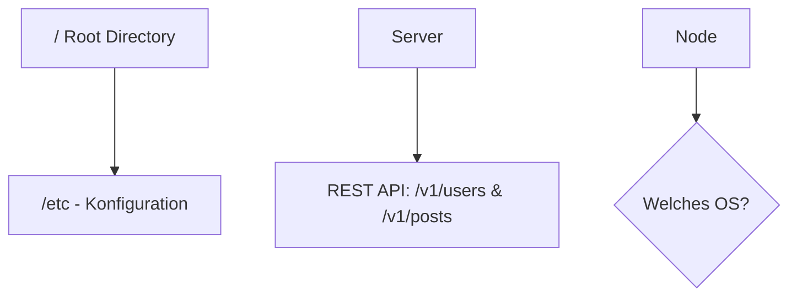

# Mermaid Validator Skill

Stellt sicher, dass alle Mermaid-Diagramme (` ```mermaid `) in den Markdown-Dateien unter `docs/` fehlerfrei im Browser rendern. Die Diagramme laufen über `pymdownx.superfences` (siehe `mkdocs.yml`).

## Regel: Sonderzeichen in Knoten immer quoten

Jede Knoten- oder Kantenbeschriftung mit Sonderzeichen **muss in doppelte Anführungszeichen `["..."]` gesetzt werden**, sonst wirft Mermaid.js im Browser einen Parser-Fehler.

Typische Problemzeichen: Pfad-Slashes (`/`), Doppelpunkte (`:`), Kaufmännisches Und (`&`), runde Klammern (`(` `)`), Fragezeichen (`?`), mathematische Symbole (`+`, `=`, `→`), Emojis.

❌ **Falsch:**
```mermaid
graph TD
    Root[/ Root Directory] --> etc[/etc - Konfiguration]
    Server --> API[REST API: /v1/users & /v1/posts]
    Node --> Choice{Welches OS?}
```

✅ **Richtig:**


## Formen & Syntax

- Standard-Knoten: `ID["Knoten-Text"]`
- Entscheidung (Rhombus): `ID{"Frage?"}`
- Zylinder (DB): `ID[("Datenbank")]`
- Stadion (abgerundet): `ID(["Start / Ende"])`
- Kantenbeschriftungen ebenfalls quoten: `A -->|"Text"| B`

## Prüfvorgehen

Es gibt kein Validierungsskript in diesem Repository (der in älteren `.gemini`-Notizen referenzierte `check_mermaid.py` lag außerhalb des Repos und existiert hier nicht). Stattdessen:

1. Alle ` ```mermaid ` -Blöcke in geänderten/neuen `.md`-Dateien durchsuchen, z. B.:
   ```bash
   grep -rn '```mermaid' docs/
   ```
2. Jede Knoten- und Kantenbeschriftung manuell auf die oben genannten Problemzeichen prüfen und ggf. in `["..."]` fassen.
3. `.venv/bin/zensical build` ausführen — Zensical selbst prüft nur den Markdown-/Fence-Syntax, nicht das Mermaid-Rendering im Browser. Bei Unsicherheit die Seite im Vorschau-Server (`zensical serve`) öffnen und das Diagramm visuell kontrollieren.
