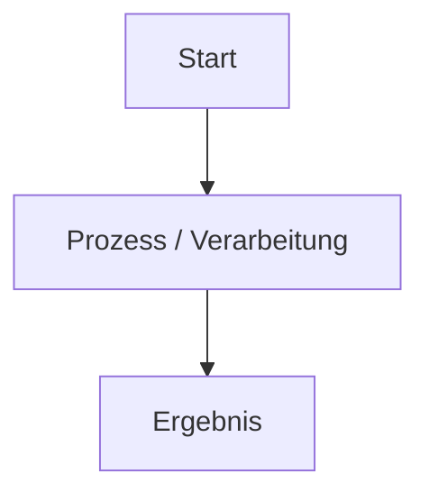

# Zensical Docs Skill

Unterstützt das Erstellen, Prüfen und Veröffentlichen von Dokumentationsseiten für dieses Repository. Siehe auch `CLAUDE.md` im Projekt-Root für die vollständige Befehlsreferenz — dieser Skill fasst die Workflows praxisnah zusammen.

**Niemals `mkdocs build` / `mkdocs serve` verwenden** — das Projekt läuft auf Zensical (`.venv/bin/zensical …`).

## Die 3 Haupt-Workflows

1. **Vorschau-Server starten** (Live-Reload)
   ```bash
   .venv/bin/zensical serve
   ```
   Läuft auf `http://127.0.0.1:8000`. Im Hintergrund starten, wenn parallel weitergearbeitet werden soll.

2. **Vollständige Systemprüfung (vor jedem Commit)**
   ```bash
   .venv/bin/zensical build
   python3 .gemini/scripts/check_orphaned_files.py
   ```
   Für eine tiefergehende Prüfung (Build + Navigation + Links + Mermaid-Syntax in einem strukturierten Bericht) den `doc-checker`-Subagenten nutzen (siehe `.claude/agents/doc-checker.md`).
   Mermaid-Syntaxregeln: siehe Skill `mermaid-validator`.

   Hinweis: Der Git-Hook `.gemini/hooks/pre-commit` führt `zensical build` bereits automatisch vor jedem Commit aus und bricht bei Fehlern ab.

3. **Live-Deployment**
   ```bash
   npm run ver
   ```
   Baut mit Zensical und pusht `site/` in den `gh-pages`-Branch. Das ist eine sichtbare, kaum umkehrbare Aktion (öffentliches Deployment) — vor Ausführung Bestätigung des Nutzers einholen, sofern nicht ausdrücklich angewiesen.

## Neue Seite anlegen — Checkliste

1. Markdown-Datei unter `docs/<bereich>/<name>.md` anlegen (kebab-case Dateiname).
2. Passenden Eintrag im `nav:`-Baum in `mkdocs.yml` ergänzen — sonst gilt die Seite als "verwaist" (siehe `check_orphaned_files.py`) und taucht nicht in der Navigation auf.
3. Interne Links relativ setzen, z. B. `[Seite](../ordner/seite.md)`.
4. Admonitions auf Deutsch mit Material-Syntax: `!!! tip "Tipp"`, `!!! warning "Achtung"`, `!!! note "Hinweis"`.
5. Mermaid-Diagramme nach den Regeln aus dem `mermaid-validator`-Skill quoten.
6. `.venv/bin/zensical build` fehlerfrei durchlaufen lassen, bevor committet wird.

## Vorlage für neue Markdown-Seiten

```markdown
# [Titel der Seite]

[Kurze Einleitung / Zusammenfassung]

---

## Übersicht

!!! note "Hinweis"
    [Beschreibung oder Kontext]

!!! tip "Tipp"
    [Empfehlungen]

!!! warning "Achtung"
    [Wichtige Warnung]

---

## Ablauf / Architektur



---

## Konfiguration

=== "Linux / Bash"
    ```bash
    echo "Beispiel"
    ```

=== "Windows / PowerShell"
    ```powershell
    Write-Host "Beispiel"
    ```

---

## Verwandte Themen
- [Zurück zur Übersicht](../index.md)
```
