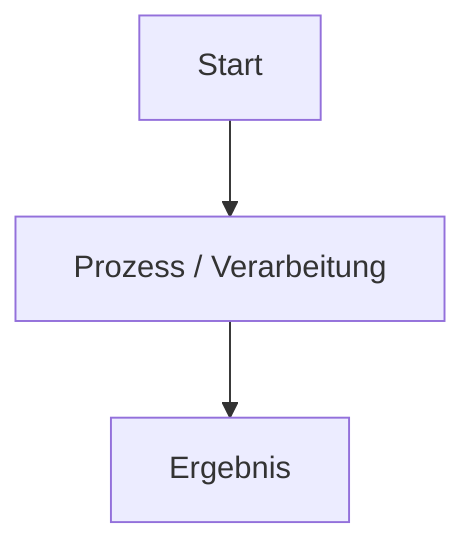

# [Titel der Seite]

[Kurze Einleitung / Zusammenfassung]

---

## Übersicht

!!! note "Hinweis"
    [Beschreibung oder Kontext]

!!! tip "Tipp"
    [Empfehlungen]

!!! warning "Achtung"
    [Wichtige Warnung]

---

## Ablauf / Architektur



---

## Konfiguration

=== "Linux / Bash"
    ```bash
    echo "Beispiel"
    ```

=== "Windows / PowerShell"
    ```powershell
    Write-Host "Beispiel"
    ```

---

## Verwandte Themen
- [Zurück zur Übersicht](../index.md)
