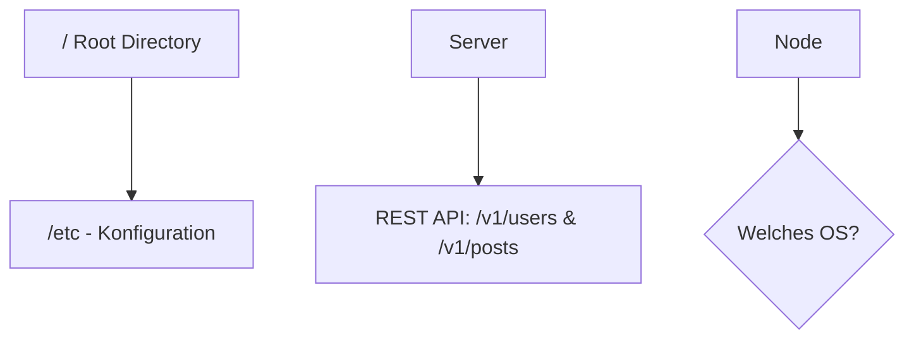

# Mermaid Validator Skill

Dieser Skill stellt sicher, dass alle Mermaid-Diagramme (` ```mermaid `) in den Markdown-Dateien unter `docs/` fehlerfrei im Browser rendern.

## 📐 Regeln für Mermaid-Diagramme

### 1. Quotierung von Sonderzeichen in Knoten
Jede Knotenbeschriftung, die Sonderzeichen enthält, **muss in doppelte Anführungszeichen `["..."]` gesetzt werden**:

❌ **Falsch (verursacht Parser-Fehler in Mermaid.js):**
```mermaid
graph TD
    Root[/ Root Directory] --> etc[/etc - Konfiguration]
    Server --> API[REST API: /v1/users & /v1/posts]
    Node --> Choice{Welche OS?}
```

✅ **Richtig:**


### 2. Typische Problemzeichen
- Pfad-Slashes (`/`)
- Doppelpunkte (`:`)
- Kaufmännisches Und (`&`)
- Runde Klammern (`(` und `)`)
- Fragezeichen (`?`) und Mathematische Symbole (`+`, `=`, `→`)
- Emojis (`🖥️`, `🤖`, `⚙️`)

### 3. Formen & Syntax
- Standard-Knoten: `ID["Knoten-Text"]`
- Entscheidung (Rhombus): `ID{"Frage?"}`
- Zylinder (DB): `ID[("Datenbank")]`
- Stadion (Abgerundet): `ID(["Start / Ende"])`

## 🛠️ Python Validation Script

Verwende das Skript `scratch/check_mermaid.py` zum Prüfen aller Markdown-Dateien im Projekt.
