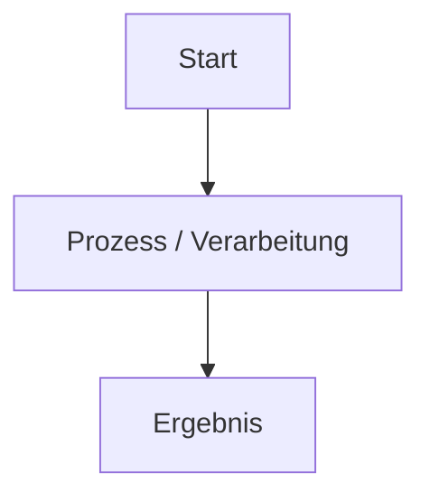

# Zensical Docs Skill

Dieser Skill unterstützt das automatische Erstellen, Prüfen und Veröffentlichen von Dokumentationsseiten für Zensical.

## 🚀 Die 3 Haupt-Workflows

1. **Vorschau-Server starten**:
   - `.venv/bin/zensical serve` (im Hintergrund starten für Live-Preview auf `http://localhost:8000`).

2. **Vollständige Systemprüfung (Pre-Deployment Check)**:
   - `.venv/bin/zensical build`
   - `python3 .gemini/scripts/check_orphaned_files.py`
   - `python3 /home/thorsten/.gemini/antigravity-cli/brain/4a2625b1-74f6-4160-bea0-9025835ba466/scratch/check_mermaid.py`
   - `invoke_subagent` (Role: `Doc-Checker`)

3. **Live-Deployment**:
   - `npm run ver` (Veröffentlicht den Stand auf GitHub Pages).

---

## 📝 Vorlage für neue Markdown-Seiten

```markdown
# [Titel der Seite]

[Kurze Einleitung / Zusammenfassung]

---

## 🚀 Übersicht

!!! note "Hinweis"
    [Beschreibung oder Kontext]

!!! tip "Tipp"
    [Empfehlungen]

!!! warning "Achtung"
    [Wichtige Warnung]

---

## 📊 Ablauf / Architektur



---

## 🛠️ Konfiguration

=== "Linux / Bash"
    ```bash
    echo "Beispiel"
    ```

=== "Windows / PowerShell"
    ```powershell
    Write-Host "Beispiel"
    ```

---

## 🔗 Verwandte Themen
- [Zurück zur Übersicht](../index.md)
```

---

## 📐 Mermaid-Diagramme Regeln
- **Knoten-Beschriftungen immer quoten**: Sobald ein Knotentext Sonderzeichen (`/`, `:`, `&`, `(`, `)`, `?`, `+`, Emojis) enthält, MUSS er in doppelte Anführungszeichen gefasst werden (z. B. `Root["/ Root Directory"]` statt `Root[/ Root Directory]`).
- **Verbindungsbeschriftungen**: Beschriftungen an Pfeilen ebenfalls sauber angeben (`A -->|Text| B`).

---

## 🔍 Prüfliste vor dem Deployment

1. **Datei ablegen**: `docs/<bereich>/<name>.md`
2. **Navigation eintragen**: `mkdocs.yml` (`nav:` Section)
3. **Mermaid-Syntax prüfen**: Alle Knotentexte mit Sonderzeichen gekapselt (`["..."]`)
4. **Build-Test**: `.venv/bin/zensical build`
5. **Verwaiste Dateien prüfen**: `python3 .gemini/scripts/check_orphaned_files.py`
6. **Links prüfen**: Alle relativen Pfade auf Gültigkeit prüfen
7. **Git Commit**: `git commit -m "docs: <beschreibung>"`
8. **Deployment**: `npm run ver`
