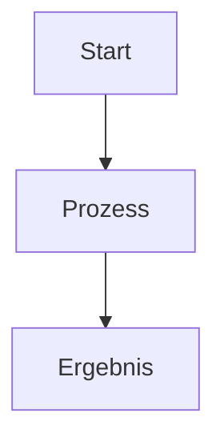

# Zensical Docs Skill

Dieser Skill unterstützt das automatische Erstellen und Validieren von Dokumentationsseiten für Zensical.

## 📝 Vorlage für neue Markdown-Seiten

```markdown
# [Titel der Seite]

[Kurze Einleitung / Zusammenfassung]

---

## 🚀 Übersicht

!!! note "Hinweis"
    [Beschreibung oder Kontext]

!!! tip "Tipp"
    [Empfehlungen]

!!! warning "Achtung"
    [Wichtige Warnung]

---

## 📊 Ablauf / Architektur



---

## 🛠️ Konfiguration

=== "Linux / Bash"
    ```bash
    echo "Beispiel"
    ```

=== "Windows / PowerShell"
    ```powershell
    Write-Host "Beispiel"
    ```

---

## 🔗 Verwandte Themen
- [Zurück zur Übersicht](../index.md)
```

## 🔍 Prüfliste vor dem Deployment

1. **Datei ablegen**: `docs/<bereich>/<name>.md`
2. **Navigation eintragen**: `mkdocs.yml` (`nav:` Section)
3. **Build-Test**: `.venv/bin/zensical build`
4. **Links prüfen**: Alle relativen Pfade auf Gültigkeit prüfen
5. **Git Commit**: `git commit -m "docs: <beschreibung>"`
