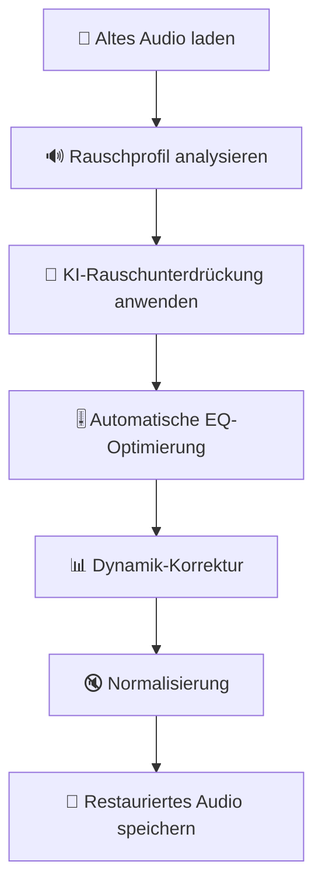
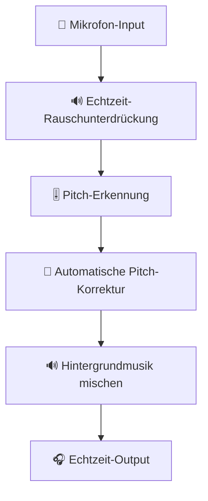
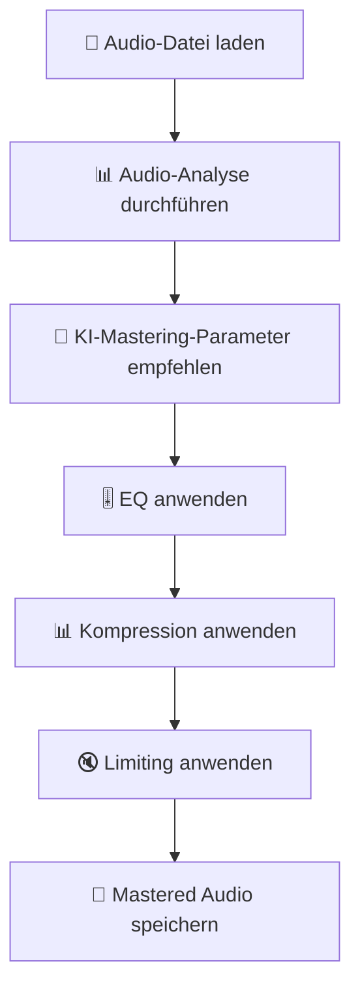
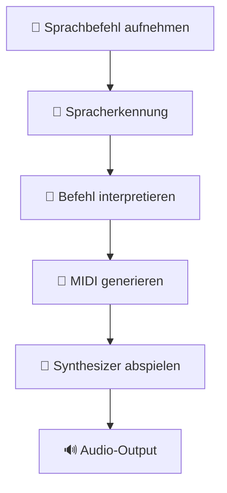

# Audio-Signalverarbeitung mit KI: Neuronale Netze für Klang

Wie Deep Learning die Audio-Signalverarbeitung revolutioniert – von Rauschunterdrückung über Sprachsynthese bis zu Musikgenerierung und Echtzeit-Effekten.

---

## 🎯 Einführung: KI in der Audio-Signalverarbeitung

### Warum KI für Audio-Processing?

Traditionelle Audio-Signalverarbeitung (DSP) nutzt mathematische Algorithmen. KI erklärt Audio-Signale auf eine andere Weise – durch gelernte Muster aus Daten:

| Anwendung | Traditionelle DSP | KI-Ansatz |
|-----------|-------------------|-----------|
| **Rauschunterdrückung** | Spektralsubtraktion, Wiener-Filter | Neuronale Netze (CNN, RNN) |
| **Spracherkennung** | HMM, GMM | Deep Neural Networks (DNN) |
| **Sprachsynthese** | Concatenative Synthese, Formant-Synthese | Tacotron, WaveNet |
| **Musikgenerierung** | Sinus-Synthese, FM-Synthese | Audio-Transformer, Diffusion |
| **Source Separation** | ICA, Beamforming | U-Net, Transformer |
| **Audio-Enhancement** | EQ, Kompression | Neuronale Filter |

### Vorteile von KI-basierter Audio-Verarbeitung

| Vorteil | Beschreibung | Beispiel |
|---------|--------------|----------|
| **Adaptivität** | Passt sich automatisch an verschiedene Signale an | Rauschunterdrückung für verschiedene Umgebungen |
| **Komplexitätshandhabung** | Kann hochkomplexe nichtlineare Zusammenhänge lernen | Sprachsynthese mit Emotionen |
| **Echtzeitfähigkeit** | Optimierte Modelle für Echtzeit-Anwendungen | Live-Rauschunterdrückung |
| **Generalisierung** | Funktioniert mit unbekannten Signalen | Universal-Sprachmodelle |
| **Qualität** | Erreicht oft bessere Ergebnisse als traditionelle Methoden | Hochwertige Sprachsynthese |

---

## 🔬 Grundlagen der Audio-Signalverarbeitung

### Audio-Signal-Darstellung

#### Zeitbereich vs. Frequenzbereich

```python
import numpy as np
import matplotlib.pyplot as plt
from scipy.io import wavfile
from scipy import signal

# Audio-Datei laden
sample_rate, audio = wavfile.read('audio.wav')

# Mono konvertieren (falls Stereo)
if len(audio.shape) > 1:
    audio = audio[:, 0]  # Linker Kanal

# Normalisieren
audio = audio.astype(np.float32) / np.max(np.abs(audio))

# Zeitbereich-Darstellung
time = np.arange(len(audio)) / sample_rate
plt.figure(figsize=(12, 4))
plt.plot(time[:1000], audio[:1000])  # Erste 1000 Samples
plt.title('Audio-Signal im Zeitbereich')
plt.xlabel('Zeit (s)')
plt.ylabel('Amplitude')
plt.grid(True)
plt.show()
```

#### Fourier-Transformation

```python
# Fourier-Transformation
n = len(audio)
yf = np.fft.rfft(audio)
xf = np.linspace(0, sample_rate/2, n//2 + 1)

# Spektrum darstellen
plt.figure(figsize=(12, 4))
plt.plot(xf, np.abs(yf))
plt.title('Audio-Spektrum (Fourier-Transformation)')
plt.xlabel('Frequenz (Hz)')
plt.ylabel('Amplitude')
plt.xlim(0, 5000)  # Bis 5 kHz
plt.grid(True)
plt.show()
```

#### Spektrogramm

```python
# Spektrogramm erstellen
f, t, Sxx = signal.spectrogram(audio, sample_rate, nperseg=1024)

plt.figure(figsize=(12, 6))
plt.pcolormesh(t, f, 10 * np.log10(Sxx + 1e-10), shading='gouraud', cmap='viridis')
plt.colorbar(label='Intensität (dB)')
plt.title('Spektrogramm')
plt.xlabel('Zeit (s)')
plt.ylabel('Frequenz (Hz)')
plt.ylim(0, 5000)  # Bis 5 kHz
plt.show()
```

#### Mel-Spektrogramm

```python
import librosa
import librosa.display

# Mel-Spektrogramm mit Librosa
y, sr = librosa.load('audio.wav', sr=None)
S = librosa.feature.melspectrogram(y=y, sr=sr, n_mels=128)

plt.figure(figsize=(12, 6))
librosa.display.specshow(librosa.power_to_db(S, ref=np.max), 
                         y_axis='mel', x_axis='time', sr=sr)
plt.colorbar(format='%+2.0f dB')
plt.title('Mel-Spektrogramm')
plt.show()
```

---

## 🤖 KI-Architekturen für Audio

### Convolutional Neural Networks (CNN)

CNNs sind ideal für die Verarbeitung von Spektrogrammen und anderen 2D-Darstellungen von Audio.

#### CNN für Audio-Klassifikation

```python
import tensorflow as tf
from tensorflow.keras import layers, models

def build_audio_cnn(input_shape=(128, 128, 1), num_classes=10):
    """CNN für Audio-Klassifikation (z.B. von Spektrogrammen)."""
    
    model = models.Sequential([
        # Convolutional Layers
        layers.Conv2D(32, (3, 3), activation='relu', input_shape=input_shape),
        layers.BatchNormalization(),
        layers.MaxPooling2D((2, 2)),
        
        layers.Conv2D(64, (3, 3), activation='relu'),
        layers.BatchNormalization(),
        layers.MaxPooling2D((2, 2)),
        
        layers.Conv2D(128, (3, 3), activation='relu'),
        layers.BatchNormalization(),
        layers.MaxPooling2D((2, 2)),
        
        layers.Conv2D(256, (3, 3), activation='relu'),
        layers.BatchNormalization(),
        layers.MaxPooling2D((2, 2)),
        
        # Flatten und Dense Layers
        layers.Flatten(),
        layers.Dense(512, activation='relu'),
        layers.Dropout(0.5),
        layers.Dense(num_classes, activation='softmax')
    ])
    
    model.compile(
        optimizer='adam',
        loss='categorical_crossentropy',
        metrics=['accuracy']
    )
    
    return model

# Modell erstellen
model = build_audio_cnn()
model.summary()
```

---

### Recurrent Neural Networks (RNN/LSTM)

RNNs eignen sich für sequentielle Audio-Daten wie Sprachsignale.

#### LSTM für Audio-Analyse

```python
def build_audio_lstm(input_shape=(100, 128), num_classes=10):
    """LSTM für sequentielle Audio-Daten."""
    
    model = models.Sequential([
        # LSTM Layers
        layers.LSTM(256, return_sequences=True, input_shape=input_shape),
        layers.BatchNormalization(),
        layers.Dropout(0.2),
        
        layers.LSTM(256, return_sequences=True),
        layers.BatchNormalization(),
        layers.Dropout(0.2),
        
        layers.LSTM(128),
        layers.BatchNormalization(),
        layers.Dropout(0.2),
        
        # Dense Layers
        layers.Dense(64, activation='relu'),
        layers.Dropout(0.5),
        layers.Dense(num_classes, activation='softmax')
    ])
    
    model.compile(
        optimizer='adam',
        loss='categorical_crossentropy',
        metrics=['accuracy']
    )
    
    return model

# Modell erstellen
model = build_audio_lstm()
model.summary()
```

---

### Transformer für Audio

Transformer-Architekturen haben die Audio-Verarbeitung revolutioniert, insbesondere für lange Sequenzen.

#### Audio-Transformer

```python
from tensorflow.keras.layers import Input, Dense, MultiHeadAttention, LayerNormalization, Dropout
from tensorflow.keras.models import Model

def transformer_encoder(inputs, head_size, num_heads, ff_dim, dropout=0):
    """Transformer Encoder Block."""
    # Self-Attention
    x = MultiHeadAttention(
        key_dim=head_size, num_heads=num_heads, dropout=dropout
    )(inputs, inputs)
    x = Dropout(dropout)(x)
    x = LayerNormalization(epsilon=1e-6)(x + inputs)
    
    # Feed-Forward Network
    y = Dense(ff_dim, activation="relu")(x)
    y = Dense(inputs.shape[-1])(y)
    y = Dropout(dropout)(y)
    y = LayerNormalization(epsilon=1e-6)(x + y)
    
    return y

def build_audio_transformer(input_shape, head_size, num_heads, ff_dim, 
                            num_transformer_blocks, num_classes):
    """Audio-Transformer-Modell."""
    inputs = Input(shape=input_shape)
    x = inputs
    
    # Positions-Embedding hinzufügen (wird hier vereinfacht)
    # In einer echten Implementierung würde man hier Positions-Embeddings hinzufügen
    
    for _ in range(num_transformer_blocks):
        x = transformer_encoder(x, head_size, num_heads, ff_dim)
    
    # Global Average Pooling
    x = layers.GlobalAveragePooling1D()(x)
    
    # Classification Head
    outputs = Dense(num_classes, activation="softmax")(x)
    
    return Model(inputs=inputs, outputs=outputs)

# Modell erstellen
model = build_audio_transformer(
    input_shape=(100, 128),  # 100 Zeitschritte, 128 Features
    head_size=128,
    num_heads=8,
    ff_dim=512,
    num_transformer_blocks=6,
    num_classes=10
)
model.summary()
```

---

## 🎙️ Sprachverarbeitung mit KI

### Automatische Spracherkennung (ASR)

#### Whisper: State-of-the-Art ASR

```bash
# Whisper installieren
pip install git+https://github.com/openai/whisper.git

# Alternativ: Whisper.cpp für bessere Performance
git clone https://github.com/ggerganov/whisper.cpp.git
cd whisper.cpp
make
```

#### Whisper mit Python

```python
import whisper

# Modell laden (verschiedene Größen verfügbar: tiny, base, small, medium, large)
model = whisper.load_model("base")

# Audio-Datei transkribieren
result = model.transcribe("audio.wav", language="de")

print("Erkannter Text:")
print(result["text"])

print("\nSegmentierte Ergebnisse:")
for segment in result["segments"]:
    print(f"{segment['start']:.2f}s - {segment['end']:.2f}s: {segment['text']}")
```

#### Whisper.cpp (C++ für bessere Performance)

```bash
# Modell herunterladen
./download-ggml-model.sh base

# Audio transkribieren
./main -f audio.wav -m models/ggml-base.bin -l de -otxt

# Parameter:
# -f: Input-Datei
# -m: Modell-Datei
# -l: Sprache (de = Deutsch, en = Englisch)
# -otxt: Output als Textdatei
# -ovtt: Output als VTT (WebVTT)
# -osrt: Output als SRT (SubRip)
# -pp: Token-Wahrscheinlichkeiten anzeigen
```

---

### Sprachsynthese (TTS)

#### Coqui TTS

```bash
# Coqui TTS installieren
git clone https://github.com/coqui-ai/TTS.git
cd TTS
pip install -e .
```

#### TTS mit Python

```python
from TTS.api import TTS

# Modell laden (verschiedene Modelle verfügbar)
tts = TTS(model_name="tts_models/de/ufth/xttsv2", progress_bar=False)

# Text zu Sprache
tts.tts_to_file(
    text="Hallo, dies ist ein Test der KI-Sprachsynthese.",
    file_path="output.wav",
    speaker=tts.speakers[0]  # Sprecher auswählen
)
```

#### Kokoro-ONNX: Ultraschnelle TTS

```bash
# Kokoro-ONNX installieren
pip install kokoro-onnx
```

```python
from kokoro import Kokoro

# Modell laden
model = Kokoro()

# Text zu Sprache
wav = model.text_to_wav("Hallo Welt", speaker_id=0, speed=1.0)

# Speichern
import soundfile as sf
sf.write("output.wav", wav, 24000)  # 24 kHz Sample-Rate
```

---

## 🎵 Musikverarbeitung mit KI

### Musikgenerierung

#### AudioCraft / MusicGen

**MusicGen** von Meta ist ein State-of-the-Art-Modell für Musikgenerierung aus Textbeschreibungen.

```bash
# AudioCraft installieren
pip install -U audiocraft
```

```python
from audiocraft.models import MusicGen
from audiocraft.utils.notebook import display_audio

# Modell laden
model = MusicGen.get_pretrained('facebook/musicgen-small')

# Generation-Parameter
model.set_generation_params(duration=8)  # 8 Sekunden

# Musik generieren
wav = model.generate([
    "Ein entspannendes Klavierstück mit sanften Melodien",
    "Energetischer Rock mit E-Gitarre und Schlagzeug"
])

# Speichern
for i, audio in enumerate(wav):
    sf.write(f"generated_music_{i}.wav", audio, model.sample_rate)
```

#### Riffusion: Musikgenerierung mit Diffusion

```bash
# Riffusion installieren
pip install riffusion
```

```python
from riffusion import Riffusion

# Modell laden
model = Riffusion()

# Musik generieren
spectrogram = model.generate(
    prompt="Jazz-Piano mit Walking Bass",
    negative_prompt="schlechte Qualität, verzerrt",
    steps=50
)

# Spektrogramm zu Audio konvertieren
import torchaudio
waveform = model.spectrogram_to_waveform(spectrogram)
torchaudio.save("generated_jazz.wav", waveform, model.sample_rate)
```

---

### Source Separation

#### Demucs: State-of-the-Art Source Separation

```bash
# Demucs installieren
pip install -U demucs torch
```

```python
from demucs import pretrained
from demucs.apply import apply_model
import torch

# Modell laden
model = pretrained.get_model_from_checkpoint('demucs_extra')

# Audio laden
audio, sr = torchaudio.load('song.wav')

# Separation durchführen
sources = apply_model(
    model,
    audio[None],  # Batch-Dimension hinzufügen
    device='cuda' if torch.cuda.is_available() else 'cpu'
)

# Ergebnisse speichern
for i, name in enumerate(['vocals', 'drums', 'bass', 'other']):
    torchaudio.save(f"{name}.wav", sources[i].cpu(), sr)
```

#### Command-Line-Verwendung

```bash
# Standard-Separation (4 Stems)
demucs -d cpu song.wav

# Nur Gesang extrahieren (2 Stems: vocals, no_vocals)
demucs -d cpu --two-stems=vocals song.wav

# Hochwertige Separation mit GPU
demucs -d cuda song.wav

# Modelle:
# - demucs: Standard-Modell
# - demucs_extra: Bessere Qualität
# - hdemucs: Hochwertiges Modell
```

---

### Audio-Enhancement

#### DeepFilterNet: Hochwertige Rauschunterdrückung

```bash
# DeepFilterNet installieren
pip install deepfilternet
```

```python
import deepfilternet
import soundfile as sf

# Rauschunterdrückung anwenden
input_audio, sr = sf.read('noisy_audio.wav')
clean_audio = deepfilternet.filter(input_audio, sr)
sf.write('clean_audio.wav', clean_audio, sr)
```

#### RNNoise: Echtzeit-Rauschunterdrückung

```bash
# RNNoise als CLI-Tool (über Sox)
sox input.wav -n noiseprof noise.prof
sox input.wav output.wav noisered noise.prof 0.21
```

#### Vergleich: Rauschunterdrückungs-Methoden

| Methode | Qualität | Echtzeit | Open Source | Hardware-Anforderungen |
|---------|----------|----------|-------------|---------------------|
| **DeepFilterNet** | ✅✅✅✅✅ | ❌ Nein | ✅ Ja | Mittel (CPU/GPU) |
| **RNNoise** | ✅✅✅ | ✅ Ja | ✅ Ja | Niedrig (CPU) |
| **Spectral Gate** | ✅✅ | ✅ Ja | ✅ Ja | Niedrig (CPU) |
| **Wiener Filter** | ✅✅✅ | ❌ Nein | ✅ Ja | Mittel (CPU) |
| **iZotope RX** | ✅✅✅✅✅ | ❌ Nein | ❌ Nein | Hoch (GPU empfohlen) |

---

## 🎚️ Audio-Effekte mit KI

### Neuronale Effekte

#### Neuronale Reverb

```python
import torch
import torchaudio
from neural_effects import NeuralReverb

# Modell laden
model = NeuralReverb()

# Audio laden
audio, sr = torchaudio.load('dry_audio.wav')

# Reverb anwenden
wet_audio = model(audio, sr, decay_time=2.0, pre_delay=0.1)

# Mix (50% trocken, 50% nass)
mix_audio = 0.5 * audio + 0.5 * wet_audio

# Speichern
torchaudio.save('reverb_audio.wav', mix_audio, sr)
```

#### Neuronale Kompression

```python
from neural_effects import NeuralCompressor

# Modell laden
compressor = NeuralCompressor()

# Kompression anwenden
compressed_audio = compressor(audio, sr, threshold=-20, ratio=4.0)

# Speichern
torchaudio.save('compressed_audio.wav', compressed_audio, sr)
```

---

## 🔊 Echtzeit-Audio-Verarbeitung

### Echtzeit-Rauschunterdrückung

#### Python: Echtzeit-Filterung

```python
import numpy as np
import sounddevice as sd
from scipy import signal

# Rauschprofil erstellen (für Spektralsubtraktion)
def create_noise_profile(audio, sr, nperseg=1024):
    """Erstellt ein Rauschprofil aus einer Audio-Aufnahme."""
    f, Pxx = signal.welch(audio, sr, nperseg=nperseg)
    return f, Pxx

# Echtzeit-Rauschunterdrückung
def realtime_denoise(indata, frames, time, status):
    """Echtzeit-Rauschunterdrückung mit Spektralsubtraktion."""
    
    # Rauschprofil (wird in der Praxis aus einer reinen Rauschaufnahme erstellt)
    global noise_f, noise_Pxx
    
    # Fourier-Transformation
    f, Pxx = signal.welch(indata[:, 0], sr, nperseg=1024)
    
    # Spektralsubtraktion
    clean_Pxx = np.maximum(Pxx - noise_Pxx, 0)
    
    # Rücktransformation (vereinfacht)
    # In einer echten Implementierung würde man hier eine bessere Rücktransformation verwenden
    
    # Für Demo: Einfaches Hochpassfilter
    b, a = signal.butter(4, 100, btype='highpass', fs=sr)
    output = signal.filtfilt(b, a, indata)
    
    return output

# Rauschprofil erstellen (in der Praxis: Aufnahme von reinem Rauschen)
# noise_audio = ...  # Rauschaufnahme
# noise_f, noise_Pxx = create_noise_profile(noise_audio, sr)

# Echtzeit-Verarbeitung starten
sr = 44100
with sd.InputStream(callback=realtime_denoise, channels=1, samplerate=sr):
    print("Echtzeit-Rauschunterdrückung aktiv...")
    print("Drücke Strg+C zum Beenden")
    try:
        while True:
            pass
    except KeyboardInterrupt:
        print("Beendet")
```

### Echtzeit-Pitch-Korrektur

#### Python: Echtzeit-Pitch-Shift

```python
import numpy as np
import sounddevice as sd
import librosa

# Globale Variablen
sr = 44100
pitch_shift = 0  # Halbtöne

def pitch_shift_callback(indata, frames, time, status):
    """Echtzeit-Pitch-Shift mit Pitch-Shift-Algorithmus."""
    global pitch_shift
    
    # Einfacher Pitch-Shift mit Resampling
    if pitch_shift != 0:
        # Resampling-Faktor berechnen
        factor = 2 ** (pitch_shift / 12)
        
        # Resampling (vereinfacht - in der Praxis würde man eine bessere Methode verwenden)
        output = librosa.effects.pitch_shift(indata[:, 0], sr=sr, n_steps=pitch_shift)
        
        # Auf ursprüngliche Länge bringen
        if len(output) < len(indata):
            output = np.pad(output, (0, len(indata) - len(output)), 'constant')
        elif len(output) > len(indata):
            output = output[:len(indata)]
        
        return output.reshape(-1, 1)
    
    return indata

# Echtzeit-Pitch-Shift starten
with sd.Stream(callback=pitch_shift_callback, channels=1, samplerate=sr):
    print("Echtzeit-Pitch-Shift aktiv...")
    print("Ändere pitch_shift Variable für unterschiedliche Effekte")
    
    try:
        while True:
            # Hier könnte man die Pitch-Shift interaktiv ändern
            pass
    except KeyboardInterrupt:
        print("Beendet")
```

---

## 📊 Audio-Analyse mit KI

### Automatische Metrik-Extraktion

```python
import librosa
import numpy as np

def extract_audio_features(audio_file):
    """Extrahiert verschiedene Audio-Features aus einer Datei."""
    
    # Audio laden
    y, sr = librosa.load(audio_file, sr=None)
    
    features = {}
    
    # 1. Grundlegende Metriken
    features['duration'] = librosa.get_duration(y=y, sr=sr)
    features['rms'] = np.sqrt(np.mean(librosa.feature.rms(y=y)[0]**2))
    features['peak'] = np.max(np.abs(y))
    features['dynamic_range'] = 20 * np.log10(features['peak'] / features['rms']) if features['rms'] > 0 else 0
    
    # 2. Spektrale Features
    features['spectral_centroid'] = np.mean(librosa.feature.spectral_centroid(y=y, sr=sr)[0])
    features['spectral_bandwidth'] = np.mean(librosa.feature.spectral_bandwidth(y=y, sr=sr)[0])
    features['spectral_rolloff'] = np.mean(librosa.feature.spectral_rolloff(y=y, sr=sr)[0])
    features['spectral_flatness'] = np.mean(librosa.feature.spectral_flatness(y=y)[0])
    
    # 3. Tonale Features
    pitches, magnitudes = librosa.piptrack(y=y, sr=sr)
    features['pitch_mean'] = np.mean(pitches[pitches > 0]) if np.any(pitches > 0) else 0
    features['pitch_std'] = np.std(pitches[pitches > 0]) if np.any(pitches > 0) else 0
    
    # 4. Rhythmus-Features
    tempo, beat_frames = librosa.beat.beat_track(y=y, sr=sr)
    features['tempo'] = tempo
    features['beat_count'] = len(beat_frames)
    
    # 5. MFCCs (Mel-Frequency Cepstral Coefficients)
    mfccs = librosa.feature.mfcc(y=y, sr=sr, n_mfcc=13)
    for i in range(13):
        features[f'mfcc_{i+1}_mean'] = np.mean(mfccs[i])
        features[f'mfcc_{i+1}_std'] = np.std(mfccs[i])
    
    # 6. Chroma-Features
    chroma = librosa.feature.chroma_stft(y=y, sr=sr)
    features['chroma_mean'] = np.mean(chroma)
    features['chroma_std'] = np.std(chroma)
    
    # 7. Zero-Crossing Rate
    zcr = librosa.feature.zero_crossing_rate(y)[0]
    features['zcr_mean'] = np.mean(zcr)
    features['zcr_std'] = np.std(zcr)
    
    # 8. Spektraler Kontrast
    contrast = librosa.feature.spectral_contrast(y=y, sr=sr)
    features['spectral_contrast_mean'] = np.mean(contrast)
    
    # 9. Tonhöhen-Klarheit
    features['pitch_clarity'] = np.mean(magnitudes)
    
    return features

# Features extrahieren
features = extract_audio_features('audio.wav')
for key, value in features.items():
    print(f"{key}: {value}")
```

### Emotionserkennung aus Sprache

```python
import librosa
import numpy as np
import tensorflow as tf

def extract_emotion_features(audio_file):
    """Extrahiert Features für Emotionserkennung aus Sprachaufnahmen."""
    
    # Audio laden
    y, sr = librosa.load(audio_file, sr=16000)  # 16 kHz für Sprachverarbeitung
    
    features = {}
    
    # 1. Prosodische Features
    f0, voiced_flag, voiced_probs = librosa.pyin(y, fmin=80, fmax=400)
    features['pitch_mean'] = np.nanmean(f0)
    features['pitch_std'] = np.nanstd(f0)
    features['pitch_range'] = np.nanmax(f0) - np.nanmin(f0)
    
    # 2. Energie-Features
    rms = librosa.feature.rms(y=y)[0]
    features['rms_mean'] = np.mean(rms)
    features['rms_std'] = np.std(rms)
    features['rms_range'] = np.max(rms) - np.min(rms)
    
    # 3. Spektrale Features
    mfccs = librosa.feature.mfcc(y=y, sr=sr, n_mfcc=20)
    for i in range(20):
        features[f'mfcc_{i+1}'] = np.mean(mfccs[i])
    
    # 4. Formanten
    # Formanten-Erkennung (vereinfacht)
    # In einer echten Implementierung würde man hier eine bessere Formanten-Erkennung verwenden
    
    # 5. Sprechrate
    features['speech_rate'] = len(librosa.onset.onset_detect(y=y, sr=sr)) / librosa.get_duration(y=y, sr=sr)
    
    # 6. Pausen
    non_silent = librosa.effects.split(y, top_db=30)
    features['pause_count'] = len(non_silent) - 1
    features['pause_total'] = librosa.get_duration(y=y, sr=sr) - sum(end - start for start, end in non_silent)
    
    return features

# Emotions-Features extrahieren
emotion_features = extract_emotion_features('speech.wav')
print("Emotions-Features:")
for key, value in emotion_features.items():
    print(f"{key}: {value}")
```

---

## 🎯 Praxisprojekte

### Projekt 1: Automatisches Audio-Restaurierungssystem

**Ziel:** Altes Audio-Material automatisch restaurieren (Rauschunterdrückung, EQ, Kompression).



**Benötigte Tools:**
- DeepFilterNet
- Librosa
- Python-Audio-Tools

---

### Projekt 2: Echtzeit-Karaoke-System

**Ziel:** Echtzeit-Rauschunterdrückung und Pitch-Korrektur für Karaoke-Aufnahmen.



**Benötigte Tools:**
- RNNoise oder DeepFilterNet
- Pitch-Erkennungsmodell (CREPE, PyWorld)
- Echtzeit-Audio-Bibliotheken (PyAudio, SoundDevice)

---

### Projekt 3: KI-basierter Audio-Mastering-Assistent

**Ziel:** Automatisches Mastering von Audio-Dateien mit KI.



**Benötigte Tools:**
- Librosa für Analyse
- KI-Modell für Parameter-Empfehlungen
- Audio-Effekte (EQ, Kompression, Limiter)

---

### Projekt 4: Sprach-gesteuertes Musiksystem

**Ziel:** Musikgenerierung und -steuerung durch Sprachbefehle.



**Benötigte Tools:**
- Whisper für Spracherkennung
- Magenta für MIDI-Generierung
- FluidSynth oder andere Synthesizer

---

## 📦 Vollständige Tool-Übersicht

### Python-Bibliotheken für Audio-Processing

| Bibliothek | Funktion | Install | Plattform |
|------------|----------|---------|-----------|
| **librosa** | Audio-Analyse | `pip install librosa` | Win/macOS/Linux |
| **soundfile** | Audio-I/O | `pip install soundfile` | Win/macOS/Linux |
| **pydub** | Audio-Verarbeitung | `pip install pydub` | Win/macOS/Linux |
| **sounddevice** | Echtzeit-Audio | `pip install sounddevice` | Win/macOS/Linux |
| **whisper** | Spracherkennung | `pip install git+https://github.com/openai/whisper.git` | Win/macOS/Linux |
| **TTS** | Sprachsynthese | `pip install TTS` | Win/macOS/Linux |
| **audiocraft** | Musikgenerierung | `pip install audiocraft` | Win/macOS/Linux |
| **demucs** | Source Separation | `pip install demucs` | Win/macOS/Linux |
| **deepfilternet** | Rauschunterdrückung | `pip install deepfilternet` | Win/macOS/Linux |
| **torchaudio** | PyTorch Audio | `pip install torchaudio` | Win/macOS/Linux |

### KI-Modelle für Audio-Processing

| Modell | Typ | Funktion | Framework |
|--------|-----|----------|-----------|
| **Whisper** | Transformer | Spracherkennung | PyTorch |
| **Coqui TTS** | Various | Sprachsynthese | PyTorch |
| **MusicGen** | Transformer | Musikgenerierung | PyTorch |
| **Demucs** | U-Net | Source Separation | PyTorch |
| **DeepFilterNet** | CNN | Rauschunterdrückung | PyTorch |
| **RNNoise** | RNN | Echtzeit-Rauschunterdrückung | C/C++ |
| **WaveNet** | CNN | Sprachsynthese | TensorFlow |
| **Tacotron** | RNN | Sprachsynthese | TensorFlow |

### Echtzeit-Audio-Bibliotheken

| Bibliothek | Funktion | Plattform |
|------------|----------|-----------|
| **PyAudio** | Audio-I/O | Win/macOS/Linux |
| **SoundDevice** | Echtzeit-Audio | Win/macOS/Linux |
| **PortAudio** | Plattform-unabhängiges Audio | Win/macOS/Linux |
| **JACK** | Professionelles Audio | Linux/macOS |
| **ALSA** | Linux-Audio | Linux |
| **Core Audio** | macOS-Audio | macOS |
| **WASAPI** | Windows-Audio | Windows |

---

## 🔗 Verwandte Themen

* [Audio/KI und Audio](ki-audio.md) – Umfassende Übersicht zu KI in der Audio-Verarbeitung
* [Audio/Audacity mit KI](audacity-ki.md) – KI-Integration in Audacity
* [Audio/Daw-Integration](daw-integration.md) – KI in Digital Audio Workstations
* [Audio/MIDI-Programmierung](midi-programmierung.md) – MIDI mit KI steuern
* [Coding/KI Coding](../Coding/ki-coding.md) – KI für Software-Entwicklung

---

*Letzte Aktualisierung: Juli 2026*
