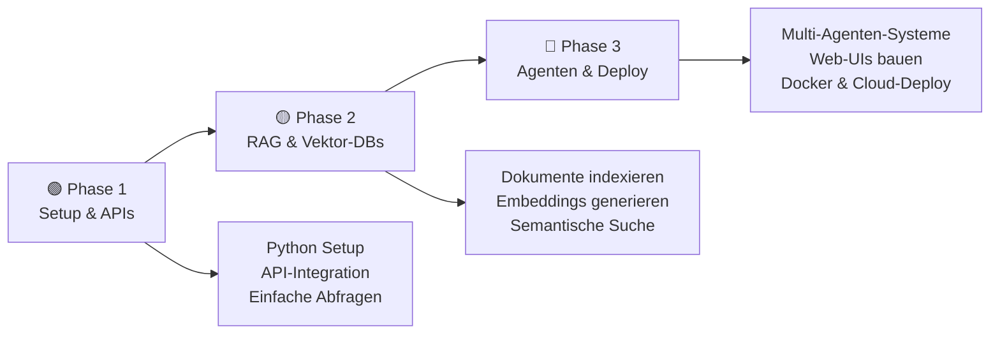
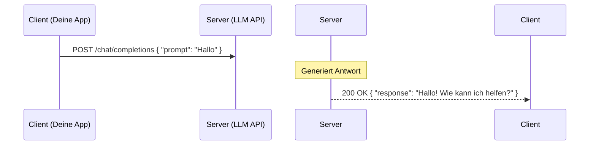
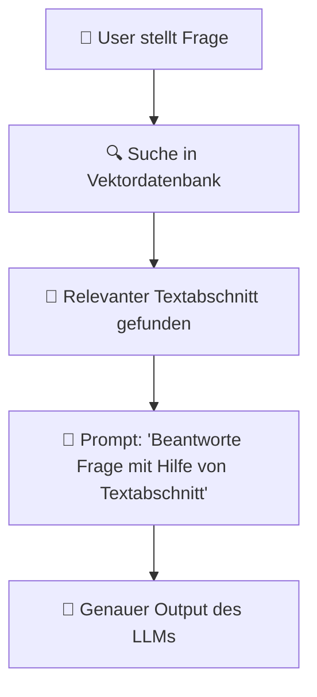
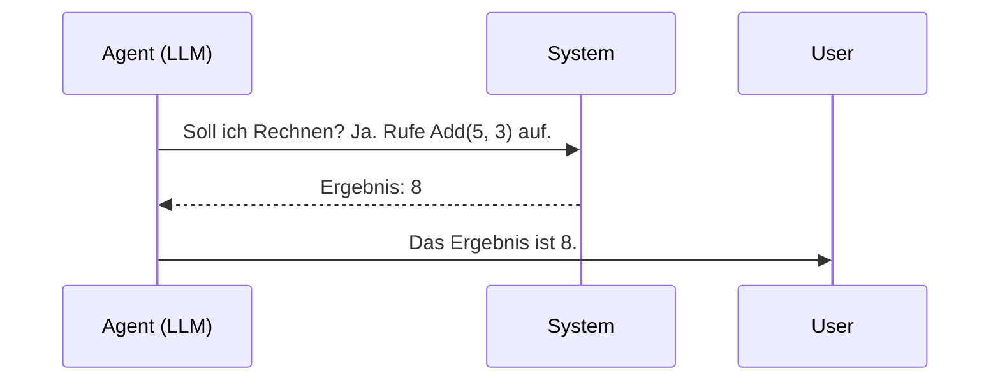
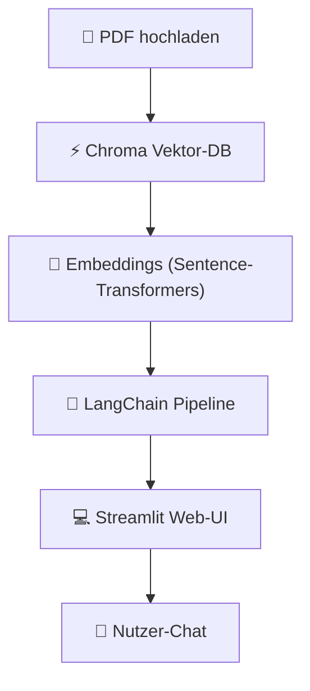

# Eigene KI-Anwendungen programmieren

> **Hinweis zur Software-Auswahl:**  
> Diese Dokumentation priorisiert **Open-Source-Software**, die lokal unter Ubuntu läuft.  
> Bei kostenpflichtigen Services wird stets eine **Open-Source-Alternative** mit gleichem Funktionsumfang gegenübergestellt.  
> **LLM-Modelle** und APIs werden unabhängig vom Preis gelistet, da sie die Grundlage für viele Entwicklungen sind.

---

## Legende

| Symbol | Bedeutung |
|---|---|
| 🟩 | Open Source – kostenlos, Ubuntu-kompatibel |
| 💰 | Kostenpflichtig |
| 🤖 | LLM-Modell / API – bleibt immer gelistet |
| 🐧 | Linux / Ubuntu nativ |
| 🌐 | Nur Web-Browser |

---

## Lernpfad-Übersicht



---

## Inhaltsverzeichnis

- [🟢 Phase 1 – Setup & API-Grundlagen](#phase-1-setup-api-grundlagen)
    - [1.1 Konzept: Wie kommunizieren Anwendungen mit KI?](#11-konzept-wie-kommunizieren-anwendungen-mit-ki)
    - [1.2 Thema: Entwicklungsumgebung unter Ubuntu einrichten](#12-thema-entwicklungsumgebung-unter-ubuntu-einrichten)
    - [1.3 Thema: Text-Generierung mit APIs (Cloud & Lokal)](#13-thema-text-generierung-mit-apis-cloud-lokal)
    - [1.4 Thema: Lokale Modelle nutzen mit Hugging Face](#14-thema-lokale-modelle-nutzen-mit-hugging-face)
- [🟡 Phase 2 – RAG & Vektordatenbanken](#phase-2-rag-vektordatenbanken)
    - [2.1 Konzept: RAG (Retrieval-Augmented Generation)](#21-konzept-rag-retrieval-augmented-generation)
    - [2.2 Thema: Was sind Embeddings?](#22-thema-was-sind-embeddings)
    - [2.3 Thema: Vektordatenbanken einrichten](#23-thema-vektordatenbanken-einrichten)
    - [2.4 Thema: RAG-Pipeline mit LangChain & LlamaIndex](#24-thema-rag-pipeline-mit-langchain-llamaindex)
- [🔴 Phase 3 – Web-UIs, Agenten & Deployment](#phase-3-web-uis-agenten-deployment)
    - [3.1 Konzept: Autonome KI-Agenten programmieren](#31-konzept-autonome-ki-agenten-programmieren)
    - [3.2 Thema: Web-Interfaces für KI-Apps (Streamlit & Gradio)](#32-thema-web-interfaces-fur-ki-apps-streamlit-gradio)
    - [3.3 Thema: Fine-Tuning und LoRA](#33-thema-fine-tuning-und-lora)
    - [3.4 Thema: Deployment, Docker & Betrieb](#34-thema-deployment-docker-betrieb)
- [📋 Praxisprojekte](#praxisprojekte)
- [📦 Vollständige Softwareübersicht & Vergleich](#vollstandige-softwareubersicht-vergleich)

---

## 🟢 Phase 1 – Setup & API-Grundlagen

> **Was lerne ich hier?**  
> Die Grundlagen der API-Kommunikation mit LLMs, das Einrichten von Python unter Ubuntu und die ersten Abfragen an lokale sowie Cloud-Modelle.  
> **Voraussetzungen:** Python-Grundkenntnisse.

---

### 1.1 Konzept: Wie kommunizieren Anwendungen mit KI?

#### Konzept: Client-Server-Prinzip bei LLMs

Deine eigene Anwendung fungiert als **Client**, der Anfragen (Prompts) an den LLM-**Server** (lokal oder in der Cloud) schickt. Die Antwort kommt strukturiert zurück (meist als JSON).



#### Konzept: Statuslose Kommunikation (Stateless)

LLM-APIs haben standardmäßig **kein Gedächtnis**. Jede Anfrage ist isoliert. Um einen Chatverlauf zu ermöglichen, muss deine Anwendung die gesamte Historie mitsenden:

```json
[
  {"role": "user", "content": "Mein Name ist Thorsten."},
  {"role": "assistant", "content": "Hallo Thorsten!"},
  {"role": "user", "content": "Wie heiße ich?"}
]
```

#### Einstiegs-Werkzeuge (APIs & Runner):

| Software | Typ | Funktion | Ubuntu | Link |
|---|---|---|---|---|
| 🟩 🤖 [Ollama](https://ollama.com) | Lokaler Runner | Lokale API-Schnittstelle (OpenAI-kompatibel) | 🐧 Ja | ollama.com |
| 🟩 [Python 3](https://www.python.org) | Programmiersprache | Standard für KI-Entwicklung | 🐧 Ja | python.org |
| 🤖 [OpenAI API](https://platform.openai.com) | Cloud API | Marktführer für LLM-APIs | 🌐 Web | platform.openai.com |

---

### 1.2 Thema: Entwicklungsumgebung unter Ubuntu einrichten

#### Konzept: Virtual Environments (Venvs)

Python-Bibliotheken sollten **niemals** global installiert werden. Virtuelle Umgebungen isolieren die Projektabhängigkeiten voneinander.

```bash
# Erstellen und Aktivieren eines Venv unter Ubuntu
sudo apt install python3-venv python3-pip
python3 -m venv .venv
source .venv/bin/activate
```

#### Software – Open Source zuerst:

| Software | Typ | Funktion | Ubuntu | Link |
|---|---|---|---|---|
| 🟩 [python3-venv](https://docs.python.org/3/library/venv.html) | Tool | Virtuelle Umgebungen erstellen | 🐧 Ja | python.org |
| 🟩 [VSCodium](https://vscodium.com) | Editor | Open-Source-Editor für Python | 🐧 Ja | vscodium.com |
| 🟩 [Jupyter Lab](https://jupyter.org) | Interactive Dev | Interaktives Testen von Code-Abschnitten | 🐧 Ja | jupyter.org |

#### Vergleich: Open Source vs. Kommerziell

| Funktion | Open Source 🟩 | Kommerziell 💰 |
|---|---|---|
| Code-Editor | VSCodium, Neovim | VS Code (Microsoft), PyCharm |
| Virtualization | virtualenv, venv | Anaconda / Miniconda (kommerzielle Lizenzpflichten) |

---

### 1.3 Thema: Text-Generierung mit APIs (Cloud & Lokal)

#### Konzept: Das OpenAI API-Format

Das Format von OpenAI hat sich als Industriestandard etabliert. Viele Open-Source-Tools (wie Ollama) implementieren dieselbe Schnittstellen-Struktur.

```python
# API-Abruf mit Python
import openai

client = openai.OpenAI(
    base_url="http://localhost:11434/v1", # Für Ollama lokal
    api_key="ollama" # Beliebiger String für lokal
)

response = client.chat.completions.create(
    model="llama3",
    messages=[{"role": "user", "content": "Was ist Python?"}]
)
print(response.choices[0].message.content)
```

#### Software – Open Source zuerst:

| Software | Typ | Funktion | Ubuntu | Link |
|---|---|---|---|---|
| 🟩 [Ollama API](https://github.com/ollama/ollama) | API-Server | Stellt OpenAI-kompatible lokale Endpunkte bereit | 🐧 Ja | github.com/ollama |
| 🟩 [LiteLLM](https://github.com/BerriAI/litellm) | API-Proxy | Vereinheitlicht alle LLM-APIs in ein Format | 🐧 Ja | github.com/BerriAI |

#### Vergleich: Open Source vs. Kommerziell

| Kriterium | Lokale API (Ollama + Llama) 🟩 | Cloud API (OpenAI, Claude) 💰 |
|---|---|---|
| Kosten | ✅ Kostenlos (nutzt eigene Hardware) | 💰 Abrechnung nach Tokens |
| Datenschutz | ✅ Code & Daten verlassen nie den Rechner | ❌ Daten fließen an US-Server |
| Performance | 🟡 Abhängig von Grafikkarte (GPU) | ✅ Sehr schnell |

---

### 1.4 Thema: Lokale Modelle nutzen mit Hugging Face

#### Konzept: Pipelines und Tokenizer

Bevor ein LLM Text verarbeitet, muss der Text in Zahlen (**Tokens**) zerlegt werden. Die Library `transformers` abstrahiert diesen Prozess in **Pipelines**:

```python
from transformers import pipeline

generator = pipeline("text-generation", model="gpt2")
result = generator("Die Zukunft der künstlichen Intelligenz ist", max_length=30)
print(result[0]['generated_text'])
```

#### Software – alle Open Source:

| Software | Typ | Funktion | Ubuntu | Link |
|---|---|---|---|---|
| 🟩 [Transformers (Hugging Face)](https://github.com/huggingface/transformers) | Python-Lib | Pytorch/TensorFlow-Schnittstelle für Modelle | 🐧 Ja | github.com/huggingface |
| 🟩 [PyTorch](https://pytorch.org) | Deep Learning | Mathematisches Backend für KI-Modelle | 🐧 Ja | pytorch.org |

---

## 🟡 Phase 2 – RAG & Vektordatenbanken

> **Was lerne ich hier?**  
> Wie du deine KI mit eigenen Dokumenten (PDFs, Markdown) verknüpfst, ohne das Modell neu trainieren zu müssen.  
> **Voraussetzungen:** Phase 1 abgeschlossen.

---

### 2.1 Konzept: RAG (Retrieval-Augmented Generation)



#### Warum RAG statt Fine-Tuning?

- RAG erzeugt **keine Halluzinationen** bei Quellenangaben
- RAG kann Dokumente in **Echtzeit** aktualisieren (einfach in Vektor-DB tauschen)
- RAG ist wesentlich **günstiger** und braucht keine teure GPU fürs Training

---

### 2.2 Thema: Was sind Embeddings?

#### Konzept: Semantischer Vektorraum

Ein **Embedding** konvertiert Text (Wörter, Absätze) in eine Liste von Zahlen (Vektor). Texte mit ähnlicher Bedeutung liegen im Vektorraum nah beieinander.

```
"Hund"  -> [0.12, -0.45, 0.89]
"Welpe" -> [0.11, -0.43, 0.88]  (nah beieinander)
"Auto"  -> [-0.78, 0.05, -0.12] (weit entfernt)
```

#### Software – Open Source zuerst:

| Software | Typ | Funktion | Ubuntu | Link |
|---|---|---|---|---|
| 🟩 [Sentence-Transformers](https://sbert.net) | Python-Lib | Lokale Embeddings hocheffizient erzeugen | 🐧 Ja | sbert.net |
| 🟩 [Ollama (Embedding Models)](https://ollama.com) | Modell-Server | Generiert Embeddings über API (z.B. nomic-embed-text) | 🐧 Ja | ollama.com |

#### Vergleich: Open Source vs. Kommerziell

| Funktion | Open Source 🟩 (Ubuntu) | Kommerziell 💰 |
|---|---|---|
| Text-Embeddings | Sentence-Transformers, Ollama | OpenAI text-embedding-3 |

---

### 2.3 Thema: Vektordatenbanken einrichten

#### Konzept: Ähnlichkeitssuche (Cosine Similarity)

Vektordatenbanken sind darauf spezialisiert, Vektoren zu speichern und blitzschnell den ähnlichsten Vektor zu einer Suchanfrage zu finden.

#### Software – Open Source zuerst:

| Software | Typ | Funktion | Ubuntu | Link |
|---|---|---|---|---|
| 🟩 [Chroma](https://www.trychroma.com) | Vektor-DB | Einfache, leichtgewichtige In-Memory DB | 🐧 Ja | trychroma.com |
| 🟩 [pgvector (PostgreSQL)](https://github.com/pgvector/pgvector) | Vektor-DB | Vektorsuche direkt in PostgreSQL | 🐧 Ja | github.com/pgvector |
| 🟩 [Qdrant](https://qdrant.tech) | Vektor-DB | Hochperformante Suchmaschine (Rust-basiert) | 🐧 Ja | qdrant.tech |

#### Vergleich: Open Source vs. Kommerziell

| Funktion | Open Source 🟩 (Ubuntu) | Kommerziell 💰 |
|---|---|---|
| Vektorspeicherung | Qdrant, Chroma, pgvector | Pinecone, Weaviate Cloud |

---

### 2.4 Thema: RAG-Pipeline mit LangChain & LlamaIndex

#### Konzept: Orchestrierung von KI-Komponenten

Frameworks wie LangChain verknüpfen Lader (PDF/CSV), Textsplitter, Embedding-Modelle und LLMs zu einer einzigen Kette (Chain).

```python
# Minimales LlamaIndex-RAG-Beispiel
from llama_index.core import SimpleDirectoryReader, VectorStoreIndex

# 1. Dokumente laden
documents = SimpleDirectoryReader("data").load_data()
# 2. Index erstellen (Embeddings automatisch)
index = VectorStoreIndex.from_documents(documents)
# 3. Abfragen
query_engine = index.as_query_engine()
response = query_engine.query("Welche Urlaubsregelungen gelten?")
print(response)
```

#### Software – Open Source zuerst:

| Software | Typ | Funktion | Ubuntu | Link |
|---|---|---|---|---|
| 🟩 [LangChain](https://www.langchain.com) | Framework | Das flexibelste Orchestrierungs-Framework | 🐧 Ja | langchain.com |
| 🟩 [LlamaIndex](https://www.llamaindex.ai) | Framework | Spezialisiert auf Datenverbindung und RAG | 🐧 Ja | llamaindex.ai |

---

## 🔴 Phase 3 – Web-UIs, Agenten & Deployment

> **Was lerne ich hier?**  
> Wie du deine Skripte in interaktive Web-Apps verwandelst, selbstständig agierende Agenten programmierst und alles stabil deployst.  
> **Voraussetzungen:** RAG-Grundlagen verstanden.

---

### 3.1 Konzept: Autonome KI-Agenten programmieren

#### Konzept: Tool-Use / Function Calling

Moderne LLMs können entscheiden, **Funktionen in deinem Python-Code** auszuführen, wenn sie Informationen benötigen (z. B. Wetter abfragen oder Taschenrechner benutzen).



#### Software – alle Open Source:

| Software | Typ | Funktion | Ubuntu | Link |
|---|---|---|---|---|
| 🟩 [CrewAI](https://www.crewai.com) | Framework | Kollaboration mehrerer Agenten mit Rollen | 🐧 Ja | crewai.com |
| 🟩 [Microsoft AutoGen](https://microsoft.github.io/autogen/) | Framework | Eventgesteuertes Multi-Agenten-Framework | 🐧 Ja | microsoft.github.io/autogen |

---

### 3.2 Thema: Web-Interfaces für KI-Apps (Streamlit & Gradio)

#### Konzept: Rapid Prototyping

Statt HTML, CSS und JS aufzubauen, schreiben Streamlit und Gradio das Frontend direkt aus deinem Python-Code heraus.

```python
# Streamlit App
import streamlit as st

st.title("Mein KI-Chat")
user_input = st.text_input("Frag mich was:")
if user_input:
    st.write(f"KI sagt: Du hast '{user_input}' gefragt.")
```

#### Software – alle Open Source:

| Software | Typ | Funktion | Ubuntu | Link |
|---|---|---|---|---|
| 🟩 [Streamlit](https://streamlit.io) | Frontend | Ideal für datenintensive KI-Dashboard-Apps | 🐧 Ja | streamlit.io |
| 🟩 [Gradio](https://www.gradio.app) | Frontend | Standard für ML-Modell-Demos (Hugging Face) | 🐧 Ja | gradio.app |
| 🟩 [Chainlit](https://github.com/Chainlit/chainlit) | Frontend | Maßgeschneidert für Chatbot-UIs (wie ChatGPT) | 🐧 Ja | github.com/Chainlit |

---

### 3.3 Thema: Fine-Tuning und LoRA

#### Konzept: Wann macht Fine-Tuning Sinn?

- Du brauchst einen **spezifischen Tonfall** oder Format
- Das Modell soll eine **proprietäre Syntax** lernen
- Extrem geringe Latenz nötig (kleines Modell spezialisieren)

#### Konzept: LoRA (Low-Rank Adaptation)

Statt alle Milliarden Gewichte des Modells zu ändern, trainiert LoRA nur eine winzige Zusatzmatrix. Das spart 90% der Rechenleistung.

#### Software – alle Open Source:

| Software | Typ | Funktion | Ubuntu | Link |
|---|---|---|---|---|
| 🟩 [Unsloth](https://github.com/unslothai/unsloth) | Training-Lib | Extrem schnelles, speichereffizientes Feintunen | 🐧 Ja | github.com/unslothai |
| 🟩 [TRL (Transformers Reinforcement Learning)](https://github.com/huggingface/trl) | Lib | Feintuning mit SFT und DPO | 🐧 Ja | github.com/huggingface/trl |

---

### 3.4 Thema: Deployment, Docker & Betrieb

#### Konzept: Containerisierung von KI-Apps

Durch Docker verpackst du dein Python-Skript, das Venv und alle C-Bibliotheken (wie CUDA) in ein portables Paket.

```dockerfile
FROM python:3.11-slim
WORKDIR /app
COPY requirements.txt .
RUN pip install -r requirements.txt
COPY . .
CMD ["streamlit", "run", "app.py"]
```

#### Software – Open Source zuerst:

| Software | Typ | Funktion | Ubuntu | Link |
|---|---|---|---|---|
| 🟩 [Docker](https://www.docker.com) | Container | Isolation und Auslieferung der App | 🐧 Ja | docker.com |
| 🟩 [Coolify](https://coolify.io) | Self-hosted PaaS | Heroku-Alternative auf eigenem Ubuntu-Server | 🐧 Ja | coolify.io |

#### Vergleich: Open Source vs. Kommerziell

| Hosting-Ziel | Open Source 🟩 (Ubuntu / Self-hosted) | Kommerziell 💰 |
|---|---|---|
| App-Hosting | Coolify + eigener Server | Heroku, Vercel, Render |
| Modell-Hosting | Ollama API, vLLM | Hugging Face Endpoints, Replicate |

---

## 📋 Praxisprojekte

### 🟢 Einsteiger: Lokaler QA-Chatbot über Textdateien


**Software (alle Open Source):** Python · Ollama (Modell: Llama3) · LlamaIndex

---

### 🟡 Fortgeschritten: PDF-Chatbot mit Web-UI (RAG)



**Software (alle Open Source):** Streamlit · LangChain · Chroma · Sentence-Transformers · Ollama

---

### 🔴 Experte: Multi-Agenten-Forschungsteam

Ein Agent sucht Informationen im Web, der andere schreibt eine Zusammenfassung, der dritte korrigiert den Stil.


**Software (alle Open Source):** CrewAI · Python · Ollama (lokales Modell) / LiteLLM

---

## 📦 Vollständige Softwareübersicht & Vergleich

### KI-Runtimes & API-Server

| Funktion | Open Source 🟩 (Ubuntu) | Kommerziell 💰 |
|---|---|---|
| Lokaler API-Server | Ollama 🐧, llama.cpp 🐧 | — |
| Server-Schnittstelle | vLLM 🐧, TGI 🐧 | RunPod, Replicate |
| API-Orchestrierung | LiteLLM 🐧 | LangSmith (Monetarisierung) |

### Python-Umgebung & Editoren

| Funktion | Open Source 🟩 (Ubuntu) | Kommerziell 💰 |
|---|---|---|
| Code-Editor | VSCodium 🐧, JupyterLab 🐧 | PyCharm, VS Code |
| Paketverwaltung | pip 🐧, poetry 🐧 | Anaconda Enterprise |

### ML-Libraries & Frameworks

| Funktion | Open Source 🟩 (Ubuntu) | Kommerziell 💰 |
|---|---|---|
| Modell-Zugriff | Transformers 🐧, PyTorch 🐧 | — |
| App-Orchestrierung | LangChain 🐧, LlamaIndex 🐧 | — |

### Vektordatenbanken

| Funktion | Open Source 🟩 (Ubuntu) | Kommerziell 💰 |
|---|---|---|
| In-Memory DB | Chroma 🐧 | — |
| SQL-Integration | PostgreSQL + pgvector 🐧 | Supabase Cloud |
| Standalone DB | Qdrant 🐧, Milvus 🐧 | Pinecone |

### Web-Frontends für KI

| Funktion | Open Source 🟩 (Ubuntu) | Kommerziell 💰 |
|---|---|---|
| UI-Framework | Streamlit 🐧, Gradio 🐧, Chainlit 🐧 | Taipy Enterprise |

### Agenten-Frameworks

| Funktion | Open Source 🟩 (Ubuntu) | Kommerziell 💰 |
|---|---|---|
| Multi-Agenten | CrewAI 🐧, AutoGen 🐧, LangGraph 🐧 | — |

### Fine-Tuning

| Funktion | Open Source 🟩 (Ubuntu) | Kommerziell 💰 |
|---|---|---|
| Training-Lib | Unsloth 🐧, TRL 🐧 | Predibase, EntryPoint |

### Deployment & Hosting

| Funktion | Open Source 🟩 (Ubuntu) | Kommerziell 💰 |
|---|---|---|
| App-Platform | Coolify 🐧, Caprover 🐧 | Heroku, Render |
| Container | Docker 🐧, Podman 🐧 | — |

---

## Weiterführende Ressourcen

- **[Hugging Face Models](https://huggingface.co/models)** – Open-Source-Modelle und Gewichte 🟩
- **[LangChain Docs](https://python.langchain.com)** – Umfangreiche Entwickler-Dokumentation 🟩
- **[LlamaIndex Docs](https://docs.llamaindex.ai)** – RAG-Best-Practices 🟩
- **[Ollama GitHub](https://github.com/ollama/ollama)** – API-Spezifikationen 🟩
- **[CrewAI Docs](https://docs.crewai.com)** – Agenten-Architekturen 🟩

---

*Letzte Aktualisierung: Juli 2026*
