# Coding mit KI

> **Hinweis zur Software-Auswahl:**  
> Diese Dokumentation priorisiert **Open-Source-Software**, die unter Ubuntu läuft.  
> Bei kostenpflichtiger Software wird immer eine **Open-Source-Alternative** mit gleichem Funktionsumfang gegenübergestellt.  
> **LLM-Modelle** werden unabhängig vom Preis gelistet – sie sind das Fundament KI-gestützter Softwareentwicklung.

---

## Legende

| Symbol | Bedeutung |
|---|---|
| 🟩 | Open Source – kostenlos |
| 💰 | Kostenpflichtig |
| 🤖 | LLM-Modell – bleibt immer gelistet |
| 🐧 | Linux / Ubuntu nativ |
| 🌐 | Nur Web-Browser |

---

## Lernpfad-Übersicht

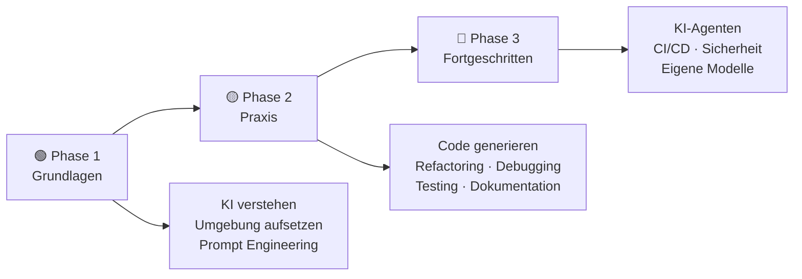

---

## Inhaltsverzeichnis

- [🟢 Phase 1 – Grundlagen](#phase-1-grundlagen)
    - [1.1 Was ist KI-gestütztes Coding?](#11-was-ist-ki-gestutztes-coding)
    - [1.2 Konzept: Wie Code-KI funktioniert](#12-konzept-wie-code-ki-funktioniert)
    - [1.3 Thema: Entwicklungsumgebung mit KI aufsetzen](#13-thema-entwicklungsumgebung-mit-ki-aufsetzen)
    - [1.4 Thema: Prompt Engineering für Entwickler](#14-thema-prompt-engineering-fur-entwickler)
    - [1.5 Thema: Lokale LLMs für Code](#15-thema-lokale-llms-fur-code)
- [🟡 Phase 2 – Praxis](#phase-2-praxis)
    - [2.1 Konzept: Der KI-gestützte Entwicklungskreislauf](#21-konzept-der-ki-gestutzte-entwicklungskreislauf)
    - [2.2 Thema: Code generieren mit KI](#22-thema-code-generieren-mit-ki)
    - [2.3 Thema: Refactoring mit KI](#23-thema-refactoring-mit-ki)
    - [2.4 Thema: Debugging mit KI](#24-thema-debugging-mit-ki)
    - [2.5 Thema: Testing mit KI](#25-thema-testing-mit-ki)
    - [2.6 Thema: Code-Dokumentation mit KI](#26-thema-code-dokumentation-mit-ki)
    - [2.7 Thema: SQL & Datenbanken mit KI](#27-thema-sql-datenbanken-mit-ki)
    - [2.8 Thema: APIs entwickeln mit KI](#28-thema-apis-entwickeln-mit-ki)
- [🔴 Phase 3 – Fortgeschritten](#phase-3-fortgeschritten)
    - [3.1 Konzept: KI als autonomer Entwicklungs-Agent](#31-konzept-ki-als-autonomer-entwicklungs-agent)
    - [3.2 Thema: Code-Review mit KI](#32-thema-code-review-mit-ki)
    - [3.3 Thema: CI/CD mit KI-Unterstützung](#33-thema-cicd-mit-ki-unterstutzung)
    - [3.4 Thema: Sicherheit im Code mit KI](#34-thema-sicherheit-im-code-mit-ki)
    - [3.5 Thema: KI-Agenten für Softwareentwicklung](#35-thema-ki-agenten-fur-softwareentwicklung)
    - [3.6 Thema: Eigene Modelle fine-tunen](#36-thema-eigene-modelle-fine-tunen)
- [📋 Praxisprojekte](#praxisprojekte)
- [📦 Vollständige Softwareübersicht & Vergleich](#vollstandige-softwareubersicht-vergleich)

---

## 🟢 Phase 1 – Grundlagen

> **Was lerne ich hier?**  
> Wie KI in der Softwareentwicklung eingesetzt wird, welche Modelle es gibt und wie man die eigene Umgebung für KI-Coding optimal aufstellt.  
> **Voraussetzungen:** Grundlegende Programmierkenntnisse in einer Sprache.

---

### 1.1 Was ist KI-gestütztes Coding?

#### Konzept: Vier Einsatzgebiete von KI im Code-Alltag

| Einsatzgebiet | Was KI tut | Beispiel |
|---|---|---|
| **Code-Completion** | Vervollständigt Code beim Tippen | Continue.dev schlägt die nächste Zeile vor |
| **Code-Generierung** | Erstellt Funktionen aus Beschreibungen | „Schreibe eine Funktion, die CSV einliest" |
| **Code-Analyse** | Erklärt und bewertet vorhandenen Code | „Was macht dieser Regex?" |
| **Code-Transformation** | Refactoring, Übersetzung, Optimierung | „Konvertiere Python 2 zu Python 3" |

#### Konzept: KI ersetzt keine Entwickler – warum?

- KI kennt keinen **Projektkontext** (Architektur, Historische Entscheidungen)
- KI erzeugt **plausiblen**, nicht immer **korrekten** Code
- KI hat kein Verständnis für **nicht-funktionale Anforderungen** (Performance, Sicherheit)
- KI macht **Konfidenzfehler**: Sie klingt sicher, auch wenn sie falsch liegt

#### Konzept: Das Spektrum von KI-Unterstützung


**Empfehlung:** Für produktiven Code: Modus B (Assistent). Für Prototypen/Experimente: Modus C.

#### Einstiegs-Software (LLM – immer gelistet):

| Software | Typ | Funktion | Ubuntu | Link |
|---|---|---|---|---|
| 🟩 🤖 [Ollama](https://ollama.com) | LLM lokal | DeepSeek Coder, CodeLlama lokal | 🐧 Ja | ollama.com |
| 🟩 🤖 [Continue.dev](https://continue.dev) | KI-IDE-Plugin | Open-Source Copilot für VSCodium | 🐧 Ja | continue.dev |
| 🟩 🤖 [Aider](https://aider.chat) | KI-CLI | Terminal-KI-Assistent für Repositories | 🐧 Ja | aider.chat |
| 🤖 [ChatGPT](https://chat.openai.com) | LLM Cloud | Code generieren, erklären, debuggen | 🌐 Web | openai.com |
| 🤖 [Claude](https://claude.ai) | LLM Cloud | Großes Kontextfenster (200K Token) | 🌐 Web | claude.ai |
| 🤖 [Gemini](https://gemini.google.com) | LLM Cloud | Google-Integration, langer Kontext | 🌐 Web | gemini.google.com |

---

### 1.2 Konzept: Wie Code-KI funktioniert

#### Konzept: Training auf Code-Daten

Code-LLMs wurden auf riesigen Mengen an öffentlichem Code trainiert (GitHub, GitLab, Stack Overflow). Sie lernen **Muster**, nicht **Bedeutung**.

```
Was KI wirklich macht:
"Gegeben dieser Code-Kontext, was ist die
wahrscheinlichste nächste Token-Sequenz?"
```

#### Konzept: Kontextfenster – der wichtigste Parameter

Das **Kontextfenster** bestimmt, wie viel Code die KI gleichzeitig „sehen" kann:

| Modell | Kontextfenster | Eignung |
|---|---|---|
| CodeLlama 7B (lokal) | 16.000 Token | Einzelne Dateien |
| DeepSeek Coder 33B (lokal) | 16.000 Token | Mehrere Dateien |
| GPT-4o (Cloud) | 128.000 Token | Größere Codebasen |
| Claude 3.5 (Cloud) | 200.000 Token | Sehr große Projekte |

**Faustregel:** 1.000 Token ≈ 750 Wörter ≈ ~50 Codezeilen

#### Konzept: Fill-in-the-Middle (FIM)

Moderne Code-LLMs beherrschen **FIM** – sie können Code in der Mitte einer Datei einfügen, nicht nur am Ende:

```python
def berechne_summe(zahlen):
    # <KI füllt hier ein>
    return ergebnis
```

#### Konzept: RAG für Code-Repositories

**Retrieval-Augmented Generation (RAG)** ermöglicht es, die KI mit dem gesamten Projekt-Code zu „füttern" – nicht nur der aktuellen Datei. Continue.dev macht das lokal mit **Embeddings**.

---

### 1.3 Thema: Entwicklungsumgebung mit KI aufsetzen

#### Konzept: Der ideale KI-Coding-Stack (Open Source)

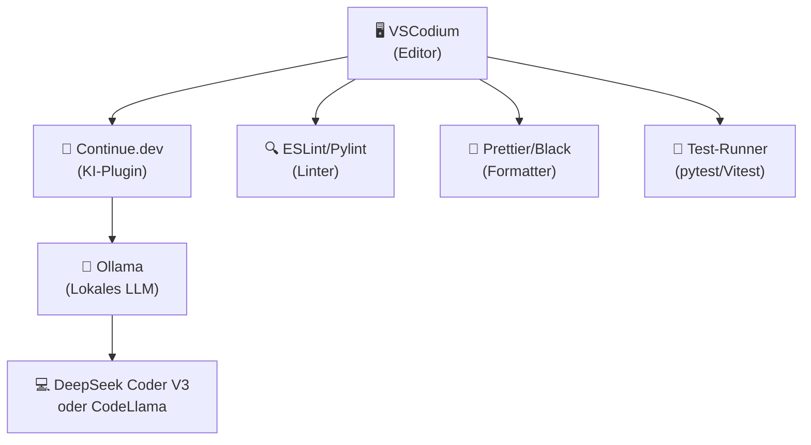

#### Konzept: Welches lokale Code-Modell wählen?

| Modell | Größe | Stärke | RAM-Bedarf |
|---|---|---|---|
| **DeepSeek Coder V3** | 7B/33B | Beste Codequalität | 8GB / 20GB+ |
| **CodeLlama** | 7B/13B/34B | Allround, viele Sprachen | 8GB / 16GB+ |
| **StarCoder2** | 3B/7B/15B | Speziell für Code trainiert | 4GB / 8GB+ |
| **Qwen2.5-Coder** | 7B/32B | Sehr gut für Python/JS | 8GB / 20GB+ |
| **Phi-3.5** | 3.8B | Klein, schnell, gut genug | 4GB |

#### Software – Open Source zuerst:

| Software | Typ | Funktion | Ubuntu | Link |
|---|---|---|---|---|
| 🟩 [VSCodium](https://vscodium.com) | Editor | Open-Source VS Code (ohne Telemetrie) | 🐧 Ja | vscodium.com |
| 🟩 [Continue.dev](https://continue.dev) | KI-Plugin | KI-Assistent für VSCodium/VS Code | 🐧 Ja | continue.dev |
| 🟩 [Ollama](https://ollama.com) | LLM-Server | Lokale Code-LLMs ausführen | 🐧 Ja | ollama.com |
| 🟩 [Aider](https://aider.chat) | KI-CLI | KI-Coding im Terminal | 🐧 Ja | aider.chat |
| 🟩 [Neovim](https://neovim.io) | Editor | Vim-basierter Editor + KI-Plugins | 🐧 Ja | neovim.io |
| 🟩 [Gitea](https://gitea.io/de-de/) | Git-Server | Self-hosted GitHub-Alternative | 🐧 Ja | gitea.io |

#### Vergleich: Open Source vs. Kommerziell

| Funktion | Open Source 🟩 (Ubuntu) | Kommerziell 💰 |
|---|---|---|
| Code-Editor | VSCodium, Neovim | JetBrains IDEs, Cursor, Windsurf |
| KI-Assistent im Editor | Continue.dev + Ollama | GitHub Copilot, Tabnine, Codeium |
| Terminal-KI | Aider + Ollama | Cursor, Warp Terminal |
| Git-Hosting | Gitea (self-hosted) | GitHub, GitLab |

---

### 1.4 Thema: Prompt Engineering für Entwickler

#### Konzept: Anatomie eines guten Code-Prompts

```
[KONTEXT]    Ich arbeite an einer Python-REST-API mit FastAPI.
[AUFGABE]    Erstelle eine Funktion zur Benutzer-Authentifizierung.
[TECHNIK]    Verwende JWT-Tokens, keine externen Auth-Libraries.
[FORMAT]     Füge Type Hints und Docstrings hinzu.
[SICHERHEIT] Implementiere Brute-Force-Schutz (max. 5 Versuche).
```

#### Konzept: Prompt-Muster für verschiedene Code-Aufgaben

| Aufgabe | Prompt-Muster | Beispiel |
|---|---|---|
| **Funktion schreiben** | „Schreibe eine Funktion, die [X] macht. Input: [Typ]. Output: [Typ]." | Klarer I/O-Vertrag |
| **Code erklären** | „Erkläre diesen Code Schritt für Schritt, als wäre ich Junior-Entwickler." | Verständnis-Prompt |
| **Fehler beheben** | „Folgender Fehler tritt auf: [Fehler]. Der Code: [Code]. Was ist die Ursache?" | Debug-Prompt |
| **Refactoring** | „Verbessere diesen Code: lesbar, DRY-Prinzip, keine Verschachtelung > 2 Ebenen." | Qualitäts-Prompt |
| **Tests schreiben** | „Schreibe pytest-Tests für diese Funktion. Decke Edge-Cases und Fehler ab." | Test-Prompt |

#### Konzept: Chain-of-Thought für komplexe Algorithmen

Für komplexe Algorithmen hilft es, die KI zum **Nachdenken** zu zwingen:

```
Prompt: "Bevor du den Code schreibst, beschreibe zuerst in Pseudocode
         den Algorithmus. Dann implementiere ihn in Python."
```

#### Konzept: Few-Shot-Prompting

Zeige der KI Beispiele deines **Coding-Stils**:

```
Hier ist ein Beispiel meiner Code-Konventionen:
[Beispiel-Funktion]
Schreibe nun eine ähnliche Funktion für [neue Aufgabe].
```

---

### 1.5 Thema: Lokale LLMs für Code

#### Konzept: Warum lokale LLMs für professionellen Code?

| Grund | Erklärung |
|---|---|
| **Datenschutz** | Proprietärer Code verlässt nie das Unternehmen |
| **Compliance** | DSGVO, ISO 27001 – kein Cloud-Risiko |
| **Offline** | Kein Internet nötig, kein Ausfall bei Cloud-Störungen |
| **Kosten** | Ab einer gewissen Nutzung günstiger als Cloud-API |

#### Konzept: Ollama – der lokale LLM-Server

```bash
# Installation
curl -fsSL https://ollama.com/install.sh | sh

# Code-Modell laden
ollama pull deepseek-coder-v2

# Im Terminal nutzen
ollama run deepseek-coder-v2 "Schreibe eine Python-Funktion für Fibonacci"

# Als API-Server (für Continue.dev, Aider etc.)
ollama serve  # Läuft auf http://localhost:11434
```

#### Konzept: Continue.dev mit lokalem Modell verbinden

```json
// ~/.continue/config.json
{
  "models": [{
    "title": "DeepSeek Coder (lokal)",
    "provider": "ollama",
    "model": "deepseek-coder-v2",
    "apiBase": "http://localhost:11434"
  }]
}
```

#### Software – alle Open Source:

| Software | Typ | Funktion | Ubuntu | Link |
|---|---|---|---|---|
| 🟩 🤖 [Ollama](https://ollama.com) | LLM-Server | Lokaler LLM-Server | 🐧 Ja | ollama.com |
| 🟩 🤖 [LM Studio](https://lmstudio.ai) | LLM-GUI | GUI für lokale Modelle | 🐧 Ja | lmstudio.ai |
| 🟩 🤖 [Jan.ai](https://jan.ai) | LLM-GUI | Open-Source ChatGPT-Alternative | 🐧 Ja | jan.ai |
| 🟩 🤖 [llama.cpp](https://github.com/ggerganov/llama.cpp) | LLM-Engine | Schnellste CPU/GPU-LLM-Engine | 🐧 Ja | github.com/ggerganov |
| 🟩 🤖 [text-generation-webui](https://github.com/oobabooga/text-generation-webui) | LLM-Web-UI | Umfangreiche Web-Oberfläche für LLMs | 🐧 Ja | github.com/oobabooga |

---

## 🟡 Phase 2 – Praxis

> **Was lerne ich hier?**  
> Den KI-Assistenten im echten Entwickleralltag produktiv einsetzen – von der Code-Generierung bis zur Dokumentation.  
> **Voraussetzungen:** Phase 1 abgeschlossen. Programmierkenntnisse in Python oder JavaScript.

---

### 2.1 Konzept: Der KI-gestützte Entwicklungskreislauf

#### Der klassische vs. KI-gestützte Entwicklungsworkflow

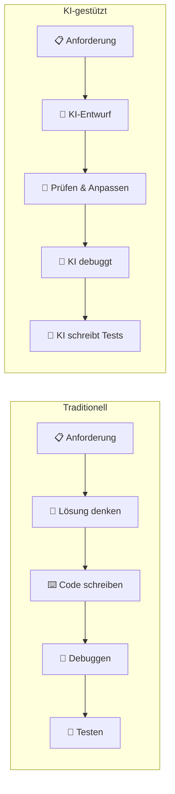

#### Konzept: Wann KI nutzen, wann nicht?

| Situation | KI nutzen | Warum |
|---|---|---|
| Boilerplate-Code | ✅ Ja | Spart viel Zeit |
| Algorithmen-Implementierung | ✅ Ja | KI kennt gängige Algorithmen |
| Kritische Sicherheitslogik | ❌ Nein | Zu risikoreich ohne Prüfung |
| Domänenspezifische Logik | 🟡 Teilweise | KI kennt keine Geschäftsregeln |
| Regex schreiben | ✅ Ja | KI ist sehr gut darin |
| Architekturentscheidungen | ❌ Nein | Braucht Projekt-Kontext |

---

### 2.2 Thema: Code generieren mit KI

#### Konzept: Code-Generierung nach Abstraktionsebene

| Ebene | Beispiel | KI-Eignung |
|---|---|---|
| **Zeile / Snippet** | Einzelne Anweisung | ✅ Sehr hoch |
| **Funktion** | Eine abgeschlossene Funktion | ✅ Sehr hoch |
| **Klasse / Modul** | Eine vollständige Klasse | ✅ Hoch |
| **Datei** | Eine vollständige Datei | 🟡 Mittel |
| **Anwendung** | Komplettes Programm | 🟡 Nur für kleinere Apps |
| **Architektur** | System-Design | ❌ Gering – immer Mensch nötig |

#### Konzept: Sprachspezifische Besonderheiten

| Sprache | KI-Stärken | KI-Schwächen |
|---|---|---|
| **Python** | Datenstrukturen, Scripting, ML-Code | Async-Komplexität |
| **JavaScript/TypeScript** | DOM, APIs, React-Komponenten | Callback-Hell-Muster |
| **Go** | Goroutinen-Grundmuster | Komplexe Concurrency |
| **Rust** | Grundlegende Strukturen | Ownership/Lifetimes-Fehler |
| **SQL** | SELECT/JOIN-Abfragen | Komplexe CTEs, Performance |

#### Software – Open Source zuerst:

| Software | Typ | Funktion | Ubuntu | Link |
|---|---|---|---|---|
| 🟩 [Continue.dev](https://continue.dev) | KI-Plugin | Code-Completion & Generierung | 🐧 Ja | continue.dev |
| 🟩 [Aider](https://aider.chat) | KI-CLI | Komplette Dateien/Features generieren | 🐧 Ja | aider.chat |
| 🟩 🤖 [Ollama + DeepSeek Coder](https://ollama.com) | LLM | Lokale Code-Generierung | 🐧 Ja | ollama.com |
| 🟩 [Codeium (Free)](https://codeium.com) | KI-Plugin | Kostenloser KI-Assistent | 🐧 Ja | codeium.com |

#### Vergleich: Open Source vs. Kommerziell

| Funktion | Open Source 🟩 (Ubuntu) | Kommerziell 💰 |
|---|---|---|
| Code-Completion | Continue.dev + Ollama | GitHub Copilot, Tabnine Pro |
| Feature-Generierung | Aider + DeepSeek | Cursor, Windsurf |
| Ganze App aus Prompt | Aider + Claude API | Devin, Cursor Composer |
| Kostenlos im Browser | — | v0.dev (begrenzt) |

---

### 2.3 Thema: Refactoring mit KI

#### Konzept: Was ist Refactoring?

**Refactoring** verbessert die innere Struktur von Code, **ohne das Verhalten zu ändern**. KI ist dafür sehr gut geeignet.

#### Konzept: Die wichtigsten Refactoring-Techniken mit KI

| Technik | Beschreibung | Prompt-Beispiel |
|---|---|---|
| **DRY-Prinzip** | Code-Duplizierung eliminieren | „Extrahiere die Duplizierungen in Hilfsfunktionen" |
| **Extraktion** | Lange Funktion aufteilen | „Teile diese 100-Zeilen-Funktion in kleine Funktionen auf" |
| **Umbenennung** | Sprechende Namen geben | „Benenne alle Variablen nach ihrem Zweck um" |
| **Vereinfachung** | Komplexität reduzieren | „Reduziere die Verschachtelungstiefe auf max. 2 Ebenen" |
| **Modernisierung** | Alten Code auf aktuellen Stand | „Konvertiere von Callbacks zu async/await" |

#### Konzept: Sicheres Refactoring mit KI

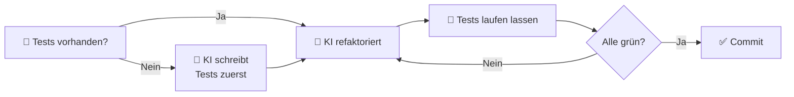

**Goldene Regel:** Nie ohne Tests refaktorieren – KI macht auch beim Refactoring Fehler!

#### Software – Open Source zuerst:

| Software | Typ | Funktion | Ubuntu | Link |
|---|---|---|---|---|
| 🟩 [Aider](https://aider.chat) | KI-CLI | Ganzes Repository refaktorieren | 🐧 Ja | aider.chat |
| 🟩 [rope](https://github.com/python-rope/rope) | Python | Python-Refactoring-Library | 🐧 Ja | github.com/python-rope |
| 🟩 [semgrep](https://semgrep.dev) | Code-Analyse | Code-Pattern-Erkennung & -Transformation | 🐧 Ja | semgrep.dev |
| 🟩 [Sourcegraph Cody (Free)](https://about.sourcegraph.com/cody) | KI | Repository-weites Refactoring | 🐧 Ja | about.sourcegraph.com |

---

### 2.4 Thema: Debugging mit KI

#### Konzept: Der KI-Debugging-Prozess

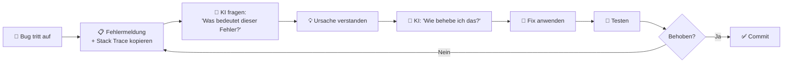

#### Konzept: Arten von Bugs und KI-Eignung

| Bug-Typ | KI-Eignung | Tipps |
|---|---|---|
| **Syntax-Fehler** | ✅ Sehr hoch | Direkt Fehlermeldung einfügen |
| **Laufzeitfehler** | ✅ Hoch | Stack Trace + relevanter Code |
| **Logikfehler** | 🟡 Mittel | Erwartetes vs. tatsächliches Verhalten beschreiben |
| **Race Conditions** | 🟡 Schwierig | Viel Kontext über Threading nötig |
| **Memory Leaks** | 🟡 Mittel | Profiler-Output mitgeben |
| **Performance** | 🟡 Mittel | Profiling-Daten mitliefern |

#### Konzept: Rubber Duck Debugging mit KI

Erkläre der KI das Problem als würdest du es jemandem zum ersten Mal erklären – oft findest du dabei selbst die Lösung:

```
Prompt: "Ich versuche zu verstehen, warum [Symptom] auftritt.
         Der Code macht [Beschreibung]. Ich erwarte [X], bekomme aber [Y].
         Helf mir, das zu verstehen."
```

#### Software – Open Source zuerst:

| Software | Typ | Funktion | Ubuntu | Link |
|---|---|---|---|---|
| 🟩 [GDB](https://www.gnu.org/software/gdb/) | Debugger | GNU Debugger für C/C++/Rust | 🐧 Ja | gnu.org/software/gdb |
| 🟩 [pdb / ipdb](https://docs.python.org/3/library/pdb.html) | Debugger | Python-Debugger (Standard) | 🐧 Ja | docs.python.org |
| 🟩 [Delve](https://github.com/go-delve/delve) | Debugger | Go-Debugger | 🐧 Ja | github.com/go-delve |
| 🟩 [py-spy](https://github.com/benfred/py-spy) | Profiler | Python-Profiling ohne Code-Änderung | 🐧 Ja | github.com/benfred |
| 🟩 [Valgrind](https://valgrind.org) | Profiler | Memory-Leak-Detektion (C/C++) | 🐧 Ja | valgrind.org |
| 🟩 🤖 [Ollama](https://ollama.com) | LLM | Fehlermeldungen lokal analysieren | 🐧 Ja | ollama.com |

#### Vergleich: Open Source vs. Kommerziell

| Funktion | Open Source 🟩 (Ubuntu) | Kommerziell 💰 |
|---|---|---|
| KI-Debugging-Assistent | Continue.dev + Ollama | GitHub Copilot Chat, Cursor |
| Python-Debugging | pdb, ipdb, py-spy | PyCharm Debugger |
| C/C++-Debugging | GDB + Valgrind | CLion |
| Performance-Profiling | py-spy, Valgrind, perf | YourKit, JProfiler |

---

### 2.5 Thema: Testing mit KI

#### Konzept: Test-Pyramide

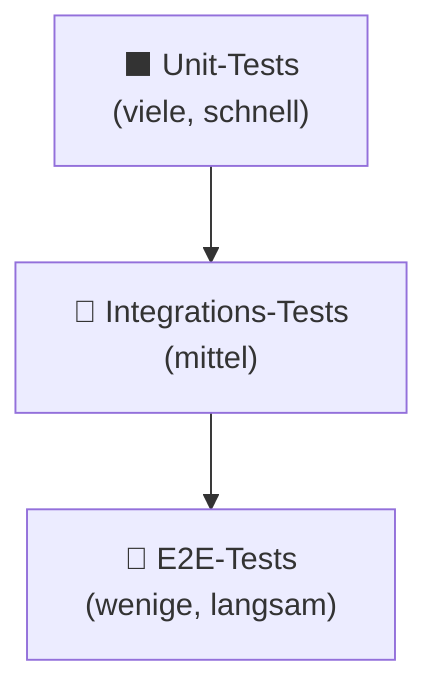

**KI-Empfehlung:** Lass KI zuerst **Unit-Tests** generieren – das ist das Gebiet, wo KI am zuverlässigsten ist.

#### Konzept: Test-getriebene Entwicklung (TDD) mit KI

```
TDD + KI Workflow:
1. Du beschreibst das Verhalten (Anforderung)
2. KI schreibt den Test (was soll der Code tun?)
3. Test läuft und schlägt fehl (ROT)
4. KI schreibt den Code (bis Test grün ist)
5. KI refaktoriert den Code
```

#### Konzept: Was beim KI-Testing zu prüfen ist

KI vergisst häufig:
- **Edge-Cases:** Leere Listen, `None`-Werte, negative Zahlen
- **Fehlerfälle:** Was passiert bei falschen Inputs?
- **Concurrency-Tests:** Parallel-Ausführung
- **Mock-Konsistenz:** Mocks, die zu real existierenden Interfaces passen

```
Prompt-Ergänzung: "Achte besonders auf: leere Eingaben,
None-Werte, Fehler-Cases und Grenzwerte."
```

#### Software – Open Source zuerst:

| Software | Typ | Funktion | Ubuntu | Link |
|---|---|---|---|---|
| 🟩 [pytest](https://pytest.org) | Test-Framework | Python-Standard-Testing | 🐧 Ja | pytest.org |
| 🟩 [Vitest](https://vitest.dev) | Test-Framework | Schnelles JS/TS-Testing | 🐧 Ja | vitest.dev |
| 🟩 [Jest](https://jestjs.io) | Test-Framework | JavaScript-Testing | 🐧 Ja | jestjs.io |
| 🟩 [Playwright](https://playwright.dev) | E2E-Testing | Browser-Automatisierung | 🐧 Ja | playwright.dev |
| 🟩 [Hypothesis](https://hypothesis.readthedocs.io) | Property-Testing | Eigenschafts-basiertes Testen (Python) | 🐧 Ja | hypothesis.readthedocs.io |
| 🟩 [k6](https://k6.io) | Last-Test | Performance-/Last-Tests | 🐧 Ja | k6.io |
| 🟩 [mutmut](https://github.com/boxed/mutmut) | Mutation-Test | Mutationstests für Python | 🐧 Ja | github.com/boxed |

#### Vergleich: Open Source vs. Kommerziell

| Funktion | Open Source 🟩 (Ubuntu) | Kommerziell 💰 |
|---|---|---|
| Python-Testing | pytest + Hypothesis | — |
| JS/TS-Testing | Vitest, Jest | — |
| E2E-Testing | Playwright, Cypress | TestComplete, Mabl |
| KI-Test-Generierung | Continue.dev + Ollama | GitHub Copilot, CodiumAI |
| Mutations-Testing | mutmut (Python) | Stryker (JS, OS) |

---

### 2.6 Thema: Code-Dokumentation mit KI

#### Konzept: Arten von Code-Dokumentation

| Typ | Beschreibung | Tool |
|---|---|---|
| **Docstrings** | Inline-Dokumentation direkt im Code | KI generiert automatisch |
| **README** | Projektbeschreibung & Einstieg | Ollama + Vorlage |
| **API-Dokumentation** | Technische API-Referenz | Sphinx, pdoc |
| **Architektur-Doku** | System-Design & Entscheidungen | draw.io + Markdown |
| **CHANGELOG** | Versionshistorie | git-cliff (automatisch) |

#### Konzept: Docstring-Stile – KI braucht explizite Anweisung

```python
# Google Style (Standard in Python):
def berechne_mwst(preis: float, satz: float = 0.19) -> float:
    """Berechnet den Mehrwertsteuer-Betrag.

    Args:
        preis: Netto-Preis in Euro.
        satz: Steuersatz als Dezimalzahl (Standard: 0.19).

    Returns:
        MwSt-Betrag in Euro.

    Raises:
        ValueError: Wenn Preis oder Satz negativ sind.
    """
    if preis < 0 or satz < 0:
        raise ValueError("Preis und Satz müssen positiv sein.")
    return preis * satz
```

#### Konzept: Automatische Docs aus Code

```bash
# Sphinx (Python) – Dokumentation aus Docstrings
pip install sphinx sphinx-autodoc
sphinx-quickstart docs/
sphinx-build -b html docs/ docs/_build/

# pdoc – einfachere Alternative
pip install pdoc
pdoc mein_modul --html
```

#### Software – Open Source zuerst:

| Software | Typ | Funktion | Ubuntu | Link |
|---|---|---|---|---|
| 🟩 [Sphinx](https://www.sphinx-doc.org/de/master/) | Doku-Generator | Python-Dokumentation aus Docstrings | 🐧 Ja | sphinx-doc.org |
| 🟩 [pdoc](https://pdoc.dev) | Doku-Generator | Einfache Python-API-Docs | 🐧 Ja | pdoc.dev |
| 🟩 [Doxygen](https://www.doxygen.nl) | Doku-Generator | C/C++/Java/Python-Dokumentation | 🐧 Ja | doxygen.nl |
| 🟩 [MkDocs](https://www.mkdocs.org) | Doku-Site | Statische Dokumentations-Website | 🐧 Ja | mkdocs.org |
| 🟩 [git-cliff](https://github.com/orhun/git-cliff) | Changelog | Automatischer CHANGELOG aus Git-Commits | 🐧 Ja | github.com/orhun |
| 🟩 🤖 [Ollama](https://ollama.com) | LLM | Docstrings & README lokal generieren | 🐧 Ja | ollama.com |

#### Vergleich: Open Source vs. Kommerziell

| Funktion | Open Source 🟩 (Ubuntu) | Kommerziell 💰 |
|---|---|---|
| Docstring-Generierung | Continue.dev + Ollama | GitHub Copilot |
| API-Dokumentation | Sphinx, pdoc, Doxygen | ReadMe.io, Swimm |
| Projektdokumentation | MkDocs, Docusaurus | Confluence |
| CHANGELOG | git-cliff | — |

---

### 2.7 Thema: SQL & Datenbanken mit KI

#### Konzept: KI für SQL – Stärken und Grenzen

| KI-Stärke | KI-Grenze |
|---|---|
| SELECT/JOIN-Abfragen schreiben | Komplexe Query-Performance-Optimierung |
| Datenbank-Schema aus Anforderungen | Indexierungs-Strategie für große Daten |
| Migrations-Skripte schreiben | Datenbankspezifische Eigenheiten (Locks, MVCC) |
| Stored Procedures | Sehr komplexe CTEs & Window Functions |

#### Konzept: Text-to-SQL – der richtige Prompt

```
Prompt: "Ich habe folgende Tabellen:
         - users (id, name, email, created_at)
         - orders (id, user_id, total, status, created_at)
         - order_items (id, order_id, product_id, quantity, price)

         Erstelle eine PostgreSQL-Abfrage, die:
         - Alle Nutzer zeigt, die im letzten Monat > 500€ ausgegeben haben
         - Sortiert nach Gesamtausgaben absteigend
         - Nur Bestellungen mit Status 'completed' berücksichtigt"
```

#### Konzept: Datenbankmigrationen mit KI

```python
# Alembic (Python) – KI generiert Migration
"""Add user preferences table."""
from alembic import op
import sqlalchemy as sa

def upgrade():
    op.create_table('user_preferences',
        sa.Column('id', sa.Integer, primary_key=True),
        sa.Column('user_id', sa.Integer, sa.ForeignKey('users.id')),
        sa.Column('key', sa.String(100), nullable=False),
        sa.Column('value', sa.Text),
    )
```

#### Software – Open Source zuerst:

| Software | Typ | Funktion | Ubuntu | Link |
|---|---|---|---|---|
| 🟩 [PostgreSQL](https://www.postgresql.org) | Datenbank | Leistungsfähigste Open-Source-DB | 🐧 Ja | postgresql.org |
| 🟩 [SQLite](https://sqlite.org) | Datenbank | Dateibasiert, ideal zum Entwickeln | 🐧 Ja | sqlite.org |
| 🟩 [DBeaver](https://dbeaver.io) | DB-GUI | Universal-Datenbank-GUI | 🐧 Ja | dbeaver.io |
| 🟩 [Alembic](https://alembic.sqlalchemy.org) | Migrationen | Python-Datenbank-Migrationen | 🐧 Ja | alembic.sqlalchemy.org |
| 🟩 [Flyway (Community)](https://flywaydb.org) | Migrationen | SQL-Datenbank-Migrationen | 🐧 Ja | flywaydb.org |
| 🟩 [pgvector](https://github.com/pgvector/pgvector) | Vektor-DB | KI-Embeddings in PostgreSQL | 🐧 Ja | github.com/pgvector |

#### Vergleich: Open Source vs. Kommerziell

| Funktion | Open Source 🟩 (Ubuntu) | Kommerziell 💰 |
|---|---|---|
| SQL-Datenbank | PostgreSQL, MariaDB, SQLite | Oracle, MS SQL Server |
| DB-GUI | DBeaver, Adminer | DataGrip, TablePlus |
| Datenbank-Migrationen | Alembic, Flyway Community | Flyway Pro |
| Vektor-Datenbank | pgvector, Chroma | Pinecone, Weaviate Cloud |
| SQL-KI-Assistent | Ollama + Prompt | GitHub Copilot |

---

### 2.8 Thema: APIs entwickeln mit KI

#### Konzept: API-Design-Prinzipien mit KI

**REST API Design Checklist – KI im Prompt einfordern:**

```
Prompt: "Entwirf eine REST API für [Feature].
         Beachte: HTTP-Verben korrekt, sinnvolle Status-Codes,
         Versionierung (/api/v1/), JSON-Response-Format,
         Pagination bei Listen, Error-Response-Schema."
```

#### Konzept: OpenAPI/Swagger – KI generiert Spezifikation

```yaml
# OpenAPI 3.0 – von KI aus Beschreibung generiert
openapi: 3.0.0
info:
  title: User API
  version: 1.0.0
paths:
  /api/v1/users:
    get:
      summary: Alle Benutzer abrufen
      parameters:
        - name: page
          in: query
          schema:
            type: integer
      responses:
        '200':
          description: Erfolgreich
```

#### Software – Open Source zuerst:

| Software | Typ | Funktion | Ubuntu | Link |
|---|---|---|---|---|
| 🟩 [FastAPI](https://fastapi.tiangolo.com) | Framework | Python-API mit auto OpenAPI-Docs | 🐧 Ja | fastapi.tiangolo.com |
| 🟩 [Hono](https://hono.dev) | Framework | Ultraschnelles TypeScript-API-Framework | 🐧 Ja | hono.dev |
| 🟩 [Bruno](https://www.usebruno.com) | API-Client | Open-Source Postman-Alternative | 🐧 Ja | usebruno.com |
| 🟩 [Insomnia (Open)](https://insomnia.rest) | API-Client | REST- & GraphQL-Client | 🐧 Ja | insomnia.rest |
| 🟩 [Swagger UI](https://swagger.io/tools/swagger-ui/) | API-Docs | OpenAPI-Dokumentation visualisieren | 🐧 Ja | swagger.io |
| 🟩 [httpie](https://httpie.io) | CLI | Benutzerfreundlicher HTTP-Client | 🐧 Ja | httpie.io |

#### Vergleich: Open Source vs. Kommerziell

| Funktion | Open Source 🟩 (Ubuntu) | Kommerziell 💰 |
|---|---|---|
| API-Framework | FastAPI, Hono, Express.js | — |
| API-Client | Bruno, Insomnia (Open) | Postman |
| API-Dokumentation | Swagger UI (aus FastAPI auto) | ReadMe.io |

---

## 🔴 Phase 3 – Fortgeschritten

> **Was lerne ich hier?**  
> KI-Agenten für autonomes Coding einsetzen, CI/CD-Pipelines mit KI aufbauen, Sicherheitslücken erkennen und eigene Modelle anpassen.  
> **Voraussetzungen:** Phase 1 & 2 abgeschlossen. Solide Programmierkenntnisse.

---

### 3.1 Konzept: KI als autonomer Entwicklungs-Agent

#### Konzept: Was ist ein Coding-Agent?

Ein **Coding-Agent** erhält eine Aufgabe auf hoher Ebene und führt selbstständig mehrere Schritte aus:

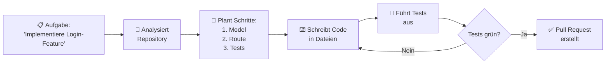

#### Konzept: Grenzen autonomer Coding-Agenten (2026)

- ✅ Gut: Boilerplate, CRUD, einfache Features
- ✅ Gut: Refactoring nach klaren Regeln
- ❌ Schlecht: Komplexe Architekturentscheidungen
- ❌ Schlecht: Sicherheitskritischen Code ohne Review
- ❌ Schlecht: Domänenspezifische Geschäftslogik

---

### 3.2 Thema: Code-Review mit KI

#### Konzept: KI-Code-Review – was sie prüft

| Review-Aspekt | KI-Eignung | Was KI erkennt |
|---|---|---|
| **Lesbarkeit** | ✅ Sehr gut | Unklare Variablennamen, Komplexität |
| **DRY-Verletzungen** | ✅ Sehr gut | Code-Duplizierungen |
| **Einfache Bugs** | ✅ Gut | Off-by-one, Null-Pointer |
| **Sicherheitslücken** | 🟡 Mittel | Bekannte Muster (SQL-Injection, XSS) |
| **Performance** | 🟡 Mittel | Offensichtliche N+1-Queries |
| **Architektur** | ❌ Gering | Braucht Gesamtkontext |

#### Konzept: Automatisches Code-Review in CI/CD

```yaml
# Woodpecker CI: KI-Review vor Merge
steps:
  - name: ki-review
    image: python:3.12
    commands:
      - pip install aider-chat
      - aider --review --model ollama/deepseek-coder-v2 src/
```

#### Software – Open Source zuerst:

| Software | Typ | Funktion | Ubuntu | Link |
|---|---|---|---|---|
| 🟩 [reviewdog](https://github.com/reviewdog/reviewdog) | Code-Review | Automatisierter Review-Kommentar in PRs | 🐧 Ja | github.com/reviewdog |
| 🟩 [SonarQube (Community)](https://www.sonarqube.org) | Code-Analyse | Code-Qualität & Bugs automatisch | 🐧 Ja | sonarqube.org |
| 🟩 [Pylint](https://pylint.org) | Linter | Python-Code-Analyse | 🐧 Ja | pylint.org |
| 🟩 [Ruff](https://github.com/astral-sh/ruff) | Linter | Sehr schneller Python-Linter | 🐧 Ja | github.com/astral-sh |
| 🟩 [ESLint](https://eslint.org) | Linter | JavaScript/TypeScript-Analyse | 🐧 Ja | eslint.org |
| 🟩 [pre-commit](https://pre-commit.com) | Git-Hooks | Checks vor jedem Commit | 🐧 Ja | pre-commit.com |

#### Vergleich: Open Source vs. Kommerziell

| Funktion | Open Source 🟩 (Ubuntu) | Kommerziell 💰 |
|---|---|---|
| Code-Analyse | SonarQube Community, semgrep | SonarQube Pro, DeepSource |
| Linter (Python) | Ruff, Pylint, Flake8 | — |
| Linter (JS/TS) | ESLint, Biome | — |
| KI-Code-Review | reviewdog + Ollama | GitHub Copilot Review |
| Git-Hooks | pre-commit | — |

---

### 3.3 Thema: CI/CD mit KI-Unterstützung

#### Konzept: Was ist CI/CD?

| Begriff | Bedeutung | Automatisierung |
|---|---|---|
| **CI** (Continuous Integration) | Automatisch testen bei jedem Push | Tests, Linting, Code-Review |
| **CD** (Continuous Delivery) | Automatisch deployen nach CI | Build, Deployment |

#### Konzept: KI in der CI/CD-Pipeline

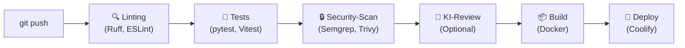

#### Software – Open Source zuerst:

| Software | Typ | Funktion | Ubuntu | Link |
|---|---|---|---|---|
| 🟩 [Woodpecker CI](https://woodpecker-ci.org) | CI/CD | Leichtgewichtiges Open-Source CI | 🐧 Ja | woodpecker-ci.org |
| 🟩 [Gitea Actions](https://gitea.io/de-de/) | CI/CD | GitHub-Actions-kompatibles CI | 🐧 Ja | gitea.io |
| 🟩 [Jenkins](https://www.jenkins.io) | CI/CD | Sehr mächtiges Open-Source CI | 🐧 Ja | jenkins.io |
| 🟩 [Docker](https://www.docker.com) | Container | Build & Deployment-Container | 🐧 Ja | docker.com |
| 🟩 [Trivy](https://github.com/aquasecurity/trivy) | Security-Scan | Container- & Code-Vulnerability-Scan | 🐧 Ja | github.com/aquasecurity |
| 🟩 [Coolify](https://coolify.io) | PaaS | Self-hosted Deploy-Plattform | 🐧 Ja | coolify.io |

#### Vergleich: Open Source vs. Kommerziell

| Funktion | Open Source 🟩 (Ubuntu) | Kommerziell 💰 |
|---|---|---|
| CI/CD-System | Woodpecker CI, Jenkins, Gitea Actions | GitHub Actions, CircleCI |
| Deployment-Plattform | Coolify, Caprover | Heroku, Render, Railway |
| Container-Registry | Gitea Registry, Harbor | GitHub Packages, DockerHub |

---

### 3.4 Thema: Sicherheit im Code mit KI

#### Konzept: OWASP Top 10 – KI hilft bei der Prüfung

| Rang | Sicherheitslücke | KI-Prüf-Prompt |
|---|---|---|
| 1 | Broken Access Control | „Prüfe, ob alle Endpunkte Authentifizierung erfordern" |
| 2 | Cryptographic Failures | „Werden Passwörter mit bcrypt/Argon2 gehasht?" |
| 3 | Injection (SQL/XSS) | „Gibt es ungeprüfte Nutzereingaben in SQL-Abfragen?" |
| 4 | Insecure Design | „Analysiere das Design auf Sicherheitslücken" |
| 5 | Security Misconfiguration | „Sind Debug-Modi und Standard-Passwörter deaktiviert?" |

#### Konzept: KI-Security-Review – Prompt-Vorlage

```
Prompt: "Du bist ein erfahrener Security-Auditor.
         Überprüfe diesen Code auf folgende Lücken:
         1. SQL-Injection
         2. XSS-Angriffspunkte
         3. Unsichere Passwort-Speicherung
         4. Fehlende Eingabe-Validierung
         5. Exposed API-Keys oder Secrets

         Code: [Code einfügen]

         Liste jeden Fund mit: Zeile, Schweregrad (kritisch/hoch/mittel), Fix-Vorschlag."
```

#### Software – Open Source zuerst:

| Software | Typ | Funktion | Ubuntu | Link |
|---|---|---|---|---|
| 🟩 [Semgrep](https://semgrep.dev) | SAST | Code-Pattern-basierter Security-Scanner | 🐧 Ja | semgrep.dev |
| 🟩 [Bandit](https://bandit.readthedocs.io) | SAST | Python-Security-Linter | 🐧 Ja | bandit.readthedocs.io |
| 🟩 [OWASP ZAP](https://www.zaproxy.org) | DAST | Dynamischer Web-Security-Scanner | 🐧 Ja | zaproxy.org |
| 🟩 [Trivy](https://github.com/aquasecurity/trivy) | Scan | Dependency- & Container-Scan | 🐧 Ja | github.com/aquasecurity |
| 🟩 [truffleHog](https://github.com/trufflesecurity/trufflehog) | Secret-Scan | Secrets in Git-History finden | 🐧 Ja | github.com/trufflesecurity |
| 🟩 [gitleaks](https://github.com/gitleaks/gitleaks) | Secret-Scan | Secrets im Code verhindern | 🐧 Ja | github.com/gitleaks |

#### Vergleich: Open Source vs. Kommerziell

| Funktion | Open Source 🟩 (Ubuntu) | Kommerziell 💰 |
|---|---|---|
| Static Code Analysis (SAST) | Semgrep, Bandit, SonarQube | Checkmarx, Veracode |
| Dynamic Analysis (DAST) | OWASP ZAP | Burp Suite Pro |
| Dependency-Scan | Trivy, OWASP Dependency-Check | Snyk Pro, Black Duck |
| Secret-Detection | truffleHog, gitleaks | GitGuardian |

---

### 3.5 Thema: KI-Agenten für Softwareentwicklung

#### Konzept: Autonome Entwicklungs-Agenten verstehen

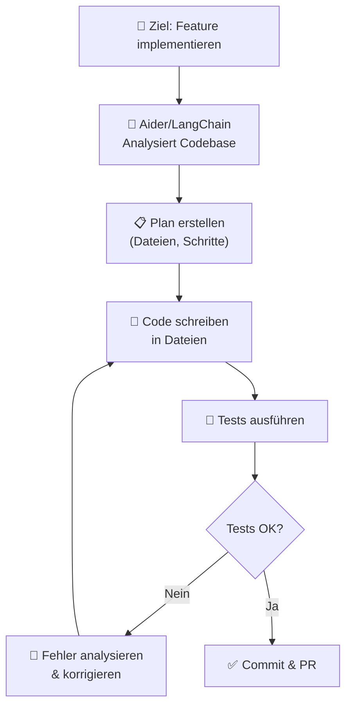

#### Konzept: Multi-Agenten für komplexe Projekte

| Agent | Rolle | Tool |
|---|---|---|
| **Architect** | Architektur planen | Ollama + Claude API |
| **Developer** | Code schreiben | Aider + DeepSeek Coder |
| **Tester** | Tests schreiben | Ollama + pytest |
| **Reviewer** | Code prüfen | Semgrep + Ollama |
| **DevOps** | CI/CD konfigurieren | LangChain + Shell |

#### Software – Open Source zuerst:

| Software | Typ | Funktion | Ubuntu | Link |
|---|---|---|---|---|
| 🟩 [Aider](https://aider.chat) | KI-Agent | Vollständigster Open-Source Coding-Agent | 🐧 Ja | aider.chat |
| 🟩 [LangChain](https://www.langchain.com) | Framework | LLM-Agenten-Framework (Python) | 🐧 Ja | langchain.com |
| 🟩 [CrewAI](https://www.crewai.com) | Framework | Multi-Agenten-Teams | 🐧 Ja | crewai.com |
| 🟩 [AutoGen (Microsoft)](https://microsoft.github.io/autogen/) | Framework | Multi-Agenten-Konversation | 🐧 Ja | microsoft.github.io/autogen |
| 🟩 [SWE-agent](https://github.com/princeton-nlp/SWE-agent) | KI-Agent | Löst GitHub-Issues automatisch | 🐧 Ja | github.com/princeton-nlp |

#### Vergleich: Open Source vs. Kommerziell

| Funktion | Open Source 🟩 (Ubuntu) | Kommerziell 💰 |
|---|---|---|
| Coding-Agent | Aider + Ollama / DeepSeek | Devin, GitHub Copilot Workspace |
| Agenten-Framework | LangChain, CrewAI, AutoGen | — |
| Issue-Löser | SWE-agent | Devin |
| Repository-Verständnis | Aider (Repo-Map) | Cursor, Sourcegraph |

---

### 3.6 Thema: Eigene Modelle fine-tunen

#### Konzept: Wann ist Fine-Tuning sinnvoll?

| Situation | Fine-Tuning sinnvoll? | Alternative |
|---|---|---|
| Firmeneigener Code-Stil | ✅ Ja | Oder: Few-Shot-Prompts |
| Proprietäre DSL/API | ✅ Ja | Oder: RAG mit Dokumentation |
| Allgemeines Coding | ❌ Nein | Base-Modell reicht |
| Datenschutz-kritisch | ✅ Ja (lokal) | Lokales Fine-Tuning |

#### Konzept: Fine-Tuning-Methoden

| Methode | Beschreibung | Tool |
|---|---|---|
| **LoRA** | Effizientes Fine-Tuning (Low-Rank Adaptation) | Unsloth, axolotl |
| **QLoRA** | LoRA mit Quantisierung (weniger GPU-RAM) | Unsloth |
| **Full Fine-Tuning** | Vollständiges Training | Nur bei sehr großen Ressourcen |

#### Software – Open Source zuerst:

| Software | Typ | Funktion | Ubuntu | Link |
|---|---|---|---|---|
| 🟩 [Unsloth](https://github.com/unslothai/unsloth) | Fine-Tuning | Schnellstes LoRA/QLoRA Fine-Tuning | 🐧 Ja | github.com/unslothai |
| 🟩 [axolotl](https://github.com/axolotl-ai-cloud/axolotl) | Fine-Tuning | Flexibles Fine-Tuning-Framework | 🐧 Ja | github.com/axolotl-ai-cloud |
| 🟩 [Hugging Face Transformers](https://huggingface.co/docs/transformers) | ML-Framework | Standard für Modell-Training | 🐧 Ja | huggingface.co |
| 🟩 [Ollama (Custom Models)](https://ollama.com) | LLM-Server | Fine-tuned Modelle lokal deployen | 🐧 Ja | ollama.com |

---

## 📋 Praxisprojekte

### 🟢 Einsteiger: Erste KI-Coding-Umgebung aufsetzen

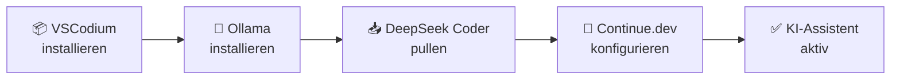

```bash
# Schritt für Schritt (Ubuntu)
# 1. Ollama
curl -fsSL https://ollama.com/install.sh | sh
# 2. Code-Modell laden
ollama pull deepseek-coder-v2
# 3. VSCodium + Continue.dev Extension installieren
# 4. Continue.dev auf Ollama konfigurieren
```

**Software (alle Open Source):** Ollama · DeepSeek Coder · VSCodium · Continue.dev

---

### 🟡 Fortgeschritten: REST-API mit KI entwickeln & testen

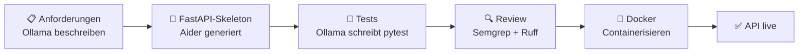

**Software (alle Open Source):** Ollama · Aider · FastAPI · pytest · Semgrep · Ruff · Docker

---

### 🟡 Fortgeschritten: Legacy-Code refaktorieren mit Aider

```bash
# Aider mit lokalem Modell
pip install aider-chat
aider --model ollama/deepseek-coder-v2 legacy_code.py

# Im Aider-Dialog:
# > Refaktoriere diesen Code:
#   - DRY-Prinzip anwenden
#   - Type Hints hinzufügen
#   - Google-Docstrings hinzufügen
#   - Tests mit pytest schreiben
```

**Software (alle Open Source):** Aider · Ollama · pytest · Ruff

---

### 🔴 Experte: Vollständige CI/CD-Pipeline mit KI-Review

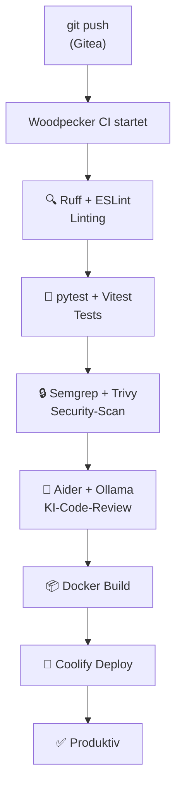

**Software (alle Open Source):** Gitea · Woodpecker CI · Ruff · pytest · Semgrep · Trivy · Aider · Ollama · Docker · Coolify

---

## 📦 Vollständige Softwareübersicht & Vergleich

### LLM-Modelle (immer gelistet – unabhängig vom Preis)

| Software | Lokal / Cloud | Ubuntu | Preis | Link |
|---|---|---|---|---|
| 🟩 🤖 [Ollama](https://ollama.com) | Lokal | 🐧 Ja | Kostenlos | ollama.com |
| 🟩 🤖 [LM Studio](https://lmstudio.ai) | Lokal | 🐧 Ja | Kostenlos | lmstudio.ai |
| 🟩 🤖 [Jan.ai](https://jan.ai) | Lokal | 🐧 Ja | Kostenlos | jan.ai |
| 🟩 🤖 [llama.cpp](https://github.com/ggerganov/llama.cpp) | Lokal | 🐧 Ja | Kostenlos | github.com/ggerganov |
| 🤖 [ChatGPT](https://chat.openai.com) | Cloud | 🌐 Web | Freemium | openai.com |
| 🤖 [Claude](https://claude.ai) | Cloud | 🌐 Web | Freemium | claude.ai |
| 🤖 [Gemini](https://gemini.google.com) | Cloud | 🌐 Web | Freemium | gemini.google.com |

### KI-Code-Assistenten

| Funktion | Open Source 🟩 (Ubuntu) | Kommerziell 💰 |
|---|---|---|
| IDE-KI-Plugin | Continue.dev + Ollama | GitHub Copilot, Tabnine Pro |
| Terminal-KI-Agent | Aider + Ollama | Cursor, Windsurf |
| Repository-Verständnis | Aider (Repo-Map), Sourcegraph Cody Free | Cursor, Devin |
| Multi-File-Agent | Aider, SWE-agent | Devin, GitHub Copilot Workspace |

### Entwicklungsumgebung

| Funktion | Open Source 🟩 (Ubuntu) | Kommerziell 💰 |
|---|---|---|
| Code-Editor | VSCodium, Neovim | JetBrains IDEs, Cursor |
| Git-Hosting | Gitea (self-hosted) | GitHub, GitLab |
| Diagramme | draw.io | Lucidchart, Miro |

### Programmiersprachen-Tools

| Sprache | Linter 🟩 | Formatter 🟩 | Test-Framework 🟩 |
|---|---|---|---|
| Python | Ruff, Pylint | Black, Ruff | pytest, Hypothesis |
| JavaScript | ESLint, Biome | Prettier, Biome | Jest, Vitest |
| TypeScript | ESLint + ts-eslint | Prettier | Vitest, Jest |
| Go | golangci-lint | gofmt | testing (stdlib) |
| Rust | Clippy | rustfmt | cargo test |

### Testing

| Funktion | Open Source 🟩 (Ubuntu) | Kommerziell 💰 |
|---|---|---|
| Unit-Testing (Python) | pytest, Hypothesis | — |
| Unit-Testing (JS/TS) | Vitest, Jest | — |
| E2E-Testing | Playwright, Cypress | TestComplete, Mabl |
| Last-/Performance-Tests | k6, Gatling | Loader.io |
| Mutations-Testing | mutmut (Python), Stryker (JS) | — |
| KI-Test-Generierung | Continue.dev + Ollama | GitHub Copilot, CodiumAI |

### Code-Qualität & Review

| Funktion | Open Source 🟩 (Ubuntu) | Kommerziell 💰 |
|---|---|---|
| Code-Analyse | SonarQube Community, semgrep | SonarQube Pro |
| Git-Hooks | pre-commit | — |
| Review-Automation | reviewdog | — |
| Dependency-Updates | Renovate (self-hosted) | Dependabot |

### Dokumentation

| Funktion | Open Source 🟩 (Ubuntu) | Kommerziell 💰 |
|---|---|---|
| Python-API-Docs | Sphinx, pdoc | ReadMe.io |
| Allgemeine Doku | MkDocs, Docusaurus | Confluence |
| C/C++/Java-Docs | Doxygen | — |
| CHANGELOG | git-cliff | — |

### Datenbanken

| Funktion | Open Source 🟩 (Ubuntu) | Kommerziell 💰 |
|---|---|---|
| SQL-Datenbank | PostgreSQL, MariaDB, SQLite | Oracle, MS SQL Server |
| DB-GUI | DBeaver, Adminer | DataGrip, TablePlus |
| Migrationen | Alembic, Flyway Community | Flyway Pro |
| Vektor-Datenbank | pgvector, Chroma | Pinecone |

### Sicherheit

| Funktion | Open Source 🟩 (Ubuntu) | Kommerziell 💰 |
|---|---|---|
| Static Analysis (SAST) | Semgrep, Bandit | Checkmarx, Veracode |
| Dynamic Analysis (DAST) | OWASP ZAP | Burp Suite Pro |
| Dependency-Scan | Trivy, OWASP Dependency-Check | Snyk Pro |
| Secret-Detection | truffleHog, gitleaks | GitGuardian |

### CI/CD & Deployment

| Funktion | Open Source 🟩 (Ubuntu) | Kommerziell 💰 |
|---|---|---|
| CI/CD-System | Woodpecker CI, Jenkins, Gitea Actions | GitHub Actions, CircleCI |
| Deployment-Plattform | Coolify, Caprover | Heroku, Render |
| Containerisierung | Docker, Podman | — |
| Container-Orchestrierung | K3s, Kubernetes | — |

### KI-Agenten & Fine-Tuning

| Funktion | Open Source 🟩 (Ubuntu) | Kommerziell 💰 |
|---|---|---|
| Coding-Agent | Aider, SWE-agent | Devin |
| Agenten-Framework | LangChain, CrewAI, AutoGen | — |
| Fine-Tuning | Unsloth, axolotl | — |
| Modell-Training | Hugging Face Transformers | — |

---

## Weiterführende Ressourcen

- **[Aider Leaderboard](https://aider.chat/docs/leaderboards/)** – Beste Coding-Modelle im Vergleich 🟩
- **[Ollama Library](https://ollama.com/library)** – Verfügbare lokale Code-LLMs 🟩
- **[OWASP Top 10](https://owasp.org/www-project-top-ten/)** – Sicherheitslücken kennen & vermeiden
- **[Semgrep Registry](https://semgrep.dev/r)** – Öffentliche Security-Regeln 🟩
- **[Hugging Face Code Models](https://huggingface.co/models?pipeline_tag=text-generation&sort=trending)** – Code-LLMs entdecken 🟩
- **[papers-with-code: Code Generation](https://paperswithcode.com/task/code-generation)** – Aktuelle Forschung

---

*Letzte Aktualisierung: Juli 2026*
