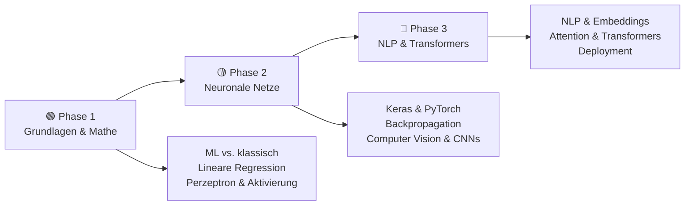
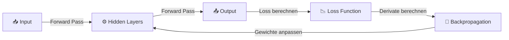
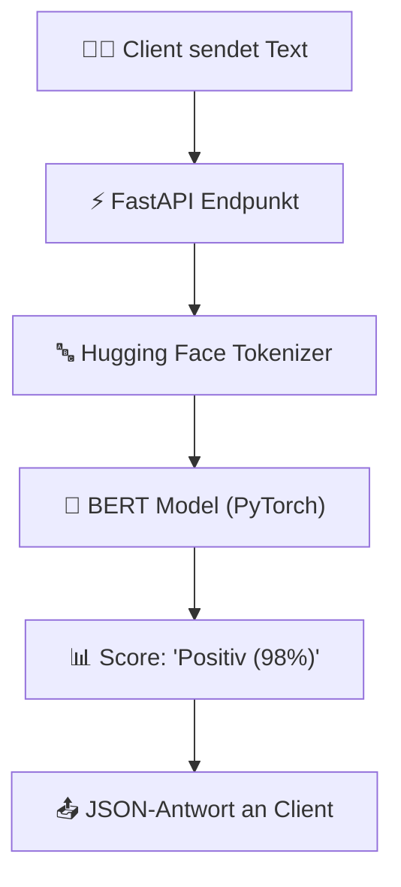

# Schrödinger programmiert KI

> **Hinweis zur Software-Auswahl:**  
> Diese Dokumentation priorisiert **Open-Source-Software**, die unter Ubuntu installiert und betrieben werden kann.  
> Bei kommerziellen Services wird stets eine **Open-Source-Alternative** mit gleichem Funktionsumfang gegenübergestellt.  
> **LLM-Modelle** und APIs werden unabhängig vom Preis gelistet, da sie als Schnittstellen für eigene Anwendungen dienen.

---

## Legende

| Symbol | Bedeutung |
|---|---|
| 🟩 | Open Source – kostenlos, lokal / Ubuntu-kompatibel |
| 💰 | Kostenpflichtig |
| 🤖 | LLM-Modell / API – bleibt immer gelistet |
| 🐧 | Linux / Ubuntu nativ |
| 🌐 | Nur Web-Browser |

---

## Lernpfad-Übersicht



---

## Inhaltsverzeichnis

- [🟢 Phase 1 – Grundlagen & Erste Gehversuche](#phase-1-grundlagen-erste-gehversuche)
    - [1.1 Konzept: Klassische Programmierung vs. Maschinelles Lernen](#11-konzept-klassische-programmierung-vs-maschinelles-lernen)
    - [1.2 Konzept: Was ist ein Perzeptron?](#12-konzept-was-ist-ein-perzeptron)
    - [1.3 Thema: Lineare Regression mit Python](#13-thema-lineare-regression-mit-python)
    - [1.4 Thema: Entwicklungsumgebung einrichten (Jupyter Lab)](#14-thema-entwicklungsumgebung-einrichten-jupyter-lab)
- [🟡 Phase 2 – Deep Learning & Neuronale Netze](#phase-2-deep-learning-neuronale-netze)
    - [2.1 Konzept: Wie lernt ein neuronales Netz? (Backpropagation)](#21-konzept-wie-lernt-ein-neuronales-netz-backpropagation)
    - [2.2 Thema: Erste Netze bauen mit Keras & PyTorch](#22-thema-erste-netze-bauen-mit-keras-pytorch)
    - [2.3 Thema: Bilderkennung mit Convolutional Neural Networks (CNN)](#23-thema-bilderkennung-mit-convolutional-neural-networks-cnn)
    - [2.4 Thema: Overfitting vermeiden (Regularisierung)](#24-thema-overfitting-vermeiden-regularisierung)
- [🔴 Phase 3 – Transformers, NLP & Eigene Modelle](#phase-3-transformers-nlp-eigene-modelle)
    - [3.1 Konzept: NLP und der Weg zum Transformer](#31-konzept-nlp-und-der-weg-zum-transformer)
    - [3.2 Thema: Textklassifizierung und Embeddings](#32-thema-textklassifizierung-und-embeddings)
    - [3.3 Thema: Die Transformer-Architektur & Attention](#33-thema-die-transformer-architektur-attention)
    - [3.4 Thema: Eigene KI-Modelle deployen](#34-thema-eigene-ki-modelle-deployen)
- [📋 Praxisprojekte](#praxisprojekte)
- [📦 Vollständige Softwareübersicht & Vergleich](#vollstandige-softwareubersicht-vergleich)

---

## 🟢 Phase 1 – Grundlagen & Erste Gehversuche

> **Was lerne ich hier?**  
> Den Unterschied zwischen klassischem Code und KI, wie ein einzelnes künstliches Neuron (Perzeptron) funktioniert und wie man lineare Zusammenhänge vorhersagt.  
> **Voraussetzungen:** Python-Grundkenntnisse.

---

### 1.1 Konzept: Klassische Programmierung vs. Maschinelles Lernen

#### Der Paradigmenwechsel

In der klassischen Softwareentwicklung schreibt der Mensch **Regeln** und füttert sie mit **Daten**, um **Antworten** zu erhalten. Im Maschinellen Lernen füttert der Mensch **Daten** und **Antworten** (Labels) in die Maschine, und die KI berechnet die **Regeln** selbstständig.

```
Klassisch:  Daten + Regeln ----------> [ Programm ] ----------> Antworten
ML-Weg:     Daten + Antworten -------> [ Training ] ----------> Regeln (Modell)
```

---

### 1.2 Konzept: Was ist ein Perzeptron?

#### Das künstliche Neuron

Ein Perzeptron nimmt mehrere Eingabewerte ($x_1, x_2$), multipliziert sie mit Gewichten ($w_1, w_2$), addiert einen Bias ($b$) und jagt das Ergebnis durch eine **Aktivierungsfunktion** (z. B. die Sigmoid-Funktion), um eine Ausgabe (0 oder 1) zu erzeugen.

```
x1 --( * w1 )--\
                +--> [ Summe + Bias ] --> [ Aktivierungsfunktion ] --> Output (y)
x2 --( * w2 )--/
```

| Aktivierungsfunktion | Mathematische Formel | Anwendung |
|---|---|---|
| **Step Function** | $f(x) = 1$ falls $x \ge 0$, sonst $0$ | Klassisches Perzeptron (binär) |
| **Sigmoid** | $f(x) = \frac{1}{1 + e^{-x}}$ | Wahrscheinlichkeiten (0 bis 1) |
| **ReLU** | $f(x) = \max(0, x)$ | Standard in tiefen Netzen |

---

### 1.3 Thema: Lineare Regression mit Python

#### Konzept: Die Regressionsgerade

Die lineare Regression versucht, eine gerade Linie durch Datenpunkte zu legen, um Vorhersagen zu treffen ($y = m \cdot x + b$). Die Abweichungen der Punkte zur Linie (Loss) werden über die Methode der kleinsten Quadrate (MSE) minimiert.

#### Software – alle Open Source:

| Software | Typ | Funktion | Ubuntu | Link |
|---|---|---|---|---|
| 🟩 [NumPy](https://numpy.org) | Python-Lib | Mathematische Berechnungen & Vektoren | 🐧 Ja | numpy.org |
| 🟩 [pandas](https://pandas.pydata.org) | Python-Lib | Datenanalyse & Tabellenverarbeitung | 🐧 Ja | pandas.pydata.org |
| 🟩 [scikit-learn](https://scikit-learn.org) | Python-Lib | Standard-ML für Regression & Klassifikation | 🐧 Ja | scikit-learn.org |

---

### 1.4 Thema: Entwicklungsumgebung einrichten (Jupyter Lab)

#### Konzept: Interaktives Coding (REPL)

KI-Entwicklung ist experimentell. Anstatt das gesamte Skript neu zu starten, erlauben Jupyter Notebooks das Ausführen einzelner Code-Zellen im Webbrowser, während Variablen im RAM erhalten bleiben.

#### Software – Open Source zuerst:

| Software | Typ | Funktion | Ubuntu | Link |
|---|---|---|---|---|
| 🟩 [Jupyter Lab](https://jupyter.org) | Web-Editor | Die moderne Entwicklungsumgebung für Data Science | 🐧 Ja | jupyter.org |
| 🟩 [VSCodium](https://vscodium.com) | Desktop-Editor | Open-Source-Editor mit hervorragender Jupyter-Unterstützung | 🐧 Ja | vscodium.com |

#### Vergleich: Open Source vs. Kommerziell

| Funktion | Open Source 🟩 (Ubuntu / Self-hosted) | Kommerziell 💰 |
|---|---|---|
| Notebook-Hosting | Jupyter Lab | Google Colab Enterprise, Hex.tech |

---

## 🟡 Phase 2 – Deep Learning & Neuronale Netze

> **Was lerne ich hier?**  
> Wie du neuronale Netze mit mehreren Schichten aufbaust, Bilder klassifizierst und verhinderst, dass deine KI auswendig lernt.  
> **Voraussetzungen:** Phase 1 abgeschlossen.

---

### 2.1 Konzept: Wie lernt ein neuronales Netz? (Backpropagation)

#### Vorwärts & Rückwärts durch das Netz



1. **Forward Pass:** Daten fließen durch das Netz; eine Vorhersage wird getroffen.
2. **Loss Function (Fehlerfunktion):** Berechnet, wie weit die Vorhersage vom echten Wert entfernt ist.
3. **Backpropagation:** Der Fehler wird rückwärts durch das Netz geleitet (Kettenregel der Ableitung), um zu berechnen, welches Gewicht wie stark angepasst werden muss.
4. **Gradient Descent:** Die Gewichte werden angepasst, um den Fehler zu minimieren.

---

### 2.2 Thema: Erste Netze bauen mit Keras & PyTorch

#### Konzept: Deklarativer vs. Imperativer Code

- **Keras (TensorFlow):** Sehr einfach, baut Netze wie Legosteine (sequenziell).
- **PyTorch:** Flexibel, dynamisch, objektorientiert. Standard in der Forschung.

```python
# Keras – Minimales Beispiel
from tensorflow import keras

model = keras.Sequential([
    keras.layers.Dense(64, activation='relu', input_shape=(10,)),
    keras.layers.Dense(1, activation='sigmoid')
])
model.compile(optimizer='adam', loss='binary_crossentropy')
```

#### Software – alle Open Source:

| Software | Typ | Funktion | Ubuntu | Link |
|---|---|---|---|---|
| 🟩 [TensorFlow / Keras](https://www.tensorflow.org) | Deep Learning | Einfaches, stabiles Deep-Learning-Framework | 🐧 Ja | tensorflow.org |
| 🟩 [PyTorch](https://pytorch.org) | Deep Learning | Dynamisches, forschungsorientiertes ML-Framework | 🐧 Ja | pytorch.org |

---

### 2.3 Thema: Bilderkennung mit Convolutional Neural Networks (CNN)

#### Konzept: Wie KIs Bilder „sehen"

Ein normales Netz scheitert an Bildern, da es die räumliche Struktur verliert. **CNNs** nutzen Filter (Faltungen / Convolutions), um Kanten, Formen und schließlich Objekte im Bild zu erkennen.

```
Bild (Pixel-Matrix) -> Convolution (Filter anwenden) -> Pooling (Auflösung reduzieren) -> Dense Layer
```

#### Software – alle Open Source:

| Software | Typ | Funktion | Ubuntu | Link |
|---|---|---|---|---|
| 🟩 [OpenCV](https://opencv.org) | Bildverarbeitung | Bild-Vorbereitung (Größe ändern, Graustufen) | 🐧 Ja | opencv.org |
| 🟩 [Pillow](https://python-pillow.org) | Bildverarbeitung | Einfache Python-Bildmanipulations-Bibliothek | 🐧 Ja | python-pillow.org |

---

### 2.4 Thema: Overfitting vermeiden (Regularisierung)

#### Auswendiglernen verhindern

Wenn eine KI auf den Trainingsdaten 100% erreicht, aber auf Testdaten schlecht abschneidet, hat sie die Daten **überangepasst** (Overfitting). Sie hat auswendig gelernt statt generalisiert.

| Methode | Prinzip |
|---|---|
| **Dropout** | Schaltet zufällig während des Trainings Neuronen ab, um Redundanz zu erzwingen. |
| **Early Stopping** | Beendet das Training, sobald der Fehler auf den Testdaten wieder steigt. |
| **Data Augmentation** | Verzerrt, dreht oder spiegelt Trainingsbilder, um mehr Varianz zu erzeugen. |

---

## 🔴 Phase 3 – Transformers, NLP & Eigene Modelle

> **Was lerne ich hier?**  
> Wie Sprachmodelle Text verarbeiten, was der Attention-Mechanismus ist und wie du eigene kleine Modelle stabil auf Servern betreibst.  
> **Voraussetzungen:** Phase 1 & 2 abgeschlossen.

---

### 3.1 Konzept: NLP und der Weg zum Transformer

#### Die Evolution der Textverarbeitung

1. **Bag of Words / One-Hot Encoding:** Wörter werden isoliert gezählt. Wortreihenfolge und Bedeutung gehen verloren.
2. **RNN / LSTM:** Verarbeitet Wörter nacheinander. Hat ein Kurzzeitgedächtnis, scheitert aber an langen Sätzen.
3. **Transformer (Attention):** Verarbeitet alle Wörter **gleichzeitig** und berechnet, welche Wörter im Satz zueinander in Beziehung stehen (Kontext).

---

### 3.2 Thema: Textklassifizierung und Embeddings

#### Konzept: Text in Vektoren wandeln

Ein Embedding-Modell übersetzt Wörter in mehrdimensionale Vektoren. Wörter mit ähnlicher Bedeutung liegen im Vektorraum nah beieinander.

#### Software – alle Open Source:

| Software | Typ | Funktion | Ubuntu | Link |
|---|---|---|---|---|
| 🟩 [spaCy](https://spacy.io) | NLP-Library | Schnelle Textvorbereitung (Tokenisierung, Lemmatisierung) | 🐧 Ja | spacy.io |
| 🟩 [NLTK](https://www.nltk.org) | NLP-Library | Klassische Linguistik-Bibliothek für Python | 🐧 Ja | nltk.org |
| 🟩 [Sentence-Transformers](https://sbert.net) | NLP-Library | Einfaches Erzeugen lokaler Text-Embeddings | 🐧 Ja | sbert.net |

---

### 3.3 Thema: Die Transformer-Architektur & Attention

#### Konzept: Self-Attention (Selbstaufmerksamkeit)

Im Satz *„Die Bank am Fluss war nass"* und *„Die Bank zahlte kein Geld aus"* lernt das Modell über Attention, dass das Wort *„Bank"* im ersten Satz mit *„Fluss"* (Sitzbank) und im zweiten Satz mit *„Geld"* (Geldinstitut) verknüpft ist.

#### Software – alle Open Source:

| Software | Typ | Funktion | Ubuntu | Link |
|---|---|---|---|---|
| 🟩 [Hugging Face Transformers](https://huggingface.co/docs/transformers) | Framework | Zugriff auf vortrainierte Transformer (BERT, GPT, Llama) | 🐧 Ja | huggingface.co |
| 🟩 [Tokenizers (Hugging Face)](https://github.com/huggingface/tokenizers) | Tokenizer | Extrem schnelle Text-Tokenisierung (in Rust geschrieben) | 🐧 Ja | github.com/huggingface |

---

### 3.4 Thema: Eigene KI-Modelle deployen

#### Konzept: API-Hosting mit FastAPI

Nach dem Training wird das Modell als Datei (`.pth` oder `.h5`) gespeichert. Ein Python-Backend lädt das Modell und stellt eine API bereit.

```python
# FastAPI API-Hosting
from fastapi import FastAPI
import torch

app = FastAPI()
model = torch.load("modell.pth")

@app.post("/predict")
def predict(data: list):
    input_tensor = torch.tensor(data)
    with torch.no_grad():
        prediction = model(input_tensor)
    return {"prediction": prediction.tolist()}
```

#### Software – Open Source zuerst:

| Software | Typ | Funktion | Ubuntu | Link |
|---|---|---|---|---|
| 🟩 [FastAPI](https://fastapi.tiangolo.com) | Web-Framework | Ultraschnelle Python-API für ML-Modelle | 🐧 Ja | fastapi.tiangolo.com |
| 🟩 [Docker](https://www.docker.com) | Container | Verpacken des Python-Codes inklusive PyTorch/CUDA | 🐧 Ja | docker.com |

#### Vergleich: Open Source vs. Kommerziell

| Hosting-Typ | Open Source 🟩 (Ubuntu / Self-hosted) | Kommerziell 💰 |
|---|---|---|
| API-Infrastruktur | FastAPI + Docker | AWS SageMaker Endpoints, Replicate |

---

## 📋 Praxisprojekte

### 🟢 Einsteiger: Blumen-Klassifikation mit scikit-learn

Der Einstiegsklassiker: Wir nutzen den Iris-Datensatz und klassifizieren Schwertlilien anhand ihrer Kelch- und Kronblätter.

```python
# Iris-Klassifikation mit scikit-learn
from sklearn.datasets import load_iris
from sklearn.model_selection import train_test_split
from sklearn.ensemble import RandomForestClassifier

iris = load_iris()
X_train, X_test, y_train, y_test = train_test_split(iris.data, iris.target, test_size=0.2)

clf = RandomForestClassifier()
clf.fit(X_train, y_train)
print(f"Genauigkeit: {clf.score(X_test, y_test) * 100:.2f}%")
```

**Software (alle Open Source):** Python · scikit-learn · NumPy

---

### 🟡 Fortgeschritten: Ziffernerkennung mit CNN (MNIST)

Wir bauen ein neuronales Netz, das handgeschriebene Zahlen (0–9) aus Bildern liest.


**Software (alle Open Source):** Jupyter Lab · TensorFlow / Keras · Matplotlib

---

### 🔴 Experte: Stimmungsanalyse (Sentiment Analysis) API

Wir nutzen ein vortrainiertes BERT-Modell von Hugging Face, klassifizieren eingegebene Sätze in positiv/negativ und deployen das Ganze als FastAPI-Webservice.



**Software (alle Open Source):** FastAPI · Transformers · PyTorch · Docker

---

## 📦 Vollständige Softwareübersicht & Vergleich

### Entwicklerwerkzeuge & Bibliotheken

| Funktion | Open Source 🟩 (Ubuntu) | Kommerziell 💰 |
|---|---|---|
| Mathematische Berechnungen | NumPy 🐧, pandas 🐧 | — |
| Machine Learning | scikit-learn 🐧 | — |
| Deep Learning | PyTorch 🐧, TensorFlow 🐧 | — |
| NLP & Vorbereitung | spaCy 🐧, NLTK 🐧 | — |
| Transformer-Zugriff | Transformers 🐧, Tokenizers 🐧 | — |

### IDE & Hosting

| Funktion | Open Source 🟩 (Ubuntu) | Kommerziell 💰 |
|---|---|---|
| Interactive Coding | Jupyter Lab 🐧 | Google Colab |
| Web-API | FastAPI 🐧 | — |
| Containerisierung | Docker 🐧, Podman 🐧 | — |
| Bildvorbereitung | OpenCV 🐧, Pillow 🐧 | — |

---

## Weiterführende Ressourcen

- **[Scikit-Learn Tutorials](https://scikit-learn.org/stable/tutorial/index.html)** – Einstiegs-ML-Doku
- **[PyTorch Tutorials](https://pytorch.org/tutorials/)** – Deep-Learning-Schritt-für-Schritt-Anleitungen 🟩
- **[Hugging Face Course](https://huggingface.co/course/chapter1/1)** – Ausgezeichneter Kurs zu Transformers 🟩
- **[FastAPI Dokumentation](https://fastapi.tiangolo.com)** – APIs richtig aufbauen 🟩
- **[Jupyter Projekt](https://jupyter.org/documentation)** – Notebook-Guides 🟩

---

*Letzte Aktualisierung: Juli 2026*
