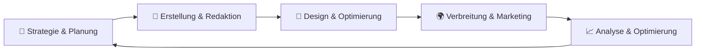

# Content & KI-gestützte Inhalte: Übersicht

Eine zentralisierte Übersicht über Strategien, Tools und Best Practices für die Erstellung, Optimierung und Verwaltung von digitalen Inhalten mit künstlicher Intelligenz. Diese Dokumentation konzentriert sich auf **praktische Anwendungen** von KI in der Content-Produktion, vom initialen Brainstorming bis zur finalen Verteilung.

---

## 📊 Content-Lebenszyklus mit KI

KI unterstützt den gesamten Content-Lebenszyklus auf vielfältige Weise:

---

## 🎯 Anwendungsbereiche

| Bereich | KI-Unterstützung | Typische Tools & Methoden |
|---------|------------------|----------------------------|
| **Content-Strategie** | Themenfindung, Zielgruppenanalyse, Content-Planung | KI-gestützte Marktforschung, Trendanalyse |
| **SEO-Optimierung** | Keyword-Recherche, On-Page-Optimierung, technische SEO | KI-Analyse-Tools, automatisierte Meta-Tags |
| **Erstellung** | Textgenerierung, Übersetzungen, Content-Curation | LLMs, Sprachmodelle, KI-Assistenten |
| **Multilingual** | Übersetzungen, Lokalisierung, kulturelle Anpassung | KI-Übersetzungsdienste, Kontextanalyse |
| **Social Media** | Post-Ideen, Scheduling, Community-Management | KI-gestützte Post-Generierung, automatisierte Verteilung |
| **Analyse** | Performance-Tracking, Sentiment-Analyse, ROI-Messung | KI-Analytics, automatisierte Berichte |

---

## 📚 Themen im Bereich Content

### 1. [KI Content Creation](ki-content-creation.md)
**Grundlagen der KI-gestützten Inhaltserstellung** – Wie KI bei der Erstellung von Texten, Bildern und multimedialen Inhalten unterstützt.

* **Anwendungsfälle**: Blog-Artikel, Produktbeschreibungen, Social Media Posts
* **KI-Modelle**: Sprachmodelle (LLMs), Text-to-Image, Audio-Generierung
* **Tools**: ChatGPT, Midjourney, DALL-E, Stable Diffusion
* **Vorteile**: Schnelligkeit, Skalierbarkeit, Kreativitätssteigerung
* **Herausforderungen**: Qualitätssicherung, ethische Fragen, Copyright

**Ideal für:** Einsteiger, die verstehen wollen, wie KI Content-Erstellung revolutioniert.

---

### 2. [Content-Strategie mit KI](content-strategie.md)
**Strategische Content-Planung mit KI-Unterstützung** – Wie Sie KI nutzen, um eine effektive Content-Strategie zu entwickeln und umzusetzen.

* **Strategie-Elemente**: Zieldefinition, Zielgruppenanalyse, Content-Pillar, Redaktionsplan
* **KI-Tools**: Marktanalyse, Wettbewerbsforschung, Content-Gap-Analyse
* **Content-Typen**: Blog, Whitepaper, Case Studies, Video, Podcast
* **KPIs & Metriken**: Reichweite, Engagement, Conversion, ROI
* **Workflows**: Von der Idee zur Veröffentlichung

**Schlüsselfunktionen:**
- **Zielgruppenanalyse** mit KI-gestützten Personas
- **Content-Ideen-Generierung** basierend auf Daten und Trends
- **Redaktionskalender** mit automatisierter Planung
- **Performance-Vorhersage** mit Predictive Analytics

**Zielgruppe:** Content-Strategen, Marketing-Teams, Redakteure

---

### 3. [KI-gestützte SEO-Optimierung](ki-seo-optimierung.md)
**Suchmaschinenoptimierung mit künstlicher Intelligenz** – Automatisierte Analyse, Optimierung und Monitoring für bessere Suchmaschinenrankings.

* **Keyword-Recherche**: KI-gestützte Analyse von Suchanfragen und Trends
* **On-Page-Optimierung**: Automatisierte Meta-Tags, Header-Struktur, Content-Scoring
* **Technische SEO**: Crawling-Analyse, Ladezeiten-Optimierung, Mobile-Freundlichkeit
* **Backlink-Analyse**: KI-basierte Bewertung von Link-Profilen
* **Lokale SEO**: Optimierung für lokale Suchanfragen

**Wichtige KI-Tools:**
- **Keyword-Analyse**: SurferSEO, Clearscope, MarketMuse
- **Content-Scoring**: SEMrush, Ahrefs, Yoast SEO
- **Technische Analyse**: Screaming Frog, DeepCrawl
- **Backlink-Analyse**: Ahrefs, Moz, Majestic

**Ergebnis:** 30-50% Zeitersparnis bei SEO-Aufgaben, bessere Rankings durch datengetriebene Entscheidungen.

---

### 4. [Multilinguale Inhalte mit KI](multilinguale-inhalte.md)
**Lokalisierung und Übersetzung von Inhalten mit KI** – Wie Sie Inhalte für globale Zielgruppen effizient erstellen und anpassen.

* **Übersetzung**: KI-basierte Textübersetzung mit Kontextverständnis
* **Lokalisierung**: Kulturelle Anpassung von Inhalten, Bildern und Metadaten
* **Spracherkennung**: Automatische Erkennung und Klassifizierung von Sprachen
* **Qualitätssicherung**: KI-gestützte Prüfung von Übersetzungen und Lokalisierungen
* **Terminologie-Management**: Konsistente Nutzung von Fachbegriffen

**Vergleich: Traditionell vs. KI-Übersetzung**

| Aspekt | Traditionell | KI-basiert |
|--------|-------------|------------|
| **Geschwindigkeit** | Langsam (menschlich) | Echtzeit |
| **Kosten** | Hoch | Niedrig |
| **Skalierbarkeit** | Eingeschränkt | Hoch |
| **Qualität** | Sehr hoch | Hoch (mit Post-Editing) |
| **Kontextverständnis** | ✅ Exzellent | ✅ Gut bis sehr gut |
| **Kulturelle Anpassung** | ✅ Manuell | ⚠️ KI + menschliche Prüfung |

**Empfohlene Workflows:**
1. **Maschinelle Übersetzung** mit KI-Tools (DeepL, Google Translate)
2. **Post-Editing** durch menschliche Experten
3. **Lokalisierungsprüfung** mit KI-Unterstützung
4. **Kulturelle Anpassung** durch Native Speaker

---

### 5. [Social Media Automatisierung mit KI](social-media-ki.md)
**KI-gestützte Social Media Strategie und Ausführung** – Von der Content-Erstellung bis zum Community-Management.

* **Content-Erstellung**: Automatisierte Generierung von Posts, Bildern und Videos
* **Scheduling**: Intelligente Planung basierend auf besten Zeiten und Zielgruppen
* **Community-Management**: KI-gestützte Antworten und Interaktionen
* **Analyse**: Sentiment-Analyse, Engagement-Tracking, Performance-Optimierung
* **Influencer-Marketing**: KI-gestützte Identifikation und Bewertung von Influencern

**Plattform-spezifische Strategien:**

| Plattform | KI-Anwendungen | Tools |
|-----------|---------------|-------|
| **LinkedIn** | Professionelle Inhalte, B2B-Marketing | Copy.ai, Jasper, Crystal |
| **Twitter/X** | Kurzform-Inhalte, Trends, Threads | TweetHunter, Typefully |
| **Instagram** | Visueller Content, Stories, Reels | Canva KI, DALL-E, CapCut |
| **Facebook** | Gemischte Inhalte, Community-Building | Meta KI-Tools |
| **TikTok** | Video-Inhalte, Trends, Challenges | CapCut KI, Synthesia |
| **YouTube** | Video-Skripte, Thumbnails, Description | TubeBuddy, VidIQ |

**Ergebnis:** 60-80% Zeitersparnis bei Social Media Management, höhere Engagement-Raten durch datengetriebene Entscheidungen.

---

## 🛠️ KI-Tools für Content-Produktion

### Text-Generierung & Bearbeitung

| Tool | Funktion | Stärken | Preis |
|------|----------|---------|-------|
| **ChatGPT** | Allgemeine Textgenerierung | Vielseitigkeit, Qualität | Ab $20/Monat |
| **Jasper** | Marketing-Content | Vorlagen, Brand Voice | Ab $49/Monat |
| **Copy.ai** | Kurze Content-Stücke | Schnelle Generierung | Ab $49/Monat |
| **Writesonic** | SEO-optimierte Inhalte | Keyword-Integration | Ab $19/Monat |
| **Anyword** | Datengetriebener Content | Performance-Vorhersage | Ab $39/Monat |
| **Grammarly** | Schreibverbesserung | Grammatik, Stil, Ton | Ab $12/Monat |

### Bild- und Video-Generierung

| Tool | Funktion | Stärken | Preis |
|------|----------|---------|-------|
| **Midjourney** | KI-Bildgenerierung | Qualität, Kreativität | Ab $10/Monat |
| **DALL-E 3** | Bildgenerierung aus Text | Präzision, Detailtreue | Pay-per-Use |
| **Stable Diffusion** | Open-Source Bildgenerierung | Selbsthosting, Anpassbar | Kostenlos |
| **Adobe Firefly** | Kreativ-Tools | Photoshop-Integration | Kostenlos (Beta) |
| **Canva KI** | Design-Assistent | Benutzerfreundlichkeit | Kostenlos |
| **Synthesia** | KI-Video-Generierung | Avatar-basierte Videos | Ab $22/Monat |

### SEO-Tools

| Tool | Funktion | Stärken | Preis |
|------|----------|---------|-------|
| **SurferSEO** | Content-Optimierung | Data-driven, umfassend | Ab $49/Monat |
| **Clearscope** | Content-Briefings | Recherche, Struktur | Ab $170/Monat |
| **MarketMuse** | Content-Strategie | Themencluster, Lückenanalyse | Ab $149/Monat |
| **SEMrush** | All-in-One SEO | Keywords, Backlinks, Tracking | Ab $129/Monat |
| **Ahrefs** | Backlink-Analyse | Domain Authority, Keyword Explorer | Ab $99/Monat |

---

## 🎯 Praxisbeispiele

### Beispiel 1: Kompletter Blog-Artikel mit KI

**Workflows:**
1. **Themenfindung** mit KI-Tools (AnswerThePublic, Google Trends)
2. **Keyword-Recherche** mit SEO-Tools (SurferSEO, Ahrefs)
3. **Outline-Erstellung** mit KI-Assistenten
4. **Rohentwurf** mit Sprachmodellen (ChatGPT, Jasper)
5. **Optimierung** mit SEO-Scoring-Tools
6. **Bilder generieren** mit KI-Tools (Midjourney, DALL-E)
7. **Veröffentlichung & Promotion** mit Social Media KI

**Zeitersparnis:** 60-70% gegenüber manueller Erstellung

### Beispiel 2: Multilinguale Website

**Workflows:**
1. **Hauptsprache erstellen** (z.B. Deutsch)
2. **KI-Übersetzung** für alle Zielsprachen
3. **Lokalisierung** mit kultureller Anpassung
4. **SEO-Optimierung** für jede Sprache
5. **Technische Umsetzung** mit mehrsprachigem CMS

**Unterstützte Sprachen:** 50+ mit KI-Tools wie DeepL, Google Translate

### Beispiel 3: Social Media Kampagne

**Workflows:**
1. **Zielgruppenanalyse** mit KI-Tools
2. **Content-Kalender** automatisch generieren
3. **Posts für jede Plattform** anpassen
4. **Optimale Posting-Zeiten** mit KI-Algorithmen
5. **Engagement analysieren** und anpassen

**Ergebnis:** 40-60% höhere Engagement-Raten

---

## 📈 Erfolgsmetriken mit KI

### Zeitersparnis

| Aufgabe | Manuell | Mit KI | Ersparnis |
|---------|---------|-------|----------|
| Content-Ideen | 2-3 Stunden | 15-30 Minuten | 75-85% |
| Rohentwurf | 3-5 Stunden | 30-60 Minuten | 80-90% |
| SEO-Optimierung | 2-4 Stunden | 30-60 Minuten | 75-85% |
| Übersetzung | 1 Stunde/1000 Wörter | 5-10 Minuten/1000 Wörter | 90-95% |
| Social Media Posts | 1-2 Stunden/10 Posts | 15-30 Minuten/10 Posts | 75-85% |

### Qualitätsverbesserung

| Metrik | Manuell | Mit KI | Verbesserung |
|--------|---------|-------|--------------|
| SEO-Rankings | Variiert | +15-30% | ✅ |
| Click-Through-Rate | Variiert | +20-40% | ✅ |
| Engagement-Rate | Variiert | +25-50% | ✅ |
| Content-Konsistenz | Subjektiv | +40-60% | ✅ |
| Übersetzungsqualität | Gut | Sehr Gut | ✅ |

---

## 🔗 Verwandte Themen

* [Webentwicklung/KI Websites entwickeln](../Webentwicklung/ki-webentwicklung.md) – KI in der Webentwicklung
* [Audio/KI und Audio](../Audio/ki-audio.md) – KI für Audio- und Video-Inhalte
* [Desktop Automation/PyAutoGUI Anleitung](../Desktop_Automation/pyautogui-anleitung.md) – Automatisierung von Content-Workflows
* [Tools/Analysetool](../Tools/Analysetool.md) – Analyse-Tools für Content-Performance
* [Server/Software](../Server/Software.md) – Server-Tools für Content-Management-Systeme

---

## 📚 Weiterführende Ressourcen

### Offizielle Dokumentationen
- [Google SEO Starter Guide](https://developers.google.com/search/docs/fundamentals/seo-starter-guide)
- [HubSpot Content Marketing](https://blog.hubspot.com/marketing)
- [Content Marketing Institute](https://contentmarketinginstitute.com/)

### KI-Tools für Content
- [Jasper AI](https://www.jasper.ai/) – KI für Marketing-Content
- [Copy.ai](https://www.copy.ai/) – Schnelle Content-Generierung
- [SurferSEO](https://surferseo.com/) – KI-gestützte SEO-Optimierung
- [DeepL](https://www.deepl.com/translator) – Hochwertige KI-Übersetzungen
- [Midjourney](https://www.midjourney.com/) – KI-Bildgenerierung

### Communities & Blogs
- [r/ContentMarketing](https://www.reddit.com/r/ContentMarketing/) – Content Marketing Subreddit
- [r/SEO](https://www.reddit.com/r/SEO/) – SEO Diskussionen
- [r/MachineLearning](https://www.reddit.com/r/MachineLearning/) – KI-Entwicklungen
- [Content Strategy Alliance](https://www.contentstrategyalliance.com/) – Professionelle Community

---

*Letzte Aktualisierung: Juli 2026*
