# Content Creation mit KI

> **Hinweis zur Software-Auswahl:**  
> Diese Dokumentation priorisiert **Open-Source-Software** und **LLM-Modelle** (unabhängig vom Preis).  
> Bei kostenpflichtiger Software wird stets eine **Open-Source-Alternative** mit gleichem Funktionsumfang gegenübergestellt.

---

## Legende

| Symbol | Bedeutung |
|---|---|
| 🟩 | Open Source – kostenlos |
| 💰 | Kostenpflichtig |
| 🤖 | LLM-Modell – bleibt immer gelistet |
| 🐧 | Linux / Ubuntu nativ |
| 🌐 | Nur Web-Browser |

---

## Lernpfad-Übersicht

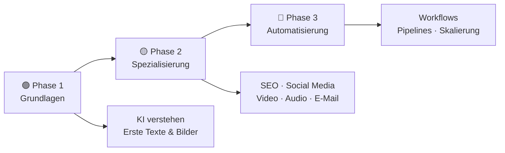

---

## Inhaltsverzeichnis

- [🟢 Phase 1 – Grundlagen](#phase-1-grundlagen)
    - [1.1 Was ist KI-gestützte Content-Erstellung?](#11-was-ist-ki-gestutzte-content-erstellung)
    - [1.2 Konzept: Wie KI Texte erzeugt](#12-konzept-wie-ki-texte-erzeugt)
    - [1.3 Thema: Texterstellung & Copywriting mit KI](#13-thema-texterstellung-copywriting-mit-ki)
    - [1.4 Thema: Bildgenerierung für Content](#14-thema-bildgenerierung-fur-content)
    - [1.5 Thema: Qualitätssicherung & Fact-Checking](#15-thema-qualitatssicherung-fact-checking)
- [🟡 Phase 2 – Spezialisierung](#phase-2-spezialisierung)
    - [2.1 Konzept: Content-Formate & Kanäle](#21-konzept-content-formate-kanale)
    - [2.2 Thema: SEO-Content mit KI](#22-thema-seo-content-mit-ki)
    - [2.3 Thema: Social-Media-Content mit KI](#23-thema-social-media-content-mit-ki)
    - [2.4 Thema: Blog & Artikel mit KI](#24-thema-blog-artikel-mit-ki)
    - [2.5 Thema: Videocontent mit KI](#25-thema-videocontent-mit-ki)
    - [2.6 Thema: Podcast & Audio-Content mit KI](#26-thema-podcast-audio-content-mit-ki)
    - [2.7 Thema: E-Mail-Marketing mit KI](#27-thema-e-mail-marketing-mit-ki)
    - [2.8 Thema: Content-Planung & Redaktionsplan mit KI](#28-thema-content-planung-redaktionsplan-mit-ki)
- [🔴 Phase 3 – Automatisierung & Skalierung](#phase-3-automatisierung-skalierung)
    - [3.1 Konzept: Content-Workflows automatisieren](#31-konzept-content-workflows-automatisieren)
    - [3.2 Thema: KI-Agenten für Content-Pipelines](#32-thema-ki-agenten-fur-content-pipelines)
    - [3.3 Thema: Content-Analyse & Performance-Messung](#33-thema-content-analyse-performance-messung)
    - [3.4 Thema: Rechtliche Aspekte & KI-Kennzeichnung](#34-thema-rechtliche-aspekte-ki-kennzeichnung)
- [📋 Praxisprojekte](#praxisprojekte)
- [📦 Vollständige Softwareübersicht & Vergleich](#vollstandige-softwareubersicht-vergleich)

---

## 🟢 Phase 1 – Grundlagen

> **Was lerne ich hier?**  
> Was KI im Content-Bereich bedeutet, wie Sprachmodelle funktionieren und wie du erste Texte und Bilder mit KI erstellst.  
> **Voraussetzungen:** Keine.

---

### 1.1 Was ist KI-gestützte Content-Erstellung?

#### Konzept: Drei Rollen von KI im Content-Prozess

| Rolle | Was KI tut | Beispiel |
|---|---|---|
| **Generieren** | Erstellt neuen Content aus Vorgaben | ChatGPT schreibt einen Blogbeitrag |
| **Optimieren** | Verbessert bestehenden Content | LanguageTool korrigiert Grammatik |
| **Analysieren** | Wertet Performance und Muster aus | SEMrush zeigt Keyword-Lücken |

#### Konzept: Was ist der Unterschied zwischen KI-generiert und KI-assistiert?

| Methode | Beschreibung | Empfehlung |
|---|---|---|
| **KI-generiert** | KI schreibt, Mensch veröffentlicht direkt | ❌ Meist zu generisch |
| **KI-assistiert** | KI liefert Entwurf, Mensch überarbeitet | ✅ Beste Qualität |
| **KI-optimiert** | Mensch schreibt, KI verbessert | ✅ Authentisch & effizient |

#### Konzept: Was kann KI im Content-Bereich (noch) nicht?

- Originäre **Recherche** und aktuelle Fakten prüfen
- Echte **persönliche Erfahrungen** einbringen
- **Strategische Entscheidungen** treffen (was publiziert wird)
- **Zielgruppenempathie** aus eigener Erfahrung

#### Einstiegs-Software (LLM – immer gelistet):

| Software | Typ | Funktion | Ubuntu | Link |
|---|---|---|---|---|
| 🟩 🤖 [Ollama](https://ollama.com) | LLM lokal | Llama 3, Mistral & mehr lokal ausführen | 🐧 Ja | ollama.com |
| 🟩 🤖 [LM Studio](https://lmstudio.ai) | LLM lokal | Grafische Oberfläche für lokale LLMs | 🐧 Ja | lmstudio.ai |
| 🟩 🤖 [Jan.ai](https://jan.ai) | LLM lokal | Open-Source ChatGPT-Alternative lokal | 🐧 Ja | jan.ai |
| 🤖 [ChatGPT](https://chat.openai.com) | LLM Cloud | Texte, Ideen, Zusammenfassungen | 🌐 Web | openai.com |
| 🤖 [Claude](https://claude.ai) | LLM Cloud | Lange Texte, strukturierte Inhalte | 🌐 Web | claude.ai |
| 🤖 [Gemini](https://gemini.google.com) | LLM Cloud | Multimodales Brainstorming | 🌐 Web | gemini.google.com |

---

### 1.2 Konzept: Wie KI Texte erzeugt

#### Konzept: Large Language Models (LLMs) – vereinfacht erklärt

Ein **LLM** hat aus Milliarden von Texten gelernt, welches Wort nach welchem wahrscheinlich kommt. Es erzeugt **keine Fakten aus einem Wissensspeicher** – es erzeugt **sprachlich wahrscheinliche Fortsetzungen**.

```
Eingabe:  "Die beste Jahreszeit für einen Gartenbesuch ist..."
Ausgabe:  "...der Frühling, wenn die Blumen aufblühen..."
          (wahrscheinliche Fortsetzung – kein gespeichertes Faktenwissen)
```

#### Konzept: Prompt-Engineering für Content

| Prompt-Element | Beispiel | Warum wichtig |
|---|---|---|
| **Rolle** | „Du bist ein erfahrener SEO-Texter" | Gibt dem LLM Kontext und Stil |
| **Zielgruppe** | „Schreibe für Anfänger ohne Vorkenntnisse" | Passt Sprachniveau an |
| **Format** | „Strukturiere den Text mit H2- und H3-Überschriften" | Definiert Output-Struktur |
| **Ton** | „Informell, motivierend, kein Fachjargon" | Steuert Schreibstil |
| **Länge** | „Maximal 600 Wörter" | Kontrolliert Umfang |

#### Konzept: Temperaturen & Kreativität

| Einstellung | Wirkung | Anwendung |
|---|---|---|
| **Niedrige Temperatur** | Präzise, vorhersehbar | Rechtliche Texte, Produktbeschreibungen |
| **Hohe Temperatur** | Kreativ, überraschend | Slogan-Ideen, Story-Entwicklung |

---

### 1.3 Thema: Texterstellung & Copywriting mit KI

#### Konzept: Content-Typen und ihre KI-Eignung

| Content-Typ | KI-Eignung | Menschlicher Aufwand danach |
|---|---|---|
| Produktbeschreibungen | ✅ Sehr hoch | Gering (Fakten prüfen) |
| Blogartikel | ✅ Hoch | Mittel (Überarbeitung, Recherche) |
| Social-Media-Posts | ✅ Hoch | Gering |
| Newsletter | ✅ Gut | Mittel |
| Whitepaper / Fachartikel | 🟡 Mittel | Hoch |
| Persönliche Geschichten | ❌ Gering | Sehr hoch |

#### Konzept: Der iterative Schreibprozess mit KI

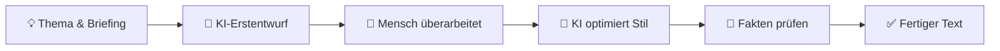

#### Software – Open Source zuerst:

| Software | Typ | Funktion | Ubuntu | Link |
|---|---|---|---|---|
| 🟩 🤖 [Ollama + Open WebUI](https://github.com/open-webui/open-webui) | LLM lokal | ChatGPT-ähnliche Oberfläche für lokale Modelle | 🐧 Ja | github.com/open-webui |
| 🟩 [LibreOffice Writer](https://de.libreoffice.org) | Texteditor | Schreiben, Nachbearbeiten | 🐧 Ja | libreoffice.org |
| 🟩 [LanguageTool](https://languagetool.org/de) | Korrektur | Open-Source Grammatik- & Stilkorrektur | 🐧 Ja | languagetool.org |
| 🟩 [Obsidian](https://obsidian.md) | Wissensmanagement | Markdown-Notizen, Content-Planung | 🐧 Ja | obsidian.md |
| 🤖 [ChatGPT](https://chat.openai.com) | LLM | Textentwürfe, Umformulierungen | 🌐 Web | openai.com |
| 🤖 [Claude](https://claude.ai) | LLM | Lange, strukturierte Texte | 🌐 Web | claude.ai |

#### Vergleich: Open Source vs. Kommerziell

| Funktion | Open Source 🟩 | Kommerziell 💰 |
|---|---|---|
| KI-Texterstellung | Ollama + Llama 3 / Mistral | Jasper AI, Copy.ai, Writesonic |
| Grammatik & Stilkorrektur | LanguageTool (lokal/self-hosted) | Grammarly |
| Texteditor | LibreOffice Writer | Microsoft Word |
| Wissensmanagement | Obsidian, Logseq | Notion AI |
| KI-Schreibassistent integriert | Open WebUI + Ollama | Jasper AI, Sudowrite |

---

### 1.4 Thema: Bildgenerierung für Content

#### Konzept: Warum Bilder im Content entscheidend sind

Beiträge mit Bildern erhalten **2,3× mehr Engagement** als reine Textbeiträge. KI-Bildgenerierung macht professionelle visuelle Inhalte ohne Designkenntnisse möglich.

#### Konzept: Text-to-Image – wie es funktioniert

Ein **Diffusion-Modell** beginnt mit zufälligem Rauschen und formt daraus schrittweise ein Bild, das zum Prompt passt. Lokale Modelle laufen auf der eigenen GPU – ohne Cloud-Anbindung.

#### Konzept: Lizenz-Falle bei KI-Bildern

- ✅ **Stable Diffusion / Flux** – Ausgaben meist kommerziell nutzbar (Lizenz prüfen!)
- ✅ **Adobe Firefly** – trainiert auf lizenzfreiem Material
- ⚠️ **Midjourney** – kommerzielle Nutzung nur bei bezahltem Plan
- ❌ Gesichter echter Personen ohne Erlaubnis generieren

#### Software – Open Source zuerst:

| Software | Typ | Funktion | Ubuntu | Link |
|---|---|---|---|---|
| 🟩 [ComfyUI](https://github.com/comfyanonymous/ComfyUI) | Bild-KI | Leistungsstärkste lokale Bildgenerierung | 🐧 Ja | github.com/comfyanonymous |
| 🟩 [AUTOMATIC1111 WebUI](https://github.com/AUTOMATIC1111/stable-diffusion-webui) | Bild-KI | Benutzerfreundliche Stable-Diffusion-Oberfläche | 🐧 Ja | github.com/AUTOMATIC1111 |
| 🟩 [Flux (Black Forest Labs)](https://github.com/black-forest-labs/flux) | Bild-KI | Hochqualitative Open-Source-Modelle | 🐧 Ja | github.com/black-forest-labs |
| 🟩 [InvokeAI](https://github.com/invoke-ai/InvokeAI) | Bild-KI | Professionelle SD-Oberfläche | 🐧 Ja | github.com/invoke-ai |
| 🟩 [GIMP](https://www.gimp.org) | Bildbearbeitung | Bilder nachbearbeiten & anpassen | 🐧 Ja | gimp.org |
| 🟩 [Inkscape](https://inkscape.org/de/) | Vektorgrafik | SVG-Grafiken für Web-Content | 🐧 Ja | inkscape.org |

#### Vergleich: Open Source vs. Kommerziell

| Funktion | Open Source 🟩 (Ubuntu) | Kommerziell 💰 |
|---|---|---|
| Text-to-Image | ComfyUI + Flux, AUTOMATIC1111 | Midjourney, DALL-E 3 |
| Kommerzielle Lizenzfreiheit | Flux (je nach Modell), Adobe Firefly | Adobe Firefly |
| Bildbearbeitung | GIMP | Adobe Photoshop |
| Social-Media-Grafiken | Inkscape + Vorlagen | Canva AI |
| KI-Hintergrundentfernung | rembg (CLI) | Remove.bg |

---

### 1.5 Thema: Qualitätssicherung & Fact-Checking

#### Konzept: Warum KI-Content immer geprüft werden muss

KI **halluziniert** – sie erfindet plausibel klingende, aber falsche Fakten. Besonders gefährlich bei:
- Statistiken und Studien
- Namen, Daten, Quellen
- Medizinischen oder rechtlichen Informationen

#### Konzept: KI-Detection – Segen oder Fluch?

**KI-Detektoren** versuchen zu erkennen, ob ein Text KI-generiert ist. Sie sind jedoch:
- Unzuverlässig (bis zu 30% Falschaussagen)
- Kein gerichtlich verwertbares Beweismittel
- Nützlich als grober Indikator, nicht als Entscheidungsgrundlage

#### Software – Open Source zuerst:

| Software | Typ | Funktion | Ubuntu | Link |
|---|---|---|---|---|
| 🟩 [LanguageTool](https://languagetool.org/de) | Korrektur | Grammatik, Stil, Rechtschreibung (self-hosted möglich) | 🐧 Ja | languagetool.org |
| 🟩 [Ollama (Fact-Check-Prompt)](https://ollama.com) | LLM | Fakten lokal prüfen lassen | 🐧 Ja | ollama.com |
| 🟩 [Vale](https://vale.sh) | Linting | Schreibstil-Linter für Redaktionsteams | 🐧 Ja | vale.sh |
| 🟩 [Proselint](https://github.com/amperser/proselint) | Linting | Stilfehler automatisch erkennen | 🐧 Ja | github.com/amperser |

#### Vergleich: Open Source vs. Kommerziell

| Funktion | Open Source 🟩 | Kommerziell 💰 |
|---|---|---|
| Grammatik & Stil | LanguageTool (self-hosted) | Grammarly |
| KI-Detektor | — | Originality.ai, ZeroGPT |
| Plagiatsprüfung | — | Copyscape, Turnitin |
| Redaktionslinting | Vale, Proselint | Acrolinx |

---

## 🟡 Phase 2 – Spezialisierung

> **Was lerne ich hier?**  
> Jeden Content-Kanal gezielt mit KI bespielen – von SEO über Social Media bis E-Mail.  
> **Voraussetzungen:** Phase 1 abgeschlossen.

---

### 2.1 Konzept: Content-Formate & Kanäle

#### Die wichtigsten Content-Kanäle und ihre KI-Nutzung

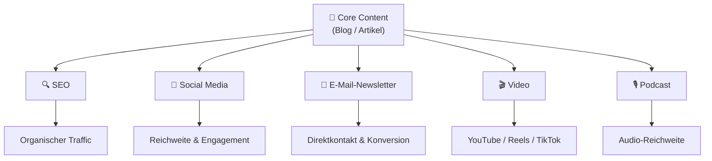

#### Konzept: Content-Repurposing mit KI

**Repurposing** bedeutet: Ein Basis-Content-Stück in viele Formate umwandeln – KI automatisiert diesen Prozess:

| Ausgangsmaterial | KI wandelt um in |
|---|---|
| Blogartikel | 5 Social-Media-Posts, 1 Newsletter, 3 Kurzvideos |
| Podcast-Episode | Transkript, Blogartikel, Zitat-Grafiken |
| YouTube-Video | Shorts, Blog, Instagram-Captions |
| Whitepaper | Infografik-Text, LinkedIn-Posts, E-Mail-Sequenz |

---

### 2.2 Thema: SEO-Content mit KI

#### Konzept: Was ist SEO und wie hilft KI dabei?

**SEO (Search Engine Optimization)** optimiert Inhalte so, dass sie in Suchmaschinen besser gefunden werden. KI hilft bei:

| SEO-Aufgabe | Wie KI hilft |
|---|---|
| **Keyword-Recherche** | KI analysiert Suchvolumen & Wettbewerb |
| **Content-Briefing** | KI erstellt Artikelstruktur auf Basis von Top-Rankings |
| **Meta-Tags** | KI schreibt Title & Description automatisch |
| **Interne Verlinkung** | KI schlägt passende interne Links vor |
| **Content-Lücken** | KI findet Themen, die Wettbewerber behandeln, du nicht |

#### Konzept: E-E-A-T – Was Google wirklich bewertet

Google bewertet Content nach **E-E-A-T**:
- **Experience** – eigene Erfahrung mit dem Thema
- **Expertise** – Fachkenntnisse nachweisbar
- **Authoritativeness** – Reputation der Quelle
- **Trustworthiness** – Vertrauenswürdigkeit

KI-generierter Content ohne diese Qualitäten wird von Google langfristig **abgewertet**.

#### Software – Open Source zuerst:

| Software | Typ | Funktion | Ubuntu | Link |
|---|---|---|---|---|
| 🟩 [Screaming Frog (Free)](https://www.screamingfrog.co.uk/seo-spider/) | SEO-Crawler | Website-Analyse, bis 500 URLs kostenlos | 🐧 Ja | screamingfrog.co.uk |
| 🟩 [Google Search Console](https://search.google.com/search-console) | SEO-Analyse | Keyword-Performance, kostenlos von Google | 🌐 Web | search.google.com |
| 🟩 [Ollama + SEO-Prompt](https://ollama.com) | LLM | Meta-Tags, Title-Vorschläge lokal | 🐧 Ja | ollama.com |
| 🟩 [Lighthouse (Chrome DevTools)](https://developer.chrome.com/docs/lighthouse/) | SEO-Audit | Technisches SEO & Performance | 🐧 Ja | developer.chrome.com |
| 🟩 [PageSpeed Insights](https://pagespeed.web.dev) | SEO | Ladezeit-Analyse (Google) | 🌐 Web | pagespeed.web.dev |

#### Vergleich: Open Source vs. Kommerziell

| SEO-Funktion | Open Source / Kostenlos 🟩 | Kommerziell 💰 |
|---|---|---|
| Keyword-Recherche | Google Search Console + Trends | SEMrush, Ahrefs |
| Content-Briefing-Erstellung | Ollama + LLM-Prompt | Surfer SEO, Frase.io |
| Website-Crawling | Screaming Frog (Free, 500 URLs) | Screaming Frog Pro |
| On-Page-SEO-Optimierung | Lighthouse, PageSpeed | NeuronWriter, Surfer SEO |
| Backlink-Analyse | — (kein gutes Open Source) | Ahrefs, SEMrush |

---

### 2.3 Thema: Social-Media-Content mit KI

#### Konzept: Plattform-spezifische Content-Anforderungen

| Plattform | Format | Optimale Länge | KI-Aufgabe |
|---|---|---|---|
| **LinkedIn** | Text + Bild | 1.300–1.500 Zeichen | Professionelle Posts, Thought Leadership |
| **Instagram** | Bild/Video + Caption | 150 Zeichen ideal | Caption, Hashtags, Reels-Skript |
| **TikTok** | Kurzvideos | 15–60 Sek. | Skript, Hook, Call-to-Action |
| **X (Twitter)** | Kurztext | 280 Zeichen | Threads, Engagement-Posts |
| **Facebook** | Text + Bild/Video | 40–80 Zeichen ideal | Anzeigentexte, Community-Posts |
| **YouTube** | Video + Beschreibung | Beschreibung 250+ Wörter | Titel, Tags, Beschreibung |

#### Konzept: Der Content-Hook – Die erste Sekunde entscheidet

Ein **Hook** ist die erste Zeile / die ersten 3 Sekunden, die entscheiden, ob jemand weiterliest oder weiterscrollt.

```
❌ Schlechter Hook:  "Heute möchte ich über KI schreiben..."
✅ Guter Hook:       "97% aller Unternehmen nutzen KI falsch. Hier ist warum:"
✅ Guter Hook:       "Ich habe 30 Tage lang jeden Tag mit KI gearbeitet. Das Ergebnis:"
```

#### Software – Open Source zuerst:

| Software | Typ | Funktion | Ubuntu | Link |
|---|---|---|---|---|
| 🟩 🤖 [Ollama + Open WebUI](https://github.com/open-webui/open-webui) | LLM | Posts, Captions, Hooks lokal generieren | 🐧 Ja | github.com/open-webui |
| 🟩 [Inkscape](https://inkscape.org/de/) | Grafik | Social-Media-Grafiken (SVG) | 🐧 Ja | inkscape.org |
| 🟩 [GIMP](https://www.gimp.org) | Bildbearbeitung | Post-Grafiken erstellen und anpassen | 🐧 Ja | gimp.org |
| 🟩 [ComfyUI + Flux](https://github.com/comfyanonymous/ComfyUI) | Bild-KI | Einzigartige Grafiken generieren | 🐧 Ja | github.com/comfyanonymous |
| 🟩 [Buffer (Free)](https://buffer.com) | Planung | Scheduling für Social Media (Free-Tier) | 🌐 Web | buffer.com |

#### Vergleich: Open Source vs. Kommerziell

| Funktion | Open Source 🟩 | Kommerziell 💰 |
|---|---|---|
| Post-Texte generieren | Ollama + LLM lokal | Jasper AI, Copy.ai |
| Social-Media-Grafiken | GIMP + Inkscape | Canva AI, Adobe Express |
| KI-Bildgenerierung für Posts | ComfyUI + Flux | Midjourney, Adobe Firefly |
| Scheduling & Planung | Buffer (Free-Tier) | Buffer Pro, Hootsuite |
| Hashtag-Optimierung | Ollama-Prompt | Predis.ai, Flick |
| Analytics | nativer Plattform-Insights | Hootsuite Analytics, Sprout |

---

### 2.4 Thema: Blog & Artikel mit KI

#### Konzept: Anatomie eines erfolgreichen KI-assistierten Blogartikels

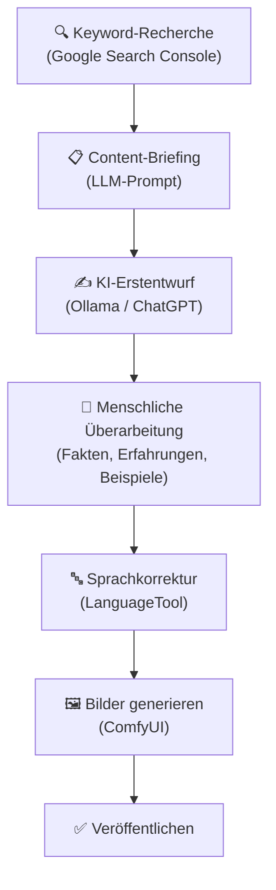

#### Konzept: Long-form vs. Short-form Content

| Content-Typ | Wortanzahl | KI-Anteil empfohlen | Stärke |
|---|---|---|---|
| **Short-form** | < 500 Wörter | Hoch (70–80%) | Social Media, Snippets |
| **Mid-form** | 500–1.500 Wörter | Mittel (50–60%) | Blog, Newsletter |
| **Long-form** | > 1.500 Wörter | Gering (30–40%) | Guides, Whitepaper |

#### Software – Open Source zuerst:

| Software | Typ | Funktion | Ubuntu | Link |
|---|---|---|---|---|
| 🟩 🤖 [Ollama](https://ollama.com) | LLM | Artikel-Erstentwürfe lokal generieren | 🐧 Ja | ollama.com |
| 🟩 [LanguageTool](https://languagetool.org/de) | Korrektur | Grammatik & Stil prüfen | 🐧 Ja | languagetool.org |
| 🟩 [Zettlr](https://www.zettlr.com) | Markdown-Editor | Akademisches Schreiben & Blogartikel | 🐧 Ja | zettlr.com |
| 🟩 [Obsidian](https://obsidian.md) | Wissensmanagement | Notizen, Recherche, Content-Planung | 🐧 Ja | obsidian.md |
| 🟩 [Ghost (Self-hosted)](https://ghost.org) | CMS | Open-Source Blog-Plattform | 🐧 Ja | ghost.org |
| 🟩 [WordPress (Self-hosted)](https://de.wordpress.org) | CMS | Blog & CMS mit KI-Plugins | 🐧 Ja | wordpress.org |

#### Vergleich: Open Source vs. Kommerziell

| Funktion | Open Source 🟩 | Kommerziell 💰 |
|---|---|---|
| KI-Textgenerierung | Ollama + Llama 3 / Mistral | Jasper AI, Writesonic, Rytr |
| Blog-CMS | WordPress (self-hosted), Ghost | WordPress.com, Squarespace |
| Markdown-Editor | Zettlr, Obsidian | iA Writer, Ulysses |
| Grammatikkorrektur | LanguageTool | Grammarly |

---

### 2.5 Thema: Videocontent mit KI

#### Konzept: Videocontent-Formate für verschiedene Plattformen

| Format | Plattform | Länge | KI-Tool |
|---|---|---|---|
| **Long-form Video** | YouTube | 8–20 Min. | Kdenlive + Whisper |
| **Short-form / Reels** | TikTok, Reels | 15–60 Sek. | FFmpeg + Submagic |
| **Erklärvideo** | YouTube, LinkedIn | 2–5 Min. | Manim, HeyGen |
| **Webinar-Recording** | LinkedIn, Website | 30–90 Min. | OBS + Descript |

#### Konzept: Script-to-Video – der effizienteste KI-Workflow

```
Blogartikel → KI-Skript kürzen → TTS-Narration → KI-Bilder → Video-Zusammenstellen
```

#### Software – Open Source zuerst:

| Software | Typ | Funktion | Ubuntu | Link |
|---|---|---|---|---|
| 🟩 [Kdenlive](https://kdenlive.org/de/) | NLE | Videoschnitt Open Source | 🐧 Ja | kdenlive.org |
| 🟩 [FFmpeg](https://ffmpeg.org) | CLI | Video automatisiert verarbeiten | 🐧 Ja | ffmpeg.org |
| 🟩 [OBS Studio](https://obsproject.com/de) | Aufnahme | Screen-Recording, Webcam | 🐧 Ja | obsproject.com |
| 🟩 [Whisper.cpp](https://github.com/ggerganov/whisper.cpp) | ASR | Lokale Transkription für Untertitel | 🐧 Ja | github.com/ggerganov |
| 🟩 [Manim](https://www.manim.community) | Animation | Erklär-Animationen per Python-Code | 🐧 Ja | manim.community |
| 🟩 [Coqui XTTS-v2](https://github.com/coqui-ai/TTS) | TTS | Narration lokal generieren | 🐧 Ja | github.com/coqui-ai |
| 🟩 [Subtitle Edit](https://www.nikse.dk/subtitleedit) | Untertitel | Untertitel erstellen & einbetten | 🐧 Ja | nikse.dk |

#### Vergleich: Open Source vs. Kommerziell

| Funktion | Open Source 🟩 (Ubuntu) | Kommerziell 💰 |
|---|---|---|
| Videoschnitt | Kdenlive, DaVinci Resolve Free | Adobe Premiere Pro |
| Screen-Recording | OBS Studio | Loom, Camtasia |
| TTS-Narration | Coqui XTTS-v2, Bark | ElevenLabs, Murf.ai |
| Automatische Untertitel | Whisper.cpp + Subtitle Edit | Descript, Submagic |
| KI-Avatar-Video | SadTalker, Wav2Lip | Synthesia, HeyGen |
| Script-to-Video | FFmpeg + MoviePy + Coqui | InVideo AI, Pictory, Lumen5 |

---

### 2.6 Thema: Podcast & Audio-Content mit KI

#### Konzept: KI in der Podcast-Produktion – vier Einsatzgebiete

| Phase | KI-Einsatz | Open-Source-Tool |
|---|---|---|
| **Vorbereitung** | Fragen & Struktur generieren | Ollama |
| **Aufnahme** | Rauschunterdrückung live | RNNoise, Krisp |
| **Nachbearbeitung** | Audio-Restaurierung, Pegel | DeepFilterNet, Audacity |
| **Distribution** | Transkript, Shownotes, Clips | Whisper.cpp + Ollama |

#### Konzept: Was sind Shownotes und warum sind sie wichtig?

**Shownotes** sind die schriftliche Zusammenfassung einer Podcast-Episode – mit Links, Timestamps und Key Takeaways. KI kann diese automatisch aus dem Transkript erstellen.

```
Podcast aufnehmen → Whisper.cpp transkribiert → Ollama erstellt Shownotes → Veröffentlichen
```

#### Software – Open Source zuerst:

| Software | Typ | Funktion | Ubuntu | Link |
|---|---|---|---|---|
| 🟩 [Audacity](https://www.audacityteam.org) | Audio-Editor | Podcast-Aufnahme & Nachbearbeitung | 🐧 Ja | audacityteam.org |
| 🟩 [Ardour](https://ardour.org) | DAW | Professionelle Mehrspuraufnahme | 🐧 Ja | ardour.org |
| 🟩 [DeepFilterNet](https://github.com/Rikorose/DeepFilterNet) | KI-Audio | KI-Rauschunterdrückung lokal | 🐧 Ja | github.com/Rikorose |
| 🟩 [Whisper.cpp](https://github.com/ggerganov/whisper.cpp) | ASR | Transkription lokal | 🐧 Ja | github.com/ggerganov |
| 🟩 [Ollama](https://ollama.com) | LLM | Shownotes & Kapitelmarken generieren | 🐧 Ja | ollama.com |
| 🟩 [Coqui XTTS-v2](https://github.com/coqui-ai/TTS) | TTS | KI-Stimme für Solo-Podcast | 🐧 Ja | github.com/coqui-ai |
| 🟩 [AudioCraft / MusicGen](https://github.com/facebookresearch/audiocraft) | Musik-KI | Jingle & Intro-Musik lokal generieren | 🐧 Ja | github.com/facebookresearch |

#### Vergleich: Open Source vs. Kommerziell

| Funktion | Open Source 🟩 (Ubuntu) | Kommerziell 💰 |
|---|---|---|
| Aufnahme & Schnitt | Audacity, Ardour | Adobe Audition, Hindenburg |
| KI-Rauschunterdrückung | DeepFilterNet, RNNoise | iZotope RX 11, Krisp |
| Transkription | Whisper.cpp (lokal) | Descript, Riverside.fm |
| Shownotes generieren | Ollama + Whisper | Podcastle, Castmagic |
| Hosting | Anchor (Spotify, kostenlos) | Podbean, Buzzsprout |
| Musik-Jingle | AudioCraft / MusicGen | Suno AI, Musicbed |

---

### 2.7 Thema: E-Mail-Marketing mit KI

#### Konzept: KI im E-Mail-Marketing – vier Anwendungsfelder

| Anwendungsfeld | Was KI tut | Beispiel |
|---|---|---|
| **Betreffzeilen** | Generiert und A/B-testet Varianten | „3 Betreffzeilen für denselben Newsletter" |
| **E-Mail-Texte** | Erstellt personalisierte Varianten | Segmentspezifische Ansprache |
| **Timing-Optimierung** | Analysiert besten Versandzeitpunkt | KI lernt aus Öffnungsraten |
| **Automatisierung** | Trigger-basierte E-Mail-Sequenzen | Welcome-Serie, Nurture-Flow |

#### Konzept: E-Mail-Sequenzen – der wichtigste Automation-Baustein

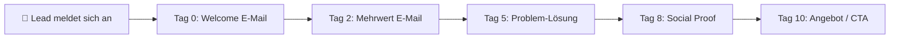

#### Software – Open Source zuerst:

| Software | Typ | Funktion | Ubuntu | Link |
|---|---|---|---|---|
| 🟩 [Mautic](https://www.mautic.org) | E-Mail-Marketing | Self-hosted Open-Source-Marketing-Automation | 🐧 Ja | mautic.org |
| 🟩 [Listmonk](https://listmonk.app) | Newsletter | Self-hosted Newsletter-Software | 🐧 Ja | listmonk.app |
| 🟩 🤖 [Ollama](https://ollama.com) | LLM | Betreffzeilen & Texte lokal generieren | 🐧 Ja | ollama.com |
| 🟩 [n8n](https://n8n.io) | Automatisierung | E-Mail-Workflows automatisieren | 🐧 Ja | n8n.io |

#### Vergleich: Open Source vs. Kommerziell

| Funktion | Open Source 🟩 (Ubuntu) | Kommerziell 💰 |
|---|---|---|
| E-Mail-Versand | Listmonk (self-hosted) | Mailchimp, Brevo |
| Marketing-Automation | Mautic (self-hosted) | ActiveCampaign, HubSpot |
| KI-Texte für E-Mails | Ollama + LLM lokal | Jasper AI, Copy.ai |
| Workflow-Automation | n8n (self-hosted) | Zapier, Make |
| A/B-Testing | Mautic | Mailchimp, ActiveCampaign |

---

### 2.8 Thema: Content-Planung & Redaktionsplan mit KI

#### Konzept: Was ist ein Redaktionsplan?

Ein **Redaktionsplan** (Content-Kalender) definiert: Was wird wann auf welchem Kanal veröffentlicht? KI hilft beim Befüllen, Strukturieren und Konsistenthalten.

#### Konzept: Content-Cluster-Strategie

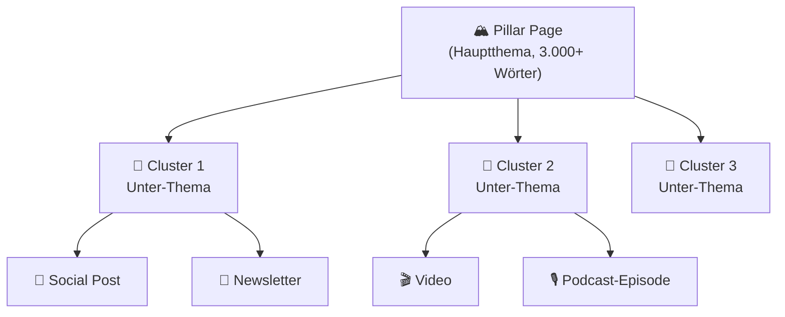

#### Software – Open Source zuerst:

| Software | Typ | Funktion | Ubuntu | Link |
|---|---|---|---|---|
| 🟩 [Planka](https://planka.app) | Kanban | Self-hosted Content-Kalender | 🐧 Ja | planka.app |
| 🟩 [Nextcloud + Deck](https://nextcloud.com/de/) | Collaboration | Self-hosted Team-Planung | 🐧 Ja | nextcloud.com |
| 🟩 [Obsidian](https://obsidian.md) | Wissensmanagement | Content-Planung & Ideen-Cluster | 🐧 Ja | obsidian.md |
| 🟩 [Logseq](https://logseq.com) | Wissensmanagement | Open-Source Notion-Alternative | 🐧 Ja | logseq.com |
| 🟩 🤖 [Ollama](https://ollama.com) | LLM | Content-Ideen & Cluster lokal generieren | 🐧 Ja | ollama.com |

#### Vergleich: Open Source vs. Kommerziell

| Funktion | Open Source 🟩 | Kommerziell 💰 |
|---|---|---|
| Redaktionsplan / Kanban | Planka, Nextcloud Deck | Trello, Airtable |
| Wissensmanagement | Obsidian, Logseq | Notion AI |
| Content-Ideen-Generierung | Ollama + LLM | ContentStudio, Planable |
| Team-Collaboration | Nextcloud | Google Workspace |

---

## 🔴 Phase 3 – Automatisierung & Skalierung

> **Was lerne ich hier?**  
> Content-Prozesse vollständig automatisieren, KI-Agenten für die Content-Produktion einsetzen und Performance messen.  
> **Voraussetzungen:** Phase 1 & 2 abgeschlossen. Python-Grundkenntnisse hilfreich.

---

### 3.1 Konzept: Content-Workflows automatisieren

#### Konzept: Was ist ein Content-Workflow?

Ein **automatisierter Content-Workflow** verbindet mehrere Tools so, dass der Output eines Tools automatisch zum Input des nächsten wird:

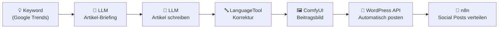

#### Konzept: No-Code vs. Low-Code vs. Code für Content

| Ansatz | Tool | Für wen | Beispiel |
|---|---|---|---|
| **No-Code** | n8n (visuell) | Marketing-Teams | Neuer Blogpost → Social Posts automatisch |
| **Low-Code** | n8n + Python-Nodes | Fortgeschrittene | Keyword → Vollständiger Artikel |
| **Code** | Python + APIs | Entwickler | Komplett eigene Content-Pipeline |

---

### 3.2 Thema: KI-Agenten für Content-Pipelines

#### Konzept: Wie ein Content-Agent arbeitet

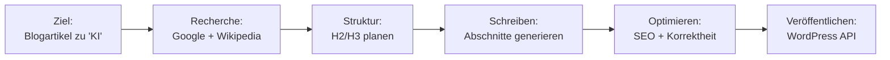

#### Software – alle Open Source:

| Software | Typ | Funktion | Ubuntu | Link |
|---|---|---|---|---|
| 🟩 [LangChain](https://www.langchain.com) | Framework | LLM-Content-Agenten (Python) | 🐧 Ja | langchain.com |
| 🟩 [CrewAI](https://www.crewai.com) | Framework | Rollenbasierte Content-Agenten-Teams | 🐧 Ja | crewai.com |
| 🟩 [AutoGen (Microsoft)](https://microsoft.github.io/autogen/) | Framework | Multi-Agenten für Content | 🐧 Ja | microsoft.github.io/autogen |
| 🟩 [n8n](https://n8n.io) | Automatisierung | Self-hosted Workflow-Builder | 🐧 Ja | n8n.io |
| 🟩 [Ollama](https://ollama.com) | LLM | Lokaler LLM-Server für Agenten | 🐧 Ja | ollama.com |
| 🤖 [ChatGPT API](https://platform.openai.com) | LLM-API | Cloud-LLM für Content-Agenten | 🌐 API | platform.openai.com |
| 🤖 [Claude API](https://www.anthropic.com/api) | LLM-API | Lange Kontextfenster für Artikel | 🌐 API | anthropic.com |

#### Praxis-Beispiel: Vollautomatischer Blog-Agent

```python
# CrewAI – Content-Agent Beispiel (vereinfacht)
from crewai import Agent, Task, Crew

researcher = Agent(role="SEO Researcher",
                   goal="Finde Top-Keywords für {topic}",
                   llm="ollama/llama3")

writer = Agent(role="Content Writer",
               goal="Schreibe einen 800-Wörter-Artikel",
               llm="ollama/llama3")

crew = Crew(agents=[researcher, writer], tasks=[...])
result = crew.kickoff(inputs={"topic": "KI im Marketing"})
```

---

### 3.3 Thema: Content-Analyse & Performance-Messung

#### Konzept: KPIs für verschiedene Content-Kanäle

| Kanal | Wichtigste KPIs | Tool zur Messung |
|---|---|---|
| **Blog / SEO** | Organische Klicks, CTR, Ranking | Google Search Console |
| **Social Media** | Reichweite, Engagement-Rate, Follower | Plattform-nativer Insight |
| **E-Mail** | Öffnungsrate, CTR, Abmelderate | Listmonk, Mautic |
| **YouTube** | Views, Watch-Time, CTR Thumbnail | YouTube Studio |
| **Podcast** | Downloads, Zuhörer, Completion-Rate | Podcast-Hosting Analytics |

#### Konzept: Wie KI die Analyse verbessert

- **Muster erkennen:** Welche Headline-Typen performen am besten?
- **Inhalte clustern:** Welche Themen bringen den meisten Traffic?
- **Empfehlungen:** Was sollte als nächstes erstellt werden?

#### Software – Open Source zuerst:

| Software | Typ | Funktion | Ubuntu | Link |
|---|---|---|---|---|
| 🟩 [Matomo](https://matomo.org) | Analytics | Self-hosted Google-Analytics-Alternative | 🐧 Ja | matomo.org |
| 🟩 [Google Search Console](https://search.google.com/search-console) | SEO | Kostenlose Keyword-Performance | 🌐 Web | search.google.com |
| 🟩 [Plausible (Self-hosted)](https://plausible.io) | Analytics | Datenschutzfreundliche Web-Analytics | 🐧 Ja | plausible.io |
| 🟩 [Grafana](https://grafana.com) | Dashboard | Daten-Visualisierung & KPI-Dashboards | 🐧 Ja | grafana.com |
| 🟩 🤖 [Ollama](https://ollama.com) | LLM | Analytics-Daten analysieren lassen | 🐧 Ja | ollama.com |

#### Vergleich: Open Source vs. Kommerziell

| Funktion | Open Source 🟩 | Kommerziell 💰 |
|---|---|---|
| Web-Analytics | Matomo (self-hosted), Plausible | Google Analytics 4, HubSpot |
| SEO-Tracking | Google Search Console | SEMrush, Ahrefs |
| Dashboard / Reporting | Grafana | Databox, Looker Studio |
| Social-Media-Analytics | Plattform-native Insights | Sprout Social, Hootsuite |
| KI-Performance-Analyse | Ollama + CSV-Export | HubSpot AI, Semrush AI |

---

### 3.4 Thema: Rechtliche Aspekte & KI-Kennzeichnung

#### Konzept: Was der EU AI Act für Content Creator bedeutet

| Anforderung | Details |
|---|---|
| **KI-Kennzeichnung** | Synthetische Texte, Bilder & Videos müssen als KI-generiert gekennzeichnet werden |
| **Deepfake-Verbot** | Manipulierte Darstellungen realer Personen ohne Erlaubnis verboten |
| **Transparenzpflicht** | Systeme mit KI-Interaktion müssen erkennbar sein |
| **Hochrisiko-KI** | Strenge Anforderungen für KI in sensiblen Bereichen |

#### Konzept: Urheberrecht an KI-generiertem Content

| Situation | Rechtslage (DE/EU 2025/2026) |
|---|---|
| Rein KI-generierter Text | Kein automatisches Urheberrecht |
| Mensch überarbeitet KI-Text | Urheberrecht möglich (Schöpfungshöhe) |
| KI-generierte Bilder | Ungeklärt – Plattform-AGB beachten |
| Trainingsdaten Dritter | Viele Klagen laufen (z. B. Getty vs. Stability AI) |

#### Konzept: Ethische Content-Erstellung mit KI

- ✅ Eigene Erfahrungen und Expertise einbringen
- ✅ KI-Content als KI-assistiert kennzeichnen
- ✅ Fakten immer aus verlässlichen Quellen prüfen
- ❌ KI-Content als vollständig menschlich ausgeben
- ❌ Bilder oder Texte echter Personen ohne Erlaubnis generieren

#### Ressourcen:

| Ressource | Beschreibung | Link |
|---|---|---|
| [EU AI Act](https://digital-strategy.ec.europa.eu/de/policies/european-approach-artificial-intelligence) | EU-Verordnung zur KI-Regulierung | ec.europa.eu |
| [C2PA Standard](https://c2pa.org) | Offener KI-Kennzeichnungs-Standard | c2pa.org |
| [Creative Commons](https://creativecommons.org/licenses/by/4.0/deed.de) | Offene Lizenzen für KI-Outputs | creativecommons.org |
| [Open Source Initiative](https://opensource.org) | Software-Lizenzen verstehen | opensource.org |
| [LanguageTool Blog](https://languagetool.org/de/blog) | KI-Schreib-Tipps & Recht | languagetool.org |

---

## 📋 Praxisprojekte

### 🟢 Einsteiger: Blogartikel vollständig mit KI erstellen

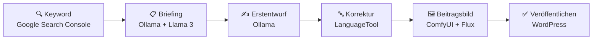

**Software (alle Open Source):** Google Search Console · Ollama · LanguageTool · ComfyUI · WordPress

---

### 🟡 Fortgeschritten: Content-Repurposing – 1 Artikel, 5 Formate

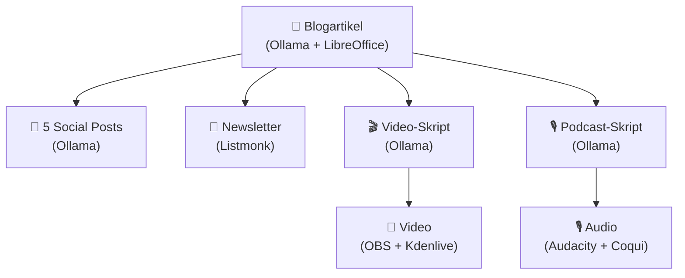

**Software (alle Open Source):** Ollama · LibreOffice · Listmonk · OBS · Kdenlive · Audacity · Coqui XTTS

---

### 🟡 Fortgeschritten: Automatische Podcast-Shownotes

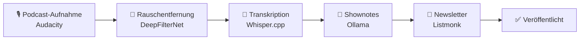

**Software (alle Open Source):** Audacity · DeepFilterNet · Whisper.cpp · Ollama · Listmonk

---

### 🔴 Experte: Vollautomatische Content-Pipeline

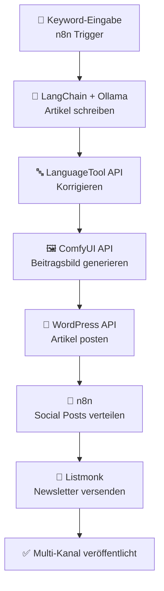

**Software (alle Open Source):** n8n · LangChain · Ollama · LanguageTool · ComfyUI · WordPress · Listmonk

---

## 📦 Vollständige Softwareübersicht & Vergleich

### LLM-Modelle (immer gelistet – unabhängig vom Preis)

| Software | Lokal / Cloud | Ubuntu | Preis | Link |
|---|---|---|---|---|
| 🟩 🤖 [Ollama](https://ollama.com) | Lokal | 🐧 Ja | Kostenlos | ollama.com |
| 🟩 🤖 [LM Studio](https://lmstudio.ai) | Lokal | 🐧 Ja | Kostenlos | lmstudio.ai |
| 🟩 🤖 [Jan.ai](https://jan.ai) | Lokal | 🐧 Ja | Kostenlos | jan.ai |
| 🟩 🤖 [Open WebUI](https://github.com/open-webui/open-webui) | Lokal UI | 🐧 Ja | Kostenlos | github.com/open-webui |
| 🤖 [ChatGPT](https://chat.openai.com) | Cloud | 🌐 Web | Freemium | openai.com |
| 🤖 [Claude](https://claude.ai) | Cloud | 🌐 Web | Freemium | claude.ai |
| 🤖 [Gemini](https://gemini.google.com) | Cloud | 🌐 Web | Freemium | gemini.google.com |

### Texterstellung & Copywriting

| Funktion | Open Source 🟩 (Ubuntu) | Kommerziell 💰 |
|---|---|---|
| KI-Texterstellung | Ollama + Llama 3 / Mistral | Jasper AI, Copy.ai, Writesonic, Rytr |
| Grammatik & Stil | LanguageTool (self-hosted) | Grammarly |
| Schreibassistent | Open WebUI + Ollama | Sudowrite, TextCortex |
| Markdown-Editor | Zettlr, Obsidian | iA Writer |
| Texteditor | LibreOffice Writer | Microsoft Word |

### SEO-Tools

| Funktion | Open Source / Kostenlos 🟩 | Kommerziell 💰 |
|---|---|---|
| Website-Crawling | Screaming Frog Free (500 URLs) | Screaming Frog Pro |
| Keyword-Analyse | Google Search Console | SEMrush, Ahrefs |
| Content-Briefing | Ollama + LLM-Prompt | Surfer SEO, Frase.io, NeuronWriter |
| On-Page-Analyse | Lighthouse, PageSpeed Insights | Sitebulb |
| Backlink-Analyse | — | Ahrefs, SEMrush, Majestic |

### Social-Media-Content

| Funktion | Open Source 🟩 | Kommerziell 💰 |
|---|---|---|
| Post-Texte generieren | Ollama + LLM lokal | Jasper AI, Lately.ai |
| Grafiken erstellen | GIMP + Inkscape | Canva AI, Adobe Express |
| KI-Bilder für Posts | ComfyUI + Flux | Midjourney, Adobe Firefly |
| Scheduling | Buffer (Free-Tier) | Buffer Pro, Hootsuite, Publer |
| Analytics | Plattform-native Insights | Sprout Social, Hootsuite |

### Blog & CMS

| Funktion | Open Source 🟩 | Kommerziell 💰 |
|---|---|---|
| Blog-CMS | WordPress (self-hosted), Ghost | WordPress.com |
| KI-Artikel generieren | Ollama + LangChain | Jasper AI, Writesonic |
| Korrektur | LanguageTool | Grammarly |
| Wissensmanagement | Obsidian, Logseq | Notion AI |

### Video-Content

| Funktion | Open Source 🟩 (Ubuntu) | Kommerziell 💰 |
|---|---|---|
| Videoschnitt | Kdenlive, DaVinci Resolve Free | Adobe Premiere Pro |
| Screen-Recording | OBS Studio | Loom, Camtasia |
| TTS-Narration | Coqui XTTS-v2, Bark | ElevenLabs, Murf.ai |
| Untertitel | Whisper.cpp + Subtitle Edit | Descript, Submagic |
| KI-Avatar | SadTalker, Wav2Lip | Synthesia, HeyGen |
| Script-to-Video | FFmpeg + MoviePy + Coqui | InVideo AI, Pictory, Lumen5 |

### Podcast & Audio

| Funktion | Open Source 🟩 (Ubuntu) | Kommerziell 💰 |
|---|---|---|
| Aufnahme & Schnitt | Audacity, Ardour | Adobe Audition, Hindenburg |
| KI-Rauschunterdrückung | DeepFilterNet, RNNoise | iZotope RX 11, Krisp |
| Transkription | Whisper.cpp (lokal) | Descript, Riverside.fm, Podcastle |
| Shownotes generieren | Ollama + Whisper-Transkript | Castmagic |
| Musik / Jingle | AudioCraft / MusicGen | Suno AI, Musicbed |
| KI-Stimme | Coqui XTTS-v2 | ElevenLabs, Murf.ai |

### E-Mail-Marketing

| Funktion | Open Source 🟩 (Ubuntu) | Kommerziell 💰 |
|---|---|---|
| Newsletter-Versand | Listmonk (self-hosted) | Mailchimp, Brevo, Sendinblue |
| Marketing-Automation | Mautic (self-hosted) | ActiveCampaign, HubSpot |
| KI-E-Mail-Texte | Ollama + LLM lokal | Jasper AI, Copy.ai |
| Workflow-Automation | n8n (self-hosted) | Zapier, Make |

### Content-Planung & Collaboration

| Funktion | Open Source 🟩 | Kommerziell 💰 |
|---|---|---|
| Redaktionsplan / Kanban | Planka, Nextcloud Deck | Trello, Airtable, CoSchedule |
| Wissensmanagement | Obsidian, Logseq | Notion AI |
| Content-Ideen | Ollama + LLM | ContentStudio, Planable |
| Team-Collaboration | Nextcloud | Google Workspace, Microsoft 365 |

### Analytics & Performance

| Funktion | Open Source 🟩 | Kommerziell 💰 |
|---|---|---|
| Web-Analytics | Matomo, Plausible (self-hosted) | Google Analytics 4, HubSpot |
| SEO-Tracking | Google Search Console | SEMrush, Ahrefs |
| Dashboards | Grafana | Databox, Looker Studio |
| KI-Performance-Analyse | Ollama + Daten-Export | HubSpot AI, Semrush AI |

### Qualitätssicherung

| Funktion | Open Source 🟩 | Kommerziell 💰 |
|---|---|---|
| Grammatik & Stil | LanguageTool (self-hosted) | Grammarly |
| Redaktions-Linting | Vale, Proselint | Acrolinx |
| KI-Detektor | — | Originality.ai, ZeroGPT |
| Plagiatsprüfung | — | Copyscape, Turnitin |

### Automatisierung & Agenten

| Funktion | Open Source 🟩 (Ubuntu) | Kommerziell 💰 |
|---|---|---|
| Workflow-Automatisierung | n8n (self-hosted) | Zapier, Make |
| LLM-Agenten-Framework | LangChain, CrewAI, AutoGen | — |
| Self-hosted Storage | Nextcloud | Google Drive, Dropbox |
| Self-hosted Git | Gitea | GitHub |

### Bildgenerierung für Content

| Funktion | Open Source 🟩 (Ubuntu) | Kommerziell 💰 |
|---|---|---|
| Text-to-Image | ComfyUI + Flux, AUTOMATIC1111 | Midjourney, DALL-E 3 |
| Lizenzfreie KI-Bilder | Flux (Lizenz prüfen), Adobe Firefly | Adobe Firefly |
| Bildbearbeitung | GIMP | Adobe Photoshop |
| Vektorgrafiken | Inkscape | Adobe Illustrator |
| Hintergrundentfernung | rembg (CLI) | Remove.bg |

---

## Weiterführende Ressourcen

- **[Hugging Face](https://huggingface.co)** – Open-Source-KI-Modelle & Demos 🟩
- **[Ollama Library](https://ollama.com/library)** – Verfügbare lokale LLM-Modelle 🟩
- **[LanguageTool Community](https://community.languagetool.org)** – Stilregeln & Wörterbücher 🟩
- **[Open Source Initiative](https://opensource.org)** – Lizenzen verstehen
- **[EU AI Act](https://digital-strategy.ec.europa.eu/de/policies/european-approach-artificial-intelligence)** – Regulierung & Kennzeichnungspflichten
- **[C2PA Standard](https://c2pa.org)** – KI-Content-Kennzeichnung

---

*Letzte Aktualisierung: Juli 2026*
