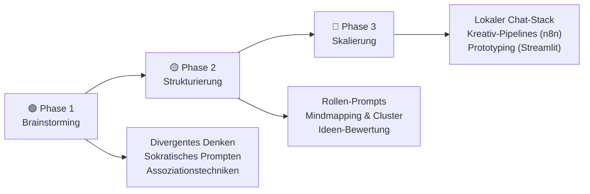
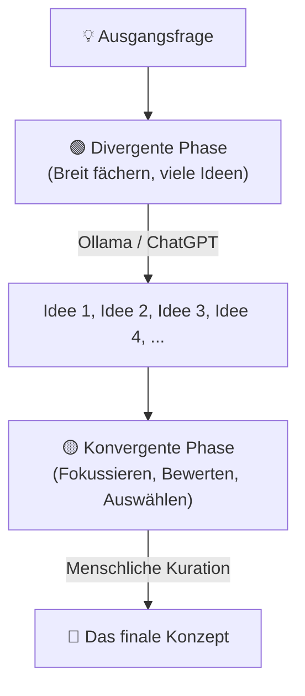
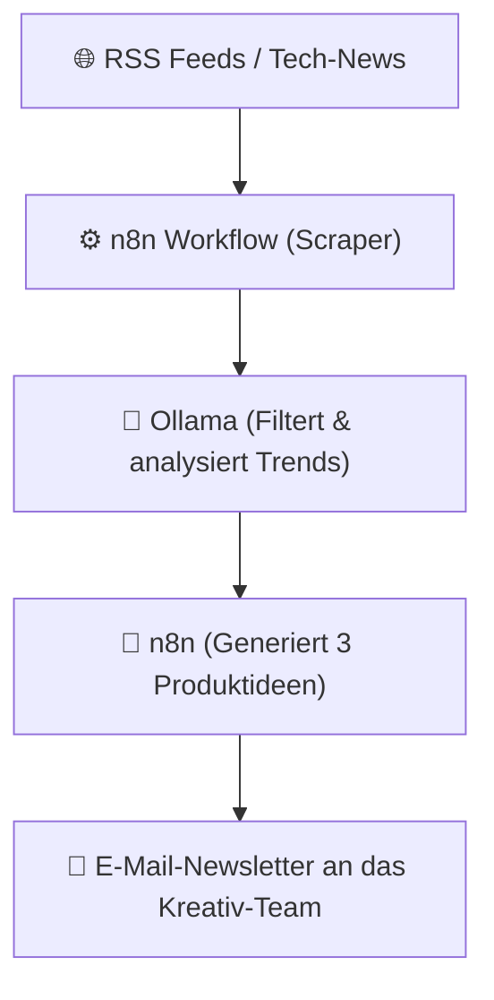
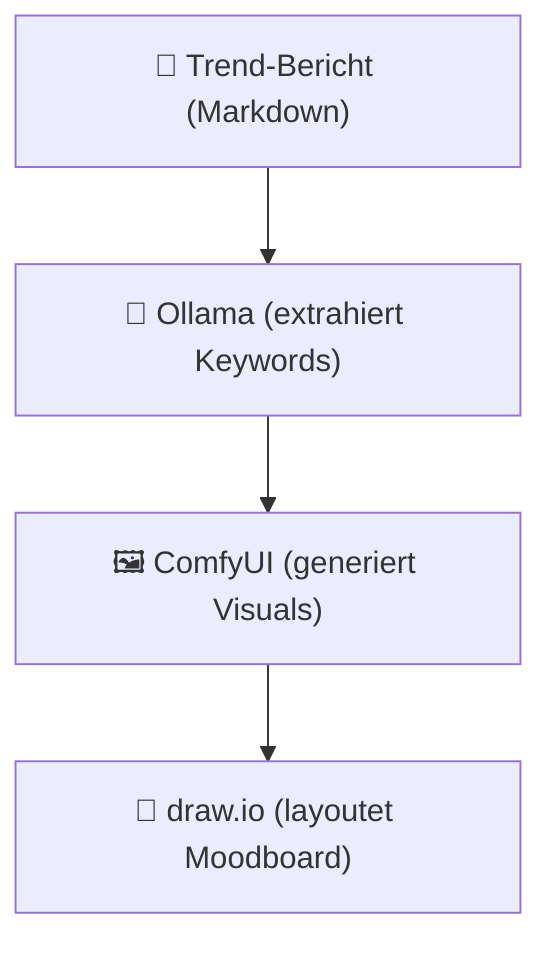
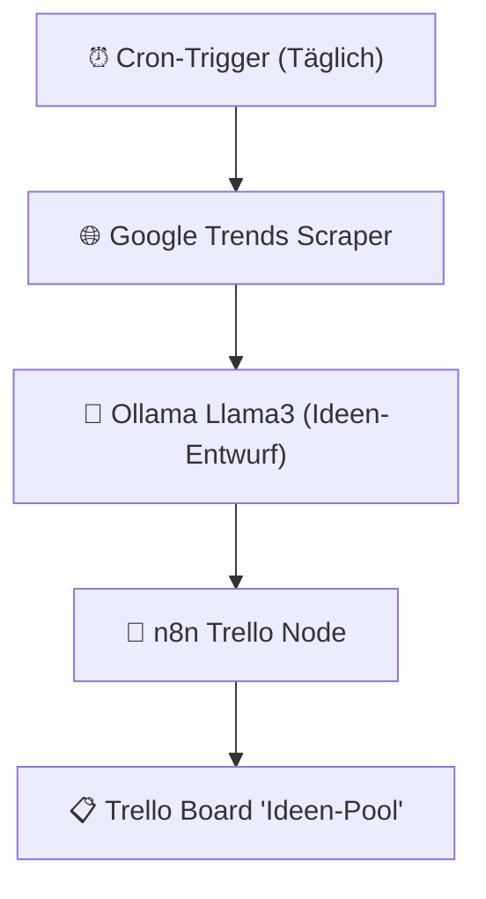

# Ideenfindung mit KI

> **Hinweis zur Software-Auswahl:**  
> Diese Dokumentation priorisiert **Open-Source-Software**, die unter Ubuntu (lokal/self-hosted) betrieben werden kann, um absolute Vertraulichkeit bei der Konzept- und Ideenentwicklung zu gewährleisten.  
> Bei proprietären Cloud-Lösungen wird stets eine **Open-Source-Alternative** mit gleichem Funktionsumfang gegenübergestellt.  
> **LLM-Modelle** und APIs werden unabhängig vom Preis gelistet, da sie als primäre Dialogpartner für kreative Prozesse dienen.

---

## Legende

| Symbol | Bedeutung |
|---|---|
| 🟩 | Open Source – kostenlos, self-hosted / Ubuntu-kompatibel |
| 💰 | Kostenpflichtig |
| 🤖 | LLM-Modell / API – bleibt immer gelistet |
| 🐧 | Linux / Ubuntu nativ |
| 🌐 | Nur Web-Browser |

---

## Lernpfad-Übersicht



---

## Inhaltsverzeichnis

- [🟢 Phase 1 – Grundlagen & Kreativ-Brainstorming](#phase-1-grundlagen-kreativ-brainstorming)
    - [1.1 Konzept: Divergentes vs. Konvergentes Denken mit KI](#11-konzept-divergentes-vs-konvergentes-denken-mit-ki)
    - [1.2 Konzept: Die KI als kreativer Sparringspartner](#12-konzept-die-ki-als-kreativer-sparringspartner)
    - [1.3 Thema: Sokratisches Prompting & Fragenketten](#13-thema-sokratisches-prompting-fragenketten)
    - [1.4 Thema: Assoziations- & Kombinationstechniken](#14-thema-assoziations-kombinationstechniken)
- [🟡 Phase 2 – Strukturierte Ideenentwicklung & Kuration](#phase-2-strukturierte-ideenentwicklung-kuration)
    - [2.1 Konzept: Rollenbasiertes Prompting (Die Denkhüte-Methode)](#21-konzept-rollenbasiertes-prompting-die-denkhute-methode)
    - [2.2 Thema: Mindmapping & visuelle Strukturierung](#22-thema-mindmapping-visuelle-strukturierung)
    - [2.3 Thema: Moodboards & Stil-Synthesen](#23-thema-moodboards-stil-synthesen)
    - [2.4 Thema: Ideen filtern und bewerten (Rubrics)](#24-thema-ideen-filtern-und-bewerten-rubrics)
- [🔴 Phase 3 – Skalierung & Automatisierte Workflows](#phase-3-skalierung-automatisierte-workflows)
    - [3.1 Konzept: Strukturierte Kreativ-Pipelines](#31-konzept-strukturierte-kreativ-pipelines)
    - [3.2 Thema: Lokaler Ideation-Stack für Teams (Open WebUI)](#32-thema-lokaler-ideation-stack-fur-teams-open-webui)
    - [3.3 Thema: Automatisierte Ideen-Pipelines mit n8n](#33-thema-automatisierte-ideen-pipelines-mit-n8n)
    - [3.4 Thema: Prototyping von Ideen (Streamlit & Gradio)](#34-thema-prototyping-von-ideen-streamlit-gradio)
- [📋 Praxisprojekte](#praxisprojekte)
- [📦 Vollständige Softwareübersicht & Vergleich](#vollstandige-softwareubersicht-vergleich)

---

## 🟢 Phase 1 – Grundlagen & Kreativ-Brainstorming

> **Was lerne ich hier?**  
> Wie du Sprachmodelle nutzt, um deine Denkblockaden zu lösen, wie man Assoziationen zwischen unverbundenen Themen erzwingt und wie die KI dich durch Fragen leitet.  
> **Voraussetzungen:** Keine.

---

### 1.1 Konzept: Divergentes vs. Konvergentes Denken mit KI

#### Die zwei Phasen der Ideenfindung

Kreativität benötigt beide Denkrichtungen. KI kann beide Phasen gezielt unterstützen:



- **Divergentes Denken (Öffnen):** Es geht um Quantität. Die KI generiert Assoziationen, Analogien und ungewöhnliche Blickwinkel (z. B. mit hoher Temperatur-Einstellung).
- **Konvergentes Denken (Schließen):** Es geht um Qualität. Die Ideen werden bewertet, strukturiert, logisch gefiltert und auf Machbarkeit geprüft.

---

### 1.2 Konzept: Die KI als kreativer Sparringspartner

#### Warum LLMs hervorragende Ideenlieferanten sind

LLMs haben während ihres Trainings Milliarden von Verknüpfungen gelernt. Sie können sekundenschnell Analogien zwischen völlig unterschiedlichen Disziplinen herstellen (z. B. *„Kombiniere das Prinzip der Photosynthese mit moderner Architektur"*).

---

### 1.3 Thema: Sokratisches Prompting & Fragenketten

#### Konzept: Die KI stellt die Fragen

Lass dich von der KI durch den Ideenprozess führen. Der Prompt zwingt das Modell, dich zu interviewen, statt dir fertige Antworten zu liefern:

```
Prompt: "Ich möchte ein neues Produkt für [Zielgruppe] entwickeln.
         Gib mir keine Lösungen vor. Stelle mir stattdessen nacheinander
         5 gezielte Fragen, um meine eigene Idee zu schärfen.
         Stelle immer nur eine Frage und warte auf meine Antwort."
```

#### Software – Open Source / LLM:

| Software | Typ | Funktion | Ubuntu | Link |
|---|---|---|---|---|
| 🤖 [ChatGPT](https://chat.openai.com) | LLM Cloud | Schnelle Ad-hoc-Ideengenerierung | 🌐 Web | openai.com |
| 🤖 [Claude](https://claude.ai) | LLM Cloud | Herausragendes Sprachgefühl für nuancierte Konzepte | 🌐 Web | claude.ai |
| 🟩 🤖 [Ollama](https://ollama.com) | LLM lokal | Vertrauliche Ideengenerierung direkt auf dem Notebook | 🐧 Ja | ollama.com |

---

### 1.4 Thema: Assoziations- & Kombinationstechniken

#### Konzept: Die Reizwort-Methode mit KI

Die Reizwort-Methode verbindet das eigentliche Problem mit einem zufälligen Wort, um neue Denkpfade freizulegen.

```
Problem: "Wir wollen eine neue Lern-App gestalten."
Reizwort (zufällig): "U-Boot"
Assoziation: "Abtauchen, Druckkabine, Periskop (Blick nach draußen)"
Ergebnis: Eine App mit einem 'Deep-Focus-Tauchmodus' und einem 'Periskop-Modus' für Exkursionen.
```

---

## 🟡 Phase 2 – Strukturierte Ideenentwicklung & Kuration

> **Was lerne ich hier?**  
> Wie du Ideen aus verschiedenen Blickwinkeln bewertest (Denkhüte), visuelle Mindmaps erstellst und unstrukturierte Gedanken sortierst.  
> **Voraussetzungen:** Phase 1 abgeschlossen.

---

### 2.1 Konzept: Rollenbasiertes Prompting (Die Denkhüte-Methode)

#### Die 6 Denkhüte nach De Bono mit KI simulieren

Lass deine Idee von verschiedenen virtuellen Rollen prüfen, um Schwachstellen aufzudecken:

| Hut / Rolle | Fokus | Prompt-Anweisung |
|---|---|---|
| **Weißer Hut** | Zahlen & Fakten | „Analysiere die Idee rein daten- und faktenbasiert." |
| **Roter Hut** | Emotionen & Intuition | „Wie fühlt sich die Nutzung emotional an? Welche Ängste gibt es?" |
| **Schwarzer Hut** | Risiken & Kritik | „Spiele den Advocatus Diaboli. Warum wird diese Idee scheitern?" |
| **Gelber Hut** | Optimismus & Chancen | „Was sind die absoluten Best-Case-Szenarien dieser Idee?" |
| **Grüner Hut** | Kreativität & Alternativen | „Wie können wir die Idee noch radikaler und kreativer denken?" |

---

### 2.2 Thema: Mindmapping & visuelle Strukturierung

#### Konzept: Markdown-Mindmaps (Mermaid)

KIs können keine Grafiken zeichnen, aber sie können Textstrukturen ausgeben, die von Open-Source-Tools direkt in Mindmaps übersetzt werden:

```text
// Prompt: "Erstelle eine Mermaid-Mindmap für das Thema X"
mindmap
  root((Idee X))
    Zielgruppe
      Schüler
      Lehrer
    Features
      Quiz
      Chat
```

#### Software – Open Source zuerst:

| Software | Typ | Funktion | Ubuntu | Link |
|---|---|---|---|---|
| 🟩 [draw.io](https://www.diagrams.net) | Diagramme | Visualisierung von Mermaid-Syntax in Mindmaps | 🐧 Ja | diagrams.net |
| 🟩 [Obsidian](https://obsidian.md) | Wissensdatenbank | Verknüpfung von Notizen über einen interaktiven Graph | 🐧 Ja | obsidian.md |

---

### 2.3 Thema: Moodboards & Stil-Synthesen

#### Konzept: Bild-KIs für die visuelle Konzeptphase

In der frühen Phase helfen Bild-KIs, vage visuelle Ideen in konkrete Farbwelten, Texturen und Stilrichtungen zu übersetzen, um sie dem Team zu präsentieren.

#### Software – Open Source zuerst:

| Software | Typ | Funktion | Ubuntu | Link |
|---|---|---|---|---|
| 🟩 [ComfyUI + Flux](https://github.com/comfyanonymous/ComfyUI) | Bild-KI | Lokale Generierung von Design-Assets und Stilen | 🐧 Ja | github.com/comfyanonymous |
| 🟩 [GIMP](https://www.gimp.org) | Bildbearbeitung | Collagen und Bildkompositionen erstellen | 🐧 Ja | gimp.org |

#### Vergleich: Open Source vs. Kommerziell

| Funktion | Open Source 🟩 | Kommerziell 💰 |
|---|---|---|
| Moodboard-Generierung | ComfyUI, Krita | Midjourney, DALL-E 3 |
| Kollaboratives Whiteboard | Penpot (self-hosted) | Miro, Mural |

---

### 2.4 Thema: Ideen filtern und bewerten (Rubrics)

#### Konzept: Kriterienkataloge (Rubrics) & Scoring

Nach der divergenten Phase (Brainstorming) folgt die konvergente Phase: die Auswahl. Um Ideen sachlich zu bewerten, eignen sich Scoring-Modelle wie der **RICE-Score**:

$$\text{RICE} = \frac{\text{Reach (Reichweite)} \times \text{Impact (Auswirkung)} \times \text{Confidence (Vertrauen)}}{\text{Effort (Aufwand)}}$$

KIs können Rohideen strukturiert analysieren und eine gewichtete Nutzwerttabelle als JSON oder CSV ausgeben.

#### Software – Open Source zuerst:

| Software | Typ | Funktion | Ubuntu | Link |
|---|---|---|---|---|
| 🟩 [Grist](https://github.com/gristlabs/grist-core) | Tabellen-Kalkulation | Relationale Open-Source-Datenbank (Airtable OS-Alternative) | 🐧 Ja | github.com/gristlabs |
| 🟩 [LibreOffice Calc](https://de.libreoffice.org) | Tabellen-Kalkulation | Klassische Tabellenkalkulation für Nutzwertanalysen | 🐧 Ja | libreoffice.org |

#### Vergleich: Open Source vs. Kommerziell

| Funktion | Open Source 🟩 (Ubuntu / Self-hosted) | Kommerziell 💰 |
|---|---|---|
| Daten- & Ideen-Scoring | Grist, LibreOffice Calc | Airtable, Coda, Notion AI |

---

## 🔴 Phase 3 – Skalierung & Automatisierte Workflows

> **Was lerne ich hier?**  
> Wie du automatisierte Ideen-Pipelines aufbaust, kollaborative Tools für Teams hostest und deine Prototypen als Web-App deployst.  
> **Voraussetzungen:** Python- & Server-Grundkenntnisse.

---

### 3.1 Konzept: Strukturierte Kreativ-Pipelines

#### Automatisches Trend-Scraping & Ideen-Generierung



---

### 3.2 Thema: Lokaler Ideation-Stack für Teams (Open WebUI)

#### Konzept: Eigene Chat-Plattform für Brainstorming

Ein zentral gehostetes **Open WebUI** auf einem Ubuntu-Server bietet dem gesamten Design-Team Zugriff auf datenschutzkonforme, lokale Modelle sowie spezialisierte System-Prompts.

#### Software – alle Open Source:

| Software | Typ | Funktion | Ubuntu | Link |
|---|---|---|---|---|
| 🟩 [Open WebUI](https://github.com/open-webui/open-webui) | Chat-Portal | Benutzerverwaltung und Prompt-Sharing für Teams | 🐧 Ja | github.com/open-webui |
| 🟩 [Ollama](https://ollama.com) | LLM Server | Stellt die LLMs für das WebUI bereit | 🐧 Ja | ollama.com |

---

### 3.3 Thema: Automatisierte Ideen-Pipelines mit n8n

#### Konzept: API-gestützte Workflows

**n8n** verknüpft RSS-Feeds, Trello, Google Drive und LLM-APIs grafisch zu komplexen Automatisierungen.

#### Software – alle Open Source:

| Software | Typ | Funktion | Ubuntu | Link |
|---|---|---|---|---|
| 🟩 [n8n (Self-hosted)](https://n8n.io) | Automatisierung | Visual Node-Builder für Automatisierungen | 🐧 Ja | n8n.io |
| 🟩 [Docker](https://www.docker.com) | Container | Einfaches Setup von n8n und Ollama auf Ubuntu | 🐧 Ja | docker.com |

---

### 3.4 Thema: Prototyping von Ideen (Streamlit & Gradio)

#### Konzept: Idee als funktionale Web-App testen

Bevor eine Idee in die echte Entwicklung geht, bauen Designer mit **Streamlit** innerhalb weniger Stunden einen interaktiven Prototyp (MVP), der mit der KI-Logik im Hintergrund arbeitet.

#### Software – alle Open Source:

| Software | Typ | Funktion | Ubuntu | Link |
|---|---|---|---|---|
| 🟩 [Streamlit](https://streamlit.io) | Web-Framework | Erstellung interaktiver UIs direkt aus Python | 🐧 Ja | streamlit.io |
| 🟩 [Gradio](https://www.gradio.app) | Web-Framework | Einfaches Teilen von ML- und Text-Demos | 🐧 Ja | gradio.app |

---

## 📋 Praxisprojekte

### 🟢 Einsteiger: Der sockelbasierte Namensgenerator

Wir erstellen einen interaktiven Chat-Prompt, der Firmen- oder Produktnamen auf Basis deiner Markenwerte erfindet, bewertet und filtert.


**Software (alle Open Source):** Ollama (Modell: Llama3)

---

### 🟡 Fortgeschritten: Interaktives Trend-Moodboard

Wir extrahieren Trends aus einem Textdokument, generieren visuelle Darstellungen davon und exportieren diese als PDF-Moodboard.



**Software (alle Open Source):** Ollama · ComfyUI · draw.io

---

### 🔴 Experte: Automatisierte Ideen-Maschine (n8n)

Ein n8n-Workflow liest täglich Google-Trends, lässt Ollama Ideen generieren und postet sie auf ein internes Trello-Board zur Diskussion.



**Software (alle Open Source):** n8n · Ollama · Docker · Trello (API)

---

## 📦 Vollständige Softwareübersicht & Vergleich

### Brainstorming & Text-Generierung

| Funktion | Open Source 🟩 (Ubuntu / Self-hosted) | Kommerziell 💰 |
|---|---|---|
| Kreativ-Chatbot | Ollama 🐧, Jan.ai 🐧 | ChatGPT, Claude, Gemini |
| Team-Interface | Open WebUI 🐧 | Custom GPTs, ChatGPT Team |

### Diagramme & Visualisierung

| Funktion | Open Source 🟩 (Ubuntu) | Kommerziell 💰 |
|---|---|---|
| Mindmapping / Flows | draw.io 🐧 | Miro, Lucidchart |
| Dokumentenverknüpfung | Obsidian 🐧 | Notion AI |
| Visual Mockups | GIMP 🐧, Penpot 🐧 | Photoshop, Figma |
| Visual Generation | ComfyUI 🐧, AUTOMATIC1111 🐧 | Midjourney, Firefly |

### Automatisierung & Prototypen

| Funktion | Open Source 🟩 (Ubuntu) | Kommerziell 💰 |
|---|---|---|
| Workflow-Builder | n8n (self-hosted) 🐧 | Zapier, Make |
| Python Rapid Prototyp | Streamlit 🐧, Gradio 🐧 | — |
| Server-Deployment | Docker 🐧, Coolify 🐧 | Heroku, Render |

---

## Weiterführende Ressourcen

- **[n8n Integrations](https://n8n.io/integrations/)** – Liste der anbindbaren Plattformen
- **[Open WebUI Guide](https://docs.openwebui.com)** – Installation und Modellerstellung 🟩
- **[Streamlit Gallery](https://streamlit.io/gallery)** – Inspirierende Prototyp-Beispiele 🟩
- **[Obsidian Mindmap](https://github.com/lynchjames/obsidian-mindmap)** – Plugin zur Visualisierung 🟩
- **[De Bono Denkhüte](https://www.debonogroup.com/six_thinking_hats.php)** – Didaktischer Hintergrund

---

*Letzte Aktualisierung: Juli 2026*
