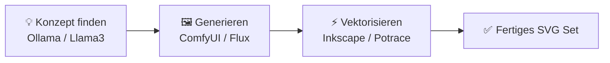

# Leseprobe: KI für Kreative

> **Hinweis zur Software-Auswahl:**  
> Diese Leseprobe priorisiert **Open-Source-Software**, die unter Ubuntu (lokal/self-hosted) betrieben werden kann.  
> Bei proprietären Cloud-Lösungen wird stets eine **Open-Source-Alternative** mit gleichem Funktionsumfang gegenübergestellt.  
> **LLM-Modelle** und Bildgenerierungssysteme werden unabhängig vom Preis gelistet, da sie als fundamentale Werkzeuge im Designprozess dienen.

---

## Legende

| Symbol | Bedeutung |
|---|---|
| 🟩 | Open Source – kostenlos, self-hosted / Ubuntu-kompatibel |
| 💰 | Kostenpflichtig |
| 🤖 | LLM-Modell / API – bleibt immer gelistet |
| 🐧 | Linux / Ubuntu nativ |
| 🌐 | Nur Web-Browser |

---

## Inhaltsverzeichnis

- [📖 Auszug: Kapitel 3 – Prompting als Designmaterial](#auszug-kapitel-3-prompting-als-designmaterial)
    - [3.1 Das Konzept: Der pixelbasierte Zufall und seine Lenkung](#31-das-konzept-der-pixelbasierte-zufall-und-seine-lenkung)
    - [3.2 Thema: Stilsteuerung durch kunsthistorische Begriffe](#32-thema-stilsteuerung-durch-kunsthistorische-begriffe)
    - [3.3 Thema: Lichtsetzung und Kamera-Parameter im Text-Prompt](#33-thema-lichtsetzung-und-kamera-parameter-im-text-prompt)
- [🛠️ Praxis-Workshop: Ein konsistentes Icon-Set erstellen](#praxis-workshop-ein-konsistentes-icon-set-erstellen)
    - [Schritt 1: Das visuelle Konzept (Ollama)](#schritt-1-das-visuelle-konzept-ollama)
    - [Schritt 2: Generierung in ComfyUI (Flux / Stable Diffusion)](#schritt-2-generierung-in-comfyui-flux-stable-diffusion)
    - [Schritt 3: Vektorisierung & Reinzeichnung (Inkscape)](#schritt-3-vektorisierung-reinzeichnung-inkscape)
- [📦 Software-Vergleich im Grafikdesign](#software-vergleich-im-grafikdesign)

---

## 📖 Auszug: Kapitel 3 – Prompting als Designmaterial

---

### 3.1 Das Konzept: Der pixelbasierte Zufall und seine Lenkung

In der klassischen Grafik gestaltest du Linien, Flächen und Farben von Grund auf selbst. Du hast die absolute Kontrolle über jeden Pixel. Beim Arbeiten mit generativer KI ändert sich dieses Paradigma: **Du gestaltest nicht das Bild selbst, sondern den Raum der Möglichkeiten.**

Der Text-Prompt ist kein Befehlsempfänger, sondern ein **kreativer Katalysator**. Die Bild-KI startet mit vollständigem Rauschen (Noise) und errechnet durch das Entfernen des Rauschens (Denoising) Schritt für Schritt das Bild. Deine Aufgabe als Designer ist es, diesen mathematischen Prozess durch präzise sprachliche Leitplanken in die gewünschte Richtung zu lenken.

---

### 3.2 Thema: Stilsteuerung durch kunsthistorische Begriffe

#### Konzept: Ästhetische Epochen nutzen

Statt der KI vage Begriffe wie „schön" oder „modern" zu geben, erzielen kunsthistorische und technische Epochen-Begriffe hochgradig konsistente visuelle Stile:

| Stilrichtung | Visuelle Merkmale | Prompt-Beispiel |
|---|---|---|
| **Bauhaus** | Geometrische Formen, Primärfarben, Funktionalität | „Bauhaus-Stil, minimales Poster, flache Vektoren, rote und gelbe Kreise" |
| **Cyberpunk** | Neonlicht, hoher Kontrast, urbane Dystopie | „Cyberpunk-Ästhetik, regennasse Straße, blaues und magentafarbenes Neonlicht" |
| **Art déco** | Symmetrie, goldene Linien, geometrische Muster | „Art-déco-Illustration, goldene Ornamente auf schwarzem Hintergrund, filigran" |
| **Flat Design** | Keine Verläufe, klare Formen, flache Vektoren | „Flat Design Icon, minimalistisch, 2D, weiche Pastellfarben" |

---

### 3.3 Thema: Lichtsetzung und Kamera-Parameter im Text-Prompt

#### Konzept: Licht modelliert die Form

Licht entscheidet über die Tiefe und Emotionalität deines Designs. Bild-KIs verstehen die Sprache der Fotografen und 3D-Künstler:

- **Gegenlicht (Backlight):** Erzeugt eine leuchtende Silhouette und trennt das Motiv vom Hintergrund.
- **Rembrandt-Licht:** Ein klassisches Drei-Punkt-Licht mit einem markanten Dreiecksschatten auf der Wange (ideal für dramatische Porträts).
- **Weiches Diffuslicht:** Verhindert harte Schlagschatten, ideal für Produktvisualisierungen und flache UI-Elemente.

```
Beispiel-Vergleich im Prompt-Ergebnis:
❌ Negativ: "Ein Apfel auf einem Tisch, fotorealistisch" (Standard-Licht, langweilig)
✅ Positiv: "Ein roter Apfel auf einem Holztisch, dramatisches Rembrandt-Licht,
             weicher Schattenwurf, Makroaufnahme, 85mm Linse, f/1.8" (Cineastisch)
```

---

## 🛠️ Praxis-Workshop: Ein konsistentes Icon-Set erstellen

In diesem kurzen Workshop erstellen wir ein konsistentes Set aus drei Vektor-Icons für ein Web-Interface – vollständig lokal auf einem Ubuntu-System.



### Schritt 1: Das visuelle Konzept (Ollama)

Wir lassen uns von einem lokalen LLM über Ollama ein einheitliches Metaphern-Set für die Bereiche „Home", „Search" und „Settings" erstellen, das auf der **Bauhaus-Ästhetik** basiert.

```bash
ollama run llama3 "Entwirf ein Icon-Konzept für Home, Search und Settings im minimalistischen Bauhaus-Stil. Nutze nur die Grundformen Kreis, Quadrat und Dreieck."
```

---

### Schritt 2: Generierung in ComfyUI (Flux / Stable Diffusion)

Wir verwenden den generierten Prompt in ComfyUI. Um flache Vektor-ähnliche Icons zu erzwingen, nutzen wir folgendes Prompt-Schema:

```text
Prompt: "Minimalistisches flaches Vektor-Icon von [Motiv], Bauhaus-Stil,
         saubere weiße Flächen, isoliert auf weißem Hintergrund,
         keine Schattierungen, klare Linien, 2D, SVG-Look"
```

*Tipp:* Verwende für alle drei Icons denselben **Seed** (Zufallswert) in ComfyUI, um visuelle Konsistenz zu garantieren.

---

### Schritt 3: Vektorisierung & Reinzeichnung (Inkscape)

Die generierten PNG-Dateien importieren wir in **Inkscape** und konvertieren sie in echte Vektoren:

1. Öffne Inkscape und importiere das generierte Icon.
2. Wähle das Bild aus und klicke im Menü auf `Pfad -> Pfad nachzeichnen (Trace Bitmap)`.
3. Stelle den Modus auf `Helligkeitsstufen` und passe den Schwellenwert an, bis die Ränder sauber sind.
4. Klicke auf `Anwenden`. Lösche das ursprüngliche Pixelbild im Hintergrund.
5. Exportiere das fertige Ergebnis als **Optimiertes SVG**.

---

## 📦 Software-Vergleich im Grafikdesign

### Bildgenerierung & Design-Prozess

| Funktion | Open Source 🟩 (Ubuntu / Self-hosted) | Kommerziell 💰 |
|---|---|---|
| Text-to-Image UI | ComfyUI 🐧, AUTOMATIC1111 🐧 | Midjourney, DALL-E 3 |
| Lokale Bildbearbeitung | GIMP 🐧 | Adobe Photoshop |
| Lokales Zeichnen & Malen | Krita 🐧 (+ AI Diffusion Plugin) | Photoshop Generative Fill |
| Vektorbearbeitung | Inkscape 🐧 | Adobe Illustrator |
| Vektorisierung | Potrace 🐧 (CLI), Inkscape 🐧 | Vectorizer.ai |
| Design-Prototyping | Penpot 🐧 (self-hosted) | Figma |

---

## Weiterführende Ressourcen

- **[Inkscape Handbuch](https://inkscape.org/de/lernen/handbuecher/)** – Vektorzeichnen von Grund auf 🟩
- **[Krita AI Diffusion](https://github.com/Acly/krita-ai-diffusion)** – Installationsanleitung für lokales Malen mit KI 🟩
- **[ComfyUI Examples](https://comfyanonymous.github.io/ComfyUI_examples/)** – Workflow-Vorlagen 🟩
- **[Bauhaus-Archiv Berlin](https://www.bauhaus.de)** – Inspirationen und Gestaltungsprinzipien

---

*Leseprobe Ende – Letzte Aktualisierung: Juli 2026*
