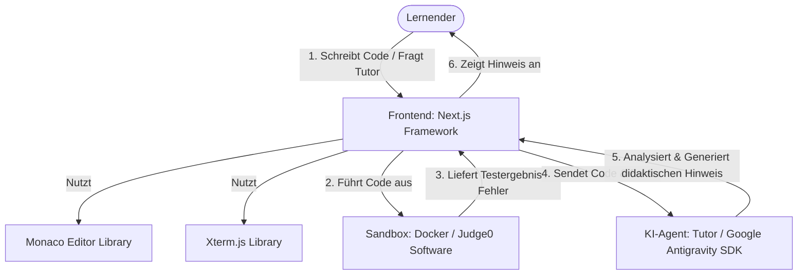

# E-Learning-Autorentools & Interaktive Lernumgebungen

Dieses Dokument bietet eine strukturierte Übersicht über gängige Werkzeuge, Architekturen und Konzepte zur Erstellung von Lerninhalten – von klassischen Autorenwerkzeugen bis hin zu modernen, code-nahen Sandbox-Systemen und KI-gestützten Lernumgebungen.

---

## 1. Klassifizierung & Begriffsbestimmung

Um die verschiedenen Werkzeuge und Ansätze im E-Learning richtig einzuordnen, unterscheidet man zwischen folgenden technischen Kategorien:

*   **Software (Anwendung / Application):**
    *   *Definition:* Ein fertiges, direkt nutzbares Programm für Endanwender (z. B. Articulate 360, Camtasia, JupyterLab).
    *   *Steuerung/Kontrolle:* Der Anwender agiert ausschließlich innerhalb der vom Entwickler vorgegebenen Benutzeroberfläche und Funktionsgrenzen.
*   **Bibliothek (Library):**
    *   *Definition:* Eine Sammlung von wiederverwendbaren Code-Bausteinen und Funktionen, die Entwickler in ihr eigenes Projekt einbinden (z. B. Monaco Editor für Code-Eingaben).
    *   *Steuerung/Kontrolle:* Der Entwickler behält die Kontrolle über den Programmfluss und ruft die Bibliothek gezielt auf (*„You call the library“*).
*   **Framework:**
    *   *Definition:* Ein strukturelles Grundgerüst, das die Architektur und den Ablauf einer Anwendung vorgibt (z. B. Adapt Framework, Next.js).
    *   *Steuerung/Kontrolle:* Das Framework übernimmt die Kontrolle und ruft den Code des Entwicklers an vordefinierten Punkten auf (*„Inversion of Control“* bzw. *„The framework calls you“*).
*   **KI-Agent (AI Agent):**
    *   *Definition:* Ein autonomes System, das auf großen Sprachmodellen (LLMs) basiert, selbstständig Ziele plant, Entscheidungen trifft, Werkzeuge (Tools) nutzt und mit der Umgebung interagiert.
    *   *Steuerung/Kontrolle:* Die Steuerung erfolgt nicht über starren Code, sondern deklarativ über System-Prompts, Leitplanken (Guardrails), Kontextbereitstellung und Feedbackschleifen.

---

## 2. Erstellung & Steuerung von KI-Agenten im E-Learning

KI-Agenten können im E-Learning als personalisierte Tutoren, automatische Code-Bewerter oder interaktive Lernpartner eingesetzt werden. Um sie optimal zu nutzen, müssen sie präzise erstellt und gesteuert werden.

### Erstellung (Frameworks & SDKs)

*   **Google Antigravity SDK:** Ermöglicht den Aufbau autonomer Agenten mit Zugriff auf Entwicklerwerkzeuge und Dateisysteme unter Einhaltung strenger Sicherheits- und Freigabemechanismen.
*   **LangGraph / CrewAI / AutoGen:** Frameworks für Multi-Agenten-Systeme, bei denen verschiedene Agenten (z. B. ein „Erklär-Agent“ und ein „Prüf-Agent“) zusammenarbeiten.

### Steuerung (Control & Alignment)

*   **Rollen- & Kontext-Prompts (System Prompts):** Zuweisung einer klaren Rolle (z. B. *„Du bist ein geduldiger Rust-Tutor. Gib niemals die direkte Lösung vor, sondern leite den Lernenden mit Fragen an.“*).
*   **Werkzeuge & Sandboxing (Tool Calling):** Übergabe genau definierter Funktionen an den Agenten (z. B. Code-Ausführung, Dateizugriff) in einer isolierten Laufzeitumgebung (Docker-Sandbox).
*   **Strukturierte Ausgaben (Structured Outputs):** Verwendung von JSON-Schemata, um sicherzustellen, dass die Antworten des Agenten maschinenlesbar validiert und verarbeitet werden können.
*   **Menschliche Freigabe (Human-in-the-Loop):** Kritische Aktionen (z. B. das Ausführen von Systembefehlen) erfordern die manuelle Bestätigung durch den Nutzer oder Instruktor.
*   **Leitplanken (Guardrails):** Validierungsschichten (z. B. LlamaGuard), die unerwünschte Ein- und Ausgaben blockieren und Halluzinationen minimieren.

---

## 3. Was fehlt? (Aktuelle Lücken im E-Learning-Ökosystem)

Trotz einer Vielzahl an Tools gibt es fundamentale Lücken bei der Integration neuer Technologien in Lernplattformen:

1.  **Nahtlose Integration von KI-Tutoren:** Klassische Autorentools (wie Articulate) bieten keine standardisierten APIs für die dynamische Anbindung von LLM-Agenten für Echtzeit-Feedback.
2.  **Sichere und leichtgewichtige Code-Sandboxen:** Es fehlen einfach zu integrierende, serverlose Lösungen für die sichere Code-Ausführung im Browser, die ohne komplexe Backend-Infrastrukturen (wie Docker-Cluster) auskommen.
3.  **Erweiterte Telemetrie für KI-Interaktionen:** Bestehende Standards wie SCORM oder xAPI sind nicht darauf ausgelegt, die freien, nicht-deterministischen Dialoge und Problemlösungswege zwischen Lernenden und KI-Agenten detailliert aufzuzeichnen.
4.  **Offline-Fähigkeit für KI-basiertes Lernen:** Es fehlen ausgereifte Best-Practices, um kleinere, spezialisierte Sprachmodelle (SLMs) direkt im Browser des Lernenden (z. B. via WebGPU / WebLLM) datenschutzkonform und offline auszuführen.

---

## 4. Übersicht existierender E-Learning-Werkzeuge

### Die Industrie-Standards (Allrounder)

Diese Tools bieten den größten Funktionsumfang für komplexe, interaktive Kurse, erfordern aber meist eine Einarbeitungszeit und proprietäre Lizenzen.

*   **Articulate 360 / Storyline 360:** Der Quasi-Standard für klassische E-Learning-Kurse mit umfangreichen Trigger- und Variablen-Systemen.
*   **Adobe Captivate:** Stark bei Softwaredemonstrationen und responsivem Design.

### Responsive Tools (Web-First)

*   **iSpring Suite:** PowerPoint-Add-in zur schnellen Konvertierung von Präsentationen in E-Learning-Kurse.
*   **DominKnow | ONE:** Cloud-basiertes Autorentool für kollaboratives Arbeiten und responsive Designs.

### Open-Source & Code-nahe Werkzeuge

*   **H5P:** Ermöglicht das Erstellen interaktiver HTML5-Inhalte direkt im Browser (z. B. in Moodle, WordPress). Sehr modular und weit verbreitet.
*   **Adapt Framework:** Ein rein HTML5-basiertes, responsives E-Learning-Framework für Entwickler, das über JSON-Dateien konfiguriert wird.

### Lernmanagement-Systeme (LMS) & Plattform-Software

Software zur Bereitstellung, Verwaltung und Protokollierung von E-Learning-Kursen:

*   **Moodle:** Das weltweit am weitesten verbreitete Open-Source-LMS. Extrem modular und durch offizielle sowie Drittanbieter-Plugins erweiterbar.
*   **Canvas LMS:** Ein modernes, Cloud-natives Open-Source-LMS mit hervorragenden Schnittstellen (APIs) und hoher Usability in Bildungseinrichtungen.
*   **Chamilo:** Ein schlankes, leicht zu bedienendes Open-Source-LMS mit Fokus auf einfacher Kursgestaltung.

### Video & Animation

Wenn der Fokus auf visueller Vermittlung, Screencasts oder mathematisch/technischen Erklärungen liegt:

*   **Camtasia:** Standard-Werkzeug für Bildschirmaufnahmen und Videoschnitte im E-Learning.
*   **OBS Studio:** Open-Source-Software für Live-Streaming und Videoaufnahmen.
*   **Vyond:** Cloud-Plattform zur einfachen Erstellung animierter Erklärvideos.
*   **Code-getriebene Animationen:** Bibliotheken wie *Manim* (Python, bekannt durch 3Blue1Brown) für mathematische und technische Animationen.

### Lokale Entwickler-Plattformen (Interaktives Coding)

*   **Exercism:** Lokales und webbasiertes Lernen durch testgetriebene Entwicklung (TDD) in über 60 Sprachen.
*   **Anki:** Karteikarten-Lernsystem mit Spaced Repetition, das über HTML/CSS/JS und Add-ons hochgradig anpassbar ist.
*   **JetBrains Academy:** Interaktives Lernen integriert in professionelle Entwicklungsumgebungen (IDEs).

### Sandboxen & Self-Hosted Coding-LMS

Wenn eine eigene Lernplattform mit interaktiver Code-Ausführung lokal betrieben werden soll:

*   **Editor:** Einbinden des *Monaco Editors* (Basis von VS Code) in eine Web-App für Syntax-Highlighting und Autovervollständigung direkt im Browser.
*   **Execution-Backend (Sandbox):** Docker-Container zur sicheren Ausführung von Code (z. B. Rust, C#, Python). Ein API-Server (wie **Judge0**) nimmt den Code entgegen, führt Compiler/Interpreter und Test-Suites (z. B. `cargo test`) in einem kurzlebigen Container aus und gibt das Ergebnis strukturiert an das Frontend zurück.

### Bibliotheken für Interaktivität & Web-Learning

Spezifische JavaScript-Bibliotheken zur Bereitstellung interaktiver Funktionalitäten im Browser:

*   **CodeMirror:** Ein flexibler, schlanker Code-Editor für den Browser. Hervorragend geeignet für mobile Lern-Apps als Alternative zu Monaco Editor.
*   **Xterm.js:** Eine Terminal-Komponente für das Frontend, mit der sich interaktive CLI-Umgebungen und SSH-Zugänge direkt im Browser abbilden lassen.
*   **KaTeX / MathJax:** Performante JavaScript-Bibliotheken zur Darstellung von mathematischer Notation (LaTeX) auf Webseiten.
*   **Excalidraw / Tldraw:** Bibliotheken für unendliche digitale Whiteboards, perfekt für interaktive Skizzen und kollaboratives Lernen.
*   **WebLLM:** Bibliothek zur direkten Ausführung von Sprachmodellen im Browser via WebGPU (wichtig für datenschutzkonforme KI-Lernunterstützung).

### Lokale Dokumentations- & interaktive Book-Systeme

*   **mdBook (Rust-Ökosystem):** Erstellt statische, durchsuchbare Bücher aus Markdown-Dateien. Codebeispiele können direkt im Browser ausgeführt werden, wenn sie an ein Playground-Backend angebunden sind.
*   **Jupyter Notebooks / JupyterLab:** Ideal für Python, Datenanalyse und wissenschaftliche Themen. Ermöglicht das Mischen von Markdown-Erklärungen und direkt ausführbaren Code-Zellen in einer interaktiven Web-Oberfläche.

### Standards & Interoperabilitäts-Frameworks

Spezifikationen und Protokolle, die die Kommunikation zwischen Inhalten und Systemen regeln:

*   **SCORM (Sharable Content Object Reference Model):** Der klassische, weit verbreitete XML-basierte E-Learning-Standard zur Paketierung von Kursen.
*   **xAPI (Experience API / Tin Can):** Ein moderneres Framework, das Lernaktivitäten außerhalb klassischer LMS (z. B. mobile Apps, VR-Simulationen) per REST-API protokolliert.
*   **LTI (Learning Tools Interoperability):** Ein Framework von 1EdTech zur nahtlosen und sicheren Einbindung externer Tools (z. B. einer Code-Sandbox) in bestehende LMS.
*   **Three.js / A-Frame:** WebGL- und WebVR-Frameworks, um dreidimensionale und immersive Lernwelten direkt im Browser zu programmieren.

---

## 5. Optimales Zusammenspiel (Referenz-Architektur)

Um eine voll funktionsfähige, interaktive Programmier-Lernumgebung mit KI-Unterstützung aufzubauen, arbeiten die folgenden Komponenten am besten als integriertes Ökosystem zusammen:

### Die Rollenverteilung im Detail:

1.  **Die Software (Laufzeit-Sicherheit & Anwendung):**
    *   **Docker & Judge0** laufen als Backend-Software. Sie nehmen den Code des Lernenden entgegen und führen ihn isoliert aus, um das Host-System vor bösartigem Code zu schützen.
2.  **Die Bibliotheken (Interaktive Benutzeroberfläche):**
    *   **Monaco Editor** stellt die Eingabemaske im Browser bereit (Autovervollständigung, Syntax-Highlighting).
    *   **Xterm.js** rendert die Terminal-Ausgabe des Compilers/Interpreters originalgetreu im Browser.
3.  **Das Framework (App-Architektur & Koordination):**
    *   **Next.js** dient als Web-Framework, das die Benutzeroberfläche, die Benutzerverwaltung und den Datenfluss zwischen Editor, Sandbox und KI-Agent steuert.
    *   **LangGraph** dient als Framework für den Agenten-Ablauf, um sicherzustellen, dass der Agent strukturiert antwortet und Zwischenschritte einhält.
4.  **Der KI-Agent (Intelligenter Tutor):**
    *   Erstellt mit dem **Google Antigravity SDK**, nimmt der KI-Tutor den geschriebenen Code des Nutzers und das Testergebnis aus der Sandbox entgegen.
    *   Er agiert als Sokratischer Mentor: Er gibt keine direkten Lösungen, sondern stellt Leitfragen oder weist auf logische Fehler hin.