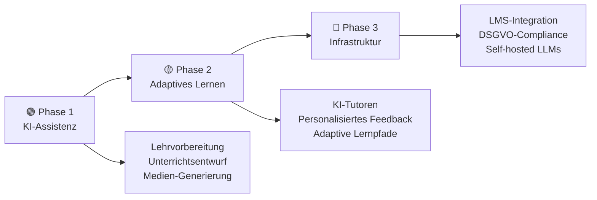
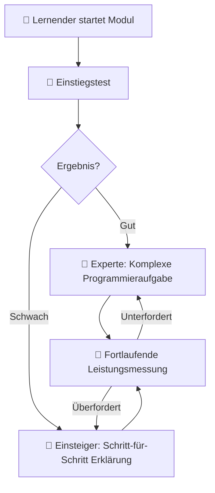
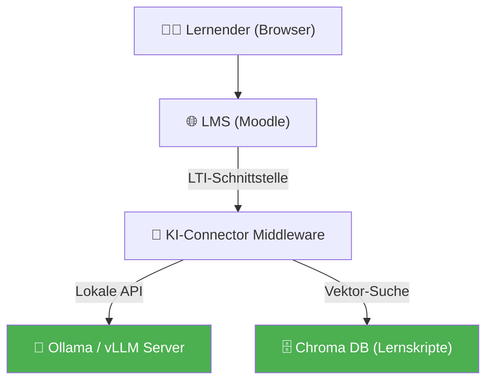
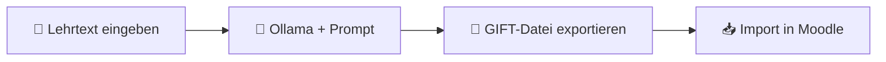
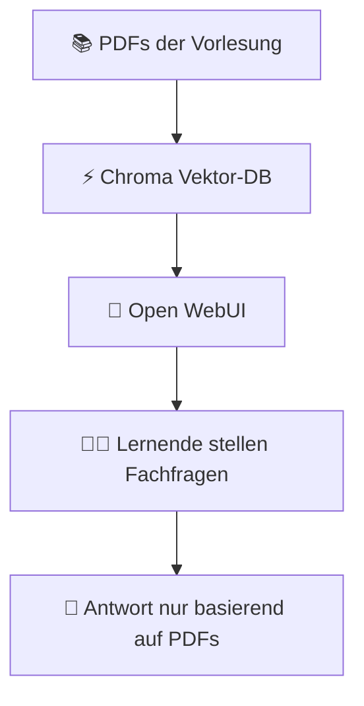
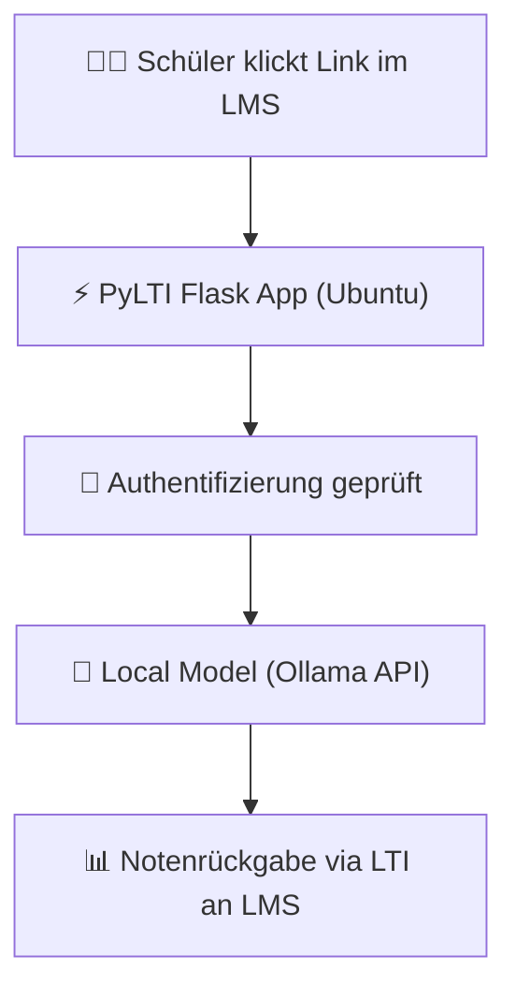

# KI in Lehre, Weiterbildung und Training

> **Hinweis zur Software-Auswahl:**  
> Diese Dokumentation priorisiert **Open-Source-Software**, die datenschutzkonform und unter Ubuntu (lokal/self-hosted) betrieben werden kann.  
> Bei proprietären Lösungen wird stets eine **Open-Source-Alternative** mit gleichem Funktionsumfang gegenübergestellt.  
> **LLM-Modelle** und APIs werden unabhängig vom Preis gelistet, da sie die Basis für adaptive Lernunterstützung bieten.

---

## Legende

| Symbol | Bedeutung |
|---|---|
| 🟩 | Open Source – kostenlos, self-hosted / Ubuntu-kompatibel |
| 💰 | Kostenpflichtig |
| 🤖 | LLM-Modell / API – bleibt immer gelistet |
| 🐧 | Linux / Ubuntu nativ |
| 🌐 | Nur Web-Browser |

---

## Lernpfad-Übersicht



---

## Inhaltsverzeichnis

- [🟢 Phase 1 – Didaktische Grundlagen & KI-Assistenz](#phase-1-didaktische-grundlagen-ki-assistenz)
    - [1.1 Konzept: KI in der Didaktik (Szenarien)](#11-konzept-ki-in-der-didaktik-szenarien)
    - [1.2 Thema: Lehrvorbereitung & Unterrichtsentwurf mit KI](#12-thema-lehrvorbereitung-unterrichtsentwurf-mit-ki)
    - [1.3 Thema: Generierung von Lernmedien (Text, Bild, Audio)](#13-thema-generierung-von-lernmedien-text-bild-audio)
    - [1.4 Thema: Prompts für Lehrende (Didaktisches Prompting)](#14-thema-prompts-fur-lehrende-didaktisches-prompting)
- [🟡 Phase 2 – Adaptives Lernen & KI-Tutoring](#phase-2-adaptives-lernen-ki-tutoring)
    - [2.1 Konzept: Adaptivität und Personalisierung](#21-konzept-adaptivitat-und-personalisierung)
    - [2.2 Thema: KI-Tutoren & Lernbegleiter einrichten](#22-thema-ki-tutoren-lernbegleiter-einrichten)
    - [2.3 Thema: Automatisches Feedback & Bewertungshilfen](#23-thema-automatisches-feedback-bewertungshilfen)
    - [2.4 Thema: Interaktive Quizzes & Übungen generieren](#24-thema-interaktive-quizzes-ubungen-generieren)
- [🔴 Phase 3 – Integration, Infrastruktur & Datenschutz](#phase-3-integration-infrastruktur-datenschutz)
    - [3.1 Konzept: Systemarchitektur für KI-Lernumgebungen](#31-konzept-systemarchitektur-fur-ki-lernumgebungen)
    - [3.2 Thema: LMS-Anbindung (LTI-Standard & APIs)](#32-thema-lms-anbindung-lti-standard-apis)
    - [3.3 Thema: DSGVO-konforme KI-Plattformen in der Bildung](#33-thema-dsgvo-konforme-ki-plattformen-in-der-bildung)
    - [3.4 Thema: Eigene KI-Lernunterstützung hosten](#34-thema-eigene-ki-lernunterstutzung-hosten)
- [📋 Praxisprojekte](#praxisprojekte)
- [📦 Vollständige Softwareübersicht & Vergleich](#vollstandige-softwareubersicht-vergleich)

---

## 🟢 Phase 1 – Didaktische Grundlagen & KI-Assistenz

> **Was lerne ich hier?**  
> Wie KI didaktisch sinnvoll eingesetzt werden kann, wie du als Lehrender Unterrichtsstunden vorbereitest und strukturierte Lehrmaterialien mithilfe von KI erstellst.  
> **Voraussetzungen:** Keine.

---

### 1.1 Konzept: KI in der Didaktik (Szenarien)

#### Konzept: Die vier Stufen der KI-Didaktik

| Stufe | Rolle der KI | Beispiel |
|---|---|---|
| **1. Passiv / Assistiv** | KI bereitet vor, Mensch lehrt | Erstellung eines Lehrplans durch ChatGPT |
| **2. Interaktiv** | KI unterstützt die Übungsphase | Schüler chattet mit einem historischen Avatar |
| **3. Adaptiv** | KI steuert den Lernpfad | System passt Übungsschwierigkeit an Fehlerquote an |
| **4. Autonom** | KI agiert als primärer Tutor | Selbstlernkurse mit dynamischer Audio-Erklärung |

#### Konzept: Konstruktivistisches Lernen mit KI

KI eignet sich hervorragend für **konstruktivistische Lernszenarien**, in denen Lernende durch aktives Ausprobieren und gezieltes Fragen (Sokratischer Dialog) Wissen selbst aufbauen, statt es nur passiv zu konsumieren.

---

### 1.2 Thema: Lehrvorbereitung & Unterrichtsentwurf mit KI

#### Konzept: Stundenplanung nach dem Sanduhr-Prinzip

Ein guter Stundenentwurf beginnt breit (Einstieg/Motivation), verengt sich auf die Erarbeitung (Fokus) und öffnet sich wieder für Transfer & Diskussion. KI kann Entwürfe nach diesem Raster erstellen:

```
Einstieg (10 Min.)   -> Aktivierung des Vorwissens
Erarbeitung (25 Min.) -> Konzentrierte Einzel-/Gruppenarbeit
Sicherung (10 Min.)   -> Präsentation & Feedback
```

#### Software – Open Source / LLM:

| Software | Typ | Funktion | Ubuntu | Link |
|---|---|---|---|---|
| 🤖 [ChatGPT](https://chat.openai.com) | LLM Cloud | Schnelles Generieren von Curricula & Abläufen | 🌐 Web | openai.com |
| 🤖 [Claude](https://claude.ai) | LLM Cloud | Ausgezeichnet für didaktisch strukturierte Texte | 🌐 Web | claude.ai |
| 🟩 🤖 [Ollama](https://ollama.com) | LLM lokal | Lokale Erstellung von Lehrmaterialien (datenschutzsicher) | 🐧 Ja | ollama.com |

---

### 1.3 Thema: Generierung von Lernmedien (Text, Bild, Audio)

#### Konzept: Multimodales Lernen (Dual-Coding-Theorie)

Lernende behalten Informationen besser, wenn sie **visuell und verbal** gleichzeitig dargeboten werden. KI erleichtert die parallele Erstellung von Texten und passenden Veranschaulichungen.

#### Software – Open Source zuerst:

| Software | Typ | Funktion | Ubuntu | Link |
|---|---|---|---|---|
| 🟩 [LibreOffice Impress](https://de.libreoffice.org) | Präsentationen | Offene Alternative für Vortragsfolien | 🐧 Ja | libreoffice.org |
| 🟩 [ComfyUI + Flux](https://github.com/comfyanonymous/ComfyUI) | Bild-KI | Didaktische Illustrationen lokal generieren | 🐧 Ja | github.com/comfyanonymous |
| 🟩 [Coqui XTTS-v2](https://github.com/coqui-ai/TTS) | Audio-KI | Generierung von Audio-Erklärungen für Barrierefreiheit | 🐧 Ja | github.com/coqui-ai |

#### Vergleich: Open Source vs. Kommerziell

| Funktion | Open Source 🟩 | Kommerziell 💰 |
|---|---|---|
| Lehrmedien-Grafik | ComfyUI, GIMP | Canva Pro, Midjourney |
| Präsentations-Erstellung | LibreOffice Impress | Gamma App, Tome AI |
| Audio-Erklärungen (TTS) | Coqui XTTS-v2, Bark | ElevenLabs |

---

### 1.4 Thema: Prompts für Lehrende (Didaktisches Prompting)

#### Konzept: Sokratischer Dialog-Prompt

Damit ein LLM nicht sofort die Lösung ausgibt, muss es didaktisch „eingezäunt" werden:

```
Rolle:       "Du bist ein geduldiger Didaktik-Tutor für Informatik."
Leitlinie:   "Gib dem Benutzer niemals direkt die Lösung für seinen Programmierfehler."
Methode:     "Stelle stattdessen eine zielführende Frage, die den Benutzer auf den
              richtigen Weg leitet. Erkläre das zugrundeliegende Konzept kurz."
```

#### Konzept: Generieren von Verständnisfragen (Bloom-Taxonomie)

Gute Prüfungsfragen sollten verschiedene Kognitionsstufen abdecken:

| Stufe | Ziel | Prompt-Beispiel |
|---|---|---|
| **Erinnern** | Fakten abrufen | „Nenne die drei Phasen der Zellteilung." |
| **Verstehen** | Konzepte erklären | „Erkläre mit eigenen Worten das Prinzip der Inflation." |
| **Anwenden** | Wissen nutzen | „Berechne den Bremsweg bei einer Geschwindigkeit von..." |

---

## 🟡 Phase 2 – Adaptives Lernen & KI-Tutoring

> **Was lerne ich hier?**  
> Wie du Lernenden personalisierte Unterstützung anbietest und Systeme einrichtest, die sich automatisch an das Lerntempo anpassen.  
> **Voraussetzungen:** Didaktische Grundlagen (Phase 1).

---

### 2.1 Konzept: Adaptivität und Personalisierung



#### Makro- vs. Mikro-Adaptivität

- **Makro-Adaptivität:** Der gesamte Kursaufbau ändert sich (z. B. Überspringen von Kapiteln nach einem Pre-Test).
- **Mikro-Adaptivität:** Die unmittelbare Unterstützung innerhalb einer Aufgabe ändert sich (z. B. Hilfestellungen beim Tippen von Code).

---

### 2.2 Thema: KI-Tutoren & Lernbegleiter einrichten

#### Konzept: RAG für Schulungsunterlagen

Ein KI-Tutor soll nur auf Basis **deiner offiziellen Skripte** antworten, um Halluzinationen zu vermeiden.

```
Schulungs-PDF -> Embeddings generieren -> Speichern in Vektor-DB (Chroma) -> LLM-Tutor liest aus DB
```

#### Software – Open Source zuerst:

| Software | Typ | Funktion | Ubuntu | Link |
|---|---|---|---|---|
| 🟩 🤖 [Open WebUI](https://github.com/open-webui/open-webui) | Chat-Oberfläche | Stellt Web-Chats für Klassen mit RAG-Anbindung bereit | 🐧 Ja | github.com/open-webui |
| 🟩 [LlamaIndex](https://www.llamaindex.ai) | RAG | Verbindet Lernmaterialien mit dem KI-Tutor | 🐧 Ja | llamaindex.ai |

#### Vergleich: Open Source vs. Kommerziell

| Funktion | Open Source 🟩 (Ubuntu) | Kommerziell 💰 |
|---|---|---|
| Chat-Tutor für Klassen | Open WebUI + Ollama | Custom GPTs (ChatGPT Team), Mindgrasp |
| RAG-Verbindung | LlamaIndex, LangChain | Pinecone Cloud |

---

### 2.3 Thema: Automatisches Feedback & Bewertungshilfen

#### Konzept: Kriterienbasiertes Bewerten (Rubrics)

KI kann Essays oder Code-Abgaben auf Basis einer klaren Kriterienmatrix (Rubrik) bewerten. Dies spart Zeit und sorgt für konsistentes Feedback.

```
Kriterien:
1. Korrektheit der Aussage (Gewichtung: 50%)
2. Struktur und Gliederung (Gewichtung: 30%)
3. Rechtschreibung/Grammatik (Gewichtung: 20%)
```

#### Software – Open Source zuerst:

| Software | Typ | Funktion | Ubuntu | Link |
|---|---|---|---|---|
| 🟩 [LanguageTool](https://languagetool.org/de) | Feedback-Tool | Automatische Text- und Stilkorrektur für Abgaben | 🐧 Ja | languagetool.org |
| 🟩 [Moodle (Essay-Evaluator Plugins)](https://moodle.org) | LMS | Integriertes Feedback über automatisierte Bewertungsmodule | 🐧 Ja | moodle.org |

---

### 2.4 Thema: Interaktive Quizzes & Übungen generieren

#### Konzept: Exportformate für LMS (GIFT & Aiken)

Um Quizzes in Plattformen wie Moodle zu importieren, eignen sich standardisierte Textformate. KI kann diese fehlerfrei generieren:

```text
// GIFT-Format Beispiel
Was ist die Hauptstadt von Deutschland? {
    =Berlin
    ~Hamburg
    ~München
}
```

#### Software – Open Source zuerst:

| Software | Typ | Funktion | Ubuntu | Link |
|---|---|---|---|---|
| 🟩 [H5P](https://h5p.org) | Interaktive Übung | Erstellung von interaktiven Videos, Lückentexten und Quizzes | 🐧 Ja | h5p.org |
| 🟩 [Moodle Quiz-Modul](https://moodle.org) | LMS-Modul | Import von GIFT/Aiken-Dateien | 🐧 Ja | moodle.org |

---

## 🔴 Phase 3 – Integration, Infrastruktur & Datenschutz

> **Was lerne ich hier?**  
> Wie du KI-Anwendungen in bestehende Lernplattformen (LMS) integrierst, den Datenschutz (DSGVO) in Bildungseinrichtungen einhältst und lokale Server aufbaust.  
> **Voraussetzungen:** Python- & System-Admin-Grundlagen.

---

### 3.1 Konzept: Systemarchitektur für KI-Lernumgebungen



---

### 3.2 Thema: LMS-Anbindung (LTI-Standard & APIs)

#### Konzept: LTI (Learning Tools Interoperability)

LTI ist der Branchenstandard, um externe interaktive Lernwerkzeuge nahtlos in LMS-Plattformen (wie Moodle, Canvas, Blackboard) einzubinden. Der Lernende wird automatisch eingeloggt, und die Noten fließen zurück ins LMS.

#### Software – alle Open Source:

| Software | Typ | Funktion | Ubuntu | Link |
|---|---|---|---|---|
| 🟩 [PyLTI](https://github.com/mitodl/pylti) | Python-Lib | LTI-Schnittstellen für Python-Anwendungen (Flask/Django) | 🐧 Ja | github.com/mitodl/pylti |
| 🟩 [Moodle LTI-Consumer](https://moodle.org) | LMS-Modul | Bindet LTI-Anwendungen direkt in Kurse ein | 🐧 Ja | moodle.org |

---

### 3.3 Thema: DSGVO-konforme KI-Plattformen in der Bildung

#### Konzept: Personenbezogene Daten (PB) an Schulen & Universitäten

- ❌ **Verboten:** Namen, E-Mail-Adressen oder freie Schülertexte unverschlüsselt an kommerzielle US-Cloud-APIs (OpenAI, Claude) senden.
- ✅ **Erlaubt:** Anonymisiertes Prompting oder Nutzung lokaler On-Premise-Modelle (Ollama) auf schuleigenen Servern.
- ✅ **Erlaubt:** DSGVO-konforme Enterprise-Verträge mit Auftragsverarbeitungsvereinbarung (AVV) und Datenhaltung in der EU.

#### Checkliste für Bildungs-KI:

1. **Datensparsamkeit:** Keine echten Schülernamen im Chatverlauf.
2. **Lokales Hosting:** Bevorzugung lokaler LLMs für sensible Facharbeiten.
3. **Open-Source:** Nachvollziehbarkeit des Codes und Ausschluss von Telemetrie.

---

### 3.4 Thema: Eigene KI-Lernunterstützung hosten

#### Konzept: Eigener KI-Server für Schulen/Betriebe

Ein zentraler, lokaler GPU-Server versorgt eine ganze Schule oder einen Betrieb mit KI-Assistenten – datenschutzsicher und ohne laufende Token-Kosten.

```bash
# Docker-Compose für datenschutzsichere Schulungs-KI
version: '3.8'
services:
  ollama:
    image: ollama/ollama:latest
    ports:
      - "11434:11434"
    volumes:
      - ollama_data:/root/.ollama
  open-webui:
    image: ghcr.io/open-webui/open-webui:main
    ports:
      - "8080:8080"
    environment:
      - OLLAMA_BASE_URL=http://ollama:11434
    volumes:
      - open-webui_data:/app/backend/data
volumes:
  ollama_data:
  open-webui_data:
```

#### Software – alle Open Source:

| Software | Typ | Funktion | Ubuntu | Link |
|---|---|---|---|---|
| 🟩 [Docker + Docker Compose](https://www.docker.com) | Container | Einfaches Starten des KI-Stacks | 🐧 Ja | docker.com |
| 🟩 [Open WebUI](https://github.com/open-webui/open-webui) | Portal | Nutzerverwaltung & Rollen für Klassen | 🐧 Ja | github.com/open-webui |
| 🟩 [Coolify](https://coolify.io) | Host-PaaS | Einfaches Servermanagement auf Ubuntu | 🐧 Ja | coolify.io |

---

## 📋 Praxisprojekte

### 🟢 Einsteiger: GIFT-Quiz-Generator für Moodle



**Software (alle Open Source):** Ollama (Modell: Llama3) · Moodle

---

### 🟡 Fortgeschritten: Lokaler RAG-Tutor für Fachunterlagen



**Software (alle Open Source):** Open WebUI · Ollama · Chroma

---

### 🔴 Experte: DSGVO-konforme LTI-Lernanwendung



**Software (alle Open Source):** PyLTI · Flask · Moodle · Ollama · Docker

---

## 📦 Vollständige Softwareübersicht & Vergleich

### Didaktische Helfer & Generatoren

| Funktion | Open Source 🟩 (Ubuntu) | Kommerziell 💰 |
|---|---|---|
| Textentwürfe & Didaktik | Ollama 🐧, Jan.ai 🐧 | ChatGPT, Claude |
| Bilder & Illustration | ComfyUI 🐧, AUTOMATIC1111 🐧 | Midjourney, DALL-E 3 |
| Audio-Erklärungen | Coqui XTTS-v2 🐧, Bark 🐧 | ElevenLabs |

### Lernplattformen (LMS)

| Funktion | Open Source 🟩 (Ubuntu) | Kommerziell 💰 |
|---|---|---|
| Kurs- & Klassenverwaltung | Moodle 🐧, Canvas LMS 🐧, Chamilo 🐧 | Blackboard, Canvas Cloud |
| Interaktive Aufgaben | H5P 🐧 | Articulate Rise |
| Klassisches Autorentool | Adapt Framework 🐧 | Articulate Storyline 360, Adobe Captivate |

### KI-Klassenzimmer-Portale & RAG

| Funktion | Open Source 🟩 (Ubuntu) | Kommerziell 💰 |
|---|---|---|
| Schulungs-Chatbot Portal | Open WebUI 🐧 | Custom GPTs |
| RAG-Orchestrierung | LlamaIndex 🐧, LangChain 🐧 | Pinecone |
| Schreib- & Stilfeedback | LanguageTool 🐧 | Grammarly |

### Schnittstellen & Deployment

| Funktion | Open Source 🟩 (Ubuntu) | Kommerziell 💰 |
|---|---|---|
| LMS-Schnittstelle | PyLTI 🐧 | — |
| Server-Deployment | Docker 🐧, Coolify 🐧 | Heroku, Vercel |

---

## Weiterführende Ressourcen

- **[H5P Community](https://h5p.org)** – Interaktive HTML5-Lernbausteine 🟩
- **[Moodle Plugins](https://moodle.org/plugins)** – Moodle erweitern 🟩
- **[IMS Global LTI Standards](https://www.imsglobal.org/activity/learning-tools-interoperability)** – Technische Spezifikation
- **[EU-DSGVO Portal](https://dsgvo-gesetz.de)** – Gesetzesvorgaben für Bildungseinrichtungen
- **[Open WebUI Community Docs](https://docs.openwebui.com)** – Einrichtungs-Guides 🟩

---

*Letzte Aktualisierung: Juli 2026*
