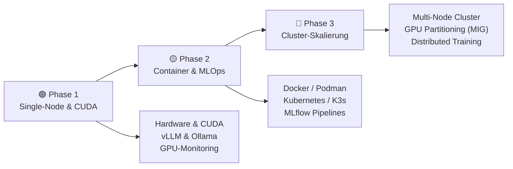
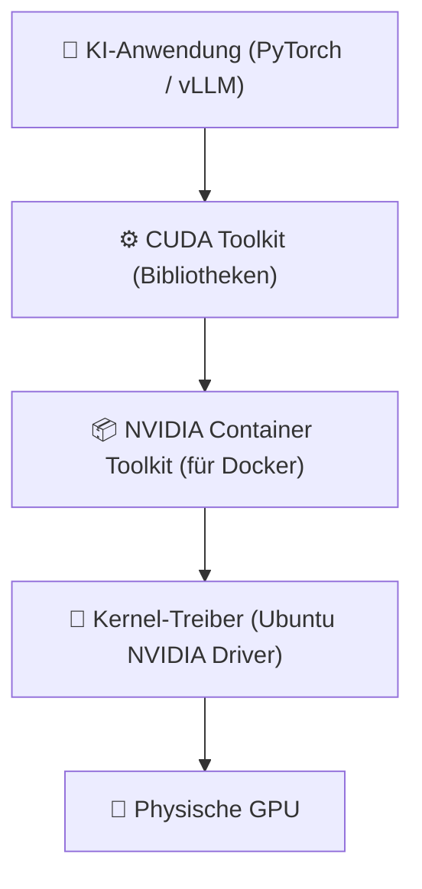
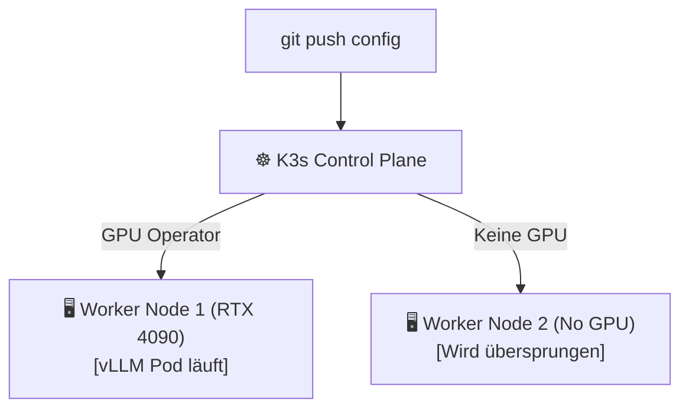

# Skalierbare KI/ML-Infrastrukturen

> **Hinweis zur Software-Auswahl:**  
> Diese Dokumentation priorisiert **Open-Source-Software**, die auf Ubuntu-Servern betrieben werden kann.  
> Bei kommerziellen Cloud-Lösungen wird stets eine **Open-Source-Alternative** für das eigene Rechenzentrum (On-Premise) gegenübergestellt.  
> **LLM-Modelle** und Inference-Server werden unabhängig vom Preis gelistet, da sie die funktionale Kernkomponente darstellen.

---

## Legende

| Symbol | Bedeutung |
|---|---|
| 🟩 | Open Source – kostenlos, self-hosted / Ubuntu-kompatibel |
| 💰 | Kostenpflichtig |
| 🤖 | LLM-Modell / API / Inference-Server – bleibt immer gelistet |
| 🐧 | Linux / Ubuntu nativ |
| 🌐 | Nur Web-Browser |

---

## Lernpfad-Übersicht



---

## Inhaltsverzeichnis

- [🟢 Phase 1 – Hardware, CUDA & Single-Node Serving](#phase-1-hardware-cuda-single-node-serving)
    - [1.1 Konzept: Hardware-Anforderungen für KI/ML](#11-konzept-hardware-anforderungen-fur-kiml)
    - [1.2 Thema: NVIDIA CUDA & Driver unter Ubuntu einrichten](#12-thema-nvidia-cuda-driver-unter-ubuntu-einrichten)
    - [1.3 Thema: Single-Node Inference-Server (vLLM & Ollama)](#13-thema-single-node-inference-server-vllm-ollama)
    - [1.4 Thema: GPU-Monitoring (Prometheus & Grafana)](#14-thema-gpu-monitoring-prometheus-grafana)
- [🟡 Phase 2 – Containerisierung, Orchestrierung & MLOps](#phase-2-containerisierung-orchestrierung-mlops)
    - [2.1 Konzept: Container-Vorteile im ML-Bereich](#21-konzept-container-vorteile-im-ml-bereich)
    - [2.2 Thema: Docker & Podman für GPU-Workloads](#22-thema-docker-podman-fur-gpu-workloads)
    - [2.3 Thema: Kubernetes (K8s) & K3s für ML-Orchestrierung](#23-thema-kubernetes-k8s-k3s-fur-ml-orchestrierung)
    - [2.4 Thema: MLOps-Pipelines & Versionierung (MLflow)](#24-thema-mlops-pipelines-versionierung-mlflow)
- [🔴 Phase 3 – Cluster-Skalierung, Virtualisierung & High-Availability](#phase-3-cluster-skalierung-virtualisierung-high-availability)
    - [3.1 Konzept: Skalierungstechnologien (Horizontal vs. Vertikal)](#31-konzept-skalierungstechnologien-horizontal-vs-vertikal)
    - [3.2 Thema: GPU-Virtualisierung & Partitionierung (MIG)](#32-thema-gpu-virtualisierung-partitionierung-mig)
    - [3.3 Thema: High-Performance Storage für Trainingsdaten](#33-thema-high-performance-storage-fur-trainingsdaten)
    - [3.4 Thema: Multi-Node Clustering & Distributed Training](#34-thema-multi-node-clustering-distributed-training)
- [📋 Praxisprojekte](#praxisprojekte)
- [📦 Vollständige Softwareübersicht & Vergleich](#vollstandige-softwareubersicht-vergleich)

---

## 🟢 Phase 1 – Hardware, CUDA & Single-Node Serving

> **Was lerne ich hier?**  
> Die richtige Hardware-Evaluierung, das Installieren der GPU-Treiber unter Ubuntu und das Hosten deines ersten Inference-Servers inklusive Überwachung.  
> **Voraussetzungen:** Grundkenntnisse in Linux-Systemadministration.

---

### 1.1 Konzept: Hardware-Anforderungen für KI/ML

#### Konzept: CPU vs. GPU vs. TPU

| Chip-Typ | Architektur | Eignung für KI |
|---|---|---|
| **CPU** | Wenige, komplexe Kerne (latenzoptimiert) | Sehr langsame Inferenz, ungeeignet für Training |
| **GPU** | Tausende, einfache Kerne (durchsatzoptimiert) | Standard für Training & Inferenz (NVIDIA CUDA) |
| **TPU / NPU** | Spezialisierte ASICs für Matrix-Multiplikation | Extrem schnell für spezifische Modelle |

#### Konzept: Der VRAM-Flaschenhals

Das wichtigste Kriterium einer GPU für LLMs ist der **VRAM** (Video-RAM). Ein Modell muss vollständig in den VRAM passen, um schnell ausgeführt zu werden.

```
Modellgröße berechnen (Faustregel):
Parameterzahl (z.B. 8B) * Byte pro Parameter (FP16 = 2 Byte, INT8 = 1 Byte, INT4 = 0.5 Byte)
Beispiel Llama 3 8B in FP16: 8.000.000.000 * 2 Byte = 16 GB VRAM benötigt.
```

---

### 1.2 Thema: NVIDIA CUDA & Driver unter Ubuntu einrichten

#### Konzept: Der GPU-Treiber-Stack

Damit Applikationen die GPU nutzen können, muss der Stack korrekt installiert sein:



#### CLI-Befehle zur Einrichtung unter Ubuntu 24.04 LTS:

```bash
# NVIDIA-Treiber installieren
sudo apt update
sudo apt install nvidia-driver-550 nvidia-utils-550

# System neustarten und Installation prüfen
sudo reboot
nvidia-smi  # Zeigt GPU-Temperatur, VRAM und Prozesse
```

---

### 1.3 Thema: Single-Node Inference-Server (vLLM & Ollama)

#### Konzept: Batching und Durchsatz-Optimierung

Ein Standard-LLM-Inference-Server reagiert träge, wenn viele Anfragen parallel eingehen. Leistungsstarke Server wie **vLLM** nutzen **PagedAttention**, um VRAM-Fragmentierung zu verhindern und Anfragen dynamisch zu bündeln (Continuous Batching).

#### Software – Open Source / LLM:

| Software | Typ | Funktion | Ubuntu | Link |
|---|---|---|---|---|
| 🟩 🤖 [vLLM](https://github.com/vllm-project/vllm) | Server | Hochperformanter Inference-Server mit PagedAttention | 🐧 Ja | github.com/vllm-project |
| 🟩 🤖 [Ollama](https://ollama.com) | Server | Einfacher, benutzerfreundlicher Modell-Server | 🐧 Ja | ollama.com |
| 🟩 🤖 [Triton Inference Server](https://github.com/triton-inference-server/server) | Server | NVIDIAs Enterprise Multi-Modell-Server | 🐧 Ja | github.com/triton-inference-server |

#### Vergleich: Open Source vs. Kommerziell

| Server | Open Source 🟩 (Ubuntu / Self-hosted) | Kommerziell 💰 (Cloud-API) |
|---|---|---|
| LLM-Hosting | vLLM, Ollama, Triton Server | OpenAI API, Replicate, AWS Bedrock |

---

### 1.4 Thema: GPU-Monitoring (Prometheus & Grafana)

#### Konzept: DCGM (Data Center GPU Manager)

NVIDIA-GPUs im Rechenzentrum liefern detaillierte Metriken über Auslastung, Temperatur, Stromverbrauch und Speicherfehler. Der **DCGM Exporter** übersetzt diese in das Prometheus-Format.

#### Software – alle Open Source:

| Software | Typ | Funktion | Ubuntu | Link |
|---|---|---|---|---|
| 🟩 [Prometheus](https://prometheus.io) | Time-Series-DB | Speicherung der Performance-Metriken | 🐧 Ja | prometheus.io |
| 🟩 [Grafana](https://grafana.com) | Dashboard | Visualisierung der GPU- und Systemauslastung | 🐧 Ja | grafana.com |
| 🟩 [NVIDIA DCGM Exporter](https://github.com/NVIDIA/gpu-monitoring-tools) | Exporter | Exportiert GPU-Metriken für Prometheus | 🐧 Ja | github.com/NVIDIA |

---

## 🟡 Phase 2 – Containerisierung, Orchestrierung & MLOps

> **Was lerne ich hier?**  
> Wie du ML-Umgebungen in Docker-Containern isolierst, Workloads über Kubernetes steuerst und den Lebenszyklus von Modellen mit MLOps-Tools verwaltest.  
> **Voraussetzungen:** Phase 1 abgeschlossen.

---

### 2.1 Konzept: Container-Vorteile im ML-Bereich

#### Das Dependency-Chaos verhindern

ML-Code hat komplexe Abhängigkeiten (bestimmte Python-Versionen, spezifische PyTorch-Versionen, die genau zu einer CUDA-Version passen müssen). Container kapseln diese Umgebung ein für alle Mal ein:

```
[PyTorch 2.3] -> [CUDA 12.1] -> [NVIDIA Driver 535] (Im Docker-Image fest verbaut)
```

---

### 2.2 Thema: Docker & Podman für GPU-Workloads

#### Konzept: NVIDIA Container Toolkit

Docker-Container können standardmäßig nicht auf die Grafikkarte zugreifen. Das **NVIDIA Container Toolkit** schleift die GPU sicher in den Container durch.

```bash
# Docker mit GPU-Zugriff starten
docker run --gpus all -it nvidia/cuda:12.1.0-base-ubuntu22.04 nvidia-smi
```

#### Software – alle Open Source:

| Software | Typ | Funktion | Ubuntu | Link |
|---|---|---|---|---|
| 🟩 [Docker Engine](https://www.docker.com) | Container | De-facto-Standard zur Containerisierung | 🐧 Ja | docker.com |
| 🟩 [Podman](https://podman.io) | Container | Rootless, daemonlose Docker-Alternative | 🐧 Ja | podman.io |
| 🟩 [NVIDIA Container Toolkit](https://github.com/NVIDIA/nvidia-container-toolkit) | Helper | Ermöglicht GPU-Schnittstelle für Container | 🐧 Ja | github.com/NVIDIA |

---

### 2.3 Thema: Kubernetes (K8s) & K3s für ML-Orchestrierung

#### Konzept: GPU-Scheduling

Kubernetes verwaltet ein Cluster aus Servern. Durch den **NVIDIA GPU Operator** kann Kubernetes erkennen, welche Nodes freie GPUs haben, und Container gezielt dort deployen:

```yaml
# Pod-Ressourcenanforderung in Kubernetes
resources:
  limits:
    nvidia.com/gpu: 1  # Kubernetes reserviert genau 1 GPU für diesen Container
```

#### Software – alle Open Source:

| Software | Typ | Funktion | Ubuntu | Link |
|---|---|---|---|---|
| 🟩 [K3s (Rancher)](https://k3s.io) | Kubernetes | Leichtgewichtiges K8s, perfekt für Edge und mittlere Cluster | 🐧 Ja | k3s.io |
| 🟩 [Kubernetes](https://kubernetes.io/de/) | Orchestrierung | Branchenstandard für Container-Orchestrierung | 🐧 Ja | kubernetes.io |
| 🟩 [NVIDIA GPU Operator](https://github.com/NVIDIA/gpu-operator) | Operator | Automatisiert das GPU-Setup auf Kubernetes Nodes | 🐧 Ja | github.com/NVIDIA |

---

### 2.4 Thema: MLOps-Pipelines & Versionierung (MLflow)

#### Konzept: Das Modell-Register

Modelle verhalten sich anders als herkömmlicher Code. Sie bestehen aus Code + Hyperparametern + Trainingsdaten. **MLflow** trackt all diese Faktoren und registriert die daraus resultierenden Modellgewichte.

#### Software – alle Open Source:

| Software | Typ | Funktion | Ubuntu | Link |
|---|---|---|---|---|
| 🟩 [MLflow](https://mlflow.org) | MLOps Platform | Tracking von Experimenten, Code & Modellversionen | 🐧 Ja | mlflow.org |
| 🟩 [Kubeflow](https://www.kubeflow.org) | MLOps Platform | Komplettes MLOps-Framework für Kubernetes | 🐧 Ja | kubeflow.org |

#### Vergleich: Open Source vs. Kommerziell

| MLOps-Schritt | Open Source 🟩 (Ubuntu / Self-hosted) | Kommerziell 💰 |
|---|---|---|
| Experiment-Tracking | MLflow | Weights & Biases, Neptune.ai |
| Workflow-Pipelines | Kubeflow Pipelines, Apache Airflow | AWS SageMaker, Azure ML |

---

## 🔴 Phase 3 – Cluster-Skalierung, Virtualisierung & High-Availability

> **Was lerne ich hier?**  
> Wie du GPUs virtualisierst, extrem schnelle Speichersysteme für Terabytes an Trainingsdaten anbindest und Modelle über mehrere Server parallel trainierst.  
> **Voraussetzungen:** Phase 1 & 2 abgeschlossen.

---

### 3.1 Konzept: Skalierungstechnologien (Horizontal vs. Vertikal)

| Skalierungsart | Beschreibung | Vorteile | Nachteile |
|---|---|---|---|
| **Vertikal (Scale-Up)** | Stärkere/Mehr GPUs in *einen* Server einbauen | Keine Netzwerklatenz, einfach zu programmieren | Limit durch Mainboard & Stromversorgung |
| **Horizontal (Scale-Out)** | Mehr Server in das Cluster aufnehmen | Unbegrenztes Potenzial | Hohe Latenz über das Netzwerk (InfiniBand nötig) |

---

### 3.2 Thema: GPU-Virtualisierung & Partitionierung (MIG)

#### Konzept: Multi-Instance GPU (MIG)

Größere GPUs (wie NVIDIA H100 oder A100) sind für kleinere Aufgaben (z. B. Entwicklung oder Übersetzung) unterfordert. Durch **MIG** kann eine physische GPU in bis zu 7 unabhängige Hardware-Instanzen partitioniert werden.

```
Physische GPU (z.B. A100 80GB) 
   --> Instance 1 (10GB VRAM) -> User A (Dev-Notebook)
   --> Instance 2 (10GB VRAM) -> User B (Test-Bot)
   --> Instance 3 (20GB VRAM) -> Pipeline (Inferenz)
   --> Instance 4 (40GB VRAM) -> Pipeline (Training)
```

#### Software – alle Open Source:

| Software | Typ | Funktion | Ubuntu | Link |
|---|---|---|---|---|
| 🟩 [NVIDIA MIG Manager](https://github.com/NVIDIA/mig-parted) | Tool | CLI zur dynamischen Partitionierung der GPUs | 🐧 Ja | github.com/NVIDIA |

---

### 3.3 Thema: High-Performance Storage für Trainingsdaten

#### Konzept: Warum Standard-HDDs scheitern

Beim Deep Learning müssen Millionen kleinster Dateien (z. B. Bilder oder Audio-Snippets) parallel in den GPU-Speicher geschaufelt werden. Standard-Netzwerkfreigaben (NFS) erzeugen hier einen Flaschenhals. Benötigt werden Objektspeicher mit **NVMe-Backends**.

#### Software – alle Open Source:

| Software | Typ | Funktion | Ubuntu | Link |
|---|---|---|---|---|
| 🟩 [MinIO](https://min.io) | Object Storage | S3-kompatibler, extrem schneller Objektspeicher | 🐧 Ja | min.io |
| 🟩 [Ceph](https://ceph.io/en/) | Distributed Storage | Skalierbares Speicher-Cluster (Block, Object, File) | 🐧 Ja | ceph.io |

#### Vergleich: Open Source vs. Kommerziell

| Storage-Typ | Open Source 🟩 (Ubuntu / Self-hosted) | Kommerziell 💰 |
|---|---|---|
| Objektspeicher (S3) | MinIO, Ceph | AWS S3, Google Cloud Storage |
| High-Performance File | CephFS, Lustre | WekaIO, GPFS (IBM) |

---

### 3.4 Thema: Multi-Node Clustering & Distributed Training

#### Konzept: Distributed Data Parallel (DDP)

Wenn ein Modell zu groß für einen Server ist oder das Training zu lange dauert, wird der Trainingsprozess aufgeteilt:

- **Data Parallelism (DDP):** Jede GPU erhält das gesamte Modell, aber unterschiedliche Daten-Batches. Synchronisation erfolgt nach jedem Schritt.
- **Model Parallelism:** Das Modell wird in Schichten aufgeteilt. Node A berechnet Schichten 1–10, Node B berechnet 11–20.

#### Software – alle Open Source:

| Software | Typ | Funktion | Ubuntu | Link |
|---|---|---|---|---|
| 🟩 [PyTorch DDP](https://pytorch.org/tutorials/intermediate/ddp_tutorial.html) | Deep Learning | Native PyTorch-Bibliothek für verteiltes Training | 🐧 Ja | pytorch.org |
| 🟩 [Ray](https://www.ray.io) | Compute Engine | Flexibles Open-Source-Framework für verteiltes Python | 🐧 Ja | ray.io |

---

## 📋 Praxisprojekte

### 🟢 Einsteiger: Lokaler vLLM Inference-Server unter Ubuntu

Wir installieren vLLM und starten ein 8B-Modell als API-Schnittstelle.

```bash
# Virtuelle Umgebung vorbereiten
python3 -m venv .venv
source .venv/bin/activate
pip install vllm

# vLLM Server starten
python3 -m vllm.entrypoints.openai.api_server \
    --model meta-llama/Meta-Llama-3-8B-Instruct \
    --port 8000
```

**Software (alle Open Source):** Ubuntu · Python · vLLM · PyTorch

---

### 🟡 Fortgeschritten: GPU-Überwachungs-Dashboard aufbauen

Wir erfassen die GPU-Temperatur und VRAM-Auslastung und visualisieren sie.


**Software (alle Open Source):** Docker · NVIDIA DCGM Exporter · Prometheus · Grafana

---

### 🔴 Experte: K3s Edge-Cluster mit GPU-Support

Wir setzen ein K3s-Kubernetes-Cluster auf Ubuntu auf, installieren den GPU-Operator und deployen einen vLLM-Service, der automatisch auf Nodes mit freiem GPU-Speicher gescheduled wird.



**Software (alle Open Source):** K3s · NVIDIA GPU Operator · vLLM · Docker/Containerd

---

## 📦 Vollständige Softwareübersicht & Vergleich

### Inference & Model-Serving

| Funktion | Open Source 🟩 (Ubuntu / Self-hosted) | Kommerziell 💰 |
|---|---|---|
| Performance Inference | vLLM 🐧, Triton Server 🐧, TGI 🐧 | Replicate, DeepInfra |
| Developer-Serving | Ollama 🐧, llama.cpp 🐧 | OpenAI, Claude |

### Container & Orchestrierung

| Funktion | Open Source 🟩 (Ubuntu / Self-hosted) | Kommerziell 💰 |
|---|---|---|
| Container Engine | Docker Engine 🐧, Podman 🐧 | — |
| Cluster-Orchestrierung | Kubernetes 🐧, K3s 🐧 | Google GKE, AWS EKS |
| GPU-Treiber Operator | NVIDIA GPU Operator 🐧 | Cloud Managed GPU Driver |

### MLOps & Pipelines

| Funktion | Open Source 🟩 (Ubuntu) | Kommerziell 💰 |
|---|---|---|
| Experiment-Tracking | MLflow 🐧 | Weights & Biases |
| Workflow-Pipeline | Kubeflow 🐧, Apache Airflow 🐧 | Azure ML, SageMaker |
| Datensatz-Versionierung | DVC 🐧 | — |

### High-Performance Storage

| Funktion | Open Source 🟩 (Ubuntu) | Kommerziell 💰 |
|---|---|---|
| Objektspeicher | MinIO 🐧, Ceph 🐧 | AWS S3, Google Cloud Storage |
| Verteilter Speicher | CephFS 🐧, Lustre 🐧 | WekaIO, IBM GPFS |

### Compute & Distributed Training

| Funktion | Open Source 🟩 (Ubuntu) | Kommerziell 💰 |
|---|---|---|
| Verteilte Berechnung | Ray 🐧 | AWS ParallelCluster |
| Multi-GPU-Training | PyTorch DDP 🐧, DeepSpeed 🐧 | — |
| Job-Scheduling | Slurm 🐧 | Run:ai |

### Monitoring

| Funktion | Open Source 🟩 (Ubuntu) | Kommerziell 💰 |
|---|---|---|
| Metrikerfassung | Prometheus 🐧 | Datadog |
| Dashboard | Grafana 🐧 | Datadog Dashboards |
| GPU-Metriken | DCGM Exporter 🐧 | — |

---

## Weiterführende Ressourcen

- **[NVIDIA DCGM Docs](https://docs.nvidia.com/datacenter/dcgm/latest/)** – Offizielle Treiber- und Metrik-Doku
- **[vLLM Documentation](https://docs.vllm.ai)** – PagedAttention konfigurieren 🟩
- **[Kubeflow Project](https://www.kubeflow.org)** – Orchestrierungs-Handbuch 🟩
- **[K3s Light Kubernetes](https://docs.k3s.io)** – Cluster-Dokumentation 🟩
- **[Ceph Distributed Storage](https://docs.ceph.com)** – Speicherarchitekturen 🟩

---

*Letzte Aktualisierung: Juli 2026*
