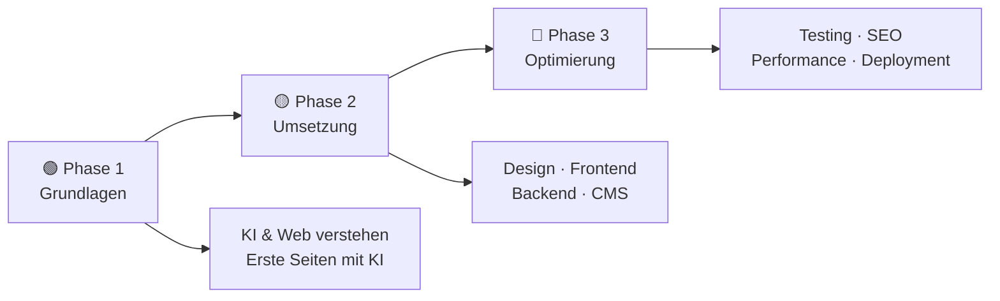
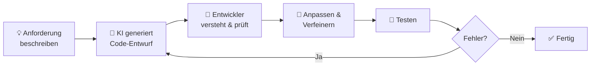
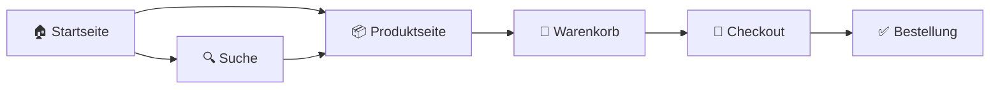
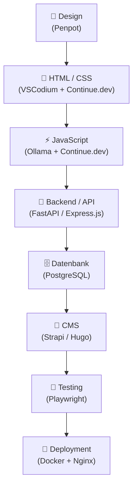
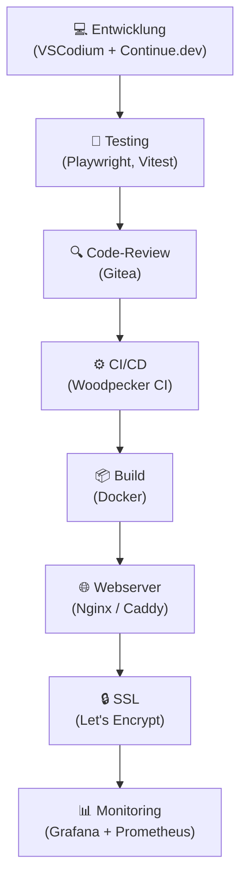
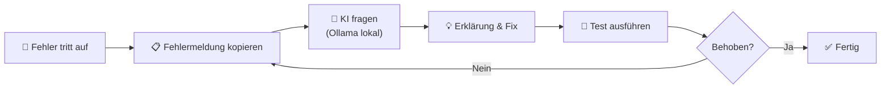
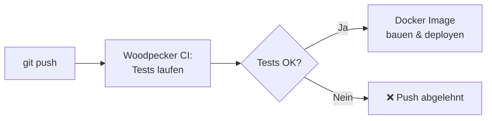
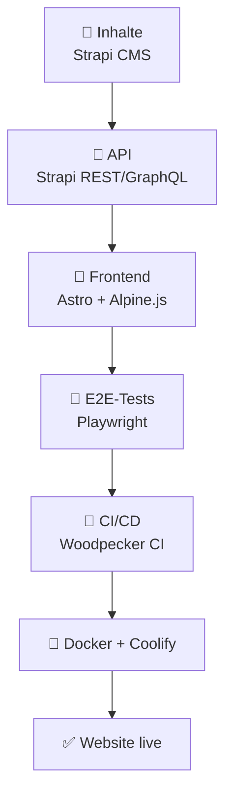
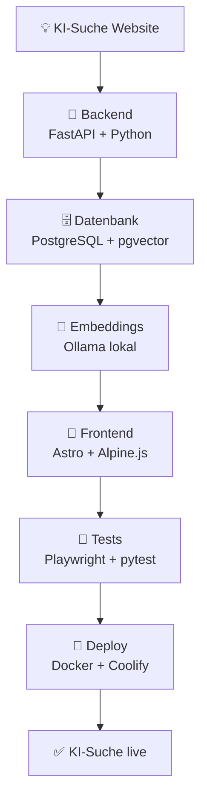

# Websites entwickeln mit KI

> **Hinweis zur Software-Auswahl:**  
> Diese Dokumentation priorisiert **Open-Source-Software**, die unter Ubuntu läuft.  
> Bei kostenpflichtiger Software wird immer eine **Open-Source-Alternative** mit gleichem Funktionsumfang gegenübergestellt.  
> **LLM-Modelle** werden unabhängig vom Preis gelistet – sie sind die Grundlage KI-gestützter Webentwicklung.

---

## Legende

| Symbol | Bedeutung |
|---|---|
| 🟩 | Open Source – kostenlos |
| 💰 | Kostenpflichtig |
| 🤖 | LLM-Modell – bleibt immer gelistet |
| 🐧 | Linux / Ubuntu nativ |
| 🌐 | Nur Web-Browser |

---

## Lernpfad-Übersicht



---

## Inhaltsverzeichnis

- [🟢 Phase 1 – Grundlagen & Konzeption](#phase-1-grundlagen-konzeption)
    - [1.1 Was bedeutet KI-gestützte Webentwicklung?](#11-was-bedeutet-ki-gestutzte-webentwicklung)
    - [1.2 Konzept: KI als Coding-Assistent verstehen](#12-konzept-ki-als-coding-assistent-verstehen)
    - [1.3 Thema: Entwicklungsumgebung mit KI aufsetzen](#13-thema-entwicklungsumgebung-mit-ki-aufsetzen)
    - [1.4 Thema: Website-Konzeption & Wireframing mit KI](#14-thema-website-konzeption-wireframing-mit-ki)
    - [1.5 Thema: UI/UX-Design mit KI](#15-thema-uiux-design-mit-ki)
- [🟡 Phase 2 – Umsetzung](#phase-2-umsetzung)
    - [2.1 Konzept: Der KI-gestützte Entwicklungsworkflow](#21-konzept-der-ki-gestutzte-entwicklungsworkflow)
    - [2.2 Thema: HTML & CSS mit KI generieren](#22-thema-html-css-mit-ki-generieren)
    - [2.3 Thema: JavaScript & Interaktivität mit KI](#23-thema-javascript-interaktivitat-mit-ki)
    - [2.4 Thema: Backend & APIs mit KI entwickeln](#24-thema-backend-apis-mit-ki-entwickeln)
    - [2.5 Thema: CMS & Website-Builder mit KI](#25-thema-cms-website-builder-mit-ki)
    - [2.6 Thema: Datenbanken mit KI-Unterstützung](#26-thema-datenbanken-mit-ki-unterstutzung)
    - [2.7 Thema: Barrierefreiheit (Accessibility) mit KI](#27-thema-barrierefreiheit-accessibility-mit-ki)
- [🔴 Phase 3 – Optimierung & Deployment](#phase-3-optimierung-deployment)
    - [3.1 Konzept: Von der Entwicklung zum produktiven Betrieb](#31-konzept-von-der-entwicklung-zum-produktiven-betrieb)
    - [3.2 Thema: Testing & Debugging mit KI](#32-thema-testing-debugging-mit-ki)
    - [3.3 Thema: Performance-Optimierung mit KI](#33-thema-performance-optimierung-mit-ki)
    - [3.4 Thema: SEO-Optimierung mit KI](#34-thema-seo-optimierung-mit-ki)
    - [3.5 Thema: Deployment & Hosting mit KI-Unterstützung](#35-thema-deployment-hosting-mit-ki-unterstutzung)
    - [3.6 Thema: Sicherheit & Datenschutz mit KI](#36-thema-sicherheit-datenschutz-mit-ki)
- [📋 Praxisprojekte](#praxisprojekte)
- [📦 Vollständige Softwareübersicht & Vergleich](#vollstandige-softwareubersicht-vergleich)

---

## 🟢 Phase 1 – Grundlagen & Konzeption

> **Was lerne ich hier?**  
> Wie KI in der Webentwicklung eingesetzt wird, welche Werkzeuge es gibt und wie man eine Website konzipiert und designed – mit KI als Assistent.  
> **Voraussetzungen:** Grundlegendes Verständnis von Websites (kein Code nötig).

---

### 1.1 Was bedeutet KI-gestützte Webentwicklung?

#### Konzept: Drei Rollen von KI in der Webentwicklung

| Rolle | Was KI tut | Beispiel |
|---|---|---|
| **Code generieren** | Schreibt HTML, CSS, JavaScript aus Beschreibungen | „Erstelle ein responsives Navigationsmenü" |
| **Code erklären** | Erklärt unbekannten Code verständlich | „Was macht diese JavaScript-Funktion?" |
| **Code optimieren** | Verbessert, refaktoriert und debuggt Code | „Mach diesen Code schneller und lesbarer" |

#### Konzept: Was KI in der Webentwicklung (noch) nicht kann

- Komplexe **Architekturentscheidungen** eigenständig treffen
- **Sicherheitslücken** vollständig erkennen und schließen
- **Nutzerbedürfnisse** aus eigener Erfahrung verstehen
- **Designgeschmack** und ästhetisches Urteilsvermögen entwickeln

#### Konzept: KI-Typen in der Webentwicklung

| KI-Typ | Anwendung | Beispiel-Tool |
|---|---|---|
| **Code-Completion** | Satz-für-Satz-Vervollständigung beim Tippen | Continue.dev + Ollama |
| **Chat-basierte Assistenz** | Dialog: Frage → Code → Erklärung | ChatGPT, Claude |
| **Automatisierte Analyse** | Lighthouse analysiert Performance automatisch | Lighthouse |
| **Generative KI** | Komplette Seiten aus Beschreibungen | Aider + Ollama |

#### Einstiegs-Software (LLM – immer gelistet):

| Software | Typ | Funktion | Ubuntu | Link |
|---|---|---|---|---|
| 🟩 🤖 [Ollama](https://ollama.com) | LLM lokal | CodeLlama, DeepSeek Coder lokal ausführen | 🐧 Ja | ollama.com |
| 🟩 🤖 [LM Studio](https://lmstudio.ai) | LLM lokal | Grafische Oberfläche für lokale Code-LLMs | 🐧 Ja | lmstudio.ai |
| 🟩 🤖 [Continue.dev](https://continue.dev) | KI-IDE-Plugin | Open-Source Copilot-Alternative für VS Code | 🐧 Ja | continue.dev |
| 🤖 [ChatGPT](https://chat.openai.com) | LLM Cloud | Code generieren, erklären, debuggen | 🌐 Web | openai.com |
| 🤖 [Claude](https://claude.ai) | LLM Cloud | Großes Kontextfenster für komplexe Codebasen | 🌐 Web | claude.ai |
| 🤖 [Gemini](https://gemini.google.com) | LLM Cloud | Google-Integration, Multimodal | 🌐 Web | gemini.google.com |

---

### 1.2 Konzept: KI als Coding-Assistent verstehen

#### Konzept: Wie ein KI-Code-Assistent arbeitet

KI-Code-Assistenten sind auf **Milliarden von Code-Zeilen** aus öffentlichen Repositories trainiert. Sie erzeugen **statistisch wahrscheinlichen** Code – nicht unbedingt korrekten oder sicheren Code.

```
Wichtige Regel: KI-generierten Code immer verstehen,
bevor man ihn einsetzt – nie blind copy-pasten!
```

#### Konzept: Prompt-Engineering für Code

| Prompt-Element | Beispiel | Wirkung |
|---|---|---|
| **Technologie nennen** | „In vanilla HTML und CSS ohne Framework..." | Vermeidet unerwünschte Dependencies |
| **Kontext geben** | „Das ist Teil einer E-Commerce-Seite..." | Passenderer Code |
| **Einschränkungen setzen** | „Ohne externe Bibliotheken, nur ES6+" | Kontrollierter Output |
| **Ausgabe-Format** | „Gib nur den CSS-Teil aus, kommentiert" | Fokussierter Code |
| **Fehler beschreiben** | „Folgender Fehler tritt auf: [Fehlermeldung]" | Gezieltes Debugging |

#### Konzept: Der KI-Entwicklungszyklus



#### Konzept: Lokale LLMs vs. Cloud-LLMs für Code

| Kriterium | Lokal (Ollama + DeepSeek) 🟩 | Cloud (ChatGPT, Copilot) 🤖 |
|---|---|---|
| Datenschutz | ✅ Code verlässt nie den Rechner | ❌ Code geht in Cloud |
| Kosten | ✅ Kostenlos | 💰 Ab 10–20$/Monat |
| Codequalität | 🟡 Sehr gut (DeepSeek Coder V3) | ✅ Ausgezeichnet |
| Kontextfenster | 🟡 Begrenzt (je nach Modell) | ✅ Sehr groß (Claude: 200K) |
| Offline-Nutzung | ✅ Vollständig offline | ❌ Internetverbindung nötig |

---

### 1.3 Thema: Entwicklungsumgebung mit KI aufsetzen

#### Konzept: Was ist eine IDE und warum ist die Wahl wichtig?

Eine **IDE (Integrated Development Environment)** ist der Arbeitsplatz des Entwicklers – Editor, Terminal, Debugger und KI-Assistent in einem.

#### Konzept: KI-Plugins vs. KI-native Editoren

| Ansatz | Beschreibung | Beispiel |
|---|---|---|
| **KI-Plugin in Editor** | Standard-Editor + KI-Erweiterung | VSCodium + Continue.dev |
| **KI-nativer Editor** | Editor mit eingebauter KI | Cursor, Windsurf |
| **Terminal + LLM** | CLI-basierte KI-Assistenz | Aider + Ollama |

#### Software – Open Source zuerst:

| Software | Typ | Funktion | Ubuntu | Link |
|---|---|---|---|---|
| 🟩 [VSCodium](https://vscodium.com) | Editor | Open-Source VS Code ohne Microsoft-Telemetrie | 🐧 Ja | vscodium.com |
| 🟩 [Continue.dev](https://continue.dev) | KI-Plugin | Open-Source KI-Assistent für VSCodium/VS Code | 🐧 Ja | continue.dev |
| 🟩 [Aider](https://aider.chat) | KI-CLI | Terminal-basierter KI-Code-Assistent | 🐧 Ja | aider.chat |
| 🟩 [Neovim + LLM-Plugins](https://neovim.io) | Editor | Vim-basierter Editor mit KI-Plugins | 🐧 Ja | neovim.io |
| 🟩 [Ollama](https://ollama.com) | LLM-Backend | Lokaler LLM-Server für alle KI-Plugins | 🐧 Ja | ollama.com |
| 🟩 [Git](https://git-scm.com) | Versionierung | Versionskontrolle (Basis jedes Projekts) | 🐧 Ja | git-scm.com |
| 🟩 [Gitea](https://gitea.io/de-de/) | Git-Server | Self-hosted GitHub-Alternative | 🐧 Ja | gitea.io |

#### Vergleich: Open Source vs. Kommerziell

| Funktion | Open Source 🟩 (Ubuntu) | Kommerziell 💰 |
|---|---|---|
| Code-Editor | VSCodium + Continue.dev | VS Code + GitHub Copilot, Cursor |
| KI-Code-Assistent | Continue.dev + Ollama/DeepSeek | GitHub Copilot, Tabnine, Codeium |
| Terminal-KI | Aider + Ollama | Cursor Terminal, Warp |
| Git-Hosting | Gitea (self-hosted) | GitHub, GitLab |

---

### 1.4 Thema: Website-Konzeption & Wireframing mit KI

#### Konzept: Was ist ein Wireframe?

Ein **Wireframe** ist eine schematische Skizze einer Webseite – ohne Farben oder finales Design. Es zeigt nur: Wo ist was?

```
Idee → Wireframe (Struktur) → Mockup (Design) → Prototyp (Interaktion) → Code
```

#### Konzept: Informationsarchitektur mit KI planen

**Informationsarchitektur (IA)** definiert, wie Inhalte einer Website strukturiert werden. KI kann:
- Sitemaps aus Zielgruppen-Beschreibungen generieren
- Nutzerflüsse (User Flows) vorschlagen
- Navigationsstrukturen auf Usability prüfen

#### Konzept: User Flows & KI



#### Software – Open Source zuerst:

| Software | Typ | Funktion | Ubuntu | Link |
|---|---|---|---|---|
| 🟩 [Penpot](https://penpot.app) | Design/Wireframe | Open-Source Figma-Alternative, self-hosted | 🐧 Ja | penpot.app |
| 🟩 [Excalidraw](https://excalidraw.com) | Wireframe | Open-Source Skizzen-Tool, self-hostable | 🐧 Ja | excalidraw.com |
| 🟩 [draw.io / diagrams.net](https://www.diagrams.net) | Diagramme | Sitemaps, Flows, Wireframes | 🐧 Ja | diagrams.net |
| 🟩 [Inkscape](https://inkscape.org/de/) | Vektorgrafik | Statische Wireframes als SVG | 🐧 Ja | inkscape.org |
| 🟩 🤖 [Ollama](https://ollama.com) | LLM | Sitemap & IA aus Beschreibungen generieren | 🐧 Ja | ollama.com |

#### Vergleich: Open Source vs. Kommerziell

| Funktion | Open Source 🟩 | Kommerziell 💰 |
|---|---|---|
| Wireframing & Design | Penpot (self-hosted), Excalidraw | Figma, Sketch, Adobe XD |
| Sitemap-Erstellung | draw.io + Ollama-Prompt | Slickplan, Lucidchart |
| User-Flow-Diagramme | draw.io | Miro, FigJam |
| Prototyping | Penpot | Figma, InVision |

---

### 1.5 Thema: UI/UX-Design mit KI

#### Konzept: Was ist der Unterschied zwischen UI und UX?

| Begriff | Definition | KI hilft mit |
|---|---|---|
| **UI (User Interface)** | Wie die Website aussieht | Farbpaletten, Layouts generieren |
| **UX (User Experience)** | Wie sich die Nutzung anfühlt | Usability-Probleme erkennen |

#### Konzept: Design Tokens – KI-freundliches Design-System

**Design Tokens** sind Variablen für Farben, Abstände, Schriftgrößen als CSS Custom Properties. KI kann sie aus einem Briefing generieren:

```css
:root {
  --color-primary: #2563eb;
  --font-heading: 'Inter', sans-serif;
  --spacing-md: 1.5rem;
  --border-radius: 0.5rem;
}
```

#### Konzept: Wichtige Begriffe für KI-Design-Prompts

| Begriff | Bedeutung | Prompt-Beispiel |
|---|---|---|
| **WCAG-Kontrast** | Mindestkontrast für Barrierefreiheit | „Kontrastverhältnis min. 4,5:1" |
| **Typografische Hierarchie** | Visuelle Gewichtung der Textelemente | „H1 > H2 > Body, klar abgestuft" |
| **Whitespace** | Bewusst eingesetzter Leerraum | „Großzügige Abstände, luftiges Layout" |
| **Responsive Grid** | Flexibles Rastersystem | „12-Spalten-Grid, mobil-first" |

#### Software – Open Source zuerst:

| Software | Typ | Funktion | Ubuntu | Link |
|---|---|---|---|---|
| 🟩 [Penpot](https://penpot.app) | Design | Open-Source UI-Design & Prototyping | 🐧 Ja | penpot.app |
| 🟩 [GIMP](https://www.gimp.org) | Bildbearbeitung | Assets erstellen & anpassen | 🐧 Ja | gimp.org |
| 🟩 [Inkscape](https://inkscape.org/de/) | Vektorgrafik | Icons, Logos, SVG-Grafiken | 🐧 Ja | inkscape.org |
| 🟩 [ComfyUI + Flux](https://github.com/comfyanonymous/ComfyUI) | Bild-KI | Hero-Images lokal generieren | 🐧 Ja | github.com/comfyanonymous |
| 🟩 [fontsource](https://fontsource.org) | Typografie | Self-hosted Google Fonts | 🐧 Ja | fontsource.org |

#### Vergleich: Open Source vs. Kommerziell

| Funktion | Open Source 🟩 | Kommerziell 💰 |
|---|---|---|
| UI-Design-Tool | Penpot | Figma, Adobe XD, Sketch |
| Icon-Sets | Lucide, Heroicons (open source) | FontAwesome Pro |
| KI-Bildgenerierung | ComfyUI + Flux | Midjourney, Adobe Firefly |
| Design-Systeme | Penpot Design Tokens | Figma Variables |

---

## 🟡 Phase 2 – Umsetzung

> **Was lerne ich hier?**  
> Den gesamten Entwicklungs-Stack mit KI umsetzen – von HTML/CSS bis Backend und CMS.  
> **Voraussetzungen:** Phase 1 abgeschlossen. Erste HTML-/CSS-Kenntnisse hilfreich.

---

### 2.1 Konzept: Der KI-gestützte Entwicklungsworkflow

#### Der vollständige KI-Webentwicklungs-Stack



#### Konzept: Vibe Coding – was steckt dahinter?

**Vibe Coding** bezeichnet das Entwickeln durch natürlichsprachliche Beschreibungen – ohne selbst Code zu schreiben:

- ✅ Sehr nützlich für **Prototypen und MVPs**
- ✅ Senkt die **Einstiegshürde** für Nicht-Entwickler
- ❌ Erzeugt oft **technische Schulden** (schwer wartbarer Code)
- ❌ **Sicherheitslücken** bleiben unbemerkt ohne Code-Verständnis

---

### 2.2 Thema: HTML & CSS mit KI generieren

#### Konzept: Semantisches HTML – warum es für KI-Code wichtig ist

**Semantisches HTML** verwendet bedeutungsvolle Tags – nicht nur `<div>`. KI tendiert ohne explizite Anweisung zu unsemantischem Code:

```html
<!-- ❌ Nicht semantisch (häufiger KI-Output ohne Anweisung) -->
<div class="header"><div class="nav">...</div></div>

<!-- ✅ Semantisch (mit explizitem Prompt-Hinweis) -->
<header><nav aria-label="Hauptnavigation">...</nav></header>
```

#### Konzept: CSS-Methodologien für KI-generierten Code

| Methodik | Beschreibung | Prompt-Hinweis |
|---|---|---|
| **BEM** | Block-Element-Modifier Namensgebung | „Nutze BEM-Konventionen" |
| **Utility-First** | Kleine Hilfsklassen (Tailwind-Stil) | „Tailwind-CSS-Klassen" |
| **CSS Custom Properties** | Variablen für Designsystem | „Design Tokens als CSS-Variablen" |
| **CSS Grid + Flexbox** | Moderne Layout-Systeme | „Nur CSS Grid und Flexbox, kein Float" |

#### Software – Open Source zuerst:

| Software | Typ | Funktion | Ubuntu | Link |
|---|---|---|---|---|
| 🟩 [VSCodium + Continue.dev](https://vscodium.com) | Editor + KI | HTML/CSS mit KI-Assistent schreiben | 🐧 Ja | vscodium.com |
| 🟩 [Ollama + DeepSeek Coder](https://ollama.com) | LLM | HTML/CSS lokal generieren | 🐧 Ja | ollama.com |
| 🟩 [Stylelint](https://stylelint.io) | Linter | CSS-Qualität prüfen | 🐧 Ja | stylelint.io |
| 🟩 [Prettier](https://prettier.io) | Formatter | Code-Formatierung automatisch | 🐧 Ja | prettier.io |
| 🟩 [PostCSS](https://postcss.org) | CSS-Tool | CSS transformieren & optimieren | 🐧 Ja | postcss.org |

#### Vergleich: Open Source vs. Kommerziell

| Funktion | Open Source 🟩 (Ubuntu) | Kommerziell 💰 |
|---|---|---|
| KI-HTML/CSS-Generierung | Continue.dev + Ollama | GitHub Copilot, Cursor |
| CSS-Framework | Tailwind CSS, Bootstrap (beide OS) | — |
| No-Code Builder | — | Webflow, Framer |
| Vollständige Seiten aus Prompt | Aider + Ollama | v0.dev (Vercel) |

---

### 2.3 Thema: JavaScript & Interaktivität mit KI

#### Konzept: Vanilla JS vs. Frameworks

KI empfiehlt oft Frameworks – auch wenn sie nicht nötig sind:

| Ansatz | Wann sinnvoll | KI-Prompt-Tipp |
|---|---|---|
| **Vanilla JS** | Einfache Interaktionen | „Nur reines JavaScript, kein Framework" |
| **Alpine.js** | Leichte Reaktivität | „Alpine.js für einfache Reaktivität" |
| **Vue.js** | Mittlere Komplexität | „Vue 3 Composition API" |
| **React** | Komplexe SPAs | „React mit TypeScript, Hooks" |

#### Konzept: TypeScript – warum KI-Code davon profitiert

**TypeScript** fügt JavaScript Typen hinzu – KI-generierter Code ist damit selbstdokumentierender und weniger fehleranfällig.

#### Software – Open Source zuerst:

| Software | Typ | Funktion | Ubuntu | Link |
|---|---|---|---|---|
| 🟩 [Node.js](https://nodejs.org/de) | Runtime | JavaScript serverseitig ausführen | 🐧 Ja | nodejs.org |
| 🟩 [Deno](https://deno.land) | Runtime | Sichere JS/TS-Runtime | 🐧 Ja | deno.land |
| 🟩 [Bun](https://bun.sh) | Runtime | Sehr schnelle JS-Runtime | 🐧 Ja | bun.sh |
| 🟩 [ESLint](https://eslint.org) | Linter | JS/TS-Qualität prüfen | 🐧 Ja | eslint.org |
| 🟩 [Vite](https://vitejs.dev) | Build Tool | Schneller Dev-Server & Build | 🐧 Ja | vitejs.dev |
| 🟩 [Alpine.js](https://alpinejs.dev) | Framework | Leichtes Reaktivitäts-Framework | 🐧 Ja | alpinejs.dev |

#### Vergleich: Open Source vs. Kommerziell

| Funktion | Open Source 🟩 | Kommerziell 💰 |
|---|---|---|
| JS-KI-Assistent | Continue.dev + Ollama (lokal) | GitHub Copilot, Cursor |
| Build-Tool | Vite, esbuild, Rollup | — |
| Frameworks | React, Vue, Svelte, Alpine.js | — |

---

### 2.4 Thema: Backend & APIs mit KI entwickeln

#### Konzept: Wann brauche ich ein Backend?

| Website-Typ | Backend nötig? | Empfehlung |
|---|---|---|
| Portfolio / Visitenkarte | ❌ Nein | Hugo, Astro (statisch) |
| Blog | 🟡 Optional | Ghost oder Hugo |
| E-Commerce | ✅ Ja | WooCommerce oder Strapi |
| Web-App | ✅ Ja | FastAPI oder Express.js |

#### Konzept: KI-generierter Backend-Code – Sicherheits-Checkliste

KI vergisst häufig kritische Sicherheitsaspekte:

- ✅ **Input-Validierung** – Alle Nutzereingaben prüfen
- ✅ **SQL-Injection-Schutz** – Prepared Statements verwenden
- ✅ **CORS** – Korrekt konfigurieren
- ✅ **Rate Limiting** – Brute-Force-Schutz aktivieren
- ✅ **Authentifizierung** – JWT oder Session korrekt implementieren

#### Software – Open Source zuerst:

| Software | Typ | Funktion | Ubuntu | Link |
|---|---|---|---|---|
| 🟩 [FastAPI](https://fastapi.tiangolo.com) | Framework | Python-API-Framework | 🐧 Ja | fastapi.tiangolo.com |
| 🟩 [Express.js](https://expressjs.com/de/) | Framework | Node.js-Web-Framework | 🐧 Ja | expressjs.com |
| 🟩 [Hono](https://hono.dev) | Framework | Ultraschnelles Web-Framework (TS) | 🐧 Ja | hono.dev |
| 🟩 [Strapi](https://strapi.io) | Headless CMS | Open-Source Headless CMS mit API | 🐧 Ja | strapi.io |
| 🟩 [Directus](https://directus.io) | Headless CMS | Self-hosted Data Platform | 🐧 Ja | directus.io |
| 🟩 [Bruno](https://www.usebruno.com) | API-Client | Open-Source Postman-Alternative | 🐧 Ja | usebruno.com |

#### Vergleich: Open Source vs. Kommerziell

| Funktion | Open Source 🟩 (Ubuntu) | Kommerziell 💰 |
|---|---|---|
| Backend-Framework | FastAPI, Express.js, Hono | — |
| Headless CMS | Strapi, Directus, Ghost | Contentful, Sanity |
| Backend-as-a-Service | Supabase (self-hosted), PocketBase | Firebase, Supabase Cloud |
| API-Testing | Bruno, Insomnia (Open) | Postman |

---

### 2.5 Thema: CMS & Website-Builder mit KI

#### Konzept: CMS-Typen im Überblick

| CMS-Typ | Beschreibung | Open-Source-Beispiel |
|---|---|---|
| **Traditionelles CMS** | Frontend und Backend gekoppelt | WordPress, Joomla |
| **Headless CMS** | Nur Backend/API | Strapi, Directus |
| **Statischer Generator** | Baut HTML aus Markdown | Hugo, Eleventy, Astro |
| **No-Code-Builder** | Visuelles Drag-and-Drop | meist kommerziell |

#### Konzept: Statische Websites – unterschätzte KI-Anwendung

```bash
# Hugo + KI-Workflow
ollama run llama3 "Schreibe einen Blogartikel über..." > content/posts/artikel.md
hugo build  # Statische Seite wird generiert
```

#### Software – Open Source zuerst:

| Software | Typ | Funktion | Ubuntu | Link |
|---|---|---|---|---|
| 🟩 [Hugo](https://gohugo.io) | Static Generator | Schnellster statischer Website-Generator | 🐧 Ja | gohugo.io |
| 🟩 [Astro](https://astro.build) | Static Generator | Moderner Multi-Framework-Generator | 🐧 Ja | astro.build |
| 🟩 [Eleventy (11ty)](https://www.11ty.dev) | Static Generator | Flexibler statischer Generator | 🐧 Ja | 11ty.dev |
| 🟩 [WordPress (self-hosted)](https://de.wordpress.org) | CMS | Meistgenutztes CMS weltweit | 🐧 Ja | wordpress.org |
| 🟩 [Ghost (self-hosted)](https://ghost.org) | CMS | Open-Source Blog & Newsletter CMS | 🐧 Ja | ghost.org |
| 🟩 [Strapi](https://strapi.io) | Headless CMS | Open-Source API-first CMS | 🐧 Ja | strapi.io |

#### Vergleich: Open Source vs. Kommerziell

| Funktion | Open Source 🟩 (Ubuntu) | Kommerziell 💰 |
|---|---|---|
| Blog/CMS | WordPress (self-hosted), Ghost | WordPress.com, Squarespace |
| Headless CMS | Strapi, Directus | Contentful, Sanity, Prismic |
| Static Generator | Hugo, Astro, Eleventy | — |
| No-Code Builder | Penpot + Astro | Webflow, Framer |
| E-Commerce | WooCommerce (WordPress OS) | Shopify |

---

### 2.6 Thema: Datenbanken mit KI-Unterstützung

#### Konzept: Welche Datenbank für welchen Anwendungsfall?

| Datenbanktyp | Wann nutzen | Open-Source-Tool |
|---|---|---|
| **Relational (SQL)** | Strukturierte Daten, Beziehungen | PostgreSQL, SQLite |
| **Dokument (NoSQL)** | Flexible Strukturen, JSON | CouchDB |
| **Key-Value** | Caching, Sessions | Valkey (Redis OS-Fork) |
| **Vektor-DB** | KI-Embeddings, Semantic Search | pgvector, Chroma |

#### Konzept: KI generiert SQL – aber Vorsicht!

```sql
-- ❌ KI-generiert ohne Sicherheitshinweis (SQL-Injection-Risiko)
SELECT * FROM users WHERE name = '" + userInput + "'";

-- ✅ Korrekt: Prepared Statement
SELECT * FROM users WHERE name = $1  -- PostgreSQL
```

#### Software – Open Source zuerst:

| Software | Typ | Funktion | Ubuntu | Link |
|---|---|---|---|---|
| 🟩 [PostgreSQL](https://www.postgresql.org) | SQL-DB | Leistungsfähigste Open-Source-Datenbank | 🐧 Ja | postgresql.org |
| 🟩 [SQLite](https://sqlite.org) | SQL-DB | Dateibasierte Datenbank | 🐧 Ja | sqlite.org |
| 🟩 [MariaDB](https://mariadb.org) | SQL-DB | Open-Source MySQL-Alternative | 🐧 Ja | mariadb.org |
| 🟩 [pgvector](https://github.com/pgvector/pgvector) | Vektor-DB | KI-Embeddings in PostgreSQL | 🐧 Ja | github.com/pgvector |
| 🟩 [Chroma](https://www.trychroma.com) | Vektor-DB | Open-Source Vektor-Datenbank | 🐧 Ja | trychroma.com |
| 🟩 [DBeaver](https://dbeaver.io) | DB-Client | Universal-Datenbank-GUI | 🐧 Ja | dbeaver.io |

#### Vergleich: Open Source vs. Kommerziell

| Funktion | Open Source 🟩 (Ubuntu) | Kommerziell 💰 |
|---|---|---|
| SQL-Datenbank | PostgreSQL, MariaDB, SQLite | Oracle DB, MS SQL Server |
| Vektor-Datenbank | pgvector, Chroma, Weaviate | Pinecone, Qdrant Cloud |
| DB-GUI | DBeaver, Adminer | DataGrip, TablePlus |

---

### 2.7 Thema: Barrierefreiheit (Accessibility) mit KI

#### Konzept: WCAG-Richtlinien – die vier Prinzipien

| Prinzip | Bedeutung | KI-Unterstützung |
|---|---|---|
| **Wahrnehmbar** | Inhalte für alle Sinne | Alt-Texte, Kontrast prüfen lassen |
| **Bedienbar** | Nur mit Tastatur nutzbar | Tab-Reihenfolge per Prompt prüfen |
| **Verständlich** | Klare Sprache | Formulare & Fehlertexte mit KI verbessern |
| **Robust** | Kompatibel mit Hilfstechnologien | ARIA-Attribute im Prompt einfordern |

#### Konzept: Was KI-Code typisch vergisst

- `alt`-Attribute bei Bildern
- `aria-label` bei Icon-Buttons
- Ausreichende Farbkontraste (WCAG 4,5:1)
- `label`-Verknüpfungen bei Formularen
- Focus-Styles für Tastaturnavigation

**Lösung:** Im Prompt immer „WCAG 2.1 AA konform" als Anforderung nennen!

#### Software – Open Source zuerst:

| Software | Typ | Funktion | Ubuntu | Link |
|---|---|---|---|---|
| 🟩 [axe-core](https://github.com/dequelabs/axe-core) | A11y-Test | Open-Source Accessibility-Testing-Engine | 🐧 Ja | github.com/dequelabs |
| 🟩 [Pa11y](https://pa11y.org) | A11y-CLI | Automatisierte A11y-Tests per CLI | 🐧 Ja | pa11y.org |
| 🟩 [Lighthouse](https://developer.chrome.com/docs/lighthouse/) | Audit | Accessibility-Audit in Chrome DevTools | 🐧 Ja | developer.chrome.com |
| 🟩 [Orca](https://wiki.gnome.org/Projects/Orca) | Screenreader | Linux Screenreader (GNOME) | 🐧 Ja | wiki.gnome.org |

#### Vergleich: Open Source vs. Kommerziell

| Funktion | Open Source 🟩 | Kommerziell 💰 |
|---|---|---|
| A11y-Testing | axe-core, Pa11y, Lighthouse | Deque axe Pro, Siteimprove |
| Screenreader-Test | Orca (Linux) | JAWS |

---

## 🔴 Phase 3 – Optimierung & Deployment

> **Was lerne ich hier?**  
> Websites testen, optimieren und produktiv betreiben – mit KI als Analyse-Assistent.  
> **Voraussetzungen:** Phase 1 & 2 abgeschlossen.

---

### 3.1 Konzept: Von der Entwicklung zum produktiven Betrieb

#### Der Web-Produktions-Stack (vollständig Open Source)



---

### 3.2 Thema: Testing & Debugging mit KI

#### Konzept: Test-Typen im Überblick

| Test-Typ | Was wird getestet | Open-Source-Tool |
|---|---|---|
| **Unit-Test** | Einzelne Funktionen | Vitest, pytest |
| **Integrations-Test** | Zusammenspiel von Komponenten | Jest, pytest |
| **E2E-Test** | Kompletter Nutzerfluss | Playwright, Cypress |
| **A11y-Test** | Barrierefreiheit | axe-core, Pa11y |
| **Performance-Test** | Ladezeiten | Lighthouse, k6 |

#### Konzept: KI-Debugging-Workflow



#### Software – Open Source zuerst:

| Software | Typ | Funktion | Ubuntu | Link |
|---|---|---|---|---|
| 🟩 [Playwright](https://playwright.dev) | E2E-Testing | Browser-Automatisierung & E2E-Tests | 🐧 Ja | playwright.dev |
| 🟩 [Cypress](https://www.cypress.io) | E2E-Testing | Interaktive E2E-Tests | 🐧 Ja | cypress.io |
| 🟩 [Vitest](https://vitest.dev) | Unit-Testing | Schnelles Unit-Testing | 🐧 Ja | vitest.dev |
| 🟩 [pytest](https://pytest.org) | Unit-Testing | Python-Testing | 🐧 Ja | pytest.org |
| 🟩 [k6](https://k6.io) | Last-Test | Performance-/Last-Testing | 🐧 Ja | k6.io |
| 🟩 🤖 [Ollama](https://ollama.com) | LLM | Fehlermeldungen lokal erklären | 🐧 Ja | ollama.com |

#### Vergleich: Open Source vs. Kommerziell

| Funktion | Open Source 🟩 (Ubuntu) | Kommerziell 💰 |
|---|---|---|
| E2E-Testing | Playwright, Cypress | TestComplete, Mabl |
| KI-Debugging | Ollama + Continue.dev | GitHub Copilot Chat, Cursor |
| Last-Test | k6, Gatling | Loader.io |

---

### 3.3 Thema: Performance-Optimierung mit KI

#### Konzept: Core Web Vitals

| Metrik | Was es misst | Guter Wert |
|---|---|---|
| **LCP** (Largest Contentful Paint) | Ladezeit des größten Inhalts | < 2,5 Sek. |
| **INP** (Interaction to Next Paint) | Reaktionszeit auf Klicks | < 200 ms |
| **CLS** (Cumulative Layout Shift) | Visuelle Stabilität | < 0,1 |

#### Konzept: KI-gestützte Lighthouse-Analyse

```
Prompt: "Hier ist mein Lighthouse-Bericht: [Bericht].
         Erkläre die drei wichtigsten Probleme und wie ich sie löse."
```

#### Konzept: Wichtige Performance-Techniken

| Technik | Was es bewirkt | Tool |
|---|---|---|
| **Lazy Loading** | Bilder erst laden wenn sichtbar | `loading="lazy"` (nativ) |
| **Image-Optimierung** | WebP statt PNG/JPEG | Squoosh, Sharp |
| **Code-Splitting** | JS in kleine Chunks | Vite, Rollup |
| **Caching** | Browser- & Server-Cache | Nginx-Konfiguration |

#### Software – Open Source zuerst:

| Software | Typ | Funktion | Ubuntu | Link |
|---|---|---|---|---|
| 🟩 [Lighthouse](https://developer.chrome.com/docs/lighthouse/) | Audit | Performance, SEO, A11y Audit | 🐧 Ja | developer.chrome.com |
| 🟩 [WebPageTest (self-hosted)](https://github.com/WPO-Foundation/webpagetest) | Performance | Detaillierte Ladezeit-Analyse | 🐧 Ja | github.com/WPO-Foundation |
| 🟩 [Squoosh](https://github.com/GoogleChromeLabs/squoosh) | Bilder | Bildoptimierung | 🐧 Ja | github.com/GoogleChromeLabs |
| 🟩 [Sharp](https://sharp.pixelplumbing.com) | Bilder | Node.js-Bildverarbeitung | 🐧 Ja | sharp.pixelplumbing.com |
| 🟩 [Nginx](https://nginx.org/de/) | Webserver | Hochperformanter Webserver | 🐧 Ja | nginx.org |
| 🟩 [Caddy](https://caddyserver.com) | Webserver | Auto-HTTPS, einfache Konfiguration | 🐧 Ja | caddyserver.com |

#### Vergleich: Open Source vs. Kommerziell

| Funktion | Open Source 🟩 (Ubuntu) | Kommerziell 💰 |
|---|---|---|
| Performance-Audit | Lighthouse, WebPageTest | SpeedCurve, Calibre |
| Bildoptimierung | Squoosh, Sharp, ImageMagick | Cloudinary, Imgix |
| CDN | Nginx + Proxy / Varnish | Cloudflare, Fastly |

---

### 3.4 Thema: SEO-Optimierung mit KI

#### Konzept: Technisches SEO vs. Content-SEO

| SEO-Bereich | Was es ist | KI-Tool |
|---|---|---|
| **Technisches SEO** | Crawlbarkeit, Ladezeit, Struktur | Lighthouse, Screaming Frog |
| **On-Page-SEO** | Keywords, Meta-Tags, Überschriften | Ollama + Prompt |
| **Content-SEO** | Inhaltliche Relevanz | Google Search Console |

#### Konzept: Structured Data (Schema.org) mit KI

```json
// Prompt: "Erstelle JSON-LD für einen Blogartikel"
{
  "@context": "https://schema.org",
  "@type": "Article",
  "headline": "Websites entwickeln mit KI",
  "datePublished": "2026-07-15"
}
```

#### Software – Open Source zuerst:

| Software | Typ | Funktion | Ubuntu | Link |
|---|---|---|---|---|
| 🟩 [Google Search Console](https://search.google.com/search-console) | SEO | Kostenlose Keyword-Analyse | 🌐 Web | search.google.com |
| 🟩 [Screaming Frog (Free)](https://www.screamingfrog.co.uk/seo-spider/) | SEO-Crawler | Crawling bis 500 URLs | 🐧 Ja | screamingfrog.co.uk |
| 🟩 [Lighthouse](https://developer.chrome.com/docs/lighthouse/) | SEO-Audit | SEO-Score & Verbesserungen | 🐧 Ja | developer.chrome.com |
| 🟩 🤖 [Ollama](https://ollama.com) | LLM | Meta-Tags, Schema.org generieren | 🐧 Ja | ollama.com |

#### Vergleich: Open Source vs. Kommerziell

| Funktion | Open Source / Kostenlos 🟩 | Kommerziell 💰 |
|---|---|---|
| Keyword-Analyse | Google Search Console | SEMrush, Ahrefs |
| Website-Crawling | Screaming Frog Free | Screaming Frog Pro |
| On-Page-Optimierung | Lighthouse + Ollama | Surfer SEO, NeuronWriter |

---

### 3.5 Thema: Deployment & Hosting mit KI-Unterstützung

#### Konzept: Hosting-Optionen

| Option | Kontrolle | Aufwand | Open-Source-Weg |
|---|---|---|---|
| **Shared Hosting** | Gering | Gering | WordPress bei Anbieter |
| **VPS / Root-Server** | Hoch | Mittel | Nginx + Docker selbst |
| **Self-hosted PaaS** | Sehr hoch | Mittel | Coolify, Caprover |

#### Konzept: KI generiert Docker & CI/CD-Konfigurationen

```yaml
# Prompt: "Erstelle ein Dockerfile für FastAPI + PostgreSQL"
FROM python:3.12-slim
WORKDIR /app
COPY requirements.txt .
RUN pip install -r requirements.txt
COPY . .
CMD ["uvicorn", "main:app", "--host", "0.0.0.0"]
```

#### Konzept: CI/CD – automatisiert deployen



#### Software – Open Source zuerst:

| Software | Typ | Funktion | Ubuntu | Link |
|---|---|---|---|---|
| 🟩 [Docker](https://www.docker.com) | Container | Anwendungen containerisieren | 🐧 Ja | docker.com |
| 🟩 [Podman](https://podman.io) | Container | Rootless Docker-Alternative | 🐧 Ja | podman.io |
| 🟩 [Nginx](https://nginx.org/de/) | Webserver | Reverse Proxy, SSL, Hosting | 🐧 Ja | nginx.org |
| 🟩 [Caddy](https://caddyserver.com) | Webserver | Auto-HTTPS via Let's Encrypt | 🐧 Ja | caddyserver.com |
| 🟩 [Coolify](https://coolify.io) | Self-hosted PaaS | Open-Source Heroku/Vercel-Alternative | 🐧 Ja | coolify.io |
| 🟩 [Caprover](https://caprover.com) | Self-hosted PaaS | Docker-basierte App-Plattform | 🐧 Ja | caprover.com |
| 🟩 [Woodpecker CI](https://woodpecker-ci.org) | CI/CD | Leichtes Open-Source CI/CD | 🐧 Ja | woodpecker-ci.org |
| 🟩 [Gitea Actions](https://gitea.io/de-de/) | CI/CD | Self-hosted GitHub Actions | 🐧 Ja | gitea.io |

#### Vergleich: Open Source vs. Kommerziell

| Funktion | Open Source 🟩 (Ubuntu) | Kommerziell 💰 |
|---|---|---|
| Container | Docker, Podman | — |
| Self-hosted PaaS | Coolify, Caprover | Heroku, Railway, Render |
| Managed Hosting | — | Vercel, Netlify |
| Webserver | Nginx, Caddy, Apache | — |
| CI/CD | Woodpecker CI, Gitea Actions | GitHub Actions, CircleCI |

---

### 3.6 Thema: Sicherheit & Datenschutz mit KI

#### Konzept: Häufige Sicherheitslücken in KI-generiertem Code

| Lücke | Beschreibung | Schutzmaßnahme |
|---|---|---|
| **SQL-Injection** | Ungeprüfte Eingaben in SQL | Prepared Statements |
| **XSS** | JavaScript in Nutzereingaben | Input-Sanitization, CSP-Header |
| **CSRF** | Gefälschte Anfragen | CSRF-Token |
| **Unsichere Passwörter** | Schwache Hash-Algorithmen | bcrypt, Argon2 |

#### Konzept: DSGVO-konforme Webentwicklung

| Anforderung | Umsetzung | Tool |
|---|---|---|
| **Cookie-Einwilligung** | Konformer Cookie-Banner | Orejime, Klaro (OS) |
| **Datensparsamkeit** | Nur nötige Daten | KI-Audit der Formulare |
| **Datensicherheit** | Verschlüsselung | Let's Encrypt, bcrypt |
| **Recht auf Löschung** | Löschfunktion implementieren | KI generiert den Code |

#### Software – Open Source zuerst:

| Software | Typ | Funktion | Ubuntu | Link |
|---|---|---|---|---|
| 🟩 [OWASP ZAP](https://www.zaproxy.org) | Sicherheit | Open-Source Web-Security-Scanner | 🐧 Ja | zaproxy.org |
| 🟩 [Trivy](https://github.com/aquasecurity/trivy) | Sicherheit | Container- & Code-Vulnerability-Scanner | 🐧 Ja | github.com/aquasecurity |
| 🟩 [Fail2ban](https://github.com/fail2ban/fail2ban) | Sicherheit | Brute-Force-Schutz | 🐧 Ja | github.com/fail2ban |
| 🟩 [Orejime](https://github.com/empreinte-digitale/orejime) | Datenschutz | DSGVO-konformer Cookie-Banner | 🐧 Ja | github.com/empreinte-digitale |
| 🟩 [Klaro](https://github.com/kiprotect/klaro) | Datenschutz | Open-Source Consent Manager | 🐧 Ja | github.com/kiprotect |

#### Vergleich: Open Source vs. Kommerziell

| Funktion | Open Source 🟩 | Kommerziell 💰 |
|---|---|---|
| Web-Security-Scan | OWASP ZAP | Burp Suite Pro |
| Container-Scan | Trivy | Snyk Pro, Aqua Security |
| Cookie-Consent (DSGVO) | Orejime, Klaro | Cookiebot, Usercentrics |
| SSL-Zertifikat | Let's Encrypt (kostenlos) | Kommerziell |

---

## 📋 Praxisprojekte

### 🟢 Einsteiger: Portfolio-Website mit KI


**Software (alle Open Source):** Ollama · draw.io · Penpot · VSCodium · Continue.dev · Lighthouse · Caddy

---

### 🟡 Fortgeschritten: Blog mit Hugo & KI-Content


**Software (alle Open Source):** Google Search Console · Ollama · Hugo · ComfyUI · Lighthouse · Woodpecker CI · Nginx

---

### 🟡 Fortgeschritten: Headless CMS Website



**Software (alle Open Source):** Strapi · Astro · Alpine.js · VSCodium · Continue.dev · Playwright · Woodpecker CI · Docker · Coolify

---

### 🔴 Experte: KI-Web-App mit Vektor-Suche



**Software (alle Open Source):** FastAPI · PostgreSQL · pgvector · Ollama · Astro · Alpine.js · Playwright · pytest · Docker · Coolify

---

## 📦 Vollständige Softwareübersicht & Vergleich

### LLM-Modelle (immer gelistet – unabhängig vom Preis)

| Software | Lokal / Cloud | Ubuntu | Preis | Link |
|---|---|---|---|---|
| 🟩 🤖 [Ollama](https://ollama.com) | Lokal | 🐧 Ja | Kostenlos | ollama.com |
| 🟩 🤖 [LM Studio](https://lmstudio.ai) | Lokal | 🐧 Ja | Kostenlos | lmstudio.ai |
| 🟩 🤖 [Continue.dev](https://continue.dev) | IDE-Plugin lokal | 🐧 Ja | Kostenlos | continue.dev |
| 🟩 🤖 [Aider](https://aider.chat) | CLI lokal | 🐧 Ja | Kostenlos | aider.chat |
| 🤖 [ChatGPT](https://chat.openai.com) | Cloud | 🌐 Web | Freemium | openai.com |
| 🤖 [Claude](https://claude.ai) | Cloud | 🌐 Web | Freemium | claude.ai |
| 🤖 [Gemini](https://gemini.google.com) | Cloud | 🌐 Web | Freemium | gemini.google.com |

### Entwicklungsumgebung & Code-Assistenten

| Funktion | Open Source 🟩 (Ubuntu) | Kommerziell 💰 |
|---|---|---|
| Code-Editor | VSCodium, Neovim | Cursor, Windsurf |
| KI-Code-Assistent | Continue.dev + Ollama | GitHub Copilot, Tabnine |
| Terminal-KI | Aider + Ollama | Warp |
| Git-Hosting | Gitea (self-hosted) | GitHub, GitLab |

### Design & Prototyping

| Funktion | Open Source 🟩 | Kommerziell 💰 |
|---|---|---|
| UI-Design | Penpot (self-hosted) | Figma, Sketch |
| Wireframing | Excalidraw, draw.io | Miro, Balsamiq |
| Vektorgrafiken | Inkscape | Adobe Illustrator |
| Bildbearbeitung | GIMP | Adobe Photoshop |
| KI-Bildgenerierung | ComfyUI + Flux | Midjourney, Adobe Firefly |

### Frontend

| Funktion | Open Source 🟩 (Ubuntu) | Kommerziell 💰 |
|---|---|---|
| Build-Tool | Vite, esbuild, Rollup | — |
| CSS-Framework | Tailwind CSS, Bootstrap | — |
| JS-Framework | Alpine.js, Vue, Svelte, React | — |
| Linter / Formatter | ESLint, Prettier, Stylelint | — |
| Vollständige Seiten aus Prompt | Aider + Ollama | v0.dev |

### Backend & Datenbank

| Funktion | Open Source 🟩 (Ubuntu) | Kommerziell 💰 |
|---|---|---|
| Backend-Framework | FastAPI, Express.js, Hono | — |
| Headless CMS | Strapi, Directus, Ghost | Contentful, Sanity |
| BaaS | Supabase (self-hosted), PocketBase | Firebase |
| SQL-Datenbank | PostgreSQL, MariaDB, SQLite | — |
| Vektor-Datenbank | pgvector, Chroma | Pinecone |
| DB-GUI | DBeaver, Adminer | DataGrip |

### CMS & Static Generators

| Funktion | Open Source 🟩 (Ubuntu) | Kommerziell 💰 |
|---|---|---|
| Static Generator | Hugo, Astro, Eleventy | — |
| Blog/CMS | WordPress (self-hosted), Ghost | WordPress.com |
| E-Commerce | WooCommerce | Shopify |
| No-Code Builder | — | Webflow, Framer |

### Testing & Qualität

| Funktion | Open Source 🟩 (Ubuntu) | Kommerziell 💰 |
|---|---|---|
| E2E-Testing | Playwright, Cypress | TestComplete, Mabl |
| Unit-Testing | Vitest, Jest, pytest | — |
| A11y-Testing | axe-core, Pa11y, Lighthouse | Deque axe Pro |
| Performance-Test | k6, Gatling | Loader.io |

### Performance & SEO

| Funktion | Open Source 🟩 (Ubuntu) | Kommerziell 💰 |
|---|---|---|
| Performance-Audit | Lighthouse, WebPageTest (self-hosted) | SpeedCurve |
| Bildoptimierung | Squoosh, Sharp | Cloudinary |
| SEO-Analyse | Google Search Console, Lighthouse | SEMrush, Ahrefs |
| Website-Crawling | Screaming Frog Free | Screaming Frog Pro |

### Deployment & Hosting

| Funktion | Open Source 🟩 (Ubuntu) | Kommerziell 💰 |
|---|---|---|
| Container | Docker, Podman | — |
| Self-hosted PaaS | Coolify, Caprover | Heroku, Railway |
| Webserver | Nginx, Caddy, Apache | — |
| CI/CD | Woodpecker CI, Gitea Actions | GitHub Actions |
| Monitoring | Grafana + Prometheus | Datadog |

### Sicherheit & Datenschutz

| Funktion | Open Source 🟩 (Ubuntu) | Kommerziell 💰 |
|---|---|---|
| Security-Scanner | OWASP ZAP, Trivy | Burp Suite Pro |
| Brute-Force-Schutz | Fail2ban | Cloudflare |
| Cookie-Consent (DSGVO) | Orejime, Klaro | Cookiebot |
| SSL-Zertifikat | Let's Encrypt (kostenlos) | Kommerziell |

---

## Weiterführende Ressourcen

- **[MDN Web Docs](https://developer.mozilla.org/de/)** – Offizielle Web-Referenz (Open Source) 🟩
- **[web.dev](https://web.dev)** – Google-Ressource für moderne Webentwicklung
- **[OWASP Top 10](https://owasp.org/www-project-top-ten/)** – Die 10 häufigsten Sicherheitslücken
- **[WCAG 2.1](https://www.w3.org/TR/WCAG21/)** – Barrierefreiheits-Richtlinien
- **[Ollama Library](https://ollama.com/library)** – Verfügbare lokale Code-LLMs 🟩
- **[awesome-selfhosted](https://github.com/awesome-selfhosted/awesome-selfhosted)** – Self-hosted Open-Source-Apps 🟩

---

*Letzte Aktualisierung: Juli 2026*
