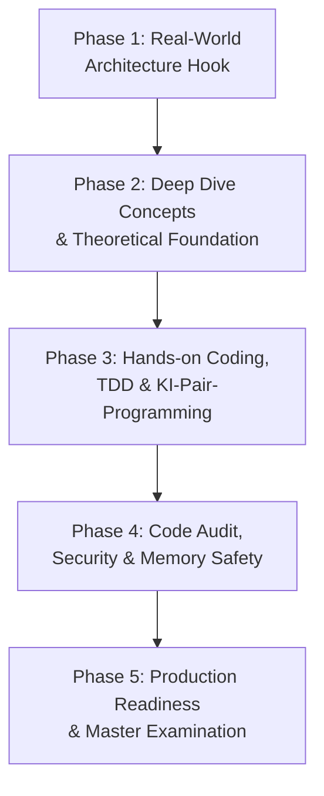

# Entwickler-Curriculum: Software Engineering, Systems Programming mit Rust & Agentic AI

> **Zielgruppe & Ausrichtung:** Reine Programmierer-, Entwickler- und Informatik-Ausbildung. Der Fokus liegt zu 100 % auf professioneller Softwareentwicklung, Systemprogrammierung in Rust, Algorithmen & Datenstrukturen, Datenbank-Engineering, Compilerbau, Technische Informatik, Betriebssystemen, verteilten Systemen und KI-gestütztem Agentic Coding. Abgedeckt werden alle Lehrplananforderungen der **Gymnasium Oberstufe (Abitur Informatik)** sowie des **Informatik-Studiums (Bachelor Computer Science)**.

!!! note "Hinweis: Herkunft dieser Rubrik"
    Diese Seite und die drei verlinkten Detail-Seiten sind aus Rohquellen in `raw/` verarbeitet worden (Ingest-Schritt nach dem [LLM-Wiki-Pattern](../../wissen/dokumentation/llm-wiki-pattern-karpathy.md)). Die Curriculum-Struktur folgt einem Lehrbuch-Inhaltsverzeichnis; sie wurde nicht in diesem Repository gegengeprüft, sondern unverändert aus der Rohquelle übernommen.

---

## Themen in dieser Rubrik

* **[KI-Entwicklungsworkflow für Rust](ki-entwicklungsworkflow-rust.md)** — 9-phasiger Arbeitsablauf (Spec-First Prompting bis Security-Audit) für professionelle Rust-Softwareentwicklung mit KI-Unterstützung.
* **[Claude Code CLI: End-to-End-Leitfaden](claude-code-cli-leitfaden.md)** — Vollständiger Praxis-Guide von Installation über Skills/Subagenten/Hooks bis Production-Release. Ergänzt das bestehende [Claude Code Praxis-Handbuch](../../künstliche-intelligenz/coding/claude-code-praxis.md) um eine Konfigurationsdateien-Referenz und den curriculumsspezifischen 9-Phasen-Workflow.
* **[Rust-Praxisprojekte mit Claude Code](rust-praxisprojekte.md)** — Drei durchgängig ausgearbeitete Projekte (CLI-Tool, Async REST-API, verteilter Key-Value-Store), die die beiden Workflows oben an konkretem Code durchspielen.

---

## Didaktisches 5-Phasen-Entwicklermodell (Lernphasen für die Praxis)

Jedes Kapitel folgt durchgängig einem praxisbezogenen **Entwickler-Workflow**:

1. **Phase 1: Real-World Architecture Hook (Problemstellung & Systemanforderung)**
   *Anforderung aus der professionellen Softwareentwicklung (z. B. High-Performance CLI, Concurrent Server, Datenbank-ORM, Parser, RISC-V Emulator, Agentic Tool).*
2. **Phase 2: Deep Dive Concepts & Theoretical Foundation (Theorie & Informatikgrundlagen)**
   *Fachwissenschaftliche Fundierung (Memory Layout, Ownership/Borrowing, Algorithmen, Datenstrukturen, Automaten, Turing-Maschinen, Relationale Algebra, Rechnerarchitektur, Betriebssystem-Internals, Vektorkalkül, Komplexität).*
3. **Phase 3: Hands-on Coding, TDD & KI-Pair-Programming (Rechnerpraxis & Vibe Coding)**
   *Implementierung in Rust, TDD (`cargo test`), Agentic Coding Workflows (Cursor, Claude Code, Goose, Roo Code), MCP-Tools & Refactoring.*
4. **Phase 4: Code Audit, Security & Memory Safety (Entwickler-Reflexion)**
   *Borrow-Checker-Analysen, Security-Audits (`cargo clippy`, `cargo audit`, Fuzzing), Performance-Benchmarking (`cargo bench`), AI Slop Detection & Memory Safety.*
5. **Phase 5: Production Readiness & Master Examination (Prüfungs- & Praxissicherheit)**
   *Komplexitätsanalyse, Architektur-Review und klausur-/abiturrelevante sowie hochschulnahe Transferaufgaben (AFB I–III).*

---

## Band 1: Grundlagen der Softwareentwicklung & Systemprogrammierung

### Kapitel 1: Data Representation, Low-Level Memory & Digitaltechnik
* **Phase 1 (Systemanforderung):** *Wie speichern Betriebssysteme, Grafikkarten und Netzwerke Daten binär und speichereffizient? Wie schalten Transistoren Logik?*
* **Phase 2 (Theorie & Konzepte):**
    * **1.1 Low-Level Datenrepräsentation & Zahlenformate**
        * Binär-, Oktal- und Hexadezimalsystem; Bitweise Operationen (`AND`, `OR`, `XOR`, Bit-Shifts `<<`, `>>`)
        * Vorzeichenbehaftete Ganzzahlen: Zweierkomplement, Wertebereiche (`i8`..`i128`, `u8`..`u128`), Überlaufverhalten (`overflow-checks`)
        * Gleitkommadarstellung nach IEEE 754 (`f32`, `f64`), Mantisse, Exponent, NaN, Infinity & Präzisionsverlust
    * **1.2 Text-Encoding & Memory Layout von Strings**
        * Codierungsstandards: ASCII, ISO-8859, UTF-8 und UTF-16
        * String-Repräsentation in Rust: Mutabler Stack/Heap-Puffer (`String`) vs. Immutable String Slices (`&str`)
    * **1.3 Digitaltechnik, Boole'sche Algebra & Logikschaltungen**
        * Boole'sche Algebra, Wahrheitswerttabellen, Logikgatter (`AND`, `OR`, `NOT`, `NAND`, `NOR`, `XOR`)
        * Kombinatorische Schaltungen: Halbaddierer, Volladdierer, Multiplexer & Demultiplexer
        * Sequenzielle Schaltungen: RS-Flip-Flop, D-Flip-Flop & Register
        * Logikminimierung: De Morgansche Gesetze & Karnaugh-Veitch-Diagramme (KV-Diagramme)
    * **1.4 Datenkompression & Algorithmen**
        * Verlustfreie Kompression (Run-Length Encoding, Huffman-Codierung, LZ77/LZW)
        * Verlustbehaftete Kompression & Quantisierung (DCT bei JPEG/MP3)
* **Phase 3 (Rechnerpraxis & Coding):** *Entwicklung eines CLI-Tools zur Bit-Analyse, Logikschaltungs-Simulation, String-Transformation und Datei-Kompression in Rust*
* **Phase 4 (Code Audit & Security):** *Betrachtung von Buffer-Overflows, Encoding-Sicherheitslücken & Speicher-Layout im RAM*
* **Phase 5 (Production Readiness):** *Klausur- und Prüfungsvorbereitung: Binärarithmetik, KV-Diagramme, Encoding-Transformationen & Algorithmenanalyse*

### Kapitel 2: Modern Software Engineering in Rust & Agentic AI
* **Phase 1 (Systemanforderung):** *Entwicklung eines performanten, typsicheren CLI-Tools mit KI als Pair-Programmer*
* **Phase 2 (Theorie & Konzepte):**
    * **2.1 Multi-Paradigm Programming & Typsysteme**
        * Variablen, Immutability (`let` vs. `let mut`), Statische Typisierung & Typinferenz
        * Kontrollstrukturen (`if`, `match`, `loop`, `while`) & Pattern Matching
        * Aussagenlogik, Logische Operatoren (`&&`, `||`, `!`) & Prädikatenlogik (Quantoren $\forall, \exists$, Formal-Spezifikation)
        * Rust als Multi-Paradigm-Sprache: Imperative Logik, Funktional (Closures, Iteratoren, High-Order Functions)
    * **2.2 KI-Entwicklerumgebung & Agentic Workflows**
        * Cloud-Assistenten (Copilot, Cursor) & Datenschutzkonforme Lokale LLMs (Ollama, LM Studio, Continue-Plugin)
        * Agentic-Coding-CLIs (Claude Code, Goose, Roo Code) & Tool-Calling-Schleifen
    * **2.3 Modularisierung, Paketverwaltung & Robustness**
        * Funktionen, Parameter, Rückgabewerte & Scope-Regeln
        * Cargo-Paketverwaltung: Module (`mod`), Crates, Visibilities (`pub`, `pub(crate)`)
        * Idiomatische Fehlerbehandlung ohne Exceptions: `Result<T, E>` (`?`-Operator) & `Option<T>`
* **Phase 3 (Rechnerpraxis & Vibe Coding):** *Monolithisches CLI-Skript per KI-Prompting modularisieren, Refaktorisieren und TDD mit `cargo test` durchführen*
* **Phase 4 (Code Audit & Security):** *AI Slop Detection, Code-Style Audits mit `cargo clippy`, Evaluation von KI-Halluzinationen im Code*
* **Phase 5 (Production Readiness):** *Klausur- und Prüfungsvorbereitung: Systematische Code-Analyse, Error Handling & Refactoring*

---

## Band 2: Advanced Software Architecture, Data Structures & Systems

### Kapitel 3: Object-Oriented & Trait-Based System Design (Q1)
* **Phase 1 (Systemanforderung):** *Vibe Coding eines skalierbaren Unternehmens-Verwaltungssystems*
* **Phase 2 (Theorie & Konzepte):**
    * **3.1 Software Architecture, Modeling & Design Principles**
        * Softwarelebenszyklus (Analyse, Entwurf, Implementation, Testing, Wartung) & Vorgehensmodelle (Wasserfall, Agile, Scrum, Kanban)
        * Domain Modeling: Anforderungsanalyse mit Verb-Substantiv-Methode (Text-to-Class Extraction)
        * UML-Struktur- & Verhaltensmodelle: Class Diagrams, Objektdiagramme, Sequenzdiagramme & Zustandsdiagramme
        * Entwurfsprinzipien: Kapselung, Geheimnisprinzip, High Cohesion (Hohe Kohäsion) & Low Coupling (Geringe Kopplung)
        * Beziehungsarten & Multiplizitäten: Assoziationen ($1:1$, $1:n$, $n:m$), Aggregation & Komposition
        * Typsystem-Modellierung: Structs (`struct`), Enums (`enum`), Methoden-Implementierung (`impl`)
        * Schnittstellen & Polymorphie über `traits`: Static Dispatch (Generics `T: Trait`) vs. Dynamic Dispatch (`dyn Trait`)
    * **3.2 Memory Safety & Rust Ownership Model**
        * Ownership, Move-Semantik, Copy vs. Clone
        * Borrowing (`&T` vs. `&mut T`), Lifetime-Elision & explizite Lifetimes (`'a`)
        * Smart Pointer: Stack vs. Heap (`Box<T>`), Reference Counting (`Rc<T>`, `Arc<T>`) & Interior Mutability (`RefCell<T>`)
* **Phase 3 (Rechnerpraxis & Vibe Coding):** *UML-Klassendiagramme per KI in Trait-Architektur übersetzen, E2E-Testing & Systemimplementierung*
* **Phase 4 (Code Audit & Security):** *Der KI-Borrow-Checker-Check: Beheben komplexer Borrow-Errors, Usability/UX-Review & Memory Safety Audit*
* **Phase 5 (Production Readiness):** *Klausur- und Abiturvorbereitung: UML-zu-Code-Transformation, Ownership-Diagramme & Architektur-Reviews*

### Kapitel 4: Algorithms, Data Structures, Automata & Compiler Engineering (Q1/Q2)
* **Phase 1 (Systemanforderung):** *Entwicklung eines Navigationssystems & einer Compiler-Pipeline für eine eigene Mini-Sprache*
* **Phase 2 (Theorie & Konzepte):**
    * **4.1 Lineare Datenstrukturen (ADT)**
        * Abstrakte Datentypen: Stack (Stapel), Queue (Schlange), Lineare Liste (Singly & Doubly Linked List), Dynamic Array (`Vec<T>`)
    * **4.2 Rekursion & Stack Frame Mechanics**
        * Rekursive Denkweise: Basisfall, Rekursionsschritt, Aufrufstack & Tail Call Optimization
    * **4.3 Nichtlineare Datenstrukturen: Trees & Graphs**
        * Binärbäume, Binäre Suchbäume, Baum-Traversierung (Pre-order, In-order, Post-order)
        * Graphentheorie: Adjazenzmatrix & Adjazenzliste, Breitensuche (BFS), Tiefensuche (DFS), Dijkstra-Algorithmus
    * **4.4 Automaten, Formale Sprachen, Berechenbarkeit & Compilerbau**
        * Deterministische (DEA / DFA) und nichtdeterministische endliche Automaten (NEA / NFA), Mealy-Automaten
        * Kellerautomaten (Pushdown Automata / PDA), Kontextfreie Grammatiken, Chomsky-Hierarchie, Reguläre Ausdrücke (Regex)
        * Turing-Maschinen (Turing Machine / TM): Bandmodell, Zustände, Alphabet & Übergangsfunktion; Determinismus vs. Nichtdeterminismus
        * Formale Berechenbarkeit: Halteproblem (Diagonalisierungsbeweis), Unentscheidbarkeit & Church-Turing-These
        * Programmkorrektheit & Formale Verifikation: Vor- und Nachbedingungen, Schleifeninvarianten, Assertions (`assert!`) & Hoare-Kalkül
        * Language Processing Pipeline: Scanner/Lexer (Tokenisierung) → Parser (Abstract Syntax Tree / AST) → Type Checker → Interpreter / Code Generator
    * **4.5 Algorithmic Design Patterns & Complexity Analysis**
        * Suchen: Lineare vs. Binäre Suche; Sortieren: Bubblesort, Selection Sort, Quicksort, Mergesort
        * Entwurfsstrategien: Divide and Conquer (Teile & Herrsche), Greedy-Strategie, Dynamic Programming (Dynamische Programmierung), Backtracking & Branch & Bound
        * Komplexitätsanalyse: Asymptotische O-Notation, Rekursionsgleichungen, P vs. NP, NP-Vollständigkeit & Näherungsheuristiken
* **Phase 3 (Rechnerpraxis & Vibe Coding):** *Implementierung von Graph-Algorithmen, Parser-Bau in Rust & Performance-Benchmarking mit `cargo bench`*
* **Phase 4 (Code Audit & Security):** *Memory-Audit bei Zeigerknoten in Rust (`Rc<RefCell<T>>`), Berechenbarkeit, Turing-Maschine & Halteproblem*
* **Phase 5 (Production Readiness):** *Klausur- und Abiturvorbereitung: Algorithmen-Komplexität, Automaten-Synthese, Grammatik-Prüfung & Hoare-Kalkül*

### Kapitel 5: Relational Databases, Advanced SQL, RAG & MCP (Q2/Q3)
* **Phase 1 (Systemanforderung):** *Bau eines KI-gestützten Datenbank-Backends mit RAG-Erweiterung und typsicherer Rust-Anbindung*
* **Phase 2 (Theorie & Konzepte):**
    * **5.1 Relational Database Design & Relational Algebra**
        * Entity-Relationship-Modellierung (ERM: Entitäten, Attribute, Kardinalitäten)
        * Relationale Algebra: Selektion ($\sigma$), Projektion ($\pi$), Join ($\bowtie$), Vereinigung, Differenz
        * Normalisierung: 1. NF, 2. NF, 3. NF & BCNF
    * **5.2 Advanced SQL & Type-Safe Rust DB Binding**
        * DDL & DML: `CREATE`, `ALTER`, `INSERT`, `UPDATE`, `DELETE`, komplexe `JOIN`s, Subqueries, Aggregationen
        * Typsichere Rust-Datenbankanbindung (`sqlx` mit Kompilierzeit-SQL-Prüfung, `rusqlite`)
        * Model Context Protocol (MCP) für Datenbanken: KI-Tool-Calling & Datenbank-Administration
    * **5.3 Modern AI Knowledge Infrastructure: RAG & Vector Stores**
        * Retrieval-Augmented Generation (RAG): Document Loading, Text Chunking, Embeddings
        * Vector Stores / Vektordatenbanken (Cosine Similarity, Nearest Neighbor Search) & Text-to-SQL
    * **5.4 Database Internals, Transactions & Security**
        * ACID-Prinzip (Atomizität, Konsistenz, Isolation, Dauerhaftigkeit) & Transaktionssteuerung
        * Security: SQL-Injection Prevention durch Parameterized Queries & Typsicherheit
* **Phase 3 (Rechnerpraxis & Vibe Coding):** *ER-Schema per Prompt erzeugen, typsicheren SQL-Backend-Service in Rust bauen, RAG-Pipeline mit Vektorsuche aufsetzen*
* **Phase 4 (Code Audit & Security):** *ACID-Transaktionsprüfung, Index-Performanz-Analyse & Datenschutz-Audit (DSGVO)*
* **Phase 5 (Production Readiness):** *Klausur- und Abiturvorbereitung: SQL-Abfrageoptimierung, ERM-Transformationsregeln & Relationale Algebra*

### Kapitel 6: Systems Programming, Networking & Concurrency (Q3/Q4)
* **Phase 1 (Systemanforderung):** *Entwicklung eines hochparallelen Async Webservers oder Chat-Server-Systems in Rust*
* **Phase 2 (Theorie & Konzepte):**
    * **6.1 Network Engineering & Protocols**
        * Network Topologies, OSI-7-Schichtenmodell, TCP/IP-Referenzmodell
        * Adressierung & Protokolle: IP (v4/v6), TCP vs. UDP, HTTP/1.1 & HTTP/2, DNS, DHCP
    * **6.2 Systems Programming, Hardware Interfaces & Operating Systems**
        * Socket-Programmierung in Rust (`std::net::TcpListener`, `TcpStream`)
        * Low-Level Hardware: Busse, Schnittstellen, Signalwandler (ADC / DAC), Embedded Systems
        * Event-Driven Architecture & Event-Handling für GUIs
        * OS Internals: Prozesse vs. Threads, Prozessverwaltung, Speicherseiten (Paging/Virtual Memory)
        * Concurrency & Multithreading: Race Conditions, Mutexes (`Mutex<T>`), Semaphoren, Channels (`mpsc`) & Async Rust (`async`/`.await`, Tokio Runtime)
* **Phase 3 (Rechnerpraxis & Vibe Coding):** *Netzwerk-Simulation mit Filius, Implementierung eines concurrent Multi-Threaded HTTP-Servers in Rust mit KI-Unterstützung*
* **Phase 4 (Code Audit & Security):** *Deadlock-Analyse, Thread Safety Audits (`Send` & `Sync` Traits in Rust) & Maschinennahes Memory Audit*
* **Phase 5 (Production Readiness):** *Klausur- und Abiturvorbereitung: Netzwerk-Protokoll-Analyse, Concurrency-Prüfung & OS-Konzepte*

### Kapitel 7: Applied Cryptography, Security Audits, IT-Recht & AI Ethics (Q4)
* **Phase 1 (Systemanforderung):** *Security-Audit einer verteilten Anwendung, Integration sicherer Kryptographie & rechtssichere Compliance*
* **Phase 2 (Theorie & Konzepte):**
    * **7.1 Cryptography & Cipher Engineering**
        * Symmetrische Verfahren: Caesar, Vigenère, One-Time-Pad, AES (Block-Chiffren) & Kryptoanalyse
        * Asymmetrische Verfahren: RSA (Mathematik der Modulo-Arithmetik), Diffie-Hellman Key Exchange, Elliptic Curve Cryptography (ECC)
    * **7.2 PKI, Signatures & AI Code Security**
        * Kryptografische Hash-Funktionen (SHA-256), Digital Signatures, Zertifikate & Public Key Infrastructure (PKI)
        * Automated Security Auditing: Static Code Analysis mit Rust-Lintern (`cargo clippy`, `cargo audit`)
    * **7.3 AI Engineering Ethics, Neural Network Basics & LLM Architecture**
        * Grundlagen Neuronaler Netze: Perzeptron-Modell, Aktivierungsfunktionen (Sigmoid, ReLU), Lineare Separierbarkeit & Supervised Learning Basics
        * LLM Architecture: Transformer, Attention Mechanisms, Fine-Tuning & KI-APIs (OpenAI, Claude, Gemini, Local Endpoints)
        * Risks & Ethics: AI Slop (Gefahren unbeaufsichtigter KI-Code-Generierung), Urheberrecht an KI-Code, Prompt Injection & Halluzinationen in kritischen Infrastrukturen
    * **7.4 IT-Recht, Datenschutz & Software-Lizenzen**
        * Datenschutz-Grundverordnung (DSGVO), Privacy by Design & Privacy by Default
        * Open-Source-Lizenzmodelle: Permissiv (MIT, Apache 2.0) vs. Copyleft (GPLv3, AGPL) vs. Propriethär
        * Software-Haftung, Impressumspflicht & Urheberrecht an Quellcode und Trainingsdaten
* **Phase 3 (Rechnerpraxis & Vibe Coding):** *Kryptografische Verfahren in Rust schreiben, KI-Security-Audit einer Codebase durchführen & LLM API Service bauen*
* **Phase 4 (Code Audit & Security):** *Podiumsdiskussion: „Verständnis von Compilern, Memory Layout & Borrow Checker im Zeitalter generativer KI"*
* **Phase 5 (Production Readiness):** *Abiturtraining & Abschlussprüfung: Kryptografie-Arithmetik, Security-Audits, IT-Recht & Ethik-Analysen*

---

## Band 3: University Computer Science & Advanced Systems Engineering (Bachelor-Niveau)

### Kapitel 8: Rechnerarchitektur, Technische Informatik & RISC-V Assembler
* **Phase 1 (Systemanforderung):** *Entwicklung eines Emulators für einen RISC-V Prozessor in Rust*
* **Phase 2 (Theorie & Konzepte):**
    * **8.1 Rechnerarchitektur & Instruction Set Architectures (ISA)**
        * Von-Neumann- vs. Harvard-Architektur, Bus-Systeme (Daten-, Adress- und Steuerbus)
        * RISC vs. CISC Philosophie; RISC-V ISA (Register-Set `x0`..`x31`, Instruktionsformate R, I, S, U, J)
        * Machine Code Decoding, Befehlszyklus (Fetch, Decode, Execute, Memory Access, Write-Back)
    * **8.2 Low-Level & Assembler-Programmierung**
        * RISC-V Assembler-Programmierung & Rekonstruktion von C/Rust-Logik in Assembler
        * Inline Assembly in Rust (`core::arch::asm!`) & C-ABI (Application Binary Interface), Calling Conventions (Stack Frame Setup)
    * **8.3 Hardware Performance & CPU Optimization**
        * CPU-Pipelining: 5-Stufen-Pipeline, Pipeline Hazards (Data, Control, Structural) & Forwarding/Branch Prediction
        * Cache-Hierarchien (L1, L2, L3 Caches), Cache Lines, Cache Hits vs. Misses & Spatial/Temporal Locality
* **Phase 3 (Rechnerpraxis & Vibe Coding):** *Bau eines funktionierenden RISC-V 32-Bit Befehls-Decoders und Emulators in Rust mit TDD*
* **Phase 4 (Code Audit & Security):** *Cache-Miss-Analyse mit Profilern (`perf`, `valgrind`), Spectre/Meltdown Side-Channel-Verständnis & SIMD-Vektorisierung*
* **Phase 5 (Production Readiness):** *Klausur- & Hochschulvorbereitung: Befehlskodierung, Pipelining-Diagramme & Assembler-Analyse*

### Kapitel 9: Betriebssystem-Internals, Memory Management & Interprozesskommunikation
* **Phase 1 (Systemanforderung):** *Entwicklung eines eigenen Minimal-Kernels / Process Schedulers oder systemnahen IPC-Daemons in Rust*
* **Phase 2 (Theorie & Konzepte):**
    * **9.1 Virtuelle Speicherverwaltung & Memory Mapping**
        * Physikalische vs. Virtuelle Adressen, Paging, Page Tables (Multi-Level Paging), Page Faults & Translation Lookaside Buffer (TLB)
        * Memory Mapping (`mmap`), Dynamic Memory Allocation (`brk`/`sbrk`, Heap-Allocator Mechanics)
    * **9.2 Prozessverwaltung & Scheduling**
        * Prozesszustände (Ready, Running, Blocked), Process Control Block (PCB), Context Switches
        * Scheduling-Algorithmen: First-Come-First-Served (FCFS), Shortest Job First (SJF), Round Robin (RR), Completely Fair Scheduler (CFS)
    * **9.3 Interprozesskommunikation (IPC) & Kernel Interfaces**
        * System Calls (`syscall`), Kernel Space vs. User Space
        * IPC-Mechanismen: Anonymous & Named Pipes, Shared Memory, Signals, Unix Domain Sockets
    * **9.4 Synchronisation & Deadlock Engineering**
        * Kritische Abschnitte, Mutex, Semaphoren, Spinlocks, Futexes
        * Deadlock-Theorie: Coffman-Bedingungen, Banker-Algorithmus (Deadlock Vermeidung), Reader-Writer-Problem
* **Phase 3 (Rechnerpraxis & Vibe Coding):** *Implementierung eines interaktiven Prozess-Schedulers und IPC-Shared-Memory-Protokolls in Rust*
* **Phase 4 (Code Audit & Security):** *Kernel Memory Safety, Privilege Escalation Vektor-Analyse & Deadlock Detection*
* **Phase 5 (Production Readiness):** *Klausur- & Hochschulvorbereitung: Paging-Berechnungen, Scheduling-Gantt-Diagramme & Deadlock-Beweise*

### Kapitel 10: Verteilte Systeme, Cloud Architecture, gRPC & Microservices
* **Phase 1 (Systemanforderung):** *Bau eines hochverfügbaren, verteilten Schlüssel-Wert-Speichers (Distributed Key-Value Store) mit gRPC*
* **Phase 2 (Theorie & Konzepte):**
    * **10.1 Verteilte Systeme & Konsistenzmodelle**
        * Fundamentale Probleme verteilter Systeme: Physikalische vs. Logische Uhren (Lamport-Uhren, Vector Clocks)
        * CAP-Theorem (Consistency, Availability, Partition Tolerance) & PACELC-Theorem
        * Eventual Consistency vs. Strong Consistency, BASE vs. ACID
    * **10.2 Konsens-Algorithmen & Leader Election**
        * Raft-Konsensalgorithmus (Leader Election, Log Replication, Safety) & Paxos-Grundlagen
        * Distributed Transactions & Two-Phase Commit (2PC)
    * **10.3 Microservices, RPC & Message Streaming**
        * Protocol Buffers & High-Performance RPC (`gRPC` in Rust via `tonic`)
        * Event-Driven Architecture, Publish-Subscribe-Muster, Event Sourcing & Message Queues (Kafka, RabbitMQ)
    * **10.4 Cloud Infrastructure & Containerization**
        * Container-Internals (Linux Namespaces, cgroups, chroot), Docker Architecture
        * Kubernetes Basics (Pods, Services, Deployments) & Infrastructure as Code (IaC)
* **Phase 3 (Rechnerpraxis & Vibe Coding):** *Implementierung eines Raft-basierten verteilten Replikations-Clusters in Rust mit gRPC-Kommunikation*
* **Phase 4 (Code Audit & Security):** *Netzwerk-Partitionierungs-Simulation (Chaos Engineering), TLS-Verschlüsselung bei gRPC & Fault Tolerance Audit*
* **Phase 5 (Production Readiness):** *Klausur- & Hochschulvorbereitung: CAP-Analyse, Raft-Zustandsübergänge & RPC-Protokollentwurf*

### Kapitel 11: Mathematische Grundlagen der KI, Lineare Algebra & Deep Learning
* **Phase 1 (Systemanforderung):** *Implementierung eines eigenen Deep Learning Frameworks (Tensors & Autograd) von Grund auf in Rust*
* **Phase 2 (Theorie & Konzepte):**
    * **11.1 Lineare Algebra für Softwareentwickler**
        * Vektoren, Matrizen, Vektorräume & Matrix-Multiplikation; Matrix-Transformationen
        * Eigenwerte, Eigenvektoren, Singular Value Decomposition (SVD) & Tensor-Operationen
    * **11.2 Analysis, Vektorkalkül & Optimierung**
        * Funktionen mehrerer Variablen, Partielle Ableitungen, Jacobi-Matrix & Hessematrix
        * Gradient, Gradientenabstieg (Stochastic Gradient Descent / SGD, Adam Optimizer), Cost & Loss Functions (MSE, Cross-Entropy)
    * **11.3 Deep Learning Mechanics & Neural Architectures**
        * Artificial Neural Networks (ANN): Feedforward Propagation, Layer-Topologien
        * Computational Graphs & Automatic Differentiation (Autograd-Algorithmus)
        * Backpropagation: Kettenregel (Chain Rule) der Multi-Variable-Calculus für Gewichtsanpassungen
        * Moderne Architekturmuster: Convolutional Neural Networks (CNN), Recurrent Neural Networks (RNN) & Transformer Attention Mechanics ($Q, K, V$ Matrizen)
* **Phase 3 (Rechnerpraxis & Vibe Coding):** *Bau einer matritzenbasierten Autograd-Engine in Rust (`ndarray` / Custom Tensor struct) und Training eines Ziffern-Erkenners (MNIST)*
* **Phase 4 (Code Audit & Security):** *Numerical Stability Audit (Exploding/Vanishing Gradients, Floating-Point Precision Errors), Memory Efficiency bei Tensors*
* **Phase 5 (Production Readiness):** *Klausur- & Hochschulvorbereitung: Matrizenrechnung, Gradienten-Berechnungen per Kettenregel & Autograd-Graphen*

### Kapitel 12: Enterprise Software Architecture, Design Patterns & Quality Engineering
* **Phase 1 (Systemanforderung):** *Architektur-Redesign einer Legacy-Anwendung in ein wartbares, hochgradig getestetes Enterprise-System*
* **Phase 2 (Theorie & Konzepte):**
    * **12.1 Gang of Four (GoF) & Idiomatische Rust Design Patterns**
        * Erzeugungsmuster: Factory, Builder, Singleton/Lazy Static
        * Strukturmuster: Adapter, Decorator, Proxy, Composite
        * Verhaltensmuster: Strategy, Observer, State Pattern, Command Pattern
        * Mapping von klassischen OOP-Patterns auf funktionale & trait-basierte Rust-Idiome
    * **12.2 Architectural Paradigms & Domain-Driven Design (DDD)**
        * Hexagonale Architektur (Ports & Adapters Architecture), Clean Architecture, Onion Architecture
        * Domain-Driven Design: Bounded Contexts, Aggregates, Entities, Value Objects & Domain Events
    * **12.3 Advanced Quality Engineering & Automated Testing Strategy**
        * Testpyramide: Unit Testing, Integration Testing, End-to-End Testing
        * Advanced Testing Techniques: Property-Based Testing (`proptest` / `quickcheck`), Mutation Testing
        * Fuzz Testing / Automated Vulnerability Discovery (`cargo-fuzz` mit LLVM libFuzzer)
        * Continuous Integration & Delivery (CI/CD): GitHub Actions Pipelines, Automated Code Coverage (`tarpaulin`), Dependency Audits
* **Phase 3 (Rechnerpraxis & Vibe Coding):** *Refactoring einer monolithischen Applikation in Hexagonale Architektur, Aufsetzen von Fuzzing-Suites & CI/CD Pipelines*
* **Phase 4 (Code Audit & Security):** *Architectural Drift Detection, Coverage Audits, Static Analysis (`clippy`, `audit`, `miri`) & Security Fuzzing*
* **Phase 5 (Production Readiness):** *Klausur- & Hochschulvorbereitung: Entwurfsmuster-Synthese, Architektur-Diagramme (DDD) & Teststrategie-Evaluation*

---

## Verwandte Themen

* [KI-Entwicklungsworkflow für Rust](ki-entwicklungsworkflow-rust.md) — der 9-phasige Arbeitsablauf, der die Phase-3-Schritte dieses Curriculums konkretisiert
* [Claude Code CLI: End-to-End-Leitfaden](claude-code-cli-leitfaden.md) — Werkzeug-Referenz für die KI-gestützten Schritte
* [Rust-Praxisprojekte mit Claude Code](rust-praxisprojekte.md) — drei Projekte, die dieses Curriculum praktisch durchspielen
* [Rust Praxis-Handbuch](../system/rust-praxis.md) — vertiefende Rust-Praxis außerhalb des Curriculum-Kontexts
* [LLM-Wiki-Pattern (Karpathy-Muster)](../../wissen/dokumentation/llm-wiki-pattern-karpathy.md) — das Ingest-Muster, nach dem diese Seiten aus `raw/` entstanden sind
