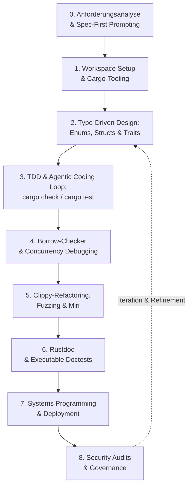

# Arbeitsschritte für professionelle Softwareentwicklung mit KI (Fokus: Rust & Systems Programming)

> **Basierend auf dem Inhaltsverzeichnis des Fachbuchs:**
> *„Coding mit KI – Das Praxisbuch für Softwareentwicklung mit ChatGPT, GitHub Copilot, Cursor & Co."* (Rheinwerk Verlag)
> **Speziell angepasst für:** Professional Rust Software Engineers, Systems Programming, Memory Safety & Agentic Coding in Rust.

!!! note "Hinweis: Herkunft dieser Seite"
    Verarbeitet aus `raw/Entwicklung.md` nach dem [LLM-Wiki-Pattern](../../wissen/dokumentation/llm-wiki-pattern-karpathy.md). Teil der Rubrik [Agentic Coding & Curriculum](index.md).

---

## Didaktischer Entwicklungs-Workflow für Rust-Programmierer

In Rust bietet die Kombination aus dem strengen Compiler (`rustc`), dem Borrow Checker, Cargo-Tooling und KI-Assistenten (Agentic Coding) eine einzigartige Synergie: **Die KI schlägt Code vor, und der Rust-Compiler liefert unbestechliches, mathematisch präzises Feedback.**

Die neun Phasen im Überblick: [0. Anforderungsanalyse & Spec-First Prompting](#0-phase-anforderungsanalyse-spec-first-prompting) · [1. Tooling & Workspace-Setup](#1-phase-rust-tooling-ki-kontext-workspace-setup) · [2. Type-Driven Domain Design](#2-phase-type-driven-domain-design-architektur-in-rust) · [3. TDD & Agentic Coding Loop](#3-phase-tdd-agentic-coding-loop-implementierung) · [4. Borrow-Checker & Concurrency Debugging](#4-phase-borrow-checker-concurrency-debugging) · [5. Refactoring & Performance Audit](#5-phase-refactoring-idiomatischer-code-performance-audit) · [6. Rustdoc & Doctests](#6-phase-rustdoc-doctests-software-dokumentation) · [7. Systems Programming, FFI & Deployment](#7-phase-systems-programming-ffi-deployment-devops) · [8. Security Audits, Supply Chain & Governance](#8-phase-security-audits-supply-chain-governance)

---

## 0. Phase: Anforderungsanalyse & Spec-First Prompting

* **Spezifikation vor Code:**
    * Die KI zunächst eine strukturierte Anforderungsspezifikation (Domänenbegriffe, Invarianten, Fehlerfälle, Nicht-Ziele) formulieren lassen – **nicht** direkt Code generieren.
    * Spezifikation vom Entwickler gegenlesen und freigeben, bevor Phase 1 beginnt (verhindert kostspieliges Rework durch Fehlinterpretationen).
* **Scope-Abgrenzung:**
    * Klare Abgrenzung, welche Crates/Module im aktuellen Kontextfenster der KI liegen dürfen, um Halluzinationen durch fehlenden Kontext zu vermeiden.

!!! tip "Prompt-Beispiel"
    „Fasse die folgenden Anforderungen als Liste von Invarianten und Fehlerfällen zusammen, bevor du Code schreibst. Schlage noch keine Implementierung vor."

---

## 1. Phase: Rust-Tooling, KI-Kontext & Workspace-Setup

* **Wahl der KI-Tools für Rust:**
    * **IDE & Agenten:** Cursor, Roo Code, Claude Code, Goose mit tiefem Kontext über `rust-analyzer`.
    * **MCP-Integration (Model Context Protocol):** Einbindung von MCP-Tools zur direkten Abfrage von Crates.io, Rust-Dokumentationen (`docs.rs`) und lokaler Cargo-Ausgaben.
* **Rust-Workspace-Konfiguration:**
    * Einrichtung von Cargo Workspaces (`Cargo.toml`) für modulare Multi-Crate-Projekte.
    * Prompting-Regeln für idiomatischen Rust-Code festlegen: Keine unnötigen `.clone()`, Verzicht auf `unsafe` ohne Begründung, Bevorzugung von `Result`/`Option` gegenüber Panic-Aufrufen (`unwrap`/`expect`).
* **Umgang mit Crate-API-Halluzinationen:**
    * Trainingsdaten von KI-Modellen enthalten häufig veraltete Crate-Versionen/APIs (schnelllebiges Rust-Ökosystem). Vorgeschlagene Signaturen immer gegen `docs.rs`/die tatsächlich in `Cargo.toml` gepinnte Version prüfen lassen, idealerweise per MCP-Live-Abfrage statt aus dem Modellgedächtnis.
* **Datenschutz & Vertraulichkeit:**
    * Bei proprietärem oder sicherheitskritischem Code klären, ob Cloud-KI-Modelle zulässig sind, oder On-Prem-/Self-Hosted-Modelle sowie `.aiignore`-Ausschlusslisten für sensible Pfade einsetzen.

!!! warning "Fallstrick"
    Von der KI vorgeschlagene Crate-Versionen oder Methodennamen ungeprüft übernehmen – Kompilierfehler durch nicht-existente APIs sind ein häufiges Symptom veralteter Trainingsdaten.

---

## 2. Phase: Type-Driven Domain Design (Architektur in Rust)

* **Domain Modeling mit dem Rust-Typsystem:**
    * Modellierung von Domänenzuständen über `struct` und ausdrucksstarke `enum` (Algebraische Datentypen).
    * Nutzung des *Make Illegal States Unrepresentable*-Prinzips und des *Newtype Patterns*.
* **Trait-Architektur & Polymorphie:**
    * Entwurf von Schnittstellen mittels `trait`.
    * Entscheidung zwischen **Static Dispatch** (`impl Trait`, Generics `T: Trait` für maximale Performance) und **Dynamic Dispatch** (`Trait-Objects` `dyn Trait` für Speicherflexibilität).
* **Fehlerbehandlungs-Strategie:**
    * `thiserror` für strukturierte, typisierte Fehler in Bibliotheks-Crates; `anyhow` für ergonomische Fehlerpropagation in Anwendungs-Crates.
    * Klare Trennung zwischen erwartbaren Fehlern (`Result<T, E>`) und Programmierfehlern (`panic!` nur für nicht behebbare Invariantenverletzungen).
* **Datenbank- & Schema-Design (Kompilierzeitsicherheit):**
    * Entwurf relationaler Schemata mit KI.
    * Verwendung von **SQLx** (mit Makros wie `query!`) für Kompilierzeit-Prüfung von SQL-Abfragen direkt gegen die Datenbank.

!!! warning "Fallstrick"
    Die KI versucht, Vererbungshierarchien wie in Java/C++ nachzubilden, statt Traits + Komposition zu nutzen – frühzeitig korrigieren, bevor sich das Muster im Codebase verfestigt.

---

## 3. Phase: TDD & Agentic Coding Loop (Implementierung)

* **Rust-Testabdeckung vorab schreiben (TDD):**
    * KI-gestützte Generierung von Unit-Tests (`#[test]`) und Async-Tests (`#[tokio::test]`).
    * Einsatz von **Property-Based Testing** (`proptest` / `quickcheck`) zur automatischen Generierung tausender zufälliger Testfälle.
* **Der autonome Rust-Agentic-Loop (`cargo check` & `cargo test`):**
    * Der Entwickler formuliert Prompts/Anforderungen.
    * KI-Agents (Claude Code, Goose, Cursor Composer) schreiben Rust-Code und führen automatisch `cargo check` und `cargo test` aus.
    * Die KI nutzt die exakten Fehlermeldungen des Rust-Compilers, um Borrow-Errors und Typenfehler autonom zu korrigieren.
* **Schnelleres Test-Feedback:**
    * Einsatz von `cargo nextest` als Test-Runner im Agentic Loop für deutlich kürzere Iterationszeiten bei großen Test-Suiten.

!!! tip "Prompt-Beispiel"
    „Schreibe zuerst fehlschlagende Tests für die oben definierten Invarianten, führe `cargo test` aus und implementiere danach nur so viel Code, wie nötig ist, damit sie grün werden."

---

## 4. Phase: Borrow-Checker & Concurrency Debugging

* **Systematische Borrow-Checker-Diagnose:**
    * Übergabe von `rustc`-Fehlercodes (z. B. `E0502: cannot borrow *self as mutable more than once`) an die KI.
    * Prüfung, ob **Non-Lexical Lifetimes (NLL)** bzw. einfaches Scoping das Problem bereits lösen, bevor auf Smart Pointer ausgewichen wird.
    * Refactoring von Lebensdauern (`lifetimes`), explizites Scoping, oder Einsatz passender Smart Pointer (`Box<T>`, `Rc<T>`, `Arc<T>`, `RefCell<T>`, `Mutex<T>`).
* **Async & Thread-Safety Audits:**
    * Analyse von Multithreading-Race-Conditions und Concurrency-Bugs.
    * Überprüfung der `Send` und `Sync` Traits für sichere Thread-Übergaben in Tokio-Runtimes.

!!! warning "Fallstrick"
    `Rc<RefCell<T>>`/`Arc<Mutex<T>>` als Standardlösung für jeden Borrow-Fehler akzeptieren – oft ist ein Redesign des Ownership-Modells die sauberere und schnellere Lösung.

---

## 5. Phase: Refactoring, Idiomatischer Code & Performance Audit

* **Clippy-gestütztes Refactoring:**
    * Ausführen von `cargo clippy` zur Erkennung von Anti-Patterns.
    * KI-gestütztes Refactoring hin zu funktionalem, idiomatischem Rust-Stil (Iteratoren-Chaining mit `.iter()`, `.map()`, `.filter()`, `.collect()`).
* **Memory Safety & Unsafe Audit:**
    * Eliminieren von `unsafe`-Blöcken durch sichere Abstraktionen.
    * **Automatisches Fuzzing:** Aufsetzen von Fuzzing-Suites mit `cargo-fuzz` (LLVM libFuzzer), um Abstürze oder Panic-Zustände bei beliebigen Inputs aufzuspüren.
    * Ausführen von **Miri** (`cargo miri test`) zum Nachweis der Abwesenheit von Undefined Behavior in `unsafe` Code.
* **Testqualität & API-Stabilität:**
    * **Mutation Testing** (`cargo-mutants`) zur Überprüfung, ob die Tests tatsächlich Fehler erkennen und nicht nur Codeabdeckung erzeugen.
    * `cargo-semver-checks` zur automatisierten Prüfung, ob Änderungen die öffentliche API auf inkompatible Weise brechen.
* **Performance Benchmarking:**
    * Benchmarking kritischer Pfade mit `cargo bench` (Criterion.rs) und KI-unterstützter Cache- & Algorithmenoptimierung.

---

## 6. Phase: Rustdoc & Doctests (Software-Dokumentation)

* **Dokumentationskommentare (`///` und `//!`):** Generierung von aussagekräftigen Modul- und API-Dokumentationen.
* **Ausführbare Doctests:** Die KI schreibt Beispiel-Codeblöcke in die Rustdoc-Kommentare, die bei `cargo test` automatisch als Testfälle kompiliert und ausgeführt werden.
* **Review-Schritt:** Generierte Dokumentation mit `cargo doc --open` lokal rendern und gegenlesen, bevor sie gemergt wird – KI-generierte Prosa wirkt oft plausibel, ist aber nicht immer fachlich präzise.
* **OpenAPI-Generierung:** Erstellung von OpenAPI-Spezifikationen aus Rust-Web-Frameworks (Axum, Actix-Web, Poem) mittels `utoipa`.

---

## 7. Phase: Systems Programming, FFI & Deployment (DevOps)

* **FFI & C-ABI Anbindung:** Erstellung sicherer C-Bindings mit `bindgen` oder `cbindgen` sowie Nutzung von Inline-Assembly (`core::arch::asm!`).
* **Observability:** Einsatz des `tracing`-Crates für strukturiertes Logging und verteiltes Tracing als Grundlage für Debugging und Monitoring im Betrieb.
* **Cross-Compilation & Containerisierung:**
    * Generierung von schlanken, statisch gelinkten Release-Binaries (musl target: `x86_64-unknown-linux-musl`).
    * Kompilierung für WebAssembly (`wasm32-unknown-unknown`) für Browser- und Edge-Deployments.
    * Erstellung minimaler Docker-Container (Scratch- oder Distroless-Images) für Rust-Microservices.
* **CI/CD Pipeline Setup:** Konfiguration von GitHub Actions (`cargo fmt --check`, `cargo clippy`, `cargo test`, `cargo llvm-cov` für Code Coverage).

---

## 8. Phase: Security Audits, Supply Chain & Governance

* **Cargo Dependency Audits:**
    * Prüfen bekannter Sicherheitslücken in Abhängigkeiten mit `cargo audit`.
    * Lizenzprüfungen der Crates mit `cargo deny`.
* **MSRV-Disziplin:**
    * Festlegung und CI-Prüfung einer Minimum Supported Rust Version (`cargo msrv`), damit KI-Agenten keine Sprachfeatures neuerer Rust-Versionen vorschlagen, die im Zielumfeld nicht verfügbar sind.
* **AI Slop Avoidance bei Rust:**
    * Schutz vor unidiomatischen Code-Halluzinationen (z. B. wenn die KI versucht, OOP-Klassenvererbung wie in Java/C++ in Rust nachzubauen).
    * Durchsetzung von Zero-Cost Abstractions und Rust-Sicherheitsgarantien.

---

## Zusammenfassung des Rust-KI-Entwicklungszyklus

---

## Verwandte Themen

* [Entwickler-Curriculum: Software Engineering, Systems Programming mit Rust & Agentic AI](index.md) — übergeordnetes Curriculum, das diesen Workflow in Phase 3 der Kapitel referenziert
* [Claude Code CLI: End-to-End-Leitfaden](claude-code-cli-leitfaden.md) — Werkzeug-Details zu den hier genannten Agentic-Coding-CLIs
* [Rust-Praxisprojekte mit Claude Code](rust-praxisprojekte.md) — wendet diesen 9-Phasen-Workflow auf drei konkrete Projekte an
* [Rust Praxis-Handbuch](../system/rust-praxis.md) — vertiefende Rust-Sprachpraxis
