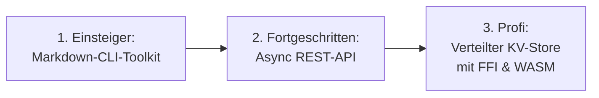

# Praxisprojekte: Rust-Softwareentwicklung mit Claude Code (Einsteiger → Profi)

> Drei durchgängig ausgearbeitete Projektvorschläge, die den KI-Entwicklungszyklus aus [KI-Entwicklungsworkflow für Rust](ki-entwicklungsworkflow-rust.md) (Phasen 0–8) und den Claude-Code-Workflow aus [Claude Code CLI: End-to-End-Leitfaden](claude-code-cli-leitfaden.md) (Setup, Skills, Subagenten, Hooks, Release) an drei konkreten Rust-Projekten mit steigender Komplexität durchspielen. Jedes Projekt nennt für jede Phase eine **konkrete Aufgabe**, einen **Beispiel-Prompt** für Claude Code und die dazugehörigen **Befehle/Werkzeuge**.

!!! note "Hinweis: Herkunft dieser Seite"
    Verarbeitet aus `raw/projekt.md` nach dem [LLM-Wiki-Pattern](../../wissen/dokumentation/llm-wiki-pattern-karpathy.md). Teil der Rubrik [Agentic Coding & Curriculum](index.md).

---

## Vereinheitlichtes Phasenschema

Um die drei Projekte vergleichbar zu halten, werden die neun Phasen aus [KI-Entwicklungsworkflow für Rust](ki-entwicklungsworkflow-rust.md) als gemeinsames Gerüst verwendet; die Claude-Code-spezifischen Elemente (Skills, Subagenten, Hooks, Plugins) werden an der jeweils passenden Stelle eingehängt.

| # | Phase | Schwerpunkt |
| :-: | :--- | :--- |
| 0 | Setup & Anforderungsanalyse | `claude init`, `CLAUDE.md`, Spec-First Prompting |
| 1 | Architektur & Type-Driven Design | Structs/Enums/Traits, Fehlerstrategie, Datenmodell |
| 2 | TDD & Agentic Coding Loop | Tests zuerst, `cargo check`/`test`, Subagenten-Delegation |
| 3 | Borrow-Checker & Concurrency Debugging | Lifetimes, `Send`/`Sync`, Smart Pointer |
| 4 | Refactoring, Clippy, Fuzzing & Miri | Idiomatischer Stil, Unsafe-Audit, Testqualität |
| 5 | Performance & Observability | Benchmarks, `tracing`, Caching |
| 6 | Dokumentation | Rustdoc, Doctests, OpenAPI |
| 7 | Systems, FFI/WASM & Deployment | Cross-Compilation, Docker, CI/CD |
| 8 | Security, Governance & Team-Rollout | `cargo audit`/`deny`, MSRV, Plugins, Managed Settings |

---

## Projekt 1 (Einsteiger): CLI-Markdown-Toolkit `mdstat`

**Ziel:** Ein Kommandozeilen-Tool, das Markdown-Dateien einliest, Statistiken berechnet (Wortzahl, Überschriftenstruktur, defekte interne Links) und das Ergebnis als Text oder JSON ausgibt.

**Lernziele:** Erste End-to-End-Erfahrung mit Claude Code an einem synchronen, DB- und netzwerkfreien Projekt — Fokus liegt auf sauberem Typsystem-Design, TDD und Tooling-Disziplin, ohne Async-/Concurrency-Komplexität.

**Tech-Stack:** `clap` (CLI-Parsing), `thiserror`, `pulldown-cmark` oder eigener Mini-Parser, `proptest`, `criterion` (optional).
**Geschätzter Aufwand:** 1–2 Wochenenden.

| Phase | Konkrete Aufgabe | Beispiel-Prompt | Befehle/Werkzeuge |
| :-: | :--- | :--- | :--- |
| 0 | Repo anlegen, `claude init` laufen lassen, Regeln für Fehlerbehandlung in `CLAUDE.md` festhalten | „Initialisiere das Projekt, erkenne Cargo als Build-System und lege eine `CLAUDE.md` mit den Befehlen `cargo test`/`cargo clippy` an." | `claude`, `/init` |
| 1 | `MdStats`-Struct, `Heading`-Enum, `MdStatError` (`thiserror`), `Formatter`-Trait für Text/JSON-Ausgabe entwerfen | „Entwirf ein Datenmodell für Markdown-Statistiken. Nutze *Make Illegal States Unrepresentable* für die Heading-Hierarchie." | `cargo new mdstat` |
| 2 | Tests zuerst für Tokenizer-Randfälle (leere Datei, Unicode, verschachtelte Listen) schreiben, danach implementieren | „Schreibe zuerst fehlschlagende Tests für den Tokenizer inkl. `proptest`-Fällen mit zufälligem Unicode-Input, implementiere danach nur so viel wie nötig." | `cargo test`, `proptest` |
| 3 | Borrow-Checker-Probleme beim Parsen verschachtelter Strukturen lösen (Iteratoren statt Indizes) | „`rustc` meldet E0502 in `parser.rs` Zeile 40 – schlage eine Lösung ohne `RefCell` vor." | `cargo check` |
| 4 | Clippy-Durchlauf, Formatter-Trait auf Iterator-Chaining umstellen | „Führe `cargo clippy -- -D warnings` aus und refaktoriere die Ausgabe-Logik auf `.iter().map().collect()`." | `cargo clippy` |
| 5 | Benchmark für große Markdown-Dateien (>10 MB) | „Benchmarke `parse()` mit Criterion für eine 10-MB-Datei und schlage eine Optimierung vor, falls >100 ms." | `cargo bench` |
| 6 | Rustdoc mit Doctest-Beispiel für die öffentliche `parse()`-Funktion | „Ergänze `///`-Dokumentation mit einem lauffähigen Beispiel für `parse()`." | `cargo doc --open` |
| 7 | Statisches Release-Binary bauen, GitHub-Actions-CI einrichten | „Erstelle einen GitHub-Actions-Workflow, der für `x86_64-unknown-linux-musl` baut und das Binary als Release-Artefakt anhängt." | `cargo build --release --target x86_64-unknown-linux-musl` |
| 8 | Dependency-Audit einrichten | „Führe `cargo audit` und `cargo deny check` aus und behebe gemeldete Probleme." | `cargo audit`, `cargo deny` |

**Definition of Done:**

- [ ] `cargo test`, `cargo clippy -- -D warnings`, `cargo fmt --check` laufen fehlerfrei in CI
- [ ] Doctest deckt die öffentliche API ab
- [ ] Statisches Release-Binary per CI-Artefakt verfügbar
- [ ] `cargo audit` ohne offene Findings

!!! tip "Stretch Goal"
    Die Statistik-Logik als separate Library-Crate herauslösen und zusätzlich für `wasm32-unknown-unknown` kompilieren, um sie in einer Browser-Vorschau wiederzuverwenden — Vorgeschmack auf Projekt 3.

---

## Projekt 2 (Fortgeschritten): Async REST-API `taskflow`

**Ziel:** Eine Mehrbenutzer-Task-Management-API mit Axum, PostgreSQL (SQLx), JWT-Authentifizierung, Hintergrund-Worker und strukturiertem Logging — inklusive Docker-Deployment und CI/CD.

**Lernziele:** Umgang mit Async/Concurrency-Debugging, Datenbank-Kompilierzeitsicherheit, Observability und dem vollen Claude-Code-Automatisierungs-Werkzeugkasten (Subagenten, Hooks, Skills).

**Tech-Stack:** `axum`, `tokio`, `sqlx` (Postgres), `jsonwebtoken`, `tracing`/`tracing-subscriber`, `utoipa`, `testcontainers`.
**Geschätzter Aufwand:** 3–4 Wochen (Teilzeit).

| Phase | Konkrete Aufgabe | Beispiel-Prompt | Befehle/Werkzeuge |
| :-: | :--- | :--- | :--- |
| 0 | `CLAUDE.md` mit DB-Verbindungsregeln, Subagent `db-migration` unter `.claude/agents/` anlegen | „Erstelle einen Subagenten `db-migration`, der ausschließlich `migrations/` lesen und ändern darf." | `.claude/agents/db-migration.md` |
| 1 | Domänenmodell (`Task`, `User`, `TaskStatus`-Enum), `AppError`-Enum mit `thiserror`, Postgres-Schema mit SQLx-Makros | „Entwirf das Schema für `tasks`/`users` und generiere `query!`-Aufrufe, die zur Compile-Zeit gegen die lokale DB geprüft werden." | `sqlx migrate add`, `cargo sqlx prepare` |
| 2 | `#[tokio::test]`-Integrationstests gegen Testcontainer-DB, danach Endpoints implementieren; Subagent für API-Tests parallel starten | „Starte einen Subagenten, der isoliert Integrationstests für `/tasks` in `tests/api.rs` schreibt, während ich am Auth-Modul arbeite." | `cargo nextest run` |
| 3 | Race-Condition im Hintergrund-Worker (`tokio::spawn` + geteilter State) analysieren, `Send`/`Sync` der Task-Queue prüfen | „Analysiere `worker.rs` auf Race-Conditions beim Zugriff auf `Arc<RwLock<Queue>>` und schlage ggf. einen Channel-basierten Ansatz vor." | `cargo check`, `tokio-console` (optional) |
| 4 | Clippy-Refactoring, Fuzzing des JWT-Parsers, Mutation-Testing der Validierungslogik | „Richte `cargo-fuzz` für die Token-Parsing-Funktion ein und führe `cargo-mutants` für `validation.rs` aus." | `cargo clippy`, `cargo fuzz run`, `cargo mutants` |
| 5 | `tracing`-Instrumentierung für alle Endpoints, Benchmark der Task-Listen-Abfrage bei 100k Einträgen | „Instrumentiere alle Handler mit `#[tracing::instrument]` und benchmarke `GET /tasks` mit Criterion." | `cargo bench`, `RUST_LOG=debug` |
| 6 | OpenAPI-Spezifikation generieren, Rustdoc für öffentliche Handler-Module | „Generiere eine OpenAPI-3-Spezifikation mit `utoipa` für alle `/tasks`- und `/auth`-Endpoints." | `utoipa`, `cargo doc --open` |
| 7 | Multi-Stage-Dockerfile (Distroless), GitHub Actions mit Postgres-Service, Coverage-Report | „Erstelle ein Multi-Stage-Dockerfile auf Basis eines musl-Release-Builds und einen CI-Workflow mit Postgres-Service-Container." | `docker build`, `cargo llvm-cov` |
| 8 | `cargo audit`/`cargo deny` in CI verankern, MSRV pinnen, Security-Audit-Skill aus dem KI-Entwicklungsworkflow als Claude-Skill nachbilden | „Lege den Skill `.claude/skills/rust_security_audit/SKILL.md` an und binde ihn als Pflichtschritt vor jedem Release ein." | `cargo audit`, `cargo deny`, `cargo msrv` |

**Definition of Done:**

- [ ] Integrationstests laufen reproduzierbar gegen Testcontainer in CI
- [ ] `tracing`-Logs sind strukturiert (JSON) und enthalten Request-IDs
- [ ] OpenAPI-Spezifikation ist aktuell und wird in CI validiert
- [ ] Docker-Image ist minimal (Distroless/scratch) und startet ohne Root-Rechte
- [ ] `cargo audit`, `cargo deny`, MSRV-Check sind Pflicht-Gates in der Pipeline

!!! warning "Fallstrick"
    Den Hintergrund-Worker mit `Arc<Mutex<...>>` „reparieren", statt das Nebenläufigkeitsmodell (z. B. auf `tokio::sync::mpsc`-Channels) zu überdenken — siehe [KI-Entwicklungsworkflow für Rust, Phase 4](ki-entwicklungsworkflow-rust.md#4-phase-borrow-checker-concurrency-debugging).

---

## Projekt 3 (Profi): Verteilter Key-Value-Store `nodemesh`

**Ziel:** Ein verteilter In-Memory-Key-Value-Store mit eigenem Binärprotokoll über TCP, einer C-ABI-Client-Bibliothek für Fremdsprachenanbindung und einem WASM-basierten Admin-Dashboard, das denselben Protokoll-Code im Browser wiederverwendet.

**Lernziele:** Kombination aller Systems-Programming-Themen aus [KI-Entwicklungsworkflow für Rust, Phase 7](ki-entwicklungsworkflow-rust.md#7-phase-systems-programming-ffi-deployment-devops) (FFI, Cross-Compilation, WASM) mit fortgeschrittener Claude-Code-Nutzung: parallele Subagenten auf getrennten Crates, Plan Mode für die Cluster-Architektur, eigenes Plugin für wiederverwendbare Audit-Skills.

**Tech-Stack:** Cargo-Workspace mit den Crates `nodemesh-core` (Protokoll, `no_std`-fähig), `nodemesh-server` (Tokio-TCP-Server), `nodemesh-ffi` (`cbindgen`), `nodemesh-wasm` (`wasm-bindgen`).
**Geschätzter Aufwand:** 2–3 Monate (Nebenprojekt).

| Phase | Konkrete Aufgabe | Beispiel-Prompt | Befehle/Werkzeuge |
| :-: | :--- | :--- | :--- |
| 0 | Cargo-Workspace mit vier Crates anlegen; im **Plan Mode** die Cluster-/Protokoll-Architektur entwerfen, bevor Code entsteht | „Entwirf im Plan Mode die Architektur für ein Sharded-Key-Value-Protokoll: Frame-Format, Fehlercodes, Versionierung. Noch keinen Code schreiben." | Plan Mode, `cargo new --lib nodemesh-core` |
| 1 | Binärprotokoll als `enum Frame` modellieren (Newtype für `ShardId`, `Key`), Fehlerstrategie: `thiserror` in `nodemesh-core`, `anyhow` im Server | „Modelliere das Frame-Format als Enum mit `Make Illegal States Unrepresentable`. Ungültige Frame-Kombinationen dürfen nicht kompilieren." | — |
| 2 | Drei parallele Subagenten: `protocol-subagent` (Encoding/Decoding-Tests), `ffi-subagent` (C-Header-Tests), `wasm-subagent` (Browser-Serialisierung) | „Starte drei Subagenten parallel: einen für Protokoll-Roundtrip-Tests, einen für die FFI-Grenzschicht, einen für die WASM-Serialisierung. Jeder arbeitet nur in seinem Crate." | `cargo nextest run --workspace` |
| 3 | Sharded-Locking-Strategie prüfen (`Arc<Mutex<Shard>>` pro Shard statt globalem Lock), `Send`/`Sync` für den Cluster-State auditieren | „Prüfe, ob `ClusterState` `Send + Sync` ist und ob der globale Lock in `store.rs` zu einem Bottleneck wird. Schlage Sharding vor." | `cargo check`, `loom` (optional) |
| 4 | `cargo-fuzz` auf dem Frame-Parser (klassisches Ziel für Byte-Stream-Parsing), `cargo miri test` für alle `unsafe`-Blöcke an der FFI-Grenze | „Richte einen Fuzz-Target für `Frame::decode()` ein und führe `cargo miri test` für `nodemesh-ffi` aus, um UB an der C-Grenze auszuschließen." | `cargo fuzz run decode_frame`, `cargo miri test` |
| 5 | `tracing` für Cluster-Events, Benchmark des Frame-Decodings (Ziel: <1 µs pro kleiner Frame) | „Benchmarke `Frame::decode()` mit Criterion und optimiere Allokationen im Hot Path." | `cargo bench` |
| 6 | Rustdoc für `nodemesh-core` (Protokollspezifikation als Doctest), generierten C-Header dokumentieren | „Generiere Rustdoc mit einem Doctest, der einen vollständigen Frame kodiert und dekodiert." | `cargo doc --open`, `cbindgen` |
| 7 | `nodemesh-server` als musl-Binary + Distroless-Docker-Image; `nodemesh-ffi` als `.so`/`.a` für C-Clients; `nodemesh-wasm` für das Dashboard | „Erstelle Build-Targets für `x86_64-unknown-linux-musl` (Server), C-ABI-Bibliothek (`cdylib`) und `wasm32-unknown-unknown` (Dashboard) in einer gemeinsamen CI-Matrix." | `cargo build --target ...`, `wasm-pack build`, `docker build` |
| 8 | `cargo-semver-checks` für die FFI-/Protokoll-API, MSRV-Check, eigenes Plugin `security-audit-plugin` bauen und im Team verteilen | „Bündle den Security-Audit-Skill als Plugin mit `.claude-plugin/plugin.json` und teste ihn lokal mit `claude --plugin-dir`." | `cargo semver-checks`, `cargo msrv`, `claude plugin init` |

**Definition of Done:**

- [ ] Fuzz-Target läuft mindestens 30 Minuten ohne Absturz in CI (Smoke-Run)
- [ ] `cargo miri test` deckt alle `unsafe`-Blöcke in `nodemesh-ffi` ab
- [ ] C-Header (`cbindgen`) und WASM-Bindings (`wasm-bindgen`) bauen automatisiert in CI
- [ ] `cargo-semver-checks` verhindert versehentliche Breaking Changes an der FFI-API
- [ ] Security-Audit-Skill ist als Plugin paketiert und im Team installierbar

!!! warning "Fallstrick"
    `unsafe` an der FFI-Grenze „weil es nun mal FFI ist" ungeprüft akzeptieren — jeder `unsafe`-Block braucht eine explizite Sicherheitsbegründung im Kommentar und einen Miri-Test, siehe [KI-Entwicklungsworkflow für Rust, Phase 5](ki-entwicklungsworkflow-rust.md#5-phase-refactoring-idiomatischer-code-performance-audit).

---

## Wie weiter?

Die drei Projekte bauen bewusst aufeinander auf: `mdstat` etabliert die Grundroutine (Phase 0–2 im Griff haben), `taskflow` erweitert um Concurrency/DB/Observability, `nodemesh` verlangt die volle Bandbreite aus Systems Programming und fortgeschrittener Claude-Code-Orchestrierung (parallele Subagenten, Plugins). Wer alle drei durchläuft, hat jede Phase aus [KI-Entwicklungsworkflow für Rust](ki-entwicklungsworkflow-rust.md) und jedes Werkzeug aus [Claude Code CLI: End-to-End-Leitfaden](claude-code-cli-leitfaden.md) mindestens einmal praktisch angewendet.

---

## Verwandte Themen

* [Entwickler-Curriculum: Software Engineering, Systems Programming mit Rust & Agentic AI](index.md) — übergeordnetes Curriculum
* [KI-Entwicklungsworkflow für Rust](ki-entwicklungsworkflow-rust.md) — die 9 Phasen, die diese Projekte durchspielen
* [Claude Code CLI: End-to-End-Leitfaden](claude-code-cli-leitfaden.md) — Werkzeug-Referenz für Skills, Subagenten, Hooks und Plugins
* [Rust Praxis-Handbuch](../system/rust-praxis.md) — vertiefende Rust-Sprachpraxis außerhalb des Curriculum-Kontexts
