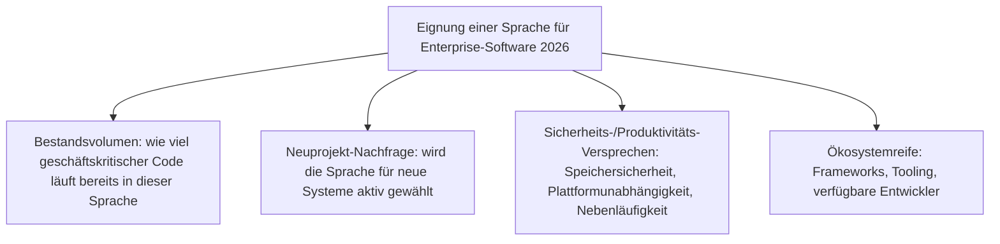
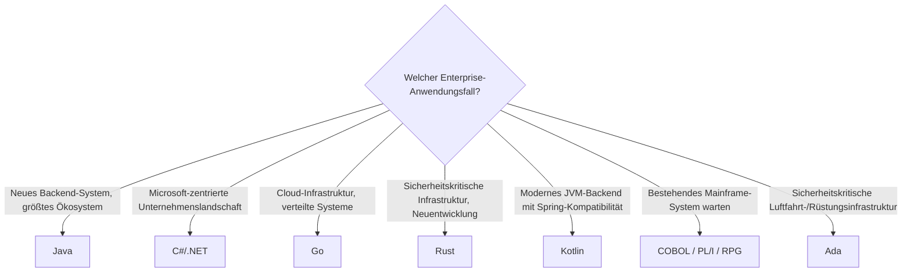

# Beste Programmiersprachen für Enterprise-Software — Top-10-Topliste

Die [Evolution und Architekturen digitaler Enterprise-Programmiersprachen](evolution-digitaler-enterprise-programmiersprachen.md) ordnet Sprachökosysteme chronologisch nach dem jeweiligen Sicherheits-/Produktivitäts-Versprechen ihrer Ära. Diese Seite dreht die Perspektive um: Sie rankt die zehn Sprachen, die in der Chronologie dokumentiert sind, nach ihrer **tatsächlichen Relevanz für Enterprise-Software heute (Stand: August 2026)** — unabhängig davon, in welcher historischen Generation sie entstanden.

!!! note "Hinweis: Zehn statt zwanzig Ränge"
    Anders als bei Software-Produkt-Toplisten dieses Repositories gibt es keine zwanzig sinnvoll unterscheidbaren Enterprise-Programmiersprachen — diese Liste bleibt bewusst bei den zehn Sprachen, die die zugrunde liegende Evolution-Chronologie tatsächlich behandelt, statt sachfremde Ergänzungen einzustreuen. Dasselbe Prinzip gilt bereits für [Beste Programmiersprachen für moderne Wissenssysteme (Top 10)](../wissen/dokumentation/programmiersprachen-wissenssysteme-topliste.md).

---

## Bewertungskriterien

!!! warning "Achtung: Bestandsvolumen ≠ Neuprojekt-Nachfrage"
    COBOL, PL/I und RPG (Rang 7–9) tragen bis heute enormes Bestandsvolumen in kritischer Infrastruktur, werden aber für Neuprojekte praktisch nie mehr gewählt — ihr Rang spiegelt Wartungsrelevanz wider, nicht Attraktivität für neue Systeme. Rust (Rang 4) verhält sich umgekehrt: geringes Bestandsvolumen, aber steilste Wachstumskurve bei Neuprojekten.

---

## Top 10 im Überblick

| Rang | Sprache | Ära/Generation | Typsystem | Besondere Stärke |
|---|---|---|---|---|
| 1 | **Java** | Generation 3 (Write once, run anywhere) | statisch, Bytecode/JVM | Größtes Bestandsvolumen und größte Neuprojekt-Nachfrage aller Enterprise-Sprachen zugleich |
| 2 | **C#** (.NET) | Generation 4 (Microsofts Enterprise-Ökosystem) | statisch, CIL/CLR | Dominant in Microsoft-zentrierten Unternehmenslandschaften, seit .NET Core plattformoffen |
| 3 | **Go** | Generation 5 (Cloud-natives Enterprise) | statisch, eingebaute Nebenläufigkeit | De-facto-Standard der Cloud-Infrastruktur selbst (Docker, Kubernetes), nicht nur der Anwendungen darüber |
| 4 | **Rust** | Generation 6 (Sicherheitskritisches Enterprise) | statisch, ownership-basiert | Steilste Wachstumskurve, gestützt durch US-Regierungsempfehlung 2024 und Linux-Kernel-Aufnahme 2022 |
| 5 | **Kotlin** | Generation 5 (Cloud-natives Enterprise) | statisch, null-sicher | Volle JVM-Interoperabilität, seit Spring 5 offiziell als Enterprise-Backend-Sprache unterstützt |
| 6 | **C++** | Generation 2 (Objektorientierte Systemsprachen) | statisch, manuelle Speicherverwaltung | Weiterhin Standard für Finanzhandelssysteme und performancekritische Infrastruktur |
| 7 | **COBOL** | Generation 1 (Mainframe-Business-Sprachen) | schwach geprüft, fachlich lesbar | Trägt bis heute Milliarden Zeilen produktiven Codes in Banken- und Versicherungs-Mainframes |
| 8 | **Ada** | Generation 2 (Sicherheitskritische Systemsprachen) | statisch, verpflichtend streng | Weiterhin vorgeschrieben in Rüstungs-, Luftfahrt- und Bahninfrastruktur |
| 9 | **PL/I** | Generation 1 (Mainframe-Business-Sprachen) | statisch | Nischenhafte, aber anhaltende Präsenz in IBM-Großrechner-Umgebungen |
| 10 | **RPG** | Generation 1 (Mainframe-Business-Sprachen) | statisch | Aktiv genutzt für Business-Logik auf IBM-i-Systemen (Nachfolger von AS/400) |

---

## Highlights im Detail

### Rang 1: Java bleibt in beiden Dimensionen ungeschlagen
Anders als bei den meisten Sprachen dieser Liste, bei denen entweder Bestandsvolumen oder Neuprojekt-Nachfrage dominiert, führt Java 2026 beide Kriterien gleichzeitig an — eine Kombination aus über 25 Jahren kontinuierlicher Enterprise-Adoption und einem weiterhin aktiven Ökosystem (Spring, Jakarta EE), das neue Projekte nicht von der Sprache abschreckt.

### Rang 4: Rust als einzige Sprache mit Regierungsrückenwind
Die [US-Regierungsempfehlung für speichersichere Sprachen (2024)](evolution-digitaler-enterprise-programmiersprachen.md#generation-6-rust-sicherheitskritisches-enterprise-ab-ca-2018) ist unter den zehn Sprachen dieser Liste ein Alleinstellungsmerkmal — kein anderer Kandidat hat ein vergleichbares politisches Signal für beschleunigte Enterprise-Adoption erhalten, seit Ada in Generation 2 verpflichtend für US-Rüstungsprojekte wurde.

### Rang 7–10: der „Bestandsvolumen ohne Neuwahl"-Cluster
COBOL, Ada, PL/I und RPG teilen ein gemeinsames Muster: Sie tragen weiterhin enorme geschäftskritische Last, werden aber für neue Systeme praktisch nie mehr aktiv gewählt — Wartung und Modernisierung bestehender Systeme treibt die Nachfrage nach diesen Sprachen, nicht Neuentwicklung.

---

## Entscheidungshilfe nach Anwendungsfall

---

## 🔗 Verwandte Themen

- [Startseite](../index.md) — zurück zur Dokumentations-Zentrale
- [Evolution und Architekturen digitaler Enterprise-Programmiersprachen](evolution-digitaler-enterprise-programmiersprachen.md) — chronologisches Generationenmodell, dessen aktuellen Stand diese Topliste zusammenfasst
- [Beste Programmiersprachen für moderne Wissenssysteme (Top 10)](../wissen/dokumentation/programmiersprachen-wissenssysteme-topliste.md) — analoges Sprachranking für Wikis/PKM/Docs statt allgemeiner Enterprise-Software
- [Rust in der Praxis](system/rust-praxis.md) — Vertiefung zu Rang 4
- [C++ Praxis-Handbuch](system/cpp-praxis.md) — Vertiefung zu Rang 6
- [Evolution und Architekturen digitaler Programmiersprachen](evolution-digitaler-programmiersprachen.md) — übergeordnetes, paradigmenorientiertes Generationenmodell
- [Evolution und Architekturen digitaler Rust-Wissenssysteme](../wissen/dokumentation/evolution-digitaler-rust-wissenssysteme.md) — Rust-Bausteine aus Rang 4 im Wissenssysteme-Kontext
