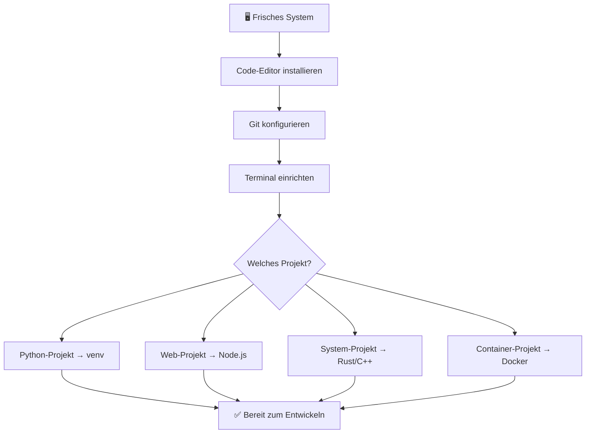
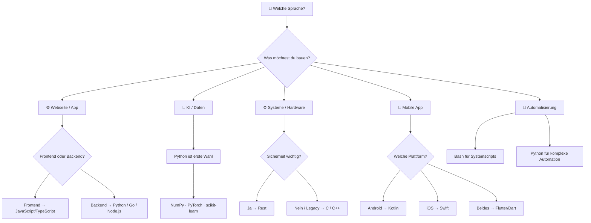

# Erste Schritte – Entwicklung

Willkommen in der Entwicklungsdokumentation! Diese Seite führt dich Schritt für Schritt durch alles, was du brauchst, um mit dem Programmieren anzufangen – von der Installation der Werkzeuge bis zur Wahl der richtigen Programmiersprache.

---

## :hammer_and_wrench: Installation – Was du zum Programmieren brauchst

Bevor du loslegen kannst, müssen einige grundlegende Werkzeuge auf deinem System installiert sein. Hier findest du alles, was für einen soliden Entwicklungs-Einstieg notwendig ist.

### 1. Code-Editor / IDE

Ein guter Editor ist das wichtigste Werkzeug. Empfehlungen:

| Editor / IDE | Beschreibung | Geeignet für |
|---|---|---|
| **Visual Studio Code** | Kostenlos, leichtgewichtig, sehr erweiterbar | Alle Sprachen |
| **JetBrains-Familie** | Professionelle IDEs (PyCharm, IntelliJ, CLion) | Python, Java, C++ |
| **Neovim** | Terminal-basiert, sehr schnell, konfigurierbar | Erfahrene Nutzer |
| **Zed** | Modern, schnell, KI-integriert | Alle Sprachen |

**VS Code installieren (Ubuntu/Debian):**

```bash
sudo apt update
sudo apt install wget gpg -y
wget -qO- https://packages.microsoft.com/keys/microsoft.asc | gpg --dearmor > packages.microsoft.gpg
sudo install -D -o root -g root -m 644 packages.microsoft.gpg /etc/apt/keyrings/packages.microsoft.gpg
echo "deb [arch=amd64 signed-by=/etc/apt/keyrings/packages.microsoft.gpg] https://packages.microsoft.com/repos/code stable main" | sudo tee /etc/apt/sources.list.d/vscode.list > /dev/null
sudo apt update
sudo apt install code -y
```

---

### 2. Git – Versionskontrolle

Git ist unverzichtbar für jedes Projekt. Es ermöglicht Versionskontrolle, Zusammenarbeit und Backup.

```bash
# Installation
sudo apt install git -y

# Grundkonfiguration
git config --global user.name "Dein Name"
git config --global user.email "deine@email.de"
git config --global init.defaultBranch main
```

!!! tip "SSH-Schlüssel für GitHub/GitLab"
    Richte einen SSH-Schlüssel ein, damit du dich nicht bei jedem Push anmelden musst:
    ```bash
    ssh-keygen -t ed25519 -C "deine@email.de"
    cat ~/.ssh/id_ed25519.pub
    ```
    Den angezeigten Schlüssel in deinem GitHub/GitLab-Konto unter **Settings → SSH Keys** eintragen.

---

### 3. Terminal & Shell

Eine komfortable Shell beschleunigt die tägliche Arbeit erheblich.

```bash
# Zsh installieren (empfohlen)
sudo apt install zsh -y

# Oh My Zsh – Plugins & Themes für Zsh
sh -c "$(curl -fsSL https://raw.githubusercontent.com/ohmyzsh/ohmyzsh/master/tools/install.sh)"
```

**Nützliche Tools für das Terminal:**

```bash
sudo apt install -y \
  curl wget htop tree \
  build-essential \
  unzip zip \
  jq          # JSON-Verarbeitung
```

---

### 4. Python-Umgebung

Python ist die vielseitigste Einstiegssprache und auf den meisten Linux-Systemen vorinstalliert.

```bash
# Python-Version prüfen
python3 --version

# Paketverwaltung mit pip
sudo apt install python3-pip python3-venv -y

# Virtuelle Umgebung anlegen (Best Practice!)
python3 -m venv .venv
source .venv/bin/activate
```

---

### 5. Node.js & npm

Node.js wird für JavaScript/TypeScript-Projekte, Frontend-Tools und viele CLI-Werkzeuge benötigt.

```bash
# Node.js via NVM installieren (empfohlen)
curl -o- https://raw.githubusercontent.com/nvm-sh/nvm/v0.39.7/install.sh | bash
source ~/.bashrc

# Aktuelle LTS-Version installieren
nvm install --lts
nvm use --lts

# Version prüfen
node --version
npm --version
```

---

### 6. Docker – Containerisierung

Docker ermöglicht isolierte Entwicklungsumgebungen und vereinfacht das Deployment enorm.

```bash
# Schnellinstallation
curl -fsSL https://get.docker.com | sudo sh

# Aktuellem Benutzer Docker-Rechte geben
sudo usermod -aG docker $USER
newgrp docker

# Test
docker run hello-world
```

---

---

### 8. Rust-Toolchain

Für Systemprogrammierung und leistungskritische Anwendungen ist Rust die moderne Wahl.

```bash
# Rust via rustup installieren
curl --proto '=https' --tlsv1.2 -sSf https://sh.rustup.rs | sh
source ~/.cargo/env

# Version prüfen
rustc --version
cargo --version
```

---

### Schnell-Checkliste



---

## :books: Welche Programmiersprache?

Die Wahl der richtigen Programmiersprache hängt stark vom Anwendungsbereich ab. Hier findest du eine strukturierte Übersicht der wichtigsten Sprachen und wann sie eingesetzt werden.

### Übersicht nach Anwendungsbereich

=== "Einsteiger"

    | Sprache | Stärken | Einsatz |
    |---|---|---|
    | **Python** | Einfache Syntax, riesiges Ökosystem | KI, Datenwissenschaft, Automatisierung, Web-Backend |
    | **JavaScript** | Läuft im Browser, schneller Einstieg | Web-Frontend, einfache Skripte |
    | **Scratch / Blockly** | Visuell, für absolute Anfänger | Einsteiger, Kinder, Bildung |

=== "Web-Entwicklung"

    | Sprache | Stärken | Einsatz |
    |---|---|---|
    | **JavaScript / TypeScript** | Standard im Web | Frontend (React, Vue), Backend (Node.js) |
    | **Python** | Elegant, viele Frameworks | Backend (Django, FastAPI, Flask) |
    | **PHP** | Weit verbreitet, günstig zu hosten | WordPress, traditionelles Web |
    | **Go (Golang)** | Schnell, einfaches Deployment | Hochperformante Web-APIs |

=== "Systemprogrammierung"

    | Sprache | Stärken | Einsatz |
    |---|---|---|
    | **Rust** | Speichersicher, keine GC, schnell | Betriebssysteme, Embedded, WASM |
    | **C** | Maximale Kontrolle, überall verfügbar | Betriebssystemkerne, Treiber, Mikrocontroller |
    | **C++** | OOP + Performance | Spieleentwicklung, Grafik, Systeme |
    | **Assembler** | Direkter Hardwarezugriff | Bootloader, Performance-kritische Routinen |

=== "KI & Datenwissenschaft"

    | Sprache | Stärken | Einsatz |
    |---|---|---|
    | **Python** | Unangefochten führend | Machine Learning, Deep Learning, Datenanalyse |
    | **R** | Statistische Auswertungen | Wissenschaft, Biostatistik |
    | **Julia** | Numerisch, Python-ähnliche Syntax | Wissenschaftliches Rechnen |

=== "Mobile Apps"

    | Sprache | Stärken | Einsatz |
    |---|---|---|
    | **Kotlin** | Modern, von JetBrains | Android-Entwicklung |
    | **Swift** | Apples offizielle Sprache | iOS/macOS-Apps |
    | **Dart (Flutter)** | Cross-Platform, eine Codebase | Android + iOS |

=== "Datenbanken & Scripting"

    | Sprache | Stärken | Einsatz |
    |---|---|---|
    | **SQL** | Standard für Datenbanken | Alle relationalen Datenbanken |
    | **Bash/Shell** | Direkt im Terminal | Automatisierung, DevOps, Skripte |
    | **Lua** | Leichtgewichtig, einbettbar | Spielemods, Konfiguration, Nginx |

---

### Entscheidungsbaum



---

### Lernpfad-Empfehlung

!!! info "Empfehlung für Einsteiger"
    Starte mit **Python**! Es hat die flachste Lernkurve, die größte Community und lässt sich für fast alle Aufgaben einsetzen – von Webentwicklung über KI bis hin zur Desktop-Automatisierung.

!!! tip "Nach Python: Was als Nächstes?"
    1. **JavaScript / TypeScript** → wenn dich Web-Entwicklung interessiert
    2. **Rust** → wenn du in Systemprogrammierung einsteigen möchtest
    3. **SQL** → für alle, die mit Daten arbeiten (immer sinnvoll!)

!!! note "Mehrsprachigkeit zahlt sich aus"
    Die meisten professionellen Entwickler beherrschen 2–4 Sprachen. Ein solides Fundament in einer Sprache macht das Erlernen der nächsten deutlich einfacher.

---

## Weiterführende Links

- [IDE & Entwicklungsumgebung einrichten](ide/setup.md)
- [Webentwicklung mit KI](webentwicklung/ki-webentwicklung.md)
- [Systemprogrammierung (Rust, C, C++)](system/rust-c-cpp-integration.md)
- [Assembler & Compiler](system/assembler.md)
- [KI-unterstütztes Programmieren lernen](../künstliche-intelligenz/coding/programmieren-lernen-ki.md)
