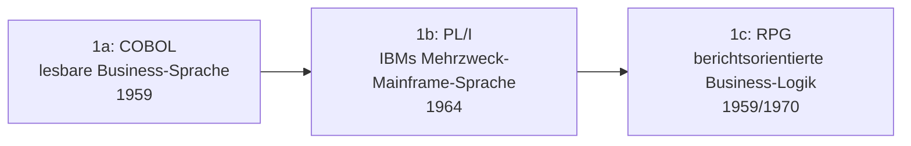

# Evolution und Architekturen digitaler Enterprise-Programmiersprachen

„Enterprise-tauglich" bedeutet in jeder Ära etwas anderes: Für Mainframe-Banking der 1960er hieß es Lesbarkeit für Fachabteilungen ohne Informatik-Ausbildung, für die Java-Ära hieß es „einmal geschrieben, überall lauffähig", für die Cloud-Ära heißt es eingebaute Nebenläufigkeit für tausende gleichzeitige Anfragen. Dieser Artikel ordnet die Sprachen, die sich jeweils als Standard für langlebige, geschäftskritische Software durchgesetzt haben, nach **technologischen Generationen** — von COBOL über C++, Java und C#/.NET bis zu Go, Kotlin und schließlich Rust. Er ist eine domänenspezifische Vertiefung von [Evolution und Architekturen digitaler Programmiersprachen](evolution-digitaler-programmiersprachen.md) mit Fokus auf Geschäftssoftware-Eignung statt allgemeiner Paradigmen-Geschichte; eine weitere Domänen-Vertiefung bietet [Evolution und Architekturen digitaler Programmiersprachen für Wissenssysteme](../wissen/dokumentation/evolution-digitaler-wissenssystem-programmiersprachen.md); die konkreten Web-Frameworks, die viele dieser Sprachen tragen, behandelt [Evolution und Architekturen digitaler Web-Frameworks](webentwicklung/evolution-digitaler-webframeworks.md).

!!! note "Hinweis: Generationen überlappen sich"
    Die Zeiträume sind grobe Orientierung, keine scharfen Grenzen — COBOL (Generation 1) läuft bis heute produktiv in Banken- und Versicherungs-Mainframes, parallel zu Rust-Rewrites (Generation 6) sicherheitskritischer Infrastruktur. Entscheidend ist das **Sicherheits-/Produktivitäts-Versprechen an Unternehmen** (Lesbarkeit, Speichersicherheit, Plattformunabhängigkeit, Nebenläufigkeit), nicht allein das Erscheinungsjahr.

---

## Generation 1: Mainframe-Business-Sprachen, 1959 – 1985

Die Gründergeneration eint ein Ziel: geschäftliche Datenverarbeitung (Buchhaltung, Lagerhaltung, Versicherungspolicen) lesbar genug zu machen, dass auch Fachabteilungen ohne Informatik-Hintergrund den Code prüfen können — Jahrzehnte vor dem Begriff „Enterprise Software". Sie lässt sich in drei technologische Entwicklungsstufen unterteilen:

### 1a. COBOL — die erste Business-Sprache, 1959

- **Architektur:** **CO**mmon **B**usiness-**O**riented **L**anguage, entwickelt vom CODASYL-Komitee (mit maßgeblichem Beitrag von Grace Hopper) — feste Datensatz-Formate, englisch-ähnliche Syntax (`MOVE`, `PERFORM`, `COMPUTE`) statt mathematischer Notation.
- **Bedeutung:** wird zur dominanten Sprache für Banken-, Versicherungs- und Behörden-Mainframes — Schätzungen zufolge laufen bis heute Milliarden Zeilen COBOL-Code produktiv in kritischer Finanzinfrastruktur.

### 1b. PL/I — IBMs Mehrzweck-Mainframe-Sprache, 1964

- **Architektur:** vereint Konzepte aus COBOL (Business-Datenverarbeitung) und FORTRAN (wissenschaftliches Rechnen) in einer einzigen Sprache für IBM-Mainframes.
- **Bedeutung:** setzt sich gegenüber COBOL nicht als neuer Standard durch, bleibt aber jahrzehntelang in IBM-Großrechner-Umgebungen im produktiven Einsatz.

### 1c. RPG — berichtsorientierte Business-Logik, 1959/1970

- **Architektur:** **R**eport **P**rogram **G**enerator, ursprünglich für IBM-Lochkarten-Berichte konzipiert, mit RPG II (1970) zu einer vollwertigen Business-Sprache für IBM-Midrange-Systeme (heute IBM i) ausgebaut.
- **Bedeutung:** zeigt bereits in dieser Frühphase eine Kernidee, die spätere Enterprise-Sprachen wiederholt aufgreifen — Spezialisierung auf ein enges, aber massenhaft wiederkehrendes Geschäftsproblem statt allgemeiner Programmierlogik.

---

## Generation 2: Objektorientierte & sicherheitskritische Systemsprachen, 1980 – 1995

Zwei parallele Antworten auf wachsende Softwarekomplexität: **C++** bringt Objektorientierung in performancekritische Unternehmenssysteme, **Ada** entsteht als Reaktion auf unkontrollierbar gewachsene, fehleranfällige Software in sicherheitskritischen Großprojekten.

**Architektur:** manuelle Speicherverwaltung (C++) versus vom Sprachdesign erzwungene Disziplin (Ada: verpflichtende Typprüfung, keine impliziten Konvertierungen) — beide statisch typisiert, aber mit gegensätzlicher Philosophie zu Kontrolle versus Sicherheit.

| Sprache | Jahr | Rolle |
|---|---|---|
| **C++** | 1985 | Bjarne Stroustrup erweitert C um Klassen und Objektorientierung — wird zur Standardsprache für Finanzhandelssysteme, Datenbank-Engines und performancekritische Unternehmensinfrastruktur. |
| **Ada** | 1980/1983 | Vom US-Verteidigungsministerium in Auftrag gegeben und für Jahrzehnte für Rüstungs- und Regierungsaufträge **vorgeschrieben** — striktes Typsystem soll Fehler bereits zur Kompilierzeit statt im laufenden Einsatz sichtbar machen, ein früher Vorläufer des Sicherheitsversprechens von Generation 6 dieses Artikels. |

---

## Generation 3: Java — „Write once, run anywhere", 1995 – 2005

Sun Microsystems löst das zentrale Problem der Vorgängergeneration: **plattformunabhängige** Ausführung über eine virtuelle Maschine statt für jede Zielplattform neu zu kompilieren — bei gleichzeitig automatischer Speicherverwaltung, die ganze Fehlerklassen von C++ (Speicherlecks, Dangling Pointers) strukturell ausschließt.

**Architektur:** Kompilierung zu plattformneutralem **Bytecode**, ausgeführt auf der **Java Virtual Machine (JVM)**, automatische Garbage Collection statt manueller `malloc`/`free`-Verwaltung.

| Baustein | Jahr | Rolle |
|---|---|---|
| **Java** | 1995 | Sun Microsystems prägt den Slogan „Write once, run anywhere" — ein einziges kompiliertes Programm läuft unverändert auf jeder JVM, unabhängig vom Betriebssystem. |
| **J2EE / Java EE** | 1999 | Standardisiert Enterprise-Bausteine (Servlets, Application-Server, Transaktionsmanagement) direkt auf Java-Basis. |
| **Spring Framework** | 2003 | Vereinfacht Java-Enterprise-Entwicklung gegenüber dem schwergewichtigen J2EE-Standard, siehe [Generation 1c der Server-Monolith-Zeitachse](webentwicklung/evolution-digitaler-monolith-frameworks.md#1c-enterprise-javanet-portal-architekturen-2002-2012). |

---

## Generation 4: C#/.NET — Microsofts Enterprise-Ökosystem, 2000 – 2015

Microsofts direkte Antwort auf Java — von Anders Hejlsberg (zuvor Turbo Pascal, später Chefarchitekt von TypeScript) entworfen, zunächst eng an Windows gebunden, später zum plattformübergreifenden Ökosystem gewandelt.

**Architektur:** Kompilierung zu **Common Intermediate Language (CIL)**, ausgeführt auf der **Common Language Runtime (CLR)** — dasselbe Grundprinzip wie Javas JVM-Bytecode, zunächst jedoch nur unter Windows lauffähig.

| Baustein | Jahr | Rolle |
|---|---|---|
| **C# / .NET Framework** | 2000/2002 | Tief in Windows-Server-, Active-Directory- und SQL-Server-Infrastruktur integriert — siehe [ASP.NET Web Forms in Generation 1c der Server-Monolith-Zeitachse](webentwicklung/evolution-digitaler-monolith-frameworks.md#1c-enterprise-javanet-portal-architekturen-2002-2012). |
| **.NET Core** | 2016 | Vollständiger Open-Source-Rewrite, plattformunabhängig (Linux/macOS/Windows) — löst die Windows-Bindung der Vorgängerversion. |

---

## Generation 5: Go & Kotlin — Cloud-natives Enterprise, ab 2009

Enterprise-Software verlagert sich von Application-Servern in eigenen Rechenzentren zu verteilten Cloud-Diensten — beide Sprachen dieser Generation reagieren direkt auf diesen Architekturwandel, jede aus einer anderen Richtung.

**Architektur:** eingebaute, leichtgewichtige Nebenläufigkeit ohne externe Threading-Bibliotheken (Go), volle Interoperabilität mit bestehendem JVM-Enterprise-Code bei modernerer Sprachsyntax (Kotlin).

| Sprache | Jahr | Rolle |
|---|---|---|
| **Go** | 2009 | Von Google für massiv verteilte Systeme entworfen — **Goroutinen** machen Nebenläufigkeit zum Sprach-Primitiv statt Bibliotheksfunktion. **Docker** (2013) und **Kubernetes** (2014) — beide in Go geschrieben — machen Go zur De-facto-Sprache der Cloud-Infrastruktur selbst. |
| **Kotlin** | 2011 | Von JetBrains als moderne, null-sichere JVM-Alternative zu Java entworfen — seit **Spring 5** (2017) offiziell als Enterprise-Backend-Sprache unterstützt, koexistiert damit direkt mit Java statt es abzulösen. |

---

## Generation 6: Rust — sicherheitskritisches Enterprise, ab ca. 2018

Speichersicherheitsfehler (Buffer Overflows, Use-after-free) bleiben trotz Generation 3–5 eine der häufigsten Schwachstellenklassen in kritischer Infrastruktur — Rust schließt diese Lücke **zur Kompilierzeit**, ohne den Laufzeit-Overhead einer Garbage Collection wie Java/C#/Go.

**Architektur:** **Ownership-Modell** mit Borrow-Checker — der Compiler beweist Speichersicherheit und Datenrennfreiheit bereits vor der Ausführung, statt sie durch Laufzeitprüfung oder Garbage Collection sicherzustellen. Vertiefung zur Sprache selbst: [Rust in der Praxis](system/rust-praxis.md).

| Meilenstein | Jahr | Bedeutung |
|---|---|---|
| **AWS Firecracker** | 2018 | Amazons leichtgewichtige VM-Technologie hinter AWS Lambda, vollständig in Rust — frühes Signal für Rust-Vertrauen in geschäftskritischer Cloud-Infrastruktur. |
| **Rust im Linux-Kernel** | 2022 | Aufnahme von Rust als zweite Kernel-Implementierungssprache neben C — ein Meilenstein für Rusts Reife in traditionell C-dominierter Systemsoftware. |
| **US-Regierungsempfehlung für speichersichere Sprachen** | 2024 | Das Office of the National Cyber Director (ONCD) empfiehlt explizit den Umstieg auf speichersichere Sprachen wie Rust für kritische Infrastruktur — ein Echo von Adas verpflichtender Sicherheitsrolle aus Generation 2 dieses Artikels, diesmal als Empfehlung statt Vorschrift. |

!!! tip "Bezug zur Wissenssysteme-Achse"
    Dieselbe Rust-Generation treibt auch die Wissenssystem-Bausteine aus [Generation 6 der Rust-Wissenssysteme-Zeitachse](../wissen/dokumentation/evolution-digitaler-rust-wissenssysteme.md) — Speichersicherheit ohne Garbage-Collector-Pausen ist dort ebenso entscheidend wie in klassischer Enterprise-Infrastruktur.

---

## Alternative Sortier- & Klassifikationskriterien für Enterprise-Programmiersprachen

Neben dem chronologischen Generationenmodell lassen sich diese Sprachen nach folgenden Dimensionen einordnen:

### 1. Speicherverwaltung

- **Manuell** — C++ (Generation 2): volle Kontrolle, aber fehleranfällig bei großer Codebasis.
- **Automatisch (Garbage Collection)** — Java, C#, Go, Kotlin (Generation 3–5): entlastet Entwickler, aber Laufzeit-Pausen möglich.
- **Ownership-basiert zur Kompilierzeit** — Rust (Generation 6): Sicherheit ohne GC-Overhead.

### 2. Plattformbindung

- **Mainframe-/Hersteller-gebunden** — COBOL, PL/I, RPG (Generation 1): läuft primär auf spezifischer Großrechner-Hardware.
- **Herstellergebunden, später geöffnet** — C#/.NET Framework zunächst Windows-exklusiv, seit .NET Core plattformoffen (Generation 4).
- **Von Anfang an plattformneutral** — Java (JVM), Go, Rust (Generation 3, 5, 6).

### 3. Nebenläufigkeitsmodell

- **Keine native Nebenläufigkeit** — COBOL, frühes C++ (Generation 1–2): sequenzielle Batch-Verarbeitung als Normalfall.
- **Thread-basiert über Bibliotheken** — Java, C# (Generation 3–4).
- **Eingebautes Concurrency-Primitiv** — Gos Goroutinen (Generation 5), Rusts Ownership-abgesicherte Async-Runtime (Generation 6).

### 4. Typsystem-Strenge

- **Fachlich lesbar, schwach geprüft** — COBOL (Generation 1).
- **Statisch, aber mit vielen Escape-Hatches** — C++ (Generation 2).
- **Statisch und durchgängig erzwungen** — Ada, Java, C#, Kotlin, Rust (Generation 2–6).

---

## Verwandte Themen

- [Beste Programmiersprachen für Enterprise-Software (Top 10)](enterprise-programmiersprachen-topliste.md) — aktuelle Top-10-Topliste, die diese Chronologie in eine Momentaufnahme 2026 übersetzt
- [Produktionsreife Enterprise-Programmiersprachen nach Generation (Top 8)](produktionsreife-enterprise-programmiersprachen-generationen-2026-topliste.md) — dieses Generationenmodell durch das konservative Fünf-Filter-Sieb; fast jede Generation trifft (COBOL, C++, Ada, Java, C#, Go, Kotlin, Rust), PL/I und RPG fallen an der fehlenden offenen Implementierung
- [Evolution und Architekturen digitaler Programmiersprachen](evolution-digitaler-programmiersprachen.md) — übergeordnetes, paradigmenorientiertes Generationenmodell, dessen Geschäftssoftware-Perspektive dieser Artikel vertieft
- [Evolution und Architekturen digitaler Programmiersprachen für Wissenssysteme](../wissen/dokumentation/evolution-digitaler-wissenssystem-programmiersprachen.md) — analoges Sprachökosystem-Generationenmodell für Wikis, PKM- und Docs-Systeme statt allgemeiner Enterprise-Software
- [Evolution und Architekturen digitaler Web-Frameworks](webentwicklung/evolution-digitaler-webframeworks.md) — Frameworks, die viele hier genannten Sprachen im Web-Kontext tragen
- [Evolution und Architekturen digitaler Server-Monolith-Frameworks](webentwicklung/evolution-digitaler-monolith-frameworks.md) — Spring Framework und ASP.NET Web Forms als konkrete Frameworks aus Generation 3/4 dieses Artikels
- [Evolution und Architekturen digitaler Enterprise-Web-Frameworks](webentwicklung/evolution-digitaler-enterprise-webframeworks.md) — vertiefendes Framework-Generationenmodell auf Basis der Sprachen aus Generation 3/4 dieses Artikels
- [Evolution und Architekturen digitaler Enterprise-UI-Bibliotheken](webentwicklung/evolution-digitaler-enterprise-ui-bibliotheken.md) — Telerik/Kendo UI, Syncfusion und DevExpress als .NET-Vendoren aus Generation 4 dieses Artikels
- [Evolution und Architekturen digitaler Programmierparadigmen](evolution-digitaler-programmierparadigmen.md) — Java, Go und Kotlin aus diesem Artikel als Vertreter des objektorientierten (Generation 3) bzw. nebenläufigen Paradigmas (Generation 5) dort
- [Evolution und Architekturen digitaler Batteries-Included-Web-Frameworks](webentwicklung/evolution-digitaler-batteries-included-frameworks.md) — Vollausstattungs-Philosophie quer über mehrere hier genannte Sprachen
- [Evolution und Architekturen digitaler Rust-Wissenssysteme](../wissen/dokumentation/evolution-digitaler-rust-wissenssysteme.md) — Rust-Bausteine aus Generation 6 dieses Artikels im Wissenssysteme-Kontext
- [C++ Praxis-Handbuch](system/cpp-praxis.md) — Vertiefung zu Generation 2 dieses Artikels
- [Rust Praxis-Handbuch](system/rust-praxis.md) — Vertiefung zu Generation 6 dieses Artikels
- [Evolution und Architekturen digitaler Compiler](system/evolution-digitaler-compiler.md) — Mojo/MLIR aus Generation 6 dieses Artikels als parallele KI-native Compiler-Generation zu Rust
- [Erste Schritte – Entwicklung](erste-schritte.md) — Einstieg in die Sprachwahl für Einsteiger
