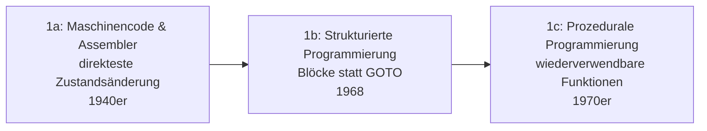

# Evolution und Architekturen digitaler Programmierparadigmen

[Evolution und Architekturen digitaler Programmiersprachen](evolution-digitaler-programmiersprachen.md) ordnet konkrete Sprachen chronologisch nach Erscheinungsjahr — dieser Artikel nimmt die entgegengesetzte Perspektive ein: er ordnet die **abstrakten Berechnungsmodelle** selbst danach, wann sie erstmals als eigenständiges, benanntes Paradigma formalisiert wurden, unabhängig davon, welche einzelne Sprache sie später am prominentesten umsetzt. Ein Paradigma beantwortet dabei die Grundfrage „Wie beschreibt der Code, was berechnet werden soll?" — durch explizite Zustandsänderung, durch Zielbeschreibung ohne Ablaufsteuerung, durch gekapselte Objekte, durch seiteneffektfreie Funktionen, durch kommunizierende nebenläufige Einheiten oder durch reaktive Datenströme. Viele Sprachen tauchen in mehreren Generationen dieses Artikels wieder auf, weil sie mehrere Paradigmen gleichzeitig unterstützen — anders als in der strikt chronologischen Sprachen-Zeitachse.

!!! note "Hinweis: Paradigmen schließen sich nicht gegenseitig aus"
    Die Zeiträume sind grobe Orientierung, keine scharfen Grenzen — moderne Sprachen wie Rust oder Scala vereinen bewusst mehrere Paradigmen aus verschiedenen Generationen in einer einzigen Sprache. Entscheidend ist das **Berechnungsmodell** (wie Zustand und Kontrollfluss organisiert sind), nicht eine exklusive Zuordnung „eine Sprache, ein Paradigma".

---

## Generation 1: Imperativ — direkte Zustandsänderung, ab 1940er

Das älteste und bis heute am weitesten verbreitete Paradigma: ein Programm ist eine Folge von Anweisungen, die den Programmzustand (Werte im Speicher) explizit Schritt für Schritt verändern. Es lässt sich in drei technologische Entwicklungsstufen unterteilen:

### 1a. Maschinencode & Assembler — direkteste Zustandsänderung, 1940er

- **Architektur:** jede Instruktion verändert Register oder Speicherzellen unmittelbar, ohne jede Abstraktionsschicht, siehe [Generation 1 der allgemeinen Programmiersprachen-Zeitachse](evolution-digitaler-programmiersprachen.md#generation-1-maschinencode-assembler-1940er-1950er).
- **Bedeutung:** die Urform des imperativen Paradigmas — jedes spätere imperative Konzept ist eine Abstraktion über genau diesem Grundprinzip.

### 1b. Strukturierte Programmierung — Blöcke statt GOTO, 1968

- **Architektur:** Edsger Dijkstras einflussreicher Brief „Go To Statement Considered Harmful" (1968) prägt die Bewegung hin zu Blockstrukturen (`if`/`while`/`for`) statt unstrukturierter Sprunganweisungen.
- **Bedeutung:** macht Kontrollfluss erstmals nachvollziehbar analysierbar, statt beliebig verschachtelter Sprünge — die direkte Grundlage von Algol 60s Blockstruktur, siehe [Generation 2 der allgemeinen Programmiersprachen-Zeitachse](evolution-digitaler-programmiersprachen.md#generation-2-fruhe-hochsprachen-fortran-lisp-algol-1957-1960er).

### 1c. Prozedurale Programmierung — wiederverwendbare Funktionen, 1970er

- **Architektur:** benannte Prozeduren/Funktionen mit eigenen lokalen Variablen kapseln wiederkehrende Anweisungsfolgen, statt Code zu duplizieren.
- **Vertreter:** C, Pascal — siehe [Generation 3 der allgemeinen Programmiersprachen-Zeitachse](evolution-digitaler-programmiersprachen.md#generation-3-strukturierte-objektorientierte-sprachen-1970er-1980er) für die Sprachen selbst.

---

## Generation 2: Deklarativ & Logisch — was statt wie, ab 1972

Statt den Lösungsweg Schritt für Schritt vorzuschreiben, beschreibt diese Generation nur das **gewünschte Ergebnis** — eine Inferenz-Engine oder ein Abfrage-Optimierer entscheidet selbst, wie sie dorthin gelangt.

**Architektur:** Fakten und Regeln (Logikprogrammierung) oder eine Zielmenge (Abfragesprachen) als Eingabe, ein eingebauter Lösungsmechanismus (Unifikation mit Backtracking, Abfrageoptimierung) statt expliziter Kontrollflussanweisungen des Programmierers.

| Sprache/System | Jahr | Prinzip |
|---|---|---|
| **Prolog** | 1972 | Alain Colmerauer & Robert Kowalski — Programme bestehen aus Fakten und Regeln, Anfragen werden per Unifikation und Backtracking automatisch gelöst; prägende Sprache der Expertensystem-Ära, siehe [Generation 1 der Expertensysteme-Zeitachse](../künstliche-intelligenz/evolution-digitaler-expertensysteme.md). |
| **SQL** | 1974 | Donald Chamberlin & Raymond Boyce, IBM — beschreibt die gewünschte Ergebnismenge einer Datenbankabfrage, der Datenbank-Optimierer wählt selbstständig den effizientesten Ausführungsplan. |

---

## Generation 3: Objektorientiert — Zustand und Verhalten gekapselt, ab 1972

Daten (Zustand) und die Operationen darauf (Verhalten) werden zu einer einzigen Einheit — dem Objekt — zusammengefasst, statt Daten und Funktionen getrennt zu halten wie in Generation 1.

**Architektur:** drei tragende Säulen definieren das Paradigma — **Kapselung** (interner Zustand nur über definierte Schnittstellen erreichbar), **Vererbung** (neue Objekttypen erweitern bestehende) und **Polymorphie** (derselbe Aufruf verhält sich je nach konkretem Objekttyp unterschiedlich).

| Sprache | Jahr | Rolle |
|---|---|---|
| **Smalltalk** | 1972/1980 | Reinste Umsetzung des Paradigmas — „alles ist ein Objekt", Kommunikation ausschließlich über Nachrichten, siehe [Generation 3 der allgemeinen Programmiersprachen-Zeitachse](evolution-digitaler-programmiersprachen.md#generation-3-strukturierte-objektorientierte-sprachen-1970er-1980er). |
| **C++, Java, Kotlin** | 1985/1995/2011 | Verschmelzen Objektorientierung mit anderen Paradigmen statt sie rein umzusetzen — siehe [Generation 3 der Enterprise-Programmiersprachen-Zeitachse](evolution-digitaler-enterprise-programmiersprachen.md#generation-3-java-write-once-run-anywhere-1995-2005) für deren Enterprise-Rolle. |

---

## Generation 4: Funktional — Berechnung ohne Seiteneffekte, ab 1958

Berechnung wird als Auswertung mathematischer Funktionen verstanden, nicht als Folge von Zustandsänderungen — **unveränderliche Werte** und **Seiteneffekt-freie Funktionen** ersetzen den veränderlichen Zustand aus Generation 1.

**Architektur:** Funktionen als „First-Class Citizens" (übergebbar wie Daten), Unveränderlichkeit (Immutability) als Standardfall, Ergebnis einer Funktion hängt ausschließlich von ihren Eingaben ab — keine verdeckten globalen Zustandsänderungen.

| Sprache | Jahr | Rolle |
|---|---|---|
| **Lisp** | 1958 | Erste Sprache mit Funktionen als Datenwerten, siehe [Generation 2 der allgemeinen Programmiersprachen-Zeitachse](evolution-digitaler-programmiersprachen.md#generation-2-fruhe-hochsprachen-fortran-lisp-algol-1957-1960er). |
| **Haskell, Clojure** | 1990/2007 | Rein funktional (Haskell) bzw. moderner Lisp-Dialekt (Clojure), siehe [Generation 5 der allgemeinen Programmiersprachen-Zeitachse](evolution-digitaler-programmiersprachen.md#generation-5-funktionale-renaissance-1990er-heute). |

---

## Generation 5: Nebenläufig & Aktorbasiert — kommunizierende Prozesse, ab 1973

Statt eines einzigen, sequenziellen Kontrollflusses koordiniert diese Generation mehrere **gleichzeitig laufende Einheiten** — mit zwei konkurrierenden theoretischen Modellen, wie diese Einheiten miteinander kommunizieren sollen.

**Architektur:** entweder isolierte **Aktoren**, die ausschließlich über asynchrone Nachrichten kommunizieren und niemals Speicher teilen (Actor Model), oder synchronisierte **Kanäle**, über die nebenläufige Prozesse Werte austauschen (CSP) — beide vermeiden geteilten, gleichzeitig veränderbaren Speicher als Fehlerquelle.

| Modell/System | Jahr | Prinzip |
|---|---|---|
| **Actor Model** (Theorie) | 1973 | Carl Hewitt (MIT) — formales mathematisches Modell nebenläufiger Berechnung: Aktoren empfangen Nachrichten, verändern nur ihren eigenen Zustand und erzeugen bei Bedarf neue Aktoren. |
| **Erlang** | 1986 | Erste breite praktische Umsetzung des Actor Model, siehe [Generation 5 der Batteries-Included-Zeitachse](webentwicklung/evolution-digitaler-batteries-included-frameworks.md#generation-5-batterien-jenseits-von-rubypythonjs-elixir-rust-ab-2014) für Phoenix/Elixir als direkten Nachfolger. |
| **Communicating Sequential Processes (CSP)** (Theorie) | 1978 | Tony Hoare — alternatives Modell: Prozesse kommunizieren über explizite, synchronisierte Kanäle statt asynchroner Nachrichten an Aktoren. |
| **Go** | 2009 | Goroutinen und Channels setzen CSP direkt um, siehe [Generation 5 der Enterprise-Programmiersprachen-Zeitachse](evolution-digitaler-enterprise-programmiersprachen.md#generation-5-go-kotlin-cloud-natives-enterprise-ab-2009). |

---

## Generation 6: Reaktiv & Dataflow — Datenströme statt Kontrollfluss, ab 1997

Statt Kontrollfluss zu beschreiben, beschreibt diese Generation **Datenflüsse**: Werte werden als sich über Zeit ändernde Ströme modelliert, abhängige Berechnungen aktualisieren sich automatisch, wenn sich eine Quelle ändert — statt dass der Programmierer jede Aktualisierung manuell auslöst.

**Architektur:** Werte als **Observables**/**Signals** statt einmaliger Variablen, automatische Neuberechnung abhängiger Ausdrücke bei Änderung der Quelle, deklarative Verkettung von Datenstrom-Transformationen statt imperativer Event-Handler-Ketten.

| Baustein | Jahr | Rolle |
|---|---|---|
| **Functional Reactive Programming (FRP)** (Theorie) | 1997 | Conal Elliott & Paul Hudak — akademische Formalisierung reaktiver Datenströme als funktionale Werte. |
| **ReactiveX/RxJS** | 2009/2012 | Erik Meijer (Microsoft, ursprünglich Rx.NET) — Observable-Streams als wiederverwendbares Bibliothekskonzept, u. a. Kernbestandteil von Angular, siehe [Generation 5 der SPA-Frameworks-Zeitachse](webentwicklung/evolution-digitaler-spa-frameworks.md#generation-5-angular-2-kompletter-rewrite-2016). |
| **Elm** | 2012 | Evan Czaplicki — eigene Sprache rund um unidirektionalen reaktiven Datenfluss („The Elm Architecture"), beeinflusst später React/Redux. |
| **Fine-grained Signals** | 2010er | Gezielte Aktualisierung einzelner abhängiger Werte statt ganzer Komponentenbäume, siehe [Reaktivitätsmodell in den Web-Frameworks-Klassifikationskriterien](webentwicklung/evolution-digitaler-webframeworks.md#4-reaktivitatsmodell). |

---

## Alternative Sortier- & Klassifikationskriterien für Programmierparadigmen

Neben dem chronologischen Generationenmodell lassen sich Paradigmen nach folgenden Dimensionen einordnen:

### 1. Zustandsmodell

- **Veränderlicher, geteilter Zustand** — imperativ (Generation 1).
- **Gekapselter Objektzustand** — objektorientiert (Generation 3).
- **Unveränderliche Werte** — funktional (Generation 4).
- **Isolierter Aktor-Zustand** — nebenläufig/Actor Model (Generation 5).

### 2. Kontrollflussmodell

- **Explizite Anweisungsfolge** — imperativ, prozedural (Generation 1).
- **Zielbeschreibung ohne Ablaufsteuerung** — deklarativ/logisch (Generation 2).
- **Datenfluss-getrieben** — reaktiv (Generation 6).

### 3. Nebenläufigkeitsstrategie

- **Kein eingebautes Modell** — klassisch imperativ/objektorientiert, Nebenläufigkeit nur über externe Bibliotheken (Generation 1, 3).
- **Message-Passing zwischen isolierten Einheiten** — Actor Model (Generation 5).
- **Synchronisierte Kanäle** — CSP (Generation 5).

### 4. Mehrfachparadigmen-Fähigkeit

- **Einem Paradigma verpflichtet** — Prolog (rein logisch), Haskell (rein funktional).
- **Bewusste Multi-Paradigmen-Sprache** — Python, Scala, Rust unterstützen imperative, objektorientierte und funktionale Konstrukte gleichzeitig.

---

## Verwandte Themen

- [Beste Sprachen zur Umsetzung der Programmierparadigmen (Top 10)](programmierparadigmen-sprachen-topliste.md) — aktuelle Top-10-Topliste, die diese Chronologie in eine Momentaufnahme 2026 übersetzt
- [Produktionsreife Sprachen der Programmierparadigmen nach Generation (Top 4)](produktionsreife-programmierparadigmen-sprachen-generationen-2026-topliste.md) — dieses Generationenmodell durch das konservative Fünf-Filter-Sieb; nur imperativ (C), deklarativ (SQL), OO (C++/Java) und nebenläufig (Go) haben einen Sprach-Treffer — funktional und reaktiv leben als Feature bzw. Bibliothek weiter
- [Evolution und Architekturen digitaler Programmiersprachen](evolution-digitaler-programmiersprachen.md) — komplementäre, sprachen-chronologische Perspektive auf dieselben Paradigmen
- [Evolution und Architekturen digitaler Enterprise-Programmiersprachen](evolution-digitaler-enterprise-programmiersprachen.md) — Java, Go und Kotlin aus diesem Artikel im Enterprise-Kontext vertieft
- [Evolution und Architekturen digitaler Programmiersprachen für Wissenssysteme](../wissen/dokumentation/evolution-digitaler-wissenssystem-programmiersprachen.md) — Clojure und Erlang/Elixir aus diesem Artikel im Wissenssysteme-Kontext vertieft
- [Evolution und Architekturen digitaler Batteries-Included-Web-Frameworks](webentwicklung/evolution-digitaler-batteries-included-frameworks.md) — Phoenix/Elixir als konkrete Anwendung des Actor Model aus Generation 5 dieses Artikels
- [Evolution und Architekturen digitaler Web-Frameworks](webentwicklung/evolution-digitaler-webframeworks.md) — Signals/Reaktivitätsmodell-Klassifikation als konkrete Anwendung von Generation 6 dieses Artikels
- [Evolution und Architekturen digitaler SPA-Frameworks](webentwicklung/evolution-digitaler-spa-frameworks.md) — RxJS in Angular als konkrete Anwendung aus Generation 6 dieses Artikels
- [Evolution und Architekturen digitaler Expertensysteme](../künstliche-intelligenz/evolution-digitaler-expertensysteme.md) — Prolog als prägende Sprache dieser Ära, siehe Generation 2 dieses Artikels
- [Evolution und Architekturen digitaler Interpreter](system/evolution-digitaler-interpreter.md) — Ausführungsarchitekturen, die diese Paradigmen jeweils zur Laufzeit umsetzen
