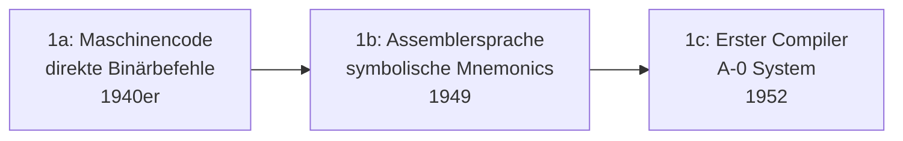

# Evolution und Architekturen digitaler Programmiersprachen

Jede Programmiersprache ist eine Antwort auf ein Ausdrucksproblem: wie sich menschliche Absicht so in Text fassen lässt, dass eine Maschine sie ausführt — und jede Generation verschiebt, wie viel davon der Compiler/Interpreter übernimmt statt des Menschen. Dieser Artikel ordnet Programmiersprachen nach **Paradigmen-Generationen**: von rohem Maschinencode über die ersten Hochsprachen, strukturierte und objektorientierte Sprachen, die Skriptsprachen-Ära bis zur funktionalen Renaissance und schließlich modernen Systemsprachen, die Lehren aus allen Vorgängern verschmelzen. Zwei domänenspezifische Vertiefungen wenden dieses Generationenmodell auf konkrete Software-Kategorien an: [Evolution und Architekturen digitaler Enterprise-Programmiersprachen](evolution-digitaler-enterprise-programmiersprachen.md) (Geschäftssoftware-Eignung) und [Evolution und Architekturen digitaler Programmiersprachen für Wissenssysteme](../wissen/dokumentation/evolution-digitaler-wissenssystem-programmiersprachen.md) (Wiki-/PKM-/Docs-Werkzeuge).

!!! note "Hinweis: Generationen überlappen sich"
    Die Zeiträume sind grobe Orientierung, keine scharfen Grenzen — Lisp (Generation 2) beeinflusst bis heute Clojure (Generation 5), C (Generation 3) läuft weiterhin praktisch überall im Hintergrund. Entscheidend ist das **Paradigma** (wie Berechnung ausgedrückt wird — Maschinenbefehl, Formel, Objekt, Skript, Funktion, Synthese), nicht allein das Erscheinungsjahr.

---

## Generation 1: Maschinencode & Assembler, 1940er – 1950er

Die Gründergeneration eint ein Merkmal: **kein Abstraktionsschritt** zwischen Sprache und Hardware — jeder Befehl entspricht direkt einer physikalischen Operation der Maschine. Sie lässt sich in drei technologische Entwicklungsstufen unterteilen:

### 1a. Maschinencode — direkte Binärbefehle, 1940er

- **Architektur:** frühe Rechner wie der **Manchester Baby** (1948, erster Computer mit gespeichertem Programm) werden direkt in Binärcode oder über physische Verdrahtung/Schalter programmiert — keine symbolische Repräsentation, jede Änderung erfordert Handarbeit auf Hardware-Ebene.
- **Fokus:** die Maschine überhaupt zum Ausführen einer Folge von Operationen zu bringen, noch keinerlei Komfort für den Menschen.

### 1b. Assemblersprache — symbolische Mnemonics, 1949

- **Architektur:** symbolische Kürzel (`ADD`, `MOV`, `JMP`) ersetzen rohe Binärcodes, ein **Assembler** übersetzt diese mechanisch 1:1 in Maschinenbefehle — die **EDSAC**-„Initial Orders" (1949, Cambridge) zählen zu den ersten praktischen Umsetzungen.
- **Fokus:** menschliche Lesbarkeit für denselben Maschinenbefehlssatz, ohne die Ein-Befehl-zu-eins-Übersetzung aufzugeben. Vertiefung zur Sprachfamilie: [Assembler-Grundlagen](system/assembler.md).

### 1c. Erster Compiler — Grace Hoppers A-0 System, 1952

- **Architektur:** das **A-0 System** (Grace Hopper, 1952) übersetzt erstmals symbolische mathematische Notation in Maschinencode, statt Befehl für Befehl 1:1 zu übertragen — der entscheidende konzeptionelle Sprung zu Generation 2.
- **Bedeutung:** etabliert die Idee, dass eine Sprache abstrakter sein darf als die Zielhardware, solange ein Übersetzungsprogramm die Lücke schließt.

---

## Generation 2: Frühe Hochsprachen — Fortran, Lisp, Algol, 1957 – 1960er

Drei Sprachen prägen innerhalb weniger Jahre grundverschiedene Zweige der gesamten späteren Sprachlandschaft — wissenschaftliches Rechnen, symbolische Verarbeitung und strukturierte Syntax.

**Architektur:** ein vollständiger **Compiler** übersetzt eine für Menschen lesbare, domänennahe Notation einmalig in Maschinencode, statt dass der Mensch weiterhin in Maschinennähe denkt.

| Sprache | Jahr | Rolle |
|---|---|---|
| **Fortran** | 1957 | IBM/John Backus — „**For**mula **Tran**slation", erste breit eingesetzte Hochsprache, für wissenschaftliches/numerisches Rechnen konzipiert. |
| **Lisp** | 1958 | John McCarthy, MIT — führt symbolische Verarbeitung, Rekursion und die Liste als universelle Datenstruktur ein; direkter konzeptioneller Vorfahre der funktionalen Sprachen aus Generation 5. |
| **Algol** | 1958/1960 | Internationales Komitee — formalisiert Blockstruktur und Syntax über die **Backus-Naur-Form (BNF)**; direkter struktureller Vorfahre praktisch aller späteren imperativen Sprachen (C, Pascal und damit indirekt Generation 3). |

---

## Generation 3: Strukturierte & Objektorientierte Sprachen, 1970er – 1980er

Zwei parallele Weiterentwicklungen von Algols Blockstruktur: **C** bringt strukturierte Programmierung in die Systemebene, **Smalltalk** erfindet Objektorientierung als eigenständiges Paradigma — beide zusammen prägen **C++** als Synthese.

**Architektur:** benannte Prozeduren/Funktionen statt Sprunganweisungen (`GOTO`) als Kontrollfluss-Grundeinheit (strukturiert), im zweiten Schritt Objekte mit Zustand und Nachrichtenaustausch statt reiner Funktionsaufrufe (objektorientiert).

| Sprache | Jahr | Rolle |
|---|---|---|
| **C** | 1972 | Dennis Ritchie, Bell Labs — strukturierte Programmierung auf Systemebene, portabel durch Kompilierung für verschiedene Architekturen; **Unix** wird 1973 in C neu geschrieben und macht C zur dominanten Systemsprache. Vertiefung: [C in der Praxis](system/c-praxis.md). |
| **Smalltalk** | 1972/1980 | Alan Kay u. a., Xerox PARC — reine Objektorientierung („alles ist ein Objekt", Nachrichtenaustausch statt Funktionsaufruf), gemeinsam mit dem grafischen Desktop-Interface entwickelt. |
| **C++** | 1985 | Bjarne Stroustrup — verschmilzt C mit Smalltalk-inspirierter Objektorientierung; die Enterprise-Rolle dieser Sprache vertieft [Generation 2 der Enterprise-Programmiersprachen-Zeitachse](evolution-digitaler-enterprise-programmiersprachen.md#generation-2-objektorientierte-sicherheitskritische-systemsprachen-1980-1995). |

---

## Generation 4: Skriptsprachen — Perl, Python, Ruby, PHP, JavaScript, 1987 – 2000er

Der Fokus kehrt sich um: statt maximaler Ausführungs-Effizienz auf knapper Hardware zählt jetzt **Entwicklerzeit** — interpretierte Sprachen mit dynamischer Typisierung erlauben schnelles Schreiben und Ändern von Code, auf Kosten reiner Laufzeitgeschwindigkeit.

**Architektur:** Interpretation statt vorheriger Ahead-of-time-Kompilierung (oder Just-in-Time-Kompilierung als Mittelweg), dynamische statt statischer Typisierung, oft mit eingebauten Hochsprachen-Datenstrukturen (Hashes, Listen) statt manueller Speicherverwaltung.

| Sprache | Jahr | Rolle |
|---|---|---|
| **Perl** | 1987 | Larry Wall — Textverarbeitungsstärke prägt die frühe CGI-/Wiki-Ära, siehe [Generation 1 der Wissenssystem-Programmiersprachen-Zeitachse](../wissen/dokumentation/evolution-digitaler-wissenssystem-programmiersprachen.md#generation-1-perl-c-cgi-skriptsprachen-der-pionierzeit-1995-2001). |
| **Python** | 1991 | Guido van Rossum — Lesbarkeit als explizites Sprachdesign-Ziel, siehe [Generation 4 der Wissenssystem-Programmiersprachen-Zeitachse](../wissen/dokumentation/evolution-digitaler-wissenssystem-programmiersprachen.md#generation-4-python-ruby-skriptsprachen-vielfalt-der-docs-as-code-ara-2005-2020). |
| **PHP** | 1995 | Rasmus Lerdorf — HTML-eingebettetes Skriptmodell, siehe [Generation 2 der Wissenssystem-Programmiersprachen-Zeitachse](../wissen/dokumentation/evolution-digitaler-wissenssystem-programmiersprachen.md#generation-2-php-die-lamp-stack-ara-2001-2008). |
| **Ruby** | 1995 | Yukihiro „Matz" Matsumoto — explizit auf Entwicklerglück statt Maschineneffizienz ausgelegt, prägt später Rails' „Convention over Configuration". |
| **JavaScript** | 1995 | Brendan Eich, Netscape (in nur zehn Tagen entworfen) — einzige Sprache, die nativ in praktisch jedem Webbrowser läuft, damit langfristig unumgänglich für Frontend-Entwicklung. |

---

## Generation 5: Funktionale Renaissance, 1990er – heute

Mit wachsender Nebenläufigkeit und Multi-Core-Hardware wird das Beherrschen von geteiltem, veränderlichem Zustand zum zentralen Fehlerrisiko — funktionale Sprachen mit unveränderlichen Datenstrukturen und Seiteneffekt-freien Funktionen erleben eine Renaissance, die bis in heutige Multi-Paradigma-Sprachen hineinwirkt.

**Architektur:** Unveränderlichkeit (Immutability) als Standardfall statt Ausnahme, Funktionen als „First-Class Citizens" (übergebbar wie Daten), Pattern Matching statt verschachtelter `if`/`switch`-Ketten.

| Sprache | Jahr | Rolle |
|---|---|---|
| **Haskell** | 1990 | Komitee mehrerer Forschungsgruppen — rein funktional, „Lazy Evaluation" (Auswertung erst bei tatsächlichem Bedarf) als Standardverhalten statt Ausnahme. |
| **Erlang** | 1986/1998 | Ericsson — Actor-Modell-Nebenläufigkeit für Telekom-Systeme mit extremen Verfügbarkeitsanforderungen; direkter Vorfahre von **Elixir/Phoenix**, siehe [Generation 5 der Batteries-Included-Zeitachse](webentwicklung/evolution-digitaler-batteries-included-frameworks.md#generation-5-batterien-jenseits-von-rubypythonjs-elixir-rust-ab-2014). |
| **Scala** | 2004 | Martin Odersky — verschmilzt funktionale und objektorientierte Konzepte auf der JVM, direkter Einfluss auf Kotlins Sprachdesign. |
| **Clojure** | 2007 | Rich Hickey — moderner Lisp-Dialekt auf der JVM; **ClojureScript** treibt Logseqs Wissensgraph-Kern, siehe [Generation 5 der Wissenssystem-Programmiersprachen-Zeitachse](../wissen/dokumentation/evolution-digitaler-wissenssystem-programmiersprachen.md#generation-5-javascripttypescript-clojure-vollstack-und-funktionale-sprachen-moderner-pkm-web-apps-ab-2012). |

---

## Generation 6: Moderne Systemsprachen — Synthese aller Vorgänger, ab 2009

Statt eines einzelnen neuen Paradigmas kombiniert diese Generation gezielt Lehren aus allen fünf Vorgängern: statische Typsicherheit (Generation 2/3), Speichersicherheit ohne manuelle Verwaltung (Reaktion auf Generation 3), eingebaute Nebenläufigkeit (Generation 5) und moderne Tooling-Ergonomie (Generation 4).

**Architektur:** je nach Sprache Garbage Collection mit eingebauter Concurrency (Go) oder Ownership-Modell ohne Laufzeit-Overhead (Rust), durchgängig statische Typisierung mit moderner Typinferenz statt Javas ursprünglicher Verbosität.

| Sprache | Jahr | Rolle |
|---|---|---|
| **Go** | 2009 | Google — Goroutinen als Sprach-Primitiv für Nebenläufigkeit, siehe [Generation 5 der Enterprise-Programmiersprachen-Zeitachse](evolution-digitaler-enterprise-programmiersprachen.md#generation-5-go-kotlin-cloud-natives-enterprise-ab-2009). |
| **Kotlin** | 2011 | JetBrains — moderne, null-sichere JVM-Alternative zu Java, seit 2017 offizielle Android-Sprache. |
| **Swift** | 2014 | Apple — löst Objective-C für iOS/macOS ab, Speichersicherheit über automatisches Reference Counting (ARC) statt Garbage Collection. |
| **Rust** | 2015 | Speichersicherheit über ein Ownership-Modell zur Kompilierzeit statt Garbage Collection, siehe [Rust in der Praxis](system/rust-praxis.md) sowie [Generation 6 der Enterprise-Programmiersprachen-Zeitachse](evolution-digitaler-enterprise-programmiersprachen.md#generation-6-rust-sicherheitskritisches-enterprise-ab-ca-2018). |

---

## Alternative Sortier- & Klassifikationskriterien für Programmiersprachen

Neben dem chronologischen Paradigmen-Generationenmodell lassen sich Programmiersprachen nach folgenden Dimensionen einordnen:

### 1. Ausführungsmodell

- **Direkt als Maschinencode** — kein Übersetzungsschritt (Generation 1a).
- **Ahead-of-time kompiliert** — vollständige Übersetzung vor der Ausführung (Fortran, C, C++, Rust, Go, Swift).
- **Kompiliert zu VM-Bytecode** — Zwischenschicht wie JVM/CLR (Kotlin, Scala, Clojure).
- **Interpretiert/JIT-kompiliert** — Übersetzung zur Laufzeit (Perl, Python, Ruby, PHP, JavaScript).

### 2. Typsystem

- **Kein Typsystem** — Assembler (Generation 1).
- **Statisch typisiert** — Fortran, Algol, C, C++, Haskell, Rust, Go, Swift, Kotlin (Generation 2, 3, 5, 6).
- **Dynamisch typisiert** — Lisp, Perl, Python, Ruby, PHP, JavaScript, Clojure (Generation 2, 4, 5).

### 3. Paradigma

- **Imperativ/prozedural** — Fortran, Algol, C (Generation 2–3).
- **Objektorientiert** — Smalltalk, C++ (Generation 3).
- **Funktional** — Lisp, Haskell, Erlang, Clojure (Generation 2, 5).
- **Multi-Paradigma-Synthese** — Scala, Kotlin, Rust, Go (Generation 5–6).

### 4. Speicherverwaltung

- **Manuell** — Assembler, C, frühes C++ (Generation 1, 3).
- **Garbage Collection** — Lisp, Java-Familie, Python, Ruby, JavaScript, Go, Kotlin (Generation 2, 4, 6).
- **Ownership-basiert zur Kompilierzeit** — Rust (Generation 6).
- **Automatisches Reference Counting** — Swift (Generation 6).

---

## Verwandte Themen

- [Evolution und Architekturen digitaler Enterprise-Programmiersprachen](evolution-digitaler-enterprise-programmiersprachen.md) — domänenspezifische Vertiefung: dieselben Paradigmen-Generationen aus Sicht der Geschäftssoftware-Eignung
- [Evolution und Architekturen digitaler Programmiersprachen für Wissenssysteme](../wissen/dokumentation/evolution-digitaler-wissenssystem-programmiersprachen.md) — domänenspezifische Vertiefung: dieselben Paradigmen-Generationen aus Sicht von Wiki-/PKM-/Docs-Werkzeugen
- [Evolution und Architekturen digitaler Rust-Wissenssysteme](../wissen/dokumentation/evolution-digitaler-rust-wissenssysteme.md) — vollständige Generationen-Zeitachse speziell für Rust-Bausteine
- [Evolution und Architekturen digitaler Batteries-Included-Web-Frameworks](webentwicklung/evolution-digitaler-batteries-included-frameworks.md) — Erlang/Elixir (Phoenix) als Framework-Beispiel aus Generation 5 dieses Artikels
- [Assembler-Grundlagen](system/assembler.md) — Vertiefung zu Generation 1b dieses Artikels
- [C in der Praxis](system/c-praxis.md) — Vertiefung zu Generation 3 dieses Artikels
- [C++ Praxis-Handbuch](system/cpp-praxis.md) — Vertiefung zu Generation 3 dieses Artikels
- [Rust in der Praxis](system/rust-praxis.md) — Vertiefung zu Generation 6 dieses Artikels
- [Evolution und Architekturen digitaler Compiler](system/evolution-digitaler-compiler.md) — Architektur-Geschichte der Übersetzungswerkzeuge selbst, Generation 1c dieses Artikels (A-0 System) bildet dort Generation 1a
- [Evolution und Architekturen digitaler Interpreter](system/evolution-digitaler-interpreter.md) — komplementäre Ausführungsstrategie, Lisp/BASIC aus Generation 2 dieses Artikels bilden dort Generation 1
- [Evolution und Architekturen digitaler Programmierparadigmen](evolution-digitaler-programmierparadigmen.md) — komplementäre, paradigmenorientierte Perspektive auf dieselben Sprachen statt strikter Chronologie
- [Erste Schritte – Entwicklung](erste-schritte.md) — Einstieg in die Sprachwahl für Einsteiger
