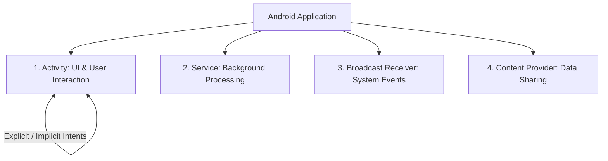
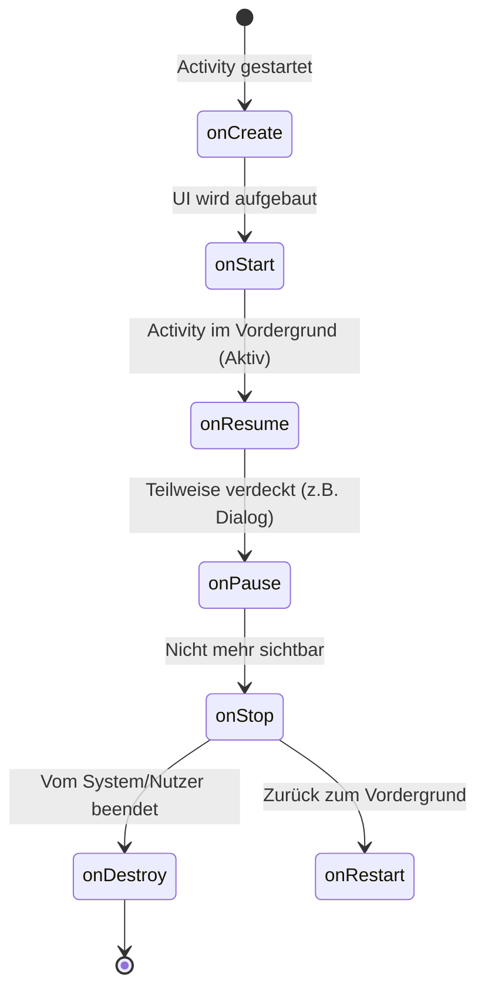

# Android Development – Das Praxis-Handbuch & Jetpack-Leitfaden

**Android Development** umfasst das Design, die Entwicklung, die Architektur und die Veröffentlichung mobiler Anwendungen auf dem weltgrößten mobilen Betriebssystem. Die moderne Android-Entwicklung setzt primär auf **Kotlin**, **Jetpack Compose** (deklarative Benutzeroberflächen), **Coroutines & Flow**, die **MVVM/MVI-Architektur**, **Hilt** (Dependency Injection) und **Room** (lokale Datenbank-Persistenz).

Dieses Handbuch bietet einen praxisnahen Überblick über die 4 Android-Kernkomponenten (Activity, Service, BroadcastReceiver, ContentProvider), den Activity Lifecycle, Jetpack Compose, MVVM-Architektur, Retrofit-Netzwerk-Abfragen, Local Storage, Testing und Google Play Store Deployment.

---

## 🚀 1. Android Kernkomponenten & Lifecycle

### Die 4 Kernbausteine (App Components)



1. **Activity**: Die visuelle Benutzeroberfläche und Einstiegspunkt für den Nutzer.
2. **Service**: Führt langwierige Operationen im Hintergrund aus (z. B. Musikwiedergabe, Standort-Tracking), ohne ein UI anzuzeigen.
3. **Broadcast Receiver**: Empfängt systemweite Benachrichtigungen (z. B. Akku schwach, Flugmodus aktiviert, System-Reboot).
4. **Content Provider**: Verwalte und teile strukturierte Anwendungsdaten sicher mit anderen Apps (z. B. Kontakte, MediaStore).

### Der Activity Lifecycle
Der Android-Manager durchläuft während der App-Nutzung strikte Lebenszyklus-Zustände:



* **`onCreate()`**: Initialisierung der Views, ViewModels und Dependency Injection.
* **`onResume()`**: Die App ist interaktiv und für den Nutzer sichtbar.
* **`onPause()` / `onStop()`**: Freigabe teurer Ressourcen (z. B. Kamera, Sensoren), um Akku zu sparen.

---

## 🎨 2. Deklarative UIs mit Jetpack Compose

**Jetpack Compose** ist das moderne, von Google empfohlene Toolkit zur Erstellung nativer Android-Benutzeroberflächen in reiner Kotlin-Syntax (ersetzt alte XML-Layouts).

```kotlin
import androidx.compose.foundation.layout.*
import androidx.compose.material3.*
import androidx.compose.runtime.*
import androidx.compose.ui.Modifier
import androidx.compose.ui.unit.dp

@Composable
fun UserProfileCard(username: String, onFollowClick: () -> Unit) {
    var isFollowing by remember { mutableStateOf(false) }

    Card(
        modifier = Modifier.fillMaxWidth().padding(16.dp),
        elevation = CardDefaults.cardElevation(defaultElevation = 4.dp)
    ) {
        Column(modifier = Modifier.padding(16.dp)) {
            Text(text = username, style = MaterialTheme.typography.headlineMedium)
            Spacer(modifier = Modifier.height(8.dp))
            Button(onClick = {
                isFollowing = !isFollowing
                onFollowClick()
            }) {
                Text(if (isFollowing) "Folge ich" else "Folgen")
            }
        }
    }
}
```

---

## 🏛️ 3. Architektur: MVVM, Hilt & StateFlow

Google empfiehlt eine klare Layer-Architektur mit Unidirectional Data Flow (UDF):

```mermaid
graph TD
    UI["UI Layer: Jetpack Compose / Screen"] <-->|State & User Events| VM["ViewModel Layer: StateFlow"]
    VM <-->|Use Cases / Repositories| Repo["Repository Layer"]
    Repo <-->|Local Data| Room["(\"Room SQLite DB\")"]
    Repo <-->|Remote Data| Retrofit["Retrofit REST API"]
```

### 1. ViewModel & StateFlow
Das `ViewModel` überlebt Konfigurationsänderungen (wie Bildschirm-Rotationen) und verwaltet den UI-Zustand via `StateFlow`:

```kotlin
import androidx.lifecycle.ViewModel
import androidx.lifecycle.viewModelScope
import kotlinx.coroutines.flow.*
import kotlinx.coroutines.launch

sealed interface UiState {
    object Loading : UiState
    data class Success(val items: List<String>) : UiState
    data class Error(val msg: String) : UiState
}

class MainViewModel(private val repository: DataRepository) : ViewModel() {
    private val _uiState = MutableStateFlow<UiState>(UiState.Loading)
    val uiState: StateFlow<UiState> = _uiState.asStateFlow()

    init {
        loadData()
    }

    private fun loadData() {
        viewModelScope.launch {
            try {
                val data = repository.fetchRemoteData()
                _uiState.value = UiState.Success(data)
            } catch (e: Exception) {
                _uiState.value = UiState.Error(e.message ?: "Fehler")
            }
        }
    }
}
```

### 2. Dependency Injection mit Hilt
Hilt injiziert Abhängigkeiten (Repositories, DBs, APIs) typsicher zur Kompilierzeit:

```kotlin
@HiltViewModel
class NewsViewModel @Inject constructor(
    private val newsRepository: NewsRepository
) : ViewModel() { ... }
```

---

## 💾 4. Datenspeicherung & Netzwerk

### Local Persistence: Room Database
Room bietet eine typsichere Abstraktion über SQLite mit SQL-Validierung beim Kompilieren:

```kotlin
@Entity(tableName = "users")
data class UserEntity(
    @PrimaryKey(autoGenerate = true) val id: Int = 0,
    val name: String
)

@Dao
interface UserDao {
    @Query("SELECT * FROM users ORDER BY name ASC")
    fun getAllUsers(): Flow<List<UserEntity>>

    @Insert(onConflict = OnConflictStrategy.REPLACE)
    suspend fun insertUser(user: UserEntity)
}
```

### Remote Network: Retrofit 2 & OkHttp
Netzwerkabfragen mit Kotlin Coroutines:

```kotlin
interface ApiService {
    @GET("users/{id}")
    suspend fun getUserById(@Path("id") userId: Int): UserResponse
}
```

---

## 🧪 5. Testing, Debugging & Performance

* **Unit Testing (JUnit 5 & MockK)**: Testen von Repositories und ViewModels in Isolation.
* **UI Testing (Espresso & Compose Test Rule)**: Automatisierte Integrationstests der Compose-UI.
* **LeakCanary**: Erkennt und meldet automatisch Memory Leaks (Arbeitsspeicher-Löcher) zur Entwicklungszeit.
* **Chucker**: Zeigt HTTP-Netzwerk-Requests und -Responses direkt als System-Benachrichtigung im Handy an.

---

## 📦 6. Deployment & Google Play Store

1. **Android App Bundle (AAB)**: Generieren des optimierten `.aab`-Formats für den Play Store (`./gradlew bundleRelease`).
2. **App Signing**: Signieren der Anwendung mit einem sicheren Keystore.
3. **Google Play Console**: Hochladen des AAB, Verfassen des Store-Eintrags, Screenshots & Veröffentlichung in Staging- oder Production-Tracks.

---

## 🔗 7. Verwandte Themen & Weiterführende Links
* [Zurück zur IDE & Tools Übersicht](index.md)
* [Android ADB & Wireless Debugging](android.md)
* [Kotlin Praxis-Handbuch](kotlin-praxis.md)
