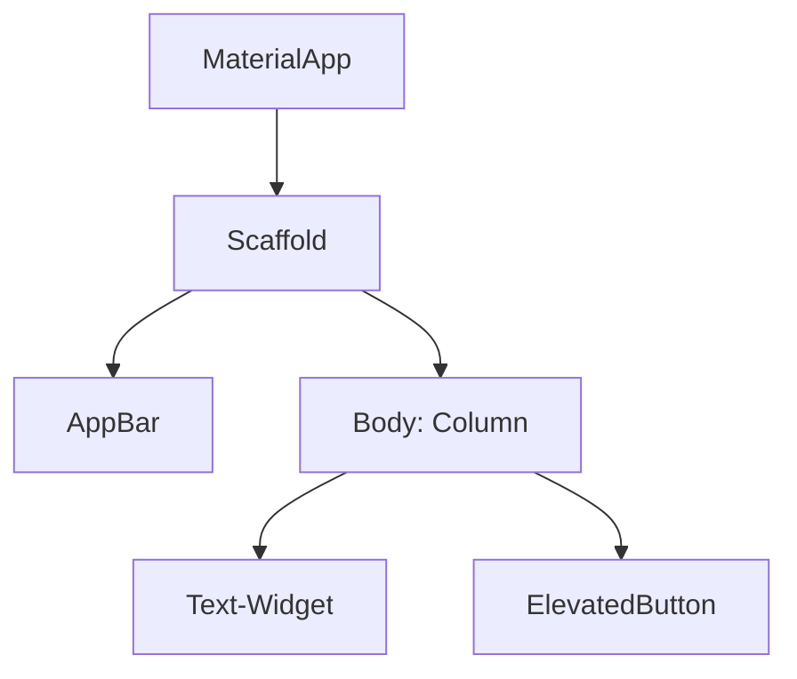
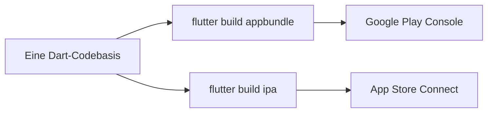

# Flutter – Das Praxis-Handbuch & Cross-Platform-Leitfaden

**Flutter** ist Googles Cross-Platform-Framework, mit dem sich aus einer einzigen **Dart**-Codebasis native Anwendungen für iOS, Android, Web, Windows, macOS und Linux erzeugen lassen. Statt native UI-Komponenten zu wrappen, rendert Flutter jede Pixel selbst über die **Skia**- bzw. neuere **Impeller**-Rendering-Engine — dadurch sieht die App auf allen Plattformen identisch aus.

Dieses Handbuch bietet einen praxisnahen Überblick über den Widget-Baum, State-Management, Netzwerk-Abfragen, lokale Datenspeicherung, Testing und Deployment in beide App Stores aus derselben Codebasis.

---

## 🚀 1. Der Widget-Baum

In Flutter ist **alles ein Widget** — Layout, Styling und sogar Padding werden über verschachtelte Widgets beschrieben, nicht über separate Style-Objekte.



### StatelessWidget vs. StatefulWidget

* **`StatelessWidget`**: Hat keinen veränderlichen internen Zustand — wird komplett aus seinen Konstruktor-Parametern gerendert.
* **`StatefulWidget`**: Besitzt ein zugehöriges `State`-Objekt, das über `setState()` ein Neuzeichnen auslöst.

```dart
class Counter extends StatefulWidget {
  const Counter({super.key});

  @override
  State<Counter> createState() => _CounterState();
}

class _CounterState extends State<Counter> {
  int _count = 0;

  void _increment() => setState(() => _count++);

  @override
  Widget build(BuildContext context) {
    return Column(
      children: [
        Text('Zähler: $_count', style: Theme.of(context).textTheme.headlineMedium),
        ElevatedButton(onPressed: _increment, child: const Text('Erhöhen')),
      ],
    );
  }
}
```

---

## 🏗️ 2. State-Management über einzelne Widgets hinaus

`setState()` reicht nur für lokalen Widget-Zustand. Für Zustand, der über mehrere Widgets geteilt wird, haben sich drei Ansätze etabliert:

| Ansatz | Prinzip | Typischer Einsatz |
|---|---|---|
| **Provider** | Einfache Dependency-Injection über den Widget-Baum, `ChangeNotifier`-basiert | Kleinere bis mittlere Apps, sanfte Lernkurve |
| **Riverpod** | Provider-Nachfolger, kompilierzeit-sicher statt `BuildContext`-abhängig | Größere Apps mit komplexer Abhängigkeitsstruktur |
| **BLoC** | Strikte Trennung von Events und States über Streams | Teams mit striktem Architektur-Regelwerk, hoher Testbarkeit |

```dart
// Riverpod-Beispiel
final counterProvider = StateProvider<int>((ref) => 0);

class CounterView extends ConsumerWidget {
  @override
  Widget build(BuildContext context, WidgetRef ref) {
    final count = ref.watch(counterProvider);
    return ElevatedButton(
      onPressed: () => ref.read(counterProvider.notifier).state++,
      child: Text('Zähler: $count'),
    );
  }
}
```

---

## 💾 3. Datenspeicherung & Netzwerk

### Local Persistence

| Paket | Anwendungsfall |
|---|---|
| **shared_preferences** | Einfache Schlüssel-Wert-Paare (Einstellungen, Flags). |
| **Hive** | Schnelle, NoSQL-artige lokale Datenbank in reinem Dart. |
| **sqflite** | SQLite-Anbindung für relationale, strukturierte Daten. |

### Remote Network: `http`-Paket

```dart
import 'package:http/http.dart' as http;
import 'dart:convert';

Future<List<User>> fetchUsers() async {
  final response = await http.get(Uri.parse('https://api.example.com/users'));
  if (response.statusCode == 200) {
    final List<dynamic> data = jsonDecode(response.body);
    return data.map((json) => User.fromJson(json)).toList();
  }
  throw Exception('Fehler beim Laden der Nutzer');
}
```

---

## 🧪 4. Testing, Debugging & Performance

* **Unit Tests (`test`-Paket)**: Testen von Geschäftslogik und Repositories in Isolation.
* **Widget Tests**: Rendern einzelner Widgets in einer simulierten Umgebung, ohne echtes Gerät.
* **Integration Tests (`integration_test`)**: End-to-End-Tests auf einem echten oder simulierten Gerät.
* **Flutter DevTools**: Widget-Inspector, Performance-Timeline und Speicheranalyse direkt im Browser.

```dart
testWidgets('Zähler erhöht sich bei Tap', (tester) async {
  await tester.pumpWidget(const MaterialApp(home: Counter()));
  expect(find.text('Zähler: 0'), findsOneWidget);

  await tester.tap(find.byType(ElevatedButton));
  await tester.pump();

  expect(find.text('Zähler: 1'), findsOneWidget);
});
```

---

## 📦 5. Deployment: iOS & Android aus einer Codebasis



1. **Android:** `flutter build appbundle` erzeugt ein `.aab`-Paket für die Google Play Console.
2. **iOS:** `flutter build ipa` erzeugt ein signiertes Archiv für App Store Connect — Signierung und Provisioning-Profile laufen weiterhin über Xcode.
3. **Web/Desktop:** `flutter build web`, `flutter build windows/macos/linux` erzeugen zusätzliche Zielplattformen ohne Codeänderung.

!!! tip "Der Kompromiss von Flutter"
    Eine Codebasis für alle Plattformen spart Entwicklungszeit, kostet aber Zugriff auf brandneue, plattformspezifische APIs am Erscheinungstag — dafür bleibt eine Anbindung nativer APIs über **Platform Channels** möglich, wenn eine Funktion nicht über ein Flutter-Paket verfügbar ist.

---

## 🔗 Verwandte Themen & Weiterführende Links

- [Zurück zur IDE & Tools Übersicht](index.md)
- [iOS Development – Das Praxis-Handbuch](ios-praxis.md) — die native iOS-Entsprechung
- [Android Development – Das Praxis-Handbuch](android-praxis.md) — die native Android-Entsprechung
- [Kotlin Praxis-Handbuch](kotlin-praxis.md)
