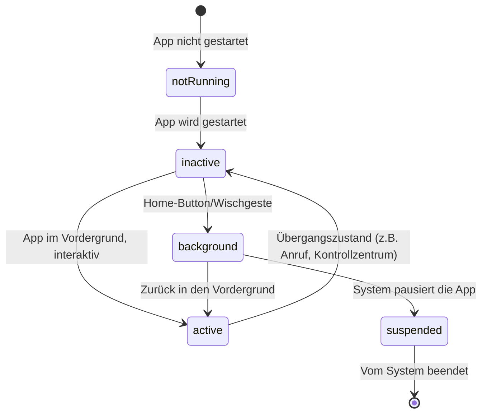

# iOS Development – Das Praxis-Handbuch & SwiftUI-Leitfaden

**iOS Development** umfasst Design, Entwicklung, Architektur und Veröffentlichung nativer Anwendungen für iPhone und iPad. Die moderne iOS-Entwicklung setzt primär auf **Swift**, **SwiftUI** (deklarative Benutzeroberflächen), **async/await** für Nebenläufigkeit, die **MVVM-Architektur** und **SwiftData** (lokale Datenpersistenz) als Nachfolger von Core Data.

Dieses Handbuch bietet einen praxisnahen Überblick über App-Lifecycle, SwiftUI, MVVM-Architektur, Netzwerk-Abfragen mit `URLSession`, lokale Datenspeicherung, Testing und App-Store-Deployment.

---

## 🚀 1. App-Lifecycle & Kernkomponenten

### Der App-Einstiegspunkt

Seit SwiftUI ersetzt das `App`-Protokoll das klassische `AppDelegate`/`SceneDelegate`-Paar als primären Einstiegspunkt:

```swift
@main
struct MyApp: App {
    var body: some Scene {
        WindowGroup {
            ContentView()
        }
    }
}
```

### Der App-Lifecycle



* **`active`**: Die App ist sichtbar und nimmt Eingaben entgegen.
* **`background`**: Kurzzeitige Ausführung erlaubt (z. B. Speichern von Zustand), danach `suspended`.
* **`scenePhase`**: SwiftUI-Environment-Wert, um auf Lifecycle-Übergänge zu reagieren, ohne einen `AppDelegate` zu benötigen.

---

## 🎨 2. Deklarative UIs mit SwiftUI

**SwiftUI** beschreibt die Benutzeroberfläche als Funktion des aktuellen Zustands — Änderungen an `@State`-Variablen lösen automatisch ein Neuzeichnen aus:

```swift
import SwiftUI

struct UserProfileCard: View {
    let username: String
    @State private var isFollowing = false
    var onFollowTap: () -> Void

    var body: some View {
        VStack(alignment: .leading, spacing: 8) {
            Text(username)
                .font(.headline)
            Button(isFollowing ? "Folge ich" : "Folgen") {
                isFollowing.toggle()
                onFollowTap()
            }
            .buttonStyle(.borderedProminent)
        }
        .padding()
        .background(.regularMaterial)
        .clipShape(RoundedRectangle(cornerRadius: 12))
    }
}
```

* **`@State`**: Lokaler, veränderlicher View-Zustand.
* **`@Binding`**: Zwei-Wege-Verbindung zu Zustand, der einer übergeordneten View gehört.
* **`@Environment`**: Werte, die von außen in den View-Baum injiziert werden (Theme, `scenePhase`, `dismiss`).

---

## 🏗️ 3. MVVM-Architektur mit `@Observable`

Seit iOS 17 ersetzt das `@Observable`-Makro den älteren `ObservableObject`/`@Published`-Ansatz mit weniger Boilerplate:

```swift
import Observation

@Observable
class UserListViewModel {
    var users: [User] = []
    var isLoading = false

    func loadUsers() async {
        isLoading = true
        defer { isLoading = false }
        do {
            users = try await UserService.fetchUsers()
        } catch {
            print("Fehler beim Laden: \(error)")
        }
    }
}

struct UserListView: View {
    @State private var viewModel = UserListViewModel()

    var body: some View {
        List(viewModel.users) { user in
            Text(user.name)
        }
        .task { await viewModel.loadUsers() }
    }
}
```

`.task` startet die asynchrone Aufgabe automatisch, sobald die View erscheint, und bricht sie ab, sobald sie verschwindet — kein manuelles Cancellation-Handling nötig.

---

## 💾 4. Datenspeicherung & Netzwerk

### Local Persistence: SwiftData

SwiftData (seit iOS 17) ersetzt Core Data mit reiner Swift-Syntax und Makros:

```swift
import SwiftData

@Model
class Note {
    var title: String
    var createdAt: Date

    init(title: String, createdAt: Date = .now) {
        self.title = title
        self.createdAt = createdAt
    }
}
```

### Remote Network: `URLSession` mit `async/await`

```swift
struct UserService {
    static func fetchUsers() async throws -> [User] {
        let url = URL(string: "https://api.example.com/users")!
        let (data, _) = try await URLSession.shared.data(from: url)
        return try JSONDecoder().decode([User].self, from: data)
    }
}
```

---

## 🧪 5. Testing, Debugging & Performance

* **Unit Testing (Swift Testing / XCTest)**: Testen von Services und ViewModels in Isolation; `Swift Testing` (seit Xcode 16) ersetzt zunehmend `XCTest` mit `@Test`-Makros und ausdrucksstärkeren `#expect`-Assertions.
* **UI Testing (XCUITest)**: Automatisierte End-to-End-Tests, die die App wie eine reale Nutzerin bedienen.
* **Instruments**: Xcodes Profiling-Suite für CPU-, Speicher- und Energieverbrauchsanalyse.
* **Memory Graph Debugger**: Erkennt Retain-Cycles und Speicherlecks direkt in Xcode.

---

## 📦 6. Deployment & App Store

1. **Archive erstellen**: `Product → Archive` in Xcode erzeugt ein signiertes `.ipa`-Paket.
2. **App Signing**: Verwaltung von Zertifikaten und Provisioning-Profilen über den Apple Developer Account.
3. **TestFlight**: Verteilung an Beta-Tester:innen vor der öffentlichen Veröffentlichung.
4. **App Store Connect**: Hochladen des Archivs, Verfassen des Store-Eintrags, Screenshots, Review-Einreichung.

---

## 🔗 7. Verwandte Themen & Weiterführende Links

- [Zurück zur IDE & Tools Übersicht](index.md)
- [Flutter – Das Praxis-Handbuch](flutter-praxis.md) — Cross-Platform-Alternative für iOS und Android aus einer Codebasis
- [Android Development – Das Praxis-Handbuch](android-praxis.md) — die native Android-Entsprechung
- [Kotlin Praxis-Handbuch](kotlin-praxis.md)
