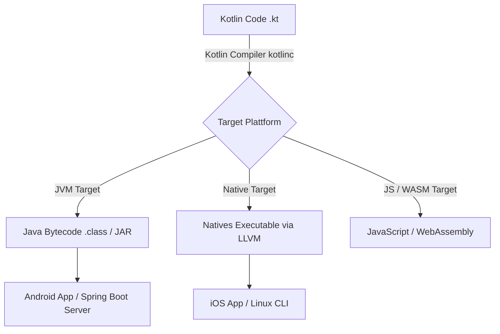
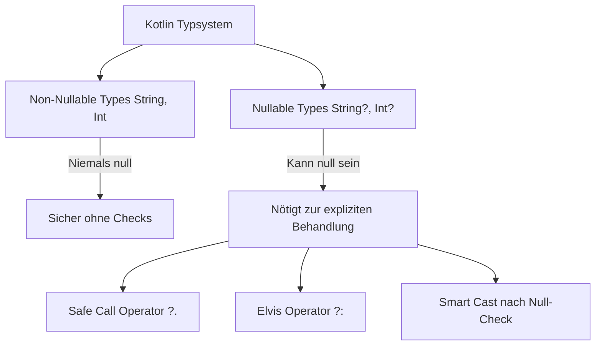
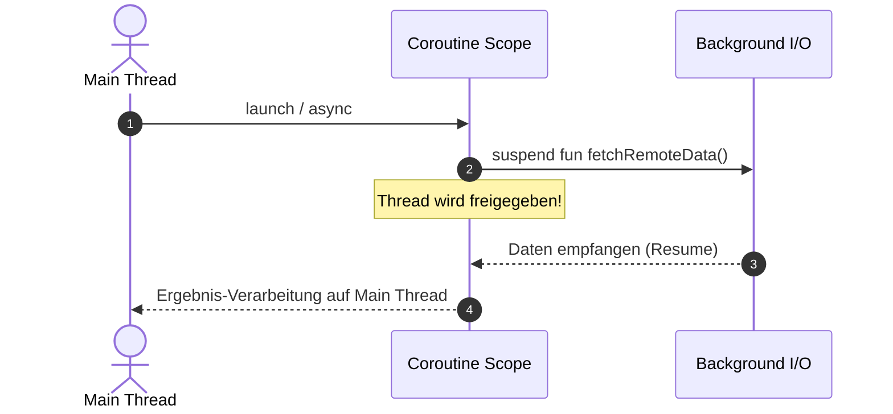

# Kotlin – Das Praxis-Handbuch & Multiplatform-Leitfaden

**Kotlin** ist eine moderne, statisch typisierte Programmiersprache, die von JetBrains entwickelt wurde. Sie zeichnet sich durch eingebaute **Null-Sicherheit**, prägnante Syntax, 100-prozentige Interoperabilität mit Java, koroutinenbasierte Asynchronität und Multiplatform-Fähigkeiten (Android, iOS, JVM-Server, WebAssembly, Native) aus.

Dieses Praxis-Handbuch fasst die Sprachgrundlagen, Null-Safety-Mechanismen, Data & Sealed Classes, Extension Functions, Coroutines & Flows, Ktor / Spring Boot Web-Frameworks sowie Kotlin Multiplatform (KMP) zusammen.

---

## 🚀 1. Einführung & Sprachphilosophie

### Warum Kotlin?
* **Null Safety**: Vermeidung der berüchtigten `NullPointerException` (NPE) direkt im Typsystem zur Kompilierzeit.
* **100% Java-Interoperabel**: Bestehender Java-Code und Bibliotheken können ohne Wrapper direkt aufgerufen und mit Kotlin kombiniert werden.
* **Prägnant & Ausdrucksstark**: Reduziert Boilerplate-Code im Vergleich zu klassischem Java um bis zu 40 % (z. B. durch `data class`).
* **Multiplatform (KMP)**: Business-Logik einmal schreiben und nativ auf Android, iOS, Desktop (JVM), Web (WASM) und Linux ausführen.



---

## 🔒 2. Null Safety (Das Herzstück von Kotlin)

In Kotlin wird im Typsystem strikt unterscheidet, ob eine Variable `null` enthalten darf oder nicht:



### Die Null-Safety-Operatoren im Überblick

| Operator | Name | Beschreibung & Beispiel |
|---|---|---|
| `T?` | Nullable Type | `var name: String? = null` (Darf `null` sein) |
| `?.` | Safe Call Operator | `name?.length` (Gibt `null` zurück, falls `name == null`) |
| `?:` | Elvis Operator | `val len = name?.length ?: 0` (Fallback-Wert, falls `null`) |
| `!!` | Not-Null Assertion | `name!!.length` (Erzwingt Zugriff, wirft NPE falls `null`!) |
| `as?` | Safe Cast | `val str = obj as? String` (Gibt `null` zurück bei Fehlcast) |

=== "Null Safety Praxisbeispiel"
    ```kotlin
    fun processUsername(input: String?): String {
        // Smart Cast: Nach dem Null-Check weiß der Compiler, dass 'input' nicht null ist
        if (input == null) {
            return "Gast"
        }
        return input.uppercase() // Kein '?' nötig!
    }

    fun main() {
        val user: String? = fetchUserFromDb()
        
        // Kombination aus Safe Call und Elvis Operator
        val displayName = user?.trim()?.ifEmpty { "Anonym" } ?: "Unbekannt"
        println("Hallo, $displayName!")
    }
    ```

---

## 🧩 3. Klassen, Objects & Spezial-Klassen

### 1. Data Classes (`data class`)
Generiert automatisch `equals()`, `hashCode()`, `toString()`, `copy()` und Destrukturierungs-Operatoren:

```kotlin
data class User(val id: Long, val name: String, val email: String)

fun main() {
    val user1 = User(1, "Alice", "alice@example.com")
    // Erstellt eine Kopie mit abgeändertem Namen
    val user2 = user1.copy(name = "Alice Smith")
    
    println(user2) // User(id=1, name=Alice Smith, email=alice@example.com)
}
```

### 2. Sealed Classes & Interfaces
Strikte Klassenhierarchien für typsichere Zustandsmaschinen (*State Pattern*). Der `when`-Ausdruck erfordert keine `else`-Branch, wenn alle Subklassen abgedeckt sind:

```kotlin
sealed interface UiState {
    object Loading : UiState
    data class Success(val data: List<String>) : UiState
    data class Error(val message: String) : UiState
}

fun renderUi(state: UiState) = when (state) {
    is UiState.Loading -> println("Lade Daten...")
    is UiState.Success -> println("Daten geladen: ${state.data.size} Einträge")
    is UiState.Error -> println("Fehler: ${state.message}")
}
```

### 3. Extension Functions
Erweitern bestehende Klassen um neue Methoden, ohne den Quellcode der Klasse zu ändern:

```kotlin
// Erweitert die Standard-Klasse String um eine eigene Methode
fun String.toSlug(): String {
    return this.lowercase().replace(" ", "-")
}

val title = "Kotlin Für Einsteiger"
println(title.toSlug()) // "kotlin-für-einsteiger"
```

---

## ⚡ 4. Asynchrone Programmierung mit Coroutines & Flow

Coroutines sind **extrem leichtgewichtige Threads**, die nicht blockieren, sondern beim Warten auf I/O unterbrochen (*suspended*) werden.

### Suspending Functions & Coroutine Builders



=== "Coroutines & Async Example"
    ```kotlin
    import kotlinx.coroutines.*

    suspend fn fetchUserData(): String {
        delay(1000) // Unterbricht die Coroutine, blockiert den Thread NICHT!
        return "User #42"
    }

    fun main() = runBlocking {
        println("Starte Abfrage...")
        
        // Parallele Ausführung von zwei Coroutines im I/O Thread-Pool
        val deferred1 = async(Dispatchers.IO) { fetchUserData() }
        val deferred2 = async(Dispatchers.IO) { fetchUserData() }
        
        println("Ergebnisse: ${deferred1.await()} & ${deferred2.await()}")
    }
    ```

=== "Reactive Asynchronous Flow (`Flow<T>`)"
    ```kotlin
    import kotlinx.coroutines.flow.*

    // Reaktiver, kalter Datenstrom
    fun streamNumbers(): Flow<Int> = flow {
        for (i in 1..3) {
            delay(500)
            emit(i) // Sendet Zahl an Konsumenten
        }
    }

    suspend fun main() {
        streamNumbers()
            .map { it * 10 }
            .collect { value -> println("Empfangen: $value") }
    }
    ```

---

## 📦 5. Frameworks & Ökosystem

Kotlin ist sowohl im Backend als auch in der mobilen App-Entwicklung führend:

| Kategorie | Framework / Bibliothek | Beschreibung |
|---|---|---|
| **Microservices & Web APIs** | **Ktor**, Spring Boot, Quarkus | Ktor ist das schlanke, rein asynchrone Kotlin-Web-Framework von JetBrains |
| **Android Development** | Jetpack Compose, Android SDK | Deklaratives UI-Framework (Jetpack Compose) als Standard für Android |
| **Multiplatform (KMP)** | Compose Multiplatform | Gemeinsame UI & Logik für Android, iOS, Desktop und WASM |
| **JSON & Serialization** | `kotlinx.serialization` | Offizielle, reaktive Compiler-Plugin Serialisierung für JSON/CBOR |
| **Data Science & AI** | Kotlin Notebook, Dataframe, Koog | Datenanalyse in Kotlin mit DataFrame-APIs und AI-Integration |

---

## 🛠️ 6. Build Management mit Gradle (Kotlin DSL)

Das moderne `build.gradle.kts` nutzt Kotlin als Skriptsprache für den Build-Prozess:

```kotlin
plugins {
    kotlin("jvm") version "2.0.0"
    application
}

repositories {
    mavenCentral()
}

dependencies {
    implementation("org.jetbrains.kotlinx:kotlinx-coroutines-core:1.8.0")
    implementation("io.ktor:ktor-server-core-jvm:2.3.10")
    testImplementation(kotlin("test"))
}

application {
    mainClass.set("com.example.ApplicationKt")
}
```

---

## 🔗 7. Verwandte Themen & Weiterführende Links
* [Zurück zur IDE & Tools Übersicht](index.md)
* [Android-Entwicklung mit Kotlin](android.md)
* [Spring Boot & Backend-Integration](../../entwicklung/webentwicklung/backend-integration.md)
