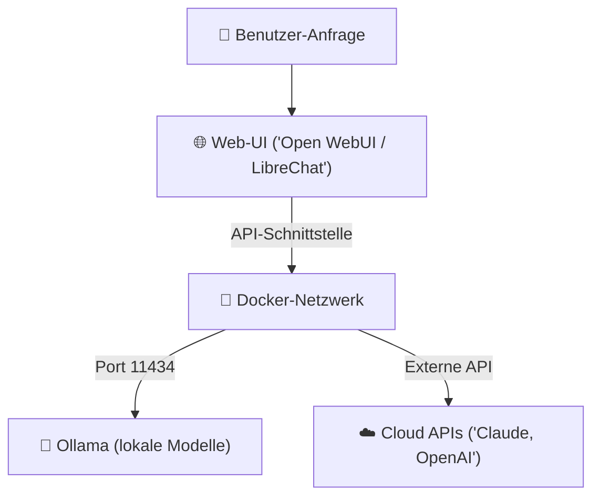

# Lokale KI-Benutzeroberflächen (Web-UIs)

> **Hinweis zur Software-Auswahl:**  
> Diese Dokumentation priorisiert **Open-Source-Software**, die lokal unter Ubuntu läuft bzw. selbst gehostet werden kann.  
> Bei kommerziellen Web-Plattformen wird stets eine **Open-Source-Alternative** zur eigenen Installation (Self-hosted) gegenübergestellt.

---

## Legende

| Symbol | Bedeutung |
|---|---|
| 🟩 | Open Source – kostenlos |
| 💰 | Kostenpflichtig |
| 🐳 | Docker-basiert – einfache Installation |
| 🐧 | Linux / Ubuntu nativ |
| 🌐 | Web-Browser-Oberfläche |

---

## Übersicht der Web-UIs

Wenn lokale LLMs über [Ollama](https://ollama.com) oder andere Inference-Server laufen, benötigt man eine benutzerfreundliche Oberfläche für den Chat-Alltag. Folgende Lösungen bieten eine professionelle Alternative zu ChatGPT & Claude:



---

## 1. Open WebUI 🟩 🐳 🐧 🌐

[Open WebUI](https://github.com/open-webui/open-webui) ist die derzeit am besten integrierte Oberfläche für **Ollama**. Sie bietet eine Benutzeroberfläche, die stark an ChatGPT angelehnt ist, unterstützt RAG (Retrieval-Augmented Generation), Dokumenten-Uploads und Benutzerverwaltung.

### Hauptmerkmale:
* **Direkte Ollama-Integration**: Erkennt lokale Modelle automatisch.
* **Integriertes RAG**: Einfach Dokumente (PDF, TXT, MD) im Chat hochladen; Open WebUI übernimmt das Chunking und Vektorisieren im Hintergrund.
* **Web-Search Integration**: Kann Suchmaschinen (wie SearXNG, Google, Tavily) abfragen.
* **Pipelines**: Python-Skripte zur Erweiterung der Funktionalität (z. B. Filter, Agenten-Workflows).

### Installation via Docker Compose unter Ubuntu:

```yaml
# docker-compose.yml
services:
  open-webui:
    image: ghcr.io/open-webui/open-webui:main
    container_name: open-webui
    ports:
      - "3000:8080"
    volumes:
      - open-webui:/app/backend/data
    extra_hosts:
      - "host.docker.internal:host-gateway"
    restart: unless-stopped

volumes:
  open-webui:
```

Mit folgendem Befehl starten:
```bash
docker compose up -d
```
Die Oberfläche ist danach unter `http://localhost:3000` erreichbar.

---

## 2. LibreChat 🟩 🐳 🐧 🌐

[LibreChat](https://github.com/danny-avila/LibreChat) ist eine hochentwickelte, quelloffene ChatGPT-Alternative, die darauf ausgelegt ist, **mehrere API-Provider parallel** zu verwalten (OpenAI, Anthropic, Gemini, Ollama, Hugging Face).

### Hauptmerkmale:
* **Multi-Provider**: Nahtloser Wechsel zwischen lokalen Modellen (Ollama) und Cloud-Modellen.
* **Presets & Assistants**: Erstellen von System-Prompts für bestimmte Aufgaben (z. B. "Code-Reviewer").
* **Suchfunktion**: Durchsuche alle vergangenen Konversationen effizient.
* **Plugins**: Unterstützung von Web-Browsing, DALL-E 3 und Code-Execution.

### Konfiguration für Ollama (`librechat.yaml`):

```yaml
# config/librechat.yaml
endpoints:
  ollama:
    type: "ollama"
    title: "Ollama (Lokal)"
    url: "http://host.docker.internal:11434"
    models:
      default: ["llama3", "deepseek-coder-v2"]
      fetch: true
```

---

## 3. Text-generation-webui (Oobabooga) 🟩 🐧 🌐

[text-generation-webui](https://github.com/oobabooga/text-generation-webui) ist das "Stable Diffusion WebUI" der Textgenerierung. Es ist ideal für Power-User, die nackte Open-Source-Modelle (GGUF, EXL2, AWQ) manuell laden, quantisieren und Parameter wie Temperatur und Top-P direkt manipulieren möchten.

### Hauptmerkmale:
* **Umfangreiches Backend-Management**: Unterstützt llama.cpp, ExLlamaV2, Transformers.
* **Erweiterungen**: Integriertes Whispering (Spracheingabe), Text-to-Speech, Websocket-Schnittstellen.
* **Parameter-Tuning**: Volle Kontrolle über Sampler, Presets und System-Prompts.

### Installation unter Ubuntu:
```bash
git clone https://github.com/oobabooga/text-generation-webui.git
cd text-generation-webui
./start_linux.sh
```

---

## Vergleichstabelle: Welches Web-UI für welchen Zweck?

| Kriterium | Open WebUI 🟩 | LibreChat 🟩 | Text-generation-webui 🟩 |
|---|---|---|---|
| **Primärer Fokus** | Chat & lokales RAG (Ollama) | Multi-Model & Cloud APIs | Modell-Testing & Deep Tuning |
| **Benutzerfreundlichkeit** | ⭐⭐⭐⭐⭐ (Sehr einfach) | ⭐⭐⭐⭐ (Gut) | ⭐⭐⭐ (Komplex) |
| **RAG (Doc-Upload)** | ✅ Automatisch integriert | ✅ Über Vektordatenbank | ❌ Nur über Plugins |
| **Docker-Support** | ✅ Hervorragend | ✅ Hervorragend | 🟡 Möglich, aber lokal bevorzugt |
| **Benutzerrechte/Auth** | ✅ Ja (Admin/User) | ✅ Ja (LDAP/OAuth-Optionen) | ❌ Nein (Single User) |
