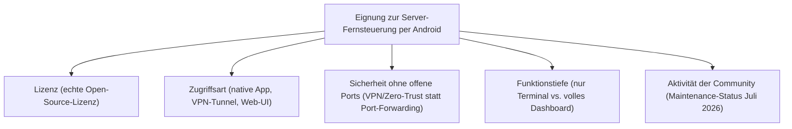
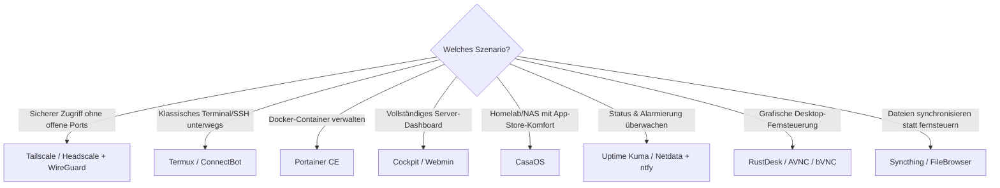

# Beste Open-Source-Apps zur Fernsteuerung von Self-Hosting-Servern per Android (Top 20)

Ein selbst gehosteter Server (Homelab, Root-Server, Raspberry Pi) läuft meist headless im Keller oder Rechenzentrum — die eigentliche Bedienung findet unterwegs über das Smartphone statt. Diese Seite listet **ausschließlich quelloffene** Android-Werkzeuge, mit denen sich ein Self-Hosting-Server vom Handy aus fernsteuern, überwachen und administrieren lässt: vom klassischen SSH-Terminal über VPN-Tunnel und Remote-Desktop bis zum browserbasierten Docker-/Server-Dashboard.

!!! note "Hinweis: Native Android-App vs. Web-UI im Handy-Browser"
    Ein Teil dieser Liste sind **native Android-Apps** (Termux, ConnectBot, RustDesk, Tailscale), ein anderer Teil sind **serverseitige Web-Oberflächen** (Cockpit, Portainer, Webmin, CasaOS), die auf dem Server selbst laufen und einfach über den mobilen Browser bedient werden — dafür ist keine Android-spezifische App nötig, nur ein Lesezeichen.

---

## Bewertungskriterien

!!! warning "Achtung: Offene Ports sind das größte Risiko bei Server-Fernzugriff"
    SSH- oder Web-UI-Ports direkt ins offene Internet weiterzuleiten, ist der häufigste Einstiegspunkt für automatisierte Angriffe. **Tailscale, Headscale und WireGuard** in dieser Liste lösen das, indem der Server über einen verschlüsselten VPN-Tunnel erreichbar bleibt, ohne dass am Router ein Port geöffnet werden muss. **Stand: Juli 2026.**

---

## Top 20 im Überblick

| Rang | Software | Kategorie | Lizenz | Zugriffsart (Android) | Besondere Stärke | Schwäche |
|---|---|---|---|---|---|---|
| 1 | **Termux** | Terminal/Linux-Umgebung | GPL-3.0 | Native App | Vollwertige Linux-Userland-Umgebung auf dem Handy (SSH-, rsync-, tmux-Pakete per `pkg install`), Ausgangspunkt für fast alle Terminal-Workflows | Einstieg ohne Grundkenntnisse der Kommandozeile anspruchsvoll |
| 2 | **ConnectBot** | SSH-Client | Apache-2.0 | Native App | Erster dedizierter SSH-Client für Android, schlank, seit Jahren etabliert, Schlüsselverwaltung eingebaut | Reiner Terminal-Client, kein Datei-/Dashboard-Zugriff |
| 3 | **Tailscale (Android-Client)** | VPN-Mesh | BSD-3-Clause (Client) | Native App | Server ohne offene Ports erreichbar, WireGuard-Unterbau, sehr einfaches Setup über QR-Code/Login | Standard-Koordinationsserver liegt bei Tailscale Inc. (cloudbasiert) |
| 4 | **WireGuard** | VPN-Tunnel | GPL-2.0 | Native App | Extrem schlanker, schneller VPN-Kernel-Client, vollständig selbst konfigurierbar ohne Drittanbieter-Konto | Konfiguration (Schlüssel, Peers) muss manuell/per QR-Code eingerichtet werden |
| 5 | **Cockpit** | Server-Dashboard | LGPL-2.1 | Web-UI (Browser) | Übersichtliche, browserbasierte Administration (Dienste, Logs, Storage, Container) direkt auf dem Server installiert | Volle Funktionstiefe primär auf RPM-/Deb-Distributionen mit systemd ausgelegt |
| 6 | **Portainer CE** | Docker-/Container-Dashboard | Zlib | Web-UI (Browser) | Marktführendes Docker-/Kubernetes-Management-UI, mobil gut bedienbar, riesige Community | Business-Features (RBAC, Edge-Agents in großem Stil) nur in der kostenpflichtigen BE-Variante |
| 7 | **RustDesk** | Remote Desktop | AGPL-3.0 | Native App | Volle grafische Fernsteuerung des Server-Desktops (falls vorhanden) oder verbundener Rechner, selbst hostbarer Relay-Server möglich | Für reine Headless-Server ohne Desktop-Umgebung nicht relevant |
| 8 | **Uptime Kuma** | Monitoring/Status | MIT | Web-UI (Browser) | Sehr übersichtliches Self-Hosted-Monitoring mit Status-Seite, Alarmierung u. a. per Push/Telegram/E-Mail | Kein Kommandozeilen-/Dateizugriff, reines Monitoring |
| 9 | **ntfy** | Push-Benachrichtigungen | Apache-2.0 | Native App | Einfachste Möglichkeit, Server-Alerts (Cron-Jobs, Monitoring, Backup-Status) direkt aufs Handy zu pushen, per simplem HTTP-PUT | Kein Fernzugriff auf den Server selbst, nur Benachrichtigungskanal |
| 10 | **CasaOS** | Home-Server-Dashboard | Apache-2.0 | Web-UI (Browser) | Besonders einsteigerfreundliches Dashboard mit App-Store für Docker-Anwendungen, mobil-optimierte Oberfläche | Fokus auf Homelab-/NAS-Nutzung, weniger geeignet für klassische Produktivserver |
| 11 | **Webmin** | Server-Admin-Panel | BSD-3-Clause | Web-UI (Browser) | Sehr breite Funktionstiefe (Nutzer, Pakete, Cron, Firewall, Dateisystem) seit über 20 Jahren gepflegt | Oberfläche wirkt gegenüber moderneren Dashboards altbacken |
| 12 | **Netdata** | Echtzeit-Monitoring | GPL-3.0 | Web-UI (Browser) | Extrem detailliertes, granulares Echtzeit-Monitoring (Sekundentakt) direkt im Browser, auch mobil nutzbar | Metrik-Flut kann auf kleinem Handy-Bildschirm unübersichtlich werden |
| 13 | **AVNC** | VNC-Client | GPL-3.0 | Native App | Schlanker, moderner reiner VNC-Client für Android, aktiv gepflegt, gute Touch-Bedienung | Ausschließlich VNC-Protokoll, kein RDP/SPICE |
| 14 | **bVNC (remote-desktop-clients)** | VNC/RDP/SPICE-Client | GPL-3.0 | Native App | Multiprotokoll-Client (VNC, RDP, SPICE, Proxmox/oVirt), deckt mehrere Fernzugriffs-Szenarien in einer App ab | Bedienoberfläche älter/technischer als spezialisierte Einzel-Protokoll-Apps |
| 15 | **Headscale** | VPN-Koordinationsserver | BSD-3-Clause | Server-Komponente (mit Tailscale-App genutzt) | Vollständig selbst hostbarer Ersatz für Tailscales Cloud-Koordinationsdienst, kompatibel zum Tailscale-Android-Client | Zusätzlicher eigener Server/Container zum Betreiben nötig |
| 16 | **Syncthing** | Dateisynchronisation | MPL-2.0 | Native App | Kontinuierliche, dezentrale Datei-Synchronisation zwischen Handy und Server ohne Cloud-Zwischenstation | Kein interaktiver Fernzugriff, nur Dateiabgleich |
| 17 | **FileBrowser** | Web-Dateimanager | Apache-2.0 | Web-UI (Browser) | Leichtgewichtiger, schneller Datei-Browser/-Upload direkt im Handy-Browser, einfache Docker-Installation | Keine Server-Administrationsfunktionen jenseits des Dateisystems |
| 18 | **Glances** | System-Monitoring | LGPL-3.0 | Web-UI (Browser) | Sehr ressourcenschonendes Monitoring mit optionalem Web-Modus, ideal für schwache Server/Raspberry Pi | Weniger visuell aufbereitet als Netdata/Uptime Kuma |
| 19 | **KDE Connect** | Geräteintegration (LAN) | GPL-2.0/LGPL | Native App | Benachrichtigungen, Zwischenablage und einfache Befehle zwischen Handy und Linux-Server im selben Netz teilen | Auf das lokale Netz ausgelegt, kein Fernzugriff über das Internet |
| 20 | **Aegis Authenticator** | 2FA-Absicherung | GPL-3.0 | Native App | Offener TOTP-Generator zur Absicherung von SSH-/Web-UI-Logins, verschlüsseltes Backup | Selbst kein Fernsteuerungs-Werkzeug, sondern Sicherheits-Ergänzung dazu |

!!! tip "Tipp: Rang ≠ einzige Entscheidungsgröße"
    Für den **sichersten Grundaufbau ohne offene Ports** ist die Kombination aus Tailscale (oder selbst gehostet: Headscale) plus ConnectBot/Termux kaum zu schlagen. Für ein **grafisches Rundum-Dashboard** liefert Cockpit die beste Balance aus Funktionstiefe und mobiler Bedienbarkeit, für reine **Docker-Verwaltung** ist Portainer CE der Quasi-Standard.

---

## Empfehlung nach Einsatzszenario

!!! warning "Achtung: Fernzugriff ist nur so sicher wie sein schwächstes Glied"
    Ein VPN-Tunnel (Tailscale/WireGuard) schützt den Übertragungsweg, ersetzt aber keine sauber konfigurierte Server-Härtung. SSH-Passwort-Login deaktivieren (nur Schlüssel-Login), Aegis oder eine vergleichbare 2FA-App für alle Web-UI-Logins nutzen und Software regelmäßig aktualisieren — unabhängig davon, welches Fernsteuerungs-Werkzeug aus dieser Liste zum Einsatz kommt.

---

## Verwandte Themen

- [Startseite](../../index.md) — zurück zur Dokumentations-Zentrale
- [Server & Software: Übersicht](software.md) — Kernkomponenten des eigenen Produktionsservers
- [Server-Installation](installation.md) — Grundinstallation des Self-Hosting-Servers
- [Nginx Grundlagen](nginx.md) — Webserver/Reverse Proxy vor den hier gelisteten Web-UIs
- [Nginx: Hardening & Sicherheit](nginx-hardening.md) — ergänzende Absicherung, wenn Web-UIs zusätzlich über Nginx veröffentlicht werden
- [Beste Voice-Steuerung-KI-Agenten (Open Source, Ubuntu 26.04, Top 20)](../../künstliche-intelligenz/automatisierung/voice-steuerung-opensource-ubuntu-topliste.md) — Sprachsteuerung als Alternative/Ergänzung zur manuellen Fernsteuerung
- [Beste Desktop-Steuerungs-Software mit KI (Open Source, Ubuntu 26.04, Top 20)](../../künstliche-intelligenz/automatisierung/desktop-software-opensource-ubuntu-topliste.md) — vergleichbares Doppel-Filterprinzip für die KI-gestützte Desktop-Steuerung
- [Beste KI-Agent-Fernsteuerung auf einem Self-Hosting-Server per Android (Top 20)](../../künstliche-intelligenz/automatisierung/android-ki-agent-fernsteuerung-server-topliste.md) — dieselbe Fernsteuerungs-Architektur, spezialisiert auf dauerhaft laufende KI-Agenten statt generischer Server-Administration
- [Beste KI-Agent-Fernsteuerung auf einem lokalen Rechner per Android (Top 20)](../../künstliche-intelligenz/automatisierung/android-ki-agent-fernsteuerung-lokal-topliste.md) — dasselbe Prinzip für den heimischen PC statt einen Server
