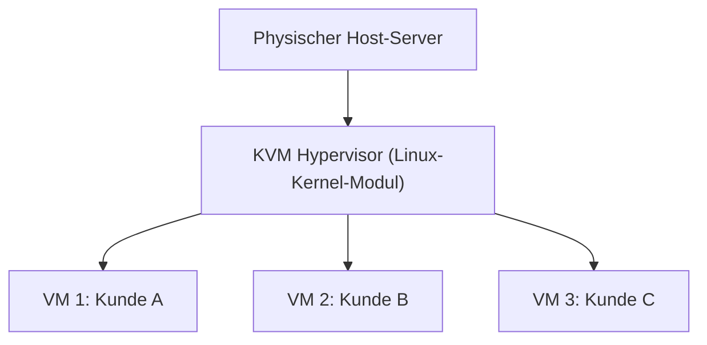
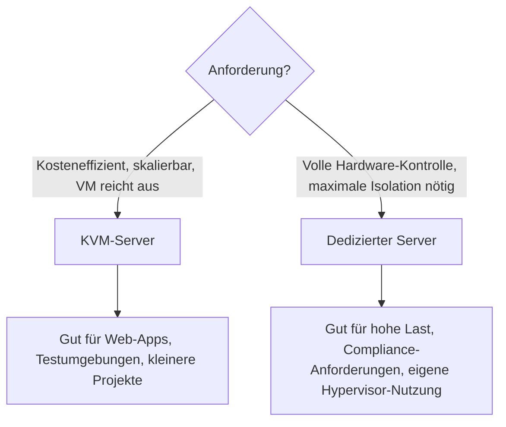

# KVM-Server mieten

**KVM** (Kernel-based Virtual Machine) ist eine Open-Source-Virtualisierungstechnologie, mit der sich mehrere virtuelle Maschinen auf einem einzigen physischen Server betreiben lassen. KVM-Server sind virtuelle Server, die direkt auf einem dedizierten Host laufen, dabei aber wie ein eigener, isolierter Rechner nutzbar sind — eine skalierbare und kostengünstige Alternative zu einem vollständig dedizierten Server.

---

## Was ist ein KVM-Server?

!!! note "Hinweis"
    KVM ist im Linux-Kernel integriert und wandelt den Host-Kernel selbst in einen Hypervisor um. Jede virtuelle Maschine erhält dadurch eigene, hardwarenahe Ressourcen (CPU, RAM, Storage) statt sich diese wie bei reinem Container-Sharing zu teilen.

### Vorteile von KVM-Servern

| Vorteil | Beschreibung |
|---|---|
| **Hohe Leistung** | Läuft direkt auf der Host-Hardware, kaum Virtualisierungs-Overhead |
| **Flexibilität** | Beliebige Betriebssysteme/Kernel pro VM möglich, unabhängig vom Host-System |
| **Sicherheit** | Isolierte Umgebung pro VM, keine gemeinsame Kernel-Instanz wie bei Containern |
| **Kostenersparnis** | Mehrere VMs teilen sich einen physischen Server, dadurch günstiger als dedizierte Hardware |

---

## Worauf bei der Miete achten

!!! tip "Checkliste vor der Anmietung"
    - **Spezifikationen**: vCPUs, RAM, Storage-Typ (NVMe/SSD/HDD) und Traffic-Limit mit dem tatsächlichen Bedarf abgleichen.
    - **Preis**: Anbieter vergleichen — Setup-Gebühren, Laufzeitrabatte und Verlängerungspreise beachten (oft günstiger als der Neukundenpreis).
    - **Support**: Reaktionszeiten und Erreichbarkeit (Ticket/Telefon/24-7) vor Vertragsabschluss prüfen.

### KVM-Server-Anbieter im Überblick

| Anbieter | Schwerpunkt |
|---|---|
| **Unesty** | Breites KVM-Angebot zu wettbewerbsfähigen Preisen |
| **OVH** | Große Auswahl an KVM-Servern mit hoher Leistung und Zuverlässigkeit |
| **Bero-Host** | Maßgeschneiderte KVM-Lösungen für Unternehmen |
| **ServDiscount** | Günstige KVM-Server mit hoher Leistung |
| **EmeraldHost** | Hohe Leistung und Flexibilität zu wettbewerbsfähigen Preisen |
| **venocix.de** | Breite Palette an KVM-Servern |
| **Zap-Hosting** | Fokus auf Spiele- und Anwendungs-Hosting |
| **Netcup** | Leistungsstarke, flexible KVM-Server für verschiedene Anforderungen |

!!! warning "Achtung"
    Konkrete Preise, Aktionsangebote und Verfügbarkeiten ändern sich häufig — vor der Buchung immer die aktuelle Preisliste des jeweiligen Anbieters prüfen, die Tabelle dient nur zur groben Orientierung.

---

## Dedizierter Server als Alternative

Ein **dedizierter Server** ist ein physischer Server, der ausschließlich einem einzigen Kunden zur Verfügung steht — im Gegensatz zum KVM-Server, bei dem sich mehrere VMs einen Host teilen.

### Vorteile dedizierter Server

| Vorteil | Beschreibung |
|---|---|
| **Hohe Leistung** | Volle Hardware-Ressourcen, kein Teilen mit anderen Kunden |
| **Sicherheit** | Vollständig isolierte Umgebung ohne Nachbar-VMs |
| **Flexibilität** | Hardware und Software frei nach eigenem Bedarf konfigurierbar |
| **Kostenersparnis** | Effiziente Ressourcennutzung senkt die Betriebskosten im Vergleich zu mehreren Einzel-VMs |

### Dedizierte-Server-Anbieter im Überblick

| Anbieter | Schwerpunkt |
|---|---|
| **Hetzner** | Breite Palette dedizierter Server mit hoher Leistung und Zuverlässigkeit |
| **ServDiscount** | Günstige dedizierte Serverlösungen |
| **OVH** | Verschiedene Konfigurationen mit hoher Verfügbarkeit |
| **Unesty** | Individuelle Konfiguration mit zuverlässigem Support |
| **Bero-Host** | Maßgeschneiderte Lösungen für Unternehmen |
| **Venocix** | Schnelle Anbindungen, verschiedene Hardwareoptionen |
| **OneProvider** | Weltweite Standorte, gemischte Erfahrungen bei Support, teils günstige Angebote |
| **SoYouStart** | Weltweite Standorte zu günstigen Preisen |
| **Kimsufi** | Preiswerte dedizierte Server mit internationalen Standorten |
| **Online.net** | Französischer Anbieter (mittlerweile Teil von Scaleway), dedizierte Server mit europäischen Standorten zu günstigen Preisen |

---

## KVM oder dedizierter Server?

---

## Verwandte Themen
- [Software-Übersicht](software.md)
- [Zurück zur Übersicht](index.md)
