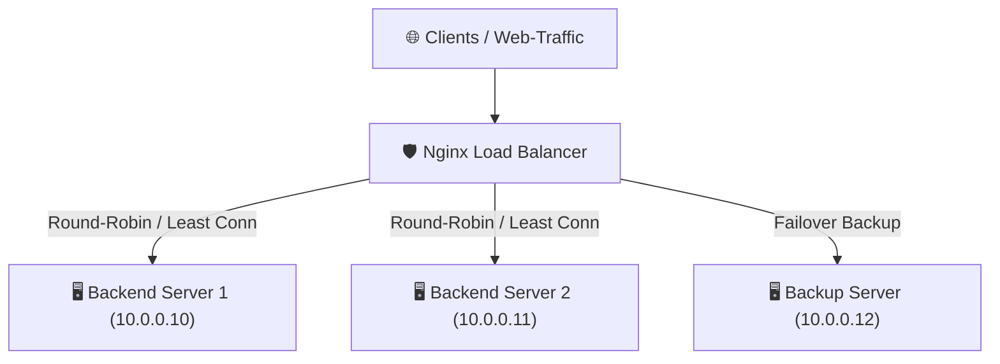

# Praxis-Guide: Nginx Load Balancing & High Availability

Nginx eignet sich hervorragend als Hochleistungs-Load-Balancer zur Verteilung des einlaufenden Datenverkehrs auf mehrere Backend-Server.

---



---

## ⚙️ 1. Upstream-Konfiguration in Nginx

Erstelle eine Konfiguration unter `/etc/nginx/conf.d/loadbalancer.conf`:

```nginx
# 1. Upstream-Gruppe definieren
upstream backend_cluster {
    # Algorithmus: Least Connections (schickt Anfragen an Server mit den wenigsten aktiven Verbindungen)
    least_conn;

    server 10.0.0.10:8080 max_fails=3 fail_timeout=30s weight=2;
    server 10.0.0.11:8080 max_fails=3 fail_timeout=30s weight=1;
    
    # Fallback Server (wird nur genutzt, wenn alle anderen ausfallen)
    server 10.0.0.12:8080 backup;
}

# 2. Virtual Host Server-Block
server {
    listen 80;
    server_name app.beispiel.de;

    # Weiterleitung aller HTTP-Anfragen zu HTTPS
    return 301 https://$host$request_uri;
}

server {
    listen 443 ssl http2;
    server_name app.beispiel.de;

    ssl_certificate /etc/nginx/ssl/app.crt;
    ssl_certificate_key /etc/nginx/ssl/app.key;

    location / {
        proxy_pass http://backend_cluster;
        
        # Header für echte Client-IP an Backends durchreichen
        proxy_set_header Host $host;
        proxy_set_header X-Real-IP $remote_addr;
        proxy_set_header X-Forwarded-For $proxy_add_x_forwarded_for;
        proxy_set_header X-Forwarded-Proto $scheme;

        # Timeouts definieren
        proxy_connect_timeout 5s;
        proxy_read_timeout 60s;
    }
}
```

---

## ⚡ 2. Session Persistence (Sticky Sessions)

Wenn Benutzer-Sitzungen an einen spezifischen Server gebunden bleiben müssen:

```nginx
upstream backend_sticky {
    ip_hash; # Bindet Client-IPs persistent an denselben Server
    server 10.0.0.10:8080;
    server 10.0.0.11:8080;
}
```

---

## 🔗 Verwandte Themen
* [Apache + Nginx](apache-nginx.md) – Kombination beider Server
* [Nginx Hardening & Sicherheit](nginx-hardening.md) – Sicherheits-Setup
* [Docker KI-Stack](docker-ki-stack.md) – Containerisiertes Deployment
