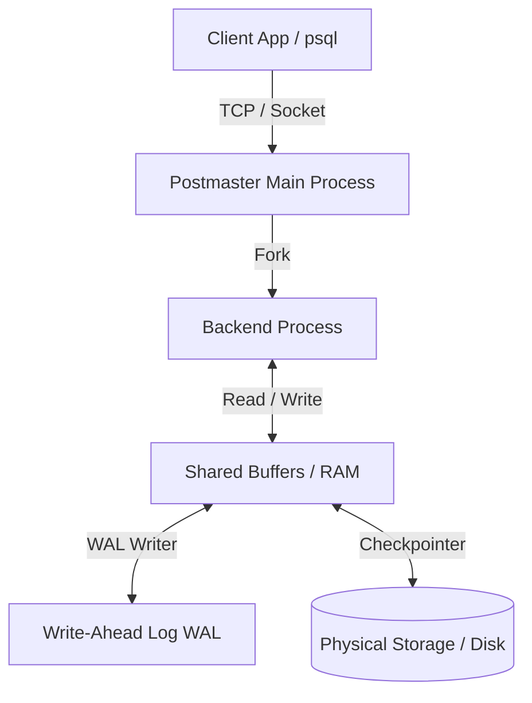
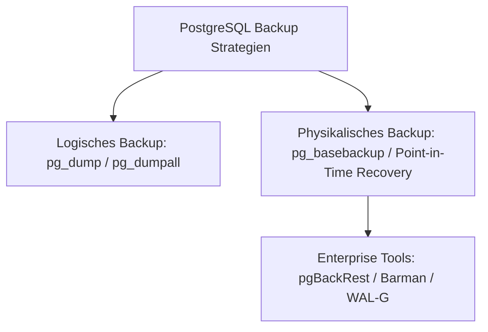

# PostgreSQL DBA – Das Praxis-Handbuch & Administration-Leitfaden

**PostgreSQL** ist das weltweit fortschrittlichste quelloffene relationale Datenbank-Managementsystem (RDBMS). Als **PostgreSQL Database Administrator (DBA)** tragen Sie die Verantwortung für Performance, Verfügbarkeit, Sicherheit, Datensicherung (Backup & Recovery), Replikation und Wartung produktiver Datenbank-Cluster.

Dieses Praxis-Handbuch fasst die wichtigsten Administrationsaufgaben, Konfigurations-Parameter (`postgresql.conf`), Sicherheitsregeln (`pg_hba.conf`), High Availability (Patroni/PgBouncer), Backup-Strategien (`pgBackRest`), Internals (MVCC/VACUUM) und Query-Optimierung zusammen.

---

## 🚀 1. Architektur & Kernkonzepte

### RDBMS & High-Level Architektur
PostgreSQL basiert auf einer **Process-Per-Connection** Architektur: Für jede Client-Verbindung wird ein eigener `postgres` Backend-Prozess gespannt.



### Die wichtigsten Architekturkomponenten
* **MVCC (Multi-Version Concurrency Control)**: Lesende Zugriffe blockieren keine schreibenden Zugriffe und umgekehrt. Bei Updates wird eine neue Zeilenversion (*Tuple*) angelegt.
* **WAL (Write-Ahead Log)**: Alle Änderungen werden zuerst sequenziell in das WAL geschrieben, bevor Datenseiten auf der Festplatte geändert werden. Garantiert ACID-Dauerhaftigkeit (*Durability*).
* **Shared Buffers**: Der zentrale In-Memory-Cache von PostgreSQL für Tabellen- und Indexseiten.
* **Checkpointer & Background Writer**: Schreiben verschmutzte Seiten (*Dirty Pages*) periodisch aus dem Arbeitsspeicher auf die Festplatte.

---

## ⚙️ 2. Konfiguration & Server-Tuning (`postgresql.conf`)

Die Performance von PostgreSQL hängt maßgeblich von den Einstellungen in `postgresql.conf` ab:

| Parameter | Beschreibung | Empfohlener Richtwert (Dedicated Server) |
|---|---|---|
| `shared_buffers` | Hauptspeicher-Cache für Datenbankseiten | 25 % des Gesamtarbeitsspeichers (RAM) |
| `effective_cache_size` | Geschätzter Gesamtspeicher für OS-Cache + DB | 50 % bis 75 % des Gesamtarbeitsspeichers |
| `work_mem` | Arbeitsspeicher pro Sortier- / Hash-Operation | 32 MB bis 128 MB (Vorsicht bei vielen Verbindungen!) |
| `maintenance_work_mem` | Speicher für `VACUUM`, `CREATE INDEX`, `ALTER TABLE` | 512 MB bis 2 GB |
| `max_connections` | Maximale parallele Client-Verbindungen | 100 bis 300 (Darüber Connection Pooler nutzen!) |
| `wal_level` | Detailgrad des WAL-Loggings | `replica` (für Replikation & Backups) |
| `max_wal_size` | Maximale Größe vor automatischem Checkpoint | 16 GB bis 32 GB |
| `random_page_cost` | Relative Kosten für zufälligen Festplattenzugriff | `1.1` (für NVMe/SSDs) / `4.0` (für HDDs) |

=== "Tuning-Befehl via SQL"
    ```sql
    -- Parameter zur Laufzeit anpassen (erfordert 'pg_reload_conf()')
    ALTER SYSTEM SET work_mem = '64MB';
    ALTER SYSTEM SET random_page_cost = 1.1;
    SELECT pg_reload_conf();
    ```

---

## 🔒 3. Sicherheit, Rollen & `pg_hba.conf`

### Zugriffssteuerung mit `pg_hba.conf`
Die Datei `pg_hba.conf` (Host-Based Authentication) regelt, wer sich von welchen IP-Adressen wie authentifizieren darf.

#### Beispiel einer sicheren `pg_hba.conf`
```text
# TYPE  DATABASE        USER            ADDRESS                 METHOD
local   all             postgres                                peer
host    all             all             127.0.0.1/32            scram-sha-256
hostssl app_db          app_user        10.0.0.0/8              scram-sha-256
hostnossl all           all             0.0.0.0/0               reject
```

### Rollen & Row-Level Security (RLS)

=== "Rollen & Rechteverwaltung"
    ```sql
    -- Rolle erstellen mit SCRAM-SHA-256 Passwort
    CREATE ROLE readonly_user WITH LOGIN PASSWORD 'SicheresPasswort123!';

    -- Leserechte auf Schema gewähren
    GRANT USAGE ON SCHEMA public TO readonly_user;
    GRANT SELECT ON ALL TABLES IN SCHEMA public TO readonly_user;
    ```

=== "Row-Level Security (RLS)"
    ```sql
    -- Aktivieren von Row-Level Security auf Tabelle
    ALTER TABLE kunden_daten ENABLE ROW LEVEL SECURITY;

    -- Richtlinie: Nutzer sehen nur eigene Daten
    CREATE POLICY kunden_policy ON kunden_daten
        FOR ALL
        TO app_user
        USING (user_id = current_setting('app.current_user_id')::integer);
    ```

---

## 💾 4. Backup, Recovery & High Availability (HA)

### Builtin Tools vs. Enterprise Backup



* **`pg_dump`**: Erstellt ein SQL-Skript oder benutzerdefiniertes Archiv einer einzelnen Datenbank (Ideal für kleinere DBs & Migrationen).
* **`pg_basebackup`**: Erstellt eine binäre 1:1 Kopie des gesamten Datenverzeichnisses zur Einrichtung von Replikaten.
* **`pgBackRest` / Barman**: Enterprise-Lösungen für kontinuierliches WAL-Archivieren und **Point-in-Time Recovery (PITR)** (Wiederherstellung auf die exakte Sekunde vor einem Ausfall).

### Replikation & Connection Pooling
* **Streaming Replication**: Physikalische 1:1 Bit-Kopie des Clusters auf Standby-Server (Synchron oder Asynchron).
* **Logical Replication**: Tabellenweise Replikation über Publish/Subscribe (Ideal für Version-Upgrades & Data Warehouses).
* **Patroni + HAProxy**: Branchenstandard für automatische Failover-Orchestrierung mit Etcd/Consul.
* **PgBouncer**: Extrem schlanker Connection Pooler (reduziert den Overhead von Hunderten parallelen Verbindungen).

---

## 🧹 5. Internals, MVCC & VACUUM Management

Da MVCC bei Updates und Deletes veraltete Zeilen-Versionen (*Dead Tuples*) hinterlässt, ist ein regelmäßiges `VACUUM` lebensnotwendig.

### Warum `AUTOVACUUM` essenziell ist
1. **Dead Tuple Removal**: Freigabe von Speicherplatz für neue Zeilen.
2. **Transaction ID Wraparound Prevention**: Verhindert das Einfrieren der Datenbank durch Einfrieren altem Alterungszähler (*Freeze*).
3. **Statistik-Aktualisierung (`ANALYZE`)**: Aktualisiert Tabellenstatistiken für den Query Planner.

```sql
-- Manuelle Überprüfung von Bloat & Dead Tuples
SELECT relname, n_dead_tup, n_live_tup,
       round(n_dead_tup * 100.0 / nullif(n_live_tup + n_dead_tup, 0), 2) AS dead_tuple_percent
FROM pg_stat_user_tables
ORDER BY n_dead_tup DESC;
```

---

## 📊 6. Query-Analyse, Indizes & Troubleshooting

### Der richtige Index für jeden Anwendungsfall
* **B-Tree**: Standard-Index für Vergleiche (`=`, `<`, `>`, `BETWEEN`).
* **BRIN (Block Range Index)**: Extrem platzsparender Index für chronologisch/fortlaufend sortierte Riesentabellen (z. B. Logdaten, IoT).
* **GIN (Generalized Inverted Index)**: Perfekt für JSONB, Array-Felder und Volltextsuche (`tsvector`).
* **GiST / SP-GiST**: Für Geodaten (PostGIS), Bereichstypen und multidimensionale Suchen.

### Slow Query Troubleshooting mit `EXPLAIN ANALYZE`

```sql
-- Detaillierte Query-Analyse mit Puffer-Nutzung
EXPLAIN (ANALYZE, BUFFERS, VERBOSE)
SELECT k.name, count(b.id)
FROM kunden k
JOIN bestellungen b ON k.id = b.kunden_id
WHERE b.created_at >= '2026-01-01'
GROUP BY k.name;
```

### Monitoring-Werkzeuge
* **`pg_stat_statements`**: Erweiterung zur Identifizierung der langsamsten und ressourcenintensivsten SQL-Queries.
* **`pgBadger`**: Leistungsstarker Log-Analysator zur Generierung visueller HTML-Berichte aus PostgreSQL-Logdateien.
* **Prometheus + `postgres_exporter`**: Echtzeit-Metriken für Grafana-Dashboards.

---

## 🔗 7. Verwandte Themen & Weiterführende Links
* [Zurück zur Infrastruktur-Übersicht](index.md)
* [PostgreSQL Backup & Recovery](postgresql-backup-restore.md)
* [PostgreSQL Performance Tuning](postgresql-tuning.md)
* [PgBouncer Connection Pooling](postgresql-pgbouncer.md)
* [PostgreSQL Streaming Replication](postgresql-streaming-replication.md)
