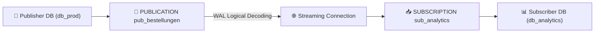

# Praxis-Guide: PostgreSQL Logical Replication & Change Data Capture

**Logische Replikation** in PostgreSQL erlaubt im Gegensatz zur physischen Replikation das gezielte Streamen einzelner Tabellen (Publication / Subscription) zwischen verschiedenen PostgreSQL-Versionen oder Datenbanken.

---



---

## ⚙️ 1. Publisher Node Konfiguration (`postgresql.conf`)

```ini
wal_level = logical
max_replication_slots = 10
max_wal_senders = 10
```

```sql
-- Publication auf dem Publisher erstellen
CREATE PUBLICATION pub_bestellungen FOR TABLE bestellungen, kunden;
```

---

## ⚙️ 2. Subscriber Node Konfiguration

```sql
-- Ziel-Tabelle muss auf dem Subscriber existieren!
CREATE TABLE bestellungen (
    id BIGINT PRIMARY KEY,
    betrag NUMERIC,
    erstellt_am TIMESTAMP WITH TIME ZONE
);

-- Subscription anlegen
CREATE SUBSCRIPTION sub_analytics
    CONNECTION 'host=10.0.0.1 dbname=db_prod user=repl_user password=geheim'
    PUBLICATION pub_bestellungen;
```

---

## 🔗 Verwandte Themen
* [PostgreSQL Streaming Replication](postgresql-streaming-replication.md) – Physische Replikation
* [PostgreSQL Table Partitioning](postgresql-table-partitioning.md) – Partitionierung
* [PostgreSQL Backup & Recovery](postgresql-backup-restore.md) – Sicherung
