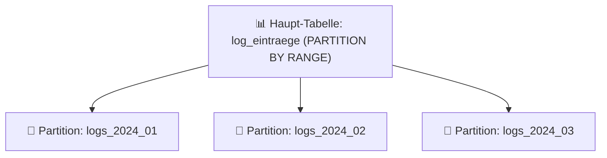

# Praxis-Guide: PostgreSQL Table Partitioning

Deklarative Tabellen-Partitionierung in PostgreSQL zerlegt sehr große Tabellen (Millionen/Milliarden Zeilen) in kleinere physikalische Partitionen, was Abfragen (Partition Pruning) und Wartung (`DROP TABLE` statt `DELETE`) drastisch beschleunigt.

---



---

## 📊 1. Haupttabelle mit Range-Partitionierung erstellen

```sql
CREATE TABLE log_eintraege (
    id BIGSERIAL,
    zeitstempel TIMESTAMP WITH TIME ZONE NOT NULL,
    level VARCHAR(10),
    nachricht TEXT,
    PRIMARY KEY (id, zeitstempel)
) PARTITION BY RANGE (zeitstempel);
```

---

## 📅 2. Monatliche Partitionen anlegen

```sql
CREATE TABLE logs_2026_01 PARTITION OF log_eintraege
    FOR VALUES FROM ('2026-01-01 00:00:00+00') TO ('2026-02-01 00:00:00+00');

CREATE TABLE logs_2026_02 PARTITION OF log_eintraege
    FOR VALUES FROM ('2026-02-01 00:00:00+00') TO ('2026-03-01 00:00:00+00');
```

---

## ⚡ 3. Vorteil: Partition Pruning & Schnelles Löschen

Abfragen filtern automatisch nicht benötigte Partitionen komplett aus:

```sql
EXPLAIN SELECT * FROM log_eintraege 
WHERE zeitstempel >= '2026-01-15' AND zeitstempel < '2026-01-20';
```

Alte Daten ohne CPU-Last sofort freigeben:

```sql
DROP TABLE logs_2026_01; -- Sofortige Löschung ohne Vacuum/Locks!
```

---

## 🔗 Verwandte Themen
* [PostgreSQL Performance Tuning](postgresql-tuning.md) – Performance-Optimierung
* [PostgreSQL Streaming Replication](postgresql-streaming-replication.md) – Replikation
* [PostgreSQL Backup & Recovery](postgresql-backup-restore.md) – Backup-Strategien
