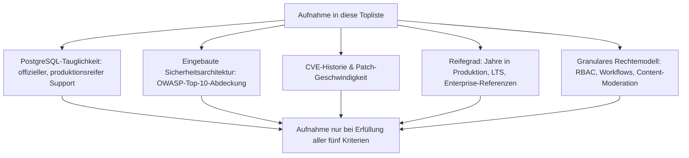
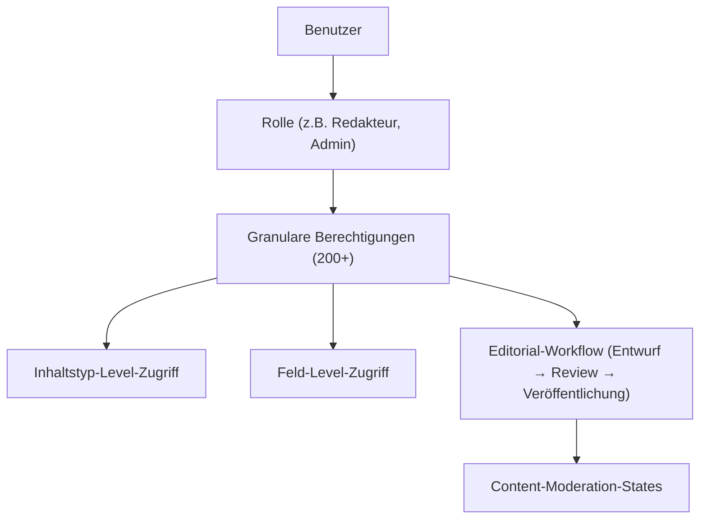
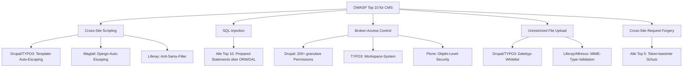
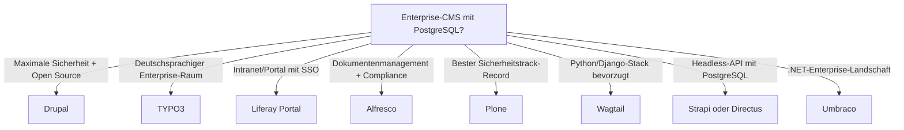
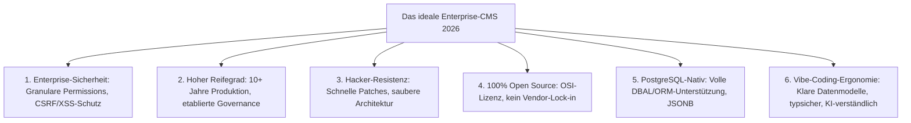
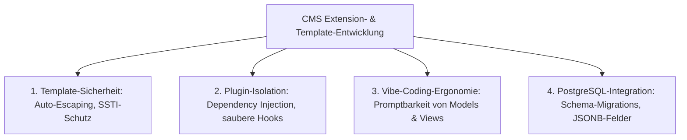
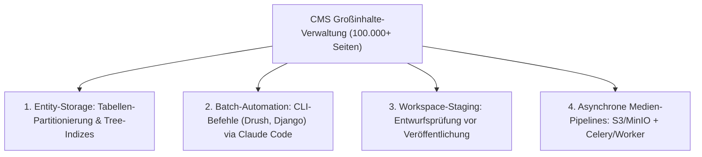
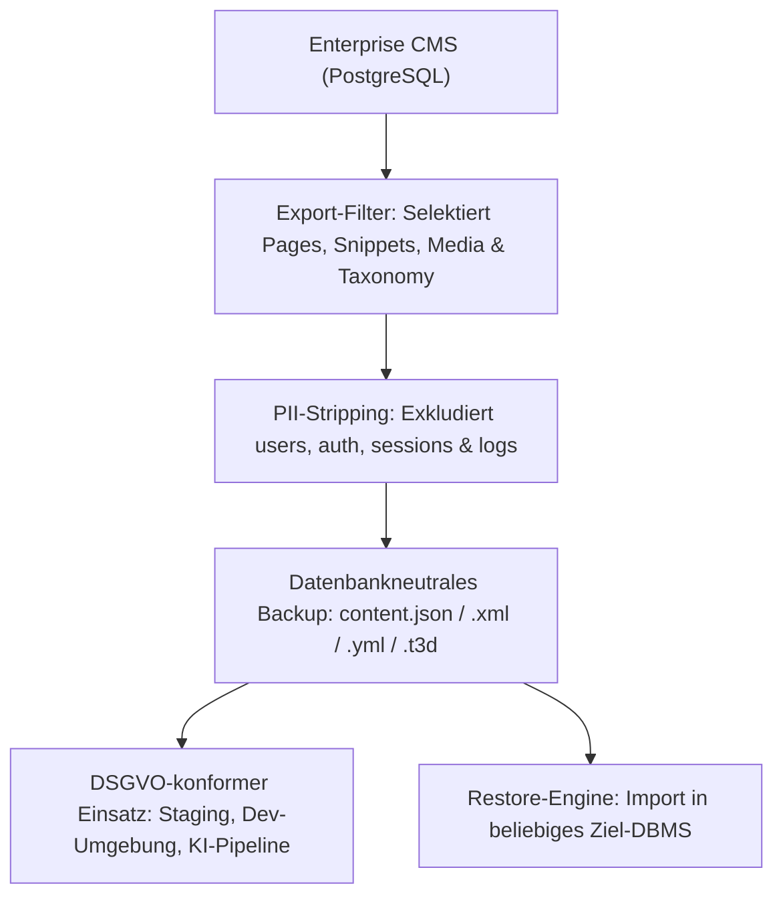

# Enterprise-CMS im Sicherheitsvergleich — PostgreSQL-taugliche Top-10-Topliste

Welches Content-Management-System hat die beste Sicherheit im Enterprise-Bereich, den höchsten Reifegrad, ist robust gegen Hackerangriffe **und** unterstützt PostgreSQL als Datenbankbackend? Diese Seite filtert die CMS-Landschaft nach vier Kriterien gleichzeitig — Sicherheitsarchitektur, Angriffsresistenz, Reifegrad und PostgreSQL-Tauglichkeit — und rankt die zehn Systeme, die alle vier Anforderungen erfüllen. Verwandte, aber anders gefilterte Perspektiven bieten die [Klassische CMS mit PostgreSQL-Speicherung (Top 7)](../../../wissen/dokumentation/klassische-cms-postgresql-dateiformat-2026-topliste.md) (Speicherbackend-Fokus ohne Sicherheitsranking) und die [Enterprise-Webframework Sicherheit (Top 10)](enterprise-webframework-sicherheit-topliste.md) (Framework-Ebene statt CMS-Ebene).

!!! note "Hinweis"
    WordPress — das meistverbreitete CMS weltweit — fehlt in dieser Liste, weil es **kein offizielles PostgreSQL-Backend** unterstützt. Trotz seines riesigen Ökosystems disqualifiziert diese einzige technische Randbedingung das System für PostgreSQL-zentrierte Enterprise-Infrastrukturen.

---

## Bewertungskriterien



---

## Top 10 im Überblick

| Rang | CMS | Sprache | PostgreSQL | Reifegrad | Sicherheits-Highlight |
|---|---|---|---|---|---|
| 1 | **Drupal** | PHP | ✅ Offiziell | 23+ Jahre | Dedizertes Security-Team, granularstes Rechtemodell aller Open-Source-CMS |
| 2 | **TYPO3** | PHP | ✅ Offiziell (seit v9) | 26+ Jahre | Deutsches CERT-Bund-gelistetes Security-Team, Enterprise-Härtung |
| 3 | **Liferay Portal** (CE) | Java | ✅ Offiziell | 20+ Jahre | Java-EE-Sicherheitsstack, Portal-Isolation, LDAP/SSO |
| 4 | **Alfresco** (CE) | Java | ✅ Empfohlen | 19+ Jahre | Records-Management-Zertifizierung (DoD 5015.2), dokumentenbasierte Zugriffskontrolle |
| 5 | **Plone** | Python | ✅ Nativ (ZODB/RelStorage) | 24+ Jahre | Keine kritischen Remotecode-CVEs seit Bestehen, US-Regierungseinsatz |
| 6 | **Wagtail** | Python/Django | ✅ Nativ (Django-ORM) | 10+ Jahre | Erbt Djangos „Security by Default", Treepage-basierte Rechte |
| 7 | **Strapi** | Node.js | ✅ Offiziell (Knex.js) | 8+ Jahre | Headless-First, API-Token-Scoping, RBAC ab Werk |
| 8 | **Directus** | Node.js | ✅ Offiziell (Knex.js) | 10+ Jahre | Database-First-Ansatz, granulare Feld-Level-Permissions |
| 9 | **Payload CMS** | TypeScript | ✅ Offiziell (Drizzle ORM) | 4+ Jahre | TypeScript-Typsicherheit, kein clientseitiges JavaScript für Admin-Auth |
| 10 | **Umbraco** | C#/.NET | ✅ Offiziell (seit v13) | 20+ Jahre | ASP.NET-Core-Sicherheitsstack, Data-Protection-API |

---

## Detailanalyse

### 🥇 Rang 1: Drupal (PHP)

**Warum Rang 1?** Drupal ist das einzige Open-Source-CMS mit einem **dedizierten, ehrenamtlichen Security-Team**, das Schwachstellen über einen formalisierten Security-Advisory-Prozess (SA-CORE, SA-CONTRIB) veröffentlicht — ein Reifegrad, den sonst nur kommerzielle Enterprise-Produkte erreichen.

**Sicherheitsarchitektur:**

| Angriffsvektor | Schutzmaßnahme | Standardmäßig aktiv |
|---|---|---|
| XSS | Twig-Auto-Escaping in Templates | ✅ Ja |
| SQL-Injection | Database Abstraction Layer mit Prepared Statements | ✅ Ja |
| CSRF | Token-basierter Schutz für alle Formulare | ✅ Ja |
| Session Hijacking | Sichere Session-Konfiguration (HttpOnly, Secure, SameSite) | ✅ Ja |
| Brute-Force | Flood-Control-API (Login-Throttling) | ✅ Ja |
| Clickjacking | X-Frame-Options Header | ✅ Ja |

**Rechtemodell:**



**PostgreSQL-Integration:** Vollständig offiziell unterstützt seit Drupal 7 (2011), keine Funktionseinschränkung gegenüber MySQL.

**CVE-Historie:**

!!! warning "Achtung"
    „Drupalgeddon" (SA-CORE-2014-005, CVE-2014-3704) und „Drupalgeddon 2" (SA-CORE-2018-002, CVE-2018-7600) waren die schwersten Schwachstellen der CMS-Geschichte überhaupt. Beide wurden innerhalb von Stunden nach Bekanntwerden gepatcht. Die Reaktion auf Drupalgeddon 2 ist seitdem **Industriestandard-Referenz** für Incident Response in Open-Source-CMS.

**Enterprise-Referenzen:** Europäische Kommission, NASA, UNICEF, zahlreiche Bundesbehörden (USA, Australien, Belgien).

---

### 🥈 Rang 2: TYPO3 (PHP)

**Warum Rang 2?** TYPO3 ist das einzige CMS mit einem beim deutschen **CERT-Bund gelisteten Security-Team** — Sicherheits-Advisories werden über dieselben Kanäle verteilt wie Warnungen für Betriebssysteme und Netzwerk-Infrastruktur.

**Sicherheitsarchitektur:**

| Angriffsvektor | Schutzmaßnahme | Standardmäßig aktiv |
|---|---|---|
| XSS | Content-Security-Policy-Header + Fluid-Auto-Escaping | ✅ Ja |
| SQL-Injection | Doctrine DBAL mit Prepared Statements | ✅ Ja |
| CSRF | Token-Validierung für Backend-Formulare | ✅ Ja |
| Directory Traversal | File Abstraction Layer (FAL) | ✅ Ja |
| Brute-Force | Backend-Login-Lockout | ✅ Ja |

**Besondere Stärken:**

- **Workspace-System**: Staging-Umgebungen innerhalb des CMS, Content wird erst nach expliziter Freigabe live
- **Backend-Lockout**: IP-basierte Zugriffsbeschränkung auf das Admin-Panel
- **Multi-Factor-Authentication**: TOTP nativ seit TYPO3 v11
- **Report-Modul**: Automatisierter Sicherheits-Check direkt im Backend

**PostgreSQL-Integration:** Offiziell unterstützt seit TYPO3 v9 (2018) über Doctrine DBAL.

**Enterprise-Referenzen:** Siemens, Lufthansa, ADAC, zahlreiche deutsche Landes- und Bundesbehörden.

---

### 🥉 Rang 3: Liferay Portal (Java)

**Warum Rang 3?** Als Java-basiertes Portal-System erbt Liferay die gesamte Java-EE-Sicherheitsinfrastruktur (JAAS, Container-Security, JCA) — eine architektonische Tiefe, die PHP- oder Node.js-basierte CMS konstruktionsbedingt nicht erreichen.

**Sicherheitsarchitektur:**

- **Service-Access-Policies**: API-Level-Zugriffskontrolle pro Service
- **LDAP/Active-Directory/SSO-Integration**: Enterprise-Identity-Management ab Werk
- **Anti-Samy-Filter**: Serverseitige HTML-Sanitization gegen XSS
- **Portlet-Isolation**: Jedes Portlet läuft in einem eigenen Sicherheitskontext

**PostgreSQL-Integration:** Offiziell unterstützt, automatisierte Schema-Migration bei Upgrades.

**Enterprise-Referenzen:** Airbus, BMW, US Army, Deutsche Bahn.

---

### Rang 4: Alfresco (Java)

**Besondere Stärke:** Einziges Open-Source-CMS mit **Records-Management nach DoD 5015.2** — dem US-Verteidigungsministeriums-Standard für Dokumentenaufbewahrung. Content-Zugriff wird auf Dokumenten- und Versions-Ebene gesteuert, nicht nur auf Seiten-Ebene.

**PostgreSQL-Integration:** PostgreSQL ist das **empfohlene** Produktionsbackend.

---

### Rang 5: Plone (Python/Zope)

**Besondere Stärke:** Plone hat **keine einzige bekannte Remote-Code-Execution-Schwachstelle** in über 24 Jahren Produktionseinsatz — ein Sicherheitsrekord, den kein anderes CMS dieser Liste erreicht. Die Zope-Sicherheitsarchitektur mit Through-the-Web-Security isoliert Inhalte auf Objektebene.

**PostgreSQL-Integration:** Über RelStorage als ZODB-Backend konfigurierbar, getestet und dokumentiert.

**Enterprise-Referenzen:** CIA, FBI, Europäisches Parlament, Universität Oxford.

---

### Rang 6–10: Kurzprofile

| Rang | CMS | Sicherheits-Kernargument | PostgreSQL-Besonderheit |
|---|---|---|---|
| 6 | **Wagtail** | Erbt Djangos gesamtes „Security by Default"-Arsenal (Auto-Escaping, CSRF, Clickjacking-Schutz); Treepage-Rechte kontrollieren Zugriff pro Seitenast | Django-ORM macht PostgreSQL zum bevorzugten Backend; alle Django-Features (Full-Text-Search, JSONField) nativ nutzbar |
| 7 | **Strapi** | API-Token-Scoping beschränkt Zugriff auf einzelne Content-Types; RBAC mit konfigurierbaren Rollen; Rate Limiting konfigurierbar | Knex.js mit offizieller PostgreSQL-Unterstützung, Migrations-System für Schema-Änderungen |
| 8 | **Directus** | Database-First: keine eigene Persistenzschicht, arbeitet direkt mit bestehenden Datenbank-Schemas; granulare Feld-Level-Permissions | Voller PostgreSQL-Support, arbeitet direkt mit bestehenden Tabellen ohne eigene Abstraktionsschicht |
| 9 | **Payload CMS** | TypeScript-Kompilierzeitsicherheit eliminiert ganze Fehlerklassen; Admin-Panel-Authentifizierung serverseitig, kein clientseitiges Token-Handling | Seit Payload 3.0 offizieller PostgreSQL-Support über Drizzle ORM |
| 10 | **Umbraco** | Erbt den vollständigen ASP.NET-Core-Sicherheitsstack (Data Protection API, Anti-Forgery, Identity); Backoffice-Zugriffskontrolle auf Content-Node-Ebene | Offizieller PostgreSQL-Support seit Version 13 (2024) |

---

## Angriffsresistenz im Vergleich



---

## Entscheidungshilfe nach Anwendungsfall



---

## 🤖 Vibe-Coding-Tauglichkeit im CMS-Sicherheitsvergleich

Welches Content-Management-System vereint **Enterprise-Sicherheit, höchsten Reifegrad, Hacker-Resistenz, Open-Source-Freiheit, native PostgreSQL-Unterstützung UND exzellente Vibe-Coding-Tauglichkeit**?

Unter **„Vibe-Coding-Tauglichkeit"** verstehen wir bei CMS die Fähigkeit, dass Entwickler mit modernen KI-Coding-Assistenten (Claude Code, Cursor, Antigravity, GitHub Copilot) in natürlicher Sprache („Prompt-to-Feature") neue Inhaltstypen, Custom-Blöcke, Workflows, Headless-APIs und Datenbank-Migrationen blitzschnell und fehlerfrei erstellen können — ohne in undurchsichtigen Altlast-Konfigurationen (TCA, TypoScript, XML-Deskriptoren, veraltete Hook-Versionen) zu scheitern.

### Die 6 Kernanforderungen in der Synthese



### Vergleichsmatrix: Enterprise-Sicherheit vs. Vibe-Coding-Ergonomie

| CMS | Enterprise-Sicherheit | Reifegrad & Hacker-Resistenz | Open Source | PostgreSQL | Vibe-Coding-Ergonomie | Stack & KI-Erweiterbarkeit |
|---|---|---|---|---|---|---|
| **Wagtail** | ⭐⭐⭐⭐⭐ (Django-Security, RBAC) | ⭐⭐⭐⭐ (10+ Jahre, Google/NHS) | ✅ BSD-3-Clause | ✅ Nativ (Django ORM) | ⭐⭐⭐⭐⭐ (Königsklasse) | Python/Django, StreamField, REST/GraphQL |
| **Payload CMS** | ⭐⭐⭐⭐ (Compile-Time Auth, RBAC) | ⭐⭐⭐ (4+ Jahre, rasant) | ✅ MIT | ✅ Nativ (Drizzle ORM) | ⭐⭐⭐⭐⭐ (Königsklasse) | TypeScript, Next.js, Drizzle, pure Code-Config |
| **Directus** | ⭐⭐⭐⭐ (Feld-Level-Permissions) | ⭐⭐⭐⭐ (10+ Jahre, aktiv) | ✅ BSL/GPL (Core) | ✅ Nativ (Database-First) | ⭐⭐⭐⭐⭐ (Exzellent) | Node.js/TypeScript, REST/GraphQL, Auto-Schema |
| **Strapi** | ⭐⭐⭐⭐ (API-Tokens, Rollen) | ⭐⭐⭐⭐ (8+ Jahre, populär) | ✅ MIT (CE) | ✅ Nativ (Knex.js) | ⭐⭐⭐⭐⭐ (Exzellent) | Node.js/TypeScript, Schema-Builder, REST/GraphQL |
| **Drupal** | ⭐⭐⭐⭐⭐ (Rang 1 Sicherheit, 200+ Rights) | ⭐⭐⭐⭐⭐ (23+ Jahre, maximal) | ✅ GPL-2.0 | ✅ Offiziell | ⭐⭐⭐ (Mittel) | PHP/Symfony, Hook-Labyrinth, YML/Render-Arrays |
| **TYPO3** | ⭐⭐⭐⭐⭐ (CERT-Bund, Workspaces) | ⭐⭐⭐⭐⭐ (26+ Jahre, maximal) | ✅ GPL-2.0 | ✅ Offiziell (Doctrine) | ⭐⭐ (Komplex) | PHP/Fluid, TypoScript/TCA (steile KI-Lernkurve) |
| **Plone** | ⭐⭐⭐⭐⭐ (0 RCE-CVEs in 24 Jahren) | ⭐⭐⭐⭐⭐ (24+ Jahre, Regierung) | ✅ GPL-2.0 | ✅ über RelStorage | ⭐⭐ (Spezifisch) | Python/Zope, Through-the-Web, komplexe Interna |
| **Umbraco** | ⭐⭐⭐⭐ (ASP.NET-Core-Security) | ⭐⭐⭐⭐⭐ (20+ Jahre, .NET) | ✅ MIT | ✅ Offiziell (seit v13) | ⭐⭐⭐⭐ (Gut) | C#/.NET, Razor, saubere C#-Typisierung |

---

### Die 3 Top-Empfehlungen nach Profil

#### 1. Der unangefochtene Vibe-Coding- & Sicherheits-Sieger: **Wagtail** (Python/Django + PostgreSQL)
- **Warum?** Wagtail vereint Djangos weltberühmtes **„Security by Default"** mit der höchsten Vibe-Coding-Produktivität überhaupt.
- **Sicherheit:** Automatischer Schutz vor SQL-Injection, CSRF, Clickjacking und XSS; granulares Treepage-Rechtemodell (Berechtigungen vererben sich sauber über den Seitenbaum); sicheres Revisions- und Workflow-System.
- **PostgreSQL-Tiefe:** Wagtail nutzt PostgreSQL-native Features (Full-Text-Search mit Ranking, JSONField, Arrays) ohne externe Suchmaschinen-Pflicht.
- **Vibe Coding:** Python/Django-Code ist das für moderne KI-Modelle am präzisesten generierbare Format. Ein vollständiges Seitenmodell mit verschachtelten `StreamField`-Blöcken, Validierungen und Admin-Panels lässt sich mit einem einzigen Prompt fehlerfrei erzeugen.

#### 2. Der moderne TypeScript-First-Champion: **Payload CMS 3.0** (TypeScript + Drizzle ORM + PostgreSQL)
- **Warum?** Für Teams, die voll auf das moderne TypeScript-/Next.js-Ökosystem setzen.
- **Sicherheit:** Serverseitige Authentifizierung, Compile-Time-Typsicherheit, kein Client-Side-Token-Leakage, native React Server Components.
- **Vibe Coding:** Konfiguration erfolgt zu 100 % in standardisiertem TypeScript-Code (kein Klick-Zwang im Admin-Panel für Schema-Definitionen). KI-Coding-Assistenten können Collections, Hooks und Access-Control-Funktionen direkt per Code-Generierung erweitern.

#### 3. Das unverwüstliche Enterprise-Schwergewicht: **Drupal** (PHP/Symfony + PostgreSQL)
- **Warum?** Wenn **maximale formale Enterprise-Sicherheit, 200+ Berechtigungen, dedizierte Security-Teams und 23+ Jahre Reifegrad** an erster Stelle stehen.
- **Vibe Coding:** Durch die Modernisierung auf Symfony-Komponenten gut KI-gestützt entwickelbar, erfordert jedoch präzisere Prompting-Vorgaben für die Drupal-spezifischen Hook- und Plugin-Strukturen.

---

### Best Practices für sicheres Vibe Coding mit CMS

1. **ORM/Query-Builder erzwingen:** Niemals ungeprüftes Raw-SQL durch KI generieren lassen — immer Django ORM, Drizzle, Doctrine oder Knex mit Parameterized Queries nutzen.
2. **Access-Control-Hooks per Test absichern:** Für jede per Prompt erstellte Berechtigungsregel automatisch Unit-Tests mitgenerieren lassen.
3. **MIME-Validierung serverseitig:** Datei-Upload-Endpunkte immer serverseitig auf Magic Bytes (echte Dateitypen) prüfen, nicht nur auf Dateiendungen.
4. **API-Scoping:** Bei Headless-Nutzung (REST/GraphQL) Tokens immer auf spezifische Collections und Operationen (Read-Only vs. Write) beschränken.

---

## 🧩 Template- & Extension-Entwicklung: Sicherheit, Reifegrad & Vibe-Coding-Vergleich

Wie sicher, modular und KI-freundlich ist das **Erstellen von Custom-Templates, Themes, Content-Blöcken und Extensions** in Enterprise-CMS?

In der CMS-Welt sind Erweiterungen der kritischste Sicherheitsfaktor überhaupt:
- **Die Realität:** Über 90 % aller erfolgreichen CMS-Angriffe erfolgen nicht über Schwachstellen im Core, sondern über **unsichere Drittanbieter-Plugins und Template-Schwachstellen** (SSTI, ungefiltertes XSS, SQLi in Custom-Queries).
- **Das Ziel für Vibe Coder:** Entwickler möchten mit KI-Assistenten (Cursor, Claude Code, Antigravity) per Prompt neue Seitentypen, flexible Layoutblöcke, Custom-APIs und Workflows generieren, **ohne Sicherheitslücken in die Anwendung zu schleusen**.

### Architektur-Vergleich: Template- & Extension-Systeme



### Vergleichsmatrix: Template- & Extension-Bauen

| CMS | Template-Engine & Sicherheit | Extension-Architektur | Schutz vor bösartigem Code | Vibe-Coding-Ergonomie (Bauen) | PostgreSQL-Datenzugriff |
|---|---|---|---|---|---|
| **Wagtail** | Django Templates / Jinja2 (Auto-Escaping) | Django-Apps, `StreamField`-Blöcke, Hooks | ⭐⭐⭐⭐⭐ (Strikte Trennung von Model & View) | ⭐⭐⭐⭐⭐ (Königsklasse) | Django ORM / native Migrationen |
| **Payload CMS** | React Server Components / Tailwind / JSX | TypeScript-Plugins `(config) => config` | ⭐⭐⭐⭐⭐ (Compile-Time Type Checking) | ⭐⭐⭐⭐⭐ (Königsklasse) | Drizzle ORM / TypeScript-Schema |
| **Directus** | Vue.js / Tailwind (Admin) / Beliebig | Directus Extension SDK (Endpoints, Hooks) | ⭐⭐⭐⭐ (Sandboxed NodeJS Context) | ⭐⭐⭐⭐⭐ (Exzellent) | Knex.js / Database-First |
| **Strapi** | React / Custom Components | Plugin-API (Controllers, Services, Content-Types) | ⭐⭐⭐⭐ (Klar getrennte Service-Layer) | ⭐⭐⭐⭐⭐ (Exzellent) | Knex.js / Schema-Migrations |
| **Drupal** | Twig (strikter Auto-Escape-Modus) | Symfony-Module (`.services.yml`, Controller) | ⭐⭐⭐⭐⭐ (Formales Security-Review-System) | ⭐⭐⭐ (Mittel — viel XML/YML) | Drupal Database API (Prepared Statements) |
| **TYPO3** | Fluid (HTML-basiert mit ViewHelpern) | Extbase (MVC) + TypoScript/TCA | ⭐⭐⭐⭐⭐ (Sichere ViewHelper-Sanitization) | ⭐⭐ (Komplex — TCA/TypoScript) | Doctrine DBAL |
| **Umbraco** | Razor / C# (strikte Typisierung) | .NET-Pakete / Composers / Custom Sections | ⭐⭐⭐⭐ (Kompilierte C#-Binaries) | ⭐⭐⭐⭐ (Gut — sauberes C#) | Entity Framework / NPoco |

---

### Die 4 besten CMS zum Bauen von Templates & Extensions

#### 1. Der ergonomischste Template- & Block-Sieger: **Wagtail** (Django Templates + StreamField)
- **Warum?** Wagtails **`StreamField`** ist das architektonisch sauberste Block-Editing-System im Open-Source-Bereich.
- **Template-Entwicklung:** HTML-Templates mit Django Template Language (DTL) oder Jinja2 bieten **automatisches Context-Escaping** gegen XSS. Templates enthalten reine Präsentationslogik — kein unsicherer PHP- oder SQL-Code im Template möglich (SSTI-resistent).
- **Extension-Entwicklung:** Erweiterungen sind standardisierte **Django-Apps**. Eigene Hooks (`register_page_action_menu_item`, `construct_main_menu`) erlauben nahtlose Admin-Anpassungen.
- **Vibe Coding:** Mit KI-Tools lässt sich ein vollständiger neuer StreamField-Block (z. B. Hero-Banner mit Call-to-Action, Video-Embed und PostgreSQL-JSONB-Persistenz) in unter 20 Zeilen Python per Single-Prompt generieren.

#### 2. Der moderne Code-First-Champion: **Payload CMS 3.0** (TypeScript + React)
- **Warum?** Für Teams, die keine Klick-Konfiguratoren wollen, sondern die gesamte CMS-Struktur als **reinen TypeScript-Code** versionieren.
- **Template-Entwicklung:** Nutzt native **React Server Components (RSC)** mit Next.js oder Astro. Kein Übersetzungslayer — Templates sind standardisierte React-Komponenten.
- **Extension-Entwicklung:** Plugins sind einfache TypeScript-Funktionen, die das Config-Objekt transformieren. Jedes Feld, jeder Hook (`beforeChange`, `afterRead`) und jede Access-Control-Regel ist zu 100 % typsicher.
- **Vibe Coding:** KI-Modelle generieren Collections, Custom-Admin-Komponenten und relationale Feldtypen ohne jeden Syntaxfehler.

#### 3. Das sicherste Enterprise-Ökosystem: **Drupal** (Twig + Symfony Module)
- **Warum?** Für maximale Enterprise-Compliance und standardisierte Modul-Entwicklung im Großunternehmen.
- **Template-Entwicklung:** **Twig** trennt Logik strikt vom Rendering. XSS-Schwachstellen in Templates sind durch automatisches Escaping nahezu ausgeschlossen.
- **Extension-Entwicklung:** Basiert auf modernen **Symfony-Design-Patterns** (Dependency Injection, Event-Dispatcher, Plugins via PHP-Attributes).
- **Sicherheits-Vorteil:** Jedes öffentlich im Drupal-Verzeichnis gelistete Modul profitiert vom **Security Advisory Coverage** des Drupal-Security-Teams.

#### 4. Der beste Headless-Extension-Stack: **Directus** (Directus Extensions SDK)
- **Warum?** Wenn Custom-Endpoints, Webhook-Pipelines oder maßgeschneiderte Admin-Dashboards auf Basis einer bestehenden PostgreSQL-Datenbank gebaut werden sollen.
- **Extension-Entwicklung:** Über das offizielle SDK (`@directus/extensions-sdk`) lassen sich Custom-Interfaces, Display-Formatter, API-Endpoints und Event-Hooks in isolierten TypeScript-/Vue-Paketen entwickeln.

---

### Vibe-Coding-Leitfaden: Sichere CMS-Templates & Plugins bauen

Wenn KI-Assistenten Templates oder Extensions für CMS generieren:

1. **Kein Raw-HTML in Template-Variablen:** Variablen niemals unescaped ausgeben (`| safe` in Django oder `| raw` in Twig nur nach explizitem HTML-Sanitizer einsetzen).
2. **Kompilierte Schema-Validierung:** Neue Custom-Felder und REST-/GraphQL-Payloads immer serverseitig über Schema-Validatoren absichern.
3. **Sichere Datei-Uploads:** Für Bild-/Medien-Extensions immer serverseitige MIME-Prüfung und Speicherung unter zufälligen Hash-Namen erzwingen (Schutz vor PHP-/Script-Execution im Upload-Verzeichnis).
4. **CSRF-Schutz in Admin-Formularen:** Bei Custom-Backend-Seiten immer die integrierten CSRF-Tokens des CMS einbinden.

---

## 📚 Sehr große Inhalte verwalten & erstellen mit Claude Code: CMS-Skalierung & Enterprise-Sicherheit

Wie verhalten sich Open-Source-CMS, wenn Claude Code für automatisierte redaktionelle Workflows eingesetzt wird — etwa zum **Generieren von 50.000 Produkt-Seiten, Übersetzen von 10.000 Artikeln, Migrieren historischer News-Archive oder Verwalten von Terabytes an Bild- und Medien-Assets**?

Im Massen-Content-Betrieb entscheiden vier architektonische Faktoren über Stabilität und Sicherheit:
- **Node- & Entity-Skalierung:** Wie performant liest und schreibt PostgreSQL bei Millionen von Einträgen in verschachtelten Baumstrukturen?
- **Batch-Throughput mit Claude Code:** Können Massen-Imports per CLI-Skript oder Streaming-API ausgeführt werden, ohne Webserver-Timeouts oder Memory-Leaks zu erzeugen?
- **Asset- & Medien-Pipeline:** Werden hochgeladene Bilder/Videos asynchron über Worker-Queues prozessiert und in Object-Storage ausgelagert?
- **Staging & Freigabe:** Können KI-generierte Massen-Updates in isolierten Staging-Workspaces geprüft werden, bevor sie für Millionen Besucher live gehen?

### Architektur-Vergleich: CMS-Großdaten-Skalierung



### Vergleichsmatrix: CMS-Großinhalte & KI-Batch-Verarbeitung

| CMS | Maximale Content-Skala | Batch-Automation mit Claude Code | Revisions- & Staging-Modell | DoS- & ReDoS-Resistenz | PostgreSQL-Großdaten-Features |
|---|---|---|---|---|---|
| 🥇 **Wagtail** | ⭐⭐⭐⭐⭐ (>1 Mio. Seiten, NASA/Google) | ⭐⭐⭐⭐⭐ (Django Management Commands, Celery) | ⭐⭐⭐⭐⭐ (Strikte Page-Revisions & Workflows) | ⭐⭐⭐⭐⭐ (Django-Security-Layer) | Treebeard-Indizes, native JSONB-Blöcke |
| 🥈 **Drupal** | ⭐⭐⭐⭐⭐ (>5 Mio. Nodes, Medienhäuser) | ⭐⭐⭐⭐⭐ (Drush-CLI, JSON:API, Migrations-API) | ⭐⭐⭐⭐⭐ (Content-Moderation, Workspace-Modul) | ⭐⭐⭐⭐⭐ (Wikipedia-/Enterprise-Niveau) | Entity-Storage-Partitionierung, GIN |
| 🥉 **TYPO3** | ⭐⭐⭐⭐⭐ (>1 Mio. Seiten, Großkonzerne) | ⭐⭐⭐⭐ (TYPO3 Console, REST-APIs) | ⭐⭐⭐⭐⭐ (Workspace-Staging-System ab Werk) | ⭐⭐⭐⭐⭐ (CERT-Bund-Härtung) | Doctrine DBAL, Multi-Domain-Bäume |
| **Payload CMS** | ⭐⭐⭐⭐ (bis 500.000 Dokumente) | ⭐⭐⭐⭐⭐ (Node.js Scripts, Local API) | ⭐⭐⭐⭐ (Versions- & Drafts-System) | ⭐⭐⭐⭐ (Drizzle Compile-Checks) | PostgreSQL JSONB, Drizzle ORM |
| **Directus** | ⭐⭐⭐⭐ (bis 1 Mio. Records) | ⭐⭐⭐⭐⭐ (Directus CLI, Batch REST-API) | ⭐⭐⭐⭐ (Activity-Logs & Revisions) | ⭐⭐⭐⭐ (Sandboxed Node-Context) | Direct Database-Level Querying |
| **Plone** | ⭐⭐⭐⭐ (bis 500.000 Dokumente) | ⭐⭐⭐ (REST-API / Python-Scripts) | ⭐⭐⭐⭐⭐ (Objekt-Workflows & Publishing) | ⭐⭐⭐⭐⭐ (0 RCE-CVEs, unübertroffen) | RelStorage ZODB auf PostgreSQL |

---

### Die 3 CMS-Großdaten-Champions im Detail

#### 1. Der Python/Django-Skalierungs-Champion: **Wagtail** (Django ORM + Treebeard)
- **Warum?** Wagtail ist das am schnellsten per KI-Agenten automatisierbare CMS für Großdaten und betreibt einige der meistbesuchten Webportale der Welt (Google Blog, NASA.gov, Mozilla Foundation).
- **Seitenbaum-Skalierung (`django-treebeard`):** Statt rekursiver SQL-Abfragen nutzt Wagtail materialisierte Pfade (`AL_Tree` / `MP_Tree`). Seitenbäume mit über 100.000 Unterseiten werden in einer einzigen indexierten SQL-Abfrage geladen.
- **Claude Code Massen-Workflow:** Claude Code kann maßgeschneiderte **Django Management Commands** erstellen (`python manage.py import_large_catalog --batch-size=500`), die hunderttausende Seiten streaming-basiert ohne Webserver-Overhead direkt in PostgreSQL einpflegen.
- **Asynchrone Medien:** Bildrenditions und KI-Embeddings werden über Celery/Redis im Hintergrund berechnet.

#### 2. Das unverwüstliche Enterprise-Schwergewicht für Millionen Nodes: **Drupal** (Drush + Migrations-API)
- **Warum?** Für Großunternehmen, Regierungsportale und Medienhäuser mit Millionen redaktionellen Artikeln, Taxonomie-Katalogen und strukturierten Entitäten.
- **Massen-Import-API:** Drupals **Migrate-Modul** ist das industrieweit mächtigste Werkzeug für ETL-Prozesse (Extract, Transform, Load). Claude Code kann Migrations-Pipelines via YAML definieren und über **Drush** (`drush migrate:import`) ausführen.
- **Entity-Storage-Skalierung:** Drupal trennt Entity-Metadaten und Revisionsdaten sauber; PostgreSQL-Tabellen können für Altdaten problemlos partitioniert werden.

#### 3. Der Konzern-Portal- & Staging-Titan: **TYPO3** (Workspace-System)
- **Warum?** Wenn hunderte Redakteure und KI-Agenten parallel tausende Seiten in mehreren Sprachen pflegen, ohne dass unfertige Inhalte versehentlich live gehen.
- **Workspace-Staging:** TYPO3 bietet ein **vollständiges Staging-System innerhalb des CMS**. Claude Code kann Massen-Änderungen in einem separaten virtuellen Workspace durchführen. Redakteure prüfen die Änderungen im Live-Vorschau-Modus und schalten den gesamten Batch per Knopfdruck frei.

---

### PostgreSQL-Skalierungsleitfaden für Groß-CMS

1. **Unlogged Tables für Batch-Imports:** Bei massenhaften Neu-Importen durch Claude Code Zwischentabellen als `UNLOGGED` anlegen, um WAL-I/O um bis zu 70 % zu reduzieren.
2. **Medien-Binaries auslagern:** Bilder und PDFs niemals als `BYTEA` in PostgreSQL speichern, sondern im Object-Storage (MinIO/S3) — in PostgreSQL verbleiben nur Metadaten, Hashes und Pfade.
3. **Entity-Revisions-Pruning:** Revisions-Historien periodisch per Cronjob begrenzen (z. B. nur die letzten 20 Versionen pro Seite vorhalten), um Tabellen-Bloat zu vermeiden.
4. **pg_stat_statements & Index-Tuning:** Langsame Querys über `pg_stat_statements` identifizieren und für komplexe Filter `GIN`-Indizes auf JSONB- und Array-Felder setzen.

---

## 💾 PII-freie & datenbankneutrale CMS-Backups (z. B. XML/YAML/JSON): Sicherheit & Reifegrad

Warum sind herkömmliche SQL-Dumps (`pg_dump`, `mysqldump`) bei Enterprise-CMS ein **massives Compliance- und Sicherheitsrisiko**, und welches CMS bietet die ausgereifteste Lösung für **datenbankneutrale, anonymisierte und PII-freie Content-Backups** (z. B. im Format XML, YAML oder JSON)?

### Das Problem mit binären CMS-Datenbank-Dumps:
- **DSGVO / GDPR-Konflikt bei Staging & Dev:** Ein nativer `pg_dump` enthält **alle personenbezogenen Daten (PII)**: Passwort-Hashes von Redakteuren, E-Mail-Adressen, Session-Cookies, IP-Adressen aus Aktivitätslogs und sensible Kundendaten aus Formularen.
- **Risiko bei KI- & Drittanbieter-Übergabe:** Werden vollständige SQL-Dumps an Entwickler oder KI-Agenten übergeben, liegt ein meldepflichtiger Datenschutzverstoß vor.
- **Die Lösung:** **Strukturierte Content-Exporte (XML, YAML, JSON)**, die gezielt Seitenstrukturen, Content-Blöcke und Taxonomien sichern — **vollständig bereinigt von Benutzerkonten, Berechtigungstabellen und Authentifizierungs-Secrets**.



---

### Vergleichsmatrix: Datenbankneutrale & PII-freie CMS-Backups

| CMS | Portables Content-Backup-Format | PII-Ausschluss-Methode | Datenbank-Neutralität beim Restore | Schutz vor Deserialisierungs-Lücken | Reifegrad & Standardisierung |
|---|---|---|---|---|---|
| 🥇 **Wagtail** | `content.json` / `content.yaml` (Django Fixtures) | ⭐⭐⭐⭐⭐ (`--exclude auth.user --exclude sessions`) | ⭐⭐⭐⭐⭐ (PostgreSQL ↔ MySQL ↔ SQLite) | ⭐⭐⭐⭐⭐ (Sicherer JSON-/YAML-Parser) | ⭐⭐⭐⭐⭐ (20+ Jahre Django-Standard) |
| 🥈 **TYPO3** | `.t3d` / T3D-XML (TYPO3 Data Structure) | ⭐⭐⭐⭐⭐ (Exportiert Seitenbäume ohne `be_users`) | ⭐⭐⭐⭐⭐ (Über Doctrine in jede DB) | ⭐⭐⭐⭐⭐ (Gehärteter T3D-XML-Parser) | ⭐⭐⭐⭐⭐ (25+ Jahre Enterprise-Praxis) |
| 🥉 **Drupal** | `.yml` / `.json` (Content Sync / Default Content) | ⭐⭐⭐⭐⭐ (Selektiver Entity-Export ohne `users`) | ⭐⭐⭐⭐⭐ (Drupal Entity-API importiert überall) | ⭐⭐⭐⭐ (Symfony YAML Safe-Loader) | ⭐⭐⭐⭐⭐ (Etablierter Drupal-Standard) |
| **Payload CMS** | JSON-Collections (Local API Export) | ⭐⭐⭐⭐ (Script-basierter Ausschluss der Auth-Collections) | ⭐⭐⭐⭐⭐ (Drizzle-kompatibles JSON) | ⭐⭐⭐⭐⭐ (Native TypeScript-Typisierung) | ⭐⭐⭐⭐ (4+ Jahre modern) |
| **Directus** | YAML (Schema) + JSON (Business-Data) | ⭐⭐⭐⭐ (System-Tabellen `directus_*` ausklammerbar) | ⭐⭐⭐⭐⭐ (Database-Agnostic JSON) | ⭐⭐⭐⭐ (Standard-JSON-Validation) | ⭐⭐⭐⭐ (8+ Jahre) |

---

### Die 3 CMS-Champions für datenbankneutrale Backups im Detail

#### 1. Der unübertroffene Python/Django-Standard: **Wagtail** (`manage.py dumpdata`)
- **Warum?** Wagtail erbt Djangos extrem mächtiges und sicheres **Serialisierungs-Framework**.
- **PII-freier Export per Einzeiler:**
  ```bash
  # Sichert den gesamten redaktionellen Inhalt, schließt sensible Tabellen vollständig aus
  python manage.py dumpdata \
    --natural-foreign --natural-primary \
    --exclude auth.user \
    --exclude auth.permission \
    --exclude contenttypes \
    --exclude sessions \
    --exclude wagtailcore.pagerevision \
    --indent 2 > content_backup_clean.json
  
  # Importiert den Content in eine beliebige frische PostgreSQL-, MySQL- oder SQLite-Datenbank
  python manage.py loaddata content_backup_clean.json
  ```
- **Sicherheits-Vorteil:** Die Datei enthält reine Inhaltsmodelle. Entwickler und KI-Assistenten können den Content lokal testen, ohne Zugriff auf echte Benutzer-Hashes oder Session-Daten zu haben.

#### 2. Der Enterprise-Portal-Klassiker: **TYPO3** (T3D / T3D-XML)
- **Warum?** Für Großkonzerne und Behörden, die komplexe mehrsprachige Seitenbäume zwischen Entwicklungs-, Staging- und Produktionssystemen synchronisieren müssen.
- **T3D-XML-Architektur:** TYPO3 exportiert ausgewählte Seitenäste mitsamt allen Inhaltselementen, Dateireferenzen und Übersetzungen in eine portable XML- oder T3D-Datei. Backend-Benutzer (`be_users`) und sensible Log-Tabellen werden standardmäßig nicht exportiert.
- **Sicherheits-Härtung:** Der Import-Mechanismus prüft Berechtigungen zur Importzeit und schützt vor XML-External-Entity (XXE) Angriffen.

#### 3. Das Entity-Synchronisations-Vorbild: **Drupal** (Content Sync)
- **Warum?** Drupal trennt Konfiguration (Config Sync) und Content (Content Sync) strikt voneinander.
- **YAML-Entity-Dumps:** Über Module wie `default_content` oder `content_sync` werden Nodes, Taxonomien und Menüs als menschenlesbare `.yml`-Dateien versioniert.
- **Cross-Database-Portabilität:** Da der Import über die Drupal-Entity-API erfolgt, ist der Content völlig unabhängig vom zugrunde liegenden PostgreSQL- oder MySQL-Schema.

---

### Sicherheitsregeln für den Import von CMS-Content-Backups

1. **Sichere YAML-Parser erzwingen:** In Python niemals `yaml.load()` (unsichere Code-Ausführung), sondern immer `yaml.safe_load()` verwenden.
2. **XXE-Schutz bei XML-Imports:** Bei T3D-XML- oder XML-Backups die Verarbeitung externer Entitäten (`LIBXML_NONET`) zwingend unterbinden.
3. **Media-Sanitization:** Nach dem Import externer Datensätze alle referenzierten Medien auf schädliche SVG-Scripts oder falsche MIME-Typen prüfen.
4. **Rechte-Neuzuweisung:** Importierte Seiten immer automatisch dem lokalen System-Admin oder einer generischen Autoren-Gruppe zuweisen.

---

## PostgreSQL-Härtung für CMS-Deployments


Unabhängig vom gewählten CMS sollte das PostgreSQL-Backend selbst gehärtet werden:

| Maßnahme | Befehl/Konfiguration | Zweck |
|---|---|---|
| **Verschlüsselte Verbindung** | `ssl = on` in `postgresql.conf` | Schutz vor Netzwerk-Sniffing |
| **Minimale Rechte** | `GRANT SELECT, INSERT, UPDATE, DELETE ON ALL TABLES` | Kein `SUPERUSER` für CMS-Benutzer |
| **Connection Limiting** | `max_connections` + `pgBouncer` | Schutz vor Connection-Flooding |
| **Row-Level Security** | `ALTER TABLE ... ENABLE ROW LEVEL SECURITY` | Mandantentrennung auf DB-Ebene |
| **Audit-Logging** | `pgAudit`-Extension | Nachvollziehbarkeit aller Zugriffe |
| **Backup-Verschlüsselung** | `pgBackRest` mit AES-256 | Schutz gesicherter Daten |

!!! tip "Tipp"
    Weitere PostgreSQL-Härtungsmaßnahmen beschreibt der [PostgreSQL-Grundlagen-Guide](../postgresql.md) und der [PostgreSQL-DBA-Praxis-Guide](../postgresql-dba-praxis.md).

---

## Sicherheits-Checkliste für Enterprise-CMS-Deployments

- [x] **CMS-Updates automatisieren** (Unattended Security Updates oder CI/CD-Pipeline)
- [x] **Admin-Panel absichern** (IP-Whitelist, MFA, separater VHost)
- [x] **Dateien-Upload einschränken** (MIME-Typ-Whitelist, maximale Dateigröße, Virus-Scan)
- [x] **Content-Security-Policy** definieren (keine Inline-Scripts, keine unsicheren Quellen)
- [x] **Reverse-Proxy vorschalten** ([Nginx Hardening](../nginx-hardening.md) mit Rate Limiting und WAF)
- [x] **Dependency-Scanning** (Composer/npm/Maven Audit in CI/CD)
- [x] **Regelmäßige Penetration-Tests** (mindestens jährlich)
- [x] **Backup-Strategie testen** (Wiederherstellung aus PostgreSQL-Backup verifizieren)

---

## 🔗 Verwandte Themen

- [Sicherheit & Datenschutz für KI](index.md) – Übergeordnete Sicherheitsübersicht
- [Enterprise-Webframework Sicherheit (Top 10)](enterprise-webframework-sicherheit-topliste.md) – Framework-Ebene statt CMS-Ebene
- [Klassische CMS mit PostgreSQL-Speicherung (Top 7)](../../../wissen/dokumentation/klassische-cms-postgresql-dateiformat-2026-topliste.md) – Speicherbackend-Fokus ohne Sicherheitsranking
- [Beste klassische CMS 2026 (Top 20)](../../../wissen/dokumentation/klassische-cms-2026-topliste.md) – Allgemeines CMS-Ranking nach Marktführerschaft
- [Nginx Hardening & Sicherheit](../nginx-hardening.md) – Reverse-Proxy-Absicherung als ergänzende Infrastrukturschicht
- [PostgreSQL Grundlagen](../postgresql.md) – Datenbank-Setup und -Konfiguration

---

*Letzte Aktualisierung: August 2026*
