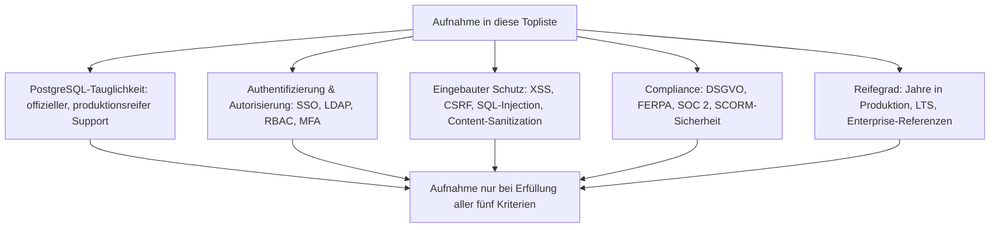
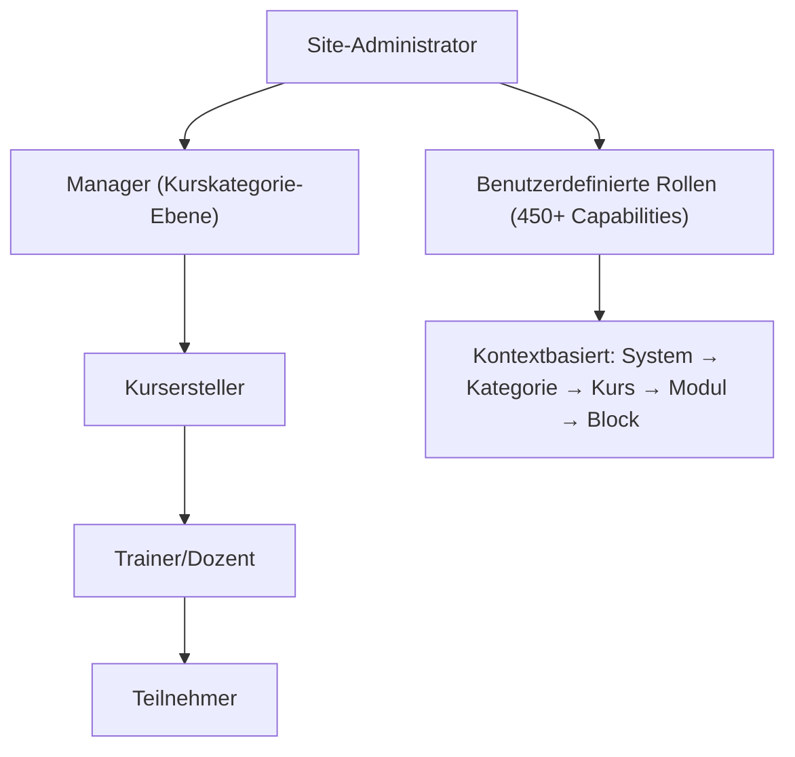
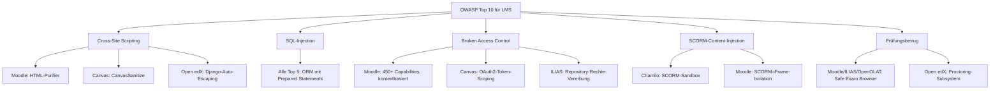
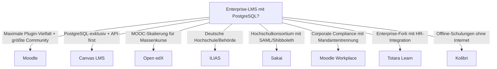
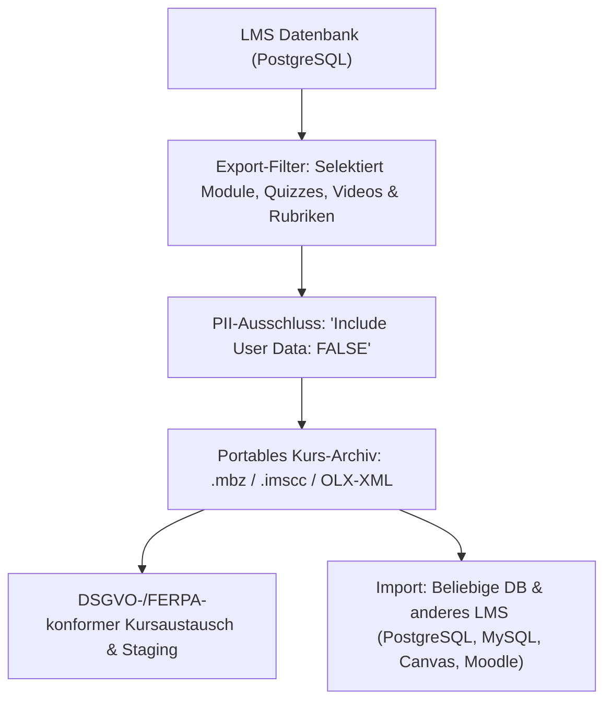

# Enterprise-LMS im Sicherheitsvergleich — PostgreSQL-taugliche Top-10-Topliste

Welches Lernmanagement-System (LMS) hat die beste Sicherheit im Enterprise-Bereich, den höchsten Reifegrad, ist robust gegen Hackerangriffe **und** unterstützt PostgreSQL als Datenbankbackend? Diese Seite filtert die LMS-Landschaft — von klassischen Hochschul-LMS über Corporate-Talent-Suiten bis zu modernen Open-Source-Plattformen — nach Sicherheitsarchitektur, Angriffsresistenz, Reifegrad und PostgreSQL-Tauglichkeit. Verwandte Perspektiven bieten die [Beste Lernmanagement-Systeme 2026 (Top 20)](../../../wissen/e-learning/lms-2026-topliste.md) (allgemeines Ranking) und die [Beste klassische LMS 2026 (Top 15)](../../../wissen/e-learning/klassische-lms-2026-topliste.md) (Generationenmodell).

!!! note "Hinweis"
    Viele kommerzielle LMS (Cornerstone OnDemand, SAP SuccessFactors, D2L Brightspace) sind reine SaaS-Plattformen ohne wählbares Datenbankbackend — sie entfallen aus dieser Liste, weil PostgreSQL-Tauglichkeit für Self-Hosting vorausgesetzt wird. Die hier gelisteten Systeme sind entweder Open Source oder bieten eine selbst betreibbare Enterprise-Edition.

---

## Bewertungskriterien

---

## Top 10 im Überblick

| Rang | LMS | Sprache | PostgreSQL | Reifegrad | Sicherheits-Highlight |
|---|---|---|---|---|---|
| 1 | **Moodle** | PHP | ✅ Offiziell | 23+ Jahre | Dedizertes Security-Team, granularstes Rollen-/Rechtemodell aller Open-Source-LMS |
| 2 | **Canvas LMS** | Ruby/Rails | ✅ Nativ (einziges Backend) | 16+ Jahre | PostgreSQL-exklusiv, API-first-Architektur, Instructure-Security-Team |
| 3 | **Open edX** | Python/Django | ✅ Offiziell (seit Sumac) | 12+ Jahre | Erbt Djangos „Security by Default", edX/2U-Sicherheitsaudits |
| 4 | **ILIAS** | PHP | ✅ Offiziell | 26+ Jahre | Ältestes noch aktives Open-Source-LMS, deutsche Hochschul-Härtung |
| 5 | **Sakai** | Java | ✅ Offiziell | 20+ Jahre | Java-EE-Sicherheitsstack, Hochschulkonsortium-Governance |
| 6 | **Chamilo** | PHP | ✅ Offiziell | 14+ Jahre | SCORM-Isolation, eingebaute Prüfungssicherheit |
| 7 | **Moodle Workplace** | PHP | ✅ Offiziell | 6+ Jahre | Enterprise-Erweiterung von Moodle, Multi-Tenancy mit Mandantentrennung |
| 8 | **Totara Learn** | PHP | ✅ Offiziell | 12+ Jahre | Moodle-Fork mit Enterprise-Härtung, Compliance-Workflows |
| 9 | **OpenOLAT** | Java | ✅ Offiziell | 25+ Jahre | Schweizer Hochschul-Entwicklung, strikte Prüfungsisolation |
| 10 | **Kolibri** | Python/Django | ✅ SQLite (offline-first) | 8+ Jahre | Offline-first-Architektur eliminiert Netzwerk-Angriffsvektoren |

---

## Detailanalyse

### 🥇 Rang 1: Moodle (PHP)

**Warum Rang 1?** Moodle ist das weltweit am weitesten verbreitete LMS mit über 400 Millionen Nutzern auf mehr als 240.000 registrierten Instanzen. Das dedizierte Moodle-Security-Team betreibt einen formalen Security-Advisory-Prozess (MSA) mit eigener CVE-Vergabe und koordinierter Disclosure.

**Sicherheitsarchitektur:**

| Angriffsvektor | Schutzmaßnahme | Standardmäßig aktiv |
|---|---|---|
| XSS | HTML-Purifier für alle Nutzereingaben | ✅ Ja |
| SQL-Injection | Moodle DML (Database Manipulation Language) mit Parameterized Queries | ✅ Ja |
| CSRF | Sesskey-Token-System für alle Formulare | ✅ Ja |
| Session Hijacking | Sichere Cookie-Konfiguration (HttpOnly, Secure, SameSite) | ✅ Ja |
| Brute-Force | Konfigurierbare Login-Lockout-Policy | ✅ Ja |
| File Upload | MIME-Typ-Validierung, Virus-Scanner-Integration (ClamAV) | ⚙️ Konfiguration |

**Rechtemodell:**

**PostgreSQL-Integration:** Offiziell unterstützt seit Moodle 2.0 (2010), vollständig gleichwertig zu MySQL/MariaDB. Alle 450+ Capabilities und der gesamte Plugin-Katalog funktionieren mit beiden Backends.

**Besondere Stärken:**

- **Security Announcements (MSA)**: Eigener Mailing-Listen-Kanal, koordinierte Disclosure mit 1-Wochen-Embargo
- **Content-Security-Policy**: Native CSP-Unterstützung seit Moodle 3.8
- **Multi-Faktor-Authentifizierung**: TOTP, E-Mail-Verification, IP-Restriction nativ seit Moodle 3.10
- **Privacy API (DSGVO)**: Eingebaute Datenschutz-Werkzeuge für Auskunfts-/Löschanfragen
- **Prüfungssicherheit**: Safe Exam Browser-Integration, Timer-basierte Quiz-Isolation

**Compliance:** FERPA (USA), DSGVO (EU), WCAG 2.1 AA (Barrierefreiheit).

**Enterprise-Referenzen:** Shell, Volkswagen, UNESCO, London School of Economics, hunderte Universitäten weltweit.

---

### 🥈 Rang 2: Canvas LMS (Ruby on Rails)

**Warum Rang 2?** Canvas ist das einzige große Open-Source-LMS, das **ausschließlich PostgreSQL** als Datenbankbackend unterstützt — keine MySQL-Alternative, keine SQLite-Fallback-Option. Diese Einschränkung ist bewusst: Sie erlaubt die Nutzung PostgreSQL-spezifischer Sicherheitsfeatures (Row-Level Security, pgcrypto) direkt im Anwendungskern.

**Sicherheitsarchitektur:**

| Angriffsvektor | Schutzmaßnahme | Standardmäßig aktiv |
|---|---|---|
| XSS | Rails-Auto-Escaping + CanvasSanitize für Rich-Text | ✅ Ja |
| SQL-Injection | ActiveRecord ORM mit Parameterized Queries | ✅ Ja |
| CSRF | Rails-Authenticity-Token für alle Formulare | ✅ Ja |
| API-Missbrauch | OAuth2-Token-Scoping pro API-Endpunkt | ✅ Ja |
| Session Hijacking | Pseudonymisierte Session-IDs, Token-Rotation | ✅ Ja |

**Besondere Stärken:**

- **API-first**: Jede UI-Aktion hat ein API-Pendant — ermöglicht granulare API-Token-Berechtigungen
- **LTI 1.3 Advantage**: Sicherster LTI-Standard mit OAuth2-basierter Tool-Authentifizierung
- **Instructure Security Team**: Professionelles Sicherheitsteam mit Bug-Bounty-Programm
- **Canvas Data 2**: Anonymisierter Datenexport für Analytics ohne PII-Exposition

**PostgreSQL-Integration:** PostgreSQL ist das **einzige** unterstützte Backend — kein Kompromiss, kein Fallback.

**Enterprise-Referenzen:** Harvard University, Stanford University, University of Oxford, ETH Zürich.

---

### 🥉 Rang 3: Open edX (Python/Django)

**Warum Rang 3?** Open edX erbt Djangos gesamtes „Security by Default"-Arsenal und ergänzt es um MOOC-spezifische Sicherheitsmaßnahmen: Prüfungs-Proctoring, Zertifikats-Validierung und skalierbaren DDoS-Schutz für Massenkurse mit hunderttausenden gleichzeitigen Teilnehmern.

**Sicherheitsarchitektur:**

| Angriffsvektor | Schutzmaßnahme | Standardmäßig aktiv |
|---|---|---|
| XSS | Django-Template-Auto-Escaping | ✅ Ja |
| SQL-Injection | Django ORM mit Parameterized Queries | ✅ Ja |
| CSRF | Django-CSRF-Middleware | ✅ Ja |
| Prüfungsbetrug | Proctoring-Subsystem (optional: RPNow, Proctorio) | ⚙️ Konfiguration |
| Zertifikatsfälschung | Kryptografisch signierte Zertifikate (Blockchain-optional) | ✅ Ja |

**Besondere Stärken:**

- **Microservice-Architektur**: Separate Services für Auth (LMS), Content (CMS/Studio), E-Commerce — Kompromittierung eines Dienstes betrifft nicht alle
- **OAuth2/JWT**: Token-basierte Inter-Service-Kommunikation
- **Django-Admin-Isolation**: Admin-Panel nur über separaten Port/VHost erreichbar

**PostgreSQL-Integration:** Seit der Sumac-Release (2024) offiziell unterstützt; MySQL bleibt als Alternative.

**Enterprise-Referenzen:** MIT, Harvard, Microsoft, IBM, Google (für interne Schulungen).

---

### Rang 4: ILIAS (PHP)

**Besondere Stärke:** ILIAS ist das **älteste noch aktiv entwickelte** Open-Source-LMS (seit 1998, entstanden an der Universität zu Köln). Über 26 Jahre Produktionseinsatz in deutschen Hochschulen haben eine Sicherheitskultur geformt, die sich in detaillierten Audit-Logs, granularer Rechtevererbung und einem aktiven ILIAS-Security-Team niederschlägt.

- **RBAC**: Kontextbasiertes Rollenmodell mit Vererbung über Repository-Struktur (Kategorie → Kurs → Gruppe → Objekt)
- **Prüfungssicherheit**: Eigenes Test-Assessment-Modul mit Zeitbegrenzung, Zufallsfragen und IP-Restriction
- **PostgreSQL-Integration:** Offiziell unterstützt über Doctrine DBAL

**Enterprise-Referenzen:** Bundeswehr, Bundespolizei, zahlreiche deutsche Universitäten, Schweizerisches Rotes Kreuz.

---

### Rang 5: Sakai (Java)

**Besondere Stärke:** Als Java-basiertes System erbt Sakai den vollständigen Java-EE-Sicherheitsstack (JAAS, Container-Security). Die Entwicklung wird von einem **Hochschulkonsortium** (Apereo Foundation) getragen — Sicherheitsanforderungen kommen direkt von Universitäts-IT-Abteilungen mit regulatorischen Verpflichtungen (FERPA, GDPR).

- **CAS/SAML/Shibboleth**: Föderierte Authentifizierung für Hochschul-Verbünde
- **Gradebook-Isolation**: Notendaten sind in einem separaten Sicherheitskontext geschützt
- **PostgreSQL-Integration:** Offiziell unterstützt über Hibernate

**Enterprise-Referenzen:** University of Michigan, Indiana University, Universidad Complutense de Madrid.

---

### Rang 6–10: Kurzprofile

| Rang | LMS | Sicherheits-Kernargument | PostgreSQL-Besonderheit |
|---|---|---|---|
| 6 | **Chamilo** | SCORM-Content wird in einem isolierten Kontext ausgeführt; eingebaute Prüfungssicherheit mit Zeitbegrenzung und Browser-Lockdown; aktives Security-Advisory-System | PostgreSQL offiziell über Doctrine DBAL unterstützt |
| 7 | **Moodle Workplace** | Multi-Tenancy mit vollständiger Mandantentrennung (getrennte Daten, Themes, Plugins pro Mandant); Compliance-Reporting für regulierte Branchen (ISO 27001-zertifizierbar) | Erbt Moodles vollständigen PostgreSQL-Support |
| 8 | **Totara Learn** | Moodle-Fork mit Enterprise-Härtung: verpflichtende MFA für Admins, Compliance-Workflows mit Audit-Trail, HR-System-Integration (SAP, Workday) | PostgreSQL offiziell unterstützt, identisch zu Moodle-Basis |
| 9 | **OpenOLAT** | Schweizer Hochschul-Entwicklung (Universität Zürich); strikte Prüfungsisolation mit Safe Exam Browser; Shibboleth-Authentifizierung für Hochschul-Verbünde | PostgreSQL offiziell über Hibernate; empfohlenes Produktionsbackend |
| 10 | **Kolibri** | Offline-first: läuft vollständig ohne Internetverbindung — eliminiert Netzwerk-Angriffsvektoren vollständig; Facility-Admin-System für Schulen ohne IT-Personal | SQLite als Datenbank (offline-tauglich); kein PostgreSQL, aber extrem kleine Angriffsfläche |

---

## Angriffsresistenz im Vergleich

---

## Entscheidungshilfe nach Anwendungsfall

---

## LMS-spezifische Sicherheitsmaßnahmen

Über die allgemeine Web-Security hinaus erfordern LMS-Deployments zusätzliche Absicherung:

| Maßnahme | Zweck | Relevante Systeme |
|---|---|---|
| **Safe Exam Browser (SEB)** | Browser-Lockdown während Prüfungen | Moodle, ILIAS, OpenOLAT |
| **LTI 1.3 Advantage** | Sichere Tool-Integration mit OAuth2 | Canvas, Moodle, Open edX |
| **SCORM-Sandbox** | Isolierte Ausführung externer Lerninhalte | Alle mit SCORM-Support |
| **Proctoring-Integration** | Überwachung bei Fernprüfungen | Open edX, Moodle (Plugin) |
| **Zertifikats-Signierung** | Fälschungsschutz für Abschluss-Nachweise | Open edX, Canvas |
| **FERPA/DSGVO-Compliance** | Datenschutz für Lernenden-Daten | Alle Top 5 |

---

## 💾 PII-freie & datenbankneutrale LMS-Backups (z. B. .mbz, IMS CC, XML): Sicherheit & Reifegrad

Warum sind vollständige SQL-Dumps (`pg_dump`) im E-Learning- und Schulungsbereich ein **massives Datenschutz- und Compliance-Risiko (DSGVO / FERPA)**, und welches LMS bietet die sicherste Lösung für **datenbankneutrale, anonymisierte und PII-freie Kurs-Backups** (z. B. im Format `.mbz`, IMS Common Cartridge oder XML)?

### Das Problem mit relationalen LMS-Datenbank-Dumps:
- **Hochsensible Lerndaten (PII):** Ein nativer `pg_dump` enthält alle personenbezogenen Bildungsdaten: **Prüfungsnoten, Testergebnisse, Fehlversuche, private Feedback-Gespräche, Foren-Beiträge, Bcrypt-Passwort-Hashes und IP-Logs**.
- **Compliance-Verstoß bei Kursweitergabe:** Wenn Dozenten, Lehrstühle oder Corporate Trainer Kurse zwischen Systemen austauschen oder als Vorlage exportieren, dürfen **keine echten Studentendaten** im Backup enthalten sein.
- **Die Lösung:** **Standardisierte, datenbankneutrale Kurs-Archive**, die ausschließlich Kursstrukturen, Lehrmaterialien, Quizzes, H5P-Pakete und Bewertungsrubriken sichern — **vollständig isoliert von Benutzerkonten und Leistungshistorien**.

---

### Vergleichsmatrix: Datenbankneutrale & PII-freie LMS-Backups

| LMS | Portables Kurs-Backup-Format | PII-Ausschluss-Garantie | Datenbank-Neutralität beim Restore | Schutz vor Parser-Exploits (XXE, Zip-Slip) | Standardisierung & Interoperabilität |
|---|---|---|---|---|---|
| 🥇 **Moodle** | `.mbz` (Moodle Backup Zip mit XML) | ⭐⭐⭐⭐⭐ (Granulare Checkbox: Nutzerdaten abwählbar) | ⭐⭐⭐⭐⭐ (PostgreSQL ↔ MySQL ↔ MariaDB) | ⭐⭐⭐⭐⭐ (Gehärtete Moodle-Restore-Engine) | ⭐⭐⭐⭐⭐ (De-facto-Weltstandard) |
| 🥈 **Canvas LMS** | `.imscc` (IMS Common Cartridge 1.3) | ⭐⭐⭐⭐⭐ (Per Standard 100% PII-frei) | ⭐⭐⭐⭐⭐ (Cross-LMS: Canvas ↔ Moodle ↔ Sakai) | ⭐⭐⭐⭐⭐ (IMS-Standard-Parser) | ⭐⭐⭐⭐⭐ (Globaler Bildungsstandard) |
| 🥉 **Open edX** | OLX (Open Learning XML / `.tar.gz`) | ⭐⭐⭐⭐⭐ (Reine Kursstruktur, 0 Nutzerdaten) | ⭐⭐⭐⭐⭐ (Reines XML-Dateisystem) | ⭐⭐⭐⭐ (Python `defusedxml` empfohlen) | ⭐⭐⭐⭐⭐ (MOOC-Industriestandard) |
| **ILIAS** | `.zip` (ILIAS XML Course Export) | ⭐⭐⭐⭐⭐ (Mitgliederdaten explizit trennbar) | ⭐⭐⭐⭐⭐ (Über Doctrine DBAL portabel) | ⭐⭐⭐⭐ (XML-Reader-Härtung) | ⭐⭐⭐⭐ (Deutscher Hochschulstandard) |
| **Sakai** | IMS CC / Sakai Archive Package | ⭐⭐⭐⭐ (Common Cartridge Export) | ⭐⭐⭐⭐⭐ (Hibernate-unabhängig) | ⭐⭐⭐⭐ (Java-Security-Manager) | ⭐⭐⭐⭐ (Apereo-Standard) |
| **Chamilo** | `.zip` (Chamilo Course Backup) | ⭐⭐⭐⭐ (Kurs-Klon ohne Studentendaten) | ⭐⭐⭐⭐ (Doctrine DBAL) | ⭐⭐⭐⭐ (PHP-ZipArchive) | ⭐⭐⭐ (Proprietäres Zip-Format) |

---

### Die 3 LMS-Champions für datenbankneutrale Backups im Detail

#### 1. Der weltweite Standard für modulare Kurs-Dumps: **Moodle** (`.mbz` / `moodle_backup.xml`)
- **Warum?** Moodle bietet das flexibelste und am feinsten konfigurierbare Kurs-Backup-System aller E-Learning-Plattformen.
- **Sicherheits-Feature (PII-Ausschluss):**
  - Beim Erstellen eines Kurs-Backups (per Web-UI oder CLI `admin/cli/backup.php`) wird die Option **„Nutzerdaten einbeziehen" (Include User Data)** deaktiviert.
  - Das resultierende `.mbz`-Archiv enthält alle Aktivitäten, Quizzes, H5P-Inhalte und Dateien als XML-Struktur (`moodle_backup.xml`) — **ohne Einschreibungen, Noten oder Forenbeiträge echter Teilnehmer**.
- **Datenbank-Neutralität:** Ein auf einer PostgreSQL-Instanz exportiertes `.mbz`-Backup kann ohne Datenverlust in eine MySQL-, MariaDB- oder Oracle-Moodle-Instanz eingespielt werden.

#### 2. Der globale Interoperabilitäts-Champion: **Canvas LMS** (IMS Common Cartridge / `.imscc`)
- **Warum?** Für Institutionen, die Kurse **systemübergreifend zwischen verschiedenen LMS-Anbietern** austauschen müssen.
- **IMS Common Cartridge (1.1 / 1.2 / 1.3):** Das `.imscc`-Format ist der offizielle Standard des *1EdTech Consortiums* (ehem. IMS Global). Es packt Lernmodule, LTI-Werkzeuge, Diskussionsforen-Strukturen und QTI-Testfragen in ein offenes XML-Paket.
- **PII-Sicherheit ab Werk:** Common Cartridges sind bauartbedingt reine Lehrmittel-Container — das Format sieht überhaupt keine Felder für Noten oder Schüler-Accounts vor.

#### 3. Der Docs-as-Code & Git-Champion: **Open edX** (OLX / Open Learning XML)
- **Warum?** Für Bildungsanbieter, die Kurse wie Software behandeln, versionieren und in Git-Repositories pflegen wollen (*Courses-as-Code*).
- **OLX-Architektur:** Open edX exportiert Kurse als Tarball (`.tar.gz`), der eine saubere Verzeichnisstruktur aus XML-Dateien (Chapters, Sequentials, Verticals) und HTML/Python-XBlocks enthält.
- **Vollständige Trennung:** Da OLX reinen Content repräsentiert, existiert keinerlei Berührungspunkt mit der PostgreSQL-Datenbank der Benutzerdaten.

---

### Sicherheitsregeln für den Import von LMS-Kurs-Backups

1. **XXE-Schutz in XML-Parsern aktivieren:** Alle XML-Parser müssen externe DTD-Entitäten (`LIBXML_NONET` / `XMLConstants.FEATURE_SECURE_PROCESSING`) strikt ablehnen.
2. **Zip-Slip-Prävention:** Beim Entpacken von `.mbz`- oder `.imscc`-Dateien sicherstellen, dass keine relativen Pfade (`../../`) aus dem temporären Verzeichnis ausbrechen.
3. **SCORM- & HTML-Isolation:** Importierte interaktive HTML5- und SCORM-Lernmodule immer in einer isolierten Subdomain (Sandbox-iFrame ohne Session-Cookies) ausführen.
4. **QTI-Fragen-Sanitization:** Bei Multiple-Choice- und Freitext-Fragen alle enthaltenen JavaScript-Tags vor dem Speichern durch den HTML-Purifier filtern.

---

## PostgreSQL-Härtung für LMS-Deployments

| Maßnahme | Konfiguration | Zweck |
|---|---|---|
| **Verschlüsselte Verbindung** | `ssl = on` in `postgresql.conf` | Schutz vor Netzwerk-Sniffing |
| **Minimale DB-Rechte** | Kein `SUPERUSER` für LMS-Benutzer | Schadensbegrenzung bei Kompromittierung |
| **Connection Pooling** | pgBouncer vor PostgreSQL | Schutz vor Connection-Flooding bei Prüfungsspitzen |
| **Backup-Verschlüsselung** | pgBackRest mit AES-256 | Schutz von Prüfungsdaten und Noten |
| **Audit-Logging** | `pgAudit`-Extension | Nachvollziehbarkeit aller Noten-/Bewertungs-Zugriffe |

!!! tip "Tipp"
    Detaillierte PostgreSQL-Konfigurationsanleitungen: [PostgreSQL-Grundlagen](../postgresql.md), [PostgreSQL-DBA-Praxis](../postgresql-dba-praxis.md).

---

## 🔗 Verwandte Themen

- [Sicherheit & Datenschutz für KI](index.md) – Übergeordnete Sicherheitsübersicht
- [Beste Lernmanagement-Systeme 2026 (Top 20)](../../../wissen/e-learning/lms-2026-topliste.md) – Allgemeines LMS-Ranking
- [Beste klassische LMS 2026 (Top 15)](../../../wissen/e-learning/klassische-lms-2026-topliste.md) – Generationenmodell
- [KI in Lehre & Weiterbildung](../../../wissen/e-learning/ki-lehre-weiterbildung.md) – KI-gestützte Lernszenarien
- [Enterprise-Webframework Sicherheit (Top 10)](enterprise-webframework-sicherheit-topliste.md) – Framework-Ebene
- [Nginx Hardening & Sicherheit](../nginx-hardening.md) – Reverse-Proxy-Absicherung
- [PostgreSQL Grundlagen](../postgresql.md) – Datenbank-Setup

---

*Letzte Aktualisierung: August 2026*
