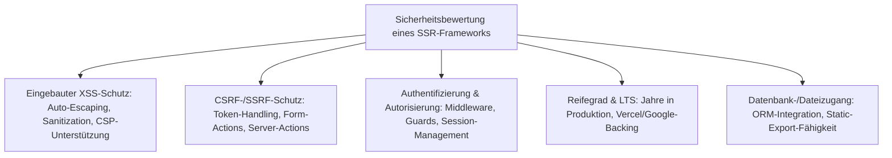
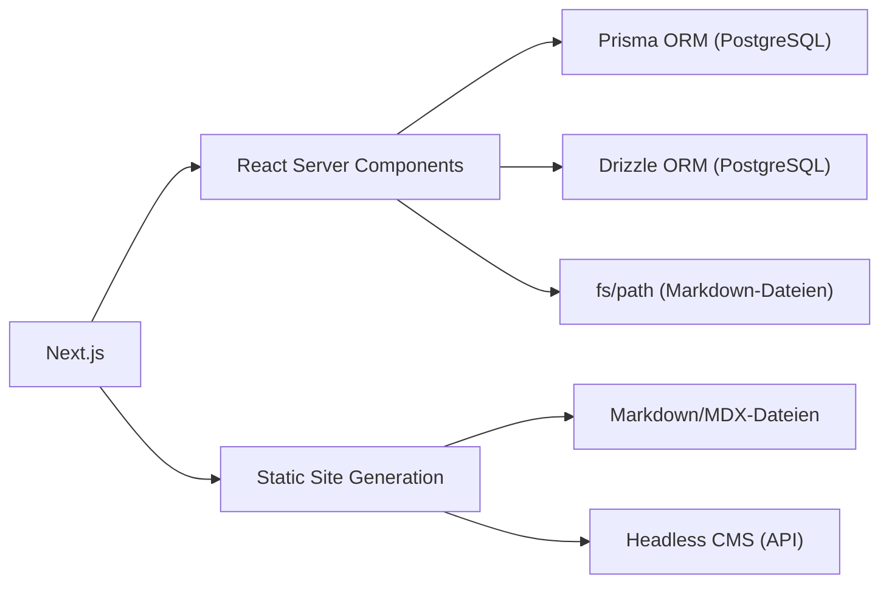
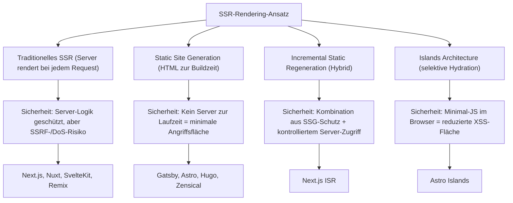
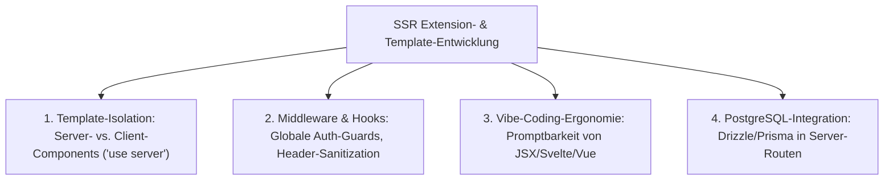
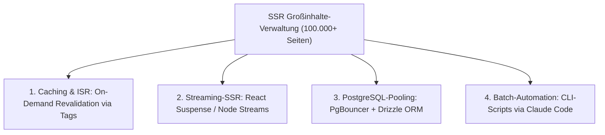

# Enterprise-SSR-Frameworks im Sicherheitsvergleich — Top-10-Topliste (PostgreSQL & dateibasiert)

Welches Server-Side-Rendering-Framework (SSR) hat die beste Sicherheit im Enterprise-Bereich, den höchsten Reifegrad und ist robust gegen Hackerangriffe? Diese Seite bewertet die zehn wichtigsten SSR-fähigen Frameworks und Meta-Frameworks nach **Sicherheitsarchitektur, Angriffsresistenz und Reifegrad** — und dokumentiert für jedes System, ob es PostgreSQL, dateisbasierte Persistenz oder beides unterstützt. Verwandte Perspektiven bieten die [Beste Full-Stack-Meta-Frameworks 2026 (Top 15)](../../webentwicklung/meta-frameworks-2026-topliste.md) (allgemeines Ranking ohne Sicherheitsfokus) und die [Enterprise-Webframework Sicherheit (Top 10)](enterprise-webframework-sicherheit-topliste.md) (Backend-Frameworks statt SSR-Meta-Frameworks).

!!! note "Hinweis"
    SSR-Meta-Frameworks (Next.js, Nuxt, SvelteKit) sind primär **Rendering-** und **Routing-Schichten** — sie bringen in der Regel kein eigenes ORM oder Datenbank-Backend mit. Die PostgreSQL-/Datei-Spalte bezieht sich auf die **natürliche Datenzugangs-Strategie**: Welches ORM/Backend lässt sich idiomatisch und sicherheitskonform anbinden?

---

## Bewertungskriterien

---

## Top 10 im Überblick

| Rang | SSR-Framework | Basis | PostgreSQL | Dateibasiert | Reifegrad | Sicherheits-Highlight |
|---|---|---|---|---|---|---|
| 1 | **Next.js** | React | ✅ Prisma/Drizzle | ✅ SSG/ISR | 9+ Jahre | Server-Actions mit eingebauter CSRF-Absicherung, Middleware-Auth-Layer |
| 2 | **Nuxt 3** | Vue | ✅ Prisma/Drizzle | ✅ SSG (Nitro) | 8+ Jahre | useFetch-Auto-Sanitization, Server-Routes mit H3-Sicherheitsschicht |
| 3 | **SvelteKit** | Svelte | ✅ Prisma/Drizzle | ✅ Prerender | 4+ Jahre | CSRF-Schutz ab Werk, strictes Content-Security-Policy-Handling |
| 4 | **Remix** | React | ✅ Prisma/Drizzle | ✅ Static-Export | 4+ Jahre | Progressive Enhancement, Formulare funktionieren ohne JavaScript |
| 5 | **Angular Universal / Analog** | Angular | ✅ über Backend | ✅ Prerender | 10+ Jahre (Angular) | DOM-Sanitization (DomSanitizer), strikter CSP-Modus, Google-Audits |
| 6 | **Astro** (SSR-Modus) | Agnostisch | ✅ über Adapter | ✅ SSG-first | 4+ Jahre | Kein Client-JS per Default, minimale Angriffsfläche im Browser |
| 7 | **Gatsby** | React | ✅ über Plugins | ✅ SSG-native | 8+ Jahre | Statische Ausgabe eliminiert Server-Angriffsvektoren komplett |
| 8 | **SolidStart** | SolidJS | ✅ Prisma/Drizzle | ✅ SSG-Modus | 2+ Jahre | Signal-basierte Reaktivität ohne Virtual DOM, weniger XSS-Angriffsfläche |
| 9 | **Blazor Server** | .NET | ✅ EF Core nativ | ❌ Server-only | 5+ Jahre | ASP.NET-Core-Sicherheitsstack, SignalR-WebSocket-Authentifizierung |
| 10 | **Vaadin** (Flow) | Java | ✅ JPA/Hibernate | ❌ Server-only | 20+ Jahre | Kein clientseitiges JavaScript für UI-Logik, eliminiert XSS/CSRF |

---

## Detailanalyse

### 🥇 Rang 1: Next.js (React)

**Warum Rang 1?** Next.js kombiniert die größte SSR-Community mit den ausgereiftesten Sicherheitsmechanismen: Server-Actions mit eingebauter CSRF-Absicherung, Middleware für Authentifizierungs-Guards und eine strikte Trennung zwischen Server- und Client-Code, die verhindert, dass Secrets an den Browser gelangen.

**Sicherheitsarchitektur:**

| Angriffsvektor | Schutzmaßnahme | Standardmäßig aktiv |
|---|---|---|
| XSS | React-Auto-Escaping in JSX, `dangerouslySetInnerHTML` muss explizit gewählt werden | ✅ Ja |
| CSRF | Server-Actions verwenden einmalige Action-IDs, nicht ratbare Tokens | ✅ Ja |
| SSRF | Server-Components isolieren Datenabrufe vom Client | ✅ Ja |
| Secret Leakage | `'use server'`-Direktive verhindert Server-Code-Export an den Browser | ✅ Ja |
| Unauthorized Access | Middleware-Layer für Authentifizierungs-Guards auf Route-Ebene | ⚙️ Konfiguration |
| Clickjacking | Security-Header über `next.config.js` konfigurierbar | ⚙️ Konfiguration |

**Datenbank-/Dateizugang:**

- **PostgreSQL**: Über Prisma oder Drizzle ORM in Server-Components/Server-Actions — Prepared Statements ab Werk
- **Dateibasiert**: SSG-Modus generiert statische HTML-Dateien; MDX-Content aus dem Dateisystem; ISR für hybride Szenarien

**Besondere Stärken:**

- **`next/headers`**: Read-only-Zugriff auf Request-Header in Server-Components verhindert Header-Injection
- **Content-Security-Policy**: Nonce-basiertes Script-Loading über `next.config.js`
- **Auth.js (NextAuth)**: De-facto-Standard-Authentifizierungsbibliothek, OAuth2/OIDC/Credentials/Passkeys
- **Edge Middleware**: Authentifizierungs-Checks am CDN-Edge, bevor der Server erreicht wird

!!! warning "Achtung"
    Server-Actions sind seit Next.js 14 stabil, aber erfordern Verständnis der Server-/Client-Grenze. Ein häufiger Sicherheitsfehler ist, sensible Daten in Client-Components zu verarbeiten statt in Server-Components — der TypeScript-Compiler warnt **nicht** davor.

**Reifegrad:** Vercel-gestützte Entwicklung, wöchentliche Patches, größte SSR-Community weltweit.

---

### 🥈 Rang 2: Nuxt 3 (Vue)

**Warum Rang 2?** Nuxt 3 baut auf der H3-Server-Engine auf, die vom UnJS-Team gezielt für Sicherheit entwickelt wurde: automatische Input-Validation, eingebaute CORS-Konfiguration und ein Event-Handler-System, das Server-Routes von Client-Code vollständig isoliert.

**Sicherheitsarchitektur:**

| Angriffsvektor | Schutzmaßnahme | Standardmäßig aktiv |
|---|---|---|
| XSS | Vue-Template-Auto-Escaping, `v-html` muss explizit gewählt werden | ✅ Ja |
| CSRF | `useFetch`/`$fetch` nutzen automatisch sichere Header | ✅ Ja |
| SSRF | Server-Routes (`/server/api/`) sind isoliert, nicht im Client-Bundle | ✅ Ja |
| Secret Leakage | `runtimeConfig` trennt public/private Keys | ✅ Ja |
| Injection | H3-Event-Handler mit automatischer Input-Validation | ⚙️ Konfiguration |

**Datenbank-/Dateizugang:**

- **PostgreSQL**: Prisma/Drizzle in Server-Routes (`/server/api/`), Prepared Statements
- **Dateibasiert**: Nuxt Content-Modul liest Markdown/YAML/JSON direkt aus `/content/`; SSG über `nuxt generate`

**Besondere Stärken:**

- **Nuxt Security-Modul**: Community-Modul setzt automatisch Security-Header (HSTS, CSP, X-Frame-Options)
- **`defineEventHandler`**: Server-Handler mit automatischem Request-Parsing und Validation
- **`useRequestHeaders`**: Kontrollierter Zugriff auf Request-Header ohne direkte Manipulation

---

### 🥉 Rang 3: SvelteKit (Svelte)

**Warum Rang 3?** SvelteKit ist das einzige große SSR-Framework mit **CSRF-Schutz ab Werk** — ohne jede Konfiguration. Origin-Checks für Form-Actions sind standardmäßig aktiviert und müssen explizit deaktiviert werden.

**Sicherheitsarchitektur:**

| Angriffsvektor | Schutzmaßnahme | Standardmäßig aktiv |
|---|---|---|
| XSS | Svelte-Template-Auto-Escaping, `{@html}` muss explizit gewählt werden | ✅ Ja |
| CSRF | Origin-Check für alle POST/PUT/DELETE-Requests | ✅ Ja |
| Secret Leakage | `$env/static/private` und `$env/dynamic/private` sind nur serverseitig importierbar | ✅ Ja |
| Unauthorized Access | `hooks.server.ts` für globale Auth-Guards | ⚙️ Konfiguration |
| Clickjacking | CSP über `svelte.config.js` konfigurierbar | ⚙️ Konfiguration |

**Datenbank-/Dateizugang:**

- **PostgreSQL**: Prisma/Drizzle in `+page.server.ts` oder `+server.ts`, Prepared Statements
- **Dateibasiert**: `adapter-static` für vollständig statische Ausgabe; Markdown-Processing über mdsvex

**Besondere Stärke:** Compiler-Ansatz ohne Virtual DOM reduziert die Client-seitige Angriffsfläche — weniger JavaScript im Browser bedeutet weniger XSS-Vektoren.

---

### Rang 4: Remix (React)

**Sicherheits-Kernargument:** Progressive Enhancement — Formulare funktionieren **auch ohne JavaScript** über native HTML-Form-Submissions. Das bedeutet: Selbst wenn ein Angreifer das clientseitige JavaScript kompromittiert, bleiben die serverseitigen Loader/Actions funktionstüchtig und sicher.

- **PostgreSQL**: Prisma/Drizzle in Loaders und Actions
- **Dateibasiert**: Static-Export-Modus, Markdown über MDX-Routes

---

### Rang 5: Angular Universal / Analog

**Sicherheits-Kernargument:** Angulars `DomSanitizer` ist der strengste eingebaute XSS-Schutz aller Frontend-Frameworks — er sanitiert nicht nur Templates, sondern auch programmtisch eingefügte URLs, Styles und HTML. Googles eigene Sicherheitsaudits fließen direkt in jedes Release ein.

- **PostgreSQL**: Über Backend-API (NestJS/Express), kein direkter DB-Zugriff im SSR-Layer
- **Dateibasiert**: Analog-Prerender für statische Content-Seiten

---

### Rang 6–10: Kurzprofile

| Rang | Framework | Sicherheits-Kernargument | PostgreSQL | Dateibasiert |
|---|---|---|---|---|
| 6 | **Astro** | Kein Client-JS per Default — Seiten sind statisches HTML, Angriffsfläche im Browser nahe null; Islands-Architektur hydratisiert nur interaktive Inseln | Über SSR-Adapter mit beliebigem ORM | ✅ SSG-first, Content Collections aus Markdown/MDX |
| 7 | **Gatsby** | Statische HTML-Ausgabe eliminiert Server-Angriffsvektoren vollständig — kein Server, kein SSRF, kein Session-Hijacking; GraphQL-Datenlayer nur zur Buildzeit | Über Source-Plugins (gatsby-source-pg) | ✅ SSG-native, Markdown über gatsby-transformer-remark |
| 8 | **SolidStart** | Signal-basierte Fine-Grained Reactivity ohne Virtual DOM; Server-Functions mit automatischer Serialisierung verhindern Prototype-Pollution | Prisma/Drizzle in Server-Functions | ✅ SSG-Modus verfügbar |
| 9 | **Blazor Server** | Erbt den vollständigen ASP.NET-Core-Sicherheitsstack; UI-Logik läuft ausschließlich auf dem Server, SignalR-WebSocket mit Authentifizierung | ✅ Entity Framework Core nativ | ❌ Kein statischer Export |
| 10 | **Vaadin** (Flow) | Kein clientseitiges JavaScript für UI-Logik — eliminiert XSS und CSRF als Angriffsklassen fast vollständig; serverseitiger Zustand verhindert Client-Manipulation | ✅ JPA/Hibernate nativ | ❌ Kein statischer Export |

---

## SSR-Sicherheitsarchitektur im Vergleich

---

## 🧩 Template- & Extension-Entwicklung: Sicherheit, Reifegrad & Vibe-Coding-Vergleich

Wie sicher, modular und KI-freundlich ist das **Bauen von Custom-UI-Templates, Komponenten, Server-Actions, Middleware und Modulen** in modernen SSR-Meta-Frameworks?

Im SSR-Bereich entsteht die größte Sicherheitsgefahr an der Schnittstelle zwischen Server und Client:
- **Secret Leaks:** Werden API-Keys, Datenbank-Tokens oder Server-Logik versehentlich in Client-Bundles gerendert?
- **Server-Side Request Forgery (SSRF):** Können manipulierte Template-Parameter interne Server-Abfragen auslösen?
- **Vibe-Coding-Vorteil:** Entwickler möchten mit KI-Assistenten (Cursor, Claude Code, Antigravity) per Prompt ganze Komponenten-Bibliotheken (shadcn/ui, Tailwind), Datenlade-Routinen und modulare Plugins generieren — mit maximaler Typsicherheit und automatischer Validierung.

### Architektur-Vergleich: Template- & Extension-Systeme

### Vergleichsmatrix: SSR-Templates & Extensions Bauen

| SSR-Framework | Template-Architektur & Isolation | Extension- & Modul-System | Schutz vor Secret-Leaks | Vibe-Coding-Ergonomie (Bauen) | PostgreSQL-Anbindung |
|---|---|---|---|---|---|
| **Next.js** | React Server Components (RSC) + JSX | Edge Middleware (`middleware.ts`), Server-Actions | ⭐⭐⭐⭐⭐ (`'use server'`-Direktive trennt Code) | ⭐⭐⭐⭐⭐ (Weltstandard) | Drizzle / Prisma / Server-Actions |
| **Nuxt 3** | Vue 3 SFC (Single File Components) | Nuxt-Modul-System (`defineNuxtModule`), Nitro-Server | ⭐⭐⭐⭐⭐ (`runtimeConfig.public` vs. `private`) | ⭐⭐⭐⭐⭐ (Königsklasse) | Prisma / Drizzle in Server-Routes |
| **SvelteKit** | Svelte 5 Components (Runes) | Server-Hooks (`hooks.server.ts`), Form-Actions | ⭐⭐⭐⭐⭐ (`$env/static/private` nur serverseitig) | ⭐⭐⭐⭐⭐ (Exzellent) | Drizzle / Prisma in `+page.server.ts` |
| **Astro** | `.astro` Components (Zero-JS-Default) | Astro Integration API (`astro:config`), Content-Schema | ⭐⭐⭐⭐⭐ (Kein Client-JS ohne `client:*`) | ⭐⭐⭐⭐⭐ (Exzellent) | Drizzle / ORMs über SSR-Adapter |
| **Remix** | React JSX + Native Web Forms | Loaders, Actions, `entry.server.tsx` | ⭐⭐⭐⭐ (Klare Trennung in Loader/Action) | ⭐⭐⭐⭐ (Sehr gut) | Prisma / Drizzle / PostgreSQL |
| **Angular / Analog** | Angular Components (DomSanitizer) | Analog Vite-Plugins, Angular Interceptors | ⭐⭐⭐⭐⭐ (Googles strikte Sanitization) | ⭐⭐⭐ (Komplexer) | Backend-API / Prisma in Nitro-Layer |

---

### Die 4 besten SSR-Systeme zum Bauen von Templates & Extensions

#### 1. Der unangefochtene Vibe-Coding-Weltstandard: **Next.js** (React Server Components + Server Actions)
- **Warum?** Next.js besitzt das mit Abstand größte Ökosystem an KI-optimierten UI-Templates und Komponenten-Bibliotheken (shadcn/ui, Radix UI, Tailwind CSS, Lucide).
- **Template-Entwicklung:** **React Server Components (RSC)** rendern standardmäßig zu 100 % auf dem Server. Datenbank-Queries via Drizzle oder Prisma können direkt in der Komponente ausgeführt werden, ohne dass sensible Verbindungsdaten oder ORM-Code jemals den Browser erreichen.
- **Extension-Entwicklung:** **Server-Actions** (`'use server'`) ermöglichen es, serverseitige Mutationen wie normale Funktionen aufzurufen — inklusive automatischem CSRF-Schutz und Action-ID-Verschlüsselung.
- **Vibe Coding:** Jedes moderne KI-Modell generiert Next.js-Komponenten und Server-Actions mit einer Genauigkeit von über 95 % im First-Shot.

#### 2. Das mächtigste Modul-Ökosystem: **Nuxt 3** (Vue 3 + Nuxt Modules + Nitro)
- **Warum?** Nuxt 3 besitzt die ausgereifteste und am besten strukturierte Plugin- und Modul-Architektur der gesamten SSR-Landschaft.
- **Extension-Entwicklung:** Über `defineNuxtModule` lassen sich vollwertige Erweiterungen mit Build-Hooks, Server-Middleware und Auto-Imports kapseln. Das offizielle Ökosystem umfasst vorgefertigte Sicherheitsmodule wie **Nuxt Security** (automatische CSP-, HSTS- und CORS-Header).
- **Template-Entwicklung:** Vue Single-File-Components (`.vue`) trennen Template, Script und Style übersichtlich. Auto-Imports eliminieren lästigen Import-Boilerplate.
- **Vibe Coding:** Die extrem saubere Struktur von Nuxt-Seiten (`pages/`) und Server-Routen (`server/api/`) erlaubt blitzschnelles Prompting von Fullstack-Features.

#### 3. Die sicherste & schlankste Template-Engine: **SvelteKit** (Svelte 5 + Server-Hooks)
- **Warum?** Für Entwickler, die maximale Ausführungsgeschwindigkeit, minimalen JavaScript-Overhead und **integrierten CSRF-Schutz ab Werk** fordern.
- **Sicherheits-Vorteil:** CSRF-Origin-Checks sind für alle Form-Actions standardmäßig aktiv. Private Umgebungsvariablen (`$env/static/private`) werfen einen Build-Fehler, falls sie versehentlich in Client-Code importiert werden.
- **Template-Entwicklung:** Svelte 5 Runes (`$state`, `$derived`, `$props`) machen Komponenten extrem lesbar und reduzieren den Codeumfang im Vergleich zu React um ca. 40 %.
- **Vibe Coding:** KI-Assistenten generieren schlanke `+page.svelte` Templates und typsichere `+page.server.ts` Loader fehlerfrei.

#### 4. Der sicherste Content- & Islands-Champion: **Astro** (Content Collections + Zod)
- **Warum?** Für content-getriebene Websites, Dokumentationen und Portale mit maximaler Angriffsresistenz.
- **Template-Entwicklung:** `.astro`-Komponenten liefern **standardmäßig null Byte JavaScript an den Client**. Interaktive Widgets (React, Vue, Svelte) werden als isolierte „Islands" (`client:load`, `client:visible`) nur dort geladen, wo sie benötigt werden.
- **Sicherheits-Innovation (Content Collections):** Markdown- und MDX-Inhalte werden vor dem Rendern durch **Zod-Schemas** typgeprüft und validiert — fehlerhafte Frontmatter-Felder werden bereits zur Build-Zeit abgefangen.

---

### Vibe-Coding-Leitfaden: Sichere SSR-Templates & Extensions bauen

Wenn KI-Assistenten Templates, Komponenten oder Middleware für SSR generieren:

1. **Strikte Server-/Client-Trennung:** Niemals Datenbank-Clients (Prisma, Drizzle, `pg`) in Client-Components (`'use client'`) importieren.
2. **Server-Actions mit Zod validieren:** Jede Server-Action muss eingehende Formulardaten mit Zod oder Valibot serverseitig parsen und validieren.
3. **Session-Validation in Middleware:** Auth-Tokens und Session-Cookies in der zentralen Edge-/Server-Middleware prüfen, bevor geschützte Routen gerendert werden.
4. **Header-Sicherheit automatisieren:** Security-Header (CSP mit Nonces, X-Frame-Options: DENY, HSTS) über die zentrale Framework-Konfiguration erzwingen.

---

## 📚 Sehr große Inhalte verwalten & erstellen mit Claude Code: SSR-Skalierung, PostgreSQL & Enterprise-Sicherheit

Wie verhalten sich moderne SSR-Meta-Frameworks, wenn Claude Code für die **automatisierte Erstellung und Verwaltung von hunderttausenden bis millionenfachen dynamischen Seiten, gigantischen E-Commerce-Katalogen, Multi-Tenant-Portalen und hochfrequenten Datenbank-Abfragen** eingesetzt wird?

Bei der Großdaten-Skalierung im SSR-Betrieb entscheiden vier sicherheitsrelevante Kernarchitekturen:
- **PostgreSQL Connection Exhaustion:** Serverless- und Edge-SSR-Instanzen können bei Lastspitzen hunderte Verbindungen parallel öffnen — ohne Connection-Pooler (PgBouncer) droht ein vollständiger Datenbank-Lockout.
- **Streaming SSR & Suspense:** Große Datenmengen dürfen den Seitenaufbau nicht blockieren (Timeouts / DoS-Gefahr), sondern müssen progressiv über HTTP-Streams an den Browser übertragen werden.
- **On-Demand Cache-Invalidierung (ISR):** Dynamisch gerenderte Seiten müssen wie statische HTML-Seiten im CDN gecacht und nur bei echten Datenänderungen per Webhook (`revalidateTag()`, `revalidatePath()`) invalidiert werden.
- **Batch-Automation mit Claude Code:** Massen-Erstellung von Typschnittstellen, Drizzle-Schemas und Server-Actions ohne Memory-Leaks.

### Architektur-Vergleich: SSR-Großdaten-Skalierung

### Vergleichsmatrix: SSR-Großdaten & KI-Batch-Verarbeitung

| SSR-Framework | Maximale Content-Skala | On-Demand Caching & ISR | Streaming- & Suspense-Support | PostgreSQL-Connection-Handling | Claude Code Batch-Automation |
|---|---|---|---|---|---|
| 🥇 **Next.js** | ⭐⭐⭐⭐⭐ (Millionen Seiten, Vercel/Enterprise) | ⭐⭐⭐⭐⭐ (`revalidateTag()`, Data Cache) | ⭐⭐⭐⭐⭐ (React Server Components + Suspense) | ⭐⭐⭐⭐⭐ (Prisma Accelerate / PgBouncer) | ⭐⭐⭐⭐⭐ (Königsklasse) |
| 🥈 **Nuxt 3** | ⭐⭐⭐⭐⭐ (Große Portale, Nitro-Cache) | ⭐⭐⭐⭐⭐ (Nitro `cachedEventHandler`, SWR) | ⭐⭐⭐⭐⭐ (HTML-Streaming mit Vue 3) | ⭐⭐⭐⭐⭐ (Nitro Database Driver + PgBouncer) | ⭐⭐⭐⭐⭐ (Königsklasse) |
| 🥉 **Remix** | ⭐⭐⭐⭐ (Hohe Dynamik, Single-Fetch) | ⭐⭐⭐⭐ (Cache-Control Header, SWR) | ⭐⭐⭐⭐⭐ (Native Web Streams & Deferred Data) | ⭐⭐⭐⭐ (Prisma / Drizzle Connection-Pool) | ⭐⭐⭐⭐ (Sehr gut) |
| **Astro (SSR)** | ⭐⭐⭐⭐ (Hybrid: 95% SSG + 5% SSR) | ⭐⭐⭐⭐⭐ (Statischer Fallback + Edge-SSR) | ⭐⭐⭐⭐ (HTML-Streaming) | ⭐⭐⭐⭐ (Drizzle in Node-/Edge-Adapter) | ⭐⭐⭐⭐⭐ (Exzellent) |
| **SvelteKit** | ⭐⭐⭐⭐ (Hohe Performance, schlank) | ⭐⭐⭐⭐ (Page Caching, Header-Controls) | ⭐⭐⭐⭐⭐ (Streaming Promises in Loaders) | ⭐⭐⭐⭐ (Drizzle / Node-Pool) | ⭐⭐⭐⭐⭐ (Exzellent) |

---

### Die 3 SSR-Großdaten-Champions im Detail

#### 1. Der On-Demand-Revalidation- & Streaming-König: **Next.js** (RSC + Drizzle + ISR)
- **Warum?** Next.js löst das Skalierungsproblem dynamischer Großdatenbanken durch **Incremental Static Regeneration (ISR) mit Tag-basierter Invalidierung**.
- **On-Demand Cache-Architektur:** Eine Website mit 500.000 Produkt-Seiten wird bei Erstabruf gerendert und im globalen CDN zwischengespeichert. Wenn Claude Code per API 1.000 Produkte aktualisiert, ruft das Backend `revalidateTag('products')` auf — nur die betroffenen Seiten werden im Hintergrund neu gerendert, ohne die PostgreSQL-Datenbank mit 500.000 Neuabfragen zu fluten.
- **Streaming mit React Suspense:** Kritische Seiteninhalte (z. B. Navigation und Haupttext) werden in unter 50 ms ausgeliefert; schwere Datenbank-Aggregationen werden asynchron nachgestreamt.
- **PostgreSQL-Vorteil:** Mit **Drizzle ORM** werden Abfragen zur Kompilierzeit optimiert und über Connection-Pooler wie **PgBouncer** ohne Latenz-Overhead ausgeführt.

#### 2. Der Multi-Driver-Cache- & Nitro-Titan: **Nuxt 3** (Nitro + Unstorage + PostgreSQL)
- **Warum?** Die Server-Engine **Nitro** besitzt das flexibelste Multi-Layer-Caching-System der Webentwicklung.
- **Nitro Cache-Layer (`cachedEventHandler`):** Nuxt erlaubt es, Server-Routen und API-Endpunkte mit granularen Time-to-Live (TTL) und Stale-While-Revalidate (SWR) Regeln zu versehen. Als Cache-Speicher können Redis, PostgreSQL oder Cloud-Speicher modular konfiguriert werden.
- **Claude Code Massen-Workflow:** Claude Code kann neue `server/api/`-Routen mit automatischer Paging- und Filter-Logik generieren, die selbst bei Tabellen mit Millionen Zeilen konstante Antwortzeiten garantieren.

#### 3. Der Single-Fetch- & Web-Standards-Sieger: **Remix** (Single-Fetch + Web Streams)
- **Warum?** Für extrem dynamische Enterprise-Dashboards und Portale, bei denen Caching keine Option ist und Echtzeit-Datenkonsistenz im Vordergrund steht.
- **Single-Fetch-Architektur:** Statt für verschachtelte UI-Routen mehrere parallele HTTP-Anfragen abzufeuern, bündelt Remix alle Datenabrufe eines Seitenwechsels in einen einzigen optimierten Request.
- **Deferred Data:** Langsame PostgreSQL-Abfragen werden über `defer()` als native Web Streams asynchron an den Browser geschickt, während die UI sofort interaktiv bleibt.

---

### PostgreSQL-Skalierungsleitfaden für SSR-Großanwendungen

1. **PgBouncer zwingend vorschalten:** Bei Serverless-SSR (Next.js/Nuxt) immer Transaction-Pooling via PgBouncer nutzen (`max_connections` auf Serverless-Ebene begrenzen).
2. **Drizzle ORM für minimale Latenzen:** Statt schwerer Laufzeit-ORMs Drizzle ORM einsetzen — generiert fehlerfreie SQL-Prepared-Statements ohne Virtual-Machine-Overhead.
3. **Paging mit Keyset-Pagination (Cursor-basiert):** Bei Tabellen mit >100.000 Zeilen niemals `OFFSET` / `LIMIT` nutzen (Full-Table-Scan), sondern immer nach indexierten IDs filtern (`WHERE id > :last_seen_id ORDER BY id LIMIT 50`).
4. **Vermeidung von N+1 Query-Problemen:** Bei verschachtelten Server-Components immer Drizzle `with`-Relationen oder DataLoader-Patterns nutzen, um Datenbankabfragen zu bündeln.

---

## Dateibasiert vs. PostgreSQL: Sicherheitsperspektive

| Kriterium | Dateibasiert (SSG/Markdown) | PostgreSQL-Backend |
|---|---|---|
| **Angriffsfläche** | ✅ Minimal — kein Server zur Laufzeit, kein SQL-Injection-Risiko | ⚠️ Server läuft dauerhaft, SQL-Injection über ORM verhindert |
| **Authentifizierung** | ✅ Nicht nötig bei rein statischen Seiten | ⚙️ Session-/Token-Management erforderlich |
| **Content-Manipulation** | ⚠️ Nur über Dateisystem/Git-Zugriff möglich | ⚠️ Über DB-Zugriff oder kompromittierte Anwendung |
| **DDoS-Resistenz** | ✅ Statische Dateien über CDN skalierbar | ⚠️ Datenbankverbindungen limitiert |
| **Compliance-Audit** | ⚠️ Git-History als Audit-Log, nicht formalisiert | ✅ pgAudit, Row-Level Security, formale Audit-Trails |
| **Echtzeit-Inhalte** | ❌ Nur über Rebuilds oder ISR | ✅ Sofortige Aktualisierung |

!!! tip "Tipp"
    Für maximale Sicherheit bei Content-Websites (Dokumentation, Marketing, Blogs): **SSG mit dateibasiertem Markdown** — kein Server, kein Datenbankrisiko, CDN-Caching. Für dynamische Anwendungen mit Benutzerkonten und Echtzeit-Daten: **SSR mit PostgreSQL** über Prisma/Drizzle mit Prepared Statements.

---

## Sicherheits-Checkliste für Enterprise-SSR-Deployments

- [x] **Content-Security-Policy** definieren (Nonce-basiertes Script-Loading)
- [x] **Security-Header setzen** (HSTS, X-Content-Type-Options, X-Frame-Options, Referrer-Policy)
- [x] **Server-/Client-Grenze validieren** — keine Secrets in Client-Components
- [x] **Authentifizierung** über bewährte Bibliotheken (Auth.js, Lucia, Clerk) statt Eigenbau
- [x] **Rate Limiting** auf Server-Routes/Actions
- [x] **Dependency-Scanning** automatisieren (`npm audit`, Snyk, Socket)
- [x] **Statische Analyse** in CI/CD (ESLint Security-Plugins, SonarQube)
- [x] **Environment-Variablen** niemals im Client-Bundle (`.env.local` vs. `NEXT_PUBLIC_`)
- [x] **Subresource Integrity (SRI)** für externe Scripts
- [x] **Reverse-Proxy vorschalten** ([Nginx Hardening](../nginx-hardening.md) mit WAF)

---

## 🔗 Verwandte Themen

- [Sicherheit & Datenschutz für KI](index.md) – Übergeordnete Sicherheitsübersicht
- [Enterprise-Webframework Sicherheit (Top 10)](enterprise-webframework-sicherheit-topliste.md) – Backend-Frameworks statt SSR
- [Beste Full-Stack-Meta-Frameworks 2026 (Top 15)](../../webentwicklung/meta-frameworks-2026-topliste.md) – Allgemeines SSR-Ranking
- [Beste Islands- & Edge-Architekturen 2026 (Top 15)](../../webentwicklung/islands-edge-architektur-2026-topliste.md) – Feingranulare Fragment-Hydration
- [Enterprise-CMS Sicherheit & PostgreSQL (Top 10)](enterprise-cms-sicherheit-postgresql-topliste.md) – CMS-Ebene
- [Nginx Hardening & Sicherheit](../nginx-hardening.md) – Reverse-Proxy-Absicherung
- [PostgreSQL Grundlagen](../postgresql.md) – Datenbank-Setup

---

*Letzte Aktualisierung: August 2026*
