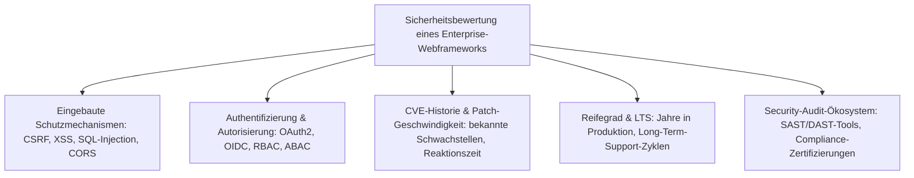
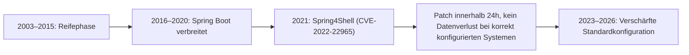
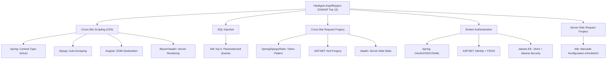
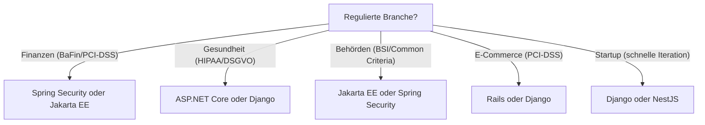
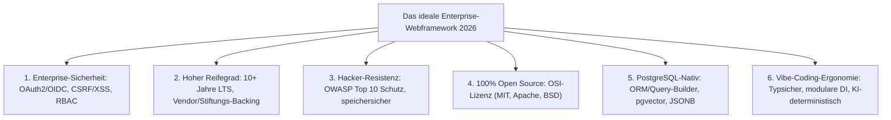

# Enterprise-Webframeworks im Sicherheitsvergleich — Top-10-Topliste

Welches Webframework hat die beste Sicherheit im Enterprise-Bereich, den höchsten Reifegrad und ist am robustesten gegen Hackerangriffe? Diese Seite bewertet die zehn wichtigsten Enterprise-Webframeworks aus der [Enterprise-Webframeworks-Topliste 2026](../../webentwicklung/enterprise-webframeworks-2026-topliste.md) nicht nach Feature-Umfang oder Performance, sondern ausschließlich nach **Sicherheitsarchitektur, Angriffsresistenz und Reifegrad** — drei Kriterien, die in regulierten Branchen (Finanzen, Gesundheit, Behörden) über Produktionsfreigabe oder Ablehnung entscheiden.

!!! note "Hinweis"
    Diese Bewertung berücksichtigt den Stand August 2026. Sicherheitslücken und Patches verändern das Bild laufend — die hier dokumentierten Stärken spiegeln die **strukturellen** Sicherheitseigenschaften der Frameworks wider, nicht einzelne CVEs.

---

## Bewertungskriterien

---

## Top 10 im Überblick

| Rang | Framework | Sprache | Reifegrad | Sicherheits-Highlight |
|---|---|---|---|---|
| 1 | **Spring Security + Spring Boot** | Java | 20+ Jahre | Umfassendstes Security-Ökosystem aller Frameworks, OWASP-Top-10-Abdeckung ab Werk |
| 2 | **ASP.NET Core** | C# | 10+ Jahre | Data Protection API, Anti-Forgery-Tokens, Identity-System mit FIDO2/Passkeys |
| 3 | **Django** | Python | 19+ Jahre | „Security by Default"-Philosophie, automatischer CSRF/XSS/SQL-Injection-Schutz |
| 4 | **Ruby on Rails** | Ruby | 20+ Jahre | Strong Parameters, CSRF-Schutz, Content Security Policy ab Werk |
| 5 | **Jakarta EE (ehem. Java EE)** | Java | 25+ Jahre | JAAS, Jakarta Security API, zertifizierbare Application-Server |
| 6 | **Angular** | TypeScript | 10+ Jahre | Eingebaute DOM-Sanitization, strikter CSP-Modus, Google-Sicherheitsaudits |
| 7 | **Quarkus** | Java | 5+ Jahre | Erbt Spring-Security-Reife, zusätzlich Native-Image-Härtung, SmallRye JWT |
| 8 | **NestJS** | TypeScript | 7+ Jahre | Helmet-Integration, Guards/Interceptors, Passport.js-Ökosystem |
| 9 | **Blazor (ASP.NET)** | C# | 5+ Jahre | Erbt ASP.NET-Core-Sicherheitsstack, WebAssembly-Sandbox im Browser |
| 10 | **Vaadin** | Java | 20+ Jahre | Server-seitiges Rendering verhindert clientseitige Angriffsvektoren |

---

## Detailanalyse

### 🥇 Rang 1: Spring Security + Spring Boot (Java)

**Warum Rang 1?** Kein anderes Framework bietet ein vergleichbar umfassendes, eigenständiges Security-Modul. Spring Security ist kein Aufsatz, sondern ein vollständiges Security-Framework mit eigener Release-Kadenz und eigenem Sicherheitsteam.

**Eingebaute Schutzmechanismen:**

| Angriffsvektor | Schutzmaßnahme | Standardmäßig aktiv |
|---|---|---|
| CSRF | Synchronizer-Token-Pattern | ✅ Ja |
| XSS | Content-Type-Sniffing-Schutz, X-XSS-Protection | ✅ Ja |
| SQL-Injection | Prepared Statements (JPA/JDBC) | ✅ Ja |
| Session Fixation | Session-ID-Rotation nach Login | ✅ Ja |
| Clickjacking | X-Frame-Options: DENY | ✅ Ja |
| CORS | Konfigurierbare Origin-Whitelist | ⚙️ Konfiguration |

**Authentifizierung & Autorisierung:**

- OAuth2 Resource Server & Client (eingebaut)
- OpenID Connect (OIDC) mit automatischer Discovery
- SAML 2.0 Service Provider
- LDAP/Active-Directory-Integration
- Method-Level-Security (`@PreAuthorize`, `@Secured`)
- RBAC und ABAC (Attribute-Based Access Control)

**CVE-Historie:**

!!! warning "Achtung"
    Spring4Shell (März 2022) war die bisher schwerste Schwachstelle. Die schnelle Patch-Reaktion (unter 24 Stunden) und die Tatsache, dass nur eine spezifische Kombination aus JDK 9+ und WAR-Deployment betroffen war, demonstrieren den Reifegrad des Sicherheitsprozesses.

**Reifegrad:** LTS-Releases mit 3+ Jahren kommerziellem Support (VMware Tanzu), größtes Java-Sicherheits-Ökosystem.

---

### 🥈 Rang 2: ASP.NET Core (C#/.NET)

**Warum Rang 2?** Microsoft investiert erheblich in Sicherheitsforschung. Die Data Protection API und das Identity-System sind architektonisch in den Framework-Kern integriert, nicht nachträglich angebaut.

**Eingebaute Schutzmechanismen:**

| Angriffsvektor | Schutzmaßnahme | Standardmäßig aktiv |
|---|---|---|
| CSRF | Anti-Forgery-Token in Razor Pages | ✅ Ja |
| XSS | Razor-Auto-Encoding | ✅ Ja |
| SQL-Injection | Entity Framework Parameterized Queries | ✅ Ja |
| Open Redirect | `LocalRedirect()` | ⚙️ Best Practice |
| Data Protection | AES-256-CBC + HMACSHA256 | ✅ Ja |

**Besondere Stärken:**

- **FIDO2/Passkeys**: Native Unterstützung passwortloser Authentifizierung
- **Health Checks**: Eingebautes Monitoring-Endpoint-System
- **Rate Limiting Middleware**: Ab .NET 7 nativ integriert
- **HSTS & HTTPS-Redirection**: Ein Methodenaufruf in `Program.cs`

**Reifegrad:** .NET LTS-Releases (3 Jahre Support), Microsoft Security Response Center (MSRC) mit dedizierten .NET-Sicherheitsingenieuren.

---

### 🥉 Rang 3: Django (Python)

**Warum Rang 3?** Djangos Kernphilosophie „Security by Default" bedeutet, dass Entwickler aktiv Schutzmaßnahmen **deaktivieren** müssen, statt sie zu aktivieren — das reduziert menschliche Fehler drastisch.

**Eingebaute Schutzmechanismen:**

| Angriffsvektor | Schutzmaßnahme | Standardmäßig aktiv |
|---|---|---|
| CSRF | Middleware + Template-Tag | ✅ Ja |
| XSS | Auto-Escaping in Templates | ✅ Ja |
| SQL-Injection | ORM mit Parameterized Queries | ✅ Ja |
| Clickjacking | X-Frame-Options Middleware | ✅ Ja |
| Host Header Injection | ALLOWED_HOSTS | ✅ Ja |
| Session Hijacking | Secure/HttpOnly Cookies | ✅ Ja |

**Besondere Stärken:**

- **`django-admin check --deploy`**: Automatisierter Security-Check vor dem Deployment
- **Password Hashing**: PBKDF2 (Standard), Argon2, bcrypt, scrypt — automatisches Upgrade bestehender Hashes
- **Permissions-System**: Granulare Objekt-Level-Permissions ab Werk

!!! tip "Tipp"
    `python manage.py check --deploy` prüft 20+ Sicherheitseinstellungen automatisch und warnt vor unsicheren Konfigurationen in Produktionsumgebungen.

**Reifegrad:** Django Security Team mit dedizierter Responsible-Disclosure-Policy, LTS-Releases mit 3 Jahren Support.

---

### Rang 4: Ruby on Rails

**Eingebaute Schutzmechanismen:** Strong Parameters verhindern Mass-Assignment-Angriffe, CSRF-Tokens sind in jedem Formular automatisch eingebettet, Content Security Policy (CSP) lässt sich deklarativ konfigurieren.

**Reifegrad:** 20+ Jahre Produktionseinsatz (Shopify, GitHub, Basecamp), aktives Security-Team mit eigenem Advisory-Prozess.

---

### Rang 5: Jakarta EE

**Besondere Stärke:** Einziges Framework mit formaler **Zertifizierung** von Application-Servern (WildFly, Payara, Open Liberty) — in regulierten Branchen ein Alleinstellungsmerkmal. Jakarta Security API standardisiert Authentifizierung über alle zertifizierten Server hinweg.

**Reifegrad:** 25+ Jahre Java-EE-Geschichte, Eclipse-Foundation-Governance, Common-Criteria-zertifizierbare Deployments.

---

### Rang 6–10: Kurzprofile

| Rang | Framework | Sicherheits-Kernargument |
|---|---|---|
| 6 | **Angular** | DOM-Sanitization verhindert XSS ohne Entwickler-Zutun; Googles eigene Sicherheitsaudits fließen direkt in Releases ein |
| 7 | **Quarkus** | Kompilierzeit-DI eliminiert Reflection-basierte Angriffsvektoren; GraalVM Native Image reduziert die Angriffsfläche auf das tatsächlich genutzte Code-Subset |
| 8 | **NestJS** | Guards und Interceptors erzwingen Security-Checks architektonisch; Helmet-Middleware setzt Security-Header automatisch |
| 9 | **Blazor** | WebAssembly-Sandbox isoliert Client-Code; serverseitige Variante (Blazor Server) hält sensible Logik komplett auf dem Server |
| 10 | **Vaadin** | Server-Side-Rendering eliminiert XSS, CSRF und clientseitige Manipulation als Angriffsklassen fast vollständig |

---

## Angriffsresistenz im Vergleich

---

## Entscheidungshilfe nach Branche

---

## 🤖 Vibe-Coding-Tauglichkeit im Webframework-Sicherheitsvergleich

Welches Webframework vereint **Enterprise-Sicherheit, höchsten Reifegrad, Hacker-Resistenz, Open-Source-Freiheit, native PostgreSQL-Unterstützung UND exzellente Vibe-Coding-Tauglichkeit**?

Unter **„Vibe-Coding-Tauglichkeit"** verstehen wir bei Webframeworks die Eignung, dass Entwickler mit modernen KI-Coding-Assistenten (Claude Code, Cursor, Antigravity, GitHub Copilot) in natürlicher Sprache („Prompt-to-Feature") produktionsreife APIs, Authentifizierung, Datenbank-Modelle, Middleware und Geschäftslogik blitzschnell und deterministisch generieren können — mit minimaler Boilerplate-Reibung und maximaler Typsicherheit.

### Die 6 Kernanforderungen in der Synthese

### Vergleichsmatrix: Enterprise-Sicherheit vs. Vibe-Coding-Ergonomie

| Webframework | Enterprise-Sicherheit | Reifegrad & Hacker-Resistenz | Open Source | PostgreSQL | Vibe-Coding-Ergonomie | Stack & KI-Erweiterbarkeit |
|---|---|---|---|---|---|---|
| **Django (+ Ninja/DRF)** | ⭐⭐⭐⭐⭐ (Security by Default) | ⭐⭐⭐⭐⭐ (20+ Jahre, maximal) | ✅ BSD-3-Clause | ✅ Nativ (Django ORM / pgvector) | ⭐⭐⭐⭐⭐ (Königsklasse) | Python, Typhinweise, automatisches Admin/Auth |
| **FastAPI** | ⭐⭐⭐⭐ (Pydantic, OAuth2 Scopes) | ⭐⭐⭐⭐ (7+ Jahre, KI-Standard) | ✅ MIT | ✅ Nativ (SQLAlchemy / SQLModel) | ⭐⭐⭐⭐⭐ (Königsklasse) | Python, Pydantic v2, OpenAPI/Swagger nativ |
| **ASP.NET Core** | ⭐⭐⭐⭐⭐ (MSRC, Data Protection, FIDO2) | ⭐⭐⭐⭐⭐ (24+ Jahre .NET, Microsoft) | ✅ MIT | ✅ Nativ (Npgsql / EF Core) | ⭐⭐⭐⭐⭐ (Königsklasse) | C#, Minimal APIs, EF Core, starke Typisierung |
| **NestJS / Fastify** | ⭐⭐⭐⭐ (Guards, Interceptors, Helmet) | ⭐⭐⭐⭐ (8+ Jahre, Enterprise-Node) | ✅ MIT | ✅ Nativ (Prisma / Drizzle) | ⭐⭐⭐⭐⭐ (Exzellent) | TypeScript, Modulare DI, Swagger-Decorators |
| **Spring Boot** | ⭐⭐⭐⭐⭐ (Rang 1 Tiefe, SAML/OIDC) | ⭐⭐⭐⭐⭐ (23+ Jahre, globaler Standard) | ✅ Apache-2.0 | ✅ Offiziell (Hibernate / jOOQ) | ⭐⭐⭐⭐ (Sehr gut) | Java, Annotation-basiert, viel Konfigurationscode |
| **Axum / Actix-Web** | ⭐⭐⭐⭐⭐ (Kompilierzeit-Speichersicherheit) | ⭐⭐⭐⭐ (Rust-Ökosystem, stark wachsend) | ✅ MIT / Apache-2.0 | ✅ Nativ (SQLx Compile-Checks) | ⭐⭐⭐⭐ (Präzise) | Rust, Tokio, 0 Data-Races, typgeprüftes SQL |
| **Ruby on Rails** | ⭐⭐⭐⭐ (Strong Params, CSP, CSRF) | ⭐⭐⭐⭐⭐ (20+ Jahre, GitHub/Shopify) | ✅ MIT | ✅ Nativ (ActiveRecord) | ⭐⭐⭐⭐ (Gut) | Ruby, Metaprogrammierung (gelegentlich KI-Varianzen) |

---

### Die 3 Top-Empfehlungen nach Profil

#### 1. Der unangefochtene Vibe-Coding- & Sicherheits-Sieger: **Django** (Python + PostgreSQL)
- **Warum?** Django ist das einzige Framework, das **„Security by Default"** mit der höchsten KI-Codegenerierungs-Genauigkeit der Software-Industrie verbindet.
- **Sicherheit:** Parameterized Queries verhindern SQL-Injections automatisch; CSRF-, XSS- und Clickjacking-Schutz sind aktiv, ohne dass eine Zeile Code geschrieben werden muss; erprobtes User-/Permission-Modell ab Werk.
- **PostgreSQL-Vorteil:** Django ORM bietet die tiefste PostgreSQL-Integration aller Webframeworks (nativ `pgvector` für KI-Embeddings, `ArrayField`, `JSONField`, HStore, Full-Text-Search mit Ranking).
- **Vibe Coding:** Mit **Django Ninja** oder **Django REST Framework** generieren KI-Coding-Assistenten typsichere REST-Endpoints, Datenvalidierung und OpenAPI-Docs mit einem einzigen Prompt.

#### 2. Der kompilierte High-Performance-Enterprise-Sieger: **ASP.NET Core** (C# + EF Core + PostgreSQL)
- **Warum?** Für Unternehmen, die kompilierte Typsicherheit, maximale Ausführungsgeschwindigkeit und Microsoft-Security-Response-Center-Härtung (MSRC) benötigen.
- **Sicherheit:** Data Protection API (AES-256), natives Identity-System mit FIDO2/Passkey-Unterstützung, Anti-Forgery-Tokens, eingebaute Rate-Limiting-Middleware.
- **PostgreSQL-Vorteil:** Der `Npgsql`-Treiber und `EF Core` bieten herausragende PostgreSQL-Performance inklusive Vektorsuche (`Pgvector.EntityFrameworkCore`).
- **Vibe Coding:** C# mit Minimal APIs (`app.MapGet()`, `app.MapPost()`) und Record-Typen lässt sich durch KI-Assistenten extrem sauber und frei von Typfehlern generieren.

#### 3. Der moderne TypeScript-Backend-Standard: **NestJS / Fastify** (TypeScript + Prisma/Drizzle + PostgreSQL)
- **Warum?** Für Teams mit reinem TypeScript-Fullstack (Next.js/React im Frontend + NestJS im Backend).
- **Sicherheit:** Guards erzwingen Role-Based Access Control (RBAC) deklarativ; Interceptors und Pipes sanitisieren Eingaben automatisch; Helmet-Integration.
- **Vibe Coding:** Die modulare Controller-Service-Repository-Architektur mit TypeScript-Decorators ist perfekt strukturiert für KI-gestütztes Refactoring und Feature-Generierung.

---

### Vibe-Coding-Sicherheitsregeln für Webframeworks

1. **Typsichere DTOs & Schema-Validierung erzwingen:** Jede API-Route muss durch Pydantic (Python), Zod/Class-Validator (TypeScript) oder Data Annotations (C#) validiert werden.
2. **Kompilierte / parametrisierte Abfragen:** Niemals rohe SQL-Strings konkatenieren — ORMs oder Query-Builder (SQLx, Prisma, Drizzle, EF Core, Django ORM) nutzen.
3. **Automatisierte Security-Linters in CI/CD:** Bandit (Python), ESLint-Security (TypeScript), Roslyn Analyzers / Security Code Scan (C#), `cargo audit` (Rust).
4. **Token-Scoping:** API-Keys und JWTs immer mit minimalen Berechtigungen (Scopes/Claims) ausstatten und Lebensdauern begrenzen.

---

## Sicherheits-Checkliste für Enterprise-Deployments

Unabhängig vom gewählten Framework sollten folgende Maßnahmen umgesetzt sein:

- [x] **HTTPS erzwingen** (HSTS mit `max-age ≥ 31536000`)
- [x] **Security-Header setzen** (CSP, X-Content-Type-Options, X-Frame-Options)
- [x] **Dependency-Scanning** automatisieren (Snyk, OWASP Dependency-Check, `npm audit`)
- [x] **SAST/DAST** in CI/CD integrieren (SonarQube, OWASP ZAP)
- [x] **Secrets Management** (HashiCorp Vault, Azure Key Vault, AWS Secrets Manager)
- [x] **Rate Limiting** auf API- und Login-Endpoints
- [x] **Logging & Monitoring** (ELK-Stack, Grafana + Loki, Sentry)
- [x] **Penetration-Tests** mindestens jährlich durch externe Dienstleister

---

## 🔗 Verwandte Themen

- [Sicherheit & Datenschutz für KI](../index.md) – Übergeordnete Sicherheitsübersicht
- [Beste Enterprise-Web-Frameworks 2026](../../webentwicklung/enterprise-webframeworks-2026-topliste.md) – Framework-Ranking nach allgemeiner Enterprise-Tauglichkeit
- [Evolution und Architekturen digitaler Enterprise-Web-Frameworks](../../webentwicklung/evolution-digitaler-enterprise-webframeworks.md) – Historische Entwicklung der Enterprise-Frameworks
- [Nginx Hardening & Sicherheit](../nginx-hardening.md) – Webserver-Absicherung als ergänzende Infrastrukturschicht
- [Beste Enterprise-Programmiersprachen 2026](../../enterprise-programmiersprachen-topliste.md) – Sprachökosystem hinter den Frameworks

---

*Letzte Aktualisierung: August 2026*
