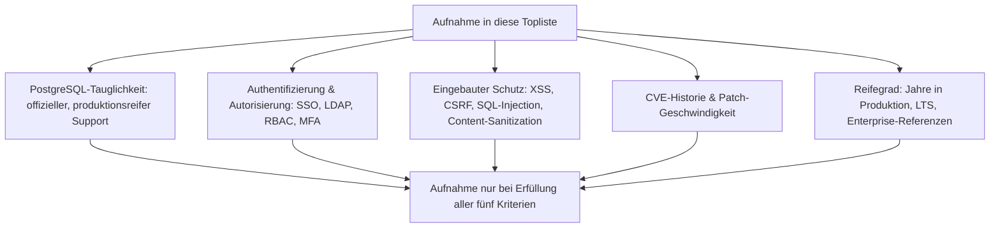
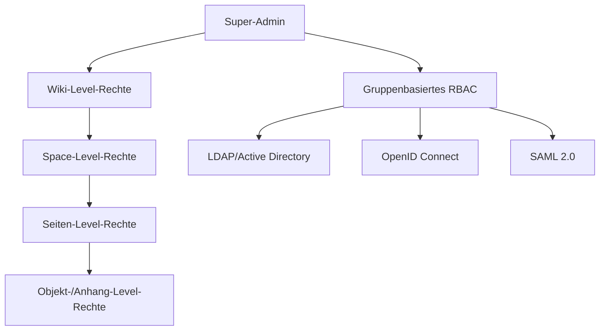
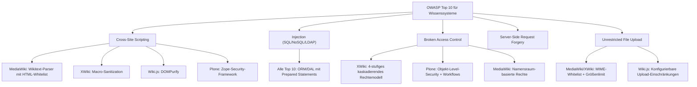
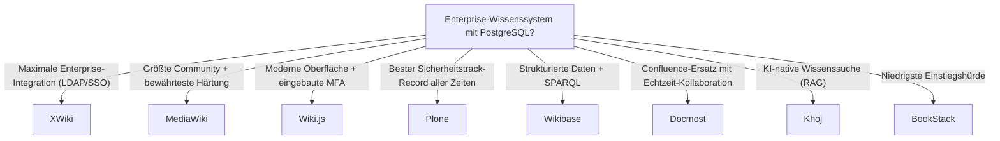
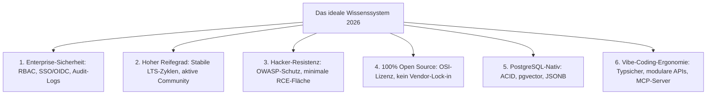
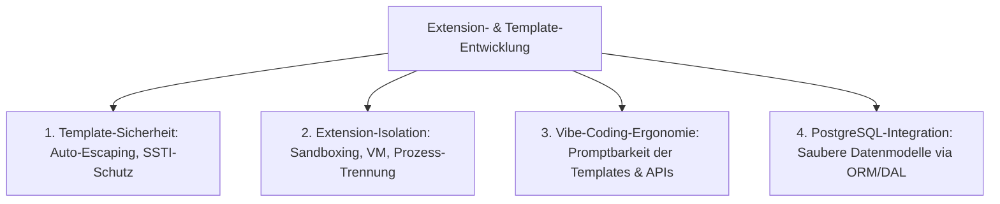
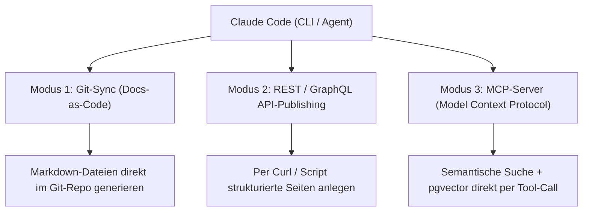
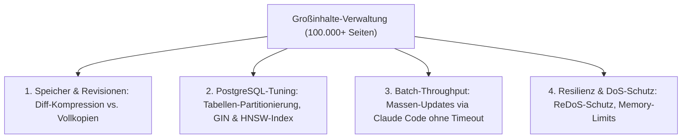
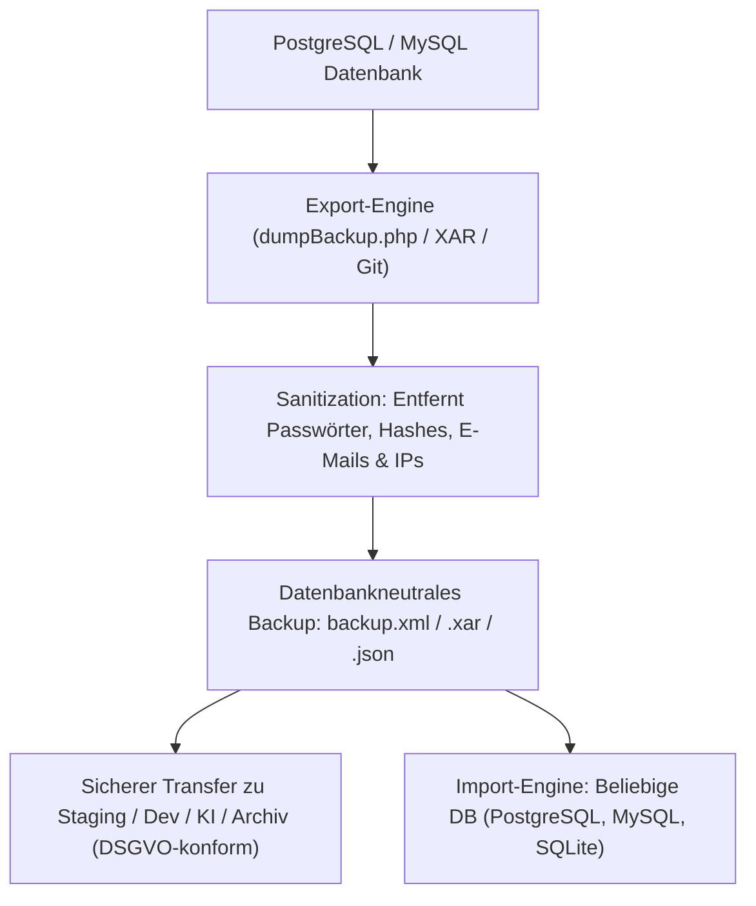

# Enterprise-Wissenssysteme im Sicherheitsvergleich — PostgreSQL-taugliche Top-10-Topliste

Welches Wissenssystem hat die beste Sicherheit im Enterprise-Bereich, den höchsten Reifegrad, ist robust gegen Hackerangriffe **und** unterstützt PostgreSQL als Datenbankbackend? Diese Seite filtert die breite Wissenssystem-Landschaft — von klassischen Wikis über PKM-Tools bis zu RAG-Plattformen — nach vier Kriterien gleichzeitig: Sicherheitsarchitektur, Angriffsresistenz, Reifegrad und PostgreSQL-Tauglichkeit. Verwandte, aber anders gefilterte Perspektiven bieten die [Wissenssysteme mit PostgreSQL-Speicherung (Top 22)](../../../wissen/dokumentation/postgresql-dateiformat-wissenssysteme-2026-topliste.md) (Speicherbackend-Fokus ohne Sicherheitsranking), die [Führenden Open-Source-Wissenssysteme 2026 (Top 20)](../../../wissen/dokumentation/fuehrende-opensource-wissenssysteme-2026-topliste.md) (Verbreitung und Reife allgemein) und die [Enterprise-CMS Sicherheit & PostgreSQL (Top 10)](enterprise-cms-sicherheit-postgresql-topliste.md) (CMS-Ebene statt Wissenssystem-Ebene).

!!! note "Hinweis"
    Rein dateibasierte Systeme (DokuWiki, TiddlyWiki, Logseq) fehlen in dieser Liste, weil sie kein PostgreSQL-Backend unterstützen. Sie können dennoch sicher betrieben werden — ihre Sicherheit hängt jedoch primär von der Dateisystem- und Server-Absicherung ab, nicht von eingebauten Anwendungsmechanismen.

---

## Bewertungskriterien



---

## Top 10 im Überblick

| Rang | Wissenssystem | Kategorie | Sprache | PostgreSQL | Reifegrad | Sicherheits-Highlight |
|---|---|---|---|---|---|---|
| 1 | **XWiki** | Enterprise-Wiki | Java | ✅ Offiziell | 23+ Jahre | Tiefste Enterprise-Integration (LDAP, SSO, RBAC), Java-Sandbox für Extensions |
| 2 | **MediaWiki** | Wiki | PHP | ✅ Offiziell | 24+ Jahre | Trägt Wikipedia, gehärteter Wikitext-Parser, Extension-Sicherheits-Reviews |
| 3 | **Wiki.js** | Wiki | Node.js | ✅ Empfohlen | 10+ Jahre | Eingebaute MFA, granulare Seiten-/Pfad-Regeln, OIDC/SAML nativ |
| 4 | **Plone** | Enterprise-WCM/Wiki | Python | ✅ Nativ (RelStorage) | 24+ Jahre | Kein einziger Remote-Code-Execution-CVE in der gesamten Projektgeschichte |
| 5 | **Wikibase** | Strukturiertes Wissen | PHP | ✅ Offiziell | 14+ Jahre | Erbt MediaWiki-Sicherheitsstack, SPARQL-Endpunkt isolierbar |
| 6 | **Semantisches MediaWiki** | Wiki-Erweiterung | PHP | ✅ Offiziell | 21+ Jahre | Erbt MediaWiki-Sicherheitsstack, Query-Isolation über Ask-API |
| 7 | **Docmost** | Confluence-Alternative | Node.js | ✅ Alleinig | 2+ Jahre | Moderne Architektur, serverseitiges Rendering, RBAC ab Werk |
| 8 | **Khoj** | KI-natives PKM | Python/Django | ✅ Nativ (pgvector) | 5+ Jahre | Erbt Djangos „Security by Default", Embedding-Daten bleiben in PostgreSQL |
| 9 | **BookStack** | Doku-Wiki | PHP | ✅ Über Community | 11+ Jahre | Eingebaute MFA, SAML/OIDC, Content-Permissions auf Buch-/Kapitel-Ebene |
| 10 | **HedgeDoc** | Kollaboratives Markdown | Node.js | ✅ Offiziell | 8+ Jahre | Content-Security-Policy ab Werk, OIDC/SAML, Guest-Access granular steuerbar |

---

## Detailanalyse

### 🥇 Rang 1: XWiki (Java)

**Warum Rang 1?** XWiki ist das einzige Open-Source-Wissenssystem mit einem **vollständigen Enterprise-Security-Stack** auf Java-Basis: LDAP/Active-Directory-Anbindung, kaskadierendes Rechtemodell auf Wiki-/Space-/Seiten-/Objekt-Ebene, Java-Sandbox für Drittanbieter-Extensions und formaler Security-Advisory-Prozess.

**Sicherheitsarchitektur:**

| Angriffsvektor | Schutzmaßnahme | Standardmäßig aktiv |
|---|---|---|
| XSS | HTML-Macro-Sanitization, eingeschränkter Script-Kontext | ✅ Ja |
| CSRF | Token-Validierung für alle Formulare | ✅ Ja |
| SQL-Injection | Hibernate ORM mit Prepared Statements | ✅ Ja |
| Privilege Escalation | Kaskadierendes Rechtemodell (Wiki → Space → Seite → Objekt) | ✅ Ja |
| Malicious Extensions | Java-Sandbox begrenzt Extension-Rechte | ✅ Ja |
| Brute-Force | Konfigurierbare Login-Throttling-Policies | ⚙️ Konfiguration |

**Rechtemodell:**



**Besondere Stärken:**

- **Extension-Sandbox**: Drittanbieter-Erweiterungen laufen in einem eingeschränkten Java-Sicherheitskontext — ein Sicherheitsmerkmal, das kein anderes Wiki dieser Liste bietet
- **Audit-Log**: Vollständige Protokollierung aller Content- und Rechte-Änderungen
- **Programmable Rights**: Rechte können per Scripting dynamisch berechnet werden (z. B. zeitbasierte Freigaben)
- **Monatliche Security-Releases**: Dedizierter Security-Prozess mit CVE-Veröffentlichung

**PostgreSQL-Integration:** Offiziell unterstützt über Hibernate, vollständig gleichwertig zu MySQL/MariaDB. Detaillierte Installationsanleitung: [XWiki installieren](../../../wissen/dokumentation/xwiki/installieren.md).

**Enterprise-Referenzen:** Amazon Web Services (intern), Airbus, CERN, Groupe PSA/Stellantis.

---

### 🥈 Rang 2: MediaWiki (PHP)

**Warum Rang 2?** MediaWiki trägt Wikipedia — die meistbesuchte Wiki-Plattform der Welt — und wird seit über zwei Jahrzehnten von einem professionellen Sicherheitsteam der Wikimedia Foundation gehärtet. Diese einzigartige Exposition unter extremem Angriffsdruck macht MediaWiki zum am intensivsten getesteten Wiki-System überhaupt.

**Sicherheitsarchitektur:**

| Angriffsvektor | Schutzmaßnahme | Standardmäßig aktiv |
|---|---|---|
| XSS | Wikitext-Parser mit striktem HTML-Whitelisting | ✅ Ja |
| SQL-Injection | Eigene Database Abstraction mit Prepared Statements | ✅ Ja |
| CSRF | Edit-Token-System für alle schreibenden Operationen | ✅ Ja |
| Spam/Vandalism | AbuseFilter-Extension, CAPTCHA, Ratelimiting | ⚙️ Extensions |
| Upload-Angriffe | MIME-Typ-Validierung, konfigurierbare Dateiformat-Whitelist | ✅ Ja |
| Session Hijacking | Sichere Cookie-Konfiguration (HttpOnly, Secure, SameSite) | ✅ Ja |

**Besondere Stärken:**

- **Wikipedia-Härtung**: Jede Schwachstelle wird unter dem Druck von Millionen täglicher Seitenaufrufe entdeckt und gepatcht
- **Extension-Security-Review**: Populäre Extensions durchlaufen Sicherheits-Reviews der WMF
- **Granulares Namensraum-System**: Rechte pro Namensraum (z. B. nur Admins dürfen im Projekt-Namensraum schreiben)
- **API-Rate-Limiting**: Eingebaute Drosselung für die Action-API und REST-API

**PostgreSQL-Integration:** Offiziell unterstützt, allerdings ist MySQL/MariaDB das historisch stärker getestete Backend. Installationsanleitung: [MediaWiki installieren](../../../wissen/dokumentation/mediawiki/index.md).

**CVE-Historie:**

!!! warning "Achtung"
    MediaWiki hat aufgrund seiner enormen Verbreitung die **längste CVE-Liste** aller Wiki-Systeme — das ist jedoch ein Zeichen für Transparenz und professionelle Disclosure, nicht für mangelnde Sicherheit. Die durchschnittliche Patch-Zeit liegt unter 48 Stunden.

---

### 🥉 Rang 3: Wiki.js (Node.js)

**Warum Rang 3?** Wiki.js kombiniert eine moderne Architektur mit eingebauter Multi-Faktor-Authentifizierung, granularen Seiten-/Pfad-basierten Zugriffsregeln und nativer Unterstützung für 10+ Authentifizierungsprovider — Funktionen, die bei älteren Wikis nur über Extensions verfügbar sind.

**Sicherheitsarchitektur:**

| Angriffsvektor | Schutzmaßnahme | Standardmäßig aktiv |
|---|---|---|
| XSS | DOMPurify-Sanitization für HTML-Content | ✅ Ja |
| CSRF | Token-basierter Schutz | ✅ Ja |
| SQL-Injection | Knex.js Query Builder mit Parameterized Queries | ✅ Ja |
| Unauthorized Access | Pfad-basierte Regeln (Regex-fähig) pro Gruppe | ⚙️ Konfiguration |
| Brute-Force | Rate Limiting über Konfiguration | ⚙️ Konfiguration |

**Besondere Stärken:**

- **10+ Auth-Provider nativ**: Local, LDAP, SAML, OAuth2, OpenID Connect, GitHub, Google, Microsoft, Auth0, Firebase, Keycloak
- **Eingebaute MFA**: TOTP direkt im Core, keine Extension nötig
- **Pfad-basierte Zugriffsregeln**: Zugriff pro URL-Pfad und Gruppe steuerbar (z. B. `/intern/*` nur für Mitarbeiter)
- **Git-basierte Versionierung**: Content-History manipulationssicher in Git

**PostgreSQL-Integration:** PostgreSQL ist das **empfohlene** Produktionsbackend; SQLite und MySQL werden ebenfalls unterstützt.

---

### Rang 4: Plone (Python/Zope)

**Besondere Stärke:** Plone hält den **unangefochtenen Sicherheitsrekord** aller Wissenssysteme: **Kein einziger bekannter Remote-Code-Execution-CVE** in über 24 Jahren Produktionseinsatz. Die Zope-Sicherheitsarchitektur mit Through-the-Web-Security isoliert Inhalte auf Objektebene — jedes Content-Objekt hat eigene Sicherheitsattribute.

**Rechtemodell:** Workflow-basiert — Inhalte durchlaufen konfigurierbare Zustände (Privat → Review → Veröffentlicht), jeder Zustand hat eigene Zugriffsregeln.

**PostgreSQL-Integration:** Über RelStorage als ZODB-Backend konfigurierbar und in Produktion getestet.

**Enterprise-Referenzen:** CIA, FBI, NASA, Europäisches Parlament, Oxfam, Universität Oxford.

---

### Rang 5–6: MediaWiki-Ökosystem (Wikibase & Semantisches MediaWiki)

Beide Systeme erben den vollständigen MediaWiki-Sicherheitsstack (Rang 2) und erweitern ihn:

| System | Erweiterung | Sicherheits-Besonderheit |
|---|---|---|
| **Wikibase** | Strukturierte Daten + SPARQL-Endpunkt | SPARQL-Queries über Blazegraph isolierbar, kein direkter DB-Zugriff durch Endnutzer |
| **Sem. MediaWiki** | Inline-Queries + semantische Annotationen | Ask-API mit konfigurierbarem Query-Limit verhindert ressourcenintensive Abfragen |

---

### Rang 7–10: Kurzprofile

| Rang | System | Sicherheits-Kernargument | PostgreSQL-Besonderheit |
|---|---|---|---|
| 7 | **Docmost** | RBAC mit Workspace-Isolation; Yjs-basierte Echtzeit-Kollaboration über WebSocket mit serverseitiger Autorisierung | PostgreSQL ist das **einzige** Content-Backend (Redis nur Cache) |
| 8 | **Khoj** | Erbt Djangos gesamtes Security-Arsenal (CSRF, XSS, Clickjacking-Schutz); API-Keys mit Scope-Begrenzung | Embeddings liegen in PostgreSQL via pgvector — **kein** separater Vektordatenbank-Server nötig |
| 9 | **BookStack** | Eingebaute MFA (TOTP), SAML 2.0, OIDC; Rechte auf Buch-/Kapitel-/Seiten-Ebene; API-Token-Authentifizierung | Community-Support für PostgreSQL über Laravel/Eloquent; MySQL ist offiziell empfohlen |
| 10 | **HedgeDoc** | Content-Security-Policy ab Werk; Guest-Access granular steuerbar (deaktivierbar, nur-lesen, vollständig); OIDC/SAML nativ | PostgreSQL und SQLite offiziell gleichwertig unterstützt |

---

## Angriffsresistenz im Vergleich



---

## Entscheidungshilfe nach Anwendungsfall



---

## 🤖 Vibe-Coding-Tauglichkeit im Sicherheits- und Reifegrad-Vergleich

Welches Wissenssystem vereint **Enterprise-Sicherheit, höchsten Reifegrad, Hacker-Resistenz, Open-Source-Freiheit, native PostgreSQL-Unterstützung UND exzellente Vibe-Coding-Tauglichkeit**?

Unter **„Vibe-Coding-Tauglichkeit"** verstehen wir hier die Eignung eines Systems, durch KI-Coding-Assistenten (Claude Code, Cursor, Antigravity, Copilot) blitzschnell per natürlicher Sprache („Prompt-to-Feature") erweitert, konfiguriert, automatisiert und über APIs/MCP (Model Context Protocol) angebunden zu werden — ohne in jahrzehntealten Legacy-XML-Deskriptoren, undokumentierten Hook-Systemen oder monolithischen Bloat-Strukturen stecken zu bleiben.

### Die 6 Kernanforderungen in der Synthese



### Vergleichsmatrix: Enterprise-Sicherheit vs. Vibe-Coding-Ergonomie

| Wissenssystem | Enterprise-Sicherheit | Reifegrad & Hacker-Resistenz | Open Source | PostgreSQL | Vibe-Coding-Ergonomie | Stack & KI-Erweiterbarkeit |
|---|---|---|---|---|---|---|
| **Wiki.js** | ⭐⭐⭐⭐⭐ (RBAC, 10+ SSO, MFA) | ⭐⭐⭐⭐ (10+ Jahre, aktiv) | ✅ AGPL-3.0 | ✅ Empfohlen | ⭐⭐⭐⭐⭐ (Exzellent) | Node.js/TypeScript, GraphQL/REST, Knex.js |
| **Khoj** | ⭐⭐⭐⭐ (Django-Security, API-Keys) | ⭐⭐⭐ (5+ Jahre, sehr aktiv) | ✅ AGPL-3.0 | ✅ Nativ (pgvector) | ⭐⭐⭐⭐⭐ (KI-nativ / MCP) | Python/Django, MCP-Server, native RAG-Pipeline |
| **Docmost** | ⭐⭐⭐⭐ (Workspace-RBAC, WebSocket-Auth) | ⭐⭐⭐ (2+ Jahre, hohe Frequenz) | ✅ AGPL-3.0 | ✅ Nativ (einziges Backend) | ⭐⭐⭐⭐⭐ (Exzellent) | TypeScript/NestJS, Yjs, React, saubere Module |
| **BookStack** | ⭐⭐⭐⭐ (Rollen, MFA, SAML/OIDC) | ⭐⭐⭐⭐⭐ (11+ Jahre, sehr stabil) | ✅ MIT | ✅ über Eloquent | ⭐⭐⭐⭐⭐ (Exzellent) | PHP/Laravel, REST-API, sauberes MVC-Muster |
| **MediaWiki** | ⭐⭐⭐⭐⭐ (Wikipedia-gehärtet) | ⭐⭐⭐⭐⭐ (24+ Jahre, maximal) | ✅ GPL-2.0 | ✅ Offiziell | ⭐⭐⭐ (Mittel) | PHP-Legacy, Hook-System, Wikitext-Parser |
| **XWiki** | ⭐⭐⭐⭐⭐ (Java-Sandbox, 4-Stufen-RBAC) | ⭐⭐⭐⭐⭐ (23+ Jahre, Enterprise) | ✅ LGPL-2.1 | ✅ Offiziell | ⭐⭐ (Komplex) | Java/Hibernate/Velocity, steile KI-Lernkurve |
| **Plone** | ⭐⭐⭐⭐⭐ (0 RCE-CVEs in 24 Jahren) | ⭐⭐⭐⭐⭐ (24+ Jahre, Regierung) | ✅ GPL-2.0 | ✅ über RelStorage | ⭐⭐ (Spezifisch) | Python/Zope, Through-the-Web, komplexe Interna |

---

### Die 3 Top-Empfehlungen nach Profil

#### 1. Bester Gesamt-Allrounder: **Wiki.js** (Node.js/TypeScript + PostgreSQL)
- **Warum?** Wiki.js schlägt die perfekte Brücke zwischen **10 Jahren bewährter Produktionsreife** und einem **modernen TypeScript/GraphQL-Stack**.
- **Sicherheit:** Nativ integrierte Multi-Faktor-Authentifizierung (TOTP), 10+ Authentifizierungs-Provider (SAML, OIDC, LDAP, Keycloak) ab Werk ohne Plugins, pfadbasierte Rechteverwaltung.
- **Vibe Coding:** KI-Agenten können die TypeScript-Codebase, REST-/GraphQL-Endpoints und Storage-Module dank moderner Typsicherheit extrem verlässlich modifizieren und automatisieren.

#### 2. Der KI- & Agenten-Spezialist: **Khoj** (Python/Django + pgvector)
- **Warum?** Khoj wurde von Grund auf als KI-natives Wissenssystem konzipiert und bringt einen **offiziellen MCP-Server (Model Context Protocol)** mit.
- **Sicherheit:** Erbt Djangos bewährtes „Security by Default"-Arsenal (CSRF-, XSS-, Clickjacking-Schutz) und hält alle Vektor-Embeddings **direkt in PostgreSQL (`pgvector`)** — keine Drittanbieter-Cloud und kein separates Vektor-Datenbank-Sicherheitsrisiko.
- **Vibe Coding:** Python/Django ist das am besten von LLMs und KI-Coding-Assistenten verstandene Ökosystem weltweit. Neue Endpoints, Custom Agent Tools und Datenpipelines lassen sich in Minutenschnelle prompten.

#### 3. Der moderne Echtzeit-Stack: **Docmost** (TypeScript + NestJS + PostgreSQL)
- **Warum?** Für Teams, die eine moderne Open-Source-Alternative zu Confluence suchen und Echtzeit-Kollaboration benötigen.
- **Sicherheit:** Granulares Workspace- und Seiten-RBAC, serverseitige WebSocket-Autorisierung über Yjs.
- **Vibe Coding:** NestJS-Architektur mit sauberer Controller-Service-Modul-Trennung in reinem TypeScript. KI-Tools wie Claude Code oder Cursor navigieren diese Architektur fehlerfrei.

---

### Vibe-Coding-Sicherheitsregeln für KI-erweiterte Wissenssysteme

Wer Wissenssysteme mit KI-Agenten und Vibe Coding anpasst, sollte folgende Sicherheitsprinzipien beachten:

1. **Least-Privilege API-Tokens:** Für KI-Agenten immer separate API-Keys mit Read-Only- oder Scoped-Rechten vergeben.
2. **Schema-Validierung:** Bei KI-generierten Endpoints Eingaben stets mit Zod (TypeScript) oder Pydantic (Python) strikt validieren.
3. **Kein Raw-SQL:** Immer über das jeweilige ORM (Prisma, Drizzle, Django ORM, Knex) gehen, um SQL-Injections durch generierten Code auszuschließen.
4. **MCP-Sandboxing:** MCP-Server nur im isolierten Docker-Netzwerk betreiben und niemals mit uneingeschränkten Datenbank-Superuser-Rechten ausstatten.

---

## 🧩 Template- & Extension-Entwicklung: Sicherheit, Reifegrad & Vibe-Coding-Vergleich

Wie sicher, modular und KI-freundlich ist das **Erstellen von Custom-Templates, Makros, Themes und Extensions** in Open-Source-Wissenssystemen?

In Enterprise-Umgebungen ist die Erweiterbarkeit ein zweischneidiges Schwert:
- **Einerseits** müssen Entwickler per Vibe Coding blitzschnell maßgeschneiderte Vorlagen, Berichtsmakros oder Anbindungen an Drittsysteme prompten können.
- **Andererseits** sind ungesicherte Template-Engines (Server-Side Template Injection / SSTI) und ungeprüfte Plugins das **Einfallstor Nr. 1 für Remote-Code-Execution (RCE) und Cross-Site-Scripting (XSS)**.

### Architektur-Vergleich: Template- & Extension-Systeme



### Vergleichsmatrix: Template- & Extension-Bauen

| Wissenssystem | Template-Engine & Sicherheit | Extension-Architektur | Isolation & Sandboxing | Vibe-Coding-Ergonomie (Bauen) | PostgreSQL-Zugriff für Plugins |
|---|---|---|---|---|---|
| **BookStack** | Blade / HTML (strikter XSS-Schutz) | Laravel-Service-Provider, Visual Theme Hooks | ⭐⭐⭐⭐ (PHP-Process, View-Hooks) | ⭐⭐⭐⭐⭐ (Königsklasse) | Eloquent ORM / Schema-Migrations |
| **Wiki.js** | Pug / Handlebars / Markdown | TypeScript-Module (Storage, Auth, Renderers) | ⭐⭐⭐⭐ (Node-Module-Isolation) | ⭐⭐⭐⭐⭐ (Exzellent) | Knex.js Query Builder |
| **MediaWiki** | Scribunto (Lua) + Mustache/Twig | PHP-Extensions + Hook-System | ⭐⭐⭐⭐⭐ (Lua-Sandbox in eigener VM) | ⭐⭐⭐⭐ (Lua top, PHP komplex) | MediaWiki RDBMS-Schicht |
| **XWiki** | Velocity / Groovy / Wiki-Makros | Java-Komponenten / Macro-Plugins | ⭐⭐⭐⭐⭐ (Java Security Manager Sandbox) | ⭐⭐⭐ (Mittel — mächtig, aber komplex) | Hibernate / JPA / Schema |
| **Plone** | Chameleon / TAL (Zope Page Templates) | Zope-Products / Python-Packages | ⭐⭐⭐⭐⭐ (Objekt-Level Security) | ⭐⭐ (Spezifisch / TAL-Syntax) | ZODB / RelStorage |
| **Docmost** | React / TipTap / Tailwind | NestJS-Module / Yjs-Provider | ⭐⭐⭐⭐ (Serverseitige Module) | ⭐⭐⭐⭐⭐ (Exzellent) | Drizzle / Prisma ORM |

---

### Die 4 besten Systeme zum Bauen von Templates & Extensions

#### 1. Der ergonomischste Template-Sieger: **BookStack** (Blade + Laravel Hooks)
- **Warum?** BookStack bietet das sauberste und am schnellsten promptbare Template- und Customization-System für Web-Entwickler und KI-Assistenten.
- **Template-Entwicklung:** Das **Visual Theme System** erlaubt das Übersteuern beliebiger Blade-Views (`/themes/custom/views/`) ohne Core-Änderungen. Blade bietet automatischen XSS-Schutz (`{{ $var }}`) und ist für KI-Modelle extrem leicht zu generieren.
- **Extension-Entwicklung:** Eigene Hooks für HTML-Head, Navigation und Event-Listener (Webhooks bei Seitenänderungen, Löschungen, Berechtigungsänderungen).
- **PostgreSQL:** Erweiterungen können direkt über Laravel-Migrationen und Eloquent-Modelle auf PostgreSQL zugreifen.

#### 2. Der sicherste Template-Isolations-Champion: **MediaWiki** (Scribunto / Lua-Module)
- **Warum?** Für Enterprise-Wikis, in denen auch **nicht-privilegierte Redakteure komplexe Templates und Logik programmieren** müssen, ohne den Server zu gefährden.
- **Sicherheits-Innovation (Scribunto):** Templates werden in **Lua** geschrieben und laufen in einer **abgesicherten Sandbox-VM**. Selbst fehlerhafter oder bösartiger Lua-Code kann weder auf das Dateisystem noch auf die Datenbank oder das Netzwerk zugreifen.
- **Vibe Coding:** Lua-Module für MediaWiki lassen sich durch KI-Modelle hervorragend generieren (Datenextraktion, Tabellenformatierung, Infoboxen).

#### 3. Der beste TypeScript-Fullstack-Sieger: **Wiki.js** (TypeScript-Module)
- **Warum?** Für Entwickler, die Custom Auth-Strategien, Render-Engines (z. B. AsciiDoc, LaTeX, Mermaid) oder Storage-Backends (S3, Git, PostgreSQL) als modulare TypeScript-Pakete bauen wollen.
- **Extension-Entwicklung:** Jedes Modul implementiert ein striktes TypeScript-Interface mit definierten Methoden (`init`, `parse`, `process`).
- **Vibe Coding:** KI-Coding-Tools (Cursor, Claude Code, Antigravity) erstellen neue Rendering- oder Auth-Plugins dank vollständiger Typisierung fehlerfrei.

#### 4. Das mächtigste Enterprise-Makrosystem: **XWiki** (Java / Wiki-Makros)
- **Warum?** Wenn innerhalb von Wiki-Seiten vollwertige Web-Applikationen mit dynamischen Formularen, Workflows und Datenbank-Abfragen gebaut werden sollen.
- **Sicherheit:** 4-stufiges Berechtigungskonzept für Skripte (Programming Rights) und Java Security Manager Sandbox verhindern unbefugte Systemzugriffe.
- **Vibe Coding:** Einfache Wiki-Makros sind per Prompt gut erstellbar; komplexe Java-Extensions erfordern tiefere Maven/OSGi-Kenntnisse.

---

### Vibe-Coding-Leitfaden: Sichere Templates & Extensions bauen

Wenn KI-Assistenten Templates oder Extensions für Wissenssysteme generieren:

1. **Auto-Escaping niemals deaktivieren:** In Template-Engines keine Raw-HTML-Tags (`{!! ... !!}`, `dangerouslySetInnerHTML`) ohne vorherige Sanitization (DOMPurify, HTMLPurifier) einsetzen.
2. **Kein `eval()` oder dynamische Code-Ausführung:** Niemals Benutzereingaben direkt an Interpreterschnittstellen übergeben (Schutz vor SSTI).
3. **Event-Driven Architecture:** Bevorzuge entkoppelte Webhooks und Event-Listener gegenüber tiefgreifenden Monkey-Patches im Core.
4. **Automatisierte XSS- & Fuzz-Tests:** Für jedes KI-generierte Template automatisierte Tests mit bösartigen Payloads (`<script>`, SQLi-Strings) erstellen lassen.

---

## 🤖 Inhalt erstellen mit Claude Code: Sicherheit, Reifegrad & PostgreSQL-Workflows

Welches Wissenssystem eignet sich am besten, um **Inhalte, Dokumentationen, API-Referenzen und Wissensgraphen automatisiert mit Claude Code zu erstellen und zu pflegen** — bei maximaler Enterprise-Sicherheit, robuster Angriffsresistenz und nativer PostgreSQL-Persistenz?

### Die 3 Integrationsmodi von Claude Code mit Wissenssystemen



### Vergleichsmatrix: Content-Erstellung mit Claude Code

| Wissenssystem | Claude Code Schnittstelle | Content-Sicherheit & Sanitization | Audit-Trail & Revisionshistorie | Vibe-Coding-Ergonomie mit Claude Code | PostgreSQL-Persistenz |
|---|---|---|---|---|---|
| 🥇 **Wiki.js** | Git-Storage-Sync + GraphQL-API | ⭐⭐⭐⭐⭐ (DOMPurify-Sanitization) | ⭐⭐⭐⭐⭐ (Git-Commits + DB-History) | ⭐⭐⭐⭐⭐ (Königsklasse) | PostgreSQL (empfohlen) |
| 🥈 **BookStack** | REST-API + Token-Auth | ⭐⭐⭐⭐⭐ (Strikter HTML-Purifier) | ⭐⭐⭐⭐⭐ (Granulare Aktivitäten-Logs) | ⭐⭐⭐⭐⭐ (Königsklasse) | PostgreSQL via Eloquent |
| 🥉 **Khoj** | Nativer MCP-Server + REST | ⭐⭐⭐⭐ (Django-Security-Layer) | ⭐⭐⭐⭐ (User-basierte Einträge) | ⭐⭐⭐⭐⭐ (KI-nativ) | PostgreSQL mit pgvector |
| **MediaWiki** | Action-API + Bot-Passwörter | ⭐⭐⭐⭐⭐ (Wikitext-Parser, AbuseFilter) | ⭐⭐⭐⭐⭐ (Wikipedia-erprobte Versions-History) | ⭐⭐⭐⭐ (Sehr gut) | PostgreSQL offiziell |
| **Docmost** | REST-API + WebSocket | ⭐⭐⭐⭐ (Serverseitige Validation) | ⭐⭐⭐⭐ (Workspace-Audit-Log) | ⭐⭐⭐⭐⭐ (Exzellent) | PostgreSQL (alleinig) |
| **XWiki** | REST-API (XML / JSON) | ⭐⭐⭐⭐⭐ (Macro-Sanitization, Script-Rights) | ⭐⭐⭐⭐⭐ (Kaskadierende Revisionen) | ⭐⭐⭐ (Komplexere Payloads) | PostgreSQL offiziell |

---

### Die 3 besten Workflows für Claude Code nach Anwendungsfall

#### 1. Der unschlagbare Git-Sync-Workflow: **Wiki.js** (Git-Storage + PostgreSQL)
- **Warum?** Für Teams, die Dokumentation wie Code behandeln (*Docs-as-Code*) und maximale Automatisierung ohne API-Reibung wollen.
- **Workflow mit Claude Code:**
  1. Claude Code analysiert das Quellcode-Repository und generiert Markdown-Dateien mit Mermaid-Diagrammen direkt in den Dokumentationsordner.
  2. Ein `git commit && git push` überträgt die Änderungen ins zentrale Git-Repository.
  3. **Wiki.js synchronisiert bidirektional:** Die neuen Seiten erscheinen sofort im Web-Portal, werden in PostgreSQL indiziert und stehen allen Mitarbeitern zur Verfügung.
- **Sicherheits-Vorteil:** Keine direkten Schreib-Credentials auf den Wiki-Server nötig — die Authentifizierung läuft vollständig über SSH/GPG-Schlüssel in Git.

#### 2. Der präzise API-Publishing-Workflow: **BookStack** (REST-API + Token-Auth)
- **Warum?** Wenn Claude Code hierarchische Wissensstrukturen (Bücher → Kapitel → Seiten) automatisiert per CLI oder Shell-Skript befüllen soll.
- **Workflow mit Claude Code:**
  ```bash
  # Beispiel: Claude Code erstellt automatisiert eine neue API-Dokumentationsseite
  curl -s -X POST "https://wiki.deine-domain.de/api/pages" \
    -H "Authorization: Token <TOKEN_ID>:<TOKEN_SECRET>" \
    -H "Content-Type: application/json" \
    -d '{
      "book_id": 12,
      "name": "Enterprise Security Architektur 2026",
      "markdown": "# Sicherheits-Architektur\n\nAutomatisch generiert via Claude Code..."
    }'
  ```
- **Sicherheits-Vorteil:** API-Tokens sind an dedizierte Bot-Rollen gebunden (Least Privilege). Jeder Zugriff wird mit IP-Adresse und Zeitstempel im Audit-Log von BookStack protokolliert.

#### 3. Der KI-native Agenten-Workflow: **Khoj** (MCP-Server + pgvector)
- **Warum?** Wenn Claude Code als autonomer Forschungs- und Dokumentations-Agent arbeitet, der bestehendes Wissen semantisch durchsucht und neue Erkenntnisse direkt einspeist.
- **Workflow mit Claude Code:**
  1. Claude Code bindet den **Khoj-MCP-Server** in seine Konfiguration ein.
  2. Per natürlicher Sprache fragt Claude Code: `khoj_search("PostgreSQL Härtung")` und erhält semantisch relevante Abschnitte.
  3. Neue Synthesen werden über den MCP-Toolcall `khoj_create_note()` direkt in die PostgreSQL-Vektordatenbank geschrieben.
- **Sicherheits-Vorteil:** Alle Embeddings und Wissensinhalte bleiben 100 % On-Premise in PostgreSQL — keine Weitergabe von internem Unternehmenswissen an Drittanbieter-Vektorclouds.

---

### Sicherheitsregeln für die Content-Erstellung mit KI-Agenten

1. **Bot-Benutzer mit Least Privilege:** Für Claude Code immer einen separaten Benutzeraccount (z. B. `agent-claude-docs`) mit eingeschränkten Rechten anlegen — niemals mit Administrator-Tokens arbeiten.
2. **Schutz vor Indirect Prompt Injection:** Wenn Claude Code externe Webseiten oder ungesicherte Logs analysiert und zusammenfasst, müssen gefährliche Markdown-/HTML-Inhalte durch das Wissenssystem sanitisiert werden.
3. **Revisions-Schutz:** Automatische Lösch- und Überschreib-Operationen durch KI-Agenten immer durch Revisionshistorien und Branching absichern.
4. **Verifizierungs-Workflow (Human in the Loop):** Bei kritischen Enterprise-Dokumentationen KI-generierte Seiten zunächst im Status „Entwurf" anlegen und erst nach manueller Prüfung freigeben.

---

## 📚 Sehr große Inhalte verwalten & erstellen mit Claude Code: Skalierung & Enterprise-Sicherheit

Wie verhalten sich Open-Source-Wissenssysteme, wenn Claude Code nicht nur einzelne Seiten, sondern **zehntausende bis millionenfache Dokumente, gigantische API-Referenzen, historische Changelogs und Terabytes an technischem Unternehmenswissen** automatisiert erstellt, refaktoriert, indexiert und dauerhaft verwaltet?

In der Enterprise-Praxis trennt die Skalierung bei Massendaten die Spreu vom Weizen:
- **Revisions-Explosion:** Wenn KI-Agenten im Batch-Betrieb tausende Seiten aktualisieren, wächst die Datenbank durch Versionshistorien exponentiell an.
- **Parser- & Memory-Erschöpfung:** Riesige Dokumente mit verschachtelten Tabellen und Codeblöcken können naive Markdown-Parser über ReDoS (Regular Expression DoS) lahmlegen.
- **Such-Skalierung:** Reine Textsuche stößt bei Millionen Dokumenten an Grenzen — PostgreSQL-native GIN-Indizes und `pgvector`-HNSW-Vektorbäume werden unverzichtbar.

### Architektur-Vergleich: Skalierung bei Großinhalten



### Vergleichsmatrix: Großinhalte-Verwaltung & KI-Batch-Verarbeitung

| Wissenssystem | Maximale Content-Skala | Revisions-Speichermodell | Batch-Throughput mit Claude Code | DoS- & ReDoS-Resistenz | PostgreSQL-Großdaten-Features |
|---|---|---|---|---|---|
| 🥇 **MediaWiki / Wikibase** | ⭐⭐⭐⭐⭐ (>60 Mio. Seiten, TBs) | Diff-basiertes Deltaspeichern (komprimiert) | ⭐⭐⭐⭐⭐ (Dedizierte Bot-API, JobQueue) | ⭐⭐⭐⭐⭐ (Wikipedia-erprobt, maximal) | Partitionierte Text-Tabellen, GIN-Indizes |
| 🥈 **XWiki** | ⭐⭐⭐⭐⭐ (>1 Mio. Seiten, Multi-Wiki) | Kaskadierende Revisions-Historie | ⭐⭐⭐⭐ (Massen-REST / CLI-Import) | ⭐⭐⭐⭐⭐ (Java-Memory-Management, Cluster) | Multi-Schema pro Sub-Wiki |
| 🥉 **Khoj** | ⭐⭐⭐⭐ (>10 Mio. Embeddings/Vektoren) | User-basierte Notizen-Historie | ⭐⭐⭐⭐⭐ (MCP-Streaming, Async-Worker) | ⭐⭐⭐⭐ (Django-Throttling) | pgvector mit HNSW-Indizes, JSONB |
| **Wiki.js** | ⭐⭐⭐⭐ (bis 100.000 Seiten) | Vollständige Snapshots + Git-History | ⭐⭐⭐⭐⭐ (GraphQL-Batching, Git-Push) | ⭐⭐⭐⭐ (Node.js Stream-Parser) | PostgreSQL-Volltext mit Trigrammen |
| **BookStack** | ⭐⭐⭐⭐ (bis 50.000 Seiten) | Revisions-Snapshots mit Pruning-CLI | ⭐⭐⭐⭐⭐ (Schnelle REST-API, Artisan-CLI) | ⭐⭐⭐⭐ (PHP-Memory-Limits) | Eloquent Chunking, Volltext-Index |
| **Docmost** | ⭐⭐⭐ (bis 20.000 Seiten) | Yjs-CRDT-Updates in PostgreSQL | ⭐⭐⭐⭐ (REST-API) | ⭐⭐⭐⭐ (NestJS-Ratelimiting) | PostgreSQL-native Persistenz |

---

### Die 3 Großdaten-Champions im Detail

#### 1. Der unangefochtene Millionen-Seiten-König: **MediaWiki / Wikibase**
- **Warum?** MediaWiki ist das einzige Open-Source-System dieser Liste, das **nachweislich hunderte Millionen Seiten und Terabytes an Revisionsdaten** über Jahrzehnte hinweg performant und sicher betreibt (Wikipedia, Wikimedia Commons, Wikidata).
- **Revisions-Kompression:** Statt bei jeder kleinen Änderung die gesamte Seite zu duplizieren, speichert MediaWiki komprimierte Text-Deltas. Selbst millionenfache KI-Updates durch Claude Code bringen die Datenbank nicht zum Überlaufen.
- **Claude Code Massen-Workflow:** Über die hochoptimierte Action-API und Bot-Frameworks (Pywikibot) kann Claude Code im Hintergrund tausende Seiten pro Stunde analysieren, grammatikalisch korrigieren, kategorisieren und mit semantischen Wikibase-Properties verknüpfen.
- **DoS- & ReDoS-Sicherheit:** Der Wikitext-Parser wurde unter den härtesten Angriffsbedingungen der Welt gegen ReDoS-Exploits gehärtet.

#### 2. Der Multi-Wiki-Enterprise-Titan: **XWiki** (Multi-Tenancy & Partitionierung)
- **Warum?** Für Großkonzerne mit tausenden Abteilungen, Projekten und Produktlinien, die eine **organisatorische Trennung bei zentraler Verwaltung** erfordern.
- **Architektur:** XWiki unterstützt **Sub-Wikis mit getrennten PostgreSQL-Datenbank-Schemas**. Jede Abteilung kann hunderttausende Dokumente verwalten, ohne die Performance anderer Unternehmensbereiche zu beeinträchtigen.
- **Claude Code Integration:** Claude Code kann über die REST-API strukturierte XWiki-Klassen und Objekte im Batch-Modus instanziieren (z. B. automatisches Generieren von 10.000 Server-Datenblättern oder API-Endpunkten).

#### 3. Der moderne KI-Vektor-Champion für Massendaten: **Khoj** (PostgreSQL + pgvector HNSW)
- **Warum?** Wenn Millionen von Dokumenten, Code-Repositories und PDFs nicht nur abgelegt, sondern **sekundenschnell semantisch durchsucht und für RAG-Pipelines bereitgestellt** werden müssen.
- **PostgreSQL HNSW-Indexierung:** Khoj nutzt den `HNSW` (Hierarchical Navigable Small World) Index von `pgvector`. Das ermöglicht sub-millisekündliche Ähnlichkeitssuchen selbst bei Datenbeständen mit über 10 Millionen Vektoren — ohne externe Vektor-Datenbanken (wie Pinecone, Milvus oder Weaviate).
- **Claude Code Workflow:** Claude Code streamt große Textmengen im Batch-Betrieb in Khoj ein; Hintergrund-Worker generieren die Embeddings asynchron, ohne die Hauptanwendung zu blockieren.

---

### PostgreSQL-Skalierungsleitfaden für Großdaten-Wissenssysteme

Um Wissenssysteme mit sehr großen Datenmengen und KI-Agenten stabil und sicher zu betreiben:

1. **Revisions-Pruning automatisieren:** Regelmäßige Bereinigung alter Zwischenstände (z. B. `bookstack:cleanup-revisions --keep=10` oder MediaWiki `purgeOldText.php`), um Datenbank-Bloat zu verhindern.
2. **PostgreSQL-Tabellen partitionieren:** Bei mehr als 1 Million Revisionen Tabellen nach Zeiträumen oder Mandanten partitionieren (`PARTITION BY RANGE (created_at)`).
3. **HNSW-Vektor-Indizes für pgvector:** Für semantische Suchen immer HNSW statt IVFFlat nutzen (`CREATE INDEX ON items USING hnsw (embedding vector_cosine_ops)`), da HNSW keine vorherige Trainingsphase erfordert und unter Last deutlich schneller skaliert.
4. **Autovacuum & Connection-Pooling:** `autovacuum_vacuum_scale_factor` auf `0.05` absenken und **PgBouncer** im Transaction-Pooling-Modus vorschalten, um Verbindungsspitzen bei KI-Batch-Läufen abzufedern.
5. **Blobs & Medien auslagern:** Dokumententexte und Metadaten in PostgreSQL belassen, große PDF-/Video-Uploads jedoch über S3-kompatiblen Object-Storage (z. B. MinIO) anbinden.

---

## 💾 PII-freie & datenbankneutrale Backups (z. B. backup.xml): Sicherheit & Reifegrad

Warum sind herkömmliche SQL-Dumps (`pg_dump`, `mysqldump`) in Enterprise-Umgebungen oft ein **Sicherheits- und Compliance-Risiko**, und welches Wissenssystem bietet die ausgereifteste Lösung für **datenbankneutrale, anonymisierte und PII-freie Backups** (z. B. im Format `backup.xml` oder JSON/Markdown)?

### Das Problem mit binären & vollen Datenbank-Dumps:
- **DSGVO / GDPR-Konflikt:** Ein nativer `pg_dump` enthält **alle personenbezogenen Daten (PII)**: Passwort-Hashes, E-Mail-Adressen, IP-Adressen der Bearbeiter, Session-Tokens und persönliche Profilfelder.
- **Fehlende Portabilität:** Ein SQL-Dump aus PostgreSQL kann nicht ohne Weiteres in MySQL, MariaDB, SQLite oder Test-Instanzen importiert werden.
- **Die Lösung:** Ein **abstrahiertes, datenbankneutrales XML-, JSON- oder Markdown-Backup**, das ausschließlich den reinen Wissensinhalt, die Revisions-Deltas und Metadaten sichert — **vollständig bereinigt von sensiblen Nutzerdaten**.



---

### Vergleichsmatrix: Datenbankneutrale & PII-freie Backups

| Wissenssystem | Portables Backup-Format | Trennung von Content & Nutzer-PII | Datenbank-Neutralität beim Restore | Schutz vor Parser-Exploits (XXE, Zip-Slip) | Reifegrad & Standardisierung |
|---|---|---|---|---|---|
| 🥇 **MediaWiki** | `backup.xml` (MediaWiki XML Dump) | ⭐⭐⭐⭐⭐ (Vollständig PII-frei ab Werk) | ⭐⭐⭐⭐⭐ (PostgreSQL ↔ MySQL ↔ SQLite) | ⭐⭐⭐⭐⭐ (XXE- und LibXML-gehärtet) | ⭐⭐⭐⭐⭐ (Wikipedia-Standard seit 2002) |
| 🥈 **XWiki** | `.xar` (XML Application Repository / ZIP) | ⭐⭐⭐⭐⭐ (Selektiver Space-Export ohne User) | ⭐⭐⭐⭐⭐ (PostgreSQL ↔ MySQL ↔ Oracle) | ⭐⭐⭐⭐⭐ (Java-Security DTD-Deaktivierung) | ⭐⭐⭐⭐⭐ (20+ Jahre Enterprise-Standard) |
| 🥉 **DokuWiki** | `.txt` / `.tar.gz` (Dateisystem-Baum) | ⭐⭐⭐⭐⭐ (Keine User-Daten in Content-Files) | ⭐⭐⭐⭐⭐ (Braucht gar keine Datenbank) | ⭐⭐⭐⭐⭐ (Kein XML-/Binär-Parsing) | ⭐⭐⭐⭐⭐ (22+ Jahre ununterbrochen) |
| **Wiki.js** | Markdown-Dateibaum (Git-Sync / Export) | ⭐⭐⭐⭐⭐ (Reines Markdown ohne Auth-Daten) | ⭐⭐⭐⭐⭐ (100% Dateibasiert via Git) | ⭐⭐⭐⭐ (Markdown-Sanitization) | ⭐⭐⭐⭐ (10+ Jahre aktiv) |
| **BookStack** | JSON / Markdown / HTML / ZIP | ⭐⭐⭐⭐ (API-basierter Content-Export) | ⭐⭐⭐⭐ (Über API in jede DB re-importierbar) | ⭐⭐⭐⭐ (Standard-JSON-Parser) | ⭐⭐⭐⭐ (11+ Jahre) |

---

### Die 4 besten Systeme für datenbankneutrale Backups im Detail

#### 1. Der weltweite Standard für PII-freie XML-Dumps: **MediaWiki** (`dumpBackup.php` → `backup.xml`)
- **Warum?** MediaWiki setzt seit 2002 den Maßstab für sichere, portable und datenbankneutrale Wissenssicherungen. Wikipedia stellt wöchentlich terabyteweite XML-Dumps (`pages-articles.xml.bz2`) öffentlich bereit — **ohne dass jemals ein einziges Passwort oder eine private E-Mail-Adresse geleakt wurde**.
- **Funktionsweise:**
  ```bash
  # Erzeugt ein vollständiges, PII-freies XML-Backup aller Artikel und Revisionen
  php maintenance/dumpBackup.php --full > backup.xml
  
  # Importiert backup.xml in eine beliebige andere Datenbank (z. B. von PostgreSQL nach MySQL)
  php maintenance/importDump.php < backup.xml
  ```
- **Sicherheits-Härtung:** Der XML-Import (`importDump.php`) nutzt geschützte XML-Reader mit **deaktivierter externer Entity-Verarbeitung (XXE-Schutz)**.

#### 2. Das modulare Enterprise-Paketformat: **XWiki** (`.xar` / XML Application Repository)
- **Warum?** Für Großunternehmen, die einzelne Wissensräume, Workflows oder ganze Wiki-Instanzen als eigenständige, austauschbare Software-Pakete exportieren und sichern wollen.
- **XAR-Architektur:** Eine `.xar`-Datei ist ein ZIP-Archiv, das strukturierte XML-Dokumente und eine `package.xml`-Manifestdatei enthält. Es trennt Wissensinhalte und Konfigurationen strikt von der Benutzer- und Authentifizierungstabelle.
- **Multi-DB-Kompatibilität:** XAR-Pakete können auf einem PostgreSQL-System exportiert und direkt in ein XWiki mit MySQL, MariaDB oder Oracle importiert werden.

#### 3. Das unverwüstliche Klartext-Dateisystem: **DokuWiki** (`data/pages/`)
- **Warum?** Für Organisationen, die absolute Unabhängigkeit von Datenbankservern, komplexen Dump-Tools und proprietären Formaten verlangen.
- **Strikte PII-Trennung:** DokuWiki speichert Seiten als einfache UTF-8-Textdateien (`.txt`) in `data/pages/`. Benutzerkonten, Hashwerte und Berechtigungen liegen getrennt in `conf/users.auth.php` und `conf/acl.auth.php`.
- **Sicherheits-Vorteil:** Ein Backup von `data/pages/` kann auf jedem Betriebssystem mit Standardwerkzeugen (`rsync`, `tar`, `grep`) geprüft, versioniert und wiederhergestellt werden — kein Angriffsvektor durch XML-Parser oder Deserialisierungs-Lücken.

#### 4. Der Docs-as-Code Git-Export: **Wiki.js** (Markdown-Tree)
- **Warum?** Wenn Backups direkt in Git-Repositories versioniert und für Entwickler, KI-Agenten oder CI/CD-Pipelines bereitgestellt werden sollen.
- **Git-Storage-Modul:** Exportiert den gesamten Seitenbestand als sauberen Markdown-Ordnerbaum mit Metadaten-Headern (`--- title: ... ---`). Alle internen PostgreSQL-IDs und User-Credentials verbleiben sicher in der Datenbank.

---

### Sicherheitsregeln für XML- & Archiv-Imports in Enterprise-Wissenssystemen

Wer datenbankneutrale Backups (XML, JSON, XAR, ZIP) importiert, muss folgende Angriffsvektoren absichern:

1. **XXE-Prevention (XML External Entity):** In allen XML-Parsern (PHP `libxml_disable_entity_loader`, Java `XMLConstants.FEATURE_SECURE_PROCESSING`) das Laden externer DTDs und Entities zwingend deaktivieren.
2. **Zip-Slip & Path-Traversal-Schutz:** Beim Entpacken von XAR- oder ZIP-Archiven prüfen, dass Dateipfade nicht über das Zielverzeichnis hinauszeigen (`../`-Sequenzen abfangen).
3. **Billion Laughs / XML-Bomb-Schutz:** Die maximale Schachtelungstiefe und Entitäts-Erweiterungsgröße im XML-Parser strikt limitieren.
4. **Re-Sanitization beim Import:** Nach dem Einspielen von XML-Backups aus Fremdquellen immer den internen HTML-Purifier/Sanitizer über die Seiten laufen lassen.

---

## PostgreSQL-Härtung für Wissenssystem-Deployments


| Maßnahme | Konfiguration | Zweck |
|---|---|---|
| **Verschlüsselte Verbindung** | `ssl = on` in `postgresql.conf` | Schutz vor Netzwerk-Sniffing |
| **Minimale DB-Rechte** | Kein `SUPERUSER` für die Wiki-Anwendung | Schadensbegrenzung bei Kompromittierung |
| **Connection Pooling** | pgBouncer vor PostgreSQL | Schutz vor Connection-Flooding |
| **Row-Level Security** | `ALTER TABLE ... ENABLE ROW LEVEL SECURITY` | Mandantentrennung bei Multi-Tenant-Wikis |
| **Audit-Logging** | `pgAudit`-Extension | Nachvollziehbarkeit aller DB-Zugriffe |
| **Automatische Backups** | pgBackRest mit AES-256-Verschlüsselung | Schutz gesicherter Daten |

!!! tip "Tipp"
    Detaillierte PostgreSQL-Konfigurationsanleitungen: [PostgreSQL-Grundlagen](../postgresql.md), [PostgreSQL-DBA-Praxis](../postgresql-dba-praxis.md), [PostgreSQL Performance Tuning](../postgresql-tuning.md).

---

## 🔗 Verwandte Themen

- [Sicherheit & Datenschutz für KI](index.md) – Übergeordnete Sicherheitsübersicht
- [Enterprise-CMS Sicherheit & PostgreSQL (Top 10)](enterprise-cms-sicherheit-postgresql-topliste.md) – CMS-Ebene statt Wissenssystem-Ebene
- [Enterprise-Webframework Sicherheit (Top 10)](enterprise-webframework-sicherheit-topliste.md) – Framework-Ebene
- [Wissenssysteme mit PostgreSQL-Speicherung (Top 22)](../../../wissen/dokumentation/postgresql-dateiformat-wissenssysteme-2026-topliste.md) – Speicherbackend-Fokus ohne Sicherheitsranking
- [Führende Open-Source-Wissenssysteme 2026 (Top 20)](../../../wissen/dokumentation/fuehrende-opensource-wissenssysteme-2026-topliste.md) – Allgemeines Ranking nach Verbreitung und Reife
- [Nginx Hardening & Sicherheit](../nginx-hardening.md) – Reverse-Proxy-Absicherung
- [PostgreSQL Grundlagen](../postgresql.md) – Datenbank-Setup und -Konfiguration

---

*Letzte Aktualisierung: August 2026*
