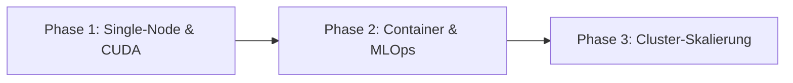

# Server & Software: Übersicht

Eine zentralisierte Übersicht über Serverkonfigurationen, Softwarekomponenten und Infrastruktur-Tools für den Produktionsserver (Ubuntu 24.04 LTS) und lokale Entwicklungsumgebungen.

---

## Serverlandschaft: Technologieübersicht

### Produktionsserver (Ubuntu 24.04 LTS)

Der Produktionsserver ist darauf ausgelegt, maximale Datenkontrolle und Datenschutz zu gewährleisten. Durch die lokale Datenverarbeitung sind keine Cookie-Banner erforderlich.

**Kernkomponenten:**
- **Web- & Application-Server**: Nginx (Webserver/Reverse Proxy), Tomcat 10 (Java Servlet Container)
- **Datenbank**: PostgreSQL mit PostGIS-Erweiterung
- **Kachelserver**: Switch2OSM Tileserver für OpenStreetMap-Daten
- **Laufzeiten & Tools**: ASP.NET Core 10, Java, Python, Git & GitHub CLI

### Entwicklungsrechner (Ubuntu 25.10)

Umfassend ausgestattetes System zur Erstellung, zum Testen und zur lokalen Bereitstellung von Anwendungen.

**Sprachen & Frameworks:**
- .NET SDK, Node.js, Python, Java, Golang, Rust, C/C++

**Editoren & KI-Assistenten:**
- Visual Studio Code, Google Antigravity IDE, GitHub Copilot, Claude Code, Antigravity CLI

**Lokale Dienste:**
- PostgreSQL, Nginx, Google Chrome

---

## Hauptkategorien

### 1. [System-Installation & Paketmanagement](installation.md)
**Grundlegende Softwareinstallation und Systemkonfiguration** für Ubuntu-Server und Entwicklungsumgebungen.

* **.NET Runtime**: Installation von ASP.NET Core Runtime-Versionen (8.0, 9.0, 10.0)
* **Java**: OpenJDK 21 JRE Headless
* **Python**: Python 3 mit pip und venv
* **Paketmanagement**: apt, software-properties-common

**Ziel:** Konsistente Laufzeitumgebungen für verschiedene Anwendungen

---

### 2. Webserver & Reverse Proxy

#### [Nginx](nginx.md)
**Hochperformanter Webserver und Reverse Proxy** – Die Standardlösung für statische Inhalte, Load Balancing und SSL-Terminierung.

* **Hauptfunktionen**: HTTP-Serving, Reverse Proxy, Load Balancing, SSL/TLS
* **Performance**: Hohe Anfragenrate bei niedrigem Speicherverbrauch
* **Konfiguration**: modular, direktivbasiert
* **Erweiterungen**: Module für verschiedene Anwendungsfälle

**Typische Anwendungen:**
- Statische Websites
- Reverse Proxy für Application Server
- Load Balancing für Backend-Services
- SSL/TLS-Terminierung mit Let's Encrypt

#### [Apache Nginx Kopplung](apache-nginx.md)
**Integration von Apache HTTP Server mit Nginx** – Kombiniert die Stärken beider Webserver.

* **Architektur**: Nginx als Frontend, Apache als Backend
* **Vorteile**: Beste Performance für statische Inhalte + volle Apache-Kompatibilität
* **Use Cases**: Legacy-Applikationen, .htaccess-Konfigurationen, spezielle Apache-Module

#### [Nginx SSL](nginx-ssl.md)
**SSL/TLS-Konfiguration für Nginx** – Sichere Kommunikation mit Let's Encrypt Zertifikaten.

* **Zertifikatsmanagement**: Automatisierte Erneuerung mit Certbot
* **Protokolle**: TLS 1.2, TLS 1.3
* **Sicherheit**: Moderne Cipher-Suiten, HSTS, OCSP Stapling
* **Performance**: Session-Caching, Keepalive

---

### 3. Servlet-Container

#### [Tomcat](tomcat.md)
**Apache Tomcat 10 – Java Servlet Container** – Laufzeitumgebung für Java-Webanwendungen (Servlets, JSP, WebSockets).

* **Version**: Tomcat 10.x (Jakarta EE 9+)
* **Java-Version**: Kompatibel mit Java 11+
* **Funktionen**: Servlet-Container, JSP-Engine, WebSocket-Unterstützung
* **Konfiguration**: server.xml, web.xml, context.xml

**Deployment-Methoden:**
- WAR-Dateien im webapps-Verzeichnis
- Automatisches Laden bei Start
- Hot-Deployment während der Laufzeit

**Management:**
- Manager-Webapp für Deployment
- Host-Manager für virtuelle Hosts
- JMX für Monitoring und Verwaltung

---

### 4. Datenbanken

#### [PostgreSQL](postgresql.md)
**Objekt-relationales Datenbanksystem** – Robuste, erweiterbare Datenbank für Produktionsumgebungen.

* **Version**: PostgreSQL 18 (aktuelle stabile Version)
* **Plattform**: Ubuntu 24.04 LTS
* **Erweiterungen**: PostGIS für räumliche Daten

**Hauptmerkmale:**
- ACID-konform
- Erweiterbar durch Custom Functions und Types
- Replikation (Master-Slave, Logical Replication)
- Point-in-Time Recovery
- JSON/JSONB-Unterstützung

**PostGIS-Erweiterung:**
- Räumliche Indizes (GiST, SP-GiST)
- Geometrie- und Geographie-Typen
- Räumliche Funktionen (ST_*, Analyse-Funktionen)
- Topologie-Unterstützung

---

### 5. Kachelserver (Tileserver)

**OpenStreetMap-Kachelserver für verschiedene Ubuntu-Versionen** – Schritt-für-Schritt-Anleitungen zur Einrichtung von Kachelservern.

| Version | Beschreibung | Link |
|---------|--------------|------|
| [Ubuntu 20.04](kachelserver/server204.md) | Ältere LTS-Version | Detaillierte Anleitung |
| [Ubuntu 22.04](kachelserver/server224.md) | Aktuelle LTS-Version | Detaillierte Anleitung |
| [Ubuntu 24.04](kachelserver/server244.md) | Neueste LTS-Version | Detaillierte Anleitung |

**Hauptkomponenten:**
- **Datenquellen**: OpenStreetMap PBF-Dateien
- **Datenbank**: PostgreSQL mit PostGIS
- **Rendering**: Mapnik oder alternative Renderer
- **Tile-Caching**: Mod_tile für Apache oder Nginx
- **Style**: OSM Standard-Stil oder benutzerspezifisch

**Typische Workflows:**
1. OSM-Daten herunterladen (z.B. von Geofabrik)
2. Daten in PostgreSQL importieren (osm2pgsql)
3. Renderer konfigurieren (Mapnik)
4. Webserver für Tile-Auslieferung einrichten
5. Caching für bessere Performance aktivieren

---

### 6. KI/ML-Infrastrukturen

#### [KI/ML-Infrastrukturen](ki-ml-infrastrukturen.md)
**Skalierbare KI/ML-Infrastrukturen für Training und Inference** – Komplettanleitung von Single-Node bis Cluster-Skalierung.

**Lernpfad:**

**Phase 1 – Hardware, CUDA & Single-Node Serving:**
- Hardware-Anforderungen für KI/ML (CPU vs. GPU vs. TPU)
- NVIDIA CUDA & Driver unter Ubuntu einrichten
- Single-Node Inference-Server (vLLM, Ollama, Triton)
- GPU-Monitoring (Prometheus & Grafana mit DCGM)

**Phase 2 – Containerisierung, Orchestrierung & MLOps:**
- Docker & Podman für GPU-Workloads
- Kubernetes (K8s) & K3s für ML-Orchestrierung
- MLOps-Pipelines & Versionierung (MLflow, Kubeflow)

**Phase 3 – Cluster-Skalierung, Virtualisierung & High-Availability:**
- GPU-Virtualisierung & Partitionierung (MIG)
- High-Performance Storage für Trainingsdaten (MinIO, Ceph)
- Multi-Node Clustering & Distributed Training (PyTorch DDP, Ray)

**Software-Übersicht:**

| Bereich | Open Source | Kommerziell |
|---------|-------------|-------------|
| Inference | vLLM, Ollama, Triton | OpenAI API, Replicate |
| Container | Docker, Podman, K3s | Google GKE, AWS EKS |
| MLOps | MLflow, Kubeflow | Weights & Biases, SageMaker |
| Storage | MinIO, Ceph | AWS S3, Google Cloud Storage |
| Training | PyTorch DDP, Ray | AWS ParallelCluster |

---

## Server-Management & Best Practices

### Sicherheitsrichtlinien

* **Datenminimierung**: Nur notwendige Daten speichern
* **Verschlüsselung**: SSL/TLS für alle externen Verbindungen
* **Zugriffskontrolle**: Rollenbasierte Berechtigungen
* **Audit-Logs**: Protokollierung aller Zugriffe und Änderungen
* **Backups**: Regelmäßige Sicherungen mit Restic oder Borg

### Performance-Optimierung

* **Caching**: Nginx FastCGI Cache, Redis für Session-Speicherung
* **Load Balancing**: Nginx oder HAProxy für Lastverteilung
* **Datenbank**: Query-Optimierung, Indizes, Connection Pooling
* **Monitoring**: Prometheus, Grafana, Node Exporter

### Deployment-Strategien

* **Blue-Green Deployment**: Zero-Downtime Deployment
* **Canary Releases**: Stufenweise Auslieferung neuer Versionen
* **Rollbacks**: Schnelle Rückkehr zu stabilen Versionen
* **CI/CD**: Automatisierte Build-, Test- und Deployment-Pipelines

---

## Verwandte Themen

* [Tools & Hilfswerkzeuge](../../wissen/tools/index.md) – Entwicklungs- und Analyse-Tools
* [IDE & Entwicklungsumgebung](../ide/index.md) – Entwicklungs-Tools und KI-Assistenten
* [Datenerfassung](../../wissen/daten/datenerfassung/index.md) – Datenerfassungstools für Server
* [Dokumentation](../../wissen/dokumentation/index.md) – Dokumentation der Serverkonfiguration

---

## Weiterführende Ressourcen

### Offizielle Dokumentationen
- [Nginx Documentation](https://nginx.org/en/docs/) – Offizielle Nginx-Dokumentation
- [PostgreSQL Documentation](https://www.postgresql.org/docs/) – PostgreSQL-Handbuch
- [Tomcat Documentation](https://tomcat.apache.org/) – Apache Tomcat-Dokumentation
- [Ubuntu Server Guide](https://ubuntu.com/server/docs) – Ubuntu-Server-Dokumentation

### KI/ML-Infrastruktur
- [vLLM Documentation](https://docs.vllm.ai/) – Hochperformanter Inference-Server
- [Kubernetes Documentation](https://kubernetes.io/docs/) – Container-Orchestrierung
- [MLflow Documentation](https://mlflow.org/docs/) – MLOps-Plattform
- [NVIDIA DCGM](https://docs.nvidia.com/datacenter/dcgm/) – GPU-Monitoring

### Communities & Blogs
- [r/sysadmin](https://www.reddit.com/r/sysadmin/) – Systemadministration
- [r/nginx](https://www.reddit.com/r/nginx/) – Nginx-Diskussionen
- [r/postgresql](https://www.reddit.com/r/PostgreSQL/) – PostgreSQL-Community
- [Server Fault](https://serverfault.com/) – Q&A für Serveradministratoren

---

*Letzte Aktualisierung: Juli 2026*
