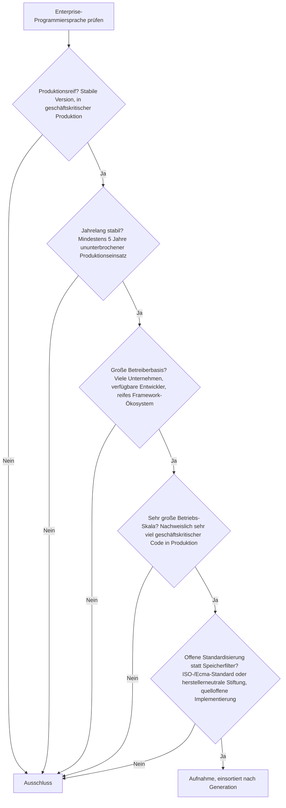
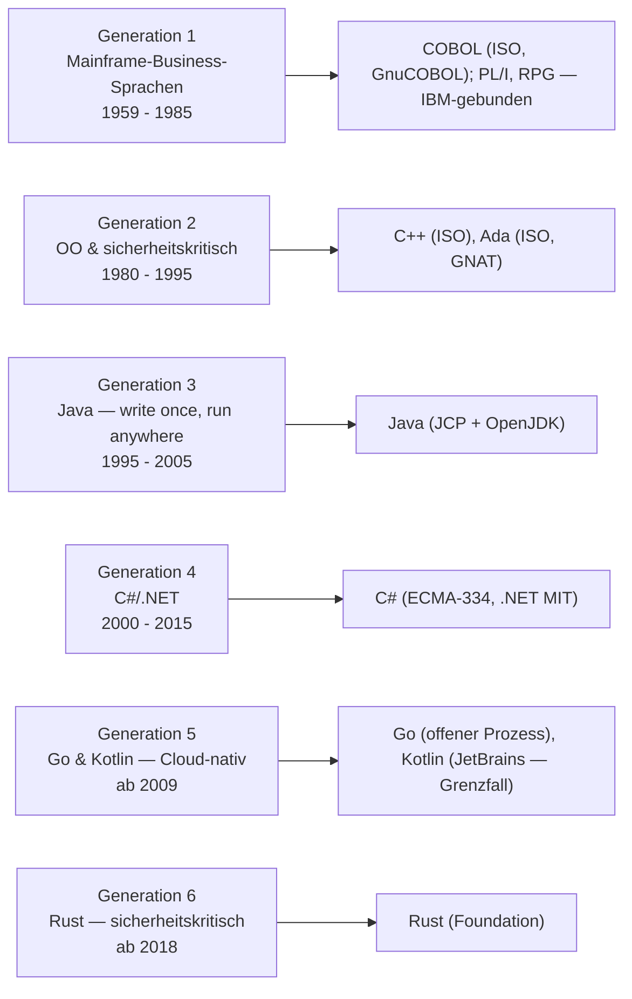
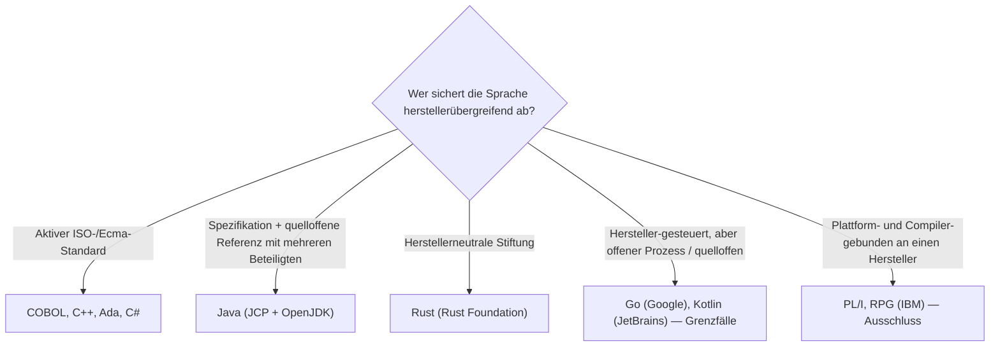

# Produktionsreife Enterprise-Programmiersprachen nach Generation — Reifegrad, Standardisierung & Betriebs-Skala (Top 8)

Die [Evolution und Architekturen digitaler Enterprise-Programmiersprachen](evolution-digitaler-enterprise-programmiersprachen.md) ordnet die Sprachen langlebiger, geschäftskritischer Software nach Generation: Mainframe-Business-Sprachen — COBOL, PL/I, RPG (1), objektorientierte & sicherheitskritische Systemsprachen — C++, Ada (2), Java (3), C#/.NET (4), Go & Kotlin — Cloud-natives Enterprise (5), Rust — sicherheitskritisches Enterprise (6). Die [Topliste bester Enterprise-Programmiersprachen 2026](enterprise-programmiersprachen-topliste.md) rankt nach heutiger Relevanz. Diese Seite legt das **konservative** Fünf-Filter-Sieb der Familie an und sortiert nach Generation; sie ist die Geschäftssoftware-Vertiefung der [allgemeinen Programmiersprachen-Schwesterseite](produktionsreife-programmiersprachen-generationen-2026-topliste.md).

!!! warning "Achtung: Fast jede Generation trifft — die reifste Kategorie der Familie"
    Enterprise-Sprachen werden per Definition nach Langlebigkeit ausgewählt — entsprechend bestehen **acht von zehn** Sprachen der Chronologie alle fünf Filter: **COBOL** (Gen 1), **C++** und **Ada** (Gen 2), **Java** (Gen 3), **C#** (Gen 4), **Go** und **Kotlin** (Gen 5), **Rust** (Gen 6). Wie bei den [Monolith-Frameworks](webentwicklung/produktionsreife-monolith-frameworks-generationen-2026-topliste.md) ist das kurze Ergebnis kein Zeichen von Strenge, sondern von Reife. Der Speicherfilter läuft für eine Sprache leer und wird durch **offene Standardisierung / herstellerneutrale Stewardship** ersetzt (Details auf der [Schwesterseite](produktionsreife-programmiersprachen-generationen-2026-topliste.md#standardisierung-statt-speicherbackend)). Das siebt hier vor allem die IBM-proprietären Mainframe-Geschwister **PL/I** und **RPG** aus — enormes Bestandsvolumen, aber keine offene Implementierung und schmale Betreiberbasis.

---

## Die fünf harten Filter

!!! note "Hinweis: Bestandsvolumen allein reicht nicht"
    COBOL, PL/I und RPG tragen zusammen Milliarden Zeilen produktiven Codes — der Unterschied liegt in der Offenheit: COBOL hat einen aktiven ISO-Standard (2023) und mit GnuCOBOL eine quelloffene Implementierung, PL/I und RPG bleiben an IBM-Großrechner-Umgebungen und -Compiler gebunden. Neuprojekt-Nachfrage ist kein Filterkriterium — Wartungsrelevanz im Millionenmaßstab zählt als Betriebs-Skala.

---

## Ergebnis: acht Treffer über sechs Generationsstufen

---

## Systeme nach Generation

### Generation 1 — Mainframe-Business-Sprachen (1959 – 1985)

| # | Sprache | Standardisierung | Impl. | Seit | Skala-Nachweis |
|---|---|---|---|---|---|
| 1 | **COBOL** | ISO/IEC 1989 (aktuell 2023), aktives Komitee | GnuCOBOL (quelloffen) neben IBM/Micro Focus | 1959 | Schätzungen zufolge Milliarden Zeilen produktiver Code in Banken-, Versicherungs- und Behörden-Mainframes — laufend gewartet und erweitert |

**COBOL** besteht als älteste Enterprise-Sprache: durchgehende ISO-Standardisierung, mit GnuCOBOL eine quelloffene Implementierung, und ein Bestandsvolumen, das jede Neuprojekt-Statistik in den Schatten stellt. **PL/I** und **RPG** tragen ebenfalls anhaltende Mainframe-Last, bleiben aber an IBM-Compiler und -Plattform (z/OS, IBM i) gebunden — keine breite offene Implementierung, schmale Betreiberbasis.

### Generation 2 — Objektorientierte & sicherheitskritische Systemsprachen (1980 – 1995)

| # | Sprache | Standardisierung | Impl. | Seit | Skala-Nachweis |
|---|---|---|---|---|---|
| 2 | **C++** | ISO/IEC 14882 (C++23), dreijähriger Zyklus | GCC, Clang, MSVC | 1985 | Finanzhandelssysteme, Datenbank-Engines, performancekritische Unternehmensinfrastruktur |
| 3 | **Ada** | ISO/IEC 8652 (Ada 2022) | GNAT (GPL, quelloffen) | 1983 | Weiterhin vorgeschrieben in Luftfahrt-, Bahn- und Rüstungsinfrastruktur — kleine, aber hochkritische Betriebs-Skala |

**C++** ist ein Treffer wie auf der allgemeinen Schwesterseite. **Ada** besteht ebenfalls: aktiver ISO-Standard, quelloffener GNAT-Compiler, und ein anhaltender Pflicht-Einsatz in sicherheitskritischer Infrastruktur — die Betreiberbasis ist klein, die Konsequenz jedes Fehlers aber so hoch, dass „Betriebs-Skala" hier über Kritikalität statt Codemenge zählt.

### Generation 3 — Java (1995 – 2005)

| # | Sprache | Standardisierung | Impl. | Seit | Skala-Nachweis |
|---|---|---|---|---|---|
| 4 | **[Java](evolution-digitaler-enterprise-programmiersprachen.md#generation-3-java-write-once-run-anywhere-1995-2005)** | Java Language Specification, JCP (mehrere Mitglieder); OpenJDK unter GPL-2.0-with-Classpath-Exception | OpenJDK (quelloffen), mehrere Distributionen | 1995 | Größtes Bestandsvolumen *und* größte Neuprojekt-Nachfrage aller Enterprise-Sprachen zugleich — Spring/Jakarta-EE-Ökosystem |

**Java** ist der stärkste Enterprise-Treffer: über 25 Jahre kontinuierliche Adoption, OpenJDK als quelloffene Referenz, ein Spezifikations- und Community-Prozess mit mehreren Beteiligten. Die Oracle-Rolle im JCP ist real, aber OpenJDK und die JLS sichern die herstellerübergreifende Nutzbarkeit.

### Generation 4 — C#/.NET (2000 – 2015)

| # | Sprache | Standardisierung | Impl. | Seit | Skala-Nachweis |
|---|---|---|---|---|---|
| 5 | **C#** | ECMA-334 / ISO/IEC 23270; .NET Foundation | .NET (MIT-Lizenz, quelloffen seit .NET Core 2016) | 2000 | Dominant in Microsoft-zentrierten Unternehmenslandschaften — Windows-Server, Active Directory, SQL Server, Azure |

**C#** besteht: Es gibt einen ECMA-/ISO-Standard, .NET ist seit 2016 vollständig quelloffen (MIT), und die .NET Foundation existiert. Microsoft steuert die Richtung stark — milder als bei TypeScript, weil der Standard und die quelloffene Laufzeit real sind. Grenzfall an der Stewardship-Achse, hier noch klarer Treffer.

### Generation 5 — Go & Kotlin (ab 2009)

| # | Sprache | Standardisierung | Impl. | Seit | Skala-Nachweis |
|---|---|---|---|---|---|
| 6 | **Go** | Google-gesteuert, offener Proposal-Prozess, Go-1-Kompatibilitätsgarantie | gc (BSD, quelloffen) | 2009, 1.0 im Jahr 2012 | De-facto-Sprache der Cloud-Infrastruktur — Docker, Kubernetes, Terraform, Prometheus, Consul |
| 7 | **Kotlin** | Kotlin Foundation (JetBrains + Google), JetBrains steuert die Sprache | Kotlin-Compiler (Apache-2.0, quelloffen) | 2011, 1.0 im Jahr 2016 | Offizielle Android-Sprache seit 2019; seit Spring 5 (2017) offiziell als Enterprise-Backend-Sprache unterstützt |

**Go** besteht mit demselben Vorbehalt wie auf der Schwesterseite (herstellergebunden, aber offener Prozess). **Kotlin** ist der Grenzfall dieser Liste: sehr große Skala, quelloffener Compiler, eine Foundation — aber JetBrains kontrolliert die Sprachentwicklung, kein externer Standard. Im Enterprise-Kontext hier als Treffer geführt, weil die JVM-Interoperabilität und die Android-Rolle die Betriebs-Skala eindeutig machen.

### Generation 6 — Rust (ab 2018)

| # | Sprache | Standardisierung | Impl. | Seit | Skala-Nachweis |
|---|---|---|---|---|---|
| 8 | **[Rust](evolution-digitaler-enterprise-programmiersprachen.md#generation-6-rust-sicherheitskritisches-enterprise-ab-ca-2018)** | Rust Foundation (2021, mehrere Trägerunternehmen); ISO-Qualifizierung (Ferrocene) in Arbeit | rustc (MIT/Apache-2.0, quelloffen) | 2015 (1.0), Enterprise-Durchbruch ab 2018 | AWS Firecracker (2018), Linux-Kernel (2022), US-Regierungsempfehlung für speichersichere Sprachen (2024) |

**Rust** besteht: herstellerneutrale Foundation, quelloffene Referenzimplementierung, steilste Enterprise-Wachstumskurve mit politischem Rückenwind — als einzige Sprache der Liste mit einer expliziten Regierungsempfehlung seit Adas Pflicht-Rolle in Generation 2.

### PL/I & RPG — warum hier nichts steht

- **PL/I**: vereint COBOL- und Fortran-Konzepte, bleibt aber an IBM-Großrechner gebunden — kein aktiver offener Standard, keine breite quelloffene Implementierung, sehr schmale Betreiberbasis. Nischenhafte, aber anhaltende Präsenz.
- **RPG**: aktiv für Business-Logik auf IBM-i-Systemen (Nachfolger der AS/400), vollständig an IBMs Plattform und Compiler gebunden. Bestandsvolumen ohne offene Implementierung.

---

## Standardisierung statt Speicherbackend

Der Speicherfilter der übrigen Familie hat für eine Sprache keine Entsprechung — die analoge harte Frage ist die herstellerübergreifende Absicherung. Sie trennt hier sauber: Die IBM-Mainframe-Geschwister PL/I und RPG scheitern genau daran, während COBOL aus derselben Generation durch den ISO-Standard und GnuCOBOL besteht.

!!! warning "Achtung: Momentaufnahme, Stand August 2026"
    Bekommt Rust die Ferrocene-ISO-Qualifizierung, festigt sich sein Enterprise-Status weiter. Sollte eine der herstellergesteuerten Sprachen (Kotlin, Go) die Governance öffnen oder verengen, verschiebt sich ihr Status auf der Stewardship-Achse.

---

## Was bewusst nicht auf dieser Liste steht

| Sprache | Erfüllt nicht | Anmerkung |
|---|---|---|
| **PL/I** | Standardisierung + Betreiberbasis | An IBM-Großrechner gebunden, keine breite offene Implementierung |
| **RPG** | Standardisierung + Betreiberbasis | An IBM i und IBM-Compiler gebunden; Bestandsvolumen ohne Offenheit |
| **Visual Basic (.NET)** | Kontinuität | Von Microsoft in den Wartungsmodus versetzt, keine Sprach-Weiterentwicklung |
| **Scala, Clojure** | Betriebs-Skala als Enterprise-Primärsprache | Reif und quelloffen, aber deutlich kleinere Enterprise-Betreiberbasis als Java/Kotlin auf der JVM |
| **Groovy** | Betriebs-Skala | Vor allem als Build-/Skriptsprache (Gradle) verbreitet, selten als Anwendungs-Primärsprache |

---

## 🔗 Verwandte Themen

- [Evolution und Architekturen digitaler Enterprise-Programmiersprachen](evolution-digitaler-enterprise-programmiersprachen.md) — das Generationenmodell, nach dem diese Liste sortiert ist
- [Beste Programmiersprachen für Enterprise-Software (Top 10)](enterprise-programmiersprachen-topliste.md) — breitere Basis-Topliste nach heutiger Relevanz, inklusive PL/I und RPG
- [Produktionsreife Programmiersprachen nach Generation (Top 9)](produktionsreife-programmiersprachen-generationen-2026-topliste.md) — allgemeine Schwesterseite nach Paradigmen-Generationen; erklärt die Standardisierungs-Achse ausführlich
- [Produktionsreife Sprachen der Programmierparadigmen nach Generation](produktionsreife-programmierparadigmen-sprachen-generationen-2026-topliste.md) — dasselbe Sieb aus Paradigmen-Sicht
- [Produktionsreife Programmiersprachen für Wissenssysteme nach Generation (Top 7)](../wissen/dokumentation/produktionsreife-wissenssystem-programmiersprachen-generationen-2026-topliste.md) — die dritte Domänen-Vertiefung der Sprach-Achse (Wiki/PKM/Docs statt Geschäftssoftware)
- [Produktionsreife Monolith-Web-Frameworks nach Generation](webentwicklung/produktionsreife-monolith-frameworks-generationen-2026-topliste.md) — dieselbe „reifste Kategorie"-Beobachtung; Spring (Java) und ASP.NET (C#) dort im Framework-Kontext
- [C++ Praxis-Handbuch](system/cpp-praxis.md) · [Rust Praxis-Handbuch](system/rust-praxis.md) — Vertiefungen zu Rang 2 und 8
