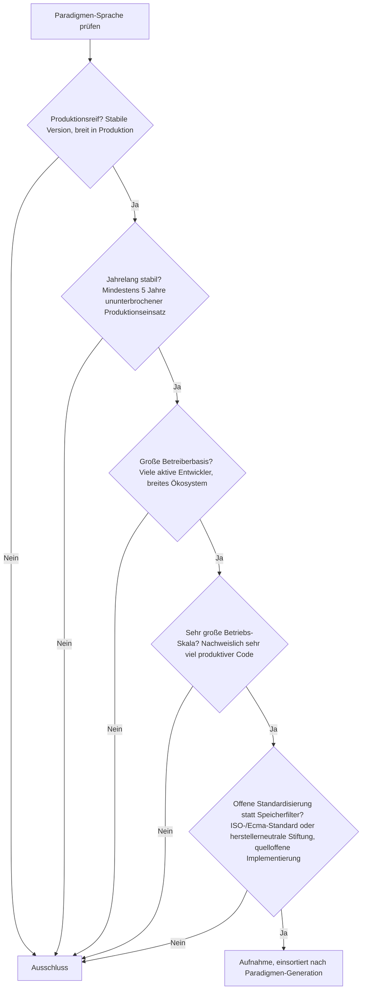
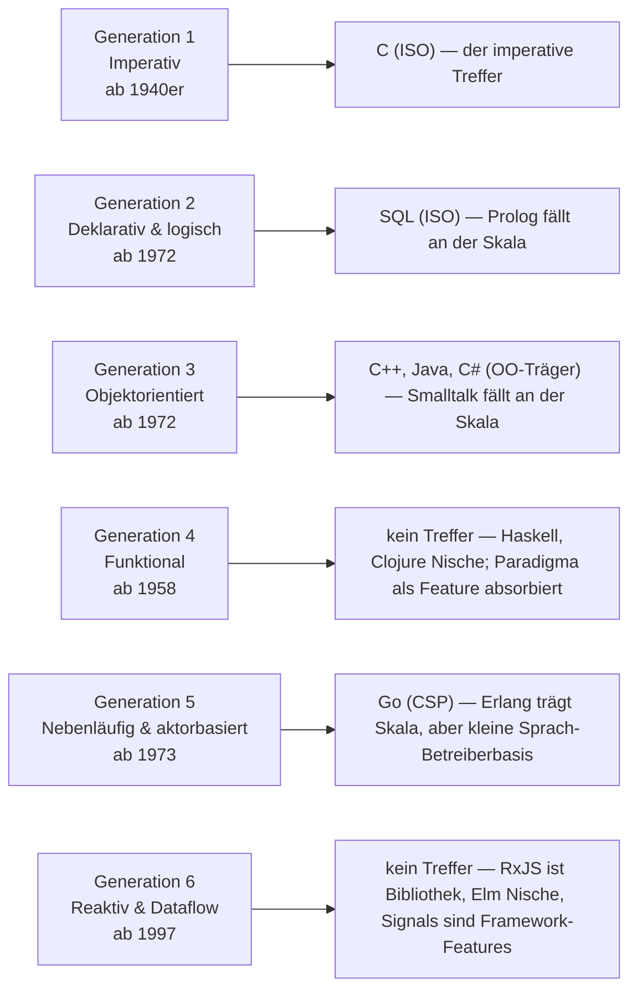
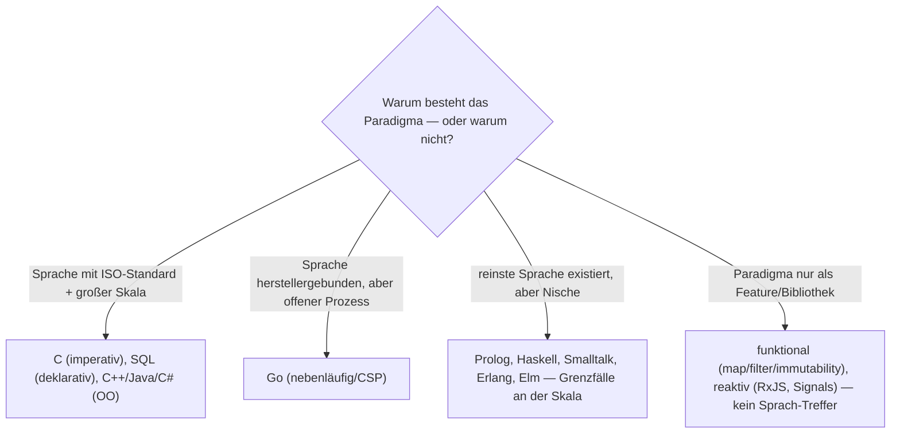

# Produktionsreife Sprachen der Programmierparadigmen nach Generation — Reifegrad, Standardisierung & Betriebs-Skala (Top 4)

Die [Evolution und Architekturen digitaler Programmierparadigmen](evolution-digitaler-programmierparadigmen.md) ordnet die abstrakten Berechnungsmodelle nach Generation: imperativ — direkte Zustandsänderung (1), deklarativ & logisch — was statt wie (2), objektorientiert (3), funktional — ohne Seiteneffekte (4), nebenläufig & aktorbasiert (5), reaktiv & Dataflow (6). Die [Topliste bester Paradigmen-Sprachen 2026](programmierparadigmen-sprachen-topliste.md) rankt nach Reinheit der Umsetzung. Diese Seite legt das **konservative** Fünf-Filter-Sieb der Familie an — mit dem Speicherfilter ersetzt durch offene Standardisierung (siehe [allgemeine Schwesterseite](produktionsreife-programmiersprachen-generationen-2026-topliste.md#standardisierung-statt-speicherbackend)) — und fragt pro Paradigma: Gibt es eine Sprache, die es *und* alle fünf Filter besteht?

!!! warning "Achtung: Nur vier Paradigmen haben einen produktionsreifen Sprach-Treffer"
    Die reinsten Paradigmen-Sprachen sind fast alle Nische. Es bestehen: **C** (imperativ, Generation 1), **SQL** (deklarativ, Generation 2 — nicht Prolog), die **OO-Träger C++, Java, C#** (Generation 3), **Go** (nebenläufig/CSP, Generation 5 — nicht Erlang). **Generation 4 (funktional)** und **Generation 6 (reaktiv/Dataflow)** haben **keinen Sprach-Treffer**: Haskell, Clojure und Elm sind reif und quelloffen, aber Nische; die beiden Paradigmen setzten sich durch, indem sie zu **Features** (Iteratoren, Pattern Matching, Unveränderlichkeit in jeder modernen Sprache) und **Bibliotheken** (RxJS, Signal-Systeme in Web-Frameworks) wurden, nicht als dominante Sprache. Derselbe Befund wie bei den [Islands-/Edge-Architekturen](webentwicklung/produktionsreife-islands-edge-architekturen-generationen-2026-topliste.md): das Paradigma gewinnt als Modus eines reifen Systems, nicht als eigenes Produkt.

---

## Die fünf harten Filter

!!! note "Hinweis: Paradigmen-Reinheit ist hier kein Vorteil"
    Die [Basis-Topliste](programmierparadigmen-sprachen-topliste.md) belohnt Reinheit — Haskell (rein funktional), Prolog (rein logisch), Smalltalk (reines OO), Elm (reiner unidirektionaler Datenfluss) stehen dort vorn. Dieses Sieb belohnt Verbreitung: Genau die kompromisslos-reinen Sprachen fallen an der Betriebs-Skala, während die Multi-Paradigmen-Träger bestehen.

---

## Ergebnis: vier Paradigmen mit Sprach-Treffer, zwei ohne

---

## Sprachen nach Paradigmen-Generation

### Generation 1 — Imperativ (ab 1940er)

| # | Sprache | Standardisierung | Impl. | Seit | Skala-Nachweis |
|---|---|---|---|---|---|
| 1 | **C** | ISO/IEC 9899 (C23) | GCC, Clang u. v. m. (quelloffen) | 1972 | Größter Einsatz-Fußabdruck jeder Sprache — Betriebssystem-Kernel, eingebettete Systeme, Sprach-Laufzeiten |

**C** ist die reinste noch dominante Umsetzung des strukturiert-imperativen Paradigmas (Generation 1b/1c der Chronologie): benannte Prozeduren, explizite Zustandsänderung, kein verdeckter Kontrollfluss. ISO-standardisiert, mehrere quelloffene Compiler, allgegenwärtig.

### Generation 2 — Deklarativ & logisch (ab 1972)

| # | Sprache | Standardisierung | Impl. | Seit | Skala-Nachweis |
|---|---|---|---|---|---|
| 2 | **SQL** | ISO/IEC 9075, laufend erweitert | PostgreSQL, SQLite, MariaDB u. v. m. (quelloffen) | 1974 | Die Abfragesprache praktisch jeder relationalen Datenbank weltweit — gewaltige, allgegenwärtige Nutzung |

**SQL** ist der deklarative Treffer, nicht Prolog: Man beschreibt die gewünschte Ergebnismenge, der Optimierer wählt den Ausführungsplan — dasselbe „was statt wie"-Prinzip wie Logikprogrammierung, aber in gigantischer Produktions-Skala. **Prolog** (ISO/IEC 13211, SWI-Prolog quelloffen) setzt das logische Paradigma reiner um, hat aber nur eine kleine Betreiberbasis — Grenzfall an der Skala.

### Generation 3 — Objektorientiert (ab 1972)

| # | Sprache | Standardisierung | Impl. | Seit | Skala-Nachweis |
|---|---|---|---|---|---|
| 3 | **C++, Java, C#** | ISO/IEC 14882 · JLS + OpenJDK · ECMA-334 | GCC/Clang · OpenJDK · .NET (alle quelloffen) | 1985 / 1995 / 2000 | Zusammen der Großteil aller objektorientierten Produktionscodebasen weltweit |

Die OO-Träger bestehen — nicht als reine, sondern als Multi-Paradigmen-Sprachen, die Kapselung, Vererbung und Polymorphie in gewaltiger Skala tragen. **Smalltalk** („alles ist ein Objekt", ANSI-Standard 1998, Pharo/Squeak quelloffen) ist die reinste OO-Umsetzung, aber die heutige Betreiberbasis ist klein — Grenzfall an der Skala.

### Generation 5 — Nebenläufig & aktorbasiert (ab 1973)

| # | Sprache | Standardisierung | Impl. | Seit | Skala-Nachweis |
|---|---|---|---|---|---|
| 4 | **Go** | Google-gesteuert, offener Proposal-Prozess, Kompatibilitätsgarantie | gc (BSD, quelloffen) | 2009, 1.0 im Jahr 2012 | De-facto-Sprache der Cloud-Infrastruktur — Goroutinen und Channels setzen CSP direkt als Sprach-Primitiv um |

**Go** ist der Nebenläufigkeits-Treffer: Communicating Sequential Processes (Hoare, 1978) direkt in der Sprache, in sehr großer Skala. **Erlang/Elixir** setzen das konkurrierende Actor Model (Hewitt, 1973) reiner um und tragen Systeme gewaltiger Skala (WhatsApp, Discord, RabbitMQ) — die Sprach-Betreiberbasis bleibt aber modest, Grenzfall.

### Generation 4 & 6 — warum hier kein Sprach-Treffer steht

- **Generation 4 (funktional)**: **Haskell** (Haskell Foundation, GHC quelloffen), **Clojure** (EPL, quelloffen), **Scala** (Apache-2.0) sind alle reif und quelloffen — keine erreicht als primäre Anwendungssprache eine sehr große Betreiberbasis. Das funktionale Paradigma gewann als **Feature**: Funktionen als Werte, Unveränderlichkeit, Pattern Matching und `map`/`filter`/`reduce` sind heute in C++, Java, Python, JavaScript, Rust, Kotlin und Swift Standard. Wer funktional in Reinform will, lernt Haskell — wer funktional produktiv arbeitet, tut es in einer Multi-Paradigmen-Sprache aus Generation 3 dieser Seite.
- **Generation 6 (reaktiv/Dataflow)**: Das reaktive Paradigma hat gar keine eigene produktionsreife *Sprache*. **RxJS/ReactiveX** ist eine **Bibliothek** (u. a. Kern von Angular). **Elm** ist eine eigene Sprache mit striktem unidirektionalem Datenfluss, aber deutlich nischig und mit sehr langsamer Weiterentwicklung. **Fine-grained Signals** sind ein **Framework-Feature** (SolidJS, Angular, Vue, Svelte 5). Das Paradigma lebt vollständig in Bibliotheken und Frameworks — siehe [Web-Frameworks-Reaktivitätsmodell](webentwicklung/evolution-digitaler-webframeworks.md#4-reaktivitatsmodell) und die [SPA-Frameworks-Schwesterseite](webentwicklung/produktionsreife-spa-frameworks-generationen-2026-topliste.md).

---

## Standardisierung statt Speicherbackend

Der Speicherfilter läuft für eine Sprache leer; die ersetzende Standardisierungs-Achse ist hier zweitrangig, weil das eigentliche Sieb schon an der **Betriebs-Skala** greift: Die kompromisslos-reinen Paradigmen-Sprachen sind fast alle zu klein, und zwei Paradigmen haben ihre reifste Umsetzung außerhalb jeder Sprache.

!!! warning "Achtung: Momentaufnahme, Stand August 2026"
    Sollte eine funktionale Sprache (am ehesten über die Elixir-/BEAM-Schiene) breite Anwendungs-Adoption erreichen, bekäme Generation 4 ihren ersten Treffer. Für das reaktive Paradigma ist kein Sprach-Kandidat in Sicht — es bleibt Framework-Sache.

---

## Was bewusst nicht auf dieser Liste steht

| Sprache | Erfüllt nicht | Anmerkung |
|---|---|---|
| **Prolog** | Betriebs-Skala | ISO-standardisiert, SWI-Prolog quelloffen — kleine Betreiberbasis |
| **Haskell, Clojure, Scala** | Betriebs-Skala als Primärsprache | Reif und quelloffen; funktionales Paradigma als Feature in Multi-Paradigmen-Sprachen absorbiert |
| **Smalltalk** | Betriebs-Skala | Reinste OO-Umsetzung, aber kleine heutige Betreiberbasis |
| **Erlang / Elixir** | Sprach-Betreiberbasis | Trägt Systeme gewaltiger Skala, die Sprach-Community bleibt vergleichsweise klein |
| **RxJS / ReactiveX** | Kategorie | Bibliothek, keine Sprache |
| **Elm** | Betriebs-Skala + Weiterentwicklung | Eigene reaktive Sprache, aber nischig und sehr langsam weiterentwickelt |
| **TypeScript** | Paradigmen-Zuordnung + Stewardship | Auf der [Basis-Topliste](programmierparadigmen-sprachen-topliste.md) als reaktiver Vertreter (mit RxJS) geführt; als Sprache Microsoft-kontrolliert, siehe [allgemeine Schwesterseite](produktionsreife-programmiersprachen-generationen-2026-topliste.md) |

---

## 🔗 Verwandte Themen

- [Evolution und Architekturen digitaler Programmierparadigmen](evolution-digitaler-programmierparadigmen.md) — das Paradigmen-Generationenmodell, nach dem diese Liste sortiert ist
- [Beste Sprachen zur Umsetzung der Programmierparadigmen (Top 10)](programmierparadigmen-sprachen-topliste.md) — Basis-Topliste nach Paradigmen-Reinheit; dort stehen Haskell, Prolog, Smalltalk vorn
- [Produktionsreife Programmiersprachen nach Generation (Top 9)](produktionsreife-programmiersprachen-generationen-2026-topliste.md) — allgemeine Schwesterseite; erklärt die Standardisierungs-Achse ausführlich
- [Produktionsreife Enterprise-Programmiersprachen nach Generation (Top 8)](produktionsreife-enterprise-programmiersprachen-generationen-2026-topliste.md) — dasselbe Sieb aus Geschäftssoftware-Sicht
- [Produktionsreife SPA-Web-Frameworks nach Generation](webentwicklung/produktionsreife-spa-frameworks-generationen-2026-topliste.md) — dort lebt das reaktive Paradigma (Generation 6) als Framework-Feature
- [Produktionsreife Islands- & Edge-Architekturen nach Generation](webentwicklung/produktionsreife-islands-edge-architekturen-generationen-2026-topliste.md) — derselbe Befund „Paradigma gewinnt als Modus, nicht als Produkt"
- [Evolution und Architekturen digitaler Expertensysteme](../künstliche-intelligenz/evolution-digitaler-expertensysteme.md) — Prolog als prägende Sprache der logischen Ära
