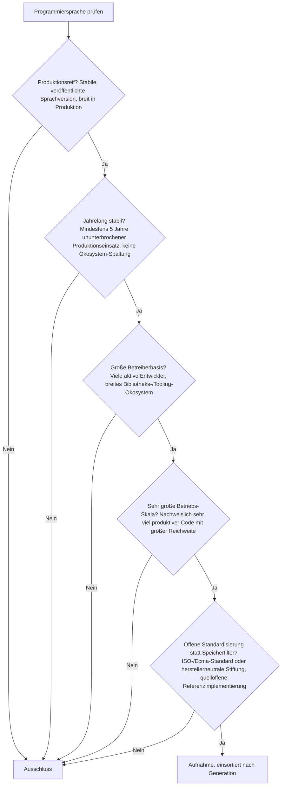
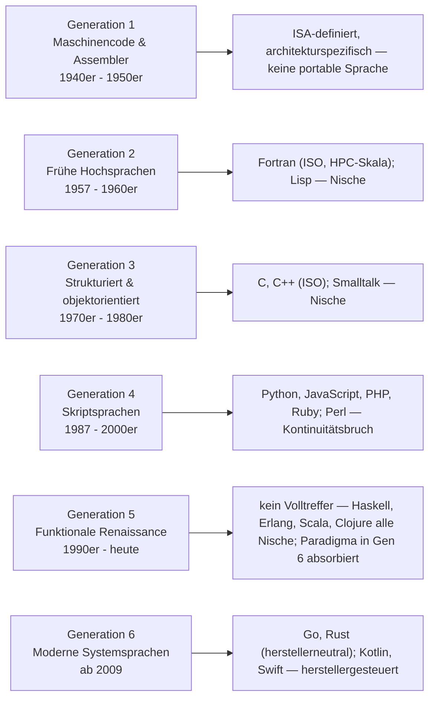
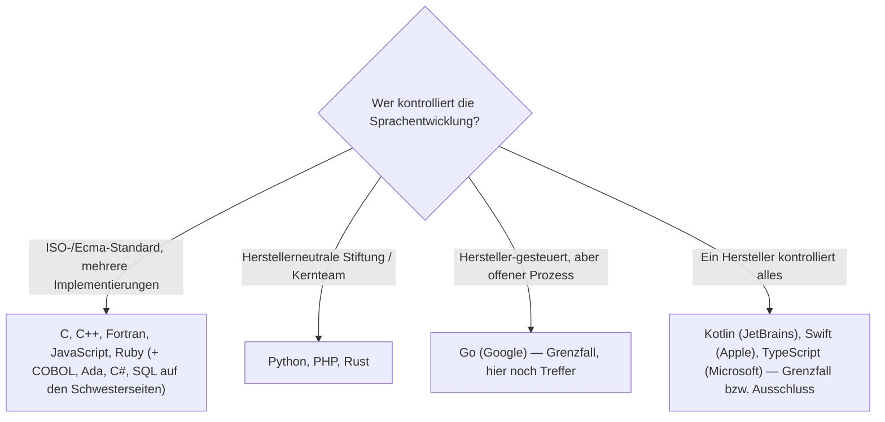

# Produktionsreife Programmiersprachen nach Generation — Reifegrad, Standardisierung & Betriebs-Skala (Top 9)

Die [Evolution und Architekturen digitaler Programmiersprachen](evolution-digitaler-programmiersprachen.md) ordnet Sprachen nach **Paradigmen-Generationen**: Maschinencode & Assembler (1), frühe Hochsprachen — Fortran, Lisp, Algol (2), strukturierte & objektorientierte Sprachen — C, Smalltalk, C++ (3), Skriptsprachen — Perl, Python, Ruby, PHP, JavaScript (4), funktionale Renaissance (5), moderne Systemsprachen als Synthese (6). Die domänenspezifischen Toplisten rankt die [Enterprise-](enterprise-programmiersprachen-topliste.md) und die [Paradigmen-Seite](programmierparadigmen-sprachen-topliste.md). Diese Seite legt das **konservative** Fünf-Filter-Sieb der Familie an — produktionsreif · jahrelang stabil · große Betreiberbasis · sehr große Betriebs-Skala · Speicher dateibasiert oder PostgreSQL — und sortiert nach Generation.

!!! warning "Achtung: Der Speicherfilter ist für eine Sprache bedeutungslos — an seine Stelle tritt offene Standardisierung"
    Eine Programmiersprache schreibt kein Speicherbackend vor — jede allgemeine Sprache ist datenhaltungs-agnostisch, der fünfte Filter läuft strukturell leer. Wie bei [Compilern](system/produktionsreife-compiler-werkzeuge-generationen-2026-topliste.md) und [Editoren](system/produktionsreife-editoren-generationen-2026-topliste.md) rückt damit eine andere Achse in den Vordergrund: **offene, herstellerneutrale Stewardship** (ein ISO-/Ecma-Standard *oder* eine unabhängige Stiftung) plus eine **quelloffene Referenzimplementierung** plus **Kontinuität ohne Ökosystem-Bruch**. Klare Treffer: **Fortran** (Gen 2), **C** und **C++** (Gen 3), **Python**, **JavaScript/ECMAScript**, **PHP**, **Ruby** (Gen 4), **Go** und **Rust** (Gen 6). Grenzfälle wegen Herstellersteuerung trotz offener Lizenz: **Kotlin** (JetBrains), **Swift** (Apple). **Perl** ist das Kontinuitäts-Opfer der Generation 4 (Raku-Spaltung, Perl-7-Stillstand, stark schrumpfende Nutzung). **Generation 5** — die funktionale Renaissance — hat **keinen Volltreffer**: Haskell, Erlang, Scala und Clojure sind reif und quelloffen, erreichen aber als *primäre* Sprache keine sehr große Betriebs-Skala; das Paradigma überlebte, indem es in die Gen-6-Sprachen einwanderte.

---

## Die fünf harten Filter

!!! note "Hinweis: Warum der Speicherfilter durch Standardisierung ersetzt wird"
    In der übrigen Familie siebt der Speicherfilter (dateibasiert oder PostgreSQL, kein Pflicht-Zweitsystem) transaktionale Systeme. Eine Sprache *ist* kein transaktionales System — sie überlässt die Datenhaltung vollständig der Anwendung. Die analoge „harte" Frage für eine Sprache lautet: Kontrolliert sie ein einzelner Hersteller, oder gibt es eine herstellerneutrale Instanz (Standard oder Stiftung) und mindestens eine quelloffene Referenzimplementierung? Genau diese Frage trennt hier die Treffer von den Grenzfällen.

---

## Ergebnis: neun Treffer über sechs Generationsstufen

---

## Systeme nach Generation

### Generation 2 — Frühe Hochsprachen (1957 – 1960er)

| # | Sprache | „Speicher" (Standardisierung) | Referenzimpl. | Seit | Skala-Nachweis |
|---|---|---|---|---|---|
| 1 | **Fortran** | ISO/IEC 1539 (aktuell Fortran 2023), aktiv weitergepflegtes Komitee | GNU Fortran, LLVM Flang (quelloffen) | 1957 | Dominierend im wissenschaftlichen Hochleistungsrechnen — Klima-/Wettermodelle, Strömungssimulation, numerische Bibliotheken (BLAS/LAPACK-Erben) auf praktisch jedem Supercomputer |

**Fortran** besteht das Sieb als älteste noch produktionsreife Sprache: durchgehende ISO-Standardisierung seit 1966, mehrere quelloffene Compiler, ununterbrochener Einsatz seit fast 70 Jahren. Die Betreiberbasis ist domänenbegrenzt (HPC, numerische Wissenschaft), aber innerhalb dieser Domäne die klare Standardsprache mit gewaltiger Rechenlast. **Lisp** (Common Lisp: ANSI-Standard 1994, SBCL quelloffen) ist gleich alt und reif, hat aber nur noch eine kleine Betreiberbasis — Grenzfall an der Skala.

### Generation 3 — Strukturierte & objektorientierte Sprachen (1970er – 1980er)

| # | Sprache | „Speicher" (Standardisierung) | Referenzimpl. | Seit | Skala-Nachweis |
|---|---|---|---|---|---|
| 2 | **C** | ISO/IEC 9899 (aktuell C23), aktiv | GCC, Clang, unzählige weitere (quelloffen) | 1972 | Größter Einsatz-Fußabdruck jeder Sprache überhaupt — jeder Betriebssystem-Kernel, eingebettete Systeme, Laufzeiten fast aller anderen Sprachen |
| 3 | **C++** | ISO/IEC 14882 (aktuell C++23), dreijähriger Release-Zyklus | GCC, Clang, MSVC (Compiler quelloffen bzw. frei) | 1985 | Browser-Engines, Spiele-Engines, Datenbank-Kerne, Finanzhandelssysteme, Hochleistungs-Infrastruktur |

**C** und **C++** sind die archetypischen Treffer: jahrzehntelange ISO-Standardisierung mit aktiven Komitees, mehrere unabhängige quelloffene Compiler, allgegenwärtiger Produktionseinsatz. **Smalltalk** (ANSI-Standard 1998, Pharo/Squeak quelloffen) ist die reinste OO-Umsetzung, aber die Betreiberbasis ist heute klein — Grenzfall an der Skala.

### Generation 4 — Skriptsprachen (1987 – 2000er)

| # | Sprache | „Speicher" (Standardisierung/Stewardship) | Referenzimpl. | Seit | Skala-Nachweis |
|---|---|---|---|---|---|
| 4 | **Python** | Python Software Foundation, PEP-Prozess (herstellerneutral, kein ISO-Standard nötig) | CPython (PSF-Lizenz, quelloffen) | 1991 | Eine der meistgenutzten Sprachen weltweit — KI/ML, Data Science, Web-Backends, Automatisierung, Lehre |
| 5 | **JavaScript / ECMAScript** | Ecma-262, TC39-Komitee mit mehreren Browser-Herstellern | V8, SpiderMonkey, JavaScriptCore (alle quelloffen) | 1995 | Läuft in jedem Webbrowser und serverseitig (Node.js) — größte Reichweite jeder Sprache im Web, praktisch unumgänglich |
| 6 | **PHP** | PHP Foundation (seit 2021), offener RFC-Prozess | Zend/PHP (quelloffen) | 1995 | Trägt einen großen Teil des Webs — WordPress allein läuft auf einem zweistelligen Prozentanteil aller Websites |
| 7 | **Ruby** | ISO/IEC 30170:2012, Matz + Kernteam (herstellerneutral) | CRuby/MRI (quelloffen) | 1995 | Rails-Ökosystem hinter GitHub, Shopify, GitLab und vielen weiteren Diensten großer Reichweite |

Alle vier bestehen: herstellerneutrale Stewardship (Stiftung oder Sprachschöpfer-Kernteam, bei Ruby zusätzlich ISO-Standard), quelloffene Referenzimplementierung, über drei Jahrzehnte ununterbrochener Großeinsatz.

### Generation 6 — Moderne Systemsprachen (ab 2009)

| # | Sprache | „Speicher" (Stewardship) | Referenzimpl. | Seit | Skala-Nachweis |
|---|---|---|---|---|---|
| 8 | **Go** | Google-gesteuert, aber offener Proposal-Prozess und strikte Go-1-Kompatibilitätsgarantie; kein externer Standard | gc (BSD-Lizenz, quelloffen) | 2009, 1.0 im Jahr 2012 | De-facto-Sprache der Cloud-Infrastruktur selbst — Docker, Kubernetes, Terraform, Prometheus |
| 9 | **Rust** | Rust Foundation (2021, mehrere Trägerunternehmen), herstellerneutral | rustc (MIT/Apache-2.0, quelloffen) | 2015 (1.0) | Steilste Wachstumskurve, Aufnahme in den Linux-Kernel (2022), US-Regierungsempfehlung für speichersichere Sprachen (2024) |

**Go** und **Rust** bestehen: quelloffene Referenzimplementierung, große und wachsende Betreiberbasis, sehr große Skala. Bei Go ist die Stewardship formal herstellergebunden (Google), praktisch aber durch den offenen Proposal-Prozess und die Kompatibilitätsgarantie abgesichert; Rust hat mit der Foundation eine echte herstellerneutrale Instanz.

### Generation 1 & 5 sowie die Grenzfälle — warum hier nichts (weiteres) steht

- **Generation 1 (Maschinencode & Assembler)**: Assembler ist keine portable Sprache im Filtersinn — der Befehlssatz ist an die konkrete Prozessorarchitektur gebunden (x86, ARM, RISC-V), es gibt keine einheitliche Sprache, nur architekturspezifische Mnemonic-Sätze. Das Fundament aller höheren Sprachen, aber selbst kein Sprach-„Produkt".
- **Generation 5 (funktionale Renaissance)**: **Haskell** (Haskell Foundation, GHC quelloffen), **Erlang** (Ericsson-Ursprung, OTP quelloffen), **Scala** (Apache-2.0, Scala Center) und **Clojure** (EPL, BDFL-Modell) sind alle reif und quelloffen — aber keine erreicht als *primäre* Anwendungssprache eine sehr große Betreiberbasis. Erlang trägt zwar Systeme gewaltiger Skala (WhatsApp, Discord, RabbitMQ), die Sprach-Betreiberbasis bleibt aber modest; Scalas 2→3-Übergang kostete zusätzlich Momentum. Das funktionale Paradigma „gewann", indem es zum Feature wurde — Iteratoren, Pattern Matching, Unveränderlichkeit sind heute in Rust, Kotlin, Swift und selbst Python Standard.
- **Kotlin** (seit 2011, 1.0 2016, offizielle Android-Sprache): sehr große Skala, quelloffen (Apache-2.0), Kotlin Foundation — aber JetBrains steuert die Sprachentwicklung vollständig, kein externer Standard. Grenzfall an der Stewardship-Achse.
- **Swift** (seit 2014, quelloffen ab 2015): sehr große Skala im Apple-Ökosystem, Apache-2.0 — aber Apple-gesteuert, kein externer Standard. Derselbe Grenzfall wie Kotlin.
- **TypeScript**: quelloffen (Apache-2.0), aber vollständig Microsoft-kontrolliert, kein externer Standard und keine Stiftung — deutlicher als Kotlin/Swift außerhalb des Siebs. Gehört auf die [Paradigmen-Schwesterseite](produktionsreife-programmierparadigmen-sprachen-generationen-2026-topliste.md) (reaktives Paradigma via RxJS).

---

## Standardisierung statt Speicherbackend

Die Familien-Frage „dateibasiert oder PostgreSQL?" hat für eine Sprache keine Entsprechung — die Sprache legt sich nicht fest. Die analoge Trennlinie:

- Der Speicherfilter läuft leer: Jede Sprache dieser Liste kann gegen SQLite, PostgreSQL, eine Datei oder gar nichts arbeiten — das ist Bibliotheks-, nicht Sprachwahl.
- Die ersetzende Achse siebt real: Sie trennt die durch Standard oder Stiftung abgesicherten Sprachen von den herstellergesteuerten. Eine herstellergesteuerte Sprache kann jederzeit die Richtung ändern (Lizenz, Fokus, Einstellung) — dasselbe Risiko, das der Speicherfilter bei einem Pflicht-Zweitsystem adressiert.

!!! warning "Achtung: Momentaufnahme, Stand August 2026"
    Bekommt Rust einen ISO-Standard (Ferrocene-Qualifizierung läuft), oder etabliert Kotlin/Swift eine wirklich herstellerneutrale Governance, verschiebt sich die Grenze. Junge Kandidaten wie Zig, Nim oder Carbon reißen die Fünf-Jahres- bzw. 1.0-Marke klar.

---

## Was bewusst nicht auf dieser Liste steht

| Sprache | Erfüllt nicht | Anmerkung |
|---|---|---|
| **Assembler** | Kategorie | ISA-gebunden, keine einheitliche portable Sprache |
| **Lisp (Common Lisp), Smalltalk** | Betriebs-Skala | Standardisiert und quelloffen, aber kleine heutige Betreiberbasis |
| **Perl** | Kontinuität + Skala | Raku-Spaltung, Perl-7-Stillstand, stark schrumpfende Nutzung seit den 2000ern |
| **Haskell, Erlang, Scala, Clojure** | Betriebs-Skala als Primärsprache | Reif und quelloffen; das funktionale Paradigma wurde zum Feature der Gen-6-Sprachen |
| **Kotlin, Swift** | Herstellerneutrale Stewardship | Sehr große Skala, quelloffen — aber JetBrains- bzw. Apple-gesteuert, kein externer Standard |
| **TypeScript** | Stewardship | Vollständig Microsoft-kontrolliert, keine Stiftung, kein Standard |
| **Java, C#, COBOL, Ada, SQL** | Kategorie dieser Seite | Bestehen das Sieb, sind aber auf der [Enterprise-](produktionsreife-enterprise-programmiersprachen-generationen-2026-topliste.md) bzw. [Paradigmen-Schwesterseite](produktionsreife-programmierparadigmen-sprachen-generationen-2026-topliste.md) einsortiert |
| **Zig, Nim, Carbon, Mojo** | Reifezeit / 1.0 | Alle vor 1.0 oder unter fünf Jahre Produktion |

---

## 🔗 Verwandte Themen

- [Evolution und Architekturen digitaler Programmiersprachen](evolution-digitaler-programmiersprachen.md) — das Paradigmen-Generationenmodell, nach dem diese Liste sortiert ist
- [Produktionsreife Enterprise-Programmiersprachen nach Generation](produktionsreife-enterprise-programmiersprachen-generationen-2026-topliste.md) — dasselbe Sieb für die Geschäftssoftware-Linie; dort bestehen zusätzlich COBOL, Ada, Java, C#
- [Produktionsreife Sprachen der Programmierparadigmen nach Generation](produktionsreife-programmierparadigmen-sprachen-generationen-2026-topliste.md) — dasselbe Sieb aus Paradigmen-Sicht; dort ist SQL der deklarative Treffer, Go der Nebenläufigkeits-Treffer
- [Produktionsreife Compiler-Werkzeuge nach Generation](system/produktionsreife-compiler-werkzeuge-generationen-2026-topliste.md) — dieselbe Beobachtung: bei Sprach-/Werkzeug-Kategorien läuft der Speicherfilter leer, die siebende Achse wird Lizenz/Standardisierung
- [Produktionsreife Rust-Web-Frameworks nach Generation](webentwicklung/produktionsreife-rust-webframeworks-generationen-2026-topliste.md) — Rust (Rang 9) im Framework-Kontext
- [Rust in der Praxis](system/rust-praxis.md) · [C in der Praxis](system/c-praxis.md) · [C++ Praxis-Handbuch](system/cpp-praxis.md) — Vertiefungen zu Rang 2, 3 und 9
- [Erste Schritte – Entwicklung](erste-schritte.md) — Einstieg in die Sprachwahl
