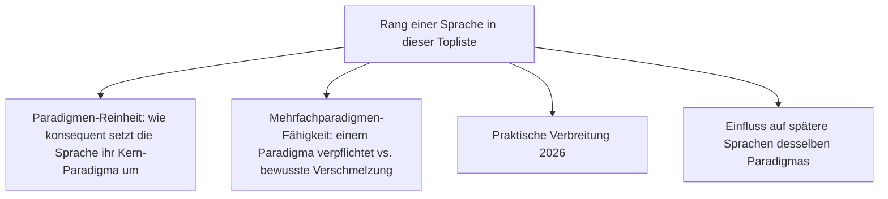
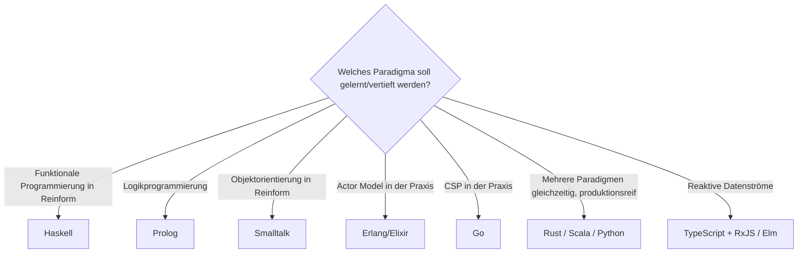

# Beste Sprachen zur Umsetzung der Programmierparadigmen — Top-10-Topliste

Die [Evolution und Architekturen digitaler Programmierparadigmen](evolution-digitaler-programmierparadigmen.md) ordnet sechs abstrakte Berechnungsmodelle chronologisch danach, wann sie erstmals formalisiert wurden. Diese Seite dreht die Perspektive auf konkrete Sprachen um: Sie rankt zehn Sprachen danach, **wie rein oder wie mächtig** sie ihr jeweiliges Paradigma 2026 tatsächlich umsetzen — von der reinsten Einzelparadigma-Sprache bis zur bewussten Multi-Paradigmen-Verschmelzung.

!!! note "Hinweis: Reinheit vs. praktische Verbreitung als zwei getrennte Achsen"
    Eine Sprache kann ein Paradigma sehr **rein** umsetzen (Prolog: fast ausschließlich logisch), ohne deshalb breit **verbreitet** zu sein — und umgekehrt. Diese Liste bewertet primär die Reinheit/Mächtigkeit der Paradigmen-Umsetzung, nennt aber bei jedem Rang auch die praktische Verbreitung.

---

## Bewertungskriterien

---

## Top 10 im Überblick

| Rang | Sprache | Vertretenes Paradigma | Generation | Besondere Stärke |
|---|---|---|---|---|
| 1 | **[Rust](system/rust-praxis.md)** | Multi-Paradigma (imperativ, funktional, nebenläufig) | 1, 4, 5 | Ownership-Modell macht Nebenläufigkeit ohne Datenrennen zum Sprach-Grundprinzip statt Bibliotheksfeature |
| 2 | **Haskell** | Funktional | 4 | Reinste verbreitete Umsetzung — vollständig seiteneffektfrei, Typsystem erzwingt Reinheit statt sie zu empfehlen |
| 3 | **Prolog** | Deklarativ/Logisch | 2 | Programme bestehen ausschließlich aus Fakten und Regeln, Unifikation statt jeder expliziten Kontrollflussanweisung |
| 4 | **Smalltalk** | Objektorientiert | 3 | „Alles ist ein Objekt" — Kommunikation ausschließlich über Nachrichten, reinste OO-Umsetzung überhaupt |
| 5 | **Erlang/Elixir** | Nebenläufig (Actor Model) | 5 | Isolierte Aktoren ohne geteilten Speicher, BEAM-VM erträgt Millionen leichtgewichtiger Prozesse |
| 6 | **Go** | Nebenläufig (CSP) | 5 | Goroutinen und Channels setzen Communicating Sequential Processes direkt als Sprach-Primitiv um |
| 7 | **Clojure** | Funktional (moderner Lisp) | 4 | Unveränderliche Datenstrukturen plus Software Transactional Memory für kontrollierte Nebenläufigkeit |
| 8 | **Scala** | Multi-Paradigma (OO + funktional) | 3, 4 | Bewusste Verschmelzung statt Kompromiss — objektorientierte Kapselung und funktionale Reinheit gleichzeitig auf der JVM |
| 9 | **Python** | Multi-Paradigma (imperativ, OO, funktional) | 1, 3, 4 | Meistgenutzte Multi-Paradigmen-Sprache im Alltag, keine strenge Paradigmen-Bindung erzwungen |
| 10 | **TypeScript + RxJS** | Reaktiv (Dataflow) | 6 | Observable-Streams als etabliertestes reaktives Programmiermodell im breit eingesetzten Sprachökosystem |

---

## Highlights im Detail

### Rang 1: Rust als bewusste Synthese statt Kompromiss
Anders als frühere Multi-Paradigmen-Sprachen, die mehrere Stile lose nebeneinander erlauben, verschränkt Rust imperative Kontrolle, funktionale Konstrukte (Iteratoren, Pattern Matching) und ein eigenes Nebenläufigkeitsmodell so eng mit dem Ownership-System, dass die Paradigmen sich gegenseitig absichern statt nur zu koexistieren.

### Rang 2–4: die drei „reinsten" Einzelparadigmen-Sprachen
Haskell, Prolog und Smalltalk eint, dass sie ihr jeweiliges Paradigma nicht als eine Option unter mehreren anbieten, sondern zur fast ausschließlichen Grundlage der gesamten Sprache machen — genau diese Kompromisslosigkeit macht sie zur besten Lernquelle für das jeweilige Paradigma, auch wenn sie in der breiten Praxis seltener eingesetzt werden als Rang 7–10.

### Rang 5–6: zwei konkurrierende Nebenläufigkeitsmodelle in Reinform
Erlang/Elixir (Actor Model) und Go (CSP) zeigen dieselbe Generation 5 der Evolution-Chronologie aus zwei unterschiedlichen theoretischen Wurzeln — Aktoren kommunizieren asynchron ohne geteilten Speicher, CSP-Prozesse synchronisieren sich explizit über Kanäle. Beide vermeiden denselben Fehlerklasse (Data Races), mit unterschiedlicher Philosophie.

### Rang 10: Elm als kompromisslosere Alternative
Wer die reinste, kompromissloseste Umsetzung des reaktiven Paradigmas sucht statt der praktisch verbreitetsten, findet sie eher in **Elm** — „The Elm Architecture" erzwingt unidirektionalen Datenfluss strikter, als es TypeScript/RxJS je könnte, bleibt aber deutlich nischiger.

---

## Entscheidungshilfe nach Lernziel

---

## 🔗 Verwandte Themen

- [Startseite](../index.md) — zurück zur Dokumentations-Zentrale
- [Evolution und Architekturen digitaler Programmierparadigmen](evolution-digitaler-programmierparadigmen.md) — chronologisches Generationenmodell, dessen Sprachbeispiele diese Topliste vertieft
- [Produktionsreife Sprachen der Programmierparadigmen nach Generation (Top 4)](produktionsreife-programmierparadigmen-sprachen-generationen-2026-topliste.md) — dieselben Paradigmen durch das konservative Fünf-Filter-Sieb; hier belohnt Verbreitung statt Reinheit, deshalb bestehen die Multi-Paradigmen-Träger statt Haskell/Prolog/Smalltalk
- [Beste Programmiersprachen für Enterprise-Software (Top 10)](enterprise-programmiersprachen-topliste.md) — analoges Sprachranking nach Enterprise-Relevanz statt Paradigmen-Reinheit
- [Beste Programmiersprachen für moderne Wissenssysteme (Top 10)](../wissen/dokumentation/programmiersprachen-wissenssysteme-topliste.md) — analoges Sprachranking für Wikis/PKM/Docs
- [Rust in der Praxis](system/rust-praxis.md) — Vertiefung zu Rang 1
- [Evolution und Architekturen digitaler Programmiersprachen](evolution-digitaler-programmiersprachen.md) — komplementäre, sprachen-chronologische Perspektive
- [Evolution und Architekturen digitaler Batteries-Included-Web-Frameworks](webentwicklung/evolution-digitaler-batteries-included-frameworks.md) — Phoenix/Elixir als konkrete Anwendung von Rang 5
- [Evolution und Architekturen digitaler Expertensysteme](../künstliche-intelligenz/evolution-digitaler-expertensysteme.md) — Prolog als prägende Sprache dieser Ära, vertiefend zu Rang 3
