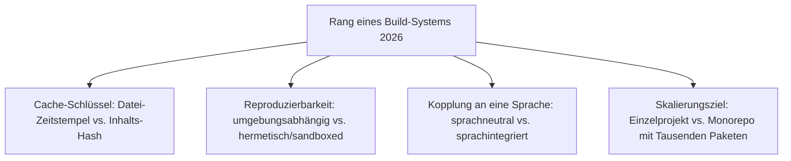
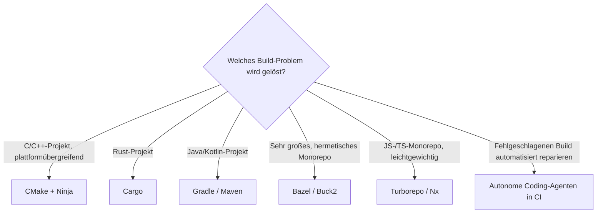

# Beste Build-Systeme 2026 — Top-15-Topliste

Die [Evolution und Architekturen digitaler Build-Systeme](evolution-digitaler-build-systeme.md) ordnet diese Werkzeuggattung chronologisch nach Architektur-Generation — von der ersten dependency-graph-basierten Automatisierung über plattformübergreifende Meta-Build-Generatoren, sprachintegrierte Build-/Paketmanager und hermetische Monorepo-Systeme bis zu content-hash-basierten Task-Runnern und KI-Agenten, die fehlgeschlagene Builds selbstständig reparieren. Diese Seite übersetzt die Chronologie in eine **Momentaufnahme 2026**: 15 Werkzeuge, die heute tatsächlich betrieben werden.

!!! note "Hinweis: Abgrenzung zu Paketmanagern"
    Diese Liste rankt Werkzeuge, die entscheiden, *was* neu gebaut werden muss — woher Abhängigkeiten kommen, behandelt [Beste Paketmanager 2026](paketmanager-2026-topliste.md). Cargo und Maven vereinen beide Rollen und tauchen daher in beiden Listen auf.

---

## Bewertungskriterien

---

## Top 15 im Überblick

| Rang | Werkzeug | Generation | Rolle | Besondere Stärke |
|---|---|---|---|---|
| 1 | **Make** | 1b (Make — Dependency-Graph statt Skript) | Build-Automatisierung | Etabliert den bis heute gültigen Grundbegriff „Build-System", treibt weiterhin unzählige Projekte an |
| 2 | **CMake** | 2 (Plattformübergreifende Meta-Build-Generatoren) | Meta-Build-Generator | Liest eine einzige `CMakeLists.txt` und generiert Makefiles, Ninja-Dateien oder Visual-Studio-Projekte |
| 3 | **Cargo** | 3 (Sprachintegrierte Build- & Paketmanager) | Build-/Paketmanager | Direkt in die Rust-Toolchain integriert, Build/Test/Paketverwaltung/Registry aus einem Werkzeug |
| 4 | **Bazel** | 4 (Hermetische, cachefähige Monorepo-Build-Systeme) | Hermetisches Build-System | Open-Source-Version von Googles internem „Blaze", verbreitetstes hermetisches System |
| 5 | **Ninja** | 2 (Plattformübergreifende Meta-Build-Generatoren) | Ausführungsziel | Extrem schnelles Ausführungsformat für Generatoren wie CMake, bewusst nicht zum Handschreiben gedacht |
| 6 | **Gradle** | 3 (Sprachintegrierte Build- & Paketmanager) | Build-/Paketmanager | Kombiniert Mavens Abhängigkeitsmodell mit flexibler Kotlin-DSL statt starrem XML |
| 7 | **Maven** | 3 (Sprachintegrierte Build- & Paketmanager) | Build-/Paketmanager | XML-basierte, konventionsgetriebene Projektstruktur für Java, zentrales Repository-Modell |
| 8 | **Turborepo** | 5 (Content-Hash-basierte JS-Monorepo-Task-Runner) | Task-Runner | Minimalistischer, extrem schneller Task-Runner mit Remote-Caching für JS-/TS-Monorepos |
| 9 | **Nx** | 5 (Content-Hash-basierte JS-Monorepo-Task-Runner) | Task-Runner | Monorepo-Task-Orchestrierung mit Abhängigkeitsgraph-Visualisierung und Computation-Caching |
| 10 | **Autoconf/Automake** (Autotools) | 2 (Plattformübergreifende Meta-Build-Generatoren) | Meta-Build-Generator | Generiert portable `configure`-Skripte, die zur Laufzeit Systemeigenschaften prüfen |
| 11 | **Buck2** | 4 (Hermetische, cachefähige Monorepo-Build-Systeme) | Hermetisches Build-System | Metas vollständiger Rust-Rewrite von Buck, deutlich schnellere Ausführung bei gleicher Hermetik |
| 12 | **Autonome Coding-Agenten in CI-Pipelines** | 6 (KI-Agenten reparieren Build-Fehler autonom) | Agentische Reparatur | Analysieren fehlgeschlagene Build-/Test-Läufe und schlagen automatisiert Korrekturen vor |
| 13 | **Buck** | 4 (Hermetische, cachefähige Monorepo-Build-Systeme) | Hermetisches Build-System | Facebooks ursprüngliches hermetisches Build-System für sehr große Monorepos |
| 14 | **Manuelle Compiler-Skripte** | 1a (Manuelle Compiler-Skripte) | Vorläufer (historisch) | Fester Shell-Skript-Ablauf ohne Konzept „nur das Nötige neu bauen" — der direkte Auslöser für Generation 1b |
| 15 | **GNU Make & POSIX-Standardisierung** | 1c (GNU Make & POSIX) | Standardisierung | Erweitert Make um Muster, Variablen und Funktionen, macht es zum portablen Unix-Standard |

---

## Highlights im Detail

### Rang 1–2, 5: die drei am weitesten verbreiteten sprachneutralen Systeme
Make, CMake und Ninja bilden zusammen die am häufigsten anzutreffende Kombination für C/C++-Projekte — CMake generiert, Ninja führt aus, Make bleibt als direktes Werkzeug für kleinere Projekte relevant, siehe [Generation 1–2](evolution-digitaler-build-systeme.md#generation-2-plattformubergreifende-meta-build-generatoren-1991-2011).

### Rang 3, 6–7: sprachintegrierte Build-/Paketmanager als heutiger Standardfall
Cargo, Gradle und Maven verschmelzen Build-Logik und Abhängigkeitsverwaltung zu einem einzigen Werkzeug — der heute übliche Ansatz für neue Sprachökosysteme, siehe [Generation 3](evolution-digitaler-build-systeme.md#generation-3-sprachintegrierte-build-paketmanager-2004-2014).

### Rang 4, 8–9, 11, 13: zwei parallele Antworten auf Monorepo-Skalierung
Bazel/Buck2/Buck (vollständige Hermetik) und Turborepo/Nx (leichtgewichtige Task-Orchestrierung) lösen dasselbe Grundproblem — Tausende Pakete in einem Repository — mit unterschiedlichem Isolations-Anspruch, siehe [Generation 4–5](evolution-digitaler-build-systeme.md#generation-5-content-hash-basierte-js-monorepo-task-runner-ab-2017).

---

## Entscheidungshilfe nach Baustellen-Typ

!!! tip "Tipp: Paketmanager-Perspektive separat prüfen"
    Woher Abhängigkeiten stammen und wie sie versioniert werden, behandelt [Beste Paketmanager 2026](paketmanager-2026-topliste.md).

---

## 🔗 Verwandte Themen

- [Startseite](../../index.md) — zurück zur Dokumentations-Zentrale
- [Evolution und Architekturen digitaler Build-Systeme](evolution-digitaler-build-systeme.md) — chronologisches Generationenmodell, dessen aktuellen Stand diese Topliste zusammenfasst
- [Produktionsreife Open-Source-Build-Systeme nach Generation (Top 9)](produktionsreife-build-systeme-generationen-2026-topliste.md) — dieselbe Chronologie durch das konservative Fünf-Filter-Sieb (produktionsreif, jahrelang stabil, große Betreiberbasis, sehr große Skala, dateibasiert oder PostgreSQL)
- [Beste Compiler-Werkzeuge 2026 (Top 15)](compiler-2026-topliste.md) — die Werkzeuge, deren Aufrufe hier orchestriert werden
- [Beste Paketmanager 2026 (Top 15)](paketmanager-2026-topliste.md) — verwandte, aber nicht deckungsgleiche Achse
- [Beste Versionskontrollsysteme 2026 (Top 15)](versionskontrollsysteme-2026-topliste.md) — Monorepo-Skalierungsproblem aus komplementärem Blickwinkel
- [C++20 Modules & Modern CMake](cpp20-modules-cmake.md) — praktische Vertiefung zu CMake
- [Rust in der Praxis](rust-praxis.md) — praktische Vertiefung zu Cargo
