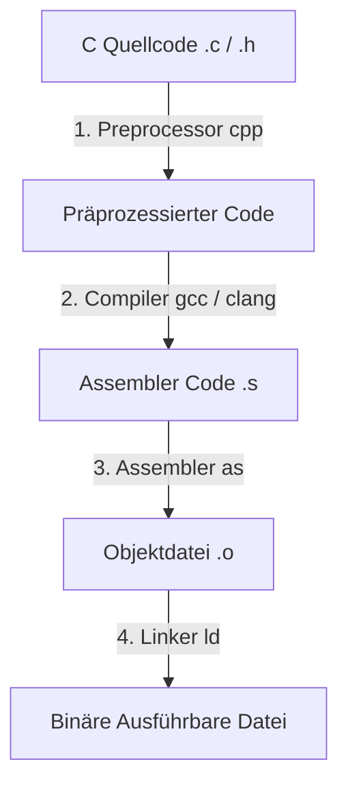
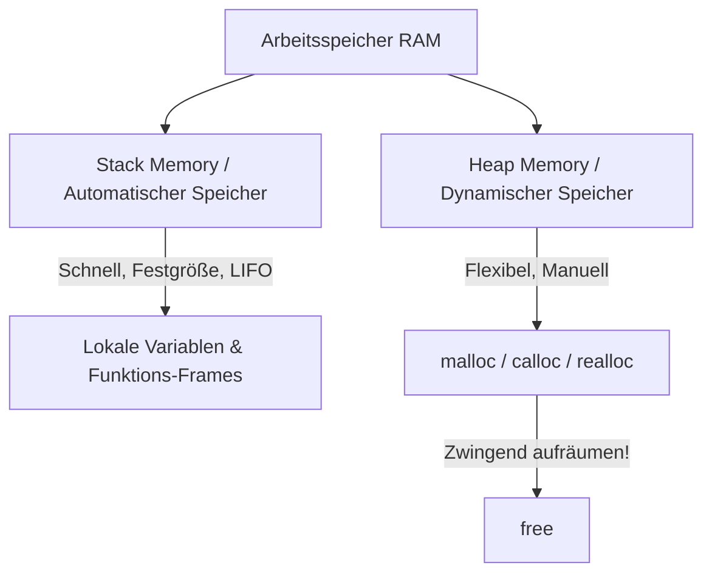

# C-Programmierung – Das Praxis-Handbuch & System-Leitfaden

**C** ist die fundamentale Programmiersprache der Systemprogrammierung, Betriebssystem-Kernel (Linux, Windows, macOS), Embedded Systems, Datenbank-Engines und High-Performance-Bibliotheken. C gewährt direkten Zugriff auf den Arbeitsspeicher und die Hardwarearchitektur bei minimalem Laufzeit-Overhead.

Dieses Handbuch bietet eine strukturierte Übersicht über Sprachgrundlagen, Zeiger-Arithmetik (Pointer Mechanics), dynamische Speicherverwaltung (`malloc`/`free`), Speicher-Gefahren (Memory Leaks, Buffer Overflows), Präprozessor, Build-Systeme (Make/CMake), Debugging mit GDB & Valgrind sowie POSIX Threads.

---

## 🚀 1. Einführung & Setup

### Warum C?
* **Hardware-Nähe & Kontrolle**: Manuelle Kontrolle über Speicherbelegung, Register und Maschinencode.
* **Maximale Performance**: Kein Garbage Collector, keine versteckten Laufzeit-Overheads.
* **Stabile ABI & Interoperabilität**: C bildet die Lingua Franca für Sprach-Bindings (z. B. FFI in Rust, Python, Go, Java).



### Compiler & Werkzeuge installieren

=== "Ubuntu / Debian"
    ```bash
    # Essential Build-Tools installieren (gcc, g++, make, gdb)
    sudo apt update && sudo apt install -y build-essential gdb valgrind cmake

    # Erste C-Datei kompilieren und ausführen
    gcc -Wall -Wextra -O2 main.c -o mein_programm
    ./mein_programm
    ```

=== "Compiler-Flags Best Practices"
    * `-Wall -Wextra`: Aktiviert alle Standard- und erweiterten Warnungen des Compilers.
    * `-O2` / `-O3`: Optimierungsstufen für Produktiv-Code.
    * `-g`: Fügt Debug-Symbole für GDB und Valgrind hinzu.
    * `-fsanitize=address`: Aktiviert den AddressSanitizer (ASan) zum Erkennen von Speicherfehlern zur Laufzeit.

---

## 📍 2. Zeiger, Speicher & Dynamische Verwaltung

### Das Speicher-Modell: Stack vs. Heap



### Pointer Mechanics (Zeiger-Mechanik)
Ein **Zeiger (Pointer)** ist eine Variable, die die Speicheradresse einer anderen Variablen speichert:

```c
#include <stdio.h>

int main(void) {
    int val = 42;
    int *ptr = &val; // ptr speichert die Adresse von val (&)

    printf("Wert: %d\n", *ptr);  // Dereferenzierung (*): Gibt 42 aus
    printf("Adresse: %p\n", (void*)ptr);

    *ptr = 100; // Ändert den Wert von val direkt über die Speicheradresse
    printf("Neuer Wert: %d\n", val); // Gibt 100 aus
    return 0;
}
```

### Dynamische Speicherverwaltung (`stdlib.h`)

| Funktion | Beschreibung | Beispiel |
|---|---|---|
| `malloc(size)` | Reserviert uninitialisierten Speicher | `int *arr = malloc(10 * sizeof(int));` |
| `calloc(n, size)` | Reserviert und **null-initialisiert** Speicher | `int *arr = calloc(10, sizeof(int));` |
| `realloc(ptr, size)` | Ändert die Größe eines bestehenden Blocks | `arr = realloc(arr, 20 * sizeof(int));` |
| `free(ptr)` | Gibt reservierten Speicher wieder frei | `free(arr); arr = NULL;` |

!!! warning "Speicher-Gefahren vermeiden"
    * **Memory Leak**: Aufgerufenes `malloc()` ohne zugehöriges `free()`.
    * **Dangling Pointer**: Zugriff auf einen Zeiger, dessen Speicher bereits mit `free()` freigegeben wurde.
    * **Buffer Overflow**: Schreiben über die Grenzen des reservierten Speicherblocks hinaus.
    * **Undefined Behavior (UB)**: Dereferenzieren von `NULL`-Zeigern.

---

## 🛠️ 3. Benutzerdefinierte Typen & Datenstrukturen

### Structs, Unions, Enums & Typedef

=== "Structs & Typedef"
    ```c
    #include <stdio.h>

    // Definition einer Struktur mit typedef für saubere Syntax
    typedef struct {
        int id;
        char name[50];
        double gehalt;
    } Mitarbeiter;

    void drucke_mitarbeiter(const Mitarbeiter *m) {
        // Pfeil-Operator (->) für Zeiger auf Structs
        printf("ID: %d, Name: %s, Gehalt: %.2f\n", m->id, m->name, m->gehalt);
    }
    ```

=== "Unions & Enums"
    ```c
    typedef enum { INT_TYP, FLOAT_TYP } DatenTyp;

    // Union speichert alle Elemente an derselben Speicheradresse (Speichereinsparung)
    typedef struct {
        DatenTyp typ;
        union {
            int i_val;
            float f_val;
        } daten;
    } DynamischerWert;
    ```

---

## 🏗️ 4. Codebase-Strukturierung & Präprozessor

### Header-Files & Include Guards
Verhindern mehrfaches Einbinden von Deklarationen in größeren Projekten:

```c
// math_utils.h
#ifndef MATH_UTILS_H
#define MATH_UTILS_H

// Funktions-Deklaration (Prototyp)
int addiere(int a, int b);

#endif // MATH_UTILS_H
```

### Präprozessor-Direktiven & Makros
```c
#include <stdio.h>

#define MAX_BUFFER_SIZE 1024
#define MIN(a, b) ((a) < (b) ? (a) : (b))

#ifdef DEBUG
    #define LOG_DEBUG(msg) printf("[DEBUG %s:%d] %s\n", __FILE__, __LINE__, msg)
#else
    #define LOG_DEBUG(msg) // Leer im Release-Modus
#endif
```

---

## ⚙️ 5. Build-Systeme & Makefiles

Ein `Makefile` automatisiert die Kompilierung geänderter Quelldateien:

```makefile
CC = gcc
CFLAGS = -Wall -Wextra -O2 -Iinclude
TARGET = app
SRCS = src/main.c src/math_utils.c
OBJS = $(SRCS:.c=.o)

all: $(TARGET)

$(TARGET): $(OBJS)
	$(CC) $(CFLAGS) $(OBJS) -o $(TARGET)

%.o: %.c
	$(CC) $(CFLAGS) -c $< -o $@

clean:
	rm -f $(OBJS) $(TARGET)
```

---

## 🐞 6. Debugging, Profiling & Memory Audit

### 1. GDB (GNU Debugger)
```bash
gcc -g main.c -o app            # Kompilieren mit Debug-Symbolen
gdb ./app                       # GDB starten
(gdb) break main                # Haltepunkt in main setzen
(gdb) run                       # Programm starten
(gdb) print ptr                 # Variablenwert anzeigen
(gdb) backtrace                 # Stacktrace bei Absturz (Segfault) anzeigen
```

### 2. Valgrind Memory Leak Checker
```bash
valgrind --leak-check=full --show-leak-kinds=all ./app
```
*Gibt eine exakte Aufstellung aller nicht freigegebenen Speicherblöcke und ungültigen Lese-/Schreibzugriffe aus.*

---

## ⚡ 7. Nebenläufigkeit mit POSIX Threads (`pthreads`)

Nativ unterstützt C Multi-Threading auf POSIX-Systemen (Linux/Unix):

```c
#include <stdio.h>
#include <pthread.h>

pthread_mutex_t lock;
int zaehler = 0;

void* inkrementiere(void* arg) {
    pthread_mutex_lock(&lock);
    for (int i = 0; i < 10000; i++) {
        zaehler++;
    }
    pthread_mutex_unlock(&lock);
    return NULL;
}

int main(void) {
    pthread_t t1, t2;
    pthread_mutex_init(&lock, NULL);

    pthread_create(&t1, NULL, inkrementiere, NULL);
    pthread_create(&t2, NULL, inkrementiere, NULL);

    pthread_join(t1, NULL);
    pthread_join(t2, NULL);

    printf("Finaler Zählerstand: %d\n", zaehler); // 20000
    pthread_mutex_destroy(&lock);
    return 0;
}
```

---

## 🔗 8. Verwandte Themen & Weiterführende Links
* [Zurück zur Systemprogrammierungs-Übersicht](index.md)
* [Rust, C & C++ Integration](rust-c-cpp-integration.md)
* [Assembler Grundlagen](assembler.md)
* [Compiler-Konzepte & Optimierungen](compiler.md)
