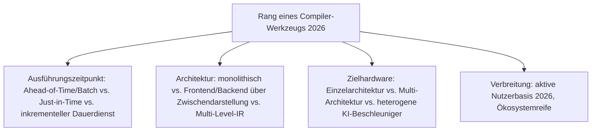
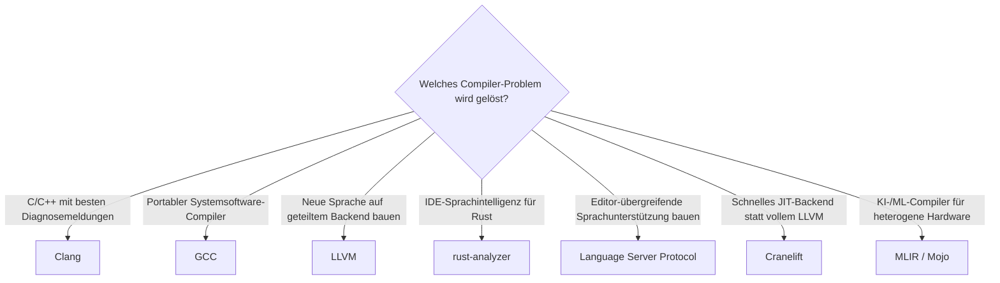

# Beste Compiler-Werkzeuge 2026 — Top-15-Topliste

Die [Evolution und Architekturen digitaler Compiler](evolution-digitaler-compiler.md) ordnet diese Werkzeuggattung chronologisch nach Architektur-Generation — von den ersten handgeschriebenen Übersetzern über systematisch generierte Parser, portable Multi-Sprachen-Backends und modulare, JIT-fähige Infrastruktur bis zum Compiler als Dauerdienst für Editoren und schließlich KI-nativer Infrastruktur für heterogene Hardware. Diese Seite übersetzt die Chronologie in eine **Momentaufnahme 2026**: 15 Werkzeuge, die heute tatsächlich betrieben werden.

!!! note "Hinweis: Architektur-Geschichte statt Praxis-Vergleich"
    Die praktischen Phasen (Preprocessing, Parsing, Codegenerierung, Linken) und der konkrete Umgang mit GCC/Clang/Rustc behandelt [Compiler: Übersetzen von Hochsprachen zu Maschinencode](compiler.md) — diese Seite rankt die Werkzeuge nach ihrer **architektonischen Bedeutung entlang der Generationen-Chronologie**.

---

## Bewertungskriterien

---

## Top 15 im Überblick

| Rang | Werkzeug | Generation | Rolle | Besondere Stärke |
|---|---|---|---|---|
| 1 | **LLVM** | 4 (Modulare Zwischendarstellung & JIT) | Compiler-Infrastruktur | Vollständig modulare Infrastruktur mit eigenständig dokumentierter Zwischendarstellung (LLVM IR) als geteiltes Produkt |
| 2 | **Clang** | 4 (Modulare Zwischendarstellung & JIT) | Compiler-Frontend | LLVM-Frontend für C/C++/Objective-C, deutlich schnellere Kompilierzeiten und bessere Diagnosen als GCC |
| 3 | **GCC** | 3 (Portable Multi-Sprachen-Backends) | Compiler | Freier, portabler Compiler für zahlreiche Sprachen über ein gemeinsames Backend, bis heute Standard für Systemsoftware |
| 4 | **rust-analyzer** | 5 (Der Compiler als Dauerdienst) | Sprachserver | Eigenständiger, inkrementeller Compiler-Frontend speziell für IDE-Nutzung, bewusst getrennt von `rustc` |
| 5 | **Language Server Protocol (LSP)** | 5 (Der Compiler als Dauerdienst) | Protokoll | Standardisiert die Kommunikation zwischen Editor und Compiler-Analyse-Dienst, ein Sprachserver bedient jeden LSP-fähigen Editor |
| 6 | **V8** | 4 (Modulare Zwischendarstellung & JIT) | JIT-Engine | Kompiliert JavaScript zur Laufzeit in nativen Maschinencode, macht performante Web-Anwendungen erst praktikabel |
| 7 | **MLIR** | 6 (KI-native Compiler-Infrastruktur) | Compiler-Infrastruktur | Erweitert die LLVM-Idee für ML-Compiler mit mehreren gleichzeitigen Abstraktionsebenen statt einer einzigen IR |
| 8 | **Mojo** | 6 (KI-native Compiler-Infrastruktur) | Sprache/Compiler | Direkt auf MLIR aufgebaut, explizit für KI-/ML-Workloads auf heterogener Hardware konzipiert |
| 9 | **Cranelift** | Ergänzung 2026 (Weiterentwicklung zu Generation 4) | Codegenerierungs-Backend | Rust-natives, schnell kompilierendes Backend, zunehmend als leichtgewichtige LLVM-Alternative für JIT-Szenarien (u. a. Wasmtime) |
| 10 | **Zig-Compiler** | Ergänzung 2026 (Weiterentwicklung zu Generation 4) | Compiler | Selbst-hostend mit eingebautem C/C++-Cross-Compiling, `comptime` als Alternative zu klassischem Makro-/Template-System |
| 11 | **Yacc** | 2 (Compiler-Theorie wird Wissenschaft) | Parser-Generator | Generiert automatisch einen Parser aus einer kontextfreien Grammatik, Namensgeber unzähliger späterer „yacc-artiger" Werkzeuge |
| 12 | **Lex** | 2 (Compiler-Theorie wird Wissenschaft) | Lexer-Generator | Generiert automatisch einen lexikalischen Analysierer aus regulären Ausdrücken, bis heute Standardvorbild |
| 13 | **A-0 System** | 1a (A-0 System — erster Compiler) | Compiler (historisch) | Grace Hoppers erster automatischer Übersetzer, konzeptionelle Wurzel jedes späteren Compilers |
| 14 | **FORTRAN** (Compiler) | 1b (FORTRAN — der erste optimierende Compiler) | Compiler (historisch) | Erster optimierender Compiler, widerlegte die Skepsis, automatisch generierter Code könne mit Assembler mithalten |
| 15 | **Algol 60 / BNF** | 1c (Algol 60 & BNF) | Formale Grammatik | Erste vollständig über Backus-Naur-Form spezifizierte Sprache, theoretischer Grundstein für Generation 2 |

---

## Highlights im Detail

### Rang 1–3, 6: die vier tragenden Compiler-Infrastrukturen 2026
LLVM, Clang, GCC und V8 bilden zusammen das Fundament, auf dem praktisch jede andere Zeile Software-Infrastruktur in diesem Repository letztlich läuft — LLVM als geteiltes Backend für Rustc und Swift, GCC als weiterhin dominanter Systemsoftware-Compiler, siehe [Generation 3–4](evolution-digitaler-compiler.md#generation-4-modulare-zwischendarstellung-just-in-time-llvm-clang-v8-2003-2008).

### Rang 4–5: der Compiler als Dauerdienst statt Einmalprozess
rust-analyzer und LSP zeigen, wie sich Compiler-Frontend-Analyse von einem Batch-Build-Schritt zu einem kontinuierlich laufenden IDE-Dienst gewandelt hat — dasselbe Grundprinzip, das [Beste Editoren 2026, Generation 5](editoren-2026-topliste.md) erst ermöglicht.

### Rang 7–10: KI-native und Rust-gestützte Weiterentwicklung
MLIR, Mojo, Cranelift und der Zig-Compiler zeigen zwei parallele moderne Trends — heterogene KI-Hardware-Unterstützung (MLIR/Mojo) und Rust als bevorzugte Implementierungssprache für neue Compiler-Infrastruktur (Cranelift), siehe [Generation 6](evolution-digitaler-compiler.md#generation-6-ki-native-compiler-infrastruktur-mlir-mojo-ab-2019).

---

## Entscheidungshilfe nach Baustellen-Typ

!!! tip "Tipp: Interpreter- und Debugger-Perspektive separat prüfen"
    Die komplementäre Ausführungsstrategie (direkte Ausführung statt vollständiger Übersetzung) behandelt [Beste Interpreter-Werkzeuge 2026](interpreter-2026-topliste.md); die Beobachtbarkeit laufender Programme [Beste Debugger-Werkzeuge 2026](debugger-2026-topliste.md).

---

## 🔗 Verwandte Themen

- [Startseite](../../index.md) — zurück zur Dokumentations-Zentrale
- [Evolution und Architekturen digitaler Compiler](evolution-digitaler-compiler.md) — chronologisches Generationenmodell, dessen aktuellen Stand diese Topliste zusammenfasst
- [Compiler: Übersetzen von Hochsprachen zu Maschinencode](compiler.md) — praktische Vertiefung: Phasen, GCC/Clang/Rustc im Vergleich
- [Beste Interpreter-Werkzeuge 2026 (Top 15)](interpreter-2026-topliste.md) — komplementäre Ausführungsstrategie
- [Beste Debugger-Werkzeuge 2026 (Top 15)](debugger-2026-topliste.md) — DWARF-Debug-Symbole als geteilter Berührungspunkt
- [Beste Editoren 2026 (Top 15)](editoren-2026-topliste.md) — LSP aus Rang 5 als Fundament der dortigen Generation 5
- [Beste Build-Systeme 2026 (Top 15)](build-systeme-2026-topliste.md) — orchestriert die hier gerankten Compiler-Aufrufe
- [Rust in der Praxis](rust-praxis.md) — Vertiefung zu Rustc und rust-analyzer
